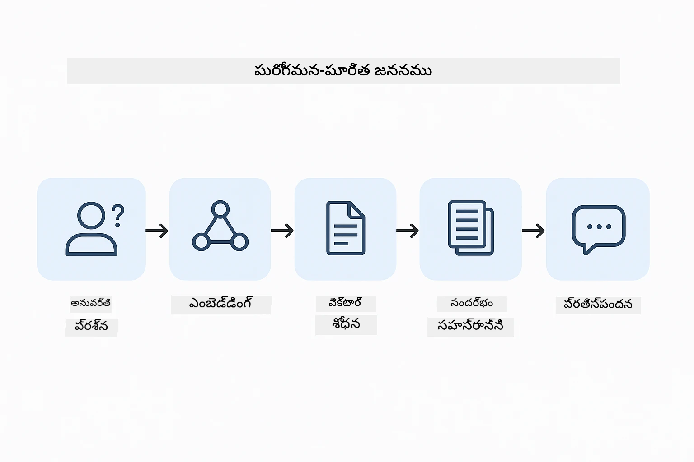
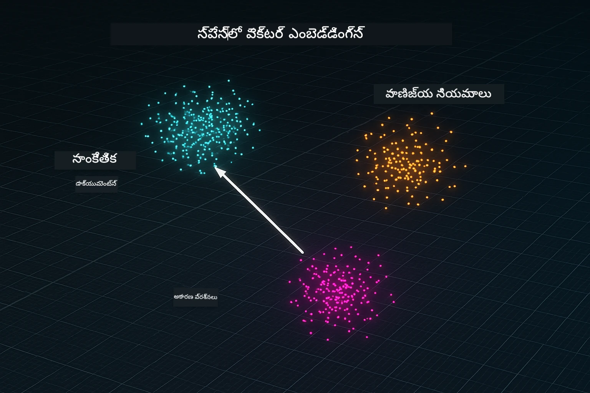
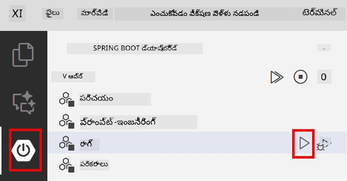
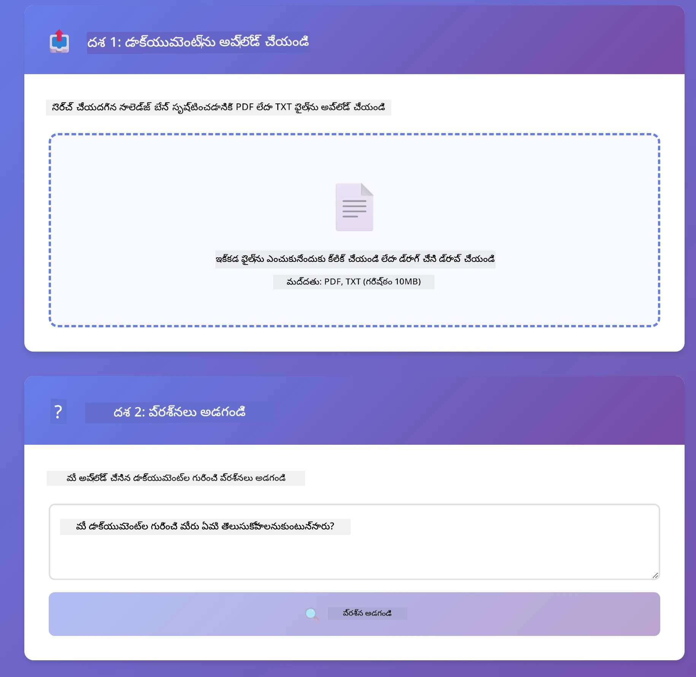
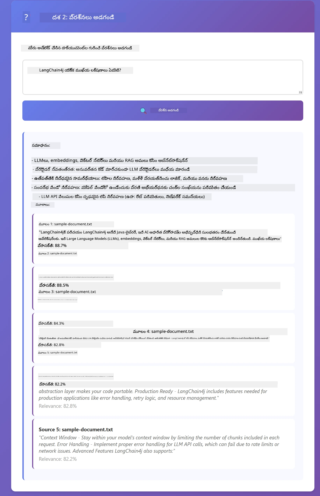

# Module 03: RAG (Retrieval-Augmented Generation)

## Table of Contents

- [Video Walkthrough](#video-walkthrough)
- [What You'll Learn](#what-youll-learn)
- [Prerequisites](#prerequisites)
- [Understanding RAG](#understanding-rag)
  - [Which RAG Approach Does This Tutorial Use?](#which-rag-approach-does-this-tutorial-use)
- [How It Works](#how-it-works)
  - [Document Processing](#document-processing)
  - [Creating Embeddings](#creating-embeddings)
  - [Semantic Search](#semantic-search)
  - [Answer Generation](#సమాధాన-ఉత్పత్తి)
- [Run the Application](#దరఖాస్తును-నడపండి)
- [Using the Application](#అప్లికేషన్‌ను-ఉపయోగించడం)
  - [Upload a Document](#డాక్యుమెంటు-అప్లోడ్-చేయండి)
  - [Ask Questions](#ప్రశ్నలు-అడగండి)
  - [Check Source References](#మూల-సూచనలను-తనిఖీ-చేయండి)
  - [Experiment with Questions](#ప్రశ్నలతో-ప్రయోగించండి)
- [Key Concepts](#ముఖ్య-భావనలు)
  - [Chunking Strategy](#భాగాల-కట్టడం-వ్యూహం)
  - [Similarity Scores](#సాదృశ్య-స్కోర్లు)
  - [In-Memory Storage](#ఇన్-మెమరీ-స్టోరేజ్)
  - [Context Window Management](#కాంటెక్స్ట్-విండి-నిర్వహణ)
- [When RAG Matters](#ఎప్పుడు-rag-ఉపయోగించాలి)
- [Next Steps](#తదుపరి-దశలు)

## Video Walkthrough

ఈ మాడ్యూల్‌తో ఎలా ప్రారంభం చేయాలో వివరిస్తున్న ఈ లైవ్ సెషన్‌ను చూడండి:

<a href="https://www.youtube.com/watch?v=_olq75ZH_eY"></a>

## What You'll Learn

మునుపటి మాడ్యూల్‌లలో, మీరు AIతో సంభాషణలు ఎలా చేసుకోవాలో, మరియు మీ ప్రాంప్‌లను సక్రమంగా ఎలా నిర్మించాలో నేర్చుకున్నారు. కానీ ఒక ప్రాథమిక పరిమితి ఉంది: భాషా మోడళ్లు కేవలం శిక్షణ సమయంలో నేర్చుకున్న విషయం మాత్రమే తెలుసుకుంటాయి. అవి మీ కంపెనీ పాలసీల గురించి, మీ ప్రాజెక్ట్ డాక్యుమెంటేషన్ గురించి, లేదా శిక్షణ చేయని ఏ సమాచారంపై ప్రశ్నలకు జవాబులు ఇవ్వలేవు.

RAG (Retrieval-Augmented Generation) ఈ సమస్యను పరిష్కరిస్తుంది. మోడల్తో మీ సమాచారాన్ని నేర్పించడానికి ప్రయత్నించడం (అది ఖర్చుతో కూడుకున్నది మరియు సూచించదగినది కాదు) బదులు, మీరు దానికి మీ డాక్యుమెంటులను శోధించే సామర్థ్యాన్ని ఇస్తారు. ఎవరైనా ప్రశ్న అడిగినప్పుడు, వ్యవస్థ సంబంధిత సమాచారాన్ని కనుగొంటుంది మరియు దానిని ప్రాంప్ట్‌లో చేర్చుతుంది. ఆ తరువాత మోడల్ ఆ తీసుకున్న సందర్భాన్ని ఆధారంగా జవాబు ఇస్తుంది.

RAGని మోడల్‌కు ఒక సూచనలు లైబ్రరీ ఇచ్చినట్లుగా நினைத்தుకోండి. మీరు ప్రశ్న అడిగినప్పుడు, వ్యవస్థ:

1. **వాడుకరి ప్రశ్న** - మీరు ప్రశ్న అడుగుతారు  
2. **ఎంబెడ్డింగ్** - మీ ప్రశ్నను ఒక వెక్టర్‌గా మారుస్తుంది  
3. **వెక్టర్ శోధన** - సమానమైన డాక్యుమెంట్ భాగాలను కనుగొంటుంది  
4. **సందర్భం సమాహరణ** - సంబంధిత భాగాలను ప్రాంప్ట్‌కు చేర్చుతుంది  
5. **జవాబు** - LLM సం‍దర్భాన్ని ఆధారంగా జవాబు తయారుచేస్తుంది  

ఇది మోడల్ యొక్క ప్రతిస్పందనలను మీరు కలిగించిన డేటాపై ఆధారపడి ఉండేలా చేస్తుంది, శిక్షణ జ్ఞానంపై ఆధారపడకుండా లేదా జవాబులు ఊహించకుండా.

## Prerequisites

- [Module 01 - పరిచయం](../01-introduction/README.md) పూర్తి చేశారా (Azure OpenAI వనరులు అమర్చబడ్డాయి, అందులో `text-embedding-3-small` embedding మోడల్ కూడా ఉన్నది)  
- రూట్ డైరెక్టరీలో `.env` ఫైల్ ఉండాలి, Azure క్రెడెన్షియల్స్‌తో (Module 01లో `azd up` ద్వారా రూపొందించబడింది)

> **గమనిక:** మీరు Module 01 పూర్తి చేయకపోతే, ముందుగా అక్కడని అమర్తనం సూచనలను అనుసరించండి. `azd up` ఆజ్ఞ GPT చాట్ మోడల్ మరియు ఈ మాడ్యూల్ ఉపయోగించే embedding మోడల్ రెండింటినీ అమర్చుతుంది.

## Understanding RAG

కింది చిత్రరూపం మూల భావనను చూపిస్తుంది: మోడల్ యొక్క శిక్షణ డేటాపై మాత్రమే ఆధారపడకుండా, RAG దానికి మీ డాక్యుమెంటుల సూచనలు లైబ్రరీని ఇస్తుంది, ప్రతిస్పందన రూపొందించే ముందు ఆ డాక్యుమెంటులను సంప్రదించడానికి.  


*ఈ చిత్రంలో సాధారణ LLM (శిక్షణ డేటా నుంచి అంచనా వేసే) మరియు RAG-సహాయపడిన LLM (ముందుగా మీ డాక్యుమెంటులను సంప్రదించే) మధ్య తేడాను చూపిస్తుంది.*

ఇక్కడ అన్ని భాగాలు ఎలా కలిసి పనిచేస్తాయో పూర్తి ప్రవాహం: వాడుకరి ప్రశ్న నాలుగు దశల ద్వారా ప్రవహిస్తుంది — ఎంబెడ్డింగ్, వెక్టర్ శోధన, సం‍దర్భం సమాహరణ, మరియు జవాబు సృష్టి — ప్రతి దశ ముందు దశపై ఆధారపడి ఉంటుంది:



*ఈ చిత్రంలో RAG పైప్‌లైన్ చివర వరకూ — వాడుకరి ప్రశ్న ఎంబెడ్డింగ్, వెక్టర్ శోధన, సం‍దర్భం సమాహరణ, మరియు జవాబు సృష్టి ద్వారా ప్రవహిస్తుంది.*

మిగతా ఈ మాడ్యూల్ అన్ని దశల్ని వివరంగా, మీరు రన్ చేసి మార్చుకోవచ్చునన్ని కోడ్‌తో చూపిస్తుంది.

### Which RAG Approach Does This Tutorial Use?

LangChain4j RAGని అమలు చేయడానికి మూడు విధానాలను అందిస్తుంది, వాటిలో ప్రతి ఒకటికి వేరే మామడ్పు స్థాయి ఉంటుంది. కింది చిత్రంలో వాటిని ఒకరి పక్కదారి చూపబడింది:


*ఈ చిత్రంలో మూడు LangChain4j RAG విధానాలను — సులభతరం (Easy), స్థానిక (Native), మరియు ప్రగతిషీల (Advanced) — వాటి ముఖ్యమైన భాగాలతో మరియు ఉపయోగిస్తే ఎప్పుడు అనేది చూపిస్తుంది.*

| విధానం | అది ఏం చేస్తుంది | వ్యత్యాసం |
|---|---|---|
| **సులభ RAG (Easy RAG)** | `AiServices` మరియు `ContentRetriever` ద్వారా అన్నీ ఆటోమాటిక్‌గా వైర్డ్ అవుతాయి. మీరు ఒక ఇంటర్‌ఫేస్‌ను అన్నొటేట్ చేసి, రీట్రైవర్‌ను జత చేస్తారు, మరియు LangChain4j ఎంబెడ్డింగ్, శోధన, మరియు ప్రాంప్ట్ సమాహరణను హ్యాండిల్ చేస్తుంది. | కనీసం కోడ్, కానీ ప్రతీ దశలో ఏం జరుగుతుందో మీరు చూడలేరి. |
| **స్థానిక RAG (Native RAG)** | మీరు embedding మోడల్‌ను పిలిచి, స్టోర్‌ను శోధించి, ప్రాంప్ట్‌ను నిర్మించి, జవాబు సృష్టి చేస్తారు — ఒక్క దశ ఒక్కసారి స్పష్టంగా. | ఎక్కువ కోడ్, కానీ ప్రతీ దశ కనిపిస్తుంది మరియు సవరించబడవచ్చు. |
| **ప్రగతిషీల RAG (Advanced RAG)** | `RetrievalAugmentor` ఫ్రేమ్‌వర్క్ ఉపయోగించి, క్వెరీ ట్రాన్స్‌ఫార్మర్స్, రూటర్స్, రీ-రాంకర్స్, మరియు కంటెంట్ ఇంజెక్టర్లతో ప్రొడక్షన్-గ్రేడ్ పైప్‌లైన్‌ల కోసం. | గరిష్ట నమ్యతరం, కాప్లెక్స్ ఎక్కువగా. |

**ఈ ట్యుటోరియల్ స్థానిక (Native) విధానాన్ని ఉపయోగిస్తుంది.** RAG పైప్‌లైన్‌లో ప్రతీ దశ — ప్రశ్న embedding, వెక్టర్ స్టోర్ శోధన, సం‍దర్భం సమాహరణ, మరియు జవాబు సృష్టి — [`RagService.java`](../../../03-rag/src/main/java/com/example/langchain4j/rag/service/RagService.java) లో స్పష్టంగా రాయబడ్డాయి. ఇది ఉద్దేశపూర్వకంగా చేయబడింది: ఒక నేర్చుకునే వనరు గా, మీకు ప్రతి దశను చూడటం మరియు అర్థం చేసుకోవడం మరింత ముఖ్యం, కోడ్‌ను తగ్గించడం కన్నా. మీరు భాగాలు ఎలా జతైనాయో సద్విగా అవగాహన పొందిన తర్వాత, సులభ RAG లేదా ప్రగతిషీల RAG వైపున మీరు మారవచ్చు.

> **💡 సులభ RAG గురించి ఆసక్తిగా ఉన్నారా?** LangChain4j లో మరో *సులభ RAG* విధానం ఉంది, ఇక్కడ `AiServices` మరియు `ContentRetriever` embedding, శోధన, మరియు ప్రాంప్ట్ సమాహరణను ఆటోమాటిక్‌గా నిర్వహిస్తాయి. ఈ మాడ్యూల్ స్పష్టమైన దారిని తీసుకుంది — ఆ పైప్‌లైన్‌ను విరించి ప్రతీ దశ తనిఖీ మరియు నియంత్రణకి యోగ్యంగా ఉంచడం.

కింది చిత్రం సులభ RAG పైప్‌లైన్‌ను చూపిస్తుంది. గమనించండి `AiServices` మరియు `EmbeddingStoreContentRetriever` అన్ని క్లిష్టతలను ఎలా దాచేస్తున్నారో — మీరు ఒక డాక్యుమెంట్‌ ని లోడ్ చేసి, రీట్రైవర్ జత చేసి, జవాబులు పొందుతారు. ఈ మాడ్యూల్‌లో ఉపయోగిస్తున్న స్థానిక విధానము ఆ దాచిన దశలను విరుస్తుంది:


*ఈ చిత్రం సులభ RAG పైప్‌లైన్‌ని చూపిస్తోంది. ఈ మాడ్యూల్ లో ఉపయోగించే స్థానిక విధానంతో పోల్చండి: సులభ RAG embedding, retrieval, మరియు prompt assemblyని `AiServices` మరియు `ContentRetriever` వెనువైపు దాచుతుంది — మీరు డాక్యుమెంట్ లోడ్ చేసి, రీట్రైవర్ జత చేసి, జవాబులు పొందుతారు. స్థానిక విధానం ఆ పైప్‌లైన్‌ను విరించి, మీరు ప్రతీ దశ (embed, search, assemble context, generate)ను స్వయంగా పిలవడానికి, పూర్తి దృశ్యత మరియు నియంత్రణ ఇవ్వటానికి అనుకూలంగా ఉంటుంది.*

## How It Works

ఈ మాడ్యూల్‌లో RAG పైప్‌లైన్ ప్రతి సారి వాడుకరి ప్రశ్న అడిగినప్పుడు నాలుగు దశలుగా అమలు అవుతుంది. మొదట, అప్‌లోడ్ చేసిన డాక్యుమెంట్ **పార్స్ చేసి చంక్స్‌గా విభజించబడుతుంది** — మోడల్ యొక్క సదుపయోగ విండోలో సౌకర్యవంతంగా సరిపోయే ఒక చిన్న భాగాలుగా. ఆ భాగాలు కొంతమేర ఒకదానితో పాటు పొడవుగా ఉంటాయి, అందువల్ల సరిహద్దుల్లో సం‍దర్భం కోల్పోకూడదు.

తర్వాత ఆ చంక్‌లు **వెక్టర్ ఎంబెడ్డింగ్స్‌గా** మార్పు చెయ్యబడతాయి మరియు గణితపరంగా పోల్చుకునేలా నిల్వ చేయబడతాయి. ప్రశ్న వచ్చినప్పుడు, వ్యవస్థ **సెమెంటిక్ శోధన** (అర్ధం ఆధారిత శోధన) చేస్తుంది సంబంధిత భాగాలను కనుగొనడానికి, చివరగా ఆ భాగాలను సం‍దర్భంగా LLMకి పాసు చేసి **జవాబు సృష్టి** జరుగుతుంది. కింది విభాగాలు ప్రతి దశను ప్రత్యక్ష కోడ్ మరియు చిత్రాలతో వివరించి చూపిస్తాయి. మొదటి దశను చూద్దాం.

### Document Processing

[DocumentService.java](../../../03-rag/src/main/java/com/example/langchain4j/rag/service/DocumentService.java)

మీరు ఒక డాక్యుమెంట్‌ను అప్‌లోడ్ చేసినప్పుడు, వ్యవస్థ దాన్ని పార్స్ చేస్తుంది (PDF లేదా సాధారణ టెక్స్ట్), ఫైల్ పేర్లాంటి మెటాడేటా జత చేస్తుంది, అప్పుడు దానిని చంక్స్ గా విభజిస్తుంది — మోడల్ సదుపయోగ విండోలో బాగా సరిపోయే చిన్న భాగాలుగా. ఈ చంక్స్ కొద్దిగా ఒకదానితో పొడవుగా ఉంటాయి, అందువల్ల సరిహద్దుల్లో సం‍దర్భం కోల్పోదు.

```java
// అప్‌లోడ్ చేసిన ఫైల్నీ వాచించి LangChain4j డాక్యుమెంట్‌లో చేర్పించండి
Document document = Document.from(content, metadata);

// 300-టోకెన్ భాగాలుగా విడగొట్టి 30-టోకెన్ ఓవర్ల్యాప్‌తో చేసి
DocumentSplitter splitter = DocumentSplitters
    .recursive(300, 30);

List<TextSegment> segments = splitter.split(document);
```
  
కింది చిత్రం దీన్ని దృష్టాంతంగా చూపిస్తుంది. ప్రతి చంక్ తన పొరుగువారితో కొన్ని టోకెన్స్ పంచుకుంటుంది — 30-టోకెన్ ఒవర్‌లాప్ సారి 중요한 సంతర్భం విరుగుడుల మధ్యపడకుండా చూచుతుంది:


*ఈ చిత్రం డాక్యుమెంట్‌ను 300-టోకెన్ చంక్స్‌గా విభజించడం, 30-టోకెన్ ఒవర్‌లాప్ తో, చంక్ సరిహద్దుల్లో సం‍దర్భాన్ని సంరక్షించడం చూపిస్తుంది.*

> **🤖 [GitHub Copilot](https://github.com/features/copilot) చాట్‌తో ప్రయత్నించండి:** [`DocumentService.java`](../../../03-rag/src/main/java/com/example/langchain4j/rag/service/DocumentService.java)ను ఓపెన్ చేసి అడగండి:  
> - "LangChain4j ఎలా డాక్యుమెంట్లను చంక్స్‌గా భాగించిందో మరియు ఒవర్‌లాప్ ఎందుకు ముఖ్యం?"  
> - "వివిధ రకాల డాక్యుమెంట్ల కోసం ఉత్తమ చంక్ పరిమాణం ఏమిటి మరియు ఎందుకు?"  
> - "అनेक భాషలలో ఉన్న డాక్యుమెంట్లు లేదా ప్రత్యేక ఫార్మాటింగ్ ఉన్న డాక్యుమెంట్లను ఎలా హ్యాండిల్ చేయాలి?"

### Creating Embeddings

[LangChainRagConfig.java](../../../03-rag/src/main/java/com/example/langchain4j/rag/config/LangChainRagConfig.java)

ప్రతి చంక్ సంఖ్యల్లో అనువాదం అవుతుంది, దీనిని ఎంబెడ్డింగ్ అంటారు — అంటే భావం నుంచి సంఖ్యలకు మార్పిడి. embedding మోడల్ చాట్ మోడల్ లాగా "తెలివైనది" కాదు; ఇది ఆదేశాలు పాటించగలదు, కారణం చెప్పగలదు లేదా ప్రశ్నలకు జవాబు ఇవ్వగలదు కాదు. కానీ ఇది టెక్స్ట్‌ను గణిత స్థానంలోకి మ్యాప్ చేస్తుంది, ఇక్కడ సమానమైన అర్థాలు సమీపంలో ఉంటాయి — "కారు" సమీపంలో "ఆటోమొబైల్," "రిఫండ్ పాలసీ" సమీపంలో "నా డబ్బు తిరిగి ఇవ్వండి." చాట్ మోడల్‌ను మీరు మాట్లాడగల వ్యక్తిగా భావించండి; embedding మోడల్ ఒక అద్భుతమైన శ్రేణీకరణ వ్యవస్థ.

కింది చిత్రం ఈ భావనను చూపిస్తుంది — టెక్స్ట్ ఇన్ అవుతుంది, సంఖ్యల వెక్టార్లు అవతరిల్లతాయి, మరియు సమాన అర్థాలు సమీప వెక్టర్‌లను ఉత్పత్తి చేస్తాయి:


*ఈ చిత్రంలో embedding మోడల్ టెక్స్ట్‌ను సంఖ్యల వెక్టార్లగా మారుస్తుంది, సమాన భావాలు — ఉదా: "కారు" మరియు "ఆటోమొబైల్" — సమీపంలో ఉంటాయనే చూపిస్తుంది.*

```java
@Bean
public EmbeddingModel embeddingModel() {
    return OpenAiOfficialEmbeddingModel.builder()
        .baseUrl(azureOpenAiEndpoint)
        .apiKey(azureOpenAiKey)
        .modelName(azureEmbeddingDeploymentName)
        .build();
}

EmbeddingStore<TextSegment> embeddingStore = 
    new InMemoryEmbeddingStore<>();
```
  
కింది తరగతి చిత్రంలో RAG పైప్‌లైన్‌లో రెండు వేర్వేరు ప్రవాహాలు మరియు వాటిని అమలు చేసే LangChain4j తరగతులు చూపబడ్డాయి. **ఇన్జెస్ట్షన్ ప్రవాహం** (అప్‌లోడ్ సమయంలో ఒకసారి) డాక్యుమెంట్ను విడగొట్టి, చంక్స్‌ను ఎంబెడ్ చేసి, `.addAll()` ద్వారా నిల్వ చేస్తుంది. **క్వెరీ ప్రవాహం** (ప్రతి సారి వాడుకరి అడిగినప్పుడు) ప్రశ్నను ఎంబెడ్ చేసి, `.search()` ద్వారా స్టోర్‌ను శోధించి, సరిపోయిన సం‍దర్భాన్ని చాట్ మోడల్‌కు పంపిస్తుంది. ఇద్దరు ప్రవాహాలు `EmbeddingStore<TextSegment>` ఇంటర్‌ఫేస్‌లో కలుస్తాయి:


*ఈ చిత్రంలో RAG పైప్‌లైన్‌లో రెండు ప్రవాహాలు — ఇన్జెస్ట్షన్ మరియు క్వెరీ — మరియు అవి భాగంగా ఉన్న EmbeddingStore ద్వారా ఎలా కలిసిపోతున్నాయో చూపిస్తుంది.*

ఎంబెడ్డింగ్స్ నిల్వ చేసిన తరువాత, సమాన కంటెంట్ సహజంగా వెక్టర్ స్థలంలో సమీపంగా క్లస్టర్ అవుతుంది. కింది విజువలైజేషన్ వివిధ టాపిక్స్ చెందిన డాక్యుమెంట్లు సమీప బిందువులుగా ఎలా మారుతున్నాయో చూపిస్తుంది, ఇది సెమెంటిక్ శోధన సాధ్యం కావడానికి మూల కారణం:



*ఈ విజువలైజేషన్‌లో సంబంధిత డాక్యుమెంట్లు 3D వెక్టర్ స్పేస్‌లో కలస్టర్ అవుతున్నాయి, టెక్నికల్ డాక్స్, బిజినెస్ రూల్స్, FAQs వంటి విభాగాలతో వేర్వేరు గ్రూపులను ఏర్పరుస్తున్నాయి.*

వాడుకరి శోధించినప్పుడు, వ్యవస్థ నాలుగు దశలను అనుసరిస్తుంది: డాక్యుమెంట్లను ఒకసారి ఎంబెడ్ చేయండి, ప్రతి శోధనా సమయంలో ప్రశ్నను ఎంబెడ్ చేయండి, ప్రశ్న వెక్టర్‌ను నిల్వ వెక్టర్‌లతో కోసైన్ సాదృశ్యం ఉపయోగించి పోల్చండి, మరియు టాప్-K అత్యధిక స్కోర్ల చంక్స్‌ను తిరిగి ఇవ్వండి. కింది చిత్రం ప్రతి దశను మరియు అందులో పాల్గొన్న LangChain4j తరగతులను చూపిస్తుంది:


*ఈ చిత్రంలో నాలుగు-దశల ఎంబెడ్డింగ్ శోధన ప్రక్రియ చూపబడింది: డాక్యుమెంట్లను ఎంబెడ్ చేయడం, ప్రశ్నను ఎంబెడ్ చేయడం, కోసైన్ సాదృశ్యంతో వెక్టర్‌లను పోల్చడం, మరియు టాప్-K ఫలితాలు ఇవ్వడం.*

### Semantic Search

[RagService.java](../../../03-rag/src/main/java/com/example/langchain4j/rag/service/RagService.java)

మీరు ప్రశ్న అడిగినా, మీ ప్రశ్న కూడా ఎంబెడ్డింగ్‌గా మారుతుంది. వ్యవస్థ మీ ప్రశ్న యొక్క ఎంబెడ్డింగ్ ను డాక్యుమెంట్ చంక్స్ అందరి ఎంబెడ్డింగ్స్ తో పోల్చుతుంది. ఇది చాలా సమాన అర్థాల గల భాగాలను కనుగొంటుంది — కీవర్డ్స్ మాత్రమే కాకుండా, నిజమైన సెమెంటిక్ సాదృశ్యాన్ని కూడా.

```java
Embedding queryEmbedding = embeddingModel.embed(question).content();

EmbeddingSearchRequest searchRequest = EmbeddingSearchRequest.builder()
    .queryEmbedding(queryEmbedding)
    .maxResults(5)
    .minScore(0.5)
    .build();

EmbeddingSearchResult<TextSegment> searchResult = embeddingStore.search(searchRequest);
List<EmbeddingMatch<TextSegment>> matches = searchResult.matches();

for (EmbeddingMatch<TextSegment> match : matches) {
    String relevantText = match.embedded().text();
    double score = match.score();
}
```
  
కింది చిత్రం సంప్రదాయ కీవర్డ్ శోధనతో సెమెంటిక్ శోధనను పోల్చుతుంది. "వాహనం"కి కీవర్డ్ శోధన "కార్లు మరియు ట్రక్స్" గురించి ఉన్న భాగాన్ని మిస్ చేస్తుంది, కానీ సెమెంటిక్ శోధన అదే అర్థం అని అర్థం చేసుకొని దానిని అత్యధిక స్కోరు గల ఫలితంగా ఇస్తుంది:


*ఈ చిత్రం కీవర్డ్ ఆధారిత శోధన మరియు సెమెంటిక్ శోధన మధ్య తేడాను చూపిస్తుంది, సెమెంటిక్ శోధన అర్ధం ఆధారంగా సంబంధిత కంటెంట్‌ను తెస్తుంది, నిజమైన కీవర్డ్‌లు భిన్నంగా ఉన్నా కూడా.*

దేశ్కి లో, సమానత్వమైనదాన్ని కొలవడానికి కోసైన్ సాదృశ్యం ఉపయోగిస్తారు — అది "ఈ రెండు ఎర్రాళ్ళు అదే దిశకు చూపిస్తున్నాయా?" అని అడగడం లాంటిదే. రెండు చంక్స్ పూర్తిగా వేర్వేరు పదాలు ఉపయోగించవచ్చు, కానీ అవి ఒకే ఆలోచన ఉంటే వారి వెక్టర్‌లు ఒకే దిశలో ఉంటాయి మరియు 1.0 కి సమీపంగా స్కోరు పొందుతాయి:


*ఈ చిత్రణ ఎంబెడ్డింగ్ వెక్టర్ల మధ్య కోసైన్ సాదృశ్యాన్ని కోణంగా చూపిస్తుంది — ఎక్కువ సారూప్యత కలిగిన వెక్టర్లు 1.0కి దగ్గరగా స్కోరు పొందుతాయి, ఇది ఉన్నతమైన సార్ధక సాదృశ్యాన్ని సూచిస్తుంది.*

> **🤖 [GitHub Copilot](https://github.com/features/copilot) చాట్‌తో ప్రయత్నించండి:** [`RagService.java`](../../../03-rag/src/main/java/com/example/langchain4j/rag/service/RagService.java) ని తెరిచి అడగండి:
> - "ఎంబెడ్డింగ్స్‌తో సాదృశ్య శోధన ఎలా పనిచేస్తుంది మరియు స్కోరును ఏమి నిర్ణయిస్తుంది?"
> - "ఏ సాదృశ్య సరిహద్దును నేను ఉపయోగించాలి మరియు ఇది ఫలితాలపై ఎలా ప్రభావం చూపుతుంది?"
> - "సంబంధిత డాక్యుమెంట్లు కనిపించని సందర్భాలలో నేను ఎలా నిర్వహించాలి?"

### సమాధాన ఉత్పత్తి

[RagService.java](../../../03-rag/src/main/java/com/example/langchain4j/rag/service/RagService.java)

అత్యంత సంబంధిత భాగాలు స్పష్టమైన నియమాలు, తిరిగి పొందిన సందర్భం, మరియు వినియోగదారు ప్రశ్నను కలిగి ఉన్న నిర్మిత ప్రాంప్ట్‌గా సమీకరించబడతాయి. మోడల్ ఆ ప్రత్యేక భాగాలను చదువుతూ ఆ సమాచారంపై ఆధారపడి సమాధానం ఇస్తుంది — ఇది ముందున్న సమాచారాన్నే ఉపయోగిస్తుంది, ఇది కల్పనను నిలిపివేస్తుంది.

```java
String context = matches.stream()
    .map(match -> match.embedded().text())
    .collect(Collectors.joining("\n\n"));

String prompt = String.format("""
    Answer the question based on the following context.
    If the answer cannot be found in the context, say so.

    Context:
    %s

    Question: %s

    Answer:""", context, request.question());

String answer = chatModel.chat(prompt);
```

క్రింది диаграм ఈ సమీకరణను చూపిస్తుంది — శోధన దశ నుండి టాప్-స్కోరైన భాగాలు ప్రాంప్ట్ టెంప్లేట్‌లో చేర్చబడతాయి, మరియు `OpenAiOfficialChatModel` ఒక నిర్ధారిత సమాధానాన్ని రూపొందిస్తుంది:


*ఈ చిత్రణ టాప్-స్కోరైన భాగాలు ఎలా నిర్మిత ప్రాంప్ట్‌గా సమీకరించబడతాయో చూపిస్తుంది, ఇది మోడల్‌కు మీ డేటా నుండి ఆధారిత సమాధానం ఇవ్వడాన్ని వీలు చేస్తుంది.*

## దరఖాస్తును నడపండి

**డిప్లాయ్ మెంట్‌ను ధృవీకరించండి:**

మూల డైరెక్టరీలో Azure క్రెడెన్షియల్స్‌తో `.env` ఫైలు ఉన్నదని నిర్ధారించండి (మాడ్యూల్ 01 సమయంలో సృష్టించబడింది). ఈ మాడ్యూల్ డైరెక్టరీ నుండి ఈ క్రింద అమలు చేయండి (`03-rag/`):

**Bash:**
```bash
cat ../.env  # AZURE_OPENAI_ENDPOINT, API_KEY, DEPLOYMENT చూపించాలి
```

**PowerShell:**
```powershell
Get-Content ..\.env  # AZURE_OPENAI_ENDPOINT, API_KEY, DEPLOYMENT చూపించాలి
```

**అప్లికేషన్‌ను ప్రారంభించండి:**

> **గమనిక:** మీరు ఇప్పటికే మూల డైరెక్టరీలోని `./start-all.sh` ఉపయోగించి అన్ని అప్లికేషన్లను ప్రారంభించినట్లయితే (మాడ్యూల్ 01లో వివరించబడింది), ఈ మాడ్యూల్ ఇప్పటికే పోర్ట్ 8081 నడుస్తోంది. మీరు క్రింది స్టార్ట్ కమాండ్లను దాటవేసి నేరుగా http://localhost:8081 వెళ్ళవచ్చు.

**ఎంపిక 1: స్ప్రింగ్ బూట్ డ్యాష్‌బోర్డ్ ఉపయోగించడం (VS కోడ్ వినియోగదారులకు సిఫార్సు)**

డెవ్ కంటెయినర్ స్ప్రింగ్ బూట్ డ్యాష్‌బోర్డ్ ఎక్స్టెన్షన్‌ను కలిగి ఉంటుంది, ఇది అన్ని స్ప్రింగ్ బూట్ అప్లికేషన్లను నిర్వహించడానికి విజువల్ ఇంటర్‌ఫేస్ అందిస్తుంది. దీనిని VS కోడ్ లో డెవలప్మెంట్ బార్(Activity Bar) ఎడమవైపున స్ప్రింగ్ బూట్ చిహ్నం వద్ద చూడవచ్చు.

స్ప్రింగ్ బూట్ డ్యాష్‌బోర్డ్ నుండి మీరు:
- వర్క్‌స్పేస్‌లో అందుబాటులో ఉన్న అన్ని స్ప్రింగ్ బూట్ అప్లికేషన్లను చూడవచ్చు
- ఒక క్లిక్‌లో అనువర్తనాలను ప్రారంభించగలరు లేదా ఆపగలరు
- అప్లికేషన్ లాగ్స్‌ను రియల్ టైమ్‌లో వీక్షించవచ్చు
- అప్లికేషన్ స్థితిని పర్యవేక్షించవచ్చు

"rag" పక్కన ఉన్న ప్లే బటన్ పై క్లిక్ చేయడం ద్వారా ఈ మాడ్యూల్‌ను ప్రారంభించండి లేదా అన్ని మాడ్యూల్స్‌ను ఒకదానితో పాటు ప్రారంభించండి.



*ఈ స్క్రీన్‌షాట్ VS కోడ్‌లో స్ప్రింగ్ బూట్ డ్యాష్‌బోర్డ్‌ను చూపిస్తుంది, ఇక్కడ మీరు అప్లికేషన్లను విజువల్‌గా ప్రారంభించి, ఆపేందుకు, పర్యవేక్షించేందుకు পারেন.*

**ఎంపిక 2: షెల్ స్క్రిప్ట్స్ ఉపయోగించడం**

అన్ని వెబ్ అప్లికేషన్లను ప్రారంభించండి (మాడ్యూల్స్ 01-04):

**Bash:**
```bash
cd ..  # రూట్ డైరెక్టరీ నుండి
./start-all.sh
```

**PowerShell:**
```powershell
cd ..  # రూట్ డైరెక్టరీ నుండి
.\start-all.ps1
```

లేదా ఈ మాడ్యూల్‌ను మాత్రమే ప్రారంభించండి:

**Bash:**
```bash
cd 03-rag
./start.sh
```

**PowerShell:**
```powershell
cd 03-rag
.\start.ps1
```

రూట్ `.env` ఫైల్ నుండి వాతావరణ փոփոխనాలను స్వయంచాలకంగా లోడ్ చేస్తాయి మరియు అవసరమైతే JARలను నిర్మిస్తాయి.

> **గమనిక:** మీరు ప్రారంభించే ముందు అన్ని మాడ్యూల్స్‌ను మానవీయంగా నిర్మించాలనుకుంటే:
>
> **Bash:**
> ```bash
> cd ..  # Go to root directory
> mvn clean package -DskipTests
> ```
>
> **PowerShell:**
> ```powershell
> cd ..  # Go to root directory
> mvn clean package -DskipTests
> ```

మీ బ్రౌజర్‌లో http://localhost:8081 ఓపెన్ చేయండి.

**నిర్మూలన:**

**Bash:**
```bash
./stop.sh  # ఈ మాడ్యూల్ మాత్రమే
# లేదా
cd .. && ./stop-all.sh  # అన్ని మాడ్యూల్స్
```

**PowerShell:**
```powershell
.\stop.ps1  # ఈ మాడ్యూల్ మాత్రమే
# లేదా
cd ..; .\stop-all.ps1  # అన్ని మాడ్యూల్స్
```

## అప్లికేషన్‌ను ఉపయోగించడం

అప్లికేషన్ డాక్యుమెంటు అప్లోడ్ మరియు ప్రశ్నించడం కోసం వెబ్ ఇంటర్‌ఫేస్ అందిస్తుంది.

<a href="images/rag-homepage.png"></a>

*ఈ స్క్రీన్‌షాట్ RAG అప్లికేషన్ ఇంటర్‌ఫేస్ ని చూపిస్తుంది, ఇక్కడ మీరు డాక్యుమెంట్లను అప్లోడ్ చేసి ప్రశ్నలు అడగవచ్చు.*

### డాక్యుమెంటు అప్లోడ్ చేయండి

ముందుగా ఒక డాక్యుమెంటును అప్లోడ్ చేయండి - పరీక్ష కోసం TXT ఫైల్స్ బాగుంటాయి. ఈ డైరెక్టరీలో ఒక `sample-document.txt` అందుబాటులో ఉంది, ఇది LangChain4j ఫీచర్లు, RAG అమలు మరియు ఉత్తమ పద్ధతుల గురించి సమాచారాన్ని కలిగి ఉంది - సిస్టమ్ ని పరీక్షించడానికి పర్ఫెక్ట్.

సిస్టమ్ మీ డాక్యుమెంటును ప్రాసెస్ చేసి, దాన్ని భాగాలుగా విభజిస్తుంది మరియు ప్రతి భాగం కోసం ఎంబెడ్డింగ్స్ సృష్టిస్తుంది. ఇది మీరు అప్లోడ్ చేసిన వెంటనే ఆటోమాటిక్‌గా జరుగుతుంది.

### ప్రశ్నలు అడగండి

ఇప్పుడు డాక్యుమెంటు విషయంపై నిర్దిష్ట ప్రశ్నలు అడగండి. డాక్యుమెంటులో స్పష్టంగా చెప్పిన వాస్తవ విషయాలను ప్రయోగించండి. సిస్టమ్ సంబంధిత భాగాలను శోధించి, వాటిని ప్రాంప్ట్‌లో చేర్చిపెట్టి సమాధానం రూపొందిస్తుంది.

### మూల సూచనలను తనిఖీ చేయండి

ప్రతి సమాధానంలో సాదృశ్య స్కోర్లు ఉన్న మూల సూచనలు ఉంటాయి. ఈ స్కోర్లు (0 నుండి 1 వరకు) మీ ప్రశ్నకు ప్రతి భాగం ఎంత సంబంధితమో చూపిస్తాయి. ఎక్కువ స్కోర్లు మంచి సరిపోడం సూచిస్తాయి. ఇది మీరు సమాధానాన్ని మూల పదార్థంతో సరిపోల్చుకోవడానికి సహాయపడుతుంది.

<a href="images/rag-query-results.png"></a>

*ఈ స్క్రీన్‌షాట్ ప్రశ్న ఫలితాలను, ఉత్పన్నమైన సమాధానం, మూల సూచనలు మరియు ప్రతి వెతికిన భాగం యొక్క సంబంధిత స్కోర్లను చూపిస్తుంది.*

### ప్రశ్నలతో ప్రయోగించండి

భిన్న రకాల ప్రశ్నలను ప్రయత్నించండి:
- నిర్దిష్ట వాస్తవాలు: "ప్రధాన విషయం ఏమిటీ?"
- పోలికలు: "X మరియు Y మధ్య తేడా ఏమిటి?"
- సారాంశాలు: "Z గురించి ముఖ్యాంశాలను సంగ్రహించండి"

మీ ప్రశ్న డాక్యుమెంటు విషయంతో ఎంత సరిపోతుందో ఆధారంగా సంబంధిత స్కోర్లు ఎలా మారుతాయో చూడండి.

## ముఖ్య భావనలు

### భాగాల కట్టడం వ్యూహం

డాక్యుమెంట్లను 300-టోకెన్ భాగాలుగా విడగొడతారు, వాటి మధ్య 30 టోకెన్ల ఓవర్‌లాప్ ఉంటుంది. ఈ సమతులనం ప్రతి భాగానికి అర్ధంవంతమైన సందర్భం ఉండేలా చూసుకుంటుంది, ఒకే ప్రాంప్ట్‌లో బహుళ భాగాలను చేర్చడానికి పరిమితి పాటిస్తూ.

### సాదృశ్య స్కోర్లు

ప్రతి వెతికిన భాగానికి 0 నుండి 1 మధ్య ఒక సాదృశ్య స్కోరు ఉంటుంది, ఇది వినియోగదారు ప్రశ్నను ఎంత దగ్గరగా సరిపోల్చిందో సూచిస్తుంది. క్రింది చిత్రణ స్కోర్ పరిధులను మరియు సిస్టమ్ వాటిని ఫలితాల ఫిల్టరింగ్ కోసం ఎలా ఉపయోగిస్తుందో చూపిస్తుంది:


*ఈ చిత్రణ 0 నుండి 1 వరకు స్కోర్ పరిధులను, మరియు 0.5 కనిష్ఠ సరిహద్దును చూపిస్తుంది, ఇది సంబంధంలేని భాగాలను వడపోత చేస్తుంది.*

స్కోర్లు 0 నుండి 1 వరకు ఉంటాయి:
- 0.7-1.0: అత్యంత సంబంధితమైన, ఖచ్చిత సరిపోలింపు
- 0.5-0.7: సంబంధిత, మంచి సందర్భం
- 0.5కన్నా తక్కువ: వడపోత, చాలా భిన్నమైనది

నాణ్యతను నిర్ధారించేందుకు సిస్టమ్ కనీస సరిహద్దు పై భాగాలను మాత్రమే తెస్తుంది.

ఎంబెడ్డింగ్స్ అర్థం క్లస్టర్లుగా స్పష్టంగా చెల్లి పనిచేస్తాయి, కానీ వీటికి బ్లైండ్ స్పాట్స్ ఉంటాయి. క్రింది చిత్రణ సాధారణ వైఫల్యాలను చూపిస్తుంది — పెద్ద భాగాలు ముట్టడి వెక్టర్లను కలిగిస్తాయి, చిన్న భాగాలు సందర్భం లేకుండా ఉంటాయి, సందిగ్ధ పదాలు బహుళ క్లస్టర్లకు సూచిస్తాయి, ఖచ్చిత-సరిపోలింపు లుక్అప్స్ (IDs, భాగ నంబర్లు) ఎంబెడ్డింగ్స్‌తో పనిచరించవు:


*ఈ చిత్రణ సాధారణ ఎంబెడ్డింగ్ వైఫల్యాలను చూపిస్తుంది: చాలా పెద్ద భాగాలు, చాలా చిన్న భాగాలు, బహుళ క్లస్టర్లను సూచించే సందిగ్ధ పదాలు, మరియు IDs వంటి ఖచ్చిత సరిపోలింపు లుక్అప్స్.*

### ఇన్-మెమరీ స్టోరేజ్

ఈ మాడ్యూల్ సరళత కోసం ఇన్-మెమరీ స్టోరేజ్ ను ఉపయోగిస్తుంది. మీరు అప్లికేషన్‌ను మళ్లీ ప్రారంభించినప్పుడు, అప్లోడ్ చేసిన డాక్యుమెంట్లు నశిస్తాయి. ఉత్పత్తి వ్యవస్థలు Qdrant లేదా Azure AI Search వంటి స్థిరమైన వెక్టర్ డేటాబేస్‌లను ఉపయోగిస్తాయి.

### కాంటెక్స్ట్ విండి నిర్వహణ

ప్రతి మోడల్‌కు గరిష్ట కాంటెక్స్ట్ విండో ఉంటుంది. ఒక పెద్ద డాక్యుమెంటు నుండి అన్నీ భాగాలను చేర్చలేరు. సిస్టమ్ టాప్ N అత్యంత సంబంధిత భాగాలను (డిఫాల్ట్ 5) తెస్తుంది, పరిమితులలో ఉండటం మరియు ఖచ్చితమైన సమాధానాలకు తగినంత సందర్భం అందించడం కోసం.

## ఎప్పుడు RAG ఉపయోగించాలి

RAG ప్రతిసారీ సరైన దారినైనది కాదు. క్రింది నిర్ణయ మార్గదర్శకంతో మీరు ఎప్పుడు RAG విలువ కలిగిస్తుందో లేదా ఎప్పుడు సాదారణ విధానాలు - ప్రాంప్ట్‌లో కంటెంట్ చేర్చడం లేదా మోడల్ బిల్ట్-ఇన్ పరిజ్ఞానం ఆధారపడి ఉండటం - సరిపోతాయో తెలుసుకోవచ్చు:


*ఈ చిత్రణ RAG ఎప్పుడు విలువ జోడిస్తుందో, మరియు ఎప్పుడు సాదా విధానాలు సరిపోతాయో చూపించే నిర్ణయ మార్గదర్శకం.*

## తదుపరి దశలు

**తదుపరి మాడ్యూల్:** [04-tools - టూల్స్‌తో AI ఏజెంట్స్](../04-tools/README.md)

---

**నావిగేషన్:** [← మునుపటి: మాడ్యూల్ 02 - ప్రాంప్ట్ ఇంజనీరింగ్](../02-prompt-engineering/README.md) | [మొదటికి తిరిగి](../README.md) | [తదుపరి: మాడ్యూల్ 04 - టూల్స్ →](../04-tools/README.md)

---

<!-- CO-OP TRANSLATOR DISCLAIMER START -->
**అస్వీకరణ**:
ఈ పత్రం AI అనువాద సేవ [Co-op Translator](https://github.com/Azure/co-op-translator) ఉపయోగించి అనువదించబడింది. మేము ఖచ్చితత్వానికి ప్రయత్నిస్తున్నప్పటికీ, ఆటోమేటెడ్ అనువాదాలు తప్పులు లేదా అసమగ్రతలను కలిగి ఉండవచ్చు. దాని స్వదేశ భాషలో ఉన్న అసలు పత్రాన్ని అధికారం కలిగిన మూలంగా పరిగణించాలి. కీలకమైన సమాచారం కోసం, ప్రొఫెషనల్ మానవ అనువాదాన్ని సిఫారసు చేస్తాము. ఈ అనువాదం ఉపయోగం వల్ల కలిగే ఏవైనా అపార్థాలు లేదా తప్పుదారులు కోసం మేము బాధ్యత వహించము.
<!-- CO-OP TRANSLATOR DISCLAIMER END -->