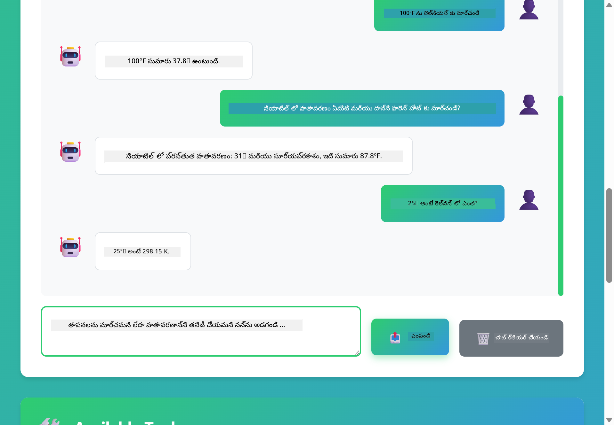

<!--
CO_OP_TRANSLATOR_METADATA:
{
  "original_hash": "13ec450c12cdd1a863baa2b778f27cd7",
  "translation_date": "2025-12-31T07:49:23+00:00",
  "source_file": "04-tools/README.md",
  "language_code": "te"
}
-->
# Module 04: టూల్స్‌తో AI ఏజెంట్లు

## విషయ సూచిక

- [మీరు నేర్చుకునేది](../../../04-tools)
- [అవసరమైన ముందు పరిజ్ఞానం](../../../04-tools)
- [టూల్స్‌తో AI ఏజెంట్లను అర్థం చేసుకోవడం](../../../04-tools)
- [టూల్ కాలింగ్ ఎలా పనిచేస్తుంది](../../../04-tools)
  - [టూల్ నిర్వచనలు](../../../04-tools)
  - [నిర్ణయం తీసుకోవడం](../../../04-tools)
  - [నిర్వహణ](../../../04-tools)
  - [స్పందన ఉత్పత్తి](../../../04-tools)
- [టూల్ చైన్ చేయడం](../../../04-tools)
- [అప్లికేషన్ నడపడం](../../../04-tools)
- [అప్లికేషన్ ఉపయోగించడం](../../../04-tools)
  - [సాధారణ టూల్ వినియోగాన్ని ప్రయత్నించండి](../../../04-tools)
  - [టూల్ చైనింగ్‌ను పరీక్షించండి](../../../04-tools)
  - [సంభాషణ ప్రవాహాన్ని చూడండి](../../../04-tools)
  - [తర్కాన్ని గమనించండి](../../../04-tools)
  - [విభిన్న అభ్యర్థనలతో ప్రయోగించండి](../../../04-tools)
- [ప్రధాన భావనలు](../../../04-tools)
  - [ReAct నమూనా (చింతన మరియు చర్య)](../../../04-tools)
  - [టూల్ వివరణలు ముఖ్యం](../../../04-tools)
  - [సెషన్ నిర్వహణ](../../../04-tools)
  - [పొరపాట్ల నిర్వహణ](../../../04-tools)
- [లభ్యమైన టూల్స్](../../../04-tools)
- [టూల్-ఆధారిత ఏజెంట్స్ ఎప్పుడు ఉపయోగించాలి](../../../04-tools)
- [తదుపరి దశలు](../../../04-tools)

## మీరు నేర్చుకునేది

ఇప్పటివరకు, మీరు AIతో సంభాషణలు ఎలా నిర్వహించాలో, ప్రాంప్ట్‌లను సమర్థవంతంగా ఎలా నిర్మించాలో, మరియు ప్రతిస్పందనలను మీ డాక్యుమెంట్లలో ఎలా గ్రౌండ్ చేయాలో నేర్చుకున్నారు. కానీ ఒక మూలభూత పరిమితి ఇంకా ఉంది: భాషా మోడల్‌లు কేవలం టెక్స్ట్‌ను ఉత్పత్తి చేయగలవు. అవి వాతావరణాన్ని తనిఖీ చేయలేవు, లెక్కలు చేయలేవు, డేటాబేస్‌లను ప్రశ్నించలేవు, లేదా బాహ్య సిస్టమ్‌లతో ఇంటరాక్ట్ చేయలేవు.

టూల్స్ ఈ పరిస్థితిని మార్చతాయి. మోడల్‌కు కాల్ చేయగల ఫంక్షన్లకు యాక్సెస్ ఇచ్చే విధంగా మీరు అమర్చితే, మీరు దానిని ఒక టెక్స్ట్ జనరేటర్ నుండి చర్యలు తీసుకునే ఏజెంట్‌గా మార్చేస్తారు. మోడల్ యే సమయంలో టూల్ అవసరమో, ఏ టూల్ ఉపయోగించాలో, ఎలాంటి పారామీటర్లను పంపాలో నిర్ణయిస్తుంది. మీ కోడ్ ఫంక్షన్‌ను అమలు చేసి ఫలితం రిటర్న్ చేస్తుంది. మోడల్ ఆ ఫలితాన్ని తన ప్రతిస్పందనలో జోడిస్తుంది.

## అవసరమైన ముందు పరిజ్ఞానం

- Module 01 పూర్తి (Azure OpenAI వనరులు అమర్చబడ్డవి)
- రూట్ డైరెక్టరీలో `.env` ఫైల్ Azure క్రెడెన్షియల్స్‌తో (Module 01లో `azd up` ద్వారా సృష్టించబడింది)

> **గమనిక:** మీరు Module 01 పూర్తి చేయకపోతే, ముందుగా అక్కడి పంపిణీ సూచనలను అనుసరించండి.

## టూల్స్‌తో AI ఏజెంట్లను అర్థం చేసుకోవడం

> **📝 గమనిక:** ఈ మాడ్యూల్‌లో "ఏజెంట్లు" అనే పదం టూల్-కాల్ చేయగల సామర్థ్యంతో అభివృద్ధి చేయబడిన AI అసిస్టెంట్లను సూచిస్తుంది. ఇది మనం [Module 05: MCP](../05-mcp/README.md) లో చూడబోయే **Agentic AI** నమూనాల (ప్రణాళిక, మెమరీ మరియు బహుళ-దశ తర్కం కలిగిన స్వయం-నిర్వహిత ఏజెంట్లు) నుండి భిన్నం.

టూల్స్‌తో AI ఏజెంట్ ఒక తర్కించు-చేయు (ReAct) నమూనాను అనుసరిస్తుంది:

1. వినియోగదారు ఒక ప్రశ్న అడుగుతాడు
2. ఏజెంట్ ఏది తెలుసుకోవాలి అనేదానిపై తర్కిస్తాడు
3. అవసరమైతే ఏజెంట్ టూల్ అవసరమో లేదో నిర్ణయిస్తాడు
4. అవును అయితే, ఏజెంట్ సరైన పారామీటర్లతో సరైన టూల్‌ను కాల్ చేస్తాడు
5. టూల్ అమలవుతుంది మరియు డేటాను రిటర్న్ చేస్తుంది
6. ఏజెంట్ ఫలితాన్ని బట్టి తుది జవాబు అందిస్తుంది


*ReAct నమూనా - సమస్యలు పరిష్కరించడానికి AI ఏజెంట్లు తర్కించడం మరియు చర్య తీసుకోవడం ఎలా మారalternate అవుతాయో చూపిస్తుంది*

ఇది స్వయంచాలకంగా జరుగుతుంది. మీరు టూల్స్ మరియు వాటి వివరణలను నిర్వచిస్తారు. ఎప్పుడు మరియు ఎలా వాటిని ఉపయోగించాలో నిర్ణయించడం మోడల్ నిర్వహిస్తుంది.

## టూల్ కాలింగ్ ఎలా పనిచేస్తుంది

**టూల్ నిర్వచనలు** - [WeatherTool.java](../../../04-tools/src/main/java/com/example/langchain4j/agents/tools/WeatherTool.java) | [TemperatureTool.java](../../../04-tools/src/main/java/com/example/langchain4j/agents/tools/TemperatureTool.java)

మీరు స్పష్టమైన వివరణలు మరియు పారామీటర్ స్పెసిఫికేషన్లతో ఫంక్షన్లను నిర్వచిస్తారు. మోడల్ ఈ వివరణలను తన సిస్టమ్ ప్రాంప్ట్‌లో చూస్తుంది మరియు ప్రతి టూల్ ఏమి చేయిందో అర్థం చేసుకుంటుంది.

```java
@Component
public class WeatherTool {
    
    @Tool("Get the current weather for a location")
    public String getCurrentWeather(@P("Location name") String location) {
        // మీ వాతావరణ శోధన లాజిక్
        return "Weather in " + location + ": 22°C, cloudy";
    }
}

@AiService
public interface Assistant {
    String chat(@MemoryId String sessionId, @UserMessage String message);
}

// సహాయకుడు Spring Boot ద్వారా ఆటోమేటిగ్గా క్రింది వాటితో ఏర్పాటు చేయబడినది:
// - ChatModel బీన్
// - @Component తరగతులలోని అన్ని @Tool విధానాలు
// - ChatMemoryProvider సెషన్ నిర్వహణ కోసం
```

> **🤖 [GitHub Copilot](https://github.com/features/copilot) చాట్‌తో ప్రయత్నించండి:** Open [`WeatherTool.java`](../../../04-tools/src/main/java/com/example/langchain4j/agents/tools/WeatherTool.java) మరియు అడగండి:
> - "నేను mock డేటా స్థలంలో OpenWeatherMap వంటి నిజమైన వాతావరణ APIని ఎలా సమీకరించగలను?"
> - "ఏజెంట్ దీనిని సరిగ్గా ఉపయోగించడానికి సహాయకరమైన మంచి టూల్ వివరణకు ఏమి ఉండాలి?"
> - "టూల్ అమలులో API లోపాలు మరియు రేటు పరిమితులను ఎలా నిర్వహించాలి?"

**నిర్ణయం తీసుకోవడం**

వినియోగదారు "Seattleలో వాతావరణం ఎలా ఉందో?" అని అడిగితే, మోడల్‌ను ఆ వాతావరణ టూల్ అవసరమని గుర్తిస్తుంది. ఇది location పారామీటర్ "Seattle"గా సెట్ చేయబడిన ఫంక్షన్ కాల్‌ను రూపొందిస్తుంది.

**నిర్వహణ** - [AgentService.java](../../../04-tools/src/main/java/com/example/langchain4j/agents/service/AgentService.java)

Spring Boot అన్ని నమోదైన టూల్స్‌తో డిక్లరేటివ్ `@AiService` ఇంటర్‌ఫేస్‌ను ఆటో-వైర్ చేస్తుంది, మరియు LangChain4j టూల్ కాల్స్‌ను ఆటోమేటిగ్గా అమలు చేస్తుంది.

> **🤖 [GitHub Copilot](https://github.com/features/copilot) చాట్‌తో ప్రయత్నించండి:** Open [`AgentService.java`](../../../04-tools/src/main/java/com/example/langchain4j/agents/service/AgentService.java) మరియు అడగండి:
> - "ReAct నమూనా ఎలా పని చేస్తుంది మరియు ఇది ఏజెంట్లకు ఎందుకు సమర్థవంతమే?"
> - "ఏజెంట్ ఏ టూల్ ఉపయోగించాలో మరియు ఏ క్రమంలో ఉపయోగించాలో ఎలా నిర్ణయిస్తాడు?"
> - "ఒక టూల్ అమలం విఫలమైతే ఏమవుతుంది - దోషాలను బలంగా ఎలా నిర్వహించాలి?"

**స్పందన ఉత్పత్తి**

మోడల్ వాతావరణ డేటాను అందుకుంటుంది మరియు వినియోగదారుడికి సహజ భాషలోని ప్రతిస్పందనగా దాన్ని ఫార్మాట్ చేస్తుంది.

### డిక్లరేటివ్ AI సేవలను ఎందుకు ఉపయోగించాలి?

ఈ మాడ్యూల్ LangChain4j యొక్క Spring Boot ఇంటిగ్రేషన్‌ను డిక్లరేటివ్ `@AiService` ఇంటర్‌ఫేస్‌లతో ఉపయోగిస్తుంది:

- **Spring Boot ఆటో-వైరింగ్** - ChatModel మరియు టూల్స్ ఆటోమేటిక్గా ఇంజెక్ట్ చేయబడతాయి
- **@MemoryId నమూనా** - సెషన్-ఆధారిత మెమరీ నిర్వహణ ఆటోమేటిక్‌గా
- **ఒకే ఇన్స్టన్స్** - అసిస్టెంట్ ఒకసారి సృష్టించబడతాడు మరియు మెరుగైన పనితీరుకు పునః ఉపయోగించబడుతుంది
- **టైప్-సేఫ్ అమలు** - Java పద్ధతులను నేరుగా టైప్ మార్పిడి‌తో పిలవడం
- **బహుళ-టర్న్ ఆర్కెస్ట్‌రేషన్** - టూల్ చైనింగ్‌ను ఆటోమేటిగ్గా నిర్వహిస్తుంది
- **జీరో బాయిలర్‌ప్లేట్** -వరకు మానువల్ AiServices.builder() కాల్స్ లేదా మెమరీ HashMap అవసరం లేదు

వికల్పిక విధానాలు (మాన్యువల్ `AiServices.builder()`) ఎక్కువ కోడ్ అవసరం చేస్తాయి మరియు Spring Boot ఇంటిగ్రేషన్ లాభాలు కోల్పోతాయి.

## టూల్ చైన్ చేయడం

**టూల్ చైనింగ్** - AI ఒక శ్రేణిలో అనేక టూల్స్‌ను కాల్ చేయవచ్చు. "What's the weather in Seattle and should I bring an umbrella?" అని అడిగి `getCurrentWeather` ను కాల్ చేసి వర్ష పరికరాల గురించి తర్కం చేయడం చూడండి.

<a href="images/tool-chaining.png"></a>

*క్రమ పరమైన టూల్ కాల్స్ - ఒక టూల్ యొక్క అవుట్‌పుట్ తర్వాతి నిర్ణయానికి ఇన్పుట్‌గా ఉపయోగపడుతుంది*

**సొగసైన విఫలతలు** - mock డేటాలో లేని ఒక నగరానికి వాతావరణం కోరండి. టూల్ తప్పిద సందేశాన్ని రిటర్న్ చేస్తుంది, మరియు AI సహాయం అందించలేను అని వివరిస్తుంది. టూల్స్ సురక్షితంగా విఫలమవుతాయి.

ఇది ఒకే సంభాషణ టర్న్‌లో జరుగుతుంది. ఏజెంట్ అనేక టూల్ కాల్స్‌ను స్వయంచాలకంగా ఆర్కెస్ట్రేట్ చేస్తుంది.

## అప్లికేషన్ నడపడం

**డిప్లాయ్‌మెంట్‌ని ధృవీకరించండి:**

రూట్ డైరెక్టరీలో Azure క్రెడెన్షియల్స్‌తో `.env` ఫైల్ ఉందని నిర్ధారించండి (Module 01 సమయంలో క్రియేట్ చేయబడినది):
```bash
cat ../.env  # AZURE_OPENAI_ENDPOINT, API_KEY, DEPLOYMENT చూపించాలి
```

**అప్లికేషన్ మొదలుపెట్టండి:**

> **గమనిక:** మీరు ఇప్పటికే Module 01 నుండి `./start-all.sh` ఉపయోగించి అన్ని అప్లికేషన్లను ప్రారంభించినట్లయితే, ఈ మాడ్యూల్ ఇప్పటికే 8084 పోర్ట్‌లో నడుస్తోంది. మీరు దిగువ స్టార్ట్ కమాండ్లను దాటవేయవచ్చు మరియు నేరుగా http://localhost:8084 కి వెళ్ళవచ్చు.

**వికల్పం 1: Spring Boot డాష్‌బోర్డు ఉపయోగించడం (VS Code వినియోగదారులకు సూచించబడింది)**

డెవ్ కంటైనర్‌లో Spring Boot Dashboard ఎక్స్‌టెన్షన్ ఉంది, ఇది అన్ని Spring Boot అప్లికేషన్లను నిర్వహించడానికి విజువల్ ఇంటర్‌ఫేస్‌ని అందిస్తుంది. మీరు దీన్ని VS Code యొక్క Activity Barలో ఎడమ వైపు (Spring Boot ఐకాన్ కోసం చూడండి) ద్వారా కనుగొనవచ్చు.

Spring Boot Dashboard నుండి, మీరు చేయగలరు:
- వర్క్‌స్పేస్‌లో అందుబాటులో ఉన్న అన్ని Spring Boot అప్లికేషన్లను చూడండి
- ఒక క్లిక్‌తో అప్లికేషన్‌లను ప్రారంభించండి/అప్లోడ్ చేయండి
- అప్లికేషన్ లాగ్స్‌ను రియల్-టైమ్‌లో చూడండి
- అప్లికేషన్ స్థితిని మానిటర్ చేయండి

"tools" పక్కన ఉన్న ప్లే బటన్‌ను క్లిక్ చేయడం ద్వారా ఈ మాడ్యూల్‌ను ప్రారంభించండి, లేదా ఒకేసారి అన్ని మాడ్యూల్స్‌ను ప్రారంభించండి.


**వికల్పం 2: shell స్క్రిప్ట్స్ ఉపయోగించడం**

అన్ని వెబ్ అప్లికేషన్లు (modules 01-04) ప్రారంభించండి:

**Bash:**
```bash
cd ..  # రూట్ డైరెక్టరీ నుండి
./start-all.sh
```

**PowerShell:**
```powershell
cd ..  # రూట్ డైరెక్టరీ నుండి
.\start-all.ps1
```

లేదా కేవలం ఈ మాడ్యూల్‌ను మాత్రమే ప్రారంభించండి:

**Bash:**
```bash
cd 04-tools
./start.sh
```

**PowerShell:**
```powershell
cd 04-tools
.\start.ps1
```

రెండు స్క్రిప్ట్స్ కూడా రూట్ `.env` ఫైల్ నుండి వాతావరణ చారాలను ఆటోమేటిగ్గా లోడ్ చేస్తాయి మరియు JARలు లేనిపక్షంలో అవి నిర్మిస్తాయి.

> **గమనిక:** మీరు ప్రారంభించేముందు అన్ని మాడ్యూల్స్‌ను మాన్యువల్‌గా బిల్డ్ చేయాలని ఇష్టపడినట్లయితే:
>
> **Bash:**
> ```bash
> cd ..  # Go to root directory
> mvn clean package -DskipTests
> ```
>
> **PowerShell:**
> ```powershell
> cd ..  # Go to root directory
> mvn clean package -DskipTests
> ```

మీ బ్రౌజర్‌లో http://localhost:8084 খুলండి.

**ఆపడానికి:**

**Bash:**
```bash
./stop.sh  # కేవలం ఈ మాడ్యూల్
# లేదా
cd .. && ./stop-all.sh  # అన్ని మాడ్యూలులు
```

**PowerShell:**
```powershell
.\stop.ps1  # ఈ మాడ్యూల్ మాత్రమే
# లేదా
cd ..; .\stop-all.ps1  # అన్ని మాడ్యూల్లు
```

## అప్లికేషన్ ఉపయోగించడం

అప్లికేషన్ ఒక వెబ్ ఇంటర్‌ఫేస్‌ను అందిస్తుంది যেখানে మీరు వాతావరణం మరియు ఉష్ణోగ్రత రూపాంతర టూల్స్‌లకు యాక్సెస్ ఉన్న AI ఏజెంట్‌తో ఇంటరాక్ట్ చేయవచ్చు.

<a href="images/tools-homepage.png"></a>

*AI ఏజెంట్ టూల్స్ ఇంటర్‌ఫేస్ - టూల్స్‌తో ఇంటరాక్ట్ చేయడానికి వేగవంతమైన ఉదాహరణలు మరియు చాట్ ఇంటర్‌ఫేస్*

**సాధారణ టూల్ వినియోగాన్ని ప్రయత్నించండి**

సాదా అభ్యర్థనతో ప్రారంభించండి: "Convert 100 degrees Fahrenheit to Celsius". ఏజెంట్ టెంపరేచర్ కన్వర్షన్ టూల్ అవసరమని గుర్తిస్తుంది, సరైన పారామీటర్లతో దాన్ని కాల్ చేసి ఫలితాన్ని రిటర్న్ చేస్తుంది. మీరు ఏ టూల్ ఉపయోగించాలో లేదా దాన్ని ఎలా కాల్ చేయాలో స్పష్టం చేయకపోవడంతో ఉన్న సహజ అనుభూతిని గమనించండి.

**టెస్టు టూల్ చైనింగ్**

ఇప్పుడు మరింత క్లిష్టమైన దాన్ని ప్రయత్నించండి: "What's the weather in Seattle and convert it to Fahrenheit?" ఏజెంట్ దాన్ని దశల వారీగా పరిష్కరిస్తుంది. మొదట వాతావరణాన్ని పొందుతుంది (ఇది Celsius లో రిటర్న్ చేస్తుంది), తర్వాత Fahrenheit వద్దకు మార్చాల్సిన అవసరం గుర్తించి కన్వర్షన్ టూల్‌ను కాల్ చేసి రెండు ఫలితాలను ఒకటి చేసి అందిస్తుంది.

**సంభాషణ ప్రవాహాన్ని చూడండి**

చాట్ ఇంటర్‌ఫేస్ సంభాషణ హిస్టరీని నిర్వహిస్తుంది, మీరు బహుళ-టర్న్ ఇంటరాక్షన్లను కలిగి ఉండవచ్చు. పూర్వపు అన్ని ప్రశ్నలు మరియు ప్రతిస్పందనలను చూడవచ్చు, ఇది సంభాషణను ట్రాక్ చేయడంలో మరియు ఏజెంట్ ఎలా కంటెక్స్ట్ ను నిర్మిస్తున్నదో అర్థం చేసుకోవడంలో సహాయపడుతుంది.

<a href="images/tools-conversation-demo.png"></a>

*సాధారణ కన్వర్షన్లు, వాతావరణ లుక్‌అప్స్ మరియు టూల్ చైనింగ్ చూపుతున్న బహుళ-టర్న్ సంభాషణ*

**విభిన్న అభ్యర్థనలతో ప్రయోగించండి**

విభిన్న కాంబినేషన్లను ప్రయత్నించండి:
- వాతావరణ లుక్-అప్స్: "What's the weather in Tokyo?"
- ఉష్ణోగ్రత రూపాంతరాలు: "What is 25°C in Kelvin?"
- సంక్లిష్ట ప్రశ్నలు: "Check the weather in Paris and tell me if it's above 20°C"

ఏజెంట్ సహజ భాషను ఎలా అర్థం చేసుకుని సంబంధిత టూల్ కాల్స్‌కు మ్యాప్ చేస్తుందో గమనించండి.

## ప్రధాన భావనలు

**ReAct నమూనా (చింతన మరియు చర్య)**

ఏజెంట్ తర్కించడం (ఏం చేయాలో నిర్ణయించడం) మరియు చర్య తీసుకోవడం (టూల్స్ ఉపయోగించడం) మధ్య మార్పిడీ చేస్తుంది. ఈ నమూనా ఆదేశాలకి మాత్రమే స్పందించకుండా స్వతంత్ర సమస్య పరిష్కారాన్ని సక్తి చేస్తుంది.

**టూల్ వివరణలు ముఖ్యం**

మీ టూల్ వివరణల నాణ్యత ఏజెంట్ వాటిని ఎంత బాగా ఉపయోగిస్తుందనే దానిని ప్రత్యక్షంగా ప్రభావితం చేస్తుంది. واضح, నిర్దిష్ట వివరణలు మోడల్‌కు ఎప్పుడు మరియు ఎలా ప్రతి టూల్‌ను కాల్ చేయాలో అర్థం చేసుకోవడంలో సహాయపడతాయి.

**సెషన్ నిర్వహణ**

`@MemoryId` అనోటేషన్ ఆటోమేటిక్ సెషన్-ఆధారిత మెమరీ నిర్వహణను సులభతరం చేస్తుంది. ప్రతి సెషన్ IDకి `ChatMemoryProvider` బీన్ నిర్వహించే తమ స్వంత `ChatMemory` ఇన్స్టాన్స్ ఉంటుంది, చేతితో మెమరీ ట్రాకింగ్ అవసరాన్ని తొలగిస్తుంది.

**పొరపాట్ల నిర్వహణ**

టూల్స్ విఫలమవచ్చు - APIలు టైమ్అవుట్ కావచ్చు, పారామీటర్లు చెల్లుబాటు కాకపోవచ్చు, బాహ్య సర్వీసులు డౌన్ అయ్యే అవకాశముంటుంది. ప్రొడక్షన్ ఏజెంట్స్‌కు దోష నిర్వహణ అవసరం, తద్వారా మోడల్ సమస్యలను వివరించగలదు లేదా ప్రత్యామ్నాయాలను ప్రయత్నించగలదు.

## లభ్యమైన టూల్స్

**Weather Tools** (ప్రదర్శన కోసం mock డేటా):
- ఒక ప్రదేశానికి ప్రస్తుత వాతావరణం పొందండి
- బహుళ-దినాల అంచనాను పొందండి

**Temperature Conversion Tools**:
- Celsius to Fahrenheit
- Fahrenheit to Celsius
- Celsius to Kelvin
- Kelvin to Celsius
- Fahrenheit to Kelvin
- Kelvin to Fahrenheit

ఇవి సింపుల్ ఉదాహరణలు మాత్రమే, కానీ ఈ నమూనా ఏ ఫంక్షన్‌కు అయినా విస్తరించవచ్చు: డేటాబేస్ క్వెరీస్, API కాల్స్, లెక్కింపులు, ఫైల్ ఆపరేషన్లు, లేదా సిస్టమ్ క‌మాండ్లు.

## టూల్-ఆధారిత ఏజెంట్స్ ఎప్పుడు ఉపయోగించాలి

**టూల్స్ ఉపయోగించండి যখন:**
- జవాబు ఇవ్వడానికి రియల్-టైమ్ డేటా అవసరం ఉంటే (వాతావరణం, స్టాక్ ధరలు, ఇన్వెంటరి)
- సాదా గణితాన్ని మరియూ పెద్ద లెక్కింపులు చేయాల్సిన అవసరం ఉంటే
- డేటాబేస్‌లు లేదా APIs ను యాక్సెస్ చేయాల్సినప్పుడు
- చర్యలు తీసుకోవాల్సినప్పుడు (ఇమెయిల్స్ పంపడం, టికెట్లు సృష్టించడం, రికార్డులను అప్‌డేట్ చేయడం)
- బహుళ డేటా సోర్సులను కలపాల్సినప్పుడు

**టూల్స్ ఉపయోగించకూడదు quando:**
- ప్రశ్నలకు సాధారణ జ్ఞానంతోనే సమాధానాలు ఇవ్వవచ్చని
- ప్రతిస్పందన పూర్తిగా సంభాషణాత్మకంగా ఉండినప్పుడు
- టూల్ లేటెన్సీ అనుభవాన్ని చాలా నెమ్మదిగా మార్చిపోతే

## తదుపరి దశలు

**తదుపరి మాడ్యూల్:** [05-mcp - Model Context Protocol (MCP)](../05-mcp/README.md)

---

**నావిగేషన్:** [← మునుపటి: Module 03 - RAG](../03-rag/README.md) | [ముఖ్య పేజీకి తిరుగు](../README.md) | [తదుపరి: Module 05 - MCP →](../05-mcp/README.md)

---

<!-- CO-OP TRANSLATOR DISCLAIMER START -->
నిరాకరణ:
ఈ పత్రాన్ని AI అనువాద సేవ అయిన Co‑op Translator (https://github.com/Azure/co-op-translator) ఉపయోగించి అనువదించబడింది. మేము ఖచ్చితత్వానికి యథాశక్తి ప్రయత్నించినప్పటికీ, స్వయంచాలక అనువాదాల్లో తప్పులు లేదా పొరపాట్లు ఉండే అవకాశముంది. మూల భాషలోని అసలు పత్రాన్ని అధికారిక మూలంగా పరిగణించండి. కీలకమైన సమాచారానికి వృత్తిపరమైన మానవ అనువాదాన్ని పొందడం మంచిది. ఈ అనువాదాన్ని ఉపయోగించడం వలన ఏర్పడే ఏవైనా అపర్థాలు లేదా తప్పుగా అర్థం చేసుకోవడాలపై మేము బాధ్యులు కాదు.
<!-- CO-OP TRANSLATOR DISCLAIMER END -->