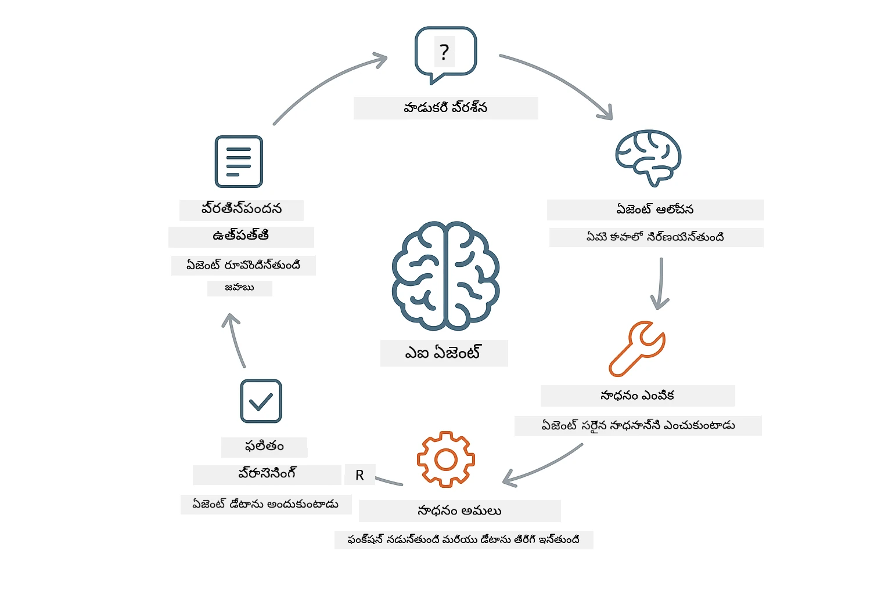
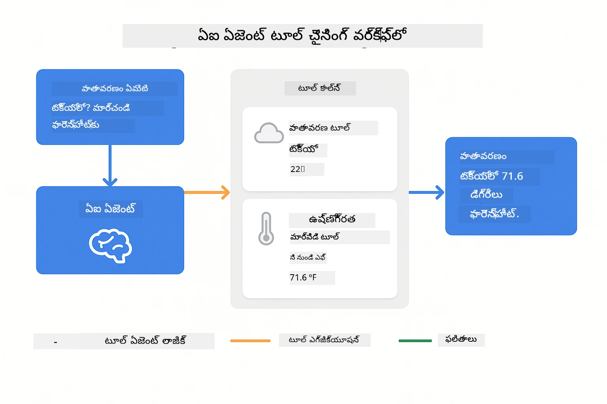
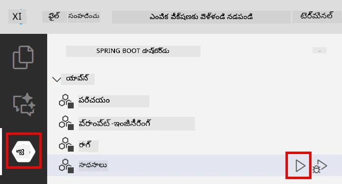
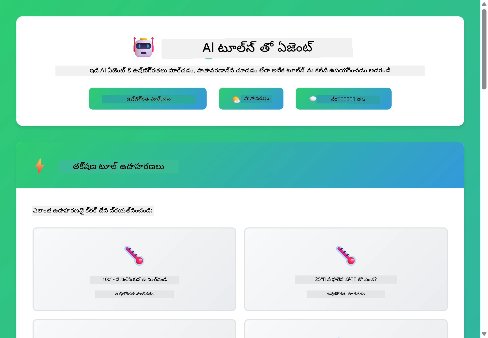

<!--
CO_OP_TRANSLATOR_METADATA:
{
  "original_hash": "844788938b26242f3cc54ce0d0951bea",
  "translation_date": "2026-01-06T02:17:19+00:00",
  "source_file": "04-tools/README.md",
  "language_code": "te"
}
-->
# మాడ్యూల్ 04: టూల్స్ తో AI ఏజెంట్లు

## సూచిభాగం

- [మీరు నేర్చుకోవాలనేది](../../../04-tools)
- [ముందస్తు అవశ్యకతలు](../../../04-tools)
- [టూల్స్ తో AI ఏజెంట్లను అర్థం చేసుకోవడం](../../../04-tools)
- [టూల్ కాలింగ్ ఎలా పనిచేస్తుందో](../../../04-tools)
  - [టూల్ నిర్వచనాలు](../../../04-tools)
  - [నిర్ణయం తీసుకోవడం](../../../04-tools)
  - [నిర్వహణ](../../../04-tools)
  - [ప్రతిస్పందన తయారీ](../../../04-tools)
- [టూల్ చైనింగ్](../../../04-tools)
- [అప్లికేషన్ ను నడపండి](../../../04-tools)
- [అప్లికేషన్ వాడకం](../../../04-tools)
  - [సింపుల్ టూల్ వాడకం ప్రయత్నించండి](../../../04-tools)
  - [టూల్ చైనింగ్ పరీక్షించండి](../../../04-tools)
  - [संवाद ప్రవాహం చూడండి](../../../04-tools)
  - [వివిధ అభ్యర్థనలపై ప్రయోగం చేయండి](../../../04-tools)
- [ప్రధాన భావనల](../../../04-tools)
  - [ReAct నమూనా (వివేచన మరియు చర్య)](../../../04-tools)
  - [టూల్ వివరణలు ముఖ్యం](../../../04-tools)
  - [సెషన్ నిర్వహణ](../../../04-tools)
  - [లోపాలు నిర్వహణ](../../../04-tools)
- [అందుబాటులో ఉన్న టూల్స్](../../../04-tools)
- [టూల్ ఆధారిత ఏజెంట్లను ఎప్పుడు వాడాలి](../../../04-tools)
- [తరువాతి దశలు](../../../04-tools)

## మీరు నేర్చుకోవాలనేది

ఇప్పటి వరకు, మీరు AI తో సంభాషణలు ఎలా చేయాలో, ప్రాంప్ట్లను సమర్థవంతంగా ఎలా నిర్మించాలో, మరియు మీ డాక్యుమెంట్లలోని సమాధానాలను పునాది చేయడం నేర్చుకున్నారు. కానీ మిగిలిన ప్రాథమిక పరిమితి ఉంది: భాషా మోడల్స్ కేవలం పద్యాన్ని ఉత్పత్తి చేయగలవు. అవి వాతావరణాన్ని తనిఖీ చేయలేవు, లెక్కింపులు చేయలేవు, డేటాబేస్‌లను ప్రశ్నించలేవు లేదా బాహ్య సిస్టమ్‌లతో పరస్పరం చేయలేవు.

టూల్స్ దీనిని మార్చేస్తాయి. మోడల్ కాల్ చేయగల ఫంక్షన్లకు యాక్సెస్ ఇస్తే, మీరు దాన్ని ఒక పద్య జనరేటర్ నుండి చర్యలు తీసుకునే ఏజెంట్ గా మారుస్తారు. మోడల్ ఎప్పుడు టూల్ అవసరమో, ఏ టూల్ ఉపయోగించాలో, మరియు ఏమి పారామితులు ఇవ్వాలో నిర్ణయిస్తారు. మీ కోడ్ ఆ ఫంక్షన్‌ను నిర్వర్తించి ఫలితాన్ని తిరిగి ఇస్తుంది. మోడల్ ఆ ఫలితాన్ని తిరిగి సమాధానంలో చేర్చుతుంది.

## ముందస్తు అవశ్యకతలు

- మాడ్యూల్ 01 పూర్తయింది (Azure OpenAI వనరులు అమర్చబడ్డాయి)
- రూట్ డైరెక్టరీలో `.env` ఫైల్ Azure ప్రమాణాలతో ఉంది (మాడ్యూల్ 01లో `azd up` ద్వారా సృష్టించారు)

> **గమనిక:** మీరు మాడ్యూల్ 01 పూర్తి చేయకపోతే, ముందుగా అక్కడి అమరిక సూచనలను అనుసరించండి.

## టూల్స్ తో AI ఏజెంట్లను అర్థం చేసుకోవడం

> **📝 గమనిక:** ఈ మాడ్యూల్ లో "ఏజెంట్లు" అనే పదం టూల్-కాలింగ్ సామర్థ్యాలతో మెరుగుపడిన AI సహాయకులను సూచిస్తుంది. ఇది [మాడ్యూల్ 05: MCP](../05-mcp/README.md) లో చెప్పే **Agentic AI** నమూనాలతో (స్థిరపరిచే ఏజెంట్లు, ప్రణాళిక, స్మృతి మరియు బహుళదశ వివేచన) భిన్నంగా ఉంది.

టూల్స్ తో AI ఏజెంట్ ఒక వివేచన మరియు చర్య నమూనాను (ReAct) అనుసరిస్తుంది:

1. వినియోగదారు ప్రశ్న అడుగుతాడు
2. ఏజెంట్ తెలుసుకోవాల్సిన దానిపై వివేచిస్తుంది
3. సమాధానం కోసం టూల్ అవసరమా అని నిర్ణయిస్తుంది
4. అవును అయితే సరైన పారామితులతో సరైన టూల్‌ను పిలుస్తుంది
5. టూల్ వెంటనే ఫలితాన్ని ఇస్తుంది
6. ఏజెంట్ ఫలితాన్ని చేర్చి తుది సమాధానం ఇస్తుంది



*ReAct నమూనా - AI ఏజెంట్లు సమస్యలను పరిష్కరించడానికి వివేచన మరియు చర్యల మధ్య మార్పిడి ఎలా చేస్తాయో*

ఇది ఆటోమాటిక్ గా జరుగుతుంది. మీరు టూల్స్ మరియు వాటి వివరణలను నిర్వచిస్తారు. మోడల్ ఎప్పుడు మరియు ఎలా వాటిని ఉపయోగించాలో నిర్ణయం తీసుకుంటుంది.

## టూల్ కాలింగ్ ఎలా పనిచేస్తుందో

### టూల్ నిర్వచనాలు

[WeatherTool.java](../../../04-tools/src/main/java/com/example/langchain4j/agents/tools/WeatherTool.java) | [TemperatureTool.java](../../../04-tools/src/main/java/com/example/langchain4j/agents/tools/TemperatureTool.java)

మీరు స్పష్టమైన వివరణలు మరియు పారామితుల స్పెసిఫికేషన్లతో ఫంక్షన్లను నిర్వచిస్తారు. మోడల్ ఈ వివరణలను సిస్టమ్ ప్రాంప్ట్లో చూస్తుంది మరియు ప్రతి టూల్ ఏం చేస్తుందో అర్థం చేసుకుంటుంది.

```java
@Component
public class WeatherTool {
    
    @Tool("Get the current weather for a location")
    public String getCurrentWeather(@P("Location name") String location) {
        // మీ వాతావరణ శోధన లాజిక్
        return "Weather in " + location + ": 22°C, cloudy";
    }
}

@AiService
public interface Assistant {
    String chat(@MemoryId String sessionId, @UserMessage String message);
}

// అసిస్టెంట్ స్వయంచాలకంగా Spring Boot ద్వారా కింది వాటితో కనెక్ట్ అవుతుంది:
// - ChatModel బీన్
// - @Component తరగతుల నుండి అన్ని @Tool పద్ధతులు
// - సెషన్ నిర్వహణ కోసం ChatMemoryProvider
```

> **🤖 [GitHub Copilot](https://github.com/features/copilot) చాట్‌తో ప్రయత్నించండి:** [`WeatherTool.java`](../../../04-tools/src/main/java/com/example/langchain4j/agents/tools/WeatherTool.java) తెరిచి అడగండి:
> - "నకిలీ డేటా బదులుగా OpenWeatherMap వంటి అసలు వాతావరణ API ఎలా కలపాలి?"
> - "టూల్ వివరణ ఎలా ఉండాలి అంటే AI దాన్ని సరిగా ఉపయోగించగలడు?"
> - "టూల్ అమలులో API లోపాలు మరియు రేటు పరిమితులను ఎలా నిర్వహించాలి?"

### నిర్ణయం తీసుకోవడం

వినియోగదారు "Seattleలో వాతావరణం ఏమిటి?" అని అడిగితే, మోడల్ వాతావరణ టూల్ అవసరమని గుర్తిస్తుంది. అది "Seattle" అని location పారామితితో ఫంక్షన్ కాల్ ను రూపొందిస్తుంది.

### నిర్వాహణ

[AgentService.java](../../../04-tools/src/main/java/com/example/langchain4j/agents/service/AgentService.java)

Spring Boot డిక్లరేటివ్ `@AiService` ఇంటర్‌ఫేస్‌తో అన్ని న ثبت చేయబడిన టూల్స్ ను ఆటో-వయ్యర్ చేస్తుంది, LangChain4j టూల్ కాల్స్ ను ఆటోమేటిక్‌గా నిర్వహిస్తాయి.

> **🤖 [GitHub Copilot](https://github.com/features/copilot) చాట్‌తో ప్రయత్నించండి:** [`AgentService.java`](../../../04-tools/src/main/java/com/example/langchain4j/agents/service/AgentService.java) తెరిచి అడగండి:
> - "ReAct నమూనా ఎలా పనిచేస్తుంది మరియు AI ఏజెంట్ల కోసం ఎందుకు సమర్థవంతంగా ఉంటుంది?"
> - "ఏజెంట్ ఏ టూల్ ఎప్పుడు వాడాలో ఎలా నిర్ణయిస్తుందీ, మరియు ఏ క్రమంలో?"
> - "ఒక టూల్ అమలులో వైఫల్యం అయితే ఏమవుతుంది - లోపాలను ఎలా బలంగా నిర్వహించాలి?"

### ప్రతిస్పందన తయారీ

మోడల్ వాతావరణ డేటాను అందుకుని దీన్ని సహజ భాషా సమాధానంగా యూజర్ కి మెరుగుపరుస్తుంది.

### డిక్లరేటివ్ AI సర్వీసులను ఎందుకు వాడాలి?

ఈ మాడ్యూల్ LangChain4j యొక్క Spring Boot ఇంటిగ్రేషన్ తో డిక్లరేటివ్ `@AiService` ఇంటర్‌ఫేస్‌లను ఉపయోగిస్తుంది:

- **Spring Boot ఆటో-వయ్యరింగ్** - ChatModel మరియు టూల్స్ ఆటోమేటిక్ ఇంజెక్ట్ అవుతాయి
- **@MemoryId నమూనా** - ఆటోమేటిక్ సెషన్ ఆధారిత మేమరీ నిర్వహణ
- **ఒక్కసారి ఇన్స్టెన్స్** - అసిస్టెంట్ ఒకసారి క్రియేట్ చేసి మెరుగైన పనితీరుకు పునః వినియోగం
- ** టైప్-సేఫ్ నిర్వాహణ ** - జావా మేథడ్లు నేరుగా టైప్ మార్పిడితో పిలవబడతాయి
- **బహుళ-టర్న్ ఆర్కెస్ట్రేషన్** - టూల్ చైనింగ్ ఆటోమేటిక్ గా నిర్వహిస్తుంది
- **సున్నా బాయిలర్‌ప్లేట్** - మానవీయమైన AiServices.builder() కాల్స్ లేకుండా, మేమరీ HashMap లేని విధంగా

వైకల్పిక విధానాలు (manual `AiServices.builder()`) అధిక కోడ్ అవసరం మరియు Spring Boot ఇంటిగ్రేషన్ లాభాలు కోల్పోతాయి.

## టూల్ చైనింగ్

**టూల్ చైనింగ్** - AI అనేక టూల్స్ ను పరస్పర అనుక్రమంగా పిలవవచ్చు. "Seattle లో వాతావరణం ఏమిటి మరియు అంబురెల్లా తీసుకువచ్చాలా?" అని అడగండి మరియు అది reasoning తో `getCurrentWeather` తీసుకొని తర్వాత వర్షపు గేర్ గురించి నిర్ణయం తీసుకుంటుంది చూసి తెలుసుకోండి.

<a href="images/tool-chaining.png"></a>

*క్రమమైన టూల్ పిలుపులు - ఒక టూల్ అవుట్పుట్ తదుపరి నిర్ణయానికి ఇస్తుంది*

**అందమైన వైఫల్యాలు** - నకిలీ డేటాలో లేని నగరం వాతావరణాన్ని అడగండి. టూల్ ఒక లోపం సందేశం ఇస్తుంది, AI సహాయం చేయలేకపోవడం వివరిస్తుంది. టూల్స్ సురక్షితంగా వైఫల్యం చెందుతాయి.

ఇది ఒకే సంభాషణ టర్న్ లో జరుగుతుంది. ఏజెంట్ స్వతహాగా అనేక టూల్ పిలుపులను నిర్వర్తిస్తుంది.

## అప్లికేషన్ ను నడపండి

**డిప్లాయ్ మెంట్ ధృవీకరించండి:**

అజ్యూర్ ప్రమాణాలతో రూట్ డైరెక్టరీలో `.env` ఫైల్ ఉంది అని తనిఖీ చేయండి (మాడ్యూల్ 01 లో సృష్టించబడింది):
```bash
cat ../.env  # AZURE_OPENAI_ENDPOINT, API_KEY, DEPLOYMENT ను చూపించాలి
```

**అప్లికేషన్ ప్రారంభించండి:**

> **గమనిక:** మీరు ముందే Module 01 లో `./start-all.sh` ఉపయోగించి అన్ని అప్లికేషన్లను ఆరంభించి ఉంటే, ఈ మాడ్యూల్ ఇప్పటికే 8084 పోర్ట్ లో నడుస్తోంది. కాబట్టి దిగువ స్టార్ట్ కమాండ్లను వదిలేయవచ్చు మరియు నేరుగా http://localhost:8084 కి వెళ్ళండి.

**వికల్పం 1: Spring Boot డాష్‌బోర్డ్ వాడకం (VS కోడ్ వినియోగదారులకు సిఫార్సు)**

డెవ్ కంటైనర్‌లో Spring Boot డాష్‌బోర్డ్ ఎక్స్‌టెన్షన్ ఉంటుంది, ఇది అన్ని Spring Boot అప్లికేషన్లను యాజమాన్యం చేసే దృశ్య ఇంటర్‌ఫేస్ అందిస్తుంది. VS కోడ్‌లో ఎడమవైపు Activity Bar లో Spring Boot ఐకాన్ కోసం చూడండి.

డాష్‌బోర్డ్ నుండి మీరు:
- వర్క్‌స్పేస్‌లో అందుబాటులో ఉన్న Spring Boot అప్లికేషన్లను చూడవచ్చు
- ఒక్క క్లిక్ తో అప్లికేషన్లను ప్రారంభించవచ్చు / ఆపవచ్చు
- అప్లికేషన్ లాగ్‌లనుリアల్-టైమ్ లో చూడవచ్చు
- అప్లికేషన్ స్థితిని పర్యవేక్షించవచ్చు

"tools" పక్కన ఉన్న ప్లే బటన్ నొక్కి ఈ మాడ్యూల్‌ను ప్రారంభించండి లేదా అన్ని మాడ్యూల్‌లను ఒకేసారిగా ప్రారంభించండి.



**వికల్పం 2: షెల్ స్క్రిప్ట్ వాడకం**

అన్ని వెబ్ అప్లికేషన్లను (మాడ్యూల్స్ 01-04):

**Bash:**
```bash
cd ..  # రూట్ డైరెక్టరీ నుండి
./start-all.sh
```

**PowerShell:**
```powershell
cd ..  # రూట్ డైరెక్టరీ నుండి
.\start-all.ps1
```

లేదా కేవలం ఈ మాడ్యూల్‌ను మొదలుపెట్టండి:

**Bash:**
```bash
cd 04-tools
./start.sh
```

**PowerShell:**
```powershell
cd 04-tools
.\start.ps1
```

రెండూ స్క్రిప్ట్‌లు రూట్ నుండి `.env` ఫైల్ నుండి ఎన్విరాన్‌మెంట్ వేరియబుల్స్ ను ఆటోమాటిక్ లోడ్ చేస్తాయి మరియు JAR ఫైల్ లు లేరు అయితే బిల్డ్ చేస్తాయి.

> **గమనిక:** మీరు మాన్యువల్ గా అన్ని మాడ్యూల్ లను బిల్డ్ చేసి తరువాత ప్రారంభించాలనుకుంటే:
>
> **Bash:**
> ```bash
> cd ..  # Go to root directory
> mvn clean package -DskipTests
> ```
>
> **PowerShell:**
> ```powershell
> cd ..  # Go to root directory
> mvn clean package -DskipTests
> ```

మీ బ్రౌజర్లో http://localhost:8084 తెరవండి.

**ఆపేందుకు:**

**Bash:**
```bash
./stop.sh  # ఈ మాడ్యూల్ మాత్రమే
# లేదా
cd .. && ./stop-all.sh  # అన్ని మాడ్యూల్స్
```

**PowerShell:**
```powershell
.\stop.ps1  # ఈ మాడ్యూల్ మాత్రమే
# లేదా
cd ..; .\stop-all.ps1  # అన్ని మాడ్యూల్స్
```

## అప్లికేషన్ వాడకం

ఈ అప్లికేషన్ ఒక వెబ్ ఇంటర్‌ఫేస్ అందిస్తుంది, మీరు వాతావరణం మరియు ఉష్ణోగ్రత మార్పిడిత టూల్స్ యాక్సెస్ ఉన్న AI ఏజెంట్‌తో పరస్పరం చేయవచ్చు.

<a href="images/tools-homepage.png"></a>

*AI ఏజెంట్ టూల్స్ ఇంటర్‌ఫేస్ - టూల్స్ తో ఇన్టరాక్ట్ చేయడానికి త్వరిత ఉదాహరణలు మరియు చాట్ ఇంటర్‌ఫేస్*

### సింపుల్ టూల్ వాడకం ప్రయత్నించండి

సాధారణ అభ్యర్థనతో మొదలుపెట్టి చూడండి: "100 డిగ్రీల ఫారెన్‌హీట్ ను సెల్సియస్ లో మార్చండి". ఏజెంట్ ఉష్ణోగ్రత మార్పిడి టూల్ అవసరమని గుర్తించి, సరైన పారామితులతో పిలుస్తుంది మరియు ఫలితాన్ని తిరిగిస్తుంది. ఇది సహజంగానే అనిపిస్తుంది - మీరు ఏ టూల్ వాడాలో లేదా ఎలా పిలవాలో ప్రత్యేకంగా చెప్పలేదు.

### టూల్ చైన్ పరీక్షించండి

ఇప్పుడు కొంచెం క్లిష్టమైనది ప్రయత్నించండి: "Seattle లో వాతావరణం ఏమిటి మరియు దాన్ని ఫారెన్‌హీట్ కు మార్చండి?" ఏజెంట్ దశల వారీగా పనిచేస్తూది. ముందుగా వాతావరణాన్ని పొందుతుంది (సెల్సియస్ లో వస్తుంది), ఫారెన్‌హీట్‌ కు మార్చాల్సిన అవసరాన్ని గుర్తించి మార్పిడి టూల్‌ను పిలుస్తుంది మరియు రెండూ మిళితం చేసిన సమాధానంగా ఇస్తుంది.

### సంభాషణ ప్రవాహం చూడండి

చాట్ ఇంటర్‌ఫేస్ సంభాషణ చరిత్రను నిర్వహిస్తోంది, మీరు బహుళ-టర్న్ పరస్పర చర్యలు చేయవచ్చు. మీరు అన్ని మునుపటి ప్రశ్నలు మరియు సమాధానాలను చూడవచ్చు, ఇది సంభాషణను ట్రాక్ చేయడానికి మరియు ఏజెంట్ ఎలా అనేక మార్చులలో సందర్భం నిర్మిస్తున్నదో అర్థం చేసుకోవడంలో సులభతరం చేస్తుంది.

<a href="images/tools-conversation-demo.png"></a>

*బహుళ టూల్ పిలుపులతో బహుళ-టర్న్ సంభాషణ - సింపుల్ మార్పిడులు, వాతావరణ అన్వేషణలు, టూల్ చైనింగ్*

### వివిధ అభ్యర్థనలు ప్రయోగించండి

విభిన్న మేళవింపులను ప్రయత్నించండి:
- వాతావరణ అన్వేషణలు: "Tokyoలో వాతావరణం ఎలా ఉంది?"
- ఉష్ణోగ్రత మార్పిడి: "25°C ను కెల్విన్ లో ఎంత?"
- కలిపిన ప్రశ్నలు: "Paris లో వాతావరణం తనిఖీ చేసి 20°C కంటే ఎక్కువగా ఉందో చెప్పండి"

ఏజెంట్ సహజ భాషను ఎలా అర్థం చేసుకుని సరైన టూల్ పిలుపులకు మ్యాప్ చేస్తుందో గమనించండి.

## ప్రధాన భావనలు

### ReAct నమూనా (వివేచన మరియు చర్య)

ఏజెంట్ వివేచనలు (ఏం చేయాలో నిర్ణయించడం) మరియు చర్యలు (టూల్స్ ఉపయోగించడం) మధ్య మార్పిడి చేస్తుంది. ఈ నమూనా ఆజాదీగా సమస్యలను పరిష్కరించడానికి అనుమతిస్తుంది, కేవలం సూచనలకు ప్రతిస్పందించడం కాదు.

### టూల్ వివరణలు ముఖ్యం

మీ టూల్ వివరణల నాణ్యత ఏజెంట్ వాటిని ఎంత బాగా ఉపయోగించగలదో నిర్ధారిస్తుంది. స్పష్టమైన, నిర్దిష్ట వివరణలు మోడల్ కి టూల్స్ ఎప్పుడు మరియు ఎలా పిలవాలో అర్థం చేసుకోవడంలో సహాయపడతాయి.

### సెషన్ నిర్వహణ

`@MemoryId` అనోటేషన్ ఆటోమేటిక్ సెషన్ ఆధారిత మేమరీ నిర్వహణను అనుమతిస్తుంది. ప్రతి సెషన్ ID కి ప్రత్యేక `ChatMemory` ఉదాహరణ `ChatMemoryProvider` బీన్ ద్వారా నిర్వహించబడుతుంది, మానవీయ మేమరీ ట్రాకింగ్ అవసరం ఉండదు.

### లోపాలు నిర్వహణ

టూల్స్ వైఫల్యం చెందవచ్చు - API గడువు ముగిసిపోవడం, తప్పు పారామితులు, బాహ్య సేవలు ఆగిపోవడం. ఉత్పత్తి ఏజెంట్లు లోపాలు నిర్వహణ అవసరం ఉంటుంది ताकि మోడల్ సమస్యల్ని వివరించగలగడం లేదా ప్రత్యామ్నాయాలను ప్రయత్నించగలగడం.

## అందుబాటులో ఉన్న టూల్స్

**వాతావరణ టూల్స్** (ప్రదర్శన కోసం నకిలీ డేటా):
- ఒక ప్రాంతానికి ప్రస్తుత వాతావరణాన్ని పొందండి
- బహుళ-రోజుల ముందస్తు సూచన పొందండి

**ఉష్ణోగ్రత మార్పిడి టూల్స్**:
- సెల్సియస్ నుండి ఫారెన్‌హీట్
- ఫారెన్‌హీట్ నుండి సెల్సియస్
- సెల్సియస్ నుండి కెల్విన్
- కెల్విన్ నుండి సెల్సియస్
- ఫారెన్‌హీట్ నుండి కెల్విన్
- కెల్విన్ నుండి ఫారెన్‌హీట్

ఇవి సరళ ఉదాహరణలు, కాని నమూనా ఏ ఫంక్షన్ కి వర్తిస్తుంది: డేటాబేస్ ప్రశ్నలు, API కాల్స్, లెక్కింపులు, ఫైల్ ఆపరేషన్లు, లేదా సిస్టమ్ కమాండ్లు.

## టూల్ ఆధారిత ఏజెంట్లను ఎప్పుడు వాడాలి

**టూల్స్ వాడండి:**
- సమాధానానికి నిజ సమయంలో డేటా అవసరం (వాతావరణం, స్టాక్ ధరలు, ఇన్వెంటరీ)
- సరళ గణితానికి మించి లెక్కింపులు చేయాలి
- డేటాబేస్లు లేదా APIs యాక్సెస్ చేయాలి
- చర్యలు చేపట్టాలి (ఇమైల్స్ పంపడం, టిక్కెట్లు సృష్టించడం, రికార్డులు నవీకరించడం)
- అనేక డేటా మూలాలు కలిపేయాలి

**టూల్స్ వాడకూడదు:**
- సమాచారం సాధారణ పరిజ్ఞానంతో జవాబవివ్వగలిగితే
- సమాధానం పూర్తిగా సంభాషణాత్మకమైతే
- టూల్ లేటెన్సీ అనుభవాన్ని చాలా మందగిస్తుంది

## తరువాతి దశలు

**తరువాతి మాడ్యూల్:** [05-mcp - Model Context Protocol (MCP)](../05-mcp/README.md)

---

**నావిగేషన్:** [← ముందు: మాడ్యూల్ 03 - RAG](../03-rag/README.md) | [ముఖ్యమైన పేజీకి తిరిగి](../README.md) | [తరువాత: మాడ్యూల్ 05 - MCP →](../05-mcp/README.md)

---

<!-- CO-OP TRANSLATOR DISCLAIMER START -->
**బాధ్యతా మోచేరు**:  
ఈ పత్రాన్ని AI అనువాద సేవ [Co-op Translator](https://github.com/Azure/co-op-translator) ఉపయోగించి అనువదించారు. మేము ఖచ్చితత్వానికి ప్రయత్నిస్తూనే ఉన్నప్పటికీ, ఆటోమేటెడ్ అనువాదాలలో లోపాలు లేదా తప్పులున్నవి ఉండవచ్చు. మౌలిక భాషలో ఉన్న అసలు పత్రం అవినాభావమైన ఆధారంగా పరిగణించాలి. ముఖ్యమైన సమాచారం కోసం నిపుణుల చేతి అనువాదం సూచించబడుతుంది. ఈ అనువాదం ఉపయోగం వల్ల ఏమైనా అవగాహన లోపాలు లేదా తప్ప విశ్లేషణలకు మేము బాధ్యత వహించము.
<!-- CO-OP TRANSLATOR DISCLAIMER END -->