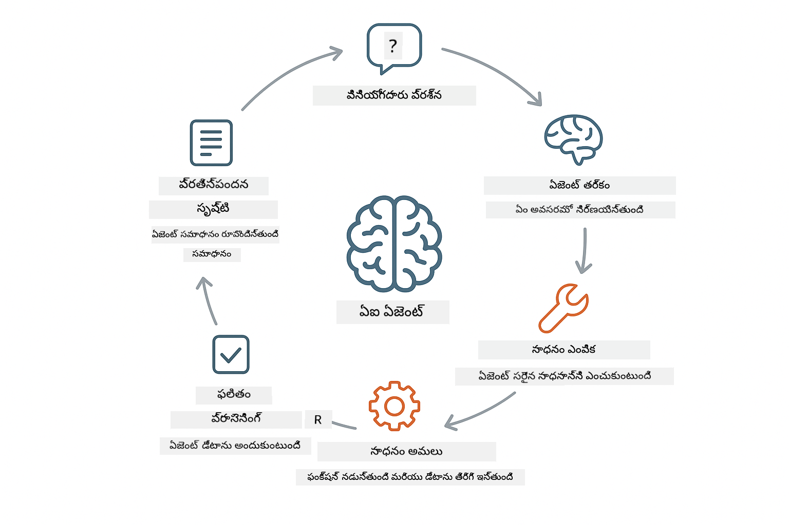
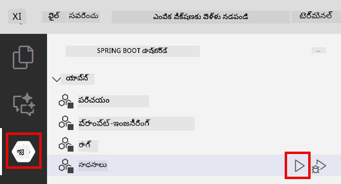
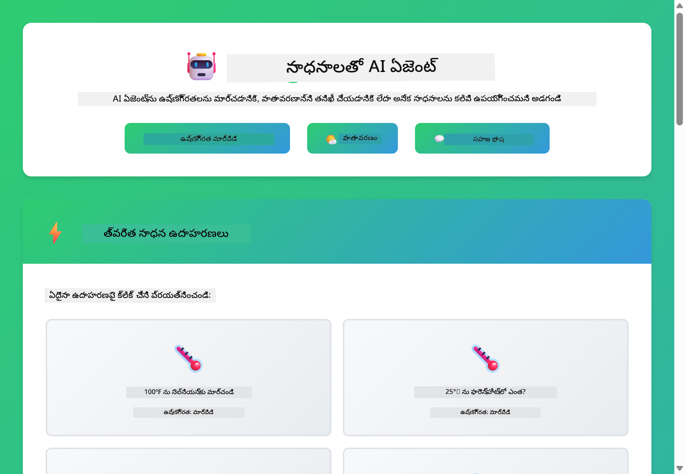

<!--
CO_OP_TRANSLATOR_METADATA:
{
  "original_hash": "aa23f106e7f53270924c9dd39c629004",
  "translation_date": "2025-12-13T19:43:50+00:00",
  "source_file": "04-tools/README.md",
  "language_code": "te"
}
-->
# మాడ్యూల్ 04: టూల్స్‌తో AI ఏజెంట్లు

## విషయ సూచిక

- [మీరు నేర్చుకునేది](../../../04-tools)
- [ముందస్తు అవసరాలు](../../../04-tools)
- [టూల్స్‌తో AI ఏజెంట్లను అర్థం చేసుకోవడం](../../../04-tools)
- [టూల్ కాలింగ్ ఎలా పనిచేస్తుంది](../../../04-tools)
  - [టూల్ నిర్వచనాలు](../../../04-tools)
  - [నిర్ణయం తీసుకోవడం](../../../04-tools)
  - [నిర్వహణ](../../../04-tools)
  - [ప్రతిస్పందన ఉత్పత్తి](../../../04-tools)
- [టూల్ చైనింగ్](../../../04-tools)
- [అప్లికేషన్ నడపండి](../../../04-tools)
- [అప్లికేషన్ ఉపయోగించడం](../../../04-tools)
  - [సాధారణ టూల్ ఉపయోగాన్ని ప్రయత్నించండి](../../../04-tools)
  - [టూల్ చైనింగ్‌ను పరీక్షించండి](../../../04-tools)
  - [సంభాషణ ప్రవాహాన్ని చూడండి](../../../04-tools)
  - [తర్కాన్ని గమనించండి](../../../04-tools)
  - [వివిధ అభ్యర్థనలతో ప్రయోగించండి](../../../04-tools)
- [ప్రధాన భావనలు](../../../04-tools)
  - [ReAct ప్యాటర్న్ (తర్కం మరియు చర్య)](../../../04-tools)
  - [టూల్ వివరణలు ముఖ్యం](../../../04-tools)
  - [సెషన్ నిర్వహణ](../../../04-tools)
  - [లోపాల నిర్వహణ](../../../04-tools)
- [లభ్యమయ్యే టూల్స్](../../../04-tools)
- [టూల్-ఆధారిత ఏజెంట్లను ఎప్పుడు ఉపయోగించాలి](../../../04-tools)
- [తదుపరి దశలు](../../../04-tools)

## మీరు నేర్చుకునేది

ఇప్పటివరకు, మీరు AIతో సంభాషణలు ఎలా చేయాలో, ప్రాంప్ట్‌లను సమర్థవంతంగా ఎలా నిర్మించాలో, మరియు మీ డాక్యుమెంట్లలో ప్రతిస్పందనలను ఎలా ఆధారపెట్టాలో నేర్చుకున్నారు. కానీ ఒక ప్రాథమిక పరిమితి ఉంది: భాషా మోడల్స్ కేవలం టెక్స్ట్‌ను మాత్రమే ఉత్పత్తి చేయగలవు. అవి వాతావరణాన్ని తనిఖీ చేయలేవు, లెక్కింపులు చేయలేవు, డేటాబేస్‌లను ప్రశ్నించలేవు, లేదా బాహ్య వ్యవస్థలతో పరస్పరం చేయలేవు.

టూల్స్ ఈ పరిమితిని మార్చేస్తాయి. మోడల్ కాల్ చేయగల ఫంక్షన్లకు యాక్సెస్ ఇచ్చి, మీరు దాన్ని టెక్స్ట్ జనరేటర్ నుండి చర్యలు తీసుకునే ఏజెంట్‌గా మార్చుతారు. మోడల్ ఎప్పుడు టూల్ అవసరమో, ఏ టూల్ ఉపయోగించాలో, మరియు ఏ పారామీటర్లను పంపాలో నిర్ణయిస్తుంది. మీ కోడ్ ఆ ఫంక్షన్‌ను అమలు చేసి ఫలితాన్ని తిరిగి ఇస్తుంది. మోడల్ ఆ ఫలితాన్ని తన ప్రతిస్పందనలో చేర్చుకుంటుంది.

## ముందస్తు అవసరాలు

- మాడ్యూల్ 01 పూర్తి చేసుకున్నది (Azure OpenAI వనరులు అమర్చబడ్డాయి)
- రూట్ డైరెక్టరీలో `.env` ఫైల్ Azure క్రెడెన్షియల్స్‌తో (మాడ్యూల్ 01లో `azd up` ద్వారా సృష్టించబడింది)

> **గమనిక:** మీరు మాడ్యూల్ 01 పూర్తి చేయకపోతే, ముందుగా అక్కడ ఉన్న అమరిక సూచనలను అనుసరించండి.

## టూల్స్‌తో AI ఏజెంట్లను అర్థం చేసుకోవడం

టూల్స్‌తో AI ఏజెంట్ ఒక తర్కం మరియు చర్య ప్యాటర్న్ (ReAct) ను అనుసరిస్తుంది:

1. యూజర్ ప్రశ్న అడుగుతాడు
2. ఏజెంట్ ఏమి తెలుసుకోవాలి అనేది తర్కం చేస్తుంది
3. ఏజెంట్ సమాధానం కోసం టూల్ అవసరమో లేదో నిర్ణయిస్తుంది
4. అవసరమైతే, సరైన పారామీటర్లతో సరైన టూల్‌ను కాల్ చేస్తుంది
5. టూల్ అమలు చేసి డేటాను తిరిగి ఇస్తుంది
6. ఏజెంట్ ఫలితాన్ని చేర్చుకుని తుది సమాధానం ఇస్తుంది



*ReAct ప్యాటర్న్ - AI ఏజెంట్లు సమస్యలను పరిష్కరించడానికి తర్కం మరియు చర్య మధ్య మార్పిడి ఎలా చేస్తాయో*

ఇది ఆటోమేటిక్‌గా జరుగుతుంది. మీరు టూల్స్ మరియు వాటి వివరణలను నిర్వచిస్తారు. మోడల్ ఎప్పుడు మరియు ఎలా వాటిని ఉపయోగించాలో నిర్ణయం తీసుకుంటుంది.

## టూల్ కాలింగ్ ఎలా పనిచేస్తుంది

**టూల్ నిర్వచనాలు** - [WeatherTool.java](../../../04-tools/src/main/java/com/example/langchain4j/agents/tools/WeatherTool.java) | [TemperatureTool.java](../../../04-tools/src/main/java/com/example/langchain4j/agents/tools/TemperatureTool.java)

మీరు స్పష్టమైన వివరణలు మరియు పారామీటర్ స్పెసిఫికేషన్లతో ఫంక్షన్లను నిర్వచిస్తారు. మోడల్ ఈ వివరణలను తన సిస్టమ్ ప్రాంప్ట్‌లో చూసి ప్రతి టూల్ ఏమి చేస్తుందో అర్థం చేసుకుంటుంది.

```java
@Component
public class WeatherTool {
    
    @Tool("Get the current weather for a location")
    public String getCurrentWeather(@P("Location name") String location) {
        // మీ వాతావరణ లుకప్ లాజిక్
        return "Weather in " + location + ": 22°C, cloudy";
    }
}

@AiService
public interface Assistant {
    String chat(@MemoryId String sessionId, @UserMessage String message);
}

// అసిస్టెంట్ స్వయంచాలకంగా స్ప్రింగ్ బూట్ ద్వారా వైర్డ్ చేయబడింది:
// - చాట్ మోడల్ బీన్
// - @Component తరగతుల నుండి అన్ని @Tool పద్ధతులు
// - సెషన్ నిర్వహణ కోసం ChatMemoryProvider
```

> **🤖 [GitHub Copilot](https://github.com/features/copilot) చాట్‌తో ప్రయత్నించండి:** [`WeatherTool.java`](../../../04-tools/src/main/java/com/example/langchain4j/agents/tools/WeatherTool.java) తెరవండి మరియు అడగండి:
> - "నకిలీ డేటా కాకుండా నిజమైన వాతావరణ API అయిన OpenWeatherMap ఎలా ఇంటిగ్రేట్ చేయాలి?"
> - "AI దాన్ని సరిగ్గా ఉపయోగించడానికి సహాయపడే మంచి టూల్ వివరణ ఏమిటి?"
> - "టూల్ అమలులో API లోపాలు మరియు రేట్ లిమిట్లను ఎలా నిర్వహించాలి?"

**నిర్ణయం తీసుకోవడం**

యూజర్ "సియాటిల్‌లో వాతావరణం ఎలా ఉంది?" అని అడిగితే, మోడల్ వాతావరణ టూల్ అవసరమని గుర్తిస్తుంది. అది "సియాటిల్" అనే లొకేషన్ పారామీటర్‌తో ఫంక్షన్ కాల్‌ను ఉత్పత్తి చేస్తుంది.

**నిర్వహణ** - [AgentService.java](../../../04-tools/src/main/java/com/example/langchain4j/agents/service/AgentService.java)

స్ప్రింగ్ బూట్ డిక్లరేటివ్ `@AiService` ఇంటర్‌ఫేస్‌ను అన్ని నమోదు చేసిన టూల్స్‌తో ఆటో-వైరింగ్ చేస్తుంది, మరియు LangChain4j టూల్ కాల్స్‌ను ఆటోమేటిక్‌గా అమలు చేస్తుంది.

> **🤖 [GitHub Copilot](https://github.com/features/copilot) చాట్‌తో ప్రయత్నించండి:** [`AgentService.java`](../../../04-tools/src/main/java/com/example/langchain4j/agents/service/AgentService.java) తెరవండి మరియు అడగండి:
> - "ReAct ప్యాటర్న్ ఎలా పనిచేస్తుంది మరియు AI ఏజెంట్లకు ఇది ఎందుకు సమర్థవంతం?"
> - "ఏజెంట్ ఏ టూల్ ఉపయోగించాలో మరియు ఏ క్రమంలో నిర్ణయిస్తుంది?"
> - "టూల్ అమలు విఫలమైతే ఏమవుతుంది - లోపాలను బలంగా ఎలా నిర్వహించాలి?"

**ప్రతిస్పందన ఉత్పత్తి**

మోడల్ వాతావరణ డేటాను అందుకుని, యూజర్ కోసం సహజ భాషలో ప్రతిస్పందనగా ఫార్మాట్ చేస్తుంది.

### డిక్లరేటివ్ AI సర్వీసులను ఎందుకు ఉపయోగించాలి?

ఈ మాడ్యూల్ LangChain4j యొక్క స్ప్రింగ్ బూట్ ఇంటిగ్రేషన్‌ను డిక్లరేటివ్ `@AiService` ఇంటర్‌ఫేస్‌లతో ఉపయోగిస్తుంది:

- **స్ప్రింగ్ బూట్ ఆటో-వైరింగ్** - ChatModel మరియు టూల్స్ ఆటోమేటిక్‌గా ఇంజెక్ట్ చేయబడతాయి
- **@MemoryId ప్యాటర్న్** - ఆటోమేటిక్ సెషన్ ఆధారిత మెమరీ నిర్వహణ
- **ఒకే ఇన్స్టాన్స్** - అసిస్టెంట్ ఒకసారి సృష్టించి మెరుగైన పనితీరు కోసం పునర్వినియోగం
- **టైప్-సేఫ్ అమలు** - జావా మెథడ్స్ నేరుగా టైప్ మార్పిడి తో కాల్ చేయబడతాయి
- **మల్టీ-టర్న్ ఆర్కెస్ట్రేషన్** - టూల్ చైనింగ్‌ను ఆటోమేటిక్‌గా నిర్వహిస్తుంది
- **జీరో బాయిలర్‌ప్లేట్** - మాన్యువల్ AiServices.builder() కాల్స్ లేదా మెమరీ హాష్‌మ్యాప్ అవసరం లేదు

వేరే విధానాలు (మాన్యువల్ `AiServices.builder()`) ఎక్కువ కోడ్ అవసరం మరియు స్ప్రింగ్ బూట్ ఇంటిగ్రేషన్ లాభాలు కోల్పోతాయి.

## టూల్ చైనింగ్

**టూల్ చైనింగ్** - AI ఒకదానికొకటి అనుసరించి అనేక టూల్స్‌ను కాల్ చేయవచ్చు. "సియాటిల్‌లో వాతావరణం ఎలా ఉంది మరియు నేను గొడుగు తీసుకురావాలా?" అని అడిగి, `getCurrentWeather` ను వర్షం గేర్ గురించి తర్కంతో చైన్ చేయడం చూడండి.

<a href="images/tool-chaining.png"></a>

*క్రమంగా టూల్ కాల్స్ - ఒక టూల్ అవుట్‌పుట్ తదుపరి నిర్ణయానికి ఇన్పుట్*

**గ్రేస్‌ఫుల్ ఫెయిల్యూర్స్** - మాక్ డేటాలో లేని నగరంలో వాతావరణం అడగండి. టూల్ లోపం సందేశాన్ని ఇస్తుంది, AI సహాయం చేయలేకపోతున్నట్లు వివరిస్తుంది. టూల్స్ సురక్షితంగా విఫలమవుతాయి.

ఇది ఒకే సంభాషణ టర్న్‌లో జరుగుతుంది. ఏజెంట్ అనేక టూల్ కాల్స్‌ను స్వతంత్రంగా ఆర్కెస్ట్రేట్ చేస్తుంది.

## అప్లికేషన్ నడపండి

**అమరికను ధృవీకరించండి:**

రూట్ డైరెక్టరీలో `.env` ఫైల్ Azure క్రెడెన్షియల్స్‌తో ఉందని నిర్ధారించుకోండి (మాడ్యూల్ 01లో సృష్టించబడింది):
```bash
cat ../.env  # AZURE_OPENAI_ENDPOINT, API_KEY, DEPLOYMENT చూపించాలి
```

**అప్లికేషన్ ప్రారంభించండి:**

> **గమనిక:** మీరు ఇప్పటికే మాడ్యూల్ 01 నుండి `./start-all.sh` ఉపయోగించి అన్ని అప్లికేషన్లను ప్రారంభించగా, ఈ మాడ్యూల్ ఇప్పటికే పోర్ట్ 8084పై నడుస్తోంది. కాబట్టి క్రింది స్టార్ట్ కమాండ్లను వదిలేసి నేరుగా http://localhost:8084 కి వెళ్లవచ్చు.

**ఎంపిక 1: స్ప్రింగ్ బూట్ డాష్‌బోర్డ్ ఉపయోగించడం (VS కోడ్ వినియోగదారులకు సిఫార్సు)**

డెవ్ కంటైనర్ స్ప్రింగ్ బూట్ డాష్‌బోర్డ్ ఎక్స్‌టెన్షన్‌ను కలిగి ఉంది, ఇది అన్ని స్ప్రింగ్ బూట్ అప్లికేషన్లను నిర్వహించడానికి విజువల్ ఇంటర్‌ఫేస్ అందిస్తుంది. మీరు VS కోడ్ ఎడిటర్ ఎడమవైపు యాక్టివిటీ బార్‌లో స్ప్రింగ్ బూట్ ఐకాన్ కోసం చూడవచ్చు.

స్ప్రింగ్ బూట్ డాష్‌బోర్డ్ నుండి మీరు:
- వర్క్‌స్పేస్‌లో అందుబాటులో ఉన్న అన్ని స్ప్రింగ్ బూట్ అప్లికేషన్లను చూడవచ్చు
- ఒక క్లిక్‌తో అప్లికేషన్లను ప్రారంభించండి/ఆపండి
- అప్లికేషన్ లాగ్‌లను రియల్-టైమ్‌లో వీక్షించండి
- అప్లికేషన్ స్థితిని పర్యవేక్షించండి

"tools" పక్కన ఉన్న ప్లే బటన్‌ను క్లిక్ చేసి ఈ మాడ్యూల్‌ను ప్రారంభించండి, లేదా అన్ని మాడ్యూల్‌లను ఒకేసారి ప్రారంభించండి.



**ఎంపిక 2: షెల్ స్క్రిప్ట్‌లు ఉపయోగించడం**

అన్ని వెబ్ అప్లికేషన్లను (మాడ్యూల్స్ 01-04) ప్రారంభించండి:

**Bash:**
```bash
cd ..  # రూట్ డైరెక్టరీ నుండి
./start-all.sh
```

**PowerShell:**
```powershell
cd ..  # రూట్ డైరెక్టరీ నుండి
.\start-all.ps1
```

లేదా కేవలం ఈ మాడ్యూల్‌ను ప్రారంభించండి:

**Bash:**
```bash
cd 04-tools
./start.sh
```

**PowerShell:**
```powershell
cd 04-tools
.\start.ps1
```

రెండు స్క్రిప్ట్‌లు ఆటోమేటిక్‌గా రూట్ `.env` ఫైల్ నుండి ఎన్విరాన్‌మెంట్ వేరియబుల్స్‌ను లోడ్ చేస్తాయి మరియు JARలు లేవంటే అవి నిర్మిస్తాయి.

> **గమనిక:** మీరు ప్రారంభించే ముందు అన్ని మాడ్యూల్‌లను మాన్యువల్‌గా నిర్మించాలనుకుంటే:
>
> **Bash:**
> ```bash
> cd ..  # Go to root directory
> mvn clean package -DskipTests
> ```
>
> **PowerShell:**
> ```powershell
> cd ..  # Go to root directory
> mvn clean package -DskipTests
> ```

మీ బ్రౌజర్‌లో http://localhost:8084 తెరవండి.

**ఆపడానికి:**

**Bash:**
```bash
./stop.sh  # ఈ మాడ్యూల్ మాత్రమే
# లేదా
cd .. && ./stop-all.sh  # అన్ని మాడ్యూల్స్
```

**PowerShell:**
```powershell
.\stop.ps1  # ఈ మాడ్యూల్ మాత్రమే
# లేదా
cd ..; .\stop-all.ps1  # అన్ని మాడ్యూల్స్
```

## అప్లికేషన్ ఉపయోగించడం

అప్లికేషన్ ఒక వెబ్ ఇంటర్‌ఫేస్ అందిస్తుంది, అక్కడ మీరు వాతావరణం మరియు ఉష్ణోగ్రత మార్పిడి టూల్స్‌కు యాక్సెస్ ఉన్న AI ఏజెంట్‌తో పరస్పరం చేయవచ్చు.

<a href="images/tools-homepage.png"></a>

*AI ఏజెంట్ టూల్స్ ఇంటర్‌ఫేస్ - టూల్స్‌తో పరస్పరం కోసం త్వరిత ఉదాహరణలు మరియు చాట్ ఇంటర్‌ఫేస్*

**సాధారణ టూల్ ఉపయోగాన్ని ప్రయత్నించండి**

సరళమైన అభ్యర్థనతో ప్రారంభించండి: "100 డిగ్రీ ఫారెన్‌హీట్‌ను సెల్సియస్‌గా మార్చండి". ఏజెంట్ ఉష్ణోగ్రత మార్పిడి టూల్ అవసరమని గుర్తించి, సరైన పారామీటర్లతో కాల్ చేసి ఫలితాన్ని ఇస్తుంది. ఇది ఎంత సహజంగా అనిపిస్తుందో గమనించండి - మీరు ఏ టూల్ ఉపయోగించాలో లేదా ఎలా కాల్ చేయాలో స్పష్టంగా చెప్పలేదు.

**టూల్ చైనింగ్‌ను పరీక్షించండి**

ఇప్పుడు కొంచెం క్లిష్టమైనది ప్రయత్నించండి: "సియాటిల్‌లో వాతావరణం ఎలా ఉంది మరియు దాన్ని ఫారెన్‌హీట్‌గా మార్చండి?" ఏజెంట్ దాన్ని దశల వారీగా పరిష్కరిస్తుంది. మొదట వాతావరణాన్ని పొందుతుంది (సెల్సియస్‌లో), ఫారెన్‌హీట్‌కు మార్చాల్సిన అవసరం గుర్తించి, మార్పిడి టూల్‌ను కాల్ చేసి, రెండు ఫలితాలను ఒక సమాధానంగా కలిపి ఇస్తుంది.

**సంభాషణ ప్రవాహాన్ని చూడండి**

చాట్ ఇంటర్‌ఫేస్ సంభాషణ చరిత్రను నిర్వహిస్తుంది, మీరు బహుళ టర్న్ పరస్పర చర్యలు చేయవచ్చు. మీరు అన్ని గత ప్రశ్నలు మరియు ప్రతిస్పందనలను చూడవచ్చు, ఇది సంభాషణను ట్రాక్ చేయడం మరియు ఏజెంట్ ఎలా కాంటెక్స్ట్‌ను బిల్డ్ చేసుకుంటుందో అర్థం చేసుకోవడం సులభం చేస్తుంది.

<a href="images/tools-conversation-demo.png"></a>

*బహుళ టూల్ కాల్స్‌తో బహుళ టర్న్ సంభాషణ - సులభ మార్పిడి, వాతావరణ లుకప్‌లు, మరియు టూల్ చైనింగ్*

**వివిధ అభ్యర్థనలతో ప్రయోగించండి**

వివిధ కలయికలను ప్రయత్నించండి:
- వాతావరణ లుకప్‌లు: "టోక్యోలో వాతావరణం ఎలా ఉంది?"
- ఉష్ణోగ్రత మార్పిడి: "25°C ను కెల్విన్‌లో ఎంత?"
- కలిపిన ప్రశ్నలు: "పారిస్‌లో వాతావరణం తనిఖీ చేసి 20°C కంటే ఎక్కువ ఉందా చెప్పండి"

ఏజెంట్ సహజ భాషను ఎలా అర్థం చేసుకుని సరైన టూల్ కాల్స్‌కు మ్యాప్ చేస్తుందో గమనించండి.

## ప్రధాన భావనలు

**ReAct ప్యాటర్న్ (తర్కం మరియు చర్య)**

ఏజెంట్ తర్కం (ఏం చేయాలో నిర్ణయించడం) మరియు చర్య (టూల్స్ ఉపయోగించడం) మధ్య మార్పిడి చేస్తుంది. ఈ ప్యాటర్న్ స్వతంత్ర సమస్య పరిష్కారాన్ని సాధ్యమవుతుంది, కేవలం సూచనలకు ప్రతిస్పందించడం కాదు.

**టూల్ వివరణలు ముఖ్యం**

మీ టూల్ వివరణల నాణ్యత ఏజెంట్ వాటిని ఎంత బాగా ఉపయోగిస్తుందో నేరుగా ప్రభావితం చేస్తుంది. స్పష్టమైన, నిర్దిష్ట వివరణలు మోడల్‌కు ఎప్పుడు మరియు ఎలా టూల్‌ను కాల్ చేయాలో అర్థం చేసుకోవడంలో సహాయపడతాయి.

**సెషన్ నిర్వహణ**

`@MemoryId` అనోటేషన్ ఆటోమేటిక్ సెషన్ ఆధారిత మెమరీ నిర్వహణను సక్రియం చేస్తుంది. ప్రతి సెషన్ IDకి `ChatMemory` ఇన్స్టాన్స్ ఉంటుంది, ఇది `ChatMemoryProvider` బీన్ ద్వారా నిర్వహించబడుతుంది, మాన్యువల్ మెమరీ ట్రాకింగ్ అవసరం లేదు.

**లోపాల నిర్వహణ**

టూల్స్ విఫలమవచ్చు - APIలు టైమ్ అవుట్ కావచ్చు, పారామీటర్లు చెల్లనివి కావచ్చు, బాహ్య సేవలు డౌన్ కావచ్చు. ప్రొడక్షన్ ఏజెంట్లు లోపాల నిర్వహణ అవసరం, తద్వారా మోడల్ సమస్యలను వివరించగలదు లేదా ప్రత్యామ్నాయాలు ప్రయత్నించగలదు.

## లభ్యమయ్యే టూల్స్

**వాతావరణ టూల్స్** (ప్రదర్శన కోసం మాక్ డేటా):
- ఒక లొకేషన్ కోసం ప్రస్తుత వాతావరణం పొందండి
- బహుళ రోజుల వాతావరణ అంచనా పొందండి

**ఉష్ణోగ్రత మార్పిడి టూల్స్**:
- సెల్సియస్ నుండి ఫారెన్‌హీట్
- ఫారెన్‌హీట్ నుండి సెల్సియస్
- సెల్సియస్ నుండి కెల్విన్
- కెల్విన్ నుండి సెల్సియస్
- ఫారెన్‌హీట్ నుండి కెల్విన్
- కెల్విన్ నుండి ఫారెన్‌హీట్

ఇవి సరళమైన ఉదాహరణలు, కానీ ఈ ప్యాటర్న్ ఏ ఫంక్షన్‌కు వర్తిస్తుంది: డేటాబేస్ ప్రశ్నలు, API కాల్స్, లెక్కింపులు, ఫైల్ ఆపరేషన్లు, లేదా సిస్టమ్ కమాండ్లు.

## టూల్-ఆధారిత ఏజెంట్లను ఎప్పుడు ఉపయోగించాలి

**టూల్స్ ఉపయోగించండి:**
- సమాధానం కోసం రియల్-టైమ్ డేటా అవసరం ఉన్నప్పుడు (వాతావరణం, స్టాక్ ధరలు, ఇన్వెంటరీ)
- సరళ గణితాన్ని మించి లెక్కింపులు చేయాల్సినప్పుడు
- డేటాబేస్‌లు లేదా APIలకు యాక్సెస్ అవసరం ఉన్నప్పుడు
- చర్యలు తీసుకోవాల్సినప్పుడు (ఇమెయిల్స్ పంపడం, టికెట్లు సృష్టించడం, రికార్డులు నవీకరించడం)
- అనేక డేటా మూలాలను కలపడం

**టూల్స్ ఉపయోగించకండి:**
- ప్రశ్నలకు సాధారణ జ్ఞానం ఆధారంగా సమాధానం ఇవ్వగలిగితే
- ప్రతిస్పందన పూర్తిగా సంభాషణాత్మకమైనప్పుడు
- టూల్ లేటెన్సీ అనుభవాన్ని చాలా మందగింపజేస్తే

## తదుపరి దశలు

**తదుపరి మాడ్యూల్:** [05-mcp - మోడల్ కాంటెక్స్ట్ ప్రోటోకాల్ (MCP)](../05-mcp/README.md)

---

**నావిగేషన్:** [← మునుపటి: మాడ్యూల్ 03 - RAG](../03-rag/README.md) | [ప్రధానానికి తిరిగి](../README.md) | [తదుపరి: మాడ్యూల్ 05 - MCP →](../05-mcp/README.md)

---

<!-- CO-OP TRANSLATOR DISCLAIMER START -->
**అస్పష్టత**:  
ఈ పత్రాన్ని AI అనువాద సేవ [Co-op Translator](https://github.com/Azure/co-op-translator) ఉపయోగించి అనువదించబడింది. మేము ఖచ్చితత్వానికి ప్రయత్నించినప్పటికీ, ఆటోమేటెడ్ అనువాదాల్లో పొరపాట్లు లేదా తప్పిదాలు ఉండవచ్చు. మూల పత్రం దాని స్వదేశీ భాషలో అధికారిక మూలంగా పరిగణించాలి. ముఖ్యమైన సమాచారానికి, ప్రొఫెషనల్ మానవ అనువాదం సిఫార్సు చేయబడుతుంది. ఈ అనువాదం వాడకంలో ఏర్పడిన ఏవైనా అపార్థాలు లేదా తప్పుదారితీసే అర్థాలు కోసం మేము బాధ్యత వహించము.
<!-- CO-OP TRANSLATOR DISCLAIMER END -->