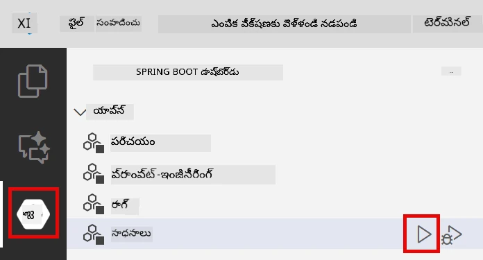
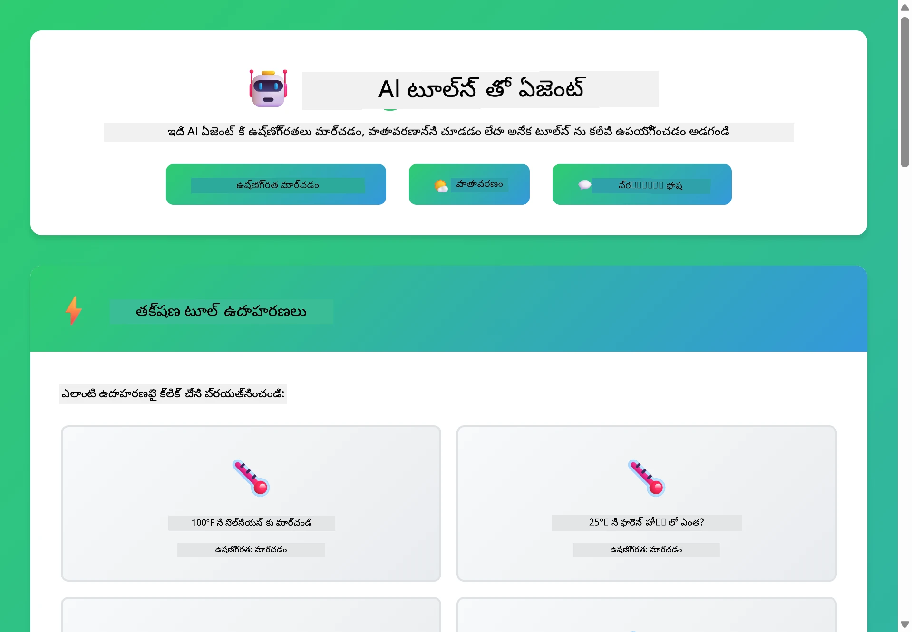
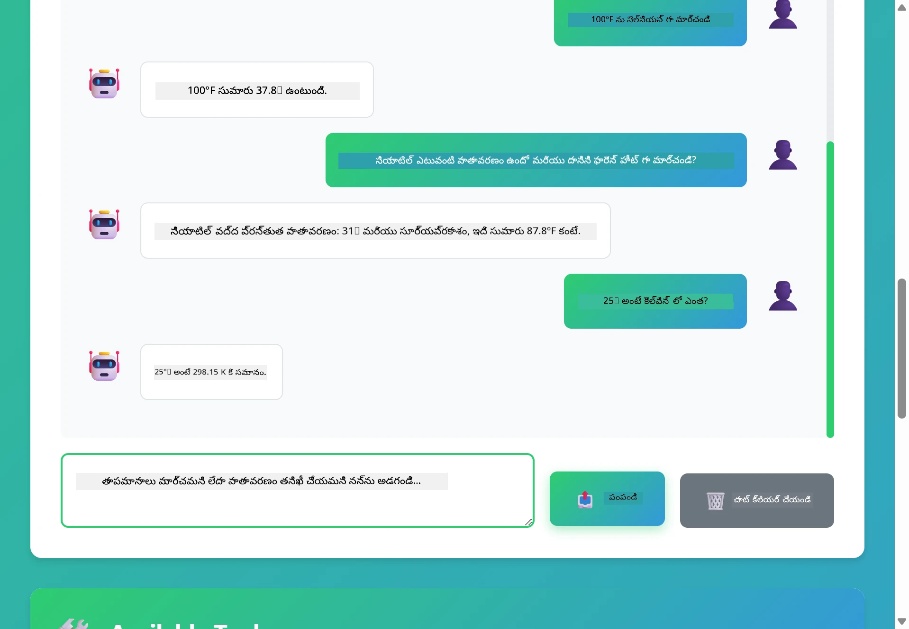

# Module 04: టూల్స్‌తో AI ఏజెంట్స్

## Table of Contents

- [వీడియో వాక్‌త్రూ](#వీడియో-వాక్‌త్రూ)
- [మీరు నేర్చుకునేది](#మీరు-నేర్చుకునేది)
- [అవసరాలు](#అవసరాలు)
- [టూల్స్‌తో AI ఏజెంట్స్‌ను అర్థం చేసుకునుకుందాం](#టూల్స్‌తో-ai-ఏజెంట్స్‌ను-అర్థం-చేసుకోవడం)
- [టూల్ కాలింగ్ ఎలా పనిచేస్తుంది](#టూల్-కాలింగ్-ఎలా-పనిచేస్తుంది)
  - [టూల్ నిర్వచనాలు](#టూల్-నిర్వచనాలు)
  - [నిర్ణయం తీసుకోవడం](#నిర్ణయం-తీసుకోవడం)
  - [నిర్వహణ](#నిర్వహణ)
  - [ప్రతిస్పందన తయారీ](#ప్రతిస్పందన-తయారీ)
  - [ఆర్కిటెక్చర్: స్ప్రింగ్ బూట్ ఆటో-వైరింగ్](#ఆర్కిటెక్చర్-స్ప్రింగ్-బూట్-ఆటో-వైరింగ్)
- [టూల్ చైన్ చేయడం](#టూల్-చైనింగ్)
- [అప్లికేషన్‌ను నడపండి](#అప్లికేషన్‌ను-నడపండి)
- [అప్లికేషన్ ఉపయోగించడం](#అప్లికేషన్-వినియోగం)
  - [సాదా టూల్ ఉపయోగాన్ని ప్రయత్నించండి](#సాదారణ-టూల్-వినియోగాన్ని-ప్రయత్నించండి)
  - [టూల్ చైనింగ్‌ను పరీక్షించండి](#టూల్-చైనింగ్‌ను-పరీక్షించండి)
  - [సంబాషణ ప్రవాహాన్ని చూడండి](#సంభాషణ-ప్రవాహాన్ని-చూడండి)
  - [వివిధ అభ్యర్థనలతో ప్రయోగించండి](#వేరే-వివిధ-అభ్యర్థనలను-ప్రయత్నించండి)
- [ప్రధాన భావనలు](#ముఖ్య-భావనలు)
  - [ReAct ప్యాటర్న్ (పైచర్య మరియు అమలు)](#react-నమూనా-తర్కం-మరియు-చర్య)
  - [టూల్ వివరణల ప్రభావం](#టూల్-వివరణలు-ముఖ్యం)
  - [సెషన్ నిర్వహణ](#సెష‌న్-మేనేజ్మెంట్)
  - [లోపాలు నిర్వహణ](#లోపాల-నిర్వహణ)
- [లభ్యమయ్యే టూల్స్](#అందుబాటులో-ఉన్న-టూల్స్)
- [ఎప్పుడు టూల్ ఆధారిత ఏజెంట్స్ ఉపయోగించాలి](#టూల్-ఆధారిత-ఏజెంట్లను-ఎప్పుడు-ఉపయోగించాలి)
- [టూల్స్ vs RAG](#టూల్స్-వర్సస్-rag)
- [మరో అడుగులు](#తదుపరి-దశలు)

## వీడియో వాక్‌త్రూ

ఈ మాడ్యూల్ ప్రారంభించడానికి ఎలా అన్నది వివరిస్తున్న ఈ ప్రత్యక్ష సెషన్ చూడండి:

<a href="https://www.youtube.com/watch?v=O_J30kZc0rw"></a>

## మీరు నేర్చుకునేది

ఇప్పటి వరకు, మీరు AIతో సంభాషణలు చేసే విధానం, ప్రాంప్ట్‌లను ప్రభావవంతంగా నిర్మించడం, మరియు మీ డాక్యుమెంట్లలోని ప్రత్యుత్తరాలను బలపరిచే విధానం నేర్చుకున్నారు. కానీ ఇంతవరకు ఒక ప్రాథమిక పరిమితి ఉంది: భాషా మోడల్స్ కేవలం టెక్స్ట్‌ని మాత్రమే ఉత్పత్తి చేయగలవు. అవి వాతావరణాన్ని తనిఖీ చేయలేవు, గణనలు చేయలేవు, డేటాబేస్‌లను ప్రశ్నించలేవు, లేదా బాహ్య వ్యవస్థలతో సహకరించలేవు.

టూల్స్ ఈ పరిస్థితిని మార్చతాయి. మోడలుకు కాల్ చేయగల ఫంక్షన్‌లు అందించడం ద్వారా, మీరు దాన్ని ఒక టెక్స్ట్ జనరేటర్ నుండి చర్యలు తీసుకోగల ఏజెంట్గా మార్చుతారు. మోడల్ ఎప్పుడు టూల్ అవసరమో, ఏ టూల్ ఉపయోగించాలో, ఏ పరామితులు అందించాలో నిర్ణయిస్తుంది. మీరు కోడ్ ఆ ఫంక్షన్‌ను అమలు చేసి ఫలితాన్ని తిరిగి ఇస్తారు. మోడల్ ఆ ఫలితాన్ని తాను ఇచ్చే ప్రతిస్పందనలో చేర్చుకుంటుంది.

## అవసరాలు

- [Module 01 - 소개](../01-introduction/README.md) పూర్తిచేసి ఉంటే (Azure OpenAI వనరులు పనిచేసేటట్లు)
- గత మాడ్యూల్స్‌ను పూర్తి చేసుకోవడం సిఫార్సు (ఈ మాడ్యూల్ [Module 03 లోని RAG కాన్సెప్ట్‌లు](../03-rag/README.md) ని టూల్స్ vs RAGలో సూచిస్తుంది)
- రూట్ డైరెక్టరీలో `.env` ఫైల్ ఉండాలి (Module 01 లో `azd up` ద్వారా సృష్టించబడింది)

> **గమనిక:** మీరు Module 01 పూర్తిచేయకపోతే, ముందుగా అక్కడ ఇచ్చిన డిప్లాయ్‌మెంట్ సూచనలు పాటించండి.

## టూల్స్‌తో AI ఏజెంట్స్‌ను అర్థం చేసుకోవడం

> **📝 గమనిక:** ఈ మాడ్యూల్‌లో "ఏజెంట్స్" అనే పదం టూల్-కాలింగ్ సామర్థ్యాలతో మెరుగుపరిచిన AI సహాయకులను సూచిస్తుంది. ఇది [Module 05: MCP](../05-mcp/README.md) లో చర్చించే **Agentic AI** ప్యాటర్న్స్ (స్వతంత్ర ఏజెంట్స్ మెమరీ, ప్లానింగ్, బహుళ-దశ తర్కం తో) నుండి భిన్నంగా ఉంది.

టూల్స్ లేకపోతే, భాషా మోడల్ తన శిక్షణ డేటా నుండి మాత్రమే టెక్స్ట్ ఉత్పత్తి చేయగలదు. ప్రస్తుత వాతావరణం ఏమిటి అని అడిగితే, అది అంచనా వేయాలి. టూల్స్ ఉన్నప్పుడు, అది వాతావరణ APIని కాల్ చేయగలదు, గణనలు చెయ్యగలదు, లేదా డేటాబేస్‌ను ప్రశ్నించగలదు — ఆ నిజమైన ఫలితాలను తన ప్రతిస్పందనలో మిళితం చేస్తుంది.


*టూల్స్ లేకపోతే మోడల్ అంచనా వేయాలి — టూల్స్ తోadhi APIsను కాల్ చేస్తుంది, గణనలు చేస్తుంది, మరియు రియల్-టైమ్ డేటాను అందిస్తుంది.*

టూల్స్‌తో AI ఏజెంట్ ఒక **Reasoning and Acting (ReAct)** ప్యాటర్న్ అనుసరిస్తుంది. మోడల్ కేవలం ప్రతిస్పందించడు — అది ఏమి అవసరమో ఆలోచిస్తుంది, టూల్‌ను కాల్ చేసి చర్యలు చేస్తుంది, ఫలితాన్ని పర్యవేక్షించి, మళ్లీ పర్యవేక్షణ లేదా తుది సమాధానం ఇవ్వాలని నిర్ణయిస్తుంది:

1. **తర్కించు** — యూజర్ ప్రశ్నను విశ్లేషించి ఏ సమాచారం అవసరమో నిర్ణయించు
2. **చర్య చేయి** — సరైన టూల్ ఎంచుకుని సరైన పరామితులతో కాల్ చేయి
3. **పర్యవేక్షించు** — టూల్ అవుట్పుట్ పొందిన తర్వాత ఫలితాన్ని అంచనా వేడు
4. **మళ్లీ చేయి లేదా ప్రతిస్పందించు** — మరిన్ని డేటా అవసరమైతే మళ్లీ ప్రయత్నించు; లేకపోతే సహజ భాషలో సమాధానం తయారు చేయి


*ReAct చక్రం — ఏజెంట్ ఏ పనులు చేయాలో తర్కించును, టూల్‌ను కాల్ చేస్తుంది, ఫలితాన్ని పర్యవేక్షించి, తుది సమాధానం ఇవ్వగలిగేవరకు ఇదే ప్రక్రియను కొనసాగిస్తుంది.*

ఇది ఆటోమేటిక్‌గా జరుగుతుంది. మీరు టూల్స్ మరియు వాటి వివరణలను నిర్వచిస్తారు. మోడల్ ఎప్పుడు మరియు ఎలా వాటిని వాడాలో తర్కించడాన్ని నిర్వహిస్తుంది.

## టూల్ కాలింగ్ ఎలా పనిచేస్తుంది

### టూల్ నిర్వచనాలు

[WeatherTool.java](../../../04-tools/src/main/java/com/example/langchain4j/agents/tools/WeatherTool.java) | [TemperatureTool.java](../../../04-tools/src/main/java/com/example/langchain4j/agents/tools/TemperatureTool.java)

మీరు క్లియర్ వివరణలు మరియు పారామితి స్పెసిఫికేషన్లతో ఫంక్షన్లను నిర్వచిస్తారు. మోడల్ ఈ వివరణలను తన సిస్టమ్ ప్రాంప్ట్‌లో చూసి, ప్రతి టూల్ ఏ పని చేస్తుందో అర్థం చేసుకుంటుంది.

```java
@Component
public class WeatherTool {
    
    @Tool("Get the current weather for a location")
    public String getCurrentWeather(@P("Location name") String location) {
        // మీ వాతావరణ లుకప్ లాజిక్
        return "Weather in " + location + ": 22°C, cloudy";
    }
}

@AiService
public interface Assistant {
    String chat(@MemoryId String sessionId, @UserMessage String message);
}

// అసిస్టెంట్ స్వయంచాలకంగా Spring Boot ద్వారా వైర్డ్ చేయబడింది:
// - ChatModel బీన్
// - @Component తరగతుల నుండి అన్ని @Tool పద్ధతులు
// - సెషన్ నిర్వహణ కోసం ChatMemoryProvider
```

క్రింద డయాగ్రామ్ ప్రతి గుణాన్ని విడదీసి చూపిస్తుంది, ఏ భాగం AIకి ఎప్పుడు టూల్ కాల్ చేయాలో, ఏ ఆర్గ్యుమెంట్స్ అందించాలో అర్థం చేసుకోవడానికి ఎలా సహాయపడుతుందో వివరించబడింది:


*టూల్ నిర్వచన నిర్మాణం — @Tool AIకి ఎప్పుడు ఉపయోగించాలో చెబుతుంది, @P ప్రతి పారామితిని సూచిస్తుంది, మరియు @AiService ప్రారంభ సమయంలో వాటిని యథాతథంగా కनेक్ట్ చేస్తుంది.*

> **🤖 [GitHub Copilot](https://github.com/features/copilot) చాట్‌తో ప్రయత్నించండి:** [`WeatherTool.java`](../../../04-tools/src/main/java/com/example/langchain4j/agents/tools/WeatherTool.java) ఫైల్ తెరవండి మరియు అడగండి:
> - "మాక్ డేటా కాకుండా వాస్తవ వాతావరణ API OpenWeatherMapను ఎలా ఇంటిగ్రేట్ చేయాలి?"
> - "AI దాన్ని సరికదా ఉపయోగించేందుకు బాగున్న టూల్ వివరణ ఎలా ఉండాలి?"
> - "టూల్ అమలులో API లోపాలు మరియు రేట్ లిమిట్స్‌ను ఎలా నిర్వహించాలి?"

### నిర్ణయం తీసుకోవడం

యూజర్ "సియాటిల్‌లో వాతావరణం ఎలా ఉంది?" అని అడిగినపుడు, మోడల్ ఏదైనా టూల్ చుట్టూ తారుమారు ఒకటిని ఎంచుకోదు. ఇది యూజర్ ఉద్దేశ్యాన్ని అందుబాటులో ఉన్న ప్రతి టూల్ వివరణతో పోల్చుతుంది, ప్రతీదిని ప్రాధాన్యతకు స్కోరింగ్ చేసి ఉత్తమాన్ని ఎంచుకుంటుంది. ఆ పాక్షికంగా ఒక స్ట్రక్చర్డ్ ఫంక్షన్ కాల్‌ను జనరేట్ చేసి సరైన పారామితులు అందిస్తుంది — ఈ సందర్భంలో `location` ను `"Seattle"` గా సెట్ చేస్తుంది.

యూజర్ అభ్యర్థనకు సరిపోని టూల్ దొరకపోతే, మోడల్ తనకు తెలిసిన పరిజ్ఞానం నుండి సమాధానం ఇస్తుంది. క్షేత్రంలో పలు టూల్స్ అనుకూలిస్తే, ఇది అత్యంత ప్రత్యేకమైనదాన్ని ఎంచుకుంటుంది.


*మోడల్ యూజర్ ఉద్దేశ్యంతో ప్రతీ టూల్‌ను పరిశీలించి ఉత్తమం ఎంచుకుంటుంది — అందుకనే స్పష్టంగా, ప్రత్యేకంగా టూల్ వివరణలు ఉండటం ముఖ్యం.*

### నిర్వహణ

[AgentService.java](../../../04-tools/src/main/java/com/example/langchain4j/agents/service/AgentService.java)

స్ప్రింగ్ బూట్ `@AiService` ఇంటర్ఫేస్‌ను రిజిస్టర్డ్ టూల్స్‌తో ఆటోమేటిక్‌గా వైర్ చేస్తుంది, మరియు LangChain4j టూల్ కాల్స్ ఆటోమేటిక్ చాటుతుంది. లైన్ వెనుక, ఒక పూర్తి టూల్ కాల్ ఆరు దశల ద్వారా ప్రవహిస్తుంది — యూజర్ సహజ భాషా ప్రశ్న నుండి తుది సహజ భాషా సమాధానం వరకూ:


*మొత్తం ఫ్లో — యూజర్ ప్రశ్న అడుగుతాడు, మోడల్ టూల్ ఎంచుకుంటుంది, LangChain4j దాన్ని అమలు చేస్తుంది, మోడల్ ఫలితాన్ని సహజ భాషా ప్రతిస్పందనలో చేర్చుతుంది.*

లైన్ వెనుక `AiServices` ఏ టూల్ కోసం అయినా అదే కాలింగ్ లూప్ నడుపుతుంది — ఇక్కడ సులభమైన `Calculator` తో చూపబడింది. క్రింది సీక్వెన్స్ డయాగ్రామ్ లోపల ఏమి జరుగుతుందో వివరంగా చూపిస్తుంది:


*టూల్ కాలింగ్ లూప్ — `AiServices` మీ సందేశం మరియు టూల్ స్కీమాలను LLMకి పంపుతుంది, LLM `add(42, 58)` లాంటి ఫంక్షన్ కాల్‌తో ప్రత్యుత్తరం ఇస్తుంది, LangChain4j లోకల్ గా `Calculator` మెథడ్ అమలు చేసి ఫలితాన్ని తుది సమాధానానికి తిరిగి ఇస్తుంది.*

> **🤖 [GitHub Copilot](https://github.com/features/copilot) చాట్‌తో ప్రయత్నించండి:** [`AgentService.java`](../../../04-tools/src/main/java/com/example/langchain4j/agents/service/AgentService.java) ఫైల్ తెరవండి మరియు అడగండి:
> - "ReAct ప్యాటర్న్ ఎలా పని చేస్తుంది మరియు AI ఏజెంట్స్ కోసం ఇది సమర్థవంతమే ఎందుకు?"
> - "ఏజెంట్ ఏ టూల్ ఎప్పుడు ఉపయోగించాలో ఎటువంటి క్రమంలో నిర్ణయిస్తుంది?"
> - "టూల్ అమలు విఫలమైతే ఏమవుతుంది - లోపాలను మేనేజ్ చేయడం ఎలా చేయాలి?"

### ప్రతిస్పందన తయారీ

మోడల్ వాతావరణ డేటాను స్వీకరించి యూజర్‌కి సహజ భాషలో ప్రతిస్పందనగా రూపొందిస్తుంది.

### ఆర్కిటెక్చర్: స్ప్రింగ్ బూట్ ఆటో-వైరింగ్

ఈ మాడ్యూల్ LangChain4j యొక్క స్ప్రింగ్ బూట్ సంయోజనంతో `@AiService` డిక్లరేటివ్ ఇంటర్ఫేస్‌లను ఉపయోగిస్తుంది. ప్రారంభంలో స్ప్రింగ్ బూట్ ఈ `@Tool` మెథడ్‌లున్న ప్రతీ `@Component`, మీ `ChatModel` బీన్, మరియు `ChatMemoryProvider` ని కనుగొని సున్నా బాయిలర్‌ప్లేట్‌తో ఒకే `Assistant` ఇంటర్ఫేస్‌కు వైర్ చేస్తుంది.


*@AiService ఇంటర్ఫేస్ ChatModel, టూల్ కంపోనెంట్స్, మెమరీ ప్రొవైడర్‌ని కలిపి స్ప్రింగ్ బూట్ ఆటోమేటిక్‌గా వైర్ చేస్తుంది.*

完整的 درخواست జీవన చక్రం సీక్వెన్స్ డయాగ్రామ్ ఇక్కడ ఉంది — HTTP రిక్వెస్ట్ నుండి కంట్రోలర్, సర్వీస్, ఆటో-వైర్డ్ ప్రాక్సీ, టూల్ అమలుకి వెనక్కి వచ్చేవరకు:


*పూర్తి స్ప్రింగ్ బూట్ రిక్వెస్ట్ జీవన చక్రం — HTTP రిక్వెస్ట్ కంట్రోలర్ మరియు సర్వీస్ ద్వారా ఆటో-వైర్డ్ అసిస్టెంట్ ప్రాక్సీకు ప్రవహిస్తుంది, ఇది LLM మరియు టూల్ కాల్స్‌ను ఆటోమేటిక్‌గా నిర్వహిస్తుంది.*

ఈ యాప్రోచ్ యొక్క ప్రధాన లాభాలు:

- **స్ప్రింగ్ బూట్ ఆటో-వైరింగ్** — ChatModel మరియు టూల్స్ ఆటోమేటిక్ ఇంజెక్షన్
- **@MemoryId ప్యాటర్న్** — ఆటోమేటిక్ సెషన్ ఆధారిత మెమరీ నిర్వహణ
- **ఒకే ఉదాహరణ** — అసిస్టెంట్ ఒక్కసారి సృష్టించి పనితీరు మెరుగ్గా ఉపయోగించడం
- **టైప్-సేఫ్ అమలు** — టైప్ కన్వర్షన్‌తో జావా మెథడ్స్ నేరుగా పిలవబడతాయి
- **బహుళ-టర్న్ ఆర్కిస్ట్రేషన్** — టూల్ చైనింగ్ ఆటోమేటిక్ నిర్వహణ
- **జీరో బాయిలర్‌ప్లేట్** — మాన్యువల్ `AiServices.builder()` లేదా మెమరీ HashMap అవసరం లేదు

మరో మార్గాలు (`AiServices.builder()` మానువల్ ఉపయోగం) మరింత కోడ్ అవసరం మరియు స్ప్రింగ్ బూట్ ఇంటిగ్రేషన్ లాభాలు అందుకోవడంలేదు.

## టూల్ చైనింగ్

**టూల్ చైనింగ్** — ఒకే ప్రశ్నకు బహుళ టూల్స్ అవసరం అయినప్పుడు టూల్ ఆధారిత ఏజెంట్స్ నిజమైన శక్తి కనబరుస్తారు. "సియాటిల్‌లో వాతావరణం ఫారెన్హీట్‌లో ఎలా ఉంది?" అని అడిగితే ఏజెంట్ ఆటోమేటిక్‌గా రెండు టూల్స్‌ను చైన్ చేస్తుంది: మొదట `getCurrentWeather` కాల్ చేయబడుతుంది టెంపరేచర్ ని సేల్సియస్‌లో పొందడానికి, తరువాత `celsiusToFahrenheit`కి ఆ విలువ పంపి మార్పిడి చేస్తుంది — ఇది ఒకే సంభాషణ టర్న్‌లో జరుగుతుంది.


*టూల్ చైనింగ్ వేదికపై — ఏజెంట్ మొదట getCurrentWeather ను కాల్ చేస్తుంది, ఆ తర్వాత సేల్సియస్ ఫలితాన్ని celsiusToFahrenheit లోకి పంపి కలిపిన సమాధానం ఇస్తుంది.*

**మృదువైన విఫలాలు** — మాక్ డేటాలో లేనివి అడిగితే టూల్ లోపం సందేశం ఇస్తుంది, AI మద్దతు ఇవ్వలేవని వివరిస్తుంది, క్రాష్ అవ్వదు. టూల్స్ సురక్షితంగా విఫలమవుతాయి. క్రింది డయాగ్రామ్ రెండు పద్ధతులను పోలుస్తుంది — సరైన లోపాలు నిర్వహణతో, ఏజెంట్ తప్పును పట్టుకొని సహాయకమైన ప్రతిస్పందన ఇస్తుంది, లేకపోతే మొత్తం అప్లికేషన్ క్రాష్ అవుతుంది:


*ఒక టూల్ విఫలమైనప్పుడు ఏజెంట్ లోపాన్ని పట్టుకొని క్రాష్ కాకుండా సహాయమయంగా ప్రతిస్పందిస్తుంది.*

ఇది ఒకే సంభాషణ టర్న్‌లో జరుగుతుంది. ఏజెంట్ స్వతంత్రంగా అనేక టూల్ కాల్స్ ని నిర్వహిస్తుంది.

## అప్లికేషన్‌ను నడపండి

**డిప్లాయ్‌మెంట్ యథావతంగా ఉందా అని ధృవీకరించండి:**

రూట్ డైరెక్టరీలో `.env` ఫైల్ Azure క్రెడెన్షియల్స్‌తో (Module 01లో సృష్టించబడింది) ఉండాలి. ఈ మాడ్యూల్ డైరెక్టరీ (`04-tools/`) నుండి ఇది నడపండి:

**Bash:**
```bash
cat ../.env  # AZURE_OPENAI_ENDPOINT, API_KEY, DEPLOYMENT చూపించాలి
```

**PowerShell:**
```powershell
Get-Content ..\.env  # AZURE_OPENAI_ENDPOINT, API_KEY, DEPLOYMENT చూపించాలి
```

**అప్లికేషన్ ప్రారంభించండి:**

> **గమనిక:** మీరు ఇప్పటికే రూట్ డైరెక్టరీ నుండి `./start-all.sh` ఉపయోగించి అన్ని అప్లికేషన్లు మొదలుపెట్టినట్లయితే (Module 01లో వివరణ ఇచ్చిన విధంగా), ఈ మాడ్యూల్ ఇప్పటికే 8084 పోర్టులో నడుస్తోంది. కాబట్టి క్రింద ఇచ్చిన స్టార్ట్ ఆదేశాలు పట్టించుకోకు, నేరుగా http://localhost:8084 కి వెళ్లండి.

**ఎంచుకున్న ఎంపిక 1: స్ప్రింగ్ బూట్ డాష్‌బోర్డ్ ఉపయోగించడం (VS Code యూజర్లకు సిఫార్సు)**

డెవ్ కంటైనర్‌లో స్ప్రింగ్ బూట్ డాష్‌బోర్డ్ ఎక్స్‌టెన్షన్ ఉంది, ఇది అన్ని స్ప్రింగ్ బూట్ అప్లికేషన్లను నిర్వహించడానికి విజువల్ ఇంటర్‌ఫేస్ అందిస్తుంది. మీరు దానిని VS Code ఎడమవైపు యాక్టివిటీ బార్‌లో స్ప్రింగ్ బూట్ చిహ్నం అరుస్తూ చూడవచ్చు.

స్ప్రింగ్ బూట్ డాష్‌బోర్డ్ నుండి మీరు:
- వర్క్‌స్పేస్‌లో అందుబాటులో ఉన్న అన్ని స్ప్రింగ్ బూట్ అప్లికేషన్లను చూడగలరు
- ఒక క్లిక్‌లో అప్లికేషన్లను ప్రారంభించండి/నిలిపివేయండి
- అప్లికేషన్ లాగ్‌లను రీయల్-టైమ్‌లో వీక్షించండి
- అప్లికేషన్ స్థితిని పర్యవేక్షించండి

సాధారణంగా "tools" పక్కన ఉన్న ప్లే బటన్ నొక్కి ఈ మాడ్యూల్‌ను ప్రారంభించండి, లేదా అన్ని మాడ్యూల్స్‌ను ఒకేసారి మొదలుపెట్టండి.

VS Codeలో స్ప్రింగ్ బూట్ డాష్‌బోర్డ్ ఎలా కనిపిస్తుందో ఇక్కడ ఉంది:


*VS కోడ్‌లో Spring Boot డాష్‍బోర్డు — ఒకే చోటుండి అన్ని మాడ్యూల్‌లను ప్రారంభించండి, నిలిపివేయండి మరియు పర్యవేక్షించండి*

**ఎంపిక 2: షెల్ స్క్రిప్ట్‌ల వినియోగం**

అన్ని వెబ్ అప్లికేషన్‌లు (మాడ్యూల్‌లు 01-04) ప్రారంభించండి:

**బ్యాష్:**
```bash
cd ..  # రూట్ డైరెక్టరీ నుండి
./start-all.sh
```

**పవర్‌షెల్:**
```powershell
cd ..  # రూట్ డైరెక్టరీ నుండి
.\start-all.ps1
```

లేదా కేవలం ఈ మాడ్యూల్‌ను మాత్రమే ప్రారంభించండి:

**బ్యాష్:**
```bash
cd 04-tools
./start.sh
```

**పవర్‌షెల్:**
```powershell
cd 04-tools
.\start.ps1
```

రూట్ `.env` ఫైల్ నుండి వాతావరణ variables ఆప్టోమేటిక్‌గా లోడ్ అవుతాయి, మరియు JARలు లేవంటే అవి తయారవుతాయి.

> **టిప్:** మీరు ప్రారంభించండానికి ముందు అన్ని మాడ్యూల్‌లను دستی طور پر నిర్మించాలనుకుంటే:
>
> **బ్యాష్:**
> ```bash
> cd ..  # Go to root directory
> mvn clean package -DskipTests
> ```
>
> **పవర్‌షెల్:**
> ```powershell
> cd ..  # Go to root directory
> mvn clean package -DskipTests
> ```

మీ బ్రౌజర్‌లో http://localhost:8084 ఓపెన్ చేయండి.

**నిలిపివేయడానికి:**

**బ్యాష్:**
```bash
./stop.sh  # ఈ మాడ్యూల్ మాత్రమే
# లేదా
cd .. && ./stop-all.sh  # అన్ని మాడ్యూల్లు
```

**పవర్‌షెల్:**
```powershell
.\stop.ps1  # ఈ మాడ్యూల్ మాత్రమే
# లేదా
cd ..; .\stop-all.ps1  # అన్ని మాడ్యూల్స్
```

## అప్లికేషన్ వినియోగం

ఈ అప్లికేషన్ ఒక వెబ్ ఇంటర్ఫేస్‌ను అందిస్తుంది, అక్కడ మీరు వాతావరణం మరియు ఉష్ణోగ్రత మార్పిడి సాధనాలను ఉపయోగించగల AI ఏజెంట్‌తో ఇంటరాక్ట్ చేయవచ్చు. ఇంటర్ఫేస్ ఇందులో ఇలా ఉంటుంది — ఇది తేలికపాటి ప్రారంభ ఉదాహరణలు మరియు అభ్యర్థనలు పంపడానికి చాట్ ప్యానెల్‌ను కలిగి ఉంది:

<a href="images/tools-homepage.png"></a>

*AI ఏజెంట్ టూల్స్ ఇంటర్ఫేస్ - టూల్స్‌తో ఇంటరాక్ట్ చేయడానికి వేగవంతమైన ఉదాహరణలు మరియు చాట్ ఇంటర్ఫేస్*

### సాదారణ టూల్ వినియోగాన్ని ప్రయత్నించండి

సరళమైన అభ్యర్థనతో ప్రారంభించండి: "100 డిగ్రీలు Fahrenheit నుండి Celsius కి మార్చండి". ఏజెంట్ ఉష్ణోగ్రత మార్పిడి టూల్ అవసరమని గుర్తించి, సరైన పారామీటర్లతో దీనిని పిలుస్తుంది మరియు ఫలితం ఇస్తుంది. ఇది ఎంత సహజంగా అనిపిస్తుంది గమనించండి — మీరు ఏ టూల్‌ను ఉపయోగించాలో లేదా ఎలా పిలవాలో నిర్దేశించలేదు.

### టూల్ చైనింగ్‌ను పరీక్షించండి

ఇప్పుడు కొంత క్లిష్టమైనది ప్రయత్నించండి: "సియాటిల్‌లో వాతావరణం ఏమిటి మరియు దాన్ని Fahrenheit కు మార్చండి?" ఈ దశల్లో ఏజెంట్ ఎలా పని చేస్తుందో గమనించండి. ఇది ముందు వాతావరణాన్ని పొందుతుంది (సెల్షియస్‌లో ఇస్తుంది), తరువాత దీనిని Fahrenheitకి మార్చాలని గుర్తించి, మార్పిడి టూల్‌ను పిలుస్తుంది, రెండింటిని కలిపి ఫలితాన్ని ఇస్తుంది.

### సంభాషణ ప్రవాహాన్ని చూడండి

చాట్ ఇంటర్ఫేస్ సంభాషణ చరిత్రను నిల్వ చేస్తుంది, మీకు బహు-మార్పుల ఇంటరాక్షన్‌లు చేయడానికి అనుమతిస్తుంది. మీరు అంతకు ముందు అన్ని ప్రశ్నలు మరియు జవాబులను చూడవచ్చు, ఇది సంభాషణను ట్రాక్ చేసుకోవటం మరియు ఏజెంట్ కంటెక్స్ట్‌ను ఎలా నిర్మిస్తుందో అర్థం చేసుకోవడం సులభం చేస్తుంది.

<a href="images/tools-conversation-demo.png"></a>

*సరళమైన మార్పిడులు, వాతావరణ లుకప్‌లు, టూల్ చైనింగ్ చూపించే బహుళ మార్పుల సంభాషణ*

### వేరే వివిధ అభ్యర్థనలను ప్రయత్నించండి

విభిన్న కలయికలను పరిశీలించండి:
- వాతావరణ లుకప్‌లు: "టోక్యోలో వాతావరణం ఎలా ఉంది?"
- ఉష్ణోగ్రత మార్పిడి: "25°C ఎంత Kelvin?"
- కలిపిన అభ్యర్థనలు: "ప్యారిస్‌లో వాతావరణం చెక్ చేసి 20°C కంటే ఎక్కువ ఉందా చెప్పండి"

ఏజెంట్ సహజ భాషను ఎలా అర్థం చేసుకొని తగిన టూల్ పిలుపులతో మ్యాప్ చేస్తుందో గమనించండి.

## ముఖ్య భావనలు

### ReAct నమూనా (తర్కం మరియు చర్య)

ఏజెంట్ తర్కం (ఏం చేయాలో నిర్ణయించడం) మరియు చర్య (టూల్స్‌ను ఉపయోగించడం) మధ్య మార్పిడి చేస్తుంది. ఈ నమూనా సూచనలకు ప్రతిస్పందించడం కాకుండా స్వయంచాలక సమస్య పరిష్కరణను సాధ్యం చేస్తుంది.

### టూల్ వివరణలు ముఖ్యం

మీ టూల్ వివరణల నాణ్యత ఏజెంట్ వాటిని ఎంత బాగా ఉపయోగిస్తుందో నేరుగా ప్రభావితం చేస్తుంది. స్పష్టమైన, నిర్దిష్ట వివరణలు మోడల్‌కి ఏ టూల్‌ను ఎప్పుడు ఎలా పిలవాలో అర్థం చేసుకోవడానికి సహాయపడతాయి.

### సెష‌న్ మేనేజ్మెంట్

`@MemoryId` అనోటేషన్ ఆటోమేటిక్ సెషన్ ఆధారిత మెమొరీ నిర్వహణను సక్రియం చేస్తుంది. ప్రతి సెషన్ IDకి స్పష్టమైన `ChatMemory` ఇన్‌స్టెన్స్ ఉంటుంది మరియు ఈ మెమొరీని `ChatMemoryProvider` బీన్ నిర్వహిస్తుంది, కాబట్టి అనేక యూజర్లు ఏజెంట్‌తో ఒకేసారి సంభాషించగలరు కానీ వారి సంభాషణలు కలవరపడవు. ఈ దిగువ చిత్రం బహుళ యూజర్లను వారి సెషన్ ID ఆధారంగా వేరుచేసిన మెమొరీ స్టోర్లకు ఎలా రూట్ చేస్తారో చూపిస్తుంది:


*ప్రతి సెషన్ ID వేరుచేసిన సంభాషణ చరిత్రకు మ్యాప్ అవుతుంది — యూజర్లు ఒకరితో ఒకరి సందేశాలను చూడరు.*

### లోపాల నిర్వహణ

టూల్స్ విఫలమవచ్చు — APIs టైమ్ అవుట్ కావచ్చు, పారామీటర్లు చెల్లదు, బాహ్య సేవలు డౌన్ అవుతాయి. ప్రొడక్షన్ ఏజెంట్లు లోపాల నిర్వహణ అవసరం, తద్వారా మోడల్ సమస్యలను వివరించగలదు లేదా ప్రత్యామ్నాయాలను ప్రయత్నించగలదు, ఆప్లికేషన్ మొత్తం క్రాష్ కాకుండా. ఒక టూల్ తప్పు విసురితే, LangChain4j దాన్ని కేస్కు చేస్తుంది మరియు లోపం మెసేజ్‌ను మోడల్‌కు తిరిగి ఇస్తుంది, తద్వారా సహజ భాషలో సమస్యను వివరించగలదు.

## అందుబాటులో ఉన్న టూల్స్

క్రింద చూపిన డయాగ్రామ్ మీరు తయారు చేయగల టూల్స్ యొక్క విస్తృత ఈకోసిస్టమ్‌ను అందిస్తుంది. ఈ మాడ్యూల్ వాతావరణ మరియు ఉష్ణోగ్రత టూల్స్‌ను ప్రదర్శిస్తుండగా, అదే `@Tool` నమూనా ఏ Java విధానం కోసం పనిచేస్తుంది — డేటాబేస్ ప్రశ్నల నుండి చెల్లింపు ప్రాసెసింగ్ వరకు.


*`@Tool` తో anotate చేసిన ఏ Java విధానం AI కి అందుబాటులో ఉంటుంది — ఈ నమూనా డేటాబేసులు, APIs, ఇమెయిల్స్, ఫైల్ ఆపరేషన్స్ మరియు మరింత వరకు విస్తరిస్తుంది.*

## టూల్ ఆధారిత ఏజెంట్లను ఎప్పుడు ఉపయోగించాలి

ప్రతి అభ్యర్థనకు టూల్స్ అవసరం ఉండదు. నిర్ణయం AIకు బాహ్య వ్యవస్థలతో ఇంటరాక్ట్ కావలసిన అవసరం ఉందా లేదా తన స్వంత సమాచారంతో సమాధానం ఇవ్వగలదా అనేదానిపై ఆధారపడి ఉంటుంది. ఈ క్రింది మార్గదర్శకం టూల్స్ విలువ చేకూర్చే సమయాలు మరియు అవసరంలేని సందర్భాలను సారాంశంగా తెలియజేస్తుంది:


*సత్వర నిర్ణయ మార్గదర్శి - టూల్స్ నిజ-సమయ డేటా, గణనల మరియు చర్యల కోసం; సాధారణ జ్ఞానం మరియు సృజనాత్మక పనులకు అవసరం లేదు.*

## టూల్స్ వర్సస్ RAG

మాడ్యూల్‌లు 03 మరియు 04 రెండూ AI సామర్థ్యాన్ని విస్తరించుకుంటాయి, కానీ ప్రాథమికంగా విభిన్న మార్గాల్లో. RAG మోడల్‌కు **జ్ఞానాన్ని** అందిస్తుంది, డాక్యుమెంట్లను సంప్రదించడం ద్వారా. టూల్స్ మోడల్‌కు **చర్యలు** తీసుకునే సామర్థ్యం ఇస్తాయి, ఫంక్షన్లు పిలిచేందుకు. క్రింది డయాగ్రామ్ ఈ రెండు విధానాలను పక్కన పెట్టి పోల్చుతుంది — ప్రతి పని ప్రవాహం ఎలా పనిచేస్తుందో మరియు వాటి మధ్య వ్యత్యాసాలు ఏమిటో:


*RAG స్థిర డాక్యుమెంట్ల నుండి సమాచారం తీసుకుంటుంది — టూల్స్ చర్యలను అమలు చేస్తాయి మరియు డైనమిక్, రియల్-టైమ్ డేటాను తెస్తాయి. అనేక ప్రొడక్షన్ వ్యవస్థలు ఇద్దరికీ మిశ్రమంగా ఉపయోగిస్తాయి.*

ప్రాక్టికల్‌లో, అనేక ప్రొడక్షన్ వ్యవస్థలు ఇద్దరి యొక్క సంయోజనాన్ని ఉపయోగిస్తాయి: RAG మీ డాక్యుమెంటేషన్‌లో సమాధానాలను ఆధారపడేందుకు, మరియు టూల్స్ ప్రత్యక్ష డేటాను తెచ్చేందుకు లేదా ఆపరేషన్లు జరపడానికి.

## తదుపరి దశలు

**తదుపరి మాడ్యూల్:** [05-mcp - మోడల్ కాంటెక్స్ట్ ప్రోటోకాల్ (MCP)](../05-mcp/README.md)

---

**నావిగేషన్:** [← పూర్వం: మాడ్యూల్ 03 - RAG](../03-rag/README.md) | [మూలానికి తిరుగు](../README.md) | [తదుపరి: మాడ్యూల్ 05 - MCP →](../05-mcp/README.md)

---

<!-- CO-OP TRANSLATOR DISCLAIMER START -->
**అస్వీకరణ**:
ఈ పత్రం AI అనువాద సేవ [Co-op Translator](https://github.com/Azure/co-op-translator) ఉపయోగించి అనువదించబడింది. మేము ఖచ్చితత్వానికి ప్రయత్నిస్తున్నప్పటికీ, ఆటోమేటెడ్ అనువాదాలు తప్పులు లేదా అసమగ్రతలను కలిగి ఉండవచ్చు. దాని స్వదేశ భాషలో ఉన్న అసలు పత్రాన్ని అధికారం కలిగిన మూలంగా పరిగణించాలి. కీలకమైన సమాచారం కోసం, ప్రొఫెషనల్ మానవ అనువాదాన్ని సిఫారసు చేస్తాము. ఈ అనువాదం ఉపయోగం వల్ల కలిగే ఏవైనా అపార్థాలు లేదా తప్పుదారులు కోసం మేము బాధ్యత వహించము.
<!-- CO-OP TRANSLATOR DISCLAIMER END -->