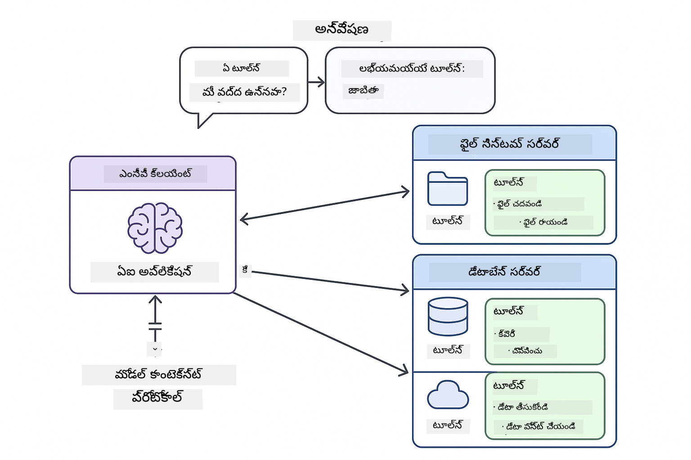
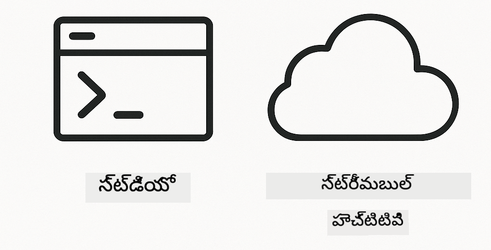

<!--
CO_OP_TRANSLATOR_METADATA:
{
  "original_hash": "c25ec1f10ef156c53e190cdf8b0711ab",
  "translation_date": "2025-12-13T18:14:13+00:00",
  "source_file": "05-mcp/README.md",
  "language_code": "te"
}
-->
# మాడ్యూల్ 05: మోడల్ కాంటెక్స్ట్ ప్రోటోకాల్ (MCP)

## విషయ సూచిక

- [మీరు నేర్చుకునేది](../../../05-mcp)
- [MCP ని అర్థం చేసుకోవడం](../../../05-mcp)
- [MCP ఎలా పనిచేస్తుంది](../../../05-mcp)
  - [సర్వర్-క్లయింట్ ఆర్కిటెక్చర్](../../../05-mcp)
  - [టూల్ డిస్కవరీ](../../../05-mcp)
  - [ట్రాన్స్‌పోర్ట్ మెకానిజమ్స్](../../../05-mcp)
- [ముందస్తు అవసరాలు](../../../05-mcp)
- [ఈ మాడ్యూల్ కవర్ చేసే విషయాలు](../../../05-mcp)
- [త్వరిత ప్రారంభం](../../../05-mcp)
  - [ఉదాహరణ 1: రిమోట్ క్యాల్క్యులేటర్ (స్ట్రీమబుల్ HTTP)](../../../05-mcp)
  - [ఉదాహరణ 2: ఫైల్ ఆపరేషన్స్ (స్ట్డియో)](../../../05-mcp)
  - [ఉదాహరణ 3: గిట్ విశ్లేషణ (డాకర్)](../../../05-mcp)
- [ప్రధాన భావనలు](../../../05-mcp)
  - [ట్రాన్స్‌పోర్ట్ ఎంపిక](../../../05-mcp)
  - [టూల్ డిస్కవరీ](../../../05-mcp)
  - [సెషన్ నిర్వహణ](../../../05-mcp)
  - [క్రాస్-ప్లాట్‌ఫారమ్ పరిగణనలు](../../../05-mcp)
- [ఎప్పుడు MCP ఉపయోగించాలి](../../../05-mcp)
- [MCP ఎకోసిస్టమ్](../../../05-mcp)
- [అభినందనలు!](../../../05-mcp)
  - [తర్వాత ఏమిటి?](../../../05-mcp)
- [సమస్య పరిష్కారం](../../../05-mcp)

## మీరు నేర్చుకునేది

మీరు సంభాషణాత్మక AI ని నిర్మించారు, ప్రాంప్ట్‌లను నైపుణ్యం సాధించారు, డాక్యుమెంట్లలో సమాధానాలను గ్రౌండ్ చేశారు, మరియు టూల్స్‌తో ఏజెంట్లను సృష్టించారు. కానీ ఆ టూల్స్ అన్నీ మీ ప్రత్యేక అప్లికేషన్ కోసం కస్టమ్‌గా నిర్మించబడ్డాయి. మీరు మీ AI కి ఎవరికైనా సృష్టించగలిగే మరియు పంచుకోగలిగే ఒక ప్రమాణీకృత టూల్ ఎకోసిస్టమ్‌కి యాక్సెస్ ఇవ్వగలిగితే ఎలా ఉంటుంది?

మోడల్ కాంటెక్స్ట్ ప్రోటోకాల్ (MCP) అదే అందిస్తుంది - AI అప్లికేషన్లు బాహ్య టూల్స్‌ను కనుగొని ఉపయోగించుకునే ఒక ప్రమాణీకృత మార్గం. ప్రతి డేటా సోర్స్ లేదా సర్వీస్ కోసం కస్టమ్ ఇంటిగ్రేషన్లు రాయడం బదులు, మీరు సామర్థ్యాలను సुस్పష్టమైన ఫార్మాట్‌లో ప్రదర్శించే MCP సర్వర్లకు కనెక్ట్ అవుతారు. మీ AI ఏజెంట్ ఆ టూల్స్‌ను ఆటోమేటిక్‌గా కనుగొని ఉపయోగించగలదు.


*MCP ముందు: సంక్లిష్టమైన పాయింట్-టు-పాయింట్ ఇంటిగ్రేషన్లు. MCP తర్వాత: ఒక ప్రోటోకాల్, అంతులేని అవకాశాలు.*

## MCP ని అర్థం చేసుకోవడం

MCP AI అభివృద్ధిలో ఒక ప్రాథమిక సమస్యను పరిష్కరిస్తుంది: ప్రతి ఇంటిగ్రేషన్ కస్టమ్. GitHub యాక్సెస్ కావాలా? కస్టమ్ కోడ్. ఫైళ్లు చదవాలా? కస్టమ్ కోడ్. డేటాబేస్‌ను క్వెరీ చేయాలా? కస్టమ్ కోడ్. మరియు ఈ ఇంటిగ్రేషన్లు ఇతర AI అప్లికేషన్లతో పనిచేయవు.

MCP దీన్ని ప్రమాణీకృతం చేస్తుంది. ఒక MCP సర్వర్ స్పష్టమైన వివరణలు మరియు స్కీమాలతో టూల్స్‌ను ప్రదర్శిస్తుంది. ఏ MCP క్లయింట్ కనెక్ట్ అయి అందుబాటులో ఉన్న టూల్స్‌ను కనుగొని ఉపయోగించవచ్చు. ఒకసారి నిర్మించి, ఎక్కడైనా ఉపయోగించండి.



*మోడల్ కాంటెక్స్ట్ ప్రోటోకాల్ ఆర్కిటెక్చర్ - ప్రమాణీకృత టూల్ డిస్కవరీ మరియు ఎగ్జిక్యూషన్*

## MCP ఎలా పనిచేస్తుంది

**సర్వర్-క్లయింట్ ఆర్కిటెక్చర్**

MCP క్లయింట్-సర్వర్ మోడల్ ఉపయోగిస్తుంది. సర్వర్లు టూల్స్ అందిస్తాయి - ఫైళ్లు చదవడం, డేటాబేస్ క్వెరీలు, API కాల్స్. క్లయింట్లు (మీ AI అప్లికేషన్) సర్వర్లకు కనెక్ట్ అయి వారి టూల్స్‌ను ఉపయోగిస్తాయి.

**టూల్ డిస్కవరీ**

మీ క్లయింట్ MCP సర్వర్‌కు కనెక్ట్ అయినప్పుడు, అది అడుగుతుంది "మీ వద్ద ఏ టూల్స్ ఉన్నాయి?" సర్వర్ అందుబాటులో ఉన్న టూల్స్ జాబితాతో స్పందిస్తుంది, ప్రతి టూల్ వివరణలు మరియు పారామీటర్ స్కీమాలతో ఉంటుంది. మీ AI ఏజెంట్ యూజర్ అభ్యర్థనల ఆధారంగా ఏ టూల్స్ ఉపయోగించాలో నిర్ణయించవచ్చు.

**ట్రాన్స్‌పోర్ట్ మెకానిజమ్స్**

MCP రెండు ట్రాన్స్‌పోర్ట్ మెకానిజమ్స్‌ను నిర్వచిస్తుంది: రిమోట్ సర్వర్ల కోసం HTTP, స్థానిక ప్రాసెస్‌ల కోసం Stdio (డాకర్ కంటైనర్ల సహా):



*MCP ట్రాన్స్‌పోర్ట్ మెకానిజమ్స్: రిమోట్ సర్వర్ల కోసం HTTP, స్థానిక ప్రాసెస్‌ల కోసం Stdio (డాకర్ కంటైనర్ల సహా)*

**స్ట్రీమబుల్ HTTP** - [StreamableHttpDemo.java](../../../05-mcp/src/main/java/com/example/langchain4j/mcp/StreamableHttpDemo.java)

రిమోట్ సర్వర్ల కోసం. మీ అప్లికేషన్ నెట్‌వర్క్‌లో ఎక్కడో నడుస్తున్న సర్వర్‌కు HTTP అభ్యర్థనలు చేస్తుంది. రియల్-టైమ్ కమ్యూనికేషన్ కోసం సర్వర్-సెంట్ ఈవెంట్స్ ఉపయోగిస్తుంది.

```java
McpTransport httpTransport = new StreamableHttpMcpTransport.Builder()
    .url("http://localhost:3001/mcp")
    .timeout(Duration.ofSeconds(60))
    .logRequests(true)
    .logResponses(true)
    .build();
```

> **🤖 [GitHub Copilot](https://github.com/features/copilot) చాట్‌తో ప్రయత్నించండి:** [`StreamableHttpDemo.java`](../../../05-mcp/src/main/java/com/example/langchain4j/mcp/StreamableHttpDemo.java) తెరవండి మరియు అడగండి:
> - "Module 04 లో ఉన్న డైరెక్ట్ టూల్ ఇంటిగ్రేషన్‌తో MCP ఎలా భిన్నంగా ఉంటుంది?"
> - "అప్లికేషన్ల మధ్య టూల్ షేరింగ్ కోసం MCP ఉపయోగించడంలో లాభాలు ఏమిటి?"
> - "MCP సర్వర్లకు కనెక్షన్ ఫెయిల్యూర్‌లు లేదా టైమ్‌అవుట్‌లను ఎలా నిర్వహించాలి?"

**స్ట్డియో** - [StdioTransportDemo.java](../../../05-mcp/src/main/java/com/example/langchain4j/mcp/StdioTransportDemo.java)

స్థానిక ప్రాసెస్‌ల కోసం. మీ అప్లికేషన్ సబ్‌ప్రాసెస్‌గా సర్వర్‌ను స్పాన్ చేసి స్టాండర్డ్ ఇన్‌పుట్/అవుట్‌పుట్ ద్వారా కమ్యూనికేట్ చేస్తుంది. ఫైల్ సిస్టమ్ యాక్సెస్ లేదా కమాండ్-లైన్ టూల్స్ కోసం ఉపయోగకరం.

```java
McpTransport stdioTransport = new StdioMcpTransport.Builder()
    .command(List.of(
        npmCmd, "exec",
        "@modelcontextprotocol/server-filesystem@0.6.2",
        resourcesDir
    ))
    .logEvents(false)
    .build();
```

> **🤖 [GitHub Copilot](https://github.com/features/copilot) చాట్‌తో ప్రయత్నించండి:** [`StdioTransportDemo.java`](../../../05-mcp/src/main/java/com/example/langchain4j/mcp/StdioTransportDemo.java) తెరవండి మరియు అడగండి:
> - "స్ట్డియో ట్రాన్స్‌పోర్ట్ ఎలా పనిచేస్తుంది మరియు HTTPతో పోల్చితే ఎప్పుడు ఉపయోగించాలి?"
> - "LangChain4j MCP సర్వర్ ప్రాసెస్‌ల లైఫ్‌సైకిల్‌ను ఎలా నిర్వహిస్తుంది?"
> - "AI కి ఫైల్ సిస్టమ్ యాక్సెస్ ఇవ్వడంలో భద్రతా పరమైన ప్రభావాలు ఏమిటి?"

**డాకర్ (స్ట్డియో ఉపయోగిస్తుంది)** - [GitRepositoryAnalyzer.java](../../../05-mcp/src/main/java/com/example/langchain4j/mcp/GitRepositoryAnalyzer.java)

కంటైనర్ సేవల కోసం. `docker run` ద్వారా డాకర్ కంటైనర్‌తో కమ్యూనికేట్ చేయడానికి స్ట్డియో ట్రాన్స్‌పోర్ట్ ఉపయోగిస్తుంది. సంక్లిష్ట డిపెండెన్సీలు లేదా వేరుగా ఉన్న వాతావరణాల కోసం మంచిది.

```java
McpTransport dockerTransport = new StdioMcpTransport.Builder()
    .command(List.of(
        "docker", "run",
        "-e", "GITHUB_PERSONAL_ACCESS_TOKEN=" + System.getenv("GITHUB_TOKEN"),
        "-v", volumeMapping,
        "-i", "mcp/git"
    ))
    .logEvents(true)
    .build();
```

> **🤖 [GitHub Copilot](https://github.com/features/copilot) చాట్‌తో ప్రయత్నించండి:** [`GitRepositoryAnalyzer.java`](../../../05-mcp/src/main/java/com/example/langchain4j/mcp/GitRepositoryAnalyzer.java) తెరవండి మరియు అడగండి:
> - "డాకర్ ట్రాన్స్‌పోర్ట్ MCP సర్వర్లను ఎలా వేరుచేస్తుంది మరియు లాభాలు ఏమిటి?"
> - "హోస్ట్ మరియు MCP కంటైనర్ల మధ్య డేటా పంచుకునేందుకు వాల్యూమ్ మౌంట్స్‌ను ఎలా కాన్ఫిగర్ చేయాలి?"
> - "ప్రొడక్షన్‌లో డాకర్ ఆధారిత MCP సర్వర్ లైఫ్‌సైకిల్‌లను నిర్వహించడానికి ఉత్తమ పద్ధతులు ఏమిటి?"

## ఉదాహరణలు నడపడం

### ముందస్తు అవసరాలు

- జావా 21+, మావెన్ 3.9+
- Node.js 16+ మరియు npm (MCP సర్వర్ల కోసం)
- **డాకర్ డెస్క్‌టాప్** - ఉదాహరణ 3 కోసం **నడుస్తుండాలి** (కేవలం ఇన్‌స్టాల్ కాకుండా)
- GitHub వ్యక్తిగత యాక్సెస్ టోకెన్ `.env` ఫైల్‌లో కాన్ఫిగర్ చేయబడింది (మాడ్యూల్ 00 నుండి)

> **గమనిక:** మీరు మీ GitHub టోకెన్ సెటప్ చేయకపోతే, [మాడ్యూల్ 00 - త్వరిత ప్రారంభం](../00-quick-start/README.md) చూడండి.

> **⚠️ డాకర్ వినియోగదారులు:** ఉదాహరణ 3 నడపడానికి ముందు, `docker ps` తో డాకర్ డెస్క్‌టాప్ నడుస్తుందో లేదో నిర్ధారించండి. కనెక్షన్ లోపాలు ఉంటే, డాకర్ డెస్క్‌టాప్ ప్రారంభించి సుమారు 30 సెకన్లు వేచి ఉండండి.

## త్వరిత ప్రారంభం

**VS కోడ్ ఉపయోగించడం:** ఎక్స్‌ప్లోరర్‌లో ఏదైనా డెమో ఫైల్‌పై రైట్-క్లిక్ చేసి **"Run Java"** ఎంచుకోండి, లేదా రన్ అండ్ డీబగ్ ప్యానెల్ నుండి లాంచ్ కాన్ఫిగరేషన్లు ఉపయోగించండి (ముందుగా `.env` ఫైల్‌లో మీ టోకెన్ జోడించారని నిర్ధారించుకోండి).

**మావెన్ ఉపయోగించడం:** ప్రత్యామ్నాయంగా, కింది ఉదాహరణలతో కమాండ్ లైన్ నుండి నడపవచ్చు.

**⚠️ ముఖ్యమైనది:** కొన్ని ఉదాహరణలకు ముందస్తు అవసరాలు ఉంటాయి (MCP సర్వర్ ప్రారంభించడం లేదా డాకర్ ఇమేజ్‌లు నిర్మించడం). ప్రతి ఉదాహరణ అవసరాలను నడపడానికి ముందు తనిఖీ చేయండి.

### ఉదాహరణ 1: రిమోట్ క్యాల్క్యులేటర్ (స్ట్రీమబుల్ HTTP)

ఇది నెట్‌వర్క్ ఆధారిత టూల్ ఇంటిగ్రేషన్‌ను చూపిస్తుంది.

**⚠️ ముందస్తు అవసరం:** మీరు ముందుగా MCP సర్వర్‌ను ప్రారంభించాలి (కింద టెర్మినల్ 1 చూడండి).

**టెర్మినల్ 1 - MCP సర్వర్ ప్రారంభించండి:**

**Bash:**
```bash
git clone https://github.com/modelcontextprotocol/servers.git
cd servers/src/everything
npm install
node dist/streamableHttp.js
```

**PowerShell:**
```powershell
git clone https://github.com/modelcontextprotocol/servers.git
cd servers/src/everything
npm install
node dist/streamableHttp.js
```

**టెర్మినల్ 2 - ఉదాహరణ నడపండి:**

**VS కోడ్ ఉపయోగించడం:** `StreamableHttpDemo.java` పై రైట్-క్లిక్ చేసి **"Run Java"** ఎంచుకోండి.

**మావెన్ ఉపయోగించడం:**

**Bash:**
```bash
export GITHUB_TOKEN=your_token_here
cd 05-mcp
mvn compile exec:java -Dexec.mainClass=com.example.langchain4j.mcp.StreamableHttpDemo
```

**PowerShell:**
```powershell
$env:GITHUB_TOKEN=your_token_here
cd 05-mcp
mvn --% compile exec:java -Dexec.mainClass=com.example.langchain4j.mcp.StreamableHttpDemo
```

ఏజెంట్ అందుబాటులో ఉన్న టూల్స్‌ను కనుగొని, క్యాల్క్యులేటర్ ఉపయోగించి జోడింపు చేయడం చూడండి.

### ఉదాహరణ 2: ఫైల్ ఆపరేషన్స్ (స్ట్డియో)

ఇది స్థానిక సబ్‌ప్రాసెస్ ఆధారిత టూల్స్‌ను చూపిస్తుంది.

**✅ ముందస్తు అవసరం లేదు** - MCP సర్వర్ ఆటోమేటిక్‌గా స్పాన్ అవుతుంది.

**VS కోడ్ ఉపయోగించడం:** `StdioTransportDemo.java` పై రైట్-క్లిక్ చేసి **"Run Java"** ఎంచుకోండి.

**మావెన్ ఉపయోగించడం:**

**Bash:**
```bash
export GITHUB_TOKEN=your_token_here
cd 05-mcp
mvn compile exec:java -Dexec.mainClass=com.example.langchain4j.mcp.StdioTransportDemo
```

**PowerShell:**
```powershell
$env:GITHUB_TOKEN=your_token_here
cd 05-mcp
mvn --% compile exec:java -Dexec.mainClass=com.example.langchain4j.mcp.StdioTransportDemo
```

అప్లికేషన్ ఆటోమేటిక్‌గా ఫైల్ సిస్టమ్ MCP సర్వర్‌ను స్పాన్ చేసి స్థానిక ఫైల్‌ను చదువుతుంది. సబ్‌ప్రాసెస్ నిర్వహణ మీ కోసం ఎలా జరుగుతుందో గమనించండి.

**అంచనా ఫలితం:**
```
Assistant response: The content of the file is "Kaboom!".
```

### ఉదాహరణ 3: గిట్ విశ్లేషణ (డాకర్)

ఇది కంటైనర్ ఆధారిత టూల్ సర్వర్లను చూపిస్తుంది.

**⚠️ ముందస్తు అవసరాలు:** 
1. **డాకర్ డెస్క్‌టాప్ నడుస్తుండాలి** (కేవలం ఇన్‌స్టాల్ కాకుండా)
2. **విండోస్ వినియోగదారులు:** WSL 2 మోడ్ సిఫార్సు చేయబడింది (డాకర్ డెస్క్‌టాప్ సెట్టింగ్స్ → జనరల్ → "Use the WSL 2 based engine"). హైపర్-V మోడ్‌కు మాన్యువల్ ఫైల్ షేరింగ్ కాన్ఫిగరేషన్ అవసరం.
3. మీరు ముందుగా డాకర్ ఇమేజ్‌ను నిర్మించాలి (కింద టెర్మినల్ 1 చూడండి)

**డాకర్ నడుస్తుందో లేదో నిర్ధారించండి:**

**Bash:**
```bash
docker ps  # తప్పు కాకుండా కంటైనర్ జాబితాను చూపించాలి
```

**PowerShell:**
```powershell
docker ps  # తప్పు కాకుండా కంటైనర్ జాబితాను చూపించాలి
```

"Cannot connect to Docker daemon" లేదా "The system cannot find the file specified" వంటి లోపాలు వస్తే, డాకర్ డెస్క్‌టాప్ ప్రారంభించి సుమారు 30 సెకన్లు వేచి ఉండండి.

**సమస్య పరిష్కారం:**
- AI ఖాళీ రిపోజిటరీ లేదా ఫైళ్లు లేవని తెలిపితే, వాల్యూమ్ మౌంట్ (`-v`) పనిచేయడం లేదు.
- **విండోస్ హైపర్-V వినియోగదారులు:** ప్రాజెక్ట్ డైరెక్టరీని డాకర్ డెస్క్‌టాప్ సెట్టింగ్స్ → రిసోర్సెస్ → ఫైల్ షేరింగ్‌లో జోడించి, డాకర్ డెస్క్‌టాప్‌ను రీస్టార్ట్ చేయండి.
- **సిఫార్సు చేయబడిన పరిష్కారం:** ఆటోమేటిక్ ఫైల్ షేరింగ్ కోసం WSL 2 మోడ్‌కు మారండి (సెట్టింగ్స్ → జనరల్ → "Use the WSL 2 based engine" ఎనేబుల్ చేయండి).

**టెర్మినల్ 1 - డాకర్ ఇమేజ్ నిర్మించండి:**

**Bash:**
```bash
cd servers/src/git
docker build -t mcp/git .
```

**PowerShell:**
```powershell
cd servers/src/git
docker build -t mcp/git .
```

**టెర్మినల్ 2 - విశ్లేషకాన్ని నడపండి:**

**VS కోడ్ ఉపయోగించడం:** `GitRepositoryAnalyzer.java` పై రైట్-క్లిక్ చేసి **"Run Java"** ఎంచుకోండి.

**మావెన్ ఉపయోగించడం:**

**Bash:**
```bash
export GITHUB_TOKEN=your_token_here
cd 05-mcp
mvn compile exec:java -Dexec.mainClass=com.example.langchain4j.mcp.GitRepositoryAnalyzer
```

**PowerShell:**
```powershell
$env:GITHUB_TOKEN=your_token_here
cd 05-mcp
mvn --% compile exec:java -Dexec.mainClass=com.example.langchain4j.mcp.GitRepositoryAnalyzer
```

అప్లికేషన్ డాకర్ కంటైనర్‌ను ప్రారంభించి, మీ రిపోజిటరీని మౌంట్ చేసి, AI ఏజెంట్ ద్వారా రిపోజిటరీ నిర్మాణం మరియు విషయాలను విశ్లేషిస్తుంది.

## ప్రధాన భావనలు

**ట్రాన్స్‌పోర్ట్ ఎంపిక**

మీ టూల్స్ ఎక్కడ ఉంటాయో ఆధారంగా ఎంచుకోండి:
- రిమోట్ సర్వీసులు → స్ట్రీమబుల్ HTTP
- స్థానిక ఫైల్ సిస్టమ్ → స్ట్డియో
- సంక్లిష్ట డిపెండెన్సీలు → డాకర్

**టూల్ డిస్కవరీ**

MCP క్లయింట్లు కనెక్ట్ అయినప్పుడు ఆటోమేటిక్‌గా అందుబాటులో ఉన్న టూల్స్‌ను కనుగొంటాయి. మీ AI ఏజెంట్ టూల్ వివరణలను చూసి యూజర్ అభ్యర్థన ఆధారంగా ఏ టూల్స్ ఉపయోగించాలో నిర్ణయిస్తుంది.

**సెషన్ నిర్వహణ**

స్ట్రీమబుల్ HTTP ట్రాన్స్‌పోర్ట్ సెషన్లను నిర్వహిస్తుంది, రిమోట్ సర్వర్లతో స్టేట్‌ఫుల్ ఇంటరాక్షన్లను అనుమతిస్తుంది. స్ట్డియో మరియు డాకర్ ట్రాన్స్‌పోర్ట్లు సాధారణంగా స్టేట్‌లెస్ ఉంటాయి.

**క్రాస్-ప్లాట్‌ఫారమ్ పరిగణనలు**

ఉదాహరణలు ప్లాట్‌ఫారమ్ తేడాలను ఆటోమేటిక్‌గా నిర్వహిస్తాయి (విండోస్ vs యూనిక్స్ కమాండ్ తేడాలు, డాకర్ కోసం పాత్ మార్పిడి). ఇది వివిధ వాతావరణాల్లో ప్రొడక్షన్ డిప్లాయ్‌మెంట్‌ల కోసం ముఖ్యమైనది.

## ఎప్పుడు MCP ఉపయోగించాలి

**MCP ఉపయోగించండి:**
- ఇప్పటికే ఉన్న టూల్ ఎకోసిస్టమ్‌లను ఉపయోగించాలనుకుంటే
- బహుళ అప్లికేషన్లు ఉపయోగించే టూల్స్ నిర్మిస్తున్నప్పుడు
- మూడవ పక్ష సేవలను ప్రమాణీకృత ప్రోటోకాల్‌లతో ఇంటిగ్రేట్ చేయాలనుకుంటే
- కోడ్ మార్పులు లేకుండా టూల్ అమలు మార్పులు చేయాలనుకుంటే

**కస్టమ్ టూల్స్ (మాడ్యూల్ 04) ఉపయోగించండి:**
- అప్లికేషన్-స్పెసిఫిక్ ఫంక్షనాలిటీ నిర్మిస్తున్నప్పుడు
- పనితీరు అత్యంత ముఖ్యమైనప్పుడు (MCP కొంత ఓవర్‌హెడ్ కలిగి ఉంటుంది)
- మీ టూల్స్ సింపుల్ మరియు పునర్వినియోగం అవసరం లేని సందర్భాల్లో
- ఎగ్జిక్యూషన్ పై పూర్తి నియంత్రణ కావాలనుకుంటే

## MCP ఎకోసిస్టమ్

మోడల్ కాంటెక్స్ట్ ప్రోటోకాల్ ఒక ఓపెన్ స్టాండర్డ్ మరియు పెరుగుతున్న ఎకోసిస్టమ్:

- సాధారణ పనుల కోసం అధికారిక MCP సర్వర్లు (ఫైల్ సిస్టమ్, గిట్, డేటాబేసులు)
- వివిధ సేవల కోసం కమ్యూనిటీ-కాంట్రిబ్యూటెడ్ సర్వర్లు
- ప్రమాణీకృత టూల్ వివరణలు మరియు స్కీమాలు
- క్రాస్-ఫ్రేమ్‌వర్క్ అనుకూలత (ఏ MCP క్లయింట్‌తోనైనా పనిచేస్తుంది)

ఈ ప్రమాణీకరణ ఒక AI అప్లికేషన్ కోసం నిర్మించిన టూల్స్ ఇతరులతో కూడా పనిచేస్తాయి, సామూహిక సామర్థ్యాల ఎకోసిస్టమ్‌ను సృష్టిస్తుంది.

## అభినందనలు!

మీరు LangChain4j for Beginners కోర్సును పూర్తి చేసారు. మీరు నేర్చుకున్నవి:

- మెమరీతో సంభాషణాత్మక AI ఎలా నిర్మించాలో (మాడ్యూల్ 01)
- వివిధ పనుల కోసం ప్రాంప్ట్ ఇంజనీరింగ్ నమూనాలు (మాడ్యూల్ 02)
- RAG తో మీ డాక్యుమెంట్లలో సమాధానాలను గ్రౌండ్ చేయడం (మాడ్యూల్ 03)
- కస్టమ్ టూల్స్‌తో AI ఏజెంట్లను సృష్టించడం (మాడ్యూల్ 04)
- MCP ద్వారా ప్రమాణీకృత టూల్స్ ఇంటిగ్రేట్ చేయడం (మాడ్యూల్ 05)

మీకు ప్రొడక్షన్ AI అప్లికేషన్లు నిర్మించడానికి పునాది ఉంది. మీరు నేర్చుకున్న భావనలు ప్రత్యేక ఫ్రేమ్‌వర్క్‌లు లేదా మోడల్స్‌కు సంబంధం లేకుండా వర్తిస్తాయి - అవి AI ఇంజనీరింగ్‌లో ప్రాథమిక నమూనాలు.

### తర్వాత ఏమిటి?

మాడ్యూల్స్ పూర్తి చేసిన తర్వాత, LangChain4j టెస్టింగ్ భావనలను ప్రాక్టికల్‌గా చూడటానికి [టెస్టింగ్ గైడ్](../docs/TESTING.md) ను అన్వేషించండి.

**అధికారిక వనరులు:**
- [LangChain4j డాక్యుమెంటేషన్](https://docs.langchain4j.dev/) - సమగ్ర గైడ్లు మరియు API సూచిక
- [LangChain4j GitHub](https://github.com/langchain4j/langchain4j) - సోర్స్ కోడ్ మరియు ఉదాహరణలు
- [LangChain4j ట్యుటోరియల్స్](https://docs.langchain4j.dev/tutorials/) - వివిధ ఉపయోగాల కోసం దశల వారీ ట్యుటోరియల్స్

ఈ కోర్సును పూర్తి చేసినందుకు ధన్యవాదాలు!

---

**నావిగేషన్:** [← మునుపటి: మాడ్యూల్ 04 - టూల్స్](../04-tools/README.md) | [ప్రధానానికి తిరిగి](../README.md)

---

## సమస్య పరిష్కారం

### పవర్‌షెల్ మావెన్ కమాండ్ సింటాక్స్
**సమస్య**: Maven కమాండ్లు `Unknown lifecycle phase ".mainClass=..."` అనే లోపంతో విఫలమవుతాయి

**కారణం**: PowerShell `=` ను వేరియబుల్ అసైన్‌మెంట్ ఆపరేటర్‌గా భావించి, Maven ప్రాపర్టీ సింటాక్స్‌ను విరగడ చేస్తుంది

**పరిష్కారం**: Maven కమాండ్ ముందు stop-parsing ఆపరేటర్ `--%` ను ఉపయోగించండి:

**PowerShell:**
```powershell
mvn --% compile exec:java -Dexec.mainClass=com.example.langchain4j.mcp.StreamableHttpDemo
```

**Bash:**
```bash
mvn compile exec:java -Dexec.mainClass=com.example.langchain4j.mcp.StreamableHttpDemo
```

`--%` ఆపరేటర్ PowerShell కు మిగిలిన ఆర్గ్యుమెంట్లను అర్థం చేసుకోకుండా నేరుగా Maven కు పంపమని సూచిస్తుంది.

### Docker కనెక్షన్ సమస్యలు

**సమస్య**: Docker కమాండ్లు "Cannot connect to Docker daemon" లేదా "The system cannot find the file specified" అనే లోపంతో విఫలమవుతాయి

**కారణం**: Docker Desktop నడుస్తుండకపోవడం లేదా పూర్తిగా ప్రారంభం కాకపోవడం

**పరిష్కారం**: 
1. Docker Desktop ప్రారంభించండి
2. సుమారు 30 సెకన్లు పూర్తిగా ప్రారంభం కావడానికి వేచి ఉండండి
3. `docker ps` తో ధృవీకరించండి (లోపం కాకుండా కంటైనర్ జాబితా చూపించాలి)
4. ఆ తర్వాత మీ ఉదాహరణను నడపండి

### Windows Docker వాల్యూమ్ మౌంటింగ్

**సమస్య**: Git రిపాజిటరీ అనలైజర్ ఖాళీ రిపాజిటరీ లేదా ఫైళ్ళు లేవని చూపిస్తుంది

**కారణం**: ఫైల్ షేరింగ్ కాన్ఫిగరేషన్ కారణంగా వాల్యూమ్ మౌంట్ (`-v`) పనిచేయడం లేదు

**పరిష్కారం**:
- **సిఫార్సు చేయబడింది:** WSL 2 మోడ్‌కు మారండి (Docker Desktop Settings → General → "Use the WSL 2 based engine")
- **వికల్పం (Hyper-V):** ప్రాజెక్ట్ డైరెక్టరీని Docker Desktop Settings → Resources → File sharing లో జోడించి, ఆ తర్వాత Docker Desktop ను రీస్టార్ట్ చేయండి

---

<!-- CO-OP TRANSLATOR DISCLAIMER START -->
**అస్పష్టత**:  
ఈ పత్రాన్ని AI అనువాద సేవ [Co-op Translator](https://github.com/Azure/co-op-translator) ఉపయోగించి అనువదించబడింది. మేము ఖచ్చితత్వానికి ప్రయత్నించినప్పటికీ, ఆటోమేటెడ్ అనువాదాల్లో పొరపాట్లు లేదా తప్పిదాలు ఉండవచ్చు. మూల పత్రం దాని స్వదేశీ భాషలో అధికారిక మూలంగా పరిగణించాలి. ముఖ్యమైన సమాచారానికి, ప్రొఫెషనల్ మానవ అనువాదం సిఫార్సు చేయబడుతుంది. ఈ అనువాదం వాడకంలో ఏర్పడిన ఏవైనా అపార్థాలు లేదా తప్పుదారితీసే అర్థాలు కోసం మేము బాధ్యత వహించము.
<!-- CO-OP TRANSLATOR DISCLAIMER END -->