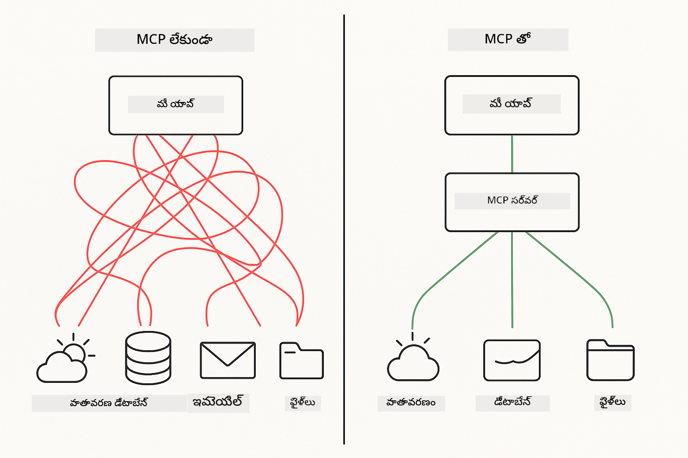
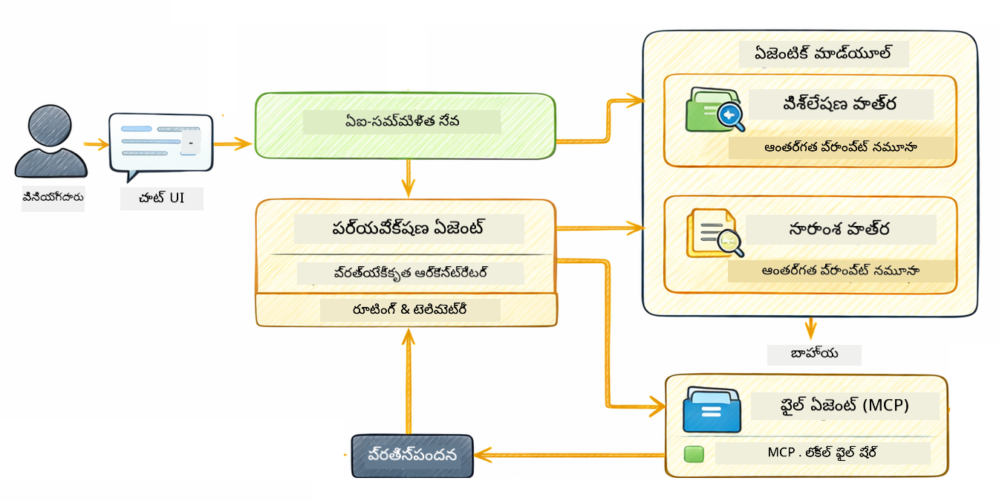

<!--
CO_OP_TRANSLATOR_METADATA:
{
  "original_hash": "f89f4c106d110e4943c055dd1a2f1dff",
  "translation_date": "2025-12-31T07:45:46+00:00",
  "source_file": "05-mcp/README.md",
  "language_code": "te"
}
-->
# Module 05: Model Context Protocol (MCP)

## Table of Contents

- [మీరు ఏమి నేర్చుకుంటారు](../../../05-mcp)
- [MCP అంటే 무엇인가?](../../../05-mcp)
- [MCP ఎలా పని చేస్తుంది](../../../05-mcp)
- [ఎజెంటిక్ మాడ్యూల్](../../../05-mcp)
- [ఉదాహరణలను రన్ చేయడం](../../../05-mcp)
  - [పూర్వఅవశ్యకతలు](../../../05-mcp)
- [త్వరిత ప్రారంభం](../../../05-mcp)
  - [ఫైల్ కార్యకలాపాలు (Stdio)](../../../05-mcp)
  - [సూపర్వైసర్ ఏజెంట్](../../../05-mcp)
    - [అవుట్పుట్‌ను అర్థం చేసుకోవడం](../../../05-mcp)
    - [ఎజెంటిక్ మాడ్యూల్ ఫీచర్ల వివరణ](../../../05-mcp)
- [ముఖ్యమైన సంకల్పనలు](../../../05-mcp)
- [అభినందనలు!](../../../05-mcp)
  - [తరువాత ఏమి?](../../../05-mcp)

## What You'll Learn

You've built conversational AI, mastered prompts, grounded responses in documents, and created agents with tools. But all those tools were custom-built for your specific application. What if you could give your AI access to a standardized ecosystem of tools that anyone can create and share? In this module, you'll learn how to do just that with the Model Context Protocol (MCP) and LangChain4j's agentic module. We first showcase a simple MCP file reader and then show how it easily integrates into advanced agentic workflows using the Supervisor Agent pattern.

## What is MCP?

The Model Context Protocol (MCP) provides exactly that - a standard way for AI applications to discover and use external tools. Instead of writing custom integrations for each data source or service, you connect to MCP servers that expose their capabilities in a consistent format. Your AI agent can then discover and use these tools automatically.



*Before MCP: Complex point-to-point integrations. After MCP: One protocol, endless possibilities.*

MCP solves a fundamental problem in AI development: every integration is custom. Want to access GitHub? Custom code. Want to read files? Custom code. Want to query a database? Custom code. And none of these integrations work with other AI applications.

MCP standardizes this. An MCP server exposes tools with clear descriptions and schemas. Any MCP client can connect, discover available tools, and use them. Build once, use everywhere.


*Model Context Protocol architecture - standardized tool discovery and execution*

## How MCP Works

**సర్వర్-క్లయింట్ వాస్టవికత**

MCP uses a client-server model. Servers provide tools - reading files, querying databases, calling APIs. Clients (your AI application) connect to servers and use their tools.

To use MCP with LangChain4j, add this Maven dependency:

```xml
<dependency>
    <groupId>dev.langchain4j</groupId>
    <artifactId>langchain4j-mcp</artifactId>
    <version>${langchain4j.version}</version>
</dependency>
```

**టూల్ కనుగొనడం**

When your client connects to an MCP server, it asks "What tools do you have?" The server responds with a list of available tools, each with descriptions and parameter schemas. Your AI agent can then decide which tools to use based on user requests.

**రవాణా విధానాలు**

MCP supports different transport mechanisms. This module demonstrates the Stdio transport for local processes:


*MCP transport mechanisms: HTTP for remote servers, Stdio for local processes*

**Stdio** - [StdioTransportDemo.java](../../../05-mcp/src/main/java/com/example/langchain4j/mcp/StdioTransportDemo.java)

For local processes. Your application spawns a server as a subprocess and communicates through standard input/output. Useful for filesystem access or command-line tools.

```java
McpTransport stdioTransport = new StdioMcpTransport.Builder()
    .command(List.of(
        npmCmd, "exec",
        "@modelcontextprotocol/server-filesystem@2025.12.18",
        resourcesDir
    ))
    .logEvents(false)
    .build();
```

> **🤖 Try with [GitHub Copilot](https://github.com/features/copilot) Chat:** Open [`StdioTransportDemo.java`](../../../05-mcp/src/main/java/com/example/langchain4j/mcp/StdioTransportDemo.java) and ask:
> - "Stdio రవాణా ఎలా పని చేస్తుంది మరియు నేను దాన్ని HTTP తో పోల్చి ఎప్పుడు ఉపయోగించాలి?"
> - "LangChain4j ఎలా spawned MCP సర్వర్ ప్రోసెస్‌ల జీవితచక్రాన్ని నిర్వహిస్తుంది?"
> - "AI కి ఫైల్ సిస్టమ్ యాక్సెస్ ఇస్తే有哪些 భద్రతా ప్రభావాలు?"

## The Agentic Module

While MCP provides standardized tools, LangChain4j's **agentic module** provides a declarative way to build agents that orchestrate those tools. The `@Agent` annotation and `AgenticServices` let you define agent behavior through interfaces rather than imperative code.

In this module, you'll explore the **Supervisor Agent** pattern — an advanced agentic AI approach where a "supervisor" agent dynamically decides which sub-agents to invoke based on user requests. We'll combine both concepts by giving one of our sub-agents MCP-powered file access capabilities.

To use the agentic module, add this Maven dependency:

```xml
<dependency>
    <groupId>dev.langchain4j</groupId>
    <artifactId>langchain4j-agentic</artifactId>
    <version>${langchain4j.mcp.version}</version>
</dependency>
```

> **⚠️ ప్రయోగాత్మక:** The `langchain4j-agentic` module is **ప్రయోగాత్మకంగా** మరియు మారవచ్చు. The stable way to build AI assistants remains `langchain4j-core` with custom tools (Module 04).

## Running the Examples

### Prerequisites

- Java 21+, Maven 3.9+
- Node.js 16+ and npm (for MCP servers)
- Environment variables configured in `.env` file (from the root directory):
  - **For StdioTransportDemo:** `GITHUB_TOKEN` (GitHub Personal Access Token)
  - **For SupervisorAgentDemo:** `AZURE_OPENAI_ENDPOINT`, `AZURE_OPENAI_API_KEY`, `AZURE_OPENAI_DEPLOYMENT` (same as Modules 01-04)

> **Note:** If you haven't set up your environment variables yet, see [Module 00 - Quick Start](../00-quick-start/README.md) for instructions, or copy `.env.example` to `.env` in the root directory and fill in your values.

## Quick Start

**Using VS Code:** Simply right-click on any demo file in the Explorer and select **"Run Java"**, or use the launch configurations from the Run and Debug panel (make sure you've added your token to the `.env` file first).

**Using Maven:** Alternatively, you can run from the command line with the examples below.

### File Operations (Stdio)

This demonstrates local subprocess-based tools.

**✅ ముందస్తు అవసరాలు అవసరంలేవు** - the MCP server is spawned automatically.

**Using VS Code:** Right-click on `StdioTransportDemo.java` and select **"Run Java"**.

**Using Maven:**

**Bash:**
```bash
export GITHUB_TOKEN=your_token_here
cd 05-mcp
mvn compile exec:java -Dexec.mainClass=com.example.langchain4j.mcp.StdioTransportDemo
```

**PowerShell:**
```powershell
$env:GITHUB_TOKEN=your_token_here
cd 05-mcp
mvn --% compile exec:java -Dexec.mainClass=com.example.langchain4j.mcp.StdioTransportDemo
```

The application spawns a filesystem MCP server automatically and reads a local file. Notice how the subprocess management is handled for you.

**Expected output:**
```
Assistant response: The file provides an overview of LangChain4j, an open-source Java library
for integrating Large Language Models (LLMs) into Java applications...
```

### Supervisor Agent




The **Supervisor Agent pattern** is a **లవచికమైన** form of agentic AI. Unlike deterministic workflows (sequential, loop, parallel), a Supervisor uses an LLM to autonomously decide which agents to invoke based on the user's request.

**Combining Supervisor with MCP:** In this example, we give the `FileAgent` access to MCP file system tools via `toolProvider(mcpToolProvider)`. When a user asks to "read and analyze a file," the Supervisor analyzes the request and generates an execution plan. It then routes the request to `FileAgent`, which uses MCP's `read_file` tool to retrieve the content. The Supervisor passes that content to `AnalysisAgent` for interpretation, and optionally invokes `SummaryAgent` to condense the results.

This demonstrates how MCP tools integrate seamlessly into agentic workflows — the Supervisor doesn't need to know *how* files are read, only that `FileAgent` can do it. The Supervisor adapts dynamically to different types of requests and returns either the last agent's response or a summary of all operations.

**Using the Start Scripts (Recommended):**

The start scripts automatically load environment variables from the root `.env` file:

**Bash:**
```bash
cd 05-mcp
chmod +x start.sh
./start.sh
```

**PowerShell:**
```powershell
cd 05-mcp
.\start.ps1
```

**Using VS Code:** Right-click on `SupervisorAgentDemo.java` and select **"Run Java"** (ensure your `.env` file is configured).

**How the Supervisor Works:**

```java
// నిర్దిష్ట సామర్థ్యాలున్న బహుళ ఏజెంట్లను నిర్వచించండి
FileAgent fileAgent = AgenticServices.agentBuilder(FileAgent.class)
        .chatModel(model)
        .toolProvider(mcpToolProvider)  // ఫైల్ ఆపరేషన్ల కోసం MCP టూల్స్ ఉన్నాయి
        .build();

AnalysisAgent analysisAgent = AgenticServices.agentBuilder(AnalysisAgent.class)
        .chatModel(model)
        .build();

SummaryAgent summaryAgent = AgenticServices.agentBuilder(SummaryAgent.class)
        .chatModel(model)
        .build();

// ఈ ఏజెంట్లను సమన్వయించే ఒక సూపర్వైజర్‌ను సృష్టించండి
SupervisorAgent supervisor = AgenticServices.supervisorBuilder()
        .chatModel(model)  // ఆ "planner" మోడల్
        .subAgents(fileAgent, analysisAgent, summaryAgent)
        .responseStrategy(SupervisorResponseStrategy.SUMMARY)
        .build();

// సూపర్వైజర్ స్వయంగా ఏ ఏజెంట్లను పిలవాలో నిర్ణయిస్తుంది
// సహజ భాషా అభ్యర్థనను మాత్రమే పంపండి - LLM అమలును ప్లాన్ చేస్తుంది
String response = supervisor.invoke("Read the file at /path/file.txt and analyze it");
```

See [SupervisorAgentDemo.java](../../../05-mcp/src/main/java/com/example/langchain4j/mcp/SupervisorAgentDemo.java) for the complete implementation.

> **🤖 Try with [GitHub Copilot](https://github.com/features/copilot) Chat:** Open [`SupervisorAgentDemo.java`](../../../05-mcp/src/main/java/com/example/langchain4j/mcp/SupervisorAgentDemo.java) and ask:
> - "సూపర్వైసర్ ఎలా నిర్ణయిస్తుంది ఏ ఏజెంటులను ఆహ్వానించాలి?"
> - "సూపర్వైసర్ మరియు క్రమబద్ధమైన (Sequential) వర్క్‌ఫ్లో నమూనాల మధ్య తేడా ఏమిటి?"
> - "నాకు సూపర్వైసర్ యొక్క ప్లానింగ్ ప్రవర్తనను ఎలా అనుకూలీకరించవచ్చు?"

#### Understanding the Output

When you run the demo, you'll see a structured walkthrough of how the Supervisor orchestrates multiple agents. Here's what each section means:

```
======================================================================
  SUPERVISOR AGENT DEMO
======================================================================

This demo shows how a Supervisor Agent orchestrates multiple specialized agents.
The Supervisor uses an LLM to decide which agent to call based on the task.
```

**The header** introduces the demo and explains the core concept: the Supervisor uses an LLM (not hardcoded rules) to decide which agents to call.

```
--- AVAILABLE AGENTS -------------------------------------------------
  [FILE]     FileAgent     - Reads files using MCP filesystem tools
  [ANALYZE]  AnalysisAgent - Analyzes content for structure, tone, and themes
  [SUMMARY]  SummaryAgent  - Creates concise summaries of content
```

**Available Agents** shows the three specialized agents the Supervisor can choose from. Each agent has a specific capability:
- **FileAgent** can read files using MCP tools (external capability)
- **AnalysisAgent** analyzes content (pure LLM capability)
- **SummaryAgent** creates summaries (pure LLM capability)

```
--- USER REQUEST -----------------------------------------------------
  "Read the file at .../file.txt and analyze what it's about"
```

**User Request** shows what was asked. The Supervisor must parse this and decide which agents to invoke.

```
--- SUPERVISOR ORCHESTRATION -----------------------------------------
  The Supervisor will now decide which agents to invoke and in what order...

  +-- STEP 1: Supervisor chose -> FileAgent (reading file via MCP)
  |
  |   Input: .../file.txt
  |
  |   Result: LangChain4j is an open-source Java library designed to simplify...
  +-- [OK] FileAgent (reading file via MCP) completed

  +-- STEP 2: Supervisor chose -> AnalysisAgent (analyzing content)
  |
  |   Input: LangChain4j is an open-source Java library...
  |
  |   Result: Structure: The content is organized into clear paragraphs that int...
  +-- [OK] AnalysisAgent (analyzing content) completed
```

**Supervisor Orchestration** is where the magic happens. Watch how:
1. The Supervisor **chose FileAgent first** because the request mentioned "read the file"
2. FileAgent used MCP's `read_file` tool to retrieve the file contents
3. The Supervisor then **chose AnalysisAgent** and passed the file contents to it
4. AnalysisAgent analyzed the structure, tone, and themes

Notice the Supervisor made these decisions **స్వతంత్రంగా** based on the user's request — no hardcoded workflow!

**Final Response** is the Supervisor's synthesized answer, combining outputs from all agents it invoked. The example dumps the agentic scope showing the summary and analysis results stored by each agent.

```
--- FINAL RESPONSE ---------------------------------------------------
I read the contents of the file and analyzed its structure, tone, and key themes.
The file introduces LangChain4j as an open-source Java library for integrating
large language models...

--- AGENTIC SCOPE (Shared Memory) ------------------------------------
  Agents store their results in a shared scope for other agents to use:
  * summary: LangChain4j is an open-source Java library...
  * analysis: Structure: The content is organized into clear paragraphs that in...
```

### Explanation of Agentic Module Features

The example demonstrates several advanced features of the agentic module. Let's have a closer look at Agentic Scope and Agent Listeners.

**Agentic Scope** shows the shared memory where agents stored their results using `@Agent(outputKey="...")`. This allows:
- Later agents to access earlier agents' outputs
- The Supervisor to synthesize a final response
- You to inspect what each agent produced

```java
ResultWithAgenticScope<String> result = supervisor.invokeWithAgenticScope(request);
AgenticScope scope = result.agenticScope();
String story = scope.readState("story");
List<AgentInvocation> history = scope.agentInvocations("analysisAgent");
```

**Agent Listeners** enable monitoring and debugging of agent execution. The step-by-step output you see in the demo comes from an AgentListener that hooks into each agent invocation:
- **beforeAgentInvocation** - Called when the Supervisor selects an agent, letting you see which agent was chosen and why
- **afterAgentInvocation** - Called when an agent completes, showing its result
- **inheritedBySubagents** - When true, the listener monitors all agents in the hierarchy

```java
AgentListener monitor = new AgentListener() {
    private int step = 0;
    
    @Override
    public void beforeAgentInvocation(AgentRequest request) {
        step++;
        System.out.println("  +-- STEP " + step + ": " + request.agentName());
    }
    
    @Override
    public void afterAgentInvocation(AgentResponse response) {
        System.out.println("  +-- [OK] " + response.agentName() + " completed");
    }
    
    @Override
    public boolean inheritedBySubagents() {
        return true; // అన్ని ఉప-ఏజెంట్లకు ప్రసారం చేయండి
    }
};
```

Beyond the Supervisor pattern, the `langchain4j-agentic` module provides several powerful workflow patterns and features:

| Pattern | Description | Use Case |
|---------|-------------|----------|
| **Sequential** | క్రమంగా ఏజెంటులను అమలు చేయండి, అవుట్పుట్ తర్వాతి దానికి ప్రవహిస్తుంది | పైప్లైన్లు: పరిశోధన → విశ్లేషణ → నివేదిక |
| **Parallel** | ఏజెంటులను ఒకేగా నడిపించండి | స్వతంత్ర పనులు: వాతావరణం + వార్తలు + స్టాక్స్ |
| **Loop** | షరతు తీరినంతవరకు పునరావృతం చేయండి | నాణ్యత స్కోరింగ్: స్కోరు ≥ 0.8 వరకు మెరుగుపరచండి |
| **Conditional** | షరతుల ఆధారంగా మార్గనిర్దేశం చేయండి | ವರ್ಗీకరణ → నిపుణ ఏజెంట్‌కు రూట్ చేయడం |
| **Human-in-the-Loop** | మానవ చెక్పాయింట్లు జోడించండి | ఆమోద వర్క్‌ఫ్లోలు, కంటెంట్ సమీక్ష |

## Key Concepts

**MCP** is ideal when you want to leverage existing tool ecosystems, build tools that multiple applications can share, integrate third-party services with standard protocols, or swap tool implementations without changing code.

**The Agentic Module** works best when you want declarative agent definitions with `@Agent` annotations, need workflow orchestration (sequential, loop, parallel), prefer interface-based agent design over imperative code, or are combining multiple agents that share outputs via `outputKey`.

**The Supervisor Agent pattern** shines when the workflow isn't predictable in advance and you want the LLM to decide, when you have multiple specialized agents that need dynamic orchestration, when building conversational systems that route to different capabilities, or when you want the most flexible, adaptive agent behavior.

## Congratulations!

You've completed the LangChain4j for Beginners course. You've learned:

- How to build conversational AI with memory (Module 01)
- Prompt engineering patterns for different tasks (Module 02)
- Grounding responses in your documents with RAG (Module 03)
- Creating basic AI agents (assistants) with custom tools (Module 04)
- LangChain4j MCP మరియు Agentic మాడ్యూల్స్‌తో ప్రమాణీకృత టూల్స్‌ను ఒకీకృతం చేయడం (Module 05)

### తర్వాత ఏమి?

మాడ్యూల్‌లను పూర్తి చేసిన తర్వాత, LangChain4j టెస్టింగ్ భావనలను కార్యరూపంలో చూడటానికి [పరీక్షల మార్గదర్శి](../docs/TESTING.md)ని పరిశీలించండి.

**అధికారిక వనరులు:**
- [LangChain4j డాక్యుమెంటేషన్](https://docs.langchain4j.dev/) - విస్తృత మార్గదర్శకాలు మరియు API సూచిక
- [LangChain4j GitHub](https://github.com/langchain4j/langchain4j) - మూల కోడ్ మరియు ఉదాహరణలు
- [LangChain4j Tutorials](https://docs.langchain4j.dev/tutorials/) - వివిధ వినియోగాల కోసం దశలవారీ పాఠాలు

ఈ కోర్సు పూర్తి చేసినందుకు ధన్యవాదాలు!

---

**నావిగేషన్:** [← మునుపటి: Module 04 - Tools](../04-tools/README.md) | [తిరిగి ప్రధాన పేజీకి](../README.md)

---

<!-- CO-OP TRANSLATOR DISCLAIMER START -->
నిరాకరణ:

ఈ పత్రాన్ని AI అనువాద సేవ [Co-op Translator](https://github.com/Azure/co-op-translator) ఉపయోగించి అనువదించారు. మేము ఖచ్చితత్వానికి ప్రయత్నించినప్పటికీ, స్వయంచాలిత అనువాదాలలో పొరపాట్లు లేదా ఖచ్చితత్వ లోపాలు ఉండవచ్చు. మూల పత్రాన్ని దాని స్థానిక (మాతృ) భాషలోని వెర్షన్‌ను అధికారిక మూలంగా పరిగణించండి. కీలకమైన సమాచారం కోసం ప్రొఫెషనల్ మానవ అనువాదాన్ని సూచించబడుతుంది. ఈ అనువాదాన్ని ఉపయోగించడం వల్ల ఏర్పడిన ఏవైనా అపార్థాలు లేదా తప్పుగా అర్థం చేసుకోవడాలపై మేము బాధ్యులు కాదని గమనించండి.
<!-- CO-OP TRANSLATOR DISCLAIMER END -->