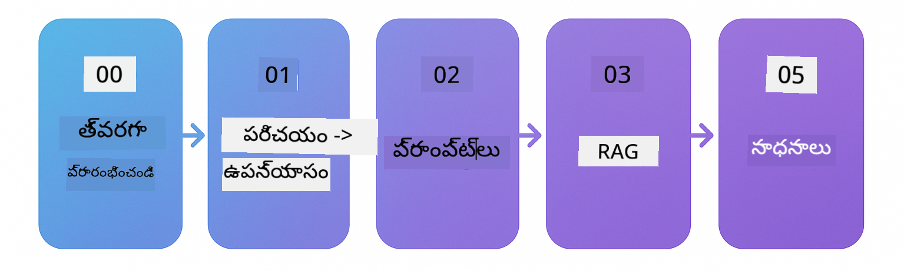

<!--
CO_OP_TRANSLATOR_METADATA:
{
  "original_hash": "1e85afe0b0ee47fc09b20442b0ee4ca5",
  "translation_date": "2025-12-23T11:29:21+00:00",
  "source_file": "README.md",
  "language_code": "te"
}
-->


### 🌐 బహుభాషా మద్దతు

#### GitHub Action ద్వారా మద్దతు (ఆటోమేటిక్ మరియు ఎప్పుడూ తాజా)

<!-- CO-OP TRANSLATOR LANGUAGES TABLE START -->
[అరబిక్](../ar/README.md) | [బెంగాలి](../bn/README.md) | [బల్గేరియన్](../bg/README.md) | [బర్మీస్ (మయన్మార్)](../my/README.md) | [చైనీస్ (సరళీకృత)](../zh/README.md) | [చైనీస్ (సాంప్రదాయ, హాంగ్ కాంగ్)](../hk/README.md) | [చైనీస్ (సాంప్రదాయ, మకావ్)](../mo/README.md) | [చైనీస్ (సాంప్రదాయ, తైవాన్)](../tw/README.md) | [క్రొయేషియన్](../hr/README.md) | [చెక్](../cs/README.md) | [డ్యానిష్](../da/README.md) | [డచ్](../nl/README.md) | [ఎస్టోనియన్](../et/README.md) | [ఫినిష్](../fi/README.md) | [ఫ్రెంచ్](../fr/README.md) | [జర్మన్](../de/README.md) | [గ్రీకు](../el/README.md) | [హిబ్రూ](../he/README.md) | [హిందీ](../hi/README.md) | [హంగేరియన్](../hu/README.md) | [ఇండోనేషియన్](../id/README.md) | [ఇటాలియన్](../it/README.md) | [జపనీస్](../ja/README.md) | [కన్నడ](../kn/README.md) | [కొరియన్](../ko/README.md) | [లిథువేనియన్](../lt/README.md) | [మలయ్](../ms/README.md) | [మలయాళం](../ml/README.md) | [మరాఠీ](../mr/README.md) | [నేపాలీ](../ne/README.md) | [నైజీరియన్ పిడ్జిన్](../pcm/README.md) | [నార్వీజియన్](../no/README.md) | [పర్షియన్ (ఫార్సీ)](../fa/README.md) | [పోలిష్](../pl/README.md) | [పోర్చుగీస్ (బ్రెజిల్)](../br/README.md) | [పోర్చుగీస్ (పోర్చుగల్)](../pt/README.md) | [పంజాబీ (గుర్ముఖి)](../pa/README.md) | [రొమేనియన్](../ro/README.md) | [రష్యన్](../ru/README.md) | [సెర్బియన్ (సిరిలిక్)](../sr/README.md) | [స్లోవాక్](../sk/README.md) | [స్లోవేనియన్](../sl/README.md) | [స్పానిష్](../es/README.md) | [స్వాహిలి](../sw/README.md) | [స్వీడిష్](../sv/README.md) | [టాగాలోగ్ (ఫిలిపినో)](../tl/README.md) | [తమిళ్](../ta/README.md) | [తెలుగు](./README.md) | [థాయ్](../th/README.md) | [టర్కిష్](../tr/README.md) | [ఉక్రెయిన్](../uk/README.md) | [ఉర్దూ](../ur/README.md) | [వియత్నామీస్](../vi/README.md)
<!-- CO-OP TRANSLATOR LANGUAGES TABLE END -->

# LangChain4j ప్రారంభీకులకు

LangChain4j మరియు Azure OpenAI GPT-5 తో బేసిక్ చాట్ నుండి AI ఏజెంట్ల వరకు AI అప్లికేషన్లు రూపొందించడంపై ఒక కోర్సు.

**LangChain4j గురించి కొత్తవారా?** ముఖ్య పదాలు మరియు భావనల నిర్వచనాల కోసం [పరిభాషా](docs/GLOSSARY.md) చూడండి.

## Table of Contents

1. [త్వరిత ప్రారంభం](00-quick-start/README.md) - LangChain4j తో ప్రారంభించండి
2. [పరిచయం](01-introduction/README.md) - LangChain4j యొక్క ప్రాథమిక అంశాలను నేర్చుకోండి
3. [ప్రాంప్ట్ ఇంజినీరింగ్](02-prompt-engineering/README.md) - సమర్థవంతమైన ప్రాంప్ట్ రూపకల్పనలో నిపుణులు అవ్వండి
4. [RAG (Retrieval-Augmented Generation)](03-rag/README.md) - తెలివైన జ్ఞాన ఆధారిత వ్యవస్థలను నిర్మించండి
5. [సాధనాలు](04-tools/README.md) - బయటి సాధనాలు మరియు APIs ను AI ఏజెంట్లతో ఏకీకృతం చేయండి
6. [MCP (Model Context Protocol)](05-mcp/README.md) - Model Context Protocol తో పని చేయండి
---

##  అధ్యయన మార్గం

> **త్వరిత ప్రారంభం**

1. ఈ రిపోజిటరీని మీ GitHub ఖాతాకు Fork చేయండి
2. నొక్కండి **Code** → **Codespaces** ట్యాబ్ → **...** → **New with options...**
3. డిఫాల్ట్ పద్దతులను ఉపయోగించండి – ఇది ఈ కోర్సు కోసం సృష్టించిన Development container‌ను ఎంచుకుంటుంది
4. నొక్కండి **Create codespace**
5. పర్యావరణం సిద్ధంగా ఉండడానికి 5-10 నిమిషాలు వేచి ఉండండి
6. ప్రారంభించడానికి నేరుగా [త్వరిత ప్రారంభం](./00-quick-start/README.md) కి వెళ్లండి!

> **స్థానికంగా క్లోన్ చేయాలనుకుంటున్నారా?**
>
> ఈ రిపోజిటరీ 50+ భాషా అనువాదాలను కలిగి ఉంది, ఇవి డౌన్లోడ్ పరిమాణాన్ని గణనీయంగా పెంచతాయి. అనువాదాల్లేకుండా క్లోన్ చేయడానికి, sparse checkout ఉపయోగించండి:
> ```bash
> git clone --filter=blob:none --sparse https://github.com/microsoft/LangChain4j-for-Beginners.git
> cd LangChain4j-for-Beginners
> git sparse-checkout set --no-cone '/*' '!translations' '!translated_images'
> ```
> ఇది కోర్సు పూర్తి చేయడానికి మీకు కావలసిన ప్రతి అంశాన్ని ఇస్తుంది మరియు డౌన్లోడ్ చాలా వేగంగా ఉంటుంది.

ప్రారంభించండి [త్వరిత ప్రారంభం](00-quick-start/README.md) మాడ్యూల్‌తో మరియు ప్రతి మాడ్యూల్ ను దశలవారీగా పూర్తి చేసి మీ నైపుణ్యాలను అభివృద్ధి చేసుకోండి. మొదట మీరు ప్రాథమిక ఉదాహరణలతో మూలాంశాలను అర్థం చేసుకుంటారు, తరువాత GPT-5 తో మరింత లోతైన అధ్యయనానికి [పరిచయం](01-introduction/README.md) మాడ్యూల్‌లోకి వెళ్లండి.



మాడ్యూల్స్ పూర్తి చేసిన తర్వాత, LangChain4j టెస్టింగ్ కాన్సెప్ట్స్‌ను కార్యరూపంలో చూడడానికి [టెస్టింగ్ గైడ్](docs/TESTING.md) ను పరిశీలించండి.

> **గమనిక:** ఈ శిక్షణలో GitHub Models మరియు Azure OpenAI రెండింటినీ ఉపయోగిస్తారు. [త్వరిత ప్రారంభం](00-quick-start/README.md) మరియు [MCP](05-mcp/README.md) మాడ్యూల్స్ GitHub Models ను ఉపయోగిస్తాయి (Azure subscription అవసరం లేదు), అయితే మాడ్యూల్స్ 1-4 Azure OpenAI GPT-5 ను ఉపయోగిస్తాయి.


## GitHub Copilot తో నేర్చుకోవడం

త్వరగా కోడింగ్ ప్రారంభించడానికి, ఈ ప్రాజెక్ట్‌ను ప్రదానం చేయబడిన devcontainer తో GitHub Codespace లేదా మీ స్థానిక IDE లో తెరవండి. ఈ కోర్సులో ఉపయోగించే devcontainer GitHub Copilot తో AI పేయర్డ్ ప్రోగ్రామింగ్ కోసం ముందుగా కాన్ఫిగర్ చేయబడింది.

ప్రతి కోడ్ ఉదాహరణలో GitHub Copilot కు అడగగలిగే సూచించిన ప్రశ్నలు ఉంటాయి మీ అవగాహనను లోతుగా చేసుకోవడానికి. క్రింది 💡/🤖 సూచనలను చూడండి:

- **Java ఫైల్ హెడర్‌లు** - ప్రతి ఉదాహరణకు ప్రత్యేక ప్రశ్నలు
- **మాడ్యూల్ READMEలు** - కోడ్ ఉదాహరణల తర్వాత అన్వేషణ సూచనలు

**వాడే విధానం:** ఏదైనా కోడ్ ఫైల్ ఓపెన్ చేసి Copilot కి సూచించిన ప్రశ్నలు అడగండి. దీనికి కోడ్‌బేస్ పూర్తి సందర్భంతో ఉంది మరియు ఇది వివరణ ఇవ్వగలదు, విస్తరించగలదు, మరియు ప్రత్యామ్నాయాలను సూచించగలదు.

Want to learn more? Check out [Copilot for AI Paired Programming](https://aka.ms/GitHubCopilotAI).


## అదనపు వనరులు

<!-- CO-OP TRANSLATOR OTHER COURSES START -->
### LangChain
[](https://aka.ms/langchain4j-for-beginners)
[](https://aka.ms/langchainjs-for-beginners?WT.mc_id=m365-94501-dwahlin)

---

### Azure / Edge / MCP / ఏజెంట్లు
[](https://github.com/microsoft/AZD-for-beginners?WT.mc_id=academic-105485-koreyst)
[](https://github.com/microsoft/edgeai-for-beginners?WT.mc_id=academic-105485-koreyst)
[](https://github.com/microsoft/mcp-for-beginners?WT.mc_id=academic-105485-koreyst)
[](https://github.com/microsoft/ai-agents-for-beginners?WT.mc_id=academic-105485-koreyst)

---
 
### జనరేటివ్ AI సిరీస్
[](https://github.com/microsoft/generative-ai-for-beginners?WT.mc_id=academic-105485-koreyst)
[-9333EA?style=for-the-badge&labelColor=E5E7EB&color=9333EA)](https://github.com/microsoft/Generative-AI-for-beginners-dotnet?WT.mc_id=academic-105485-koreyst)
[-C084FC?style=for-the-badge&labelColor=E5E7EB&color=C084FC)](https://github.com/microsoft/generative-ai-for-beginners-java?WT.mc_id=academic-105485-koreyst)
[-E879F9?style=for-the-badge&labelColor=E5E7EB&color=E879F9)](https://github.com/microsoft/generative-ai-with-javascript?WT.mc_id=academic-105485-koreyst)

---
 
### కోర్ లెర్నింగ్
[](https://aka.ms/ml-beginners?WT.mc_id=academic-105485-koreyst)
[](https://aka.ms/datascience-beginners?WT.mc_id=academic-105485-koreyst)
[](https://aka.ms/ai-beginners?WT.mc_id=academic-105485-koreyst)
[](https://github.com/microsoft/Security-101?WT.mc_id=academic-96948-sayoung)
[](https://aka.ms/webdev-beginners?WT.mc_id=academic-105485-koreyst)
[](https://aka.ms/iot-beginners?WT.mc_id=academic-105485-koreyst)
[](https://github.com/microsoft/xr-development-for-beginners?WT.mc_id=academic-105485-koreyst)

---
 
### Copilot సిరీస్
[](https://aka.ms/GitHubCopilotAI?WT.mc_id=academic-105485-koreyst)
[](https://github.com/microsoft/mastering-github-copilot-for-dotnet-csharp-developers?WT.mc_id=academic-105485-koreyst)
[](https://github.com/microsoft/CopilotAdventures?WT.mc_id=academic-105485-koreyst)
<!-- CO-OP TRANSLATOR OTHER COURSES END -->

## సహాయం పొందండి

AI యాప్‌లను నిర్మించడంలో మీరు చిక్కుకున్నట్లయితే లేదా మీకు ఏదైనా ప్రశ్నలు ఉంటే, చేరండి:

[](https://aka.ms/foundry/discord)

ఉత్పత్తి గురించి మీ ఫీడ్‌బ్యాక్ లేదా బిల్డ్ చేయడంలో వచ్చిన లోపాల కోసం, సందర్శించండి:

[](https://aka.ms/foundry/forum)

## లైసెన్స్

MIT లైసెన్స్ - వివరాల కోసం [LICENSE](../../LICENSE) ఫైల్‌ను చూడండి.

---

<!-- CO-OP TRANSLATOR DISCLAIMER START -->
డిస్క్లెయిమర్:
ఈ డాక్యుమెంటును AI అనువాద సేవ [Co-op Translator](https://github.com/Azure/co-op-translator) ఉపయోగించి అనువదించాం. మేము ఖచ్చితత్వానికి ప్రయత్నిస్తూనే ఉన్నా, ఆటోమెటిక్ అనువాదాల్లో పొరపాట్లు లేదా అసత్యతలు ఉండే అవకాశం ఉందని దయచేసి గమనించండి. మూల దేశీ భాషలో ఉన్న ఒరిజినల్ డాక్యుమెంట్‌ను అధికారిక మూలంగా పరిగణించాలి. కీలకమైన సమాచారం కోసం ప్రొఫెషనల్ మానవ అనువాదాన్ని సూచిస్తున్నాము. ఈ అనువాదాన్ని ఉపయోగించడం వల్ల ఏర్పడిన అవగాహనా లోపాలు లేదా తప్పుదారులు గురించి మేము బాధ్యత వహించము.
<!-- CO-OP TRANSLATOR DISCLAIMER END -->