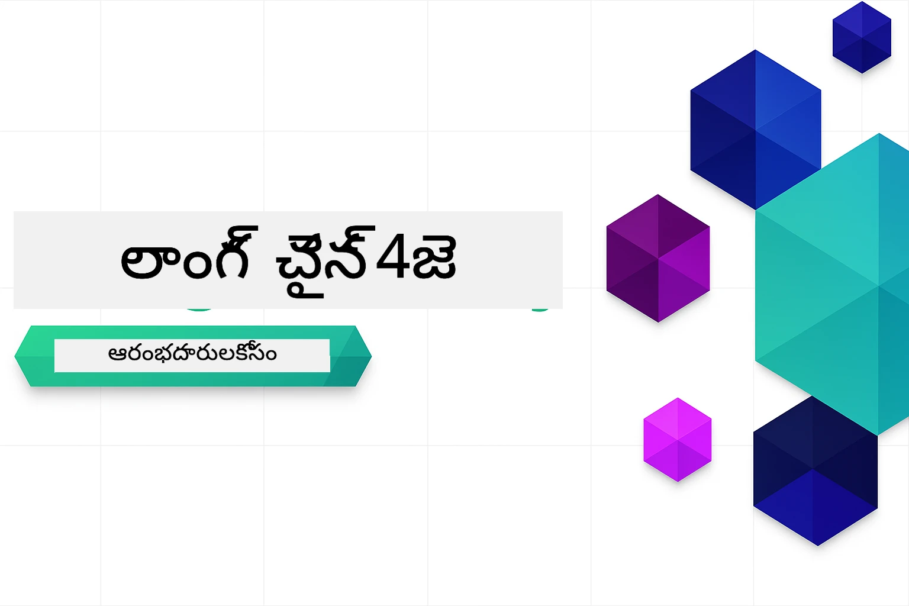

<!--
CO_OP_TRANSLATOR_METADATA:
{
  "original_hash": "7dffae166c7db7dc932a0e3d0217cbb7",
  "translation_date": "2026-01-16T12:38:05+00:00",
  "source_file": "README.md",
  "language_code": "te"
}
-->


### 🌐 బహుభాషా మద్దతు

#### GitHub చర్యల ద్వారా మద్దతు (స్వయంచాలిత & ఎప్పుడూ అప్‌టు-డేట్)

<!-- CO-OP TRANSLATOR LANGUAGES TABLE START -->
[Arabic](../ar/README.md) | [Bengali](../bn/README.md) | [Bulgarian](../bg/README.md) | [Burmese (Myanmar)](../my/README.md) | [Chinese (Simplified)](../zh/README.md) | [Chinese (Traditional, Hong Kong)](../hk/README.md) | [Chinese (Traditional, Macau)](../mo/README.md) | [Chinese (Traditional, Taiwan)](../tw/README.md) | [Croatian](../hr/README.md) | [Czech](../cs/README.md) | [Danish](../da/README.md) | [Dutch](../nl/README.md) | [Estonian](../et/README.md) | [Finnish](../fi/README.md) | [French](../fr/README.md) | [German](../de/README.md) | [Greek](../el/README.md) | [Hebrew](../he/README.md) | [Hindi](../hi/README.md) | [Hungarian](../hu/README.md) | [Indonesian](../id/README.md) | [Italian](../it/README.md) | [Japanese](../ja/README.md) | [Kannada](../kn/README.md) | [Korean](../ko/README.md) | [Lithuanian](../lt/README.md) | [Malay](../ms/README.md) | [Malayalam](../ml/README.md) | [Marathi](../mr/README.md) | [Nepali](../ne/README.md) | [Nigerian Pidgin](../pcm/README.md) | [Norwegian](../no/README.md) | [Persian (Farsi)](../fa/README.md) | [Polish](../pl/README.md) | [Portuguese (Brazil)](../br/README.md) | [Portuguese (Portugal)](../pt/README.md) | [Punjabi (Gurmukhi)](../pa/README.md) | [Romanian](../ro/README.md) | [Russian](../ru/README.md) | [Serbian (Cyrillic)](../sr/README.md) | [Slovak](../sk/README.md) | [Slovenian](../sl/README.md) | [Spanish](../es/README.md) | [Swahili](../sw/README.md) | [Swedish](../sv/README.md) | [Tagalog (Filipino)](../tl/README.md) | [Tamil](../ta/README.md) | [Telugu](./README.md) | [Thai](../th/README.md) | [Turkish](../tr/README.md) | [Ukrainian](../uk/README.md) | [Urdu](../ur/README.md) | [Vietnamese](../vi/README.md)

> **స్థానికంగా క్లోన్ చేయాలని ఇష్టపడుతున్నారా?**

> ఈ రిపోజిటరీ 50+ భాషల అనువాదాలను కలిగి ఉంది, ఇది డౌన్‌లోడ్ పరిమాణాన్ని గణనీయంగా పెంచుతుంది. అనువాదాలు లేకుండా క్లోన్ చేయడానికి, స్పార్స్ చెకౌట్ ఉపయోగించండి:
> ```bash
> git clone --filter=blob:none --sparse https://github.com/microsoft/LangChain4j-for-Beginners.git
> cd LangChain4j-for-Beginners
> git sparse-checkout set --no-cone '/*' '!translations' '!translated_images'
> ```
> ఇది మీరు కోర్సును పూర్తి చేయడానికి కావలసిన అన్ని అంశాలను చాలా వేగంగా డౌన్‌లోడ్ చేయడానికి ఇస్తుంది.
<!-- CO-OP TRANSLATOR LANGUAGES TABLE END -->

# ప్రారంభकर्तుల కోసం LangChain4j

ప్రాథమిక చాట్ నుండి AI ఏజెంట్ల వరకు LangChain4j మరియు Azure OpenAI GPT-5 తో AI అనువర్తనాలను నిర్మించేందుకు ఒక కోర్సు.

**LangChain4j కొత్తవారా?** ముఖ్య పదాలు మరియు భావనల నిర్వచనాల కోసం [Glossary](docs/GLOSSARY.md)ను పరిశీలించండి.

## విషయం సూచిక

1. [త్వరిత ప్రారంభం](00-quick-start/README.md) - LangChain4j తో ప్రారంభించండి
2. [పరిచయం](01-introduction/README.md) - LangChain4j మూలాంశాలను నేర్చుకోండి
3. [ప్రాంప్ట్ ఇంజనీరింగ్](02-prompt-engineering/README.md) - సమర్థవంతమైన ప్రాంప్ట్ రూపకల్పనలో నైపుణ్యం సాధించండి
4. [RAG (రిమోట్ ఆగ్మెంటెడ్ జనరేషన్)](03-rag/README.md) - తెలివైన పరిజ్ఞానం ఆధారిత సిస్టమ్లను నిర్మించండి
5. [ఉపకరణాలు](04-tools/README.md) - బాహ్య టూల్‌లు మరియు సులభ సహాయకులను సమ్మిళితం చేయండి
6. [MCP (మోడల్ కాంటెక్స్ట్ ప్రోటోకాల్)](05-mcp/README.md) - మోడల్ కాంటెక్స్ట్ ప్రోటోకాల్ (MCP) మరియు ఏజెంట్ మోడ్యూల్స్ పై పని చేయండి
---

## అధ్యయన మార్గం

> **త్వరిత ప్రారంభం**

1. ఈ రిపోజిటరీని మీ GitHub ఖాతాకు Fork చేసుకోండి
2. **Code** → **Codespaces** ట్యాబ్ → **...** → **New with options...** క్లిక్ చేయండి
3. డిఫాల్ట్స్ ఉపయోగించండి – ఇది ఈ కోర్సు కోసం సృష్టించబడిన డెవలప్‌మెంట్ కంటైనర్‌ని ఎంచుకుంటుంది
4. **Create codespace** క్లిక్ చేయండి
5. పర్యావరణం సిద్ధం కావడానికి 5-10 నిమిషాలు వేచి ఉండండి
6. ప్రారంభం కోసం నేరుగా [త్వరిత ప్రారంభం](./00-quick-start/README.md)కు వెళ్లండి!

మాడ్యూల్స్ పూర్తి చేసిన తరువాత, LangChain4j టెస్టింగ్ భావ‌న‌ల‌ను కార్యాచరణ‌లో చూచేందుకు [Testing Guide](docs/TESTING.md)ను అన్వేషించండి.

> **గమనిక:** ఈ శిక్షణ GitHub మోడల్స్ మరియు Azure OpenAI రెండింటినీ ఉపయోగిస్తుంది. [త్వరిత ప్రారంభం](00-quick-start/README.md) మాడ్యూల్ GitHub మోడల్స్‌ను ఉపయోగిస్తుంది (Azure సబ్‌స్క్రిప్షన్ అవసరం లేదు), మాడ్యూల్స్ 1-5 Azure OpenAI ఉపయోగిస్తాయి.


## GitHub Copilot తో నేర్చుకోవడం

త్వరగా కోడింగ్ ప్రారంభించడానికి, ఈ ప్రాజెక్టును GitHub Codespace లేదా మీ స్థానిక IDEలోని అందించిన devcontainerతో ఓపెన్ చేయండి. ఈ కోర్సులో ఉపయోగించిన devcontainer GitHub Copilot తో AI జతగా ప్రోగ్రామింగ్ కోసం ప్రీ-కాన్పిగర్ చేయబడి ఉంది.

ప్రతి కోడ్ ఉదాహరణ GitHub Copilot ని అడగవచ్చు అనుకునే ప్రశ్నలను కలిగి ఉంటుంది, ఇవి మీ అవగాహనను మరింతలోతుగా చేస్తాయి. 💡/🤖 సూచనలు కోసం చూడండి:

- **జావా ఫైల్ హెడర్లలో** - ప్రతి ఉదాహరణకు ప్రత్యేక ప్రశ్నలు
- **మాడ్యూల్ READMEలు** - కోడ్ ఉదాహరణల తర్వాత అన్వేషణ సూచనలు

**ఎలా ఉపయోగించాలి:** ఏదైనా కోడ్ ఫైల్ ఓపెన్ చేసి Copilot ని సూచించిన ప్రశ్నలతో అడగండి. ఇది కోడ్‌బేస్ యొక్క పూర్తి కాంటెక్స్ట్ కలిగి ఉంటుంది మరియు వివరించడంలో, విస్తరించడంలో మరియు ప్రత్యామ్నాయాలు సూచించడంలో సహాయం చేస్తుంది.

మరింత తెలుసుకోవాలంటే, [Copilot for AI Paired Programming](https://aka.ms/GitHubCopilotAI)ను చూడండి.


## అదనపు వనరులు

<!-- CO-OP TRANSLATOR OTHER COURSES START -->
### LangChain
[](https://aka.ms/langchain4j-for-beginners)
[](https://aka.ms/langchainjs-for-beginners?WT.mc_id=m365-94501-dwahlin)

---

### Azure / ఎడ్జ్ / MCP / ఏజెంట్లు
[](https://github.com/microsoft/AZD-for-beginners?WT.mc_id=academic-105485-koreyst)
[](https://github.com/microsoft/edgeai-for-beginners?WT.mc_id=academic-105485-koreyst)
[](https://github.com/microsoft/mcp-for-beginners?WT.mc_id=academic-105485-koreyst)
[](https://github.com/microsoft/ai-agents-for-beginners?WT.mc_id=academic-105485-koreyst)

---
 
### జనరేటివ్ AI సిరీస్
[](https://github.com/microsoft/generative-ai-for-beginners?WT.mc_id=academic-105485-koreyst)
[-9333EA?style=for-the-badge&labelColor=E5E7EB&color=9333EA)](https://github.com/microsoft/Generative-AI-for-beginners-dotnet?WT.mc_id=academic-105485-koreyst)
[-C084FC?style=for-the-badge&labelColor=E5E7EB&color=C084FC)](https://github.com/microsoft/generative-ai-for-beginners-java?WT.mc_id=academic-105485-koreyst)
[-E879F9?style=for-the-badge&labelColor=E5E7EB&color=E879F9)](https://github.com/microsoft/generative-ai-with-javascript?WT.mc_id=academic-105485-koreyst)

---
 
### కోర్ లెర్నింగ్
[](https://aka.ms/ml-beginners?WT.mc_id=academic-105485-koreyst)
[](https://aka.ms/datascience-beginners?WT.mc_id=academic-105485-koreyst)
[](https://aka.ms/ai-beginners?WT.mc_id=academic-105485-koreyst)
[](https://github.com/microsoft/Security-101?WT.mc_id=academic-96948-sayoung)
[](https://aka.ms/webdev-beginners?WT.mc_id=academic-105485-koreyst)
[](https://aka.ms/iot-beginners?WT.mc_id=academic-105485-koreyst)
[](https://github.com/microsoft/xr-development-for-beginners?WT.mc_id=academic-105485-koreyst)

---
 
### కోపిలట్ సిరీస్

[](https://aka.ms/GitHubCopilotAI?WT.mc_id=academic-105485-koreyst)
[](https://github.com/microsoft/mastering-github-copilot-for-dotnet-csharp-developers?WT.mc_id=academic-105485-koreyst)
[](https://github.com/microsoft/CopilotAdventures?WT.mc_id=academic-105485-koreyst)
<!-- CO-OP TRANSLATOR OTHER COURSES END -->

## సహాయం పొందడం

మీరు ఆగిపోయినప్పుడు లేదా AI యాప్‌ల నిర్మాణం గురించి ఏవైనా ప్రశ్నలు ఉన్నప్పుడు, క్రింది లింక్‌లో చేరండి:

[](https://aka.ms/foundry/discord)

ఉత్పత్తి ప్రతిక్రియ లేదా నిర్మాణం సమయంలో లోపాలు ఉంటే తిరిగి చూడండి:

[](https://aka.ms/foundry/forum)

## లైసెన్స్

MIT లైసెన్స్ - వివరాలకు [LICENSE](../../LICENSE) ఫైల్‌ను చూడండి.

---

<!-- CO-OP TRANSLATOR DISCLAIMER START -->
**డిస్క్లెయిమర్**:  
ఈ పత్రాన్ని AI అనువాద సేవ [Co-op Translator](https://github.com/Azure/co-op-translator) ఉపయోగించి అనువదించబడింది. మేము సరైనత కోసం శ్రమిస్తున్నప్పటికీ, ఆటోమేటెడ్ అనువాదాలలో తప్పులు లేదా తప్పుదోషాలు ఉండవచ్చు అని దయచేసి గమనించండి. అసలు సబంధ భాషలో ఉన్న ఒరిజినల్ పత్రం అత్యంత అధికారిక మూలంగా పరిగణించబడాలి. ముఖ్యమైన సమాచారం కోసం, వ్యावహారిక మానవ అనువాదాన్ని సూచించబడినది. ఈ అనువాదం వలన సంభ‌వించే ఏవైనా అపవాదాలు లేదా తప్పు అర్థాలు చెల్లించలేము.
<!-- CO-OP TRANSLATOR DISCLAIMER END -->