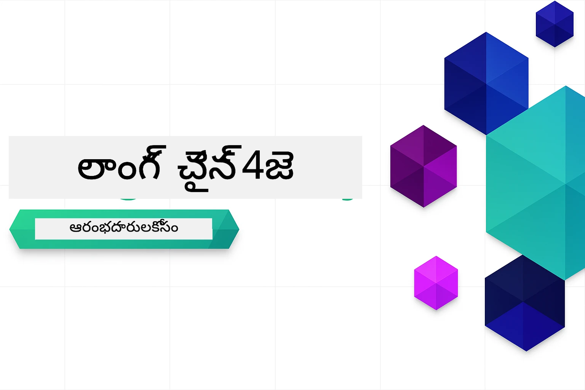

# ప్రారంభకులకు LangChain4j

మూల చాట్ నుండి AI ఏజెంట్ల వరకు LangChain4j మరియు Azure OpenAI GPT-5.2 తో AI అప్లికేషన్లను నిర్మించడానికి ఒక కోర్సు.

### 🌐 బహుభాషా మద్దతు

#### GitHub Action ద్వారా మద్దతు (ఆటోమేటెడ్ & ఎప్పుడూ తాజా)

<!-- CO-OP TRANSLATOR LANGUAGES TABLE START -->
[Arabic](../ar/README.md) | [Bengali](../bn/README.md) | [Bulgarian](../bg/README.md) | [Burmese (Myanmar)](../my/README.md) | [Chinese (Simplified)](../zh-CN/README.md) | [Chinese (Traditional, Hong Kong)](../zh-HK/README.md) | [Chinese (Traditional, Macau)](../zh-MO/README.md) | [Chinese (Traditional, Taiwan)](../zh-TW/README.md) | [Croatian](../hr/README.md) | [Czech](../cs/README.md) | [Danish](../da/README.md) | [Dutch](../nl/README.md) | [Estonian](../et/README.md) | [Finnish](../fi/README.md) | [French](../fr/README.md) | [German](../de/README.md) | [Greek](../el/README.md) | [Hebrew](../he/README.md) | [Hindi](../hi/README.md) | [Hungarian](../hu/README.md) | [Indonesian](../id/README.md) | [Italian](../it/README.md) | [Japanese](../ja/README.md) | [Kannada](../kn/README.md) | [Khmer](../km/README.md) | [Korean](../ko/README.md) | [Lithuanian](../lt/README.md) | [Malay](../ms/README.md) | [Malayalam](../ml/README.md) | [Marathi](../mr/README.md) | [Nepali](../ne/README.md) | [Nigerian Pidgin](../pcm/README.md) | [Norwegian](../no/README.md) | [Persian (Farsi)](../fa/README.md) | [Polish](../pl/README.md) | [Portuguese (Brazil)](../pt-BR/README.md) | [Portuguese (Portugal)](../pt-PT/README.md) | [Punjabi (Gurmukhi)](../pa/README.md) | [Romanian](../ro/README.md) | [Russian](../ru/README.md) | [Serbian (Cyrillic)](../sr/README.md) | [Slovak](../sk/README.md) | [Slovenian](../sl/README.md) | [Spanish](../es/README.md) | [Swahili](../sw/README.md) | [Swedish](../sv/README.md) | [Tagalog (Filipino)](../tl/README.md) | [Tamil](../ta/README.md) | [Telugu](./README.md) | [Thai](../th/README.md) | [Turkish](../tr/README.md) | [Ukrainian](../uk/README.md) | [Urdu](../ur/README.md) | [Vietnamese](../vi/README.md)

> **స్థానికంగా క్లోన్ చేయాలనుకుంటున్నారా?**
>
> ఈ రిపోజిటరీ 50+ భాషా అనువాదాలను కలిగి ఉంది, ఇది డౌన్‌లోడ్ పరిమాణాన్ని గణనీయంగా పెంచుతుంది. అనువాదాలు లేకుండా క్లోన్ చేయడానికి, స్పార్స్ చెకౌట్ ఉపయోగించండి:
>
> **Bash / macOS / Linux:**
> ```bash
> git clone --filter=blob:none --sparse https://github.com/microsoft/LangChain4j-for-Beginners.git
> cd LangChain4j-for-Beginners
> git sparse-checkout set --no-cone '/*' '!translations' '!translated_images'
> ```
>
> **CMD (Windows):**
> ```cmd
> git clone --filter=blob:none --sparse https://github.com/microsoft/LangChain4j-for-Beginners.git
> cd LangChain4j-for-Beginners
> git sparse-checkout set --no-cone "/*" "!translations" "!translated_images"
> ```
>
> ఇది మీకు కోర్సును పూర్తిచేయడానికి అవసరమైన అన్ని ఫైళ్ళను త్వరగా డౌన్లోడ్ చేస్తుంది.
<!-- CO-OP TRANSLATOR LANGUAGES TABLE END -->

## కంటెంట్ పట్టిక

1. [పరిచయం](01-introduction/README.md) - LangChain4j యొక్క ప్రాథమిక విషయాలు నేర్చుకోండి  
2. [ప్రాంప్ట్ ఇంజనీరింగ్](02-prompt-engineering/README.md) - సమర్థవంతమైన ప్రాంప్ట్ రూపకల్పనలో నైపుణ్యం సాధించండి  
3. [RAG (రిట్రీవల్-ఆగ్మెంటెడ్ జనరేషన్)](03-rag/README.md) - తెలివైన జ్ఞానం ఆధారిత వ్యవస్థలను నిర్మించండి  
4. [ఉపకరణాలు](04-tools/README.md) - బయటి ఉపకరణాలు మరియు సులభ సహాయకులను ఇంటిగ్రేట్ చేయండి  
5. [MCP (మోడల్ కాంటెక్ట్ ప్రోటోకాల్)](05-mcp/README.md) - మోడల్ కాంటెక్ట్ ప్రోటోకాల్ (MCP) మరియు ఏజెంటిక్ మాడ్యూలులతో పని చేయండి  

### వీడియో వాక్‌త్రూప్స్

ప్రతి మాడ్యూల్‌కు మా టదుపు సంభాషణలో ఆ ఉత్సాహంతో కాంసెప్ట్స్ మరియు కోడ్‌ను దశల వారీగా వివరిస్తుంది.

| మాడ్యూల్ | వీడియో |
|--------|-------|
| 01 - పరిచయం | [LangChain4j తో ప్రారంభించడం](https://www.youtube.com/live/nl_troDm8rQ) |
| 02 - ప్రాంప్ట్ ఇంజనీరింగ్ | [LangChain4j తో ప్రాంప్ట్ ఇంజనీరింగ్](https://www.youtube.com/live/PJ6aBaE6bog) |
| 03 - RAG | [LangChain4j తో RAG](https://www.youtube.com/watch?v=_olq75ZH_eY) |
| 04 - ఉపకరణాలు & 05 - MCP | [ఉపకరణాలు మరియు MCP తో AI ఏజెంట్ల](https://www.youtube.com/watch?v=O_J30kZc0rw) |

---

## అభ్యసన మార్గం

**LangChain4j కొత్తవా?** ముఖ్య పదాలు మరియు కాన్సెప్ట్ల నిర్వచనాల కోసం [Glossary](docs/GLOSSARY.md) ని చూడండి.

> **త్వరిత ప్రారంభం**

1. ఈ రిపోజిటరీని మీ GitHub ఖాతాకు ఫోర్క్ చేయండి  
2. **Code** → **Codespaces** ట్యాబ్ → **...** → **New with options...** ఎంచుకోండి  
3. డిఫాల్ట్స్ ఉపయోగించండి – ఇది ఈ కోర్సు కోసం సృష్టించిన డెవలప్‌మెంట్ కంటైనర్‌ను ఎంచుకుంటుంది  
4. **Create codespace** క్లిక్ చేయండి  
5. వాతావరణం సిద్ధంగా ఉండేందుకు 5-10 నిమిషాలు వేచివుండండి  
6. సిద్దమైన తరువాత [Introduction](./01-introduction/README.md) కి వెళ్లి ప్రారంభించండి!  

మాడ్యూల్‌లు పూర్తిచేసిన తర్వాత, LangChain4j పరీక్షా కాన్సెప్ట్లను ప్రత్యక్షంగా చూడటానికి [Testing Guide](docs/TESTING.md) ని అన్వేషించండి.

> **గమనిక:** ఈ శిక్షణ Azure OpenAI ఉపయోగిస్తుంది. మీరు ఖాతా లేదా లేనివారు అయితే [ఉచిత Azure ఖాతా](https://aka.ms/azure-free-account) తో ప్రారంభించండి.


## GitHub Copilot తో అభ్యసనం

త్వరగా కోడింగ్ చేయడానికి, GitHub Codespace లేదా మీ స్థానిక IDEలో ఈ ప్రాజెక్టును devcontainer తో తెరవండి. ఈ కోర్సులో ఉపయోగించబడిన devcontainer GitHub Copilot తో AI జోడి ప్రోగ్రామింగ్ కోసం ముందేనుంచి కలవెనుక ఉంటుంది.

ప్రతి కోడ్ ఉదాహరణ కోసం GitHub Copilot కి అడగగలిగే సూచనల ప్రశ్నలు ఉంటాయి, ఇవి మీ అర్థాన్ని పెంపొందిస్తాయి. 💡/🤖 సూచనలు కోసం చూడండి:

- **జావా ఫైల్ హెడ్డర్స్** - ప్రతి ఉదాహరణకు ప్రత్యేక ప్రశ్నలు  
- **మాడ్యూల్ READMEలు** - కోడ్ ఉదాహరణల తర్వాత అన్వేషణ సూచనలు  

**ఎలా వాడాలి:** ఏ కోడ్ ఫైల్ ను తెరవండి, Copilot కి సూచనల ప్రశ్నలు అడగండి. దీనికి కోడ్బేస్ యొక్క పూర్తి సందర్భం ఉంటుంది, అది వివరించగలదు, విస్తరించగలదు మరియు ప్రత్యామ్నాయాలు సూచించగలదు.

ఇంకా తెలుసుకోవాలనుకుంటున్నారా? [AI జోడి ప్రోగ్రామింగ్ కోసం Copilot](https://aka.ms/GitHubCopilotAI) చూడండి.


## అదనపు వనరులు

<!-- CO-OP TRANSLATOR OTHER COURSES START -->
### LangChain
[](https://aka.ms/langchain4j-for-beginners)
[](https://aka.ms/langchainjs-for-beginners?WT.mc_id=m365-94501-dwahlin)
[](https://github.com/microsoft/langchain-for-beginners?WT.mc_id=m365-94501-dwahlin)
---

### Azure / ఎడ్జ్ / MCP / ఏజెంట్స్
[](https://github.com/microsoft/AZD-for-beginners?WT.mc_id=academic-105485-koreyst)
[](https://github.com/microsoft/edgeai-for-beginners?WT.mc_id=academic-105485-koreyst)
[](https://github.com/microsoft/mcp-for-beginners?WT.mc_id=academic-105485-koreyst)
[](https://github.com/microsoft/ai-agents-for-beginners?WT.mc_id=academic-105485-koreyst)

---
 
### జనరేటివ్ AI సిరీస్
[](https://github.com/microsoft/generative-ai-for-beginners?WT.mc_id=academic-105485-koreyst)
[-9333EA?style=for-the-badge&labelColor=E5E7EB&color=9333EA)](https://github.com/microsoft/Generative-AI-for-beginners-dotnet?WT.mc_id=academic-105485-koreyst)
[-C084FC?style=for-the-badge&labelColor=E5E7EB&color=C084FC)](https://github.com/microsoft/generative-ai-for-beginners-java?WT.mc_id=academic-105485-koreyst)
[-E879F9?style=for-the-badge&labelColor=E5E7EB&color=E879F9)](https://github.com/microsoft/generative-ai-with-javascript?WT.mc_id=academic-105485-koreyst)

---
 
### ప్రధాన అభ్యాసం
[](https://aka.ms/ml-beginners?WT.mc_id=academic-105485-koreyst)
[](https://aka.ms/datascience-beginners?WT.mc_id=academic-105485-koreyst)
[](https://aka.ms/ai-beginners?WT.mc_id=academic-105485-koreyst)
[](https://github.com/microsoft/Security-101?WT.mc_id=academic-96948-sayoung)
[](https://aka.ms/webdev-beginners?WT.mc_id=academic-105485-koreyst)
[](https://aka.ms/iot-beginners?WT.mc_id=academic-105485-koreyst)
[](https://github.com/microsoft/xr-development-for-beginners?WT.mc_id=academic-105485-koreyst)

---
 
### కాపిలట్ సిరీస్
[](https://aka.ms/GitHubCopilotAI?WT.mc_id=academic-105485-koreyst)
[](https://github.com/microsoft/mastering-github-copilot-for-dotnet-csharp-developers?WT.mc_id=academic-105485-koreyst)
[](https://github.com/microsoft/CopilotAdventures?WT.mc_id=academic-105485-koreyst)
<!-- CO-OP TRANSLATOR OTHER COURSES END -->

## సహాయం పొందడం

మీరు చిక్కుబడినట్లయితే లేదా AI యాప్స్‌ను తయారుచేసే విషయంలో ఏవైనా ప్రశ్నలు ఉంటే, చేరండి:

[](https://aka.ms/foundry/discord)

తయారుచేసేటప్పుడు ఉత్పత్తి ప్రతిస్పందన లేదా లోపాలు ఉంటే సందర్శించండి:

[](https://aka.ms/foundry/forum)

## లైసెన్స్

MIT లైసెన్స్ - వివరాలకు [LICENSE](../../LICENSE) ఫైల్ చూడండి.

---

<!-- CO-OP TRANSLATOR DISCLAIMER START -->
**అస్వీకరణ**:
ఈ పత్రం AI అనువాద సేవ [Co-op Translator](https://github.com/Azure/co-op-translator) ఉపయోగించి అనువదించబడింది. మేము ఖచ్చితత్వానికి ప్రయత్నిస్తున్నప్పటికీ, ఆటోమేటెడ్ అనువాదాలు తప్పులు లేదా అసమగ్రతలను కలిగి ఉండవచ్చు. దాని స్వదేశ భాషలో ఉన్న అసలు పత్రాన్ని అధికారం కలిగిన మూలంగా పరిగణించాలి. కీలకమైన సమాచారం కోసం, ప్రొఫెషనల్ మానవ అనువాదాన్ని సిఫారసు చేస్తాము. ఈ అనువాదం ఉపయోగం వల్ల కలిగే ఏవైనా అపార్థాలు లేదా తప్పుదారులు కోసం మేము బాధ్యత వహించము.
<!-- CO-OP TRANSLATOR DISCLAIMER END -->