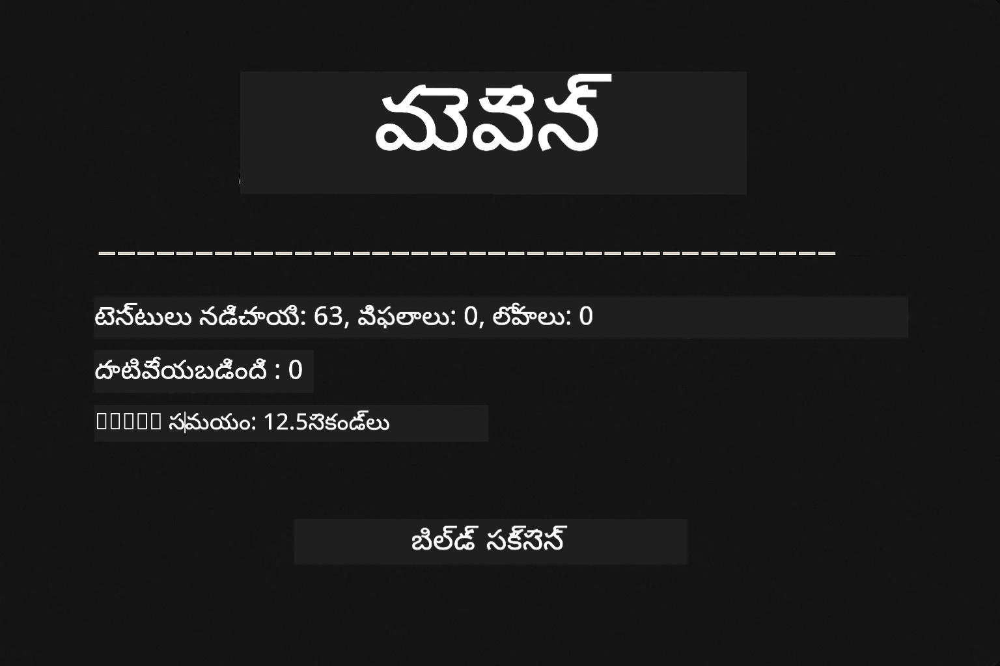
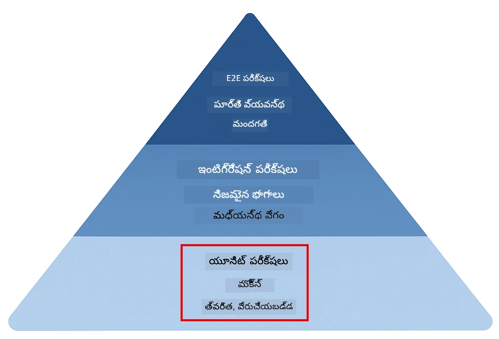
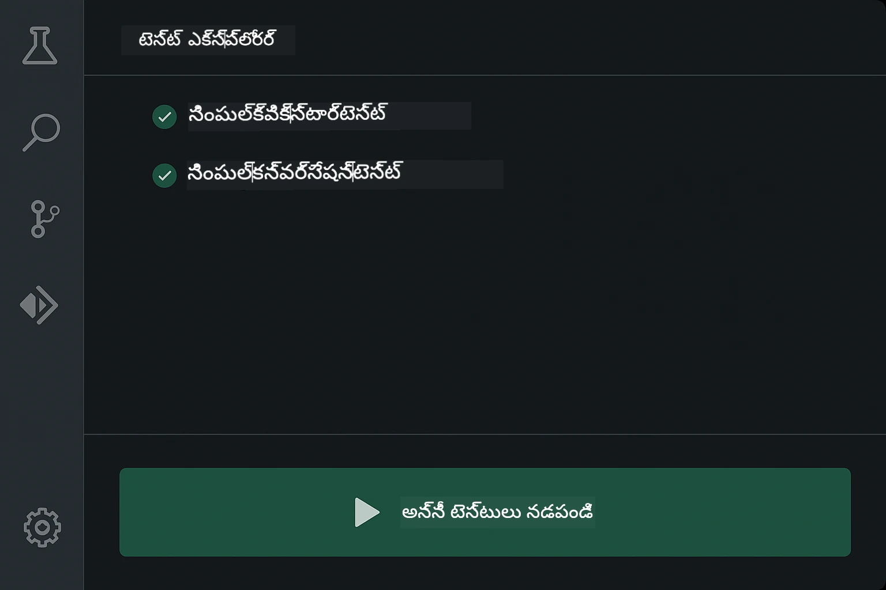
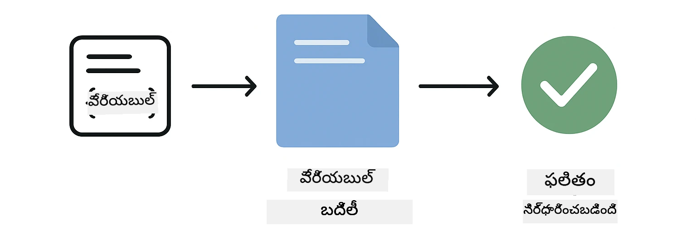
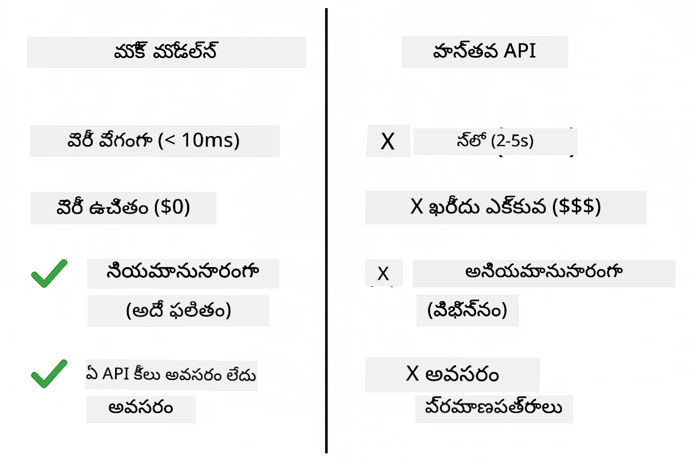
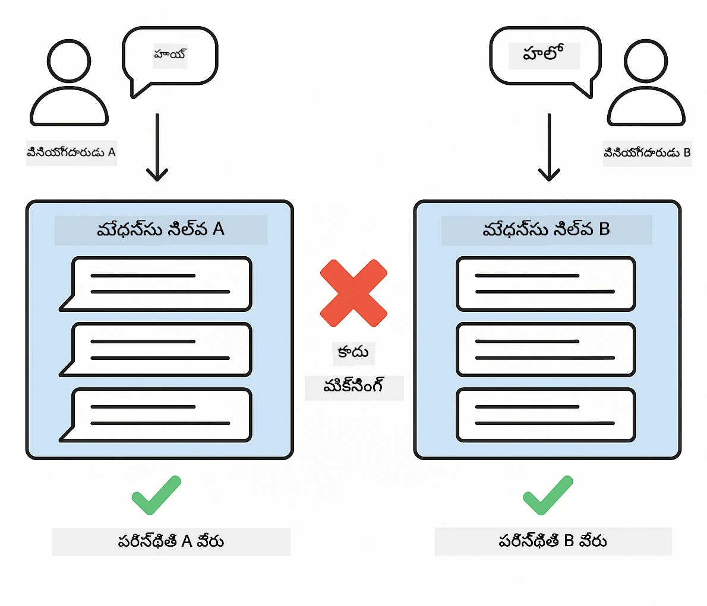
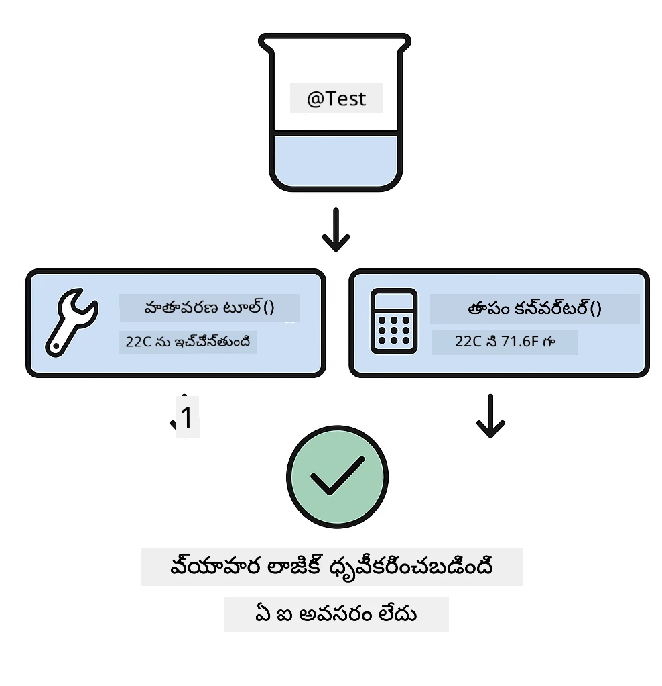
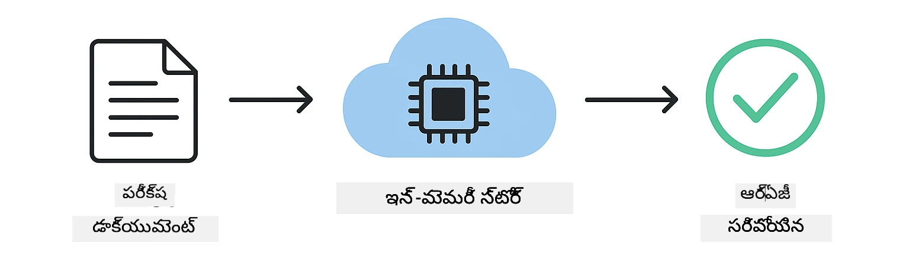

# LangChain4j అప్లికేషన్‌లను పరీక్షించడం

## సూచిక

- [తక్షణ ప్రారంభం](../../../docs)
- [పరీక్షలు ఏమి కవర్ చేస్తాయో](../../../docs)
- [పరీక్షలు నడపడం](../../../docs)
- [VS Code లో పరీక్షలు నడపడం](../../../docs)
- [పరీక్ష విధానాలు](../../../docs)
- [పరీక్ష తత్వం](../../../docs)
- [తదుపరి దశలు](../../../docs)

ఈ గైడ్ API కీలు లేదా బాహ్య సేవలు అవసరం లేకుండా AI అప్లికేషన్లను ఎలా పరీక్షించాలో చూపించే పరీక్షల ద్వారా మీకు మార్గదర్శనం చేస్తుంది.

## Quick Start

ఒకే కమాండ్‌తో అన్ని పరీక్షలను నడపండి:

**Bash:**
```bash
mvn test
```

**PowerShell:**
```powershell
mvn --% test
```



*అన్ని పరీక్షలు విజయవంతంగా నడిచినవి — ఏవీ విఫలమయ్యవు అని చూపిస్తున్న విజయవంతమైన పరీక్ష అమలు*

## What the Tests Cover

ఈ కోర్సు స్థానికంగా నడిచే యూనిట్ టెస్టుల (unit tests) మీద కేంద్రీకరించబడింది. ప్రతి పరీక్ష ఒక ప్రత్యేక LangChain4j కాన్సెప్ట్ను వేరుగా చూపిస్తుంది.



*యూనిట్ టెస్టులు (త్వరగా, पृथక్), ఇంటిగ్రేషన్ టెస్టులు (నిజమైన భాగాలు), మరియు ఎండ్-టు-ఎండ్ టెస్టుల మధ్య సమతుల్యాన్ని చూపించే పరీక్షల పిరమిడ్. ఈ శిక్షణ యూనిట్ టెస్టులను కవర్ చేస్తుంది.*

| Module | Tests | Focus | Key Files |
|--------|-------|-------|-----------|
| **00 - Quick Start** | 6 | Prompt templates and variable substitution | `SimpleQuickStartTest.java` |
| **01 - Introduction** | 8 | Conversation memory and stateful chat | `SimpleConversationTest.java` |
| **02 - Prompt Engineering** | 12 | GPT-5 patterns, eagerness levels, structured output | `SimpleGpt5PromptTest.java` |
| **03 - RAG** | 10 | Document ingestion, embeddings, similarity search | `DocumentServiceTest.java` |
| **04 - Tools** | 12 | Function calling and tool chaining | `SimpleToolsTest.java` |
| **05 - MCP** | 8 | Model Context Protocol with Stdio transport | `SimpleMcpTest.java` |

## Running the Tests

**రూట్ నుండి అన్ని పరీక్షలను నడపండి:**

**Bash:**
```bash
mvn test
```

**PowerShell:**
```powershell
mvn --% test
```

**నిర్దిష్ట మాడ్యూల్ కోసం పరీక్షలు నడపండి:**

**Bash:**
```bash
cd 01-introduction && mvn test
# లేదా రూట్ నుండి
mvn test -pl 01-introduction
```

**PowerShell:**
```powershell
cd 01-introduction; mvn --% test
# లేక రూట్ నుంచి
mvn --% test -pl 01-introduction
```

**ఒకే టెస్ట్ క్లాస్ నడపండి:**

**Bash:**
```bash
mvn test -Dtest=SimpleConversationTest
```

**PowerShell:**
```powershell
mvn --% test -Dtest=SimpleConversationTest
```

**నిర్దిష్ట టెస్ట్ మెథడ్ నడపండి:**

**Bash:**
```bash
mvn test -Dtest=SimpleConversationTest#సంభాషణ చరిత్రను నిలుపుకోవాలి
```

**PowerShell:**
```powershell
mvn --% test -Dtest=SimpleConversationTest#సంభాషణ చరిత్రను నిలుపుకోవాలి
```

## Running Tests in VS Code

మీరు Visual Studio Code ఉపయోగిస్తుంటే, Test Explorer గ్రాఫికల్ ఇంటర్‌ఫేస్‌ను ఉపయోగించి పరీక్షలను నడిపి డీబగ్ చేయవచ్చు.



*VS Code Test Explorer టెస్ట్ ట్రీని చూపిస్తుంది—అందులో అన్ని Java టెస్ట్ క్లాసులు మరియు ప్రాతినిధ్య టెస్ట్ మెథడ్స్ ఉంటాయి*

**VS Code లో పరీక్షలు నడపడానికి:**

1. Activity Bar లో బీకర్ చిహ్నాన్ని క్లిక్ చేసి Test Explorer ఓపెన్ చేయండి
2. అన్ని మాడ్యూల్స్ మరియు టెస్ట్ క్లాసులను చూడటానికి టెస్ట్ ట్రీ ని విస్తరించండి
3. ఏ టెస్ట్ పక్కన ఉన్న ప్లే బటన్‌ను క్లిక్ చేసి అది ఒకదాన్ని నడపండి
4. మొత్తం సూట్‌ను నడిపేందుకు "Run All Tests" క్లిక్ చేయండి
5. ఏ టెస్ట్‌పై రైట్-క్లిక్ చేసి "Debug Test" ఎంపికను తీసుకొని బ్రేక్పాయింట్లు సెట్ చేసి కోడ్‌ను స్టెప్పింగ్ చేయండి

Test Explorer పాస్ అయిన టెస్టులకు ఆకుపచ్చ చెక్మార్క్‌లను చూపిస్తుంది మరియు టెస్టులు ఫెయిలయినప్పుడు విపులమైన ఫెయిల్యూర్ సందేశాలను అందిస్తుంది.

## Testing Patterns

### Pattern 1: Testing Prompt Templates

సాధారణ పదార్థం ఏమిటంటే, ఏ AI మోడల్‌ను పిలవకుండా ప్రాంప్ట్ టెంప్లేట్లను పరీక్షించడం. మీరు వేరియబుల్ సబ్‌స్టిట్యూషన్ సరిగ్గా పనిచేస్తోందనే మరియు ప్రాంప్ట్‌లు ఆశించిన ఆకారంలో ఫార్మాట్ అయ్యాయని నిర్ధారిస్తారు.



*టెంప్లేట్‌లో ప్లేస్‌హోల్డర్లు → విలువలు వరుసగా వర్తింప జేసే ప్రక్రియ → ఫార్మాట్ అయిన అవుట్‌పుట్ నిర్ధారించడం చూపించే ప్రాంప్ట్ టెంప్లేట్ పరీక్షణం*

```java
@Test
@DisplayName("Should format prompt template with variables")
void testPromptTemplateFormatting() {
    PromptTemplate template = PromptTemplate.from(
        "Best time to visit {{destination}} for {{activity}}?"
    );
    
    Prompt prompt = template.apply(Map.of(
        "destination", "Paris",
        "activity", "sightseeing"
    ));
    
    assertThat(prompt.text()).isEqualTo("Best time to visit Paris for sightseeing?");
}
```

ఈ పరీక్ష ఈ ఫైల్‌లో ఉంది: `00-quick-start/src/test/java/com/example/langchain4j/quickstart/SimpleQuickStartTest.java`.

**దీనిని నడపండి:**

**Bash:**
```bash
cd 00-quick-start && mvn test -Dtest=SimpleQuickStartTest#ప్రాంప్ట్ టెంప్లేట్ ఫార్మాటింగ్ పరీక్ష
```

**PowerShell:**
```powershell
cd 00-quick-start; mvn --% test -Dtest=SimpleQuickStartTest#ప్రాంప్ట్ టెంప్లేట్ ఫార్మాటింగ్ పరీక్ష
```

### Pattern 2: Mocking Language Models

చర్చా లాజిక్‌ను పరీక్షించేటప్పుడు, Mockito ఉపయోగించి తావైన (fake) మోడళ్లను సృష్టించండి, అవి ముందే నిర్ణయించిన రెస్పాన్స్‌లను ఇవ్వగలవు. ఇది పరీక్షలను వేగవంతంగా, ఖరీతులేకుండా మరియు డిటెర్మినిస్టిక్‌గా ఉంచుతుంది.



*పరీక్షల కోసం మాక్స్ ఎందుకు ప్రాధాన్యత పొందుతాయో చూపించే తులన — అవి వేగంగా, ఉచితం, డిటెర్మినిస్టిక్ మరియు ఎటువంటి API కీలను అవసరం చేయవు*

```java
@ExtendWith(MockitoExtension.class)
class SimpleConversationTest {
    
    private ConversationService conversationService;
    
    @Mock
    private OpenAiOfficialChatModel mockChatModel;
    
    @BeforeEach
    void setUp() {
        ChatResponse mockResponse = ChatResponse.builder()
            .aiMessage(AiMessage.from("This is a test response"))
            .build();
        when(mockChatModel.chat(anyList())).thenReturn(mockResponse);
        
        conversationService = new ConversationService(mockChatModel);
    }
    
    @Test
    void shouldMaintainConversationHistory() {
        String conversationId = conversationService.startConversation();
        
        ChatResponse mockResponse1 = ChatResponse.builder()
            .aiMessage(AiMessage.from("Response 1"))
            .build();
        ChatResponse mockResponse2 = ChatResponse.builder()
            .aiMessage(AiMessage.from("Response 2"))
            .build();
        ChatResponse mockResponse3 = ChatResponse.builder()
            .aiMessage(AiMessage.from("Response 3"))
            .build();
        
        when(mockChatModel.chat(anyList()))
            .thenReturn(mockResponse1)
            .thenReturn(mockResponse2)
            .thenReturn(mockResponse3);

        conversationService.chat(conversationId, "First message");
        conversationService.chat(conversationId, "Second message");
        conversationService.chat(conversationId, "Third message");

        List<ChatMessage> history = conversationService.getHistory(conversationId);
        assertThat(history).hasSize(6); // 3 వినియోగదారులు + 3 ఏఐ సందేశాలు
    }
}
```

ఈ ప్యాటర్న్ `01-introduction/src/test/java/com/example/langchain4j/service/SimpleConversationTest.java`లో కనిపిస్తుంది. మాక్ స్థిరమైన ప్రవర్తనను నిర్ధారిస్తుంది కాబట్టి మీరు మెమరీ నిర్వహణ సరిగ్గా పనిచేస్తుందో తనిఖీ చేయగలరు.

### Pattern 3: Testing Conversation Isolation

చర్చా మెమరీ బహుళ వినియోగదారులను వేరుగా ఉంచాలో లేదో గుర్తించాలి. ఈ పరీక్షలు సంభాషణలు కాన్టెంట్ మిశ్రమం కాకుండా వేరుగా ఉంటాయో లేదో నిర్ధారిస్తాయి.



*వివిధ వినియోగదారులకు సంభాషణ మెమరీ స్టోర్లు వేరుగా ఉండాలని చూపించే చర్చా изో레이షన్ పరీక్ష*

```java
@Test
void shouldIsolateConversationsByid() {
    String conv1 = conversationService.startConversation();
    String conv2 = conversationService.startConversation();
    
    ChatResponse mockResponse = ChatResponse.builder()
        .aiMessage(AiMessage.from("Response"))
        .build();
    when(mockChatModel.chat(anyList())).thenReturn(mockResponse);

    conversationService.chat(conv1, "Message for conversation 1");
    conversationService.chat(conv2, "Message for conversation 2");

    List<ChatMessage> history1 = conversationService.getHistory(conv1);
    List<ChatMessage> history2 = conversationService.getHistory(conv2);
    
    assertThat(history1).hasSize(2);
    assertThat(history2).hasSize(2);
}
```

ప్రతి సంభాషణ దాని స్వంత స్వతంత్ర చరిత్రను నిర్వహిస్తుందిఆ. ప్రొడక్షన్ సిస్టమ్స్‌లో, ఈ వేరుగా ఉంచటం బహుళ-వినియోగదారు అప్లికేషన్ల కోసం చాలా కీలకం.

### Pattern 4: Testing Tools Independently

టూల్స్ అనగా AI కాల్ చేయగల ఫంక్షన్లు. AI నిర్ణయాల నుండి వేరుగా వాటిని డైరెక్ట్‌గా పరీక్షించి అవి సరిగ్గా పనిచేస్తున్నాయో చూసుకోండి.



*AI కాల్స్ లేకుండా మాక్ టూల్ అమలు చూపిస్తూ బిజినెస్ లాజిక్ నిర్ధారించుటకు టూల్స్‌ని స్వతంత్రంగా పరీక్షించడం*

```java
@Test
void shouldConvertCelsiusToFahrenheit() {
    TemperatureTool tempTool = new TemperatureTool();
    String result = tempTool.celsiusToFahrenheit(25.0);
    assertThat(result).containsPattern("77[.,]0°F");
}

@Test
void shouldDemonstrateToolChaining() {
    WeatherTool weatherTool = new WeatherTool();
    TemperatureTool tempTool = new TemperatureTool();

    String weatherResult = weatherTool.getCurrentWeather("Seattle");
    assertThat(weatherResult).containsPattern("\\d+°C");

    String conversionResult = tempTool.celsiusToFahrenheit(22.0);
    assertThat(conversionResult).containsPattern("71[.,]6°F");
}
```

ఈ పరీక్షలు `04-tools/src/test/java/com/example/langchain4j/agents/tools/SimpleToolsTest.java` నుండి అవి టూల్ లాజిక్‌ను AI పాల్గొనలేదు అయినా సరే ధృవీకరిస్తాయి. చైనింగ్ ఉదాహరణ ఒక టూల్ అవుట్‌పుట్ ఎలా మరో టూల్ ఇన్‌పుట్‌గా పనిచేస్తుందో చూపిస్తుంది.

### Pattern 5: In-Memory RAG Testing

RAG సిస్టమ్స్ సాధారణంగా వెక్టర్ డేటాబేస్లు మరియు ఎంబెడ్డింగ్ సేవలను అవసరాన్ని కలిగి ఉంటాయి. ఇన్-మెమరీ ప్యాటర్న్ బాహ్య ఆధారపడకుండానే మొత్తం పైప్‌లైన్‌ను పరీక్షించడానికి అనుమతిస్తుంది.



*డాక్యుమెంట్ పార్సింగ్, ఎంబెడ్డింగ్ నిల్వ, మరియు సమానత్వ శోధనను డేటాబేస్ అవసరం లేకుండా చూపే ఇన్-మెమరీ RAG పరీక్ష వర్క్‌ఫ్లో*

```java
@Test
void testProcessTextDocument() {
    String content = "This is a test document.\nIt has multiple lines.";
    InputStream inputStream = new ByteArrayInputStream(content.getBytes(StandardCharsets.UTF_8));
    
    DocumentService.ProcessedDocument result = 
        documentService.processDocument(inputStream, "test.txt");

    assertNotNull(result);
    assertTrue(result.segments().size() > 0);
    assertEquals("test.txt", result.segments().get(0).metadata().getString("filename"));
}
```

ఈ పరీక్ష `03-rag/src/test/java/com/example/langchain4j/rag/service/DocumentServiceTest.java` నుండి వచ్చిఅది మెమరీలో ఒక డాక్యుమెంట్ సృష్టించి చంకింగ్ మరియు మెటాడేటా నిర్వహణను నిర్ధారిస్తుంది.

### Pattern 6: MCP Integration Testing

MCP మాడ్యూల్ stdio ట్రాన్స్‌పోర్ట్ ఉపయోగించి Model Context Protocol ఇంటిగ్రేషన్‌ను పరీక్షిస్తుంది. ఈ పరీక్షలు మీరు మీ అప్లికేషన్ MCP సర్వర్లను subprocesses గా spawn చేసి వాటితో కమ్యూనికేట్ చేయగలదో లేదో నిర్ధారిస్తాయి.

`05-mcp/src/test/java/com/example/langchain4j/mcp/SimpleMcpTest.java` లోని పరీక్షలు MCP క్లయింట్ ప్రవర్తనను ధృవీకరిస్తాయి.

**వాహనంగా నడపండి:**

**Bash:**
```bash
cd 05-mcp && mvn test
```

**PowerShell:**
```powershell
cd 05-mcp; mvn --% test
```

## Testing Philosophy

మీ కోడ్‌ను పరీక్షించండి, AI ను కాదు. మీ పరీక్షలు మీరు రాసిన కోడ్‌ను ధృవీకరించాలి — ప్రాంప్ట్‌లు ఎలా నిర్మించబడ్డాయి, మెమరీ ఎలా నిర్వహించబడుతోంది, టూల్స్ ఎలా అమలు అవుతున్నాయో చెక్ చేయాలి. AI ప్రతిస్పందనలు మారవచ్చు కాబట్టి వాటిని టెస్ట్ అశారీలలో భాగం చేయకూడదు. మీ ప్రాంప్ట్ టెంప్లేట్ సరైనగా వేరియబుల్‌లను సబ్‌స్టిట్యూట్ చేస్తున్నదా అనే ప్రశ్న అడగండి, AI సరైన উত্তরమివ్వడం కాదు.

లాంగ్వేజ్ మోడల్స్ కోసం మాక్స్ ఉపయోగించండి. అవి బాహ్య ఆధారపడే అంశాలు, ఆలస్యంగా, ఖరీదైనవి మరియు డిటెర్మినిస్టిక్ కావు. మాకింగ్ టెస్టులను మిల్లీసెకన్లలో వేగవంతంగా, ఉచితంగా, మరియు ఎప్పుడూ అదే ఫలితం ఇవ్వబట్టేలా చేస్తుంది.

పరీక్షలను స్వతంత్రంగా ఉంచండి. ప్రతి టెస్ట్ తన స్వంత డేటాను సెట్ చేయాలి, ఇతర టెస్టులపై ఆధారపడకూడదు మరియు తన పనిని ముగించిన తర్వాత శుభ్రం చేయాలి. టెస్టులు ఎగ్జిక్యూషన్ ఆర్డర్‌కు సంబంధం లేకుండా పాస్ అవ్వలేవు.

సంతోషకర పాలుపదార్థాన్ని దాటి ఎడ్జ్ కేసులను పరీక్షించండి. ఖాళీ ఇన్‌పుట్లు, చాలా పెద్ద ఇన్‌పుట్లు, ప్రత్యేక అక్షరాలు, అసాధువైన పారామీటర్లు మరియు బౌండరీ పరిస్థితులను ప్రయత్నించండి. ఇవి సాధారణ వినియోగం బయట ఉండే బగ్స్‌ను బయటకు తెస్తాయి.

వివరణాత్మక పేర్లను ఉపయోగించండి. `shouldMaintainConversationHistoryAcrossMultipleMessages()` ను `test1()` తో పోల్చండి. మొదటిది ఏమి పరీక్షబడుతోందో స్పష్టంగా చెప్పగలదు, కనుక డీబగ్గింగ్ సరళంగా ఉంటుంది.

## Next Steps

ఇప్పుడు మీరు పరీక్ష విధానాలను అర్థం చేసుకున్నారనుకుంటే, ప్రతి మాడ్యూల్‌ను లోతుగా పరిశీలించండి:

- **[00 - Quick Start](../00-quick-start/README.md)** - ప్రాంప్ట్ టెంప్లేట్ ఆధారాలు తో మొదలు పెట్టండి
- **[01 - Introduction](../01-introduction/README.md)** - సంభాషణ మెమరీ నిర్వహణ నేర్చుకోండి
- **[02 - Prompt Engineering](../02-prompt-engineering/README.md)** - GPT-5 ప్రాంప్టింగ్ నమూనాలు ఆచరించండి
- **[03 - RAG](../03-rag/README.md)** - రిట్రీవల్-ఆగ్మెంటెడ్ జనరేషన్ సిస్టమ్స్ నిర్మించండి
- **[04 - Tools](../04-tools/README.md)** - ఫంక్షన్ కాలింగ్ మరియు టూల్ చైన్స్ అమలు చేయండి
- **[05 - MCP](../05-mcp/README.md)** - Model Context Protocol ను ఇంటిగ్రేట్ చేయండి

ప్రతి మాడ్యూల్ README ఇక్కడ పరీక్షించిన కాన్సెప్టుల గురించి విపులమైన వివరణలను అందిస్తుంది.

---

**Navigation:** [← వెనుకకు మెయిన్‌కు](../README.md)

---

<!-- CO-OP TRANSLATOR DISCLAIMER START -->
నిరాకరణ:
ఈ డాక్యుమెంట్‌ను AI అనువాద సేవ అయిన Co-op Translator (https://github.com/Azure/co-op-translator) ద్వారా అనువదించబడింది. మేము ఖచ్చితత్వానికి ప్రయత్నించినప్పటికీ, ఆటోమేటెడ్ అనువాదాల్లో తప్పులు లేదా లోపాలు ఉండవచ్చని దయచేసి గమనించండి. స్వదేశీ భాషలో ఉన్న అసలు డాక్యుమెంట్‌ను అధికారిక మూలంగా పరిగణించాలి. ముఖ్యమైన సమాచారానికి వృత్తిపరమైన మానవ అనువాదాన్ని సిఫార్సు చేయబడుతుంది. ఈ అనువాదం వలన కలిగే ఏవైనా అపార్థాలు లేదా తప్పుడు అర్ధాల కోసం మేము బాధ్యత వహించము.
<!-- CO-OP TRANSLATOR DISCLAIMER END -->