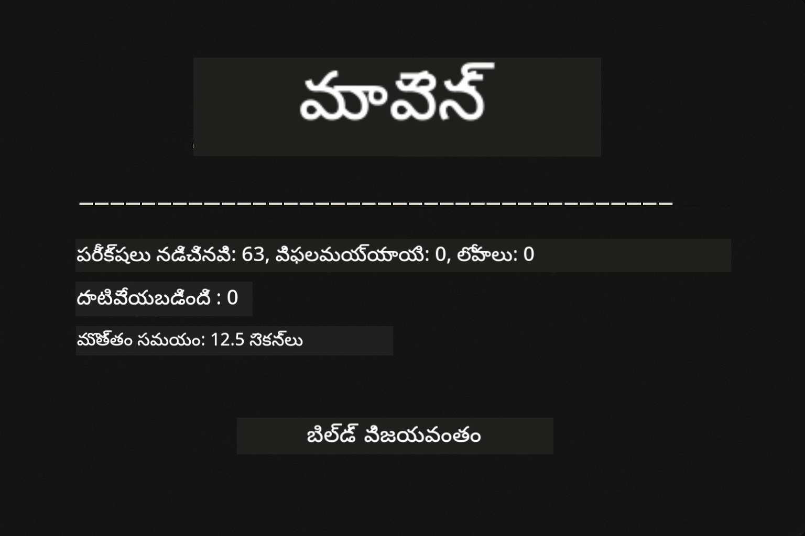
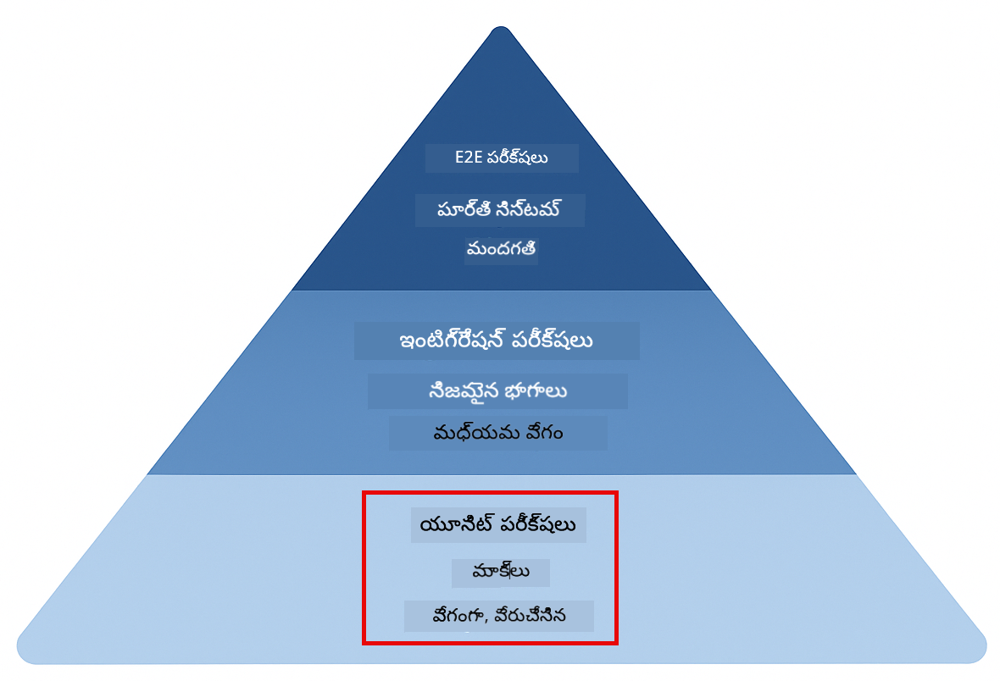
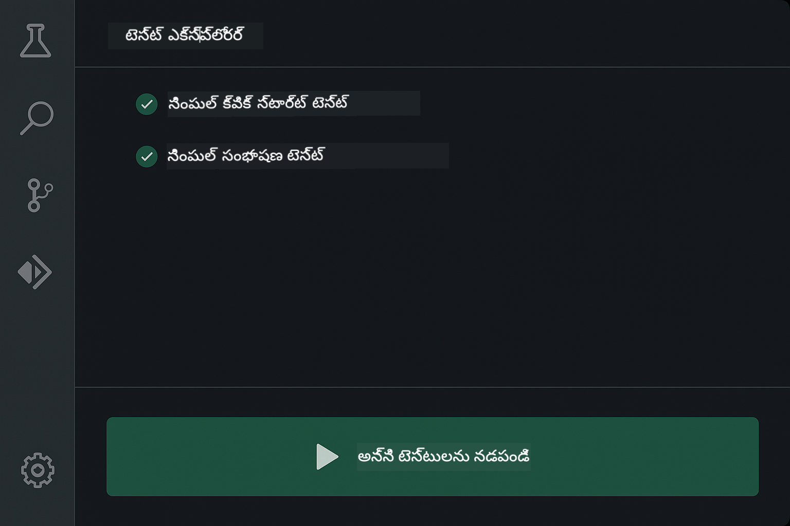
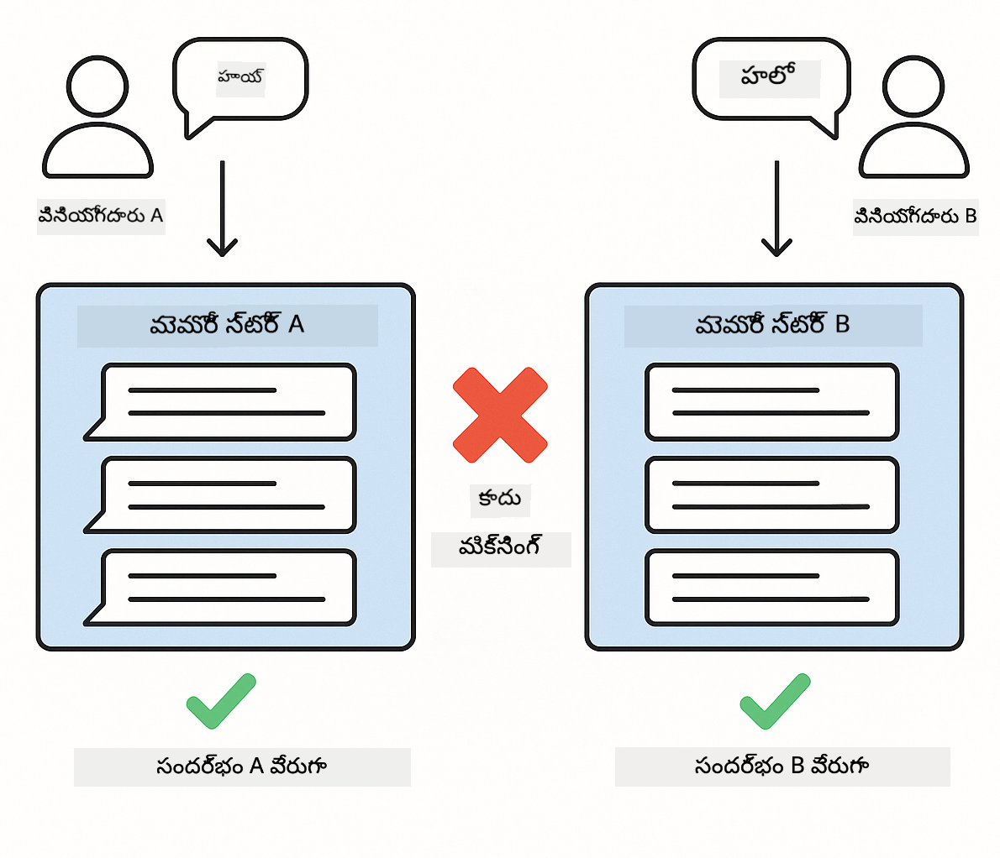
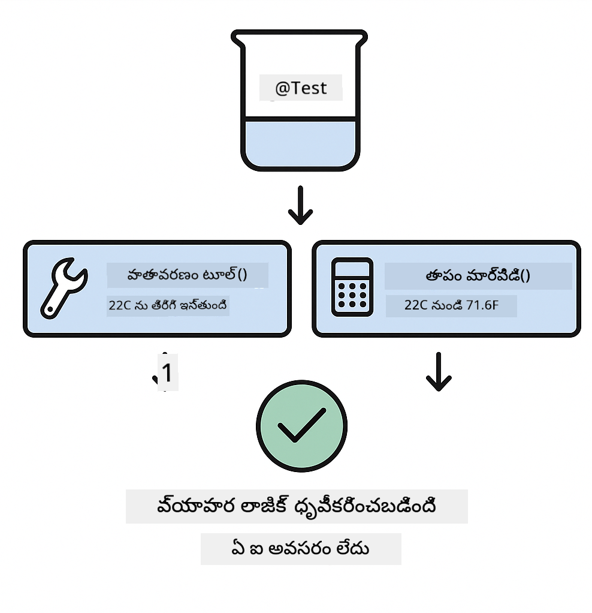
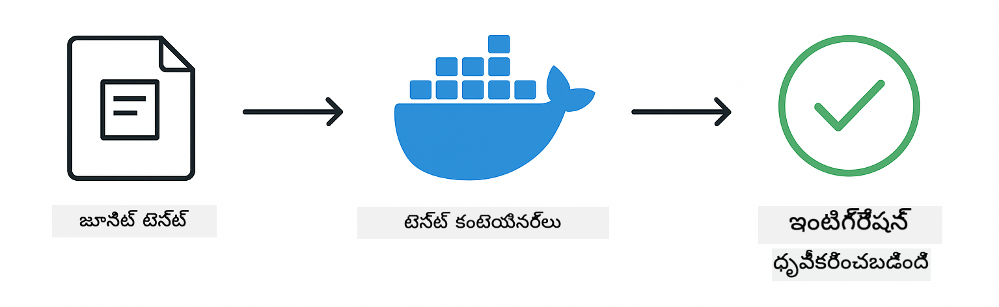

<!--
CO_OP_TRANSLATOR_METADATA:
{
  "original_hash": "b975537560c404d5f254331832811e78",
  "translation_date": "2025-12-13T21:37:09+00:00",
  "source_file": "docs/TESTING.md",
  "language_code": "te"
}
-->
# LangChain4j అనువర్తనాలను పరీక్షించడం

## విషయ సూచిక

- [త్వరిత ప్రారంభం](../../../docs)
- [పరీక్షలు ఏమి కవర్ చేస్తాయి](../../../docs)
- [పరీక్షలను నడపడం](../../../docs)
- [VS కోడ్‌లో పరీక్షలు నడపడం](../../../docs)
- [పరీక్షా నమూనాలు](../../../docs)
- [పరీక్షా తత్వశాస్త్రం](../../../docs)
- [తరువాతి దశలు](../../../docs)

ఈ గైడ్ API కీలు లేదా బాహ్య సేవలు అవసరం లేకుండా AI అనువర్తనాలను ఎలా పరీక్షించాలో చూపించే పరీక్షల ద్వారా మీకు మార్గనిర్దేశం చేస్తుంది.

## త్వరిత ప్రారంభం

ఒకే కమాండ్‌తో అన్ని పరీక్షలను నడపండి:

**Bash:**
```bash
mvn test
```

**PowerShell:**
```powershell
mvn --% test
```



*అన్ని పరీక్షలు విజయవంతంగా పాస్ అయిన ఫలితాలు చూపిస్తున్నాయి*

## పరీక్షలు ఏమి కవర్ చేస్తాయి

ఈ కోర్సు స్థానికంగా నడిచే **యూనిట్ పరీక్షల** పై దృష్టి సారిస్తుంది. ప్రతి పరీక్ష ప్రత్యేక LangChain4j కాన్సెప్ట్‌ను వేరుగా చూపిస్తుంది.



*యూనిట్ పరీక్షలు (వేగంగా, వేరుగా), ఇంటిగ్రేషన్ పరీక్షలు (నిజమైన భాగాలు), మరియు ఎండ్-టు-ఎండ్ పరీక్షలు (డాకర్‌తో పూర్తి సిస్టమ్) మధ్య సమతుల్యత చూపించే పరీక్షా పిరమిడ్. ఈ శిక్షణ యూనిట్ పరీక్షలపై కేంద్రీకృతమైంది.*

| మాడ్యూల్ | పరీక్షలు | దృష్టి | ముఖ్య ఫైళ్లు |
|--------|-------|-------|-----------|
| **00 - త్వరిత ప్రారంభం** | 6 | ప్రాంప్ట్ టెంప్లేట్లు మరియు వేరియబుల్ సబ్‌స్టిట్యూషన్ | `SimpleQuickStartTest.java` |
| **01 - పరిచయం** | 8 | సంభాషణ మెమరీ మరియు స్థితిస్థాపక చాట్ | `SimpleConversationTest.java` |
| **02 - ప్రాంప్ట్ ఇంజనీరింగ్** | 12 | GPT-5 నమూనాలు, ఉత్సాహ స్థాయిలు, నిర్మిత అవుట్పుట్ | `SimpleGpt5PromptTest.java` |
| **03 - RAG** | 10 | డాక్యుమెంట్ ఇంజెస్టన్, ఎంబెడ్డింగ్స్, సారూప్యత శోధన | `DocumentServiceTest.java`` |
| **04 - టూల్స్** | 12 | ఫంక్షన్ కాలింగ్ మరియు టూల్ చైనింగ్ | `SimpleToolsTest.java` |
| **05 - MCP** | 15 | మోడల్ కాంటెక్స్ట్ ప్రోటోకాల్ డాకర్‌తో | `SimpleMcpTest.java`, `McpDockerTransportTest.java` |

## పరీక్షలను నడపడం

**రూట్ నుండి అన్ని పరీక్షలను నడపండి:**

**Bash:**
```bash
mvn test
```

**PowerShell:**
```powershell
mvn --% test
```

**ఒక నిర్దిష్ట మాడ్యూల్ కోసం పరీక్షలు నడపండి:**

**Bash:**
```bash
cd 01-introduction && mvn test
# లేదా రూట్ నుండి
mvn test -pl 01-introduction
```

**PowerShell:**
```powershell
cd 01-introduction; mvn --% test
# లేదా రూట్ నుండి
mvn --% test -pl 01-introduction
```

**ఒకే పరీక్ష క్లాస్ నడపండి:**

**Bash:**
```bash
mvn test -Dtest=SimpleConversationTest
```

**PowerShell:**
```powershell
mvn --% test -Dtest=SimpleConversationTest
```

**ఒక నిర్దిష్ట పరీక్ష పద్ధతిని నడపండి:**

**Bash:**
```bash
mvn test -Dtest=SimpleConversationTest#సంభాషణ చరిత్రను నిర్వహించాలి
```

**PowerShell:**
```powershell
mvn --% test -Dtest=SimpleConversationTest#సంభాషణ చరిత్రను నిర్వహించాలి
```

## VS కోడ్‌లో పరీక్షలు నడపడం

మీరు Visual Studio Code ఉపయోగిస్తుంటే, Test Explorer పరీక్షలను నడపడానికి మరియు డీబగ్ చేయడానికి గ్రాఫికల్ ఇంటర్‌ఫేస్ అందిస్తుంది.



*VS కోడ్ టెస్ట్ ఎక్స్‌ప్లోరర్ అన్ని జావా పరీక్షా తరగతులు మరియు వ్యక్తిగత పరీక్ష పద్ధతులతో పరీక్షా వృక్షాన్ని చూపిస్తోంది*

**VS కోడ్‌లో పరీక్షలు నడపడానికి:**

1. Activity Barలో బీకర్ ఐకాన్‌పై క్లిక్ చేసి Test Explorer తెరవండి
2. అన్ని మాడ్యూల్స్ మరియు పరీక్షా తరగతులను చూడటానికి పరీక్షా వృక్షాన్ని విస్తరించండి
3. ఏదైనా పరీక్ష పక్కన ఉన్న ప్లే బటన్‌పై క్లిక్ చేసి దాన్ని వ్యక్తిగతంగా నడపండి
4. మొత్తం సూట్ నడపడానికి "Run All Tests" క్లిక్ చేయండి
5. ఏదైనా పరీక్షపై రైట్-క్లిక్ చేసి "Debug Test" ఎంచుకుని బ్రేక్‌పాయింట్లు సెట్ చేసి కోడ్ ద్వారా స్టెప్ చేయండి

పరీక్షలు పాస్ అయినప్పుడు Test Explorer ఆకుపచ్చ చెక్‌మార్క్‌లను చూపిస్తుంది మరియు విఫలమైనప్పుడు విపులమైన లోప సందేశాలను అందిస్తుంది.

## పరీక్షా నమూనాలు


*LangChain4j అనువర్తనాల కోసం ఆరు పరీక్షా నమూనాలు: ప్రాంప్ట్ టెంప్లేట్లు, మాక్ మోడల్స్, సంభాషణ వేరుపాటు, టూల్స్ పరీక్ష, ఇన్-మెమరీ RAG, మరియు డాకర్ ఇంటిగ్రేషన్*

### నమూనా 1: ప్రాంప్ట్ టెంప్లేట్లను పరీక్షించడం

సరళమైన నమూనా ఏ AI మోడల్‌ను పిలవకుండా ప్రాంప్ట్ టెంప్లేట్లను పరీక్షిస్తుంది. మీరు వేరియబుల్ సబ్‌స్టిట్యూషన్ సరిగ్గా పనిచేస్తుందో మరియు ప్రాంప్ట్‌లు ఆశించినట్లుగా ఫార్మాట్ అయ్యాయో నిర్ధారించాలి.


*వేరియబుల్ సబ్‌స్టిట్యూషన్ ప్రవాహాన్ని చూపిస్తూ ప్రాంప్ట్ టెంప్లేట్లను పరీక్షించడం: ప్లేస్‌హోల్డర్లతో టెంప్లేట్ → విలువలు వర్తింపజేయబడినవి → ఫార్మాట్ చేసిన అవుట్పుట్ నిర్ధారించబడింది*

```java
@Test
@DisplayName("Should format prompt template with variables")
void testPromptTemplateFormatting() {
    PromptTemplate template = PromptTemplate.from(
        "Best time to visit {{destination}} for {{activity}}?"
    );
    
    Prompt prompt = template.apply(Map.of(
        "destination", "Paris",
        "activity", "sightseeing"
    ));
    
    assertThat(prompt.text()).isEqualTo("Best time to visit Paris for sightseeing?");
}
```

ఈ పరీక్ష `00-quick-start/src/test/java/com/example/langchain4j/quickstart/SimpleQuickStartTest.java` లో ఉంది.

**దాన్ని నడపండి:**

**Bash:**
```bash
cd 00-quick-start && mvn test -Dtest=SimpleQuickStartTest#టెస్ట్ ప్రాంప్ట్ టెంప్లేట్ ఫార్మాటింగ్
```

**PowerShell:**
```powershell
cd 00-quick-start; mvn --% test -Dtest=SimpleQuickStartTest#టెస్ట్ ప్రాంప్ట్ టెంప్లేట్ ఫార్మాటింగ్
```

### నమూనా 2: భాషా మోడల్స్‌ను మాక్ చేయడం

సంభాషణ లాజిక్‌ను పరీక్షించేటప్పుడు, Mockito ఉపయోగించి ముందుగా నిర్ణయించిన ప్రతిస్పందనలను ఇచ్చే ఫేక్ మోడల్స్ సృష్టించండి. ఇది పరీక్షలను వేగంగా, ఉచితంగా, మరియు నిర్ణీతంగా చేస్తుంది.


*పరీక్షల కోసం మాక్‌లు ఎందుకు ప్రాధాన్యం పొందుతున్నాయో చూపించే తులనాత్మక చిత్రం: అవి వేగవంతమైనవి, ఉచితమైనవి, నిర్ణీతమైనవి, మరియు API కీలు అవసరం లేవు*

```java
@ExtendWith(MockitoExtension.class)
class SimpleConversationTest {
    
    private ConversationService conversationService;
    
    @Mock
    private OpenAiOfficialChatModel mockChatModel;
    
    @BeforeEach
    void setUp() {
        ChatResponse mockResponse = ChatResponse.builder()
            .aiMessage(AiMessage.from("This is a test response"))
            .build();
        when(mockChatModel.chat(anyList())).thenReturn(mockResponse);
        
        conversationService = new ConversationService(mockChatModel);
    }
    
    @Test
    void shouldMaintainConversationHistory() {
        String conversationId = conversationService.startConversation();
        
        ChatResponse mockResponse1 = ChatResponse.builder()
            .aiMessage(AiMessage.from("Response 1"))
            .build();
        ChatResponse mockResponse2 = ChatResponse.builder()
            .aiMessage(AiMessage.from("Response 2"))
            .build();
        ChatResponse mockResponse3 = ChatResponse.builder()
            .aiMessage(AiMessage.from("Response 3"))
            .build();
        
        when(mockChatModel.chat(anyList()))
            .thenReturn(mockResponse1)
            .thenReturn(mockResponse2)
            .thenReturn(mockResponse3);

        conversationService.chat(conversationId, "First message");
        conversationService.chat(conversationId, "Second message");
        conversationService.chat(conversationId, "Third message");

        List<ChatMessage> history = conversationService.getHistory(conversationId);
        assertThat(history).hasSize(6); // 3 వినియోగదారు + 3 AI సందేశాలు
    }
}
```

ఈ నమూనా `01-introduction/src/test/java/com/example/langchain4j/service/SimpleConversationTest.java` లో కనిపిస్తుంది. మాక్ స్థిరమైన ప్రవర్తనను నిర్ధారిస్తుంది కాబట్టి మీరు మెమరీ నిర్వహణ సరిగ్గా పనిచేస్తుందో పరీక్షించవచ్చు.

### నమూనా 3: సంభాషణ వేరుపాటు పరీక్షించడం

సంభాషణ మెమరీ అనేక వినియోగదారులను వేరుగా ఉంచాలి. ఈ పరీక్ష సంభాషణలు కాంటెక్స్ట్‌లను కలపకుండా ఉంటాయో లేదో నిర్ధారిస్తుంది.



*వేరే వినియోగదారుల కోసం వేరే మెమరీ స్టోర్లను చూపిస్తూ సంభాషణ వేరుపాటు పరీక్షించడం*

```java
@Test
void shouldIsolateConversationsByid() {
    String conv1 = conversationService.startConversation();
    String conv2 = conversationService.startConversation();
    
    ChatResponse mockResponse = ChatResponse.builder()
        .aiMessage(AiMessage.from("Response"))
        .build();
    when(mockChatModel.chat(anyList())).thenReturn(mockResponse);

    conversationService.chat(conv1, "Message for conversation 1");
    conversationService.chat(conv2, "Message for conversation 2");

    List<ChatMessage> history1 = conversationService.getHistory(conv1);
    List<ChatMessage> history2 = conversationService.getHistory(conv2);
    
    assertThat(history1).hasSize(2);
    assertThat(history2).hasSize(2);
}
```

ప్రతి సంభాషణ తన స్వంత స్వతంత్ర చరిత్రను నిర్వహిస్తుంది. ఉత్పత్తి వ్యవస్థల్లో, ఈ వేరుపాటు బహుళ వినియోగదారుల అనువర్తనాలకు కీలకం.

### నమూనా 4: టూల్స్‌ను స్వతంత్రంగా పరీక్షించడం

టూల్స్ అనేవి AI పిలవగల ఫంక్షన్లు. AI నిర్ణయాలపై ఆధారపడకుండా అవి సరిగ్గా పనిచేస్తున్నాయో నేరుగా పరీక్షించండి.



*AI కాల్స్ లేకుండా మాక్ టూల్ అమలును చూపిస్తూ వ్యాపార లాజిక్‌ను నిర్ధారించే టూల్స్ స్వతంత్ర పరీక్ష*

```java
@Test
void shouldConvertCelsiusToFahrenheit() {
    TemperatureTool tempTool = new TemperatureTool();
    String result = tempTool.celsiusToFahrenheit(25.0);
    assertThat(result).containsPattern("77[.,]0°F");
}

@Test
void shouldDemonstrateToolChaining() {
    WeatherTool weatherTool = new WeatherTool();
    TemperatureTool tempTool = new TemperatureTool();

    String weatherResult = weatherTool.getCurrentWeather("Seattle");
    assertThat(weatherResult).containsPattern("\\d+°C");

    String conversionResult = tempTool.celsiusToFahrenheit(22.0);
    assertThat(conversionResult).containsPattern("71[.,]6°F");
}
```

`04-tools/src/test/java/com/example/langchain4j/agents/tools/SimpleToolsTest.java` నుండి ఈ పరీక్షలు AI పాల్గొనకుండా టూల్ లాజిక్‌ను ధృవీకరిస్తాయి. చైనింగ్ ఉదాహరణ ఒక టూల్ అవుట్పుట్ మరొక టూల్ ఇన్‌పుట్‌గా ఎలా పనిచేస్తుందో చూపిస్తుంది.

### నమూనా 5: ఇన్-మెమరీ RAG పరీక్ష

RAG వ్యవస్థలు సాధారణంగా వెక్టర్ డేటాబేస్‌లు మరియు ఎంబెడ్డింగ్ సేవలను అవసరం చేస్తాయి. ఇన్-మెమరీ నమూనా బాహ్య ఆధారాలు లేకుండా మొత్తం పైప్‌లైన్‌ను పరీక్షించడానికి అనుమతిస్తుంది.


*డేటాబేస్ అవసరం లేకుండా డాక్యుమెంట్ పార్సింగ్, ఎంబెడ్డింగ్ నిల్వ, మరియు సారూప్యత శోధనను చూపించే ఇన్-మెమరీ RAG పరీక్షా వర్క్‌ఫ్లో*

```java
@Test
void testProcessTextDocument() {
    String content = "This is a test document.\nIt has multiple lines.";
    InputStream inputStream = new ByteArrayInputStream(content.getBytes(StandardCharsets.UTF_8));
    
    DocumentService.ProcessedDocument result = 
        documentService.processDocument(inputStream, "test.txt");

    assertNotNull(result);
    assertTrue(result.segments().size() > 0);
    assertEquals("test.txt", result.segments().get(0).metadata().getString("filename"));
}
```

`03-rag/src/test/java/com/example/langchain4j/rag/service/DocumentServiceTest.java` నుండి ఈ పరీక్ష మెమరీలో డాక్యుమెంట్ సృష్టించి చంకింగ్ మరియు మెటాడేటా నిర్వహణను నిర్ధారిస్తుంది.

### నమూనా 6: డాకర్‌తో ఇంటిగ్రేషన్ పరీక్ష

కొన్ని ఫీచర్లు నిజమైన ఇన్‌ఫ్రాస్ట్రక్చర్ అవసరం. MCP మాడ్యూల్ Testcontainers ఉపయోగించి డాకర్ కంటైనర్లను స్పిన్ చేసి ఇంటిగ్రేషన్ పరీక్షలు నిర్వహిస్తుంది. ఇవి మీ కోడ్ నిజమైన సేవలతో పనిచేస్తుందో లేదో ధృవీకరిస్తాయి మరియు పరీక్ష వేరుపాటును కాపాడుతాయి.



*Testcontainersతో MCP ఇంటిగ్రేషన్ పరీక్ష, ఆటోమేటెడ్ కంటైనర్ లైఫ్‌సైకిల్: ప్రారంభం, పరీక్ష అమలు, ఆపడం, మరియు శుభ్రపరచడం*

`05-mcp/src/test/java/com/example/langchain4j/mcp/McpDockerTransportTest.java` లోని పరీక్షలకు డాకర్ నడుస్తుండాలి.

**వీటిని నడపండి:**

**Bash:**
```bash
cd 05-mcp && mvn test
```

**PowerShell:**
```powershell
cd 05-mcp; mvn --% test
```

## పరీక్షా తత్వశాస్త్రం

మీ కోడ్‌ను పరీక్షించండి, AIని కాదు. మీరు రాసే కోడ్‌ను నిర్ధారించడానికి పరీక్షలు ఉండాలి, ప్రాంప్ట్‌లు ఎలా నిర్మించబడుతున్నాయో, మెమరీ ఎలా నిర్వహించబడుతోంది, టూల్స్ ఎలా అమలవుతున్నాయో చూసి. AI ప్రతిస్పందనలు మారవచ్చు కాబట్టి అవి పరీక్షా నిర్ధారణలలో భాగం కాకూడదు. మీ ప్రాంప్ట్ టెంప్లేట్ వేరియబుల్స్‌ను సరిగ్గా సబ్‌స్టిట్యూట్ చేస్తున్నదా అని అడగండి, AI సరైన సమాధానం ఇస్తుందా అని కాదు.

భాషా మోడల్స్ కోసం మాక్‌లను ఉపయోగించండి. అవి బాహ్య ఆధారాలు, మెల్లగా, ఖరీదైనవి, మరియు నిర్ణీతంగా లేవు. మాక్ చేయడం పరీక్షలను సెకన్ల స్థానంలో మిల్లీసెకన్లలో వేగంగా, ఉచితంగా, మరియు ప్రతి సారి ఒకే ఫలితంతో చేస్తుంది.

పరీక్షలను స్వతంత్రంగా ఉంచండి. ప్రతి పరీక్ష తన డేటాను సెట్ చేసుకోవాలి, ఇతర పరీక్షలపై ఆధారపడకూడదు, మరియు తన తర్వాత శుభ్రపరచాలి. పరీక్షలు అమలు క్రమం ఏదైనా సరే పాస్ కావాలి.

సంతోషకరమైన మార్గం దాటి ఎడ్జ్ కేసులను పరీక్షించండి. ఖాళీ ఇన్‌పుట్లు, చాలా పెద్ద ఇన్‌పుట్లు, ప్రత్యేక అక్షరాలు, చెల్లని పారామీటర్లు, మరియు సరిహద్దు పరిస్థితులను ప్రయత్నించండి. ఇవి సాధారణ ఉపయోగంలో కనిపించని బగ్స్‌ను బయటపెడతాయి.

వివరణాత్మక పేర్లను ఉపయోగించండి. `shouldMaintainConversationHistoryAcrossMultipleMessages()` ను `test1()` తో పోల్చండి. మొదటి పేరు మీరు ఏమి పరీక్షిస్తున్నారో స్పష్టంగా చెబుతుంది, విఫలమైతే డీబగ్గింగ్ సులభం అవుతుంది.

## తర్వాతి దశలు

ఇప్పుడు మీరు పరీక్షా నమూనాలను అర్థం చేసుకున్నందున, ప్రతి మాడ్యూల్‌లో లోతుగా ప్రవేశించండి:

- **[00 - త్వరిత ప్రారంభం](../00-quick-start/README.md)** - ప్రాంప్ట్ టెంప్లేట్ ప్రాథమికాలతో ప్రారంభించండి
- **[01 - పరిచయం](../01-introduction/README.md)** - సంభాషణ మెమరీ నిర్వహణ నేర్చుకోండి
- **[02 - ప్రాంప్ట్ ఇంజనీరింగ్](../02-prompt-engineering/README.md)** - GPT-5 ప్రాంప్టింగ్ నమూనాలను మాస్టర్ చేయండి
- **[03 - RAG](../03-rag/README.md)** - రిట్రీవల్-ఆగ్మెంటెడ్ జనరేషన్ సిస్టమ్స్ నిర్మించండి
- **[04 - టూల్స్](../04-tools/README.md)** - ఫంక్షన్ కాలింగ్ మరియు టూల్ చైన్లను అమలు చేయండి
- **[05 - MCP](../05-mcp/README.md)** - మోడల్ కాంటెక్స్ట్ ప్రోటోకాల్‌ను డాకర్‌తో ఇంటిగ్రేట్ చేయండి

ప్రతి మాడ్యూల్ README ఇక్కడ పరీక్షించిన కాన్సెప్ట్‌ల యొక్క వివరమైన వివరణలను అందిస్తుంది.

---

**నావిగేషన్:** [← ప్రధానానికి తిరిగి](../README.md)

---

<!-- CO-OP TRANSLATOR DISCLAIMER START -->
**అస్పష్టత**:  
ఈ పత్రాన్ని AI అనువాద సేవ [Co-op Translator](https://github.com/Azure/co-op-translator) ఉపయోగించి అనువదించబడింది. మేము ఖచ్చితత్వానికి ప్రయత్నించినప్పటికీ, ఆటోమేటెడ్ అనువాదాల్లో పొరపాట్లు లేదా తప్పిదాలు ఉండవచ్చు. మూల పత్రం దాని స్వదేశీ భాషలో అధికారిక మూలంగా పరిగణించాలి. ముఖ్యమైన సమాచారానికి, ప్రొఫెషనల్ మానవ అనువాదం సిఫార్సు చేయబడుతుంది. ఈ అనువాదం వాడకంలో ఏర్పడిన ఏవైనా అపార్థాలు లేదా తప్పుదారితీసే అర్థాలు కోసం మేము బాధ్యత వహించము.
<!-- CO-OP TRANSLATOR DISCLAIMER END -->