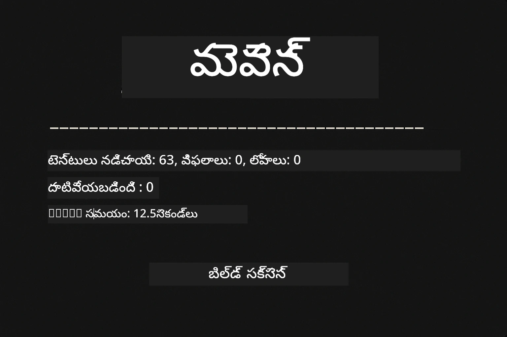
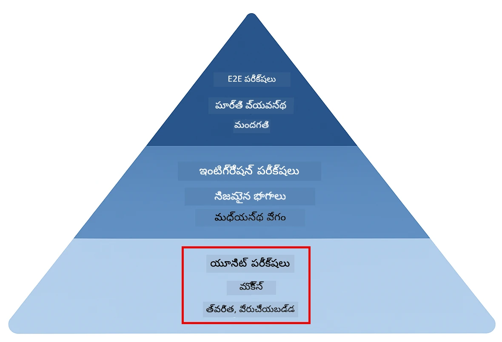
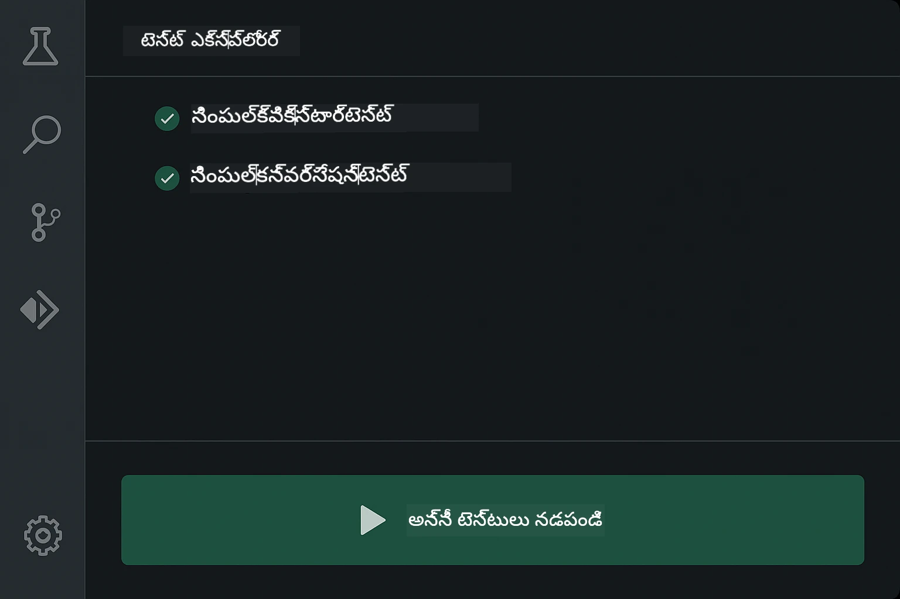
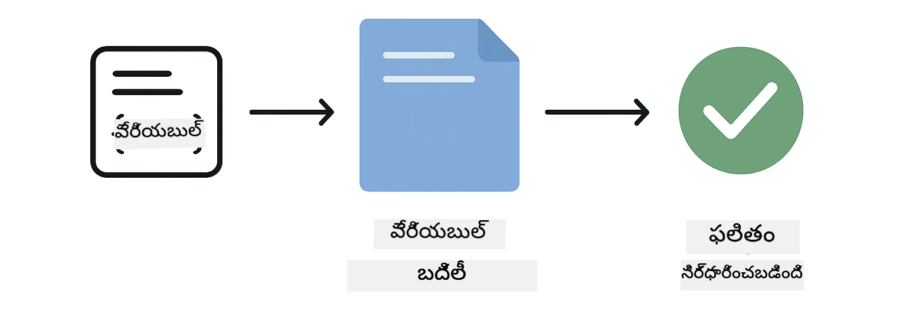
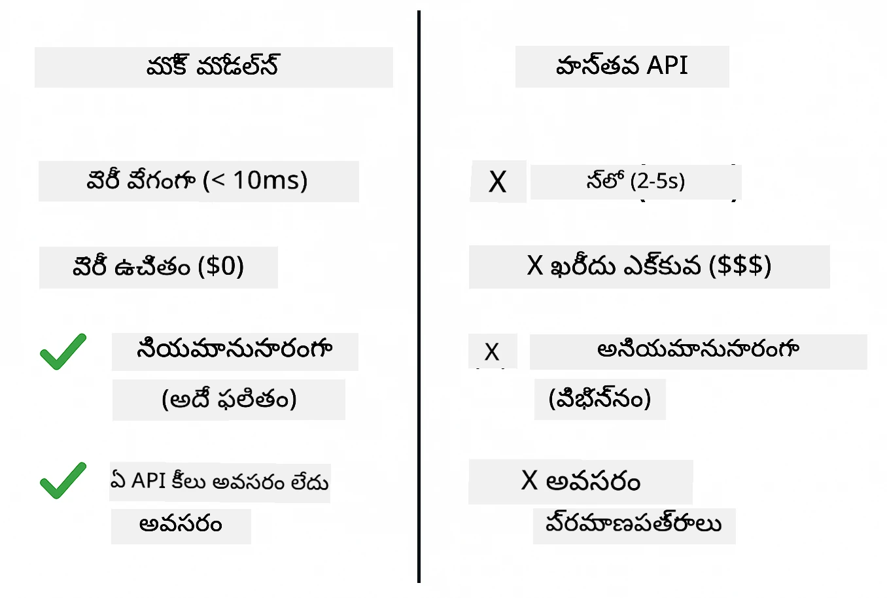
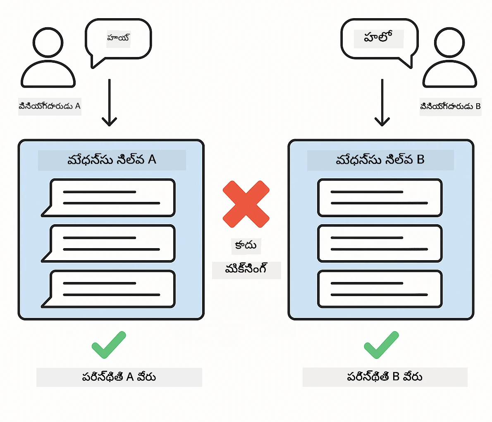
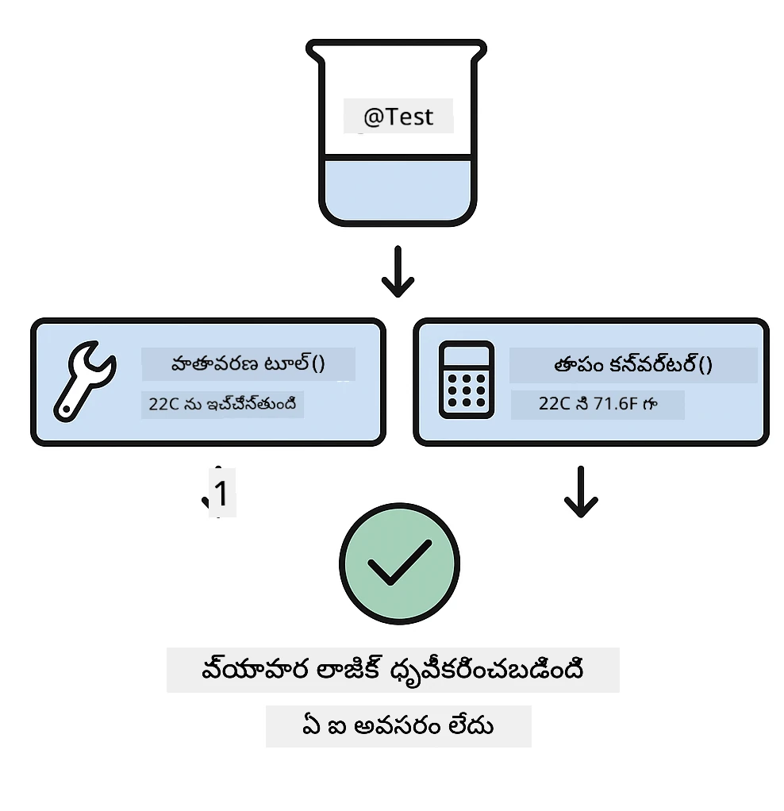
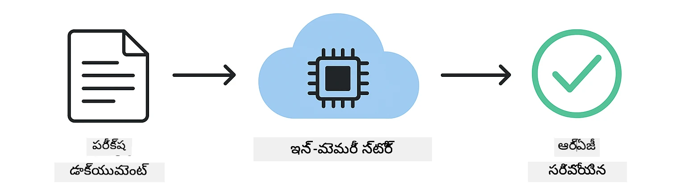

# LangChain4j అప్లికేషన్లను పరీక్షించడం

## కంటెంట్స్ పట్టిక

- [త్వరిత ప్రారంభం](#త్వరిత-ప్రారంభం)
- [పరీక్షలు ఏమి కవర్ చేస్తాయి](#పరీక్షలు-ఏమి-కవర్-చేస్తాయి)
- [పరీక్షలను నడిపించడం](#పరీక్షలను-నడిపించడం)
- [VS కోడ్‌లో పరీక్షల నడిపింపు](#vs-కోడ్‌లో-పరీక్షలు-నడిపించడం)
- [పరీక్షించే నమూనాలు](#పరీక్షించే-నమూనాలు)
- [పరీక్షల తత్త్వం](#పరీక్షల-తత్త్వం)
- [తదుపరి దశలు](#తదుపరి-దశలు)

ఈ మార్గదర్శి API కీలు లేదా బాహ్య సేవలు అవసరం లేకుండా AI అప్లికేషన్లను ఎలా పరీక్షించాలో చూపించే పరీక్షల ద్వారా మీకు సహాయం చేస్తుంది.

## త్వరిత ప్రారంభం

ఒకే కమాండ్ తో అన్ని పరీక్షలను నడపండి:

**Bash:**
```bash
mvn test
```

**PowerShell:**
```powershell
mvn --% test
```

అన్ని పరీక్షలు విజయవంతంగా పూర్తి అయితే, దిగువ స్ర్కీన్‌షాట్ లాంటి అవుట్‌పుట్ కనిపిస్తుంది — పరీక్షలు ఏ తప్పుల్లేకుండా నడుస్తున్నాయి.



*ఏ తప్పుల్లేకుండా అన్ని పరీక్షలు విజయవంతంగా నడుస్తున్న దృశ్యం*

## పరీక్షలు ఏమి కవర్ చేస్తాయి

ఈ కోర్సు ప్రాధాన్యంగా **యూనిట్ టెస్టులు** పై ఉంటుంది, అవి లోకల్ గా నడుస్తాయి. ప్రతి పరీక్ష ప్రత్యేక LangChain4j సూత్రాన్ని తానే ప్రదర్శిస్తుంది. క్రింద చూపిన పరీక్షా పిరమిడ్ లో యూనిట్ పరీక్షలు ఎక్కడ నిలబడ్డాయో సూచిస్తుంది — అవి వేగవంతమైన, నమ్మకమైన పునాదిని నిర్మిస్తాయి, మీరు తలపెట్టిన పరీక్షా వ్యూహం దీనిపై ఆధారపడుతుంది.



*యూనిట్ పరీక్షలు (త్వరగా, బహిష్కృతంగా), ఇంటిగ్రేషన్ పరీక్షలు (నిజమైన భాగాలు), అండ్-టు-ఎండ్ పరీక్షల మధ్య సమతుల్యత చూపుతూ పరీక్షా పిరమిడ్. ఈ శిక్షణ యూనిట్ పరీక్షలను కవర్ చేస్తుంది.*

| మాడ్యూల్ | పరీక్షలు | దృష్టి | కీలక ఫైళ్ళు |
|--------|-------|-------|-----------|
| **01 - పరిచయం** | 8 | సంభాషణ స్మృతిఅం మరియు రాష్ట్రం గల సంభాషణ | `SimpleConversationTest.java` |
| **02 - ప్రాంప్ట్ ఇంజినీరింగ్** | 12 | GPT-5.2 నమూనాలు, ఉత్సాహ స్థాయిలు, నిర్మిత అవుట్‌పుట్ | `SimpleGpt5PromptTest.java` |
| **03 - RAG** | 10 | డాక్యుమెంట్ ఇంజెస్టింగ్, ఎంబెడ్డింగ్లు, సారూప్యత శోధన | `DocumentServiceTest.java` |
| **04 - టూల్స్** | 12 | ఫంక్షన్ కాలింగ్ మరియు టూల్ చైనింగ్ | `SimpleToolsTest.java` |
| **05 - MCP** | 8 | మోడల్ కాంటెక్ట్స్ ప్రోటోకాల్ స్ట్డియో ట్రాన్స్‌పోర్ట్ తో | `SimpleMcpTest.java` |

## పరీక్షలను నడిపించడం

**రూట్ నుండి అన్ని పరీక్షలను నడపండి:**

**Bash:**
```bash
mvn test
```

**PowerShell:**
```powershell
mvn --% test
```

**ఒక నిర్దిష్ట మాడ్యూల్ కోసం పరీక్షలు నడపండి:**

**Bash:**
```bash
cd 01-introduction && mvn test
# లేదా రూట్ నుండి
mvn test -pl 01-introduction
```

**PowerShell:**
```powershell
cd 01-introduction; mvn --% test
# లేదా రూట్ నుండి
mvn --% test -pl 01-introduction
```

**ఒకే టెస్ట్ క్లాస్ నడపండి:**

**Bash:**
```bash
mvn test -Dtest=SimpleConversationTest
```

**PowerShell:**
```powershell
mvn --% test -Dtest=SimpleConversationTest
```

**ఒక నిర్దిష్ట టెస్ట్ పద్ధతిని నడపండి:**

**Bash:**
```bash
mvn test -Dtest=SimpleConversationTest#సంభాషణ చరిత్రని నిర్వహించాలి
```

**PowerShell:**
```powershell
mvn --% test -Dtest=SimpleConversationTest#సంభాషణ చరిత్రను నిర్వహించాలి
```

## VS కోడ్‌లో పరీక్షలు నడిపించడం

మీరు Visual Studio Code ఉపయోగిస్తుంటే, Test Explorer ద్వారా పరీక్షలను నడపడం మరియు డీబగ్ చేయడానికి గ్రాఫికల్ ఇంటర్‌ఫేస్ ఉంటుంది.



*VS కోడ్ టెస్ట్ ఎక్స్‌ప్లోర్ లో అన్ని జావా టెస్ట్ క్లాసులు మరియు వ్యక్తిగత పరీక్షా పద్ధతులు చూపిస్తున్న టెస్ట్ ట్రి*

**VS కోడ్‌లో పరీక్షలు నడిపెందుకు:**

1. Activity బార్ లో బీకర్ చిహ్నం క్లిక్ చేసి Test Explorer తెరువండి
2. అన్ని మాడ్యూల్స్ మరియు పరీక్షా క్లాసులు చూడటానికి టెస్ట్ ట్రి విస్తరించండి
3. ఏ పరీక్ష పక్కన ఉన్న ప్లే బటన్ క్లిక్ చేసి అది వ్యక్తిగతంగా నడపండి
4. "Run All Tests" క్లిక్ చేసి మొత్తం సూట్ అమలు చేయండి
5. ఏ పరీక్ష పైన రైట్-క్లిక్ చేసి "Debug Test" ఎంచుకుని బ్రేక్‌పాయింట్లు పెట్టి కోడ్ లో అడుగు అడుగు నడపండి

పరీక్షలు విజయవంతంగా నడిచేటప్పుడు గ్రీన్ చెక్మార్కులు చూపిస్తుంది, మరియు మరింత వివరణాత్మక వైఫల్య సందేశాలు ఇస్తుంది.

## పరీక్షించే నమూనాలు

### నమూనా 1: ప్రాంప్ట్ టెంప్లేట్ పరీక్ష

సులభమైన నమూనా AI మోడల్ ను కాల్ చేయకుండా ప్రాంప్ట్ టెంప్లేట్ లను పరీక్షిస్తుంది. వేరియబుల్ సబ్‌స్టిట్యూషన్ సరిగా పనిచేస్తుందో, ప్రాంప్ట్‌లు సరైన ఫార్మాట్లో ఉన్నాయో మీరు ధృవీకరించాలి.



*ప్రాంప్ట్ టెంప్లేట్ పరీక్షలో వేరియబుల్ సబ్‌స్టిట్యూషన్ ఫ్లో చూపించడం: ప్లేస్‌హోల్డర్లు ఉన్న టెంప్లేట్ → విలువలు అప్లై చేయబడ్డాయి → ఫార్మాటెడ్ అవుట్‌పుట్ ధృవీకరించబడింది*

```java
@Test
@DisplayName("Should format prompt template with variables")
void testPromptTemplateFormatting() {
    PromptTemplate template = PromptTemplate.from(
        "Best time to visit {{destination}} for {{activity}}?"
    );
    
    Prompt prompt = template.apply(Map.of(
        "destination", "Paris",
        "activity", "sightseeing"
    ));
    
    assertThat(prompt.text()).isEqualTo("Best time to visit Paris for sightseeing?");
}
```

ఈ నమూనా వేరియబుల్ సబ్‌స్టిట్యూషన్ సరిగా పనిచేస్తుందో, ప్రాంప్ట్‌లు అంచనా వేసిన విధంగా ఫార్మాట్ అయ్యాయో ధృవీకరిస్తుంది — API కీ లేదా మోడల్ కాల్ అవసరం లేదు.

### నమూనా 2: భాషా మోడల్స్ మాక్ చేయడం

సంభాషణ లాజిక్ ను పరీక్షించేటప్పుడు, Mockito ఉపయోగించి ముందుగా నిర్ధారిత ప్రతిస్పందనలు ఇచ్చే మాక్ మోడల్స్ సృష్టించండి. ఇది పరీక్షలను వేగవంతంగా, ఉచితంగా, నిర్ణయాత్మకంగా చేస్తుంది.



*పరీక్షలకు మాక్స్ ఎందుకు ప్రాధాన్యం ఇవ్వబడతాయో చూపిస్తూ తులనాత్మక చిత్రం: అవి వేగవంతం, ఉచితం, నిర్ణయాత్మకం మరియు API కీలు అవసరం లేవు*

```java
@ExtendWith(MockitoExtension.class)
class SimpleConversationTest {
    
    private ConversationService conversationService;
    
    @Mock
    private OpenAiOfficialChatModel mockChatModel;
    
    @BeforeEach
    void setUp() {
        ChatResponse mockResponse = ChatResponse.builder()
            .aiMessage(AiMessage.from("This is a test response"))
            .build();
        when(mockChatModel.chat(anyList())).thenReturn(mockResponse);
        
        conversationService = new ConversationService(mockChatModel);
    }
    
    @Test
    void shouldMaintainConversationHistory() {
        String conversationId = conversationService.startConversation();
        
        ChatResponse mockResponse1 = ChatResponse.builder()
            .aiMessage(AiMessage.from("Response 1"))
            .build();
        ChatResponse mockResponse2 = ChatResponse.builder()
            .aiMessage(AiMessage.from("Response 2"))
            .build();
        ChatResponse mockResponse3 = ChatResponse.builder()
            .aiMessage(AiMessage.from("Response 3"))
            .build();
        
        when(mockChatModel.chat(anyList()))
            .thenReturn(mockResponse1)
            .thenReturn(mockResponse2)
            .thenReturn(mockResponse3);

        conversationService.chat(conversationId, "First message");
        conversationService.chat(conversationId, "Second message");
        conversationService.chat(conversationId, "Third message");

        List<ChatMessage> history = conversationService.getHistory(conversationId);
        assertThat(history).hasSize(6); // 3 వినియోగదారులు + 3 AI సందేశాలు
    }
}
```

ఈ నమూనా `01-introduction/src/test/java/com/example/langchain4j/service/SimpleConversationTest.java` లో కనిపిస్తుంది. మాక్ అనువర్తన యథార్థ ప్రవర్తనను నిర్ధారించేందుకు, మీరు మెమరీ నిర్వహణ సరిగ్గా పనిచేస్తుందో నిర్ధారించవచ్చు.

### నమూనా 3: సంభాషణ విభజనను పరీక్షించడం

సంభాషణ స్మృతి బహుళ వినియోగదారులను వేరుగా ఉంచాలి. ఈ పరీక్ష సంభాషణలు ఒకరి కాంటెక్స్ట్ ను మరొకరి తో కలపకుండా ఉంటాయో నిర్ధారిస్తుంది.



*వివిధ వినియోగదారుల కోసం వేరుగా మెమరీ స్టోర్స్ ఉంచడం ద్వారా సంభాషణ విభజన పరీక్ష*

```java
@Test
void shouldIsolateConversationsByid() {
    String conv1 = conversationService.startConversation();
    String conv2 = conversationService.startConversation();
    
    ChatResponse mockResponse = ChatResponse.builder()
        .aiMessage(AiMessage.from("Response"))
        .build();
    when(mockChatModel.chat(anyList())).thenReturn(mockResponse);

    conversationService.chat(conv1, "Message for conversation 1");
    conversationService.chat(conv2, "Message for conversation 2");

    List<ChatMessage> history1 = conversationService.getHistory(conv1);
    List<ChatMessage> history2 = conversationService.getHistory(conv2);
    
    assertThat(history1).hasSize(2);
    assertThat(history2).hasSize(2);
}
```

ప్రతి సంభాషణ తన స్వంత స్వతంత్ర చరిత్రను నిర్వహిస్తుంది. ఉత్పత్తి వ్యవస్థలలో, ఈ విభజన బహుళ వినియోగదారుల అప్లికేషన్ల కోసం అత్యంత ముఖ్యమైనది.

### నమూనా 4: టూల్స్‌ను స్వతంత్రంగా పరీక్షించడం

టూల్స్ అంటే AI పిలవగల ఫంక్షన్లు. AI నిర్ణయాలపై ఆధారపడకుండా వాటి పనితీరును నేరుగా పరీక్షించండి.



*ఏ AI కాల్‌లూ లేకుండా టూల్‌లను మాక్ రీతిలో నడపడం ద్వారా వ్యాపార లాజిక్ సరిచూసే పరీక్షలు*

```java
@Test
void shouldConvertCelsiusToFahrenheit() {
    TemperatureTool tempTool = new TemperatureTool();
    String result = tempTool.celsiusToFahrenheit(25.0);
    assertThat(result).containsPattern("77[.,]0°F");
}

@Test
void shouldDemonstrateToolChaining() {
    WeatherTool weatherTool = new WeatherTool();
    TemperatureTool tempTool = new TemperatureTool();

    String weatherResult = weatherTool.getCurrentWeather("Seattle");
    assertThat(weatherResult).containsPattern("\\d+°C");

    String conversionResult = tempTool.celsiusToFahrenheit(22.0);
    assertThat(conversionResult).containsPattern("71[.,]6°F");
}
```

`04-tools/src/test/java/com/example/langchain4j/agents/tools/SimpleToolsTest.java` లోని ఈ పరీక్షలు AI పాల్గొనకుండా టూల్ వ్యాపార లాజిక్ ని ధృవీకరిస్తాయి. చైనింగ్ ఉదాహరణలో ఒక టూల్ అవుట్‌పుట్ మరొక టూల్ ఇన్‌పుట్‌గా ఎలా పనిచేస్తుందో చూపిస్తుంది.

### నమూనా 5: ఇన్-మెమరీ RAG పరీక్ష

ప్రపంచంలో RAG системы వెక్టార్ డేటాబేసులు మరియు ఎంబెడ్డింగ్ సర్వీసులతో పనిచేస్తాయి. ఇన్-మెమరీ నమూనా మీకు పూర్తిగా పైప్‌లైన్‌ను బాహ్య ఆధారాలుండకుండా పరీక్షించే అవకాశం ఇస్తుంది.



*డాక్యుమెంట్ పార్సింగ్, ఎంబెడ్డింగ్ నిల్వ, సారూప్యత శోధన డేటాబేస్ అవసరం లేకుండా ఇన్-మెమరీ RAG పరీక్షా వర్క్‌ఫ్లో*

```java
@Test
void testProcessTextDocument() {
    String content = "This is a test document.\nIt has multiple lines.";
    InputStream inputStream = new ByteArrayInputStream(content.getBytes(StandardCharsets.UTF_8));
    
    DocumentService.ProcessedDocument result = 
        documentService.processDocument(inputStream, "test.txt");

    assertNotNull(result);
    assertTrue(result.segments().size() > 0);
    assertEquals("test.txt", result.segments().get(0).metadata().getString("filename"));
}
```

ఈ పరీక్ష `03-rag/src/test/java/com/example/langchain4j/rag/service/DocumentServiceTest.java` నుండి, ఒక డాక్యుమెంట్ ని మెమరీలో సృష్టించి, చంకింగ్ మరియు మెటాడేటా నిర్వహణని ధృవీకరిస్తుంది.

### నమూనా 6: MCP ఇంటిగ్రేషన్ పరీక్షలు

MCP మాడ్యూల్ స్ట్డియో ట్రాన్స్‌పోర్ట్ ఉపయోగించి Model Context Protocol ఇంటిగ్రేషన్‌ని పరీక్షిస్తుంది. ఈ పరీక్షలు మీ అప్లికేషన్ MCP సర్వర్లను సబ్ప్రాసెస్‌లుగా మొదలెடுத்து సంభాషించగలదని నిర్ధారిస్తాయి.

`05-mcp/src/test/java/com/example/langchain4j/mcp/SimpleMcpTest.java` లో పరీక్షలు MCP క్లయింట్ ప్రవర్తనను ధృవీకరిస్తాయి.

**వాటిని నడపండి:**

**Bash:**
```bash
cd 05-mcp && mvn test
```

**PowerShell:**
```powershell
cd 05-mcp; mvn --% test
```

## పరీక్షల తత్త్వం

మీ కోడ్ ను పరీక్షించండి, AIని కాదు. మీరు రాసిన కోడ్ ని ప్రాంప్ట్‌లు ఎలా నిర్మించబడతాయో, మెమరీ ఎలా నిర్వహించబడుతుందో, మరియు టూల్స్ ఎలా నిర్వర్తించబడతాయో పరీక్షల ద్వారా ధృవీకరించాలి. AI సమాధానాలు వేర్వేరు ఉంటాయి కనుక అవి పరీక్షల నిర్ధారణలో భాగంగా ఉండకూడదు. మీరు మీ ప్రాంప్ట్ టెంప్లేట్ లో వేరియబుల్స్ సరిగా సబ్‌స్టిట్యూట్ అవుతున్నాయో చూసుకోండి, AI సరైన సమాధానం ఇస్తుందా అని కాదు.

భాషా మోడల్స్ కోసం మాక్స్ ఉపయోగించండి. అవి బయట ఆధారపడే వనరులు, అవి నెమ్మదిగా, ఖరీదైనవిగా మరియు నిర్ణయాత్మకం కానివి. మాకింగ్ వల్ల పరీక్షలు కొన్ని సెకన్ల కాకుండా మిల్లీసెకండ్లలో వేగంగా, ఉచితంగా, నిర్ణయాత్మకంగా నడుస్తాయి.

పరీక్షలను స్వతంత్రంగా ఉంచండి. ప్రతీ పరీక్ష తన దత్తాంశాన్ని సెట్ చేయాలి, ఇతర పరీక్షలపై ఆధారపడకూడదు, మరియు తన తరువాత శుభ్రపరుచుకోవాలి. పరీక్షల అమలు క్రమం ఎంత అయినా అవి విజయవంతంగా ఉండాలి.

సంతోషకర మార్గం మించి అడ్డంకులను పరీక్షించండి. ఖాళీ ఇన్‌పుట్లు, చాలా పెద్ద ఇన్‌పుట్లు, ప్రత్యేక అక్షరాలు, చెలామణీలో లేని పారామీటర్లు, సరిహద్దు పరిస్థితులు ప్రయత్నించండి. సాధారణ వినియోగంలో కనిపించని బగ్స్ ఇవే విపరీతంగా బయటపెడతాయి.

వివరణాత్మక పేర్లు ఉపయోగించండి. `shouldMaintainConversationHistoryAcrossMultipleMessages()` ను `test1()`తో పోల్చండి. మొదటి పేరు తేలికగా ఏమి పరీక్షిస్తున్నారో చెబుతుంది, ఎటువంటి లోపాలు వస్తే డీబగ్ చేయడం చాలా సులభం అవుతుంది.

## తదుపరి దశలు

మీకు పరీక్షించే నమూనాలు అర్థమయ్యాయి కాబట్టి, ప్రతి మాడ్యూల్ లో మరింత లోతుగా కుందాం:

- **[01 - పరిచయం](../01-introduction/README.md)** - సంభాషణ స్మృతి నిర్వహణ నేర్చుకోండి
- **[02 - ప్రాంప్ట్ ఇంజినీరింగ్](../02/prompt-engineering/README.md)** - GPT-5.2 ప్రాంప్ట్ నమూనాలు పటిష్టం చేయండి
- **[03 - RAG](../03-rag/README.md)** - రిట్రీవల్-ఆగ్మెంటెడ్ జనరేషన్ సిస్టమ్లను నిర్మించండి
- **[04 - టూల్స్](../04-tools/README.md)** - ఫంక్షన్ కాలింగ్ మరియు టూల్ చైలింగ్ అమలు చేయండి
- **[05 - MCP](../05-mcp/README.md)** - మోడల్ కాంటెక్ట్స్ ప్రోటోకాల్ ఇంటిగ్రేట్ చేయండి

ప్రతి మాడ్యూల్ యొక్క README ఇక్కడ పరీక్షించబడిన సూత్రాల వివరమైన వివరణ ఇస్తుంది.

---

**నావిగేషన్:** [← తిరిగి మెయిన్ కు](../README.md)

---

<!-- CO-OP TRANSLATOR DISCLAIMER START -->
**అస్వీకరణ**:
ఈ పత్రం AI అనువాద సేవ [Co-op Translator](https://github.com/Azure/co-op-translator) ఉపయోగించి అనువదించబడింది. మేము ఖచ్చితత్వానికి ప్రయత్నిస్తున్నప్పటికీ, ఆటోమేటెడ్ అనువాదాలు తప్పులు లేదా అసమగ్రతలను కలిగి ఉండవచ్చు. దాని స్వదేశ భాషలో ఉన్న అసలు పత్రాన్ని అధికారం కలిగిన మూలంగా పరిగణించాలి. కీలకమైన సమాచారం కోసం, ప్రొఫెషనల్ మానవ అనువాదాన్ని సిఫారసు చేస్తాము. ఈ అనువాదం ఉపయోగం వల్ల కలిగే ఏవైనా అపార్థాలు లేదా తప్పుదారులు కోసం మేము బాధ్యత వహించము.
<!-- CO-OP TRANSLATOR DISCLAIMER END -->