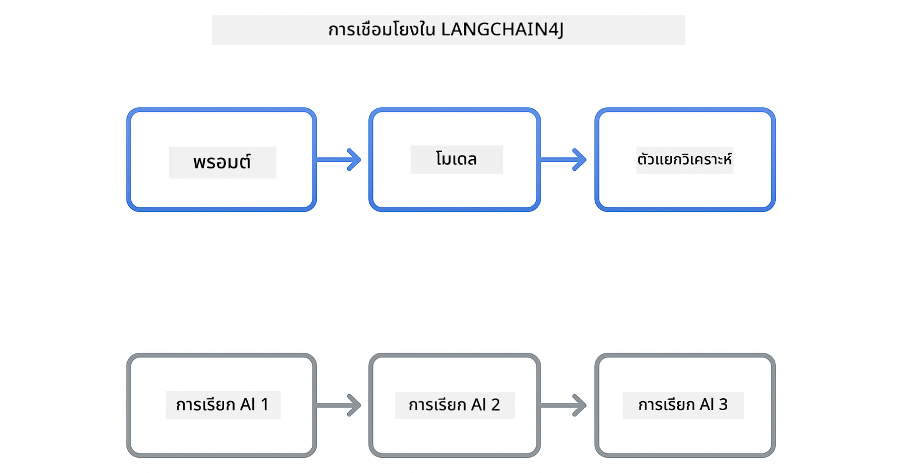

<!--
CO_OP_TRANSLATOR_METADATA:
{
  "original_hash": "22b5d7c8d7585325e38b37fd29eafe25",
  "translation_date": "2026-01-05T23:31:13+00:00",
  "source_file": "00-quick-start/README.md",
  "language_code": "th"
}
-->
# Module 00: เริ่มต้นอย่างรวดเร็ว

## สารบัญ

- [แนะนำ](../../../00-quick-start)
- [LangChain4j คืออะไร?](../../../00-quick-start)
- [Dependency ของ LangChain4j](../../../00-quick-start)
- [ข้อกำหนดเบื้องต้น](../../../00-quick-start)
- [การตั้งค่า](../../../00-quick-start)
  - [1. รับโทเค็น GitHub ของคุณ](../../../00-quick-start)
  - [2. ตั้งค่าโทเค็นของคุณ](../../../00-quick-start)
- [รันตัวอย่าง](../../../00-quick-start)
  - [1. การแชทพื้นฐาน](../../../00-quick-start)
  - [2. รูปแบบการใช้ Prompt](../../../00-quick-start)
  - [3. การเรียกใช้ฟังก์ชัน](../../../00-quick-start)
  - [4. ถามตอบเอกสาร (RAG)](../../../00-quick-start)
  - [5. ปัญญาประดิษฐ์ที่รับผิดชอบ](../../../00-quick-start)
- [ตัวอย่างแต่ละอันแสดงอะไร](../../../00-quick-start)
- [ขั้นตอนถัดไป](../../../00-quick-start)
- [การแก้ไขปัญหา](../../../00-quick-start)

## แนะนำ

เริ่มต้นอย่างรวดเร็วนี้มีจุดประสงค์เพื่อช่วยให้คุณเริ่มใช้งาน LangChain4j ได้เร็วที่สุด โดยครอบคลุมพื้นฐานที่สุดของการสร้างแอปพลิเคชัน AI ด้วย LangChain4j และ GitHub Models ในโมดูลถัดไป คุณจะได้ใช้ Azure OpenAI กับ LangChain4j เพื่อสร้างแอปพลิเคชันที่ซับซ้อนยิ่งขึ้น

## LangChain4j คืออะไร?

LangChain4j คือไลบรารี Java ที่ช่วยให้ง่ายต่อการสร้างแอปพลิเคชันที่ขับเคลื่อนด้วย AI แทนที่จะต้องจัดการกับ HTTP clients และการแปลง JSON คุณจะทำงานผ่าน API ของ Java ที่สะอาด

"chain" ใน LangChain หมายถึงการเชื่อมต่อหลายองค์ประกอบเข้าด้วยกัน — คุณอาจเชื่อม prompt กับโมเดลกับ parser หรือเชื่อมต่อการเรียก AI หลายตัวที่เอาผลลัพธ์ตัวหนึ่งเป็นอินพุตสำหรับตัวถัดไป เริ่มต้นอย่างรวดเร็วนี้เน้นที่พื้นฐานก่อนที่จะสำรวจ chain ที่ซับซ้อนขึ้น



*การเชื่อมต่อองค์ประกอบใน LangChain4j - บล็อกก่อสร้างที่เชื่อมต่อกันเพื่อสร้างเวิร์กโฟลว์ AI ที่ทรงพลัง*

เราจะใช้สามองค์ประกอบหลัก:

**ChatLanguageModel** - อินเทอร์เฟซสำหรับการโต้ตอบกับโมเดล AI เรียกใช้ `model.chat("prompt")` และรับสตริงตอบกลับ เราใช้ `OpenAiOfficialChatModel` ซึ่งทำงานกับ endpoints ที่เข้ากันได้กับ OpenAI เช่น GitHub Models

**AiServices** - สร้างอินเทอร์เฟซบริการ AI ที่ปลอดภัยในด้านประเภท กำหนดเมธอด แปะด้วย `@Tool` แล้ว LangChain4j จะจัดการ orchestration ให้ AI จะเรียกใช้เมธอด Java ของคุณโดยอัตโนมัติเมื่อจำเป็น

**MessageWindowChatMemory** - เก็บประวัติการสนทนา หากไม่มีนี้แต่ละคำขอจะเป็นอิสระ แต่ถ้ามี AI จะจำข้อความก่อนหน้าและรักษาบริบทตลอดหลายรอบของการสนทนา


*สถาปัตยกรรม LangChain4j — องค์ประกอบหลักทำงานร่วมกันเพื่อขับเคลื่อนแอป AI ของคุณ*

## Dependency ของ LangChain4j

เริ่มต้นอย่างรวดเร็วนี้ใช้ dependency Maven สองตัวใน [`pom.xml`](../../../00-quick-start/pom.xml):

```xml
<!-- Core LangChain4j library -->
<dependency>
    <groupId>dev.langchain4j</groupId>
    <artifactId>langchain4j</artifactId> <!-- Inherited from BOM in root pom.xml -->
</dependency>

<!-- OpenAI integration (works with GitHub Models) -->
<dependency>
    <groupId>dev.langchain4j</groupId>
    <artifactId>langchain4j-open-ai-official</artifactId> <!-- Inherited from BOM in root pom.xml -->
</dependency>
```

โมดูล `langchain4j-open-ai-official` ให้คลาส `OpenAiOfficialChatModel` ซึ่งเชื่อมต่อกับ API ที่เข้ากันได้กับ OpenAI GitHub Models ใช้รูปแบบ API เดียวกัน ดังนั้นจึงไม่ต้องมีอะแดปเตอร์พิเศษ เพียงชี้ URL พื้นฐานไปที่ `https://models.github.ai/inference`

## ข้อกำหนดเบื้องต้น

**ใช้ Dev Container?** Java และ Maven ได้ติดตั้งไว้แล้ว คุณเพียงแค่ต้องมี GitHub Personal Access Token

**การพัฒนาในเครื่อง:**
- Java 21+, Maven 3.9+
- GitHub Personal Access Token (คำแนะนำด้านล่าง)

> **หมายเหตุ:** โมดูลนี้ใช้ `gpt-4.1-nano` จาก GitHub Models อย่าแก้ไขชื่อโมเดลในโค้ด — ตั้งค่าไว้เพื่อใช้งานกับโมเดลที่มีให้จาก GitHub

## การตั้งค่า

### 1. รับโทเค็น GitHub ของคุณ

1. ไปที่ [GitHub Settings → Personal Access Tokens](https://github.com/settings/personal-access-tokens)
2. คลิก "Generate new token"
3. ตั้งชื่อที่อธิบายได้ (เช่น "LangChain4j Demo")
4. ตั้งวันหมดอายุ (แนะนำ 7 วัน)
5. ใน "Account permissions" หา "Models" แล้วตั้งเป็น "Read-only"
6. คลิก "Generate token"
7. คัดลอกและเก็บโทเค็นของคุณ — คุณจะไม่เห็นอีก

### 2. ตั้งค่าโทเค็นของคุณ

**ตัวเลือก 1: ใช้ VS Code (แนะนำ)**

ถ้าคุณใช้ VS Code ให้เพิ่มโทเค็นของคุณในไฟล์ `.env` ที่โฟลเดอร์โปรเจ็กต์หลัก

ถ้าไฟล์ `.env` ไม่มีอยู่ ให้คัดลอก `.env.example` เป็น `.env` หรือสร้างใหม่ในโฟลเดอร์โปรเจ็กต์หลัก

**ตัวอย่างไฟล์ `.env`:**
```bash
# ใน /workspaces/LangChain4j-for-Beginners/.env
GITHUB_TOKEN=your_token_here
```

จากนั้นคุณก็เพียงคลิกขวาที่ไฟล์ตัวอย่าง (เช่น `BasicChatDemo.java`) ใน Explorer และเลือก **"Run Java"** หรือใช้การตั้งค่าการรันจากแผง Run and Debug

**ตัวเลือก 2: ใช้ Terminal**

ตั้งค่าโทเค็นเป็นตัวแปรสภาพแวดล้อม:

**Bash:**
```bash
export GITHUB_TOKEN=your_token_here
```

**PowerShell:**
```powershell
$env:GITHUB_TOKEN=your_token_here
```

## รันตัวอย่าง

**ใช้ VS Code:** คลิกขวาที่ไฟล์ตัวอย่างใดก็ได้ใน Explorer แล้วเลือก **"Run Java"** หรือใช้การตั้งค่าการรันจากแผง Run and Debug (อย่าลืมเพิ่มโทเค็นในไฟล์ `.env` ก่อน)

**ใช้ Maven:** หรือคุณสามารถรันจากบรรทัดคำสั่ง:

### 1. การแชทพื้นฐาน

**Bash:**
```bash
mvn compile exec:java -Dexec.mainClass=com.example.langchain4j.quickstart.BasicChatDemo
```

**PowerShell:**
```powershell
mvn --% compile exec:java -Dexec.mainClass=com.example.langchain4j.quickstart.BasicChatDemo
```

### 2. รูปแบบการใช้ Prompt

**Bash:**
```bash
mvn compile exec:java -Dexec.mainClass=com.example.langchain4j.quickstart.PromptEngineeringDemo
```

**PowerShell:**
```powershell
mvn --% compile exec:java -Dexec.mainClass=com.example.langchain4j.quickstart.PromptEngineeringDemo
```

แสดงการใช้ zero-shot, few-shot, chain-of-thought และ role-based prompting

### 3. การเรียกใช้ฟังก์ชัน

**Bash:**
```bash
mvn compile exec:java -Dexec.mainClass=com.example.langchain4j.quickstart.ToolIntegrationDemo
```

**PowerShell:**
```powershell
mvn --% compile exec:java -Dexec.mainClass=com.example.langchain4j.quickstart.ToolIntegrationDemo
```

AI จะเรียกใช้เมธอด Java ของคุณโดยอัตโนมัติเมื่อจำเป็น

### 4. ถามตอบเอกสาร (RAG)

**Bash:**
```bash
mvn compile exec:java -Dexec.mainClass=com.example.langchain4j.quickstart.SimpleReaderDemo
```

**PowerShell:**
```powershell
mvn --% compile exec:java -Dexec.mainClass=com.example.langchain4j.quickstart.SimpleReaderDemo
```

ถามคำถามเกี่ยวกับเนื้อหาใน `document.txt`

### 5. ปัญญาประดิษฐ์ที่รับผิดชอบ

**Bash:**
```bash
mvn compile exec:java -Dexec.mainClass=com.example.langchain4j.quickstart.ResponsibleAIDemo
```

**PowerShell:**
```powershell
mvn --% compile exec:java -Dexec.mainClass=com.example.langchain4j.quickstart.ResponsibleAIDemo
```

ดูว่าฟิลเตอร์ความปลอดภัยของ AI บล็อกเนื้อหาที่เป็นอันตรายอย่างไร

## ตัวอย่างแต่ละอันแสดงอะไร

**การแชทพื้นฐาน** - [BasicChatDemo.java](../../../00-quick-start/src/main/java/com/example/langchain4j/quickstart/BasicChatDemo.java)

เริ่มตรงนี้เพื่อดู LangChain4j ในรูปแบบที่ง่ายที่สุด คุณจะสร้าง `OpenAiOfficialChatModel` ส่ง prompt ด้วย `.chat()` แล้วรับการตอบกลับ นี่แสดงพื้นฐาน: วิธีการเริ่มต้นโมเดลด้วย endpoints และ API keys แบบกำหนดเอง เมื่อคุณเข้าใจรูปแบบนี้ ทุกอย่างถัดไปจะสร้างบนพื้นฐานนี้

```java
ChatLanguageModel model = OpenAiOfficialChatModel.builder()
    .baseUrl("https://models.github.ai/inference")
    .apiKey(System.getenv("GITHUB_TOKEN"))
    .modelName("gpt-4.1-nano")
    .build();

String response = model.chat("What is LangChain4j?");
System.out.println(response);
```

> **🤖 ลองใช้กับ [GitHub Copilot](https://github.com/features/copilot) Chat:** เปิด [`BasicChatDemo.java`](../../../00-quick-start/src/main/java/com/example/langchain4j/quickstart/BasicChatDemo.java) แล้วถาม:
> - "ฉันจะเปลี่ยนจาก GitHub Models ไปใช้ Azure OpenAI ในโค้ดนี้ได้อย่างไร?"
> - "มีพารามิเตอร์อะไรบ้างที่ฉันสามารถกำหนดค่าใน OpenAiOfficialChatModel.builder()?"
> - "ฉันจะเพิ่มการตอบสนองแบบสตรีมมิ่งแทนการรอผลลัพธ์เต็มได้อย่างไร?"

**การสร้าง Prompt** - [PromptEngineeringDemo.java](../../../00-quick-start/src/main/java/com/example/langchain4j/quickstart/PromptEngineeringDemo.java)

ตอนนี้คุณรู้วิธีพูดคุยกับโมเดลแล้ว เรามาดูสิ่งที่คุณจะพูดกับมัน ตัวอย่างนี้ใช้การตั้งค่าโมเดลเดียวกันแต่แสดงสี่รูปแบบ prompting ที่ต่างกัน ลอง zero-shot prompts สำหรับคำสั่งโดยตรง few-shot prompts ที่เรียนรู้จากตัวอย่าง chain-of-thought prompts ที่แสดงขั้นตอนการคิด และ role-based prompts ที่ตั้งบริบท คุณจะเห็นว่าโมเดลเดียวกันให้ผลลัพธ์ต่างกันมากขึ้นตามการจัดกรอบคำขอ

```java
PromptTemplate template = PromptTemplate.from(
    "What's the best time to visit {{destination}} for {{activity}}?"
);

Prompt prompt = template.apply(Map.of(
    "destination", "Paris",
    "activity", "sightseeing"
));

String response = model.chat(prompt.text());
```

> **🤖 ลองใช้กับ [GitHub Copilot](https://github.com/features/copilot) Chat:** เปิด [`PromptEngineeringDemo.java`](../../../00-quick-start/src/main/java/com/example/langchain4j/quickstart/PromptEngineeringDemo.java) แล้วถาม:
> - "ความแตกต่างระหว่าง zero-shot กับ few-shot prompting คืออะไร และเมื่อไรควรใช้แต่ละแบบ?"
> - "พารามิเตอร์ temperature มีผลต่อการตอบกลับของโมเดลอย่างไร?"
> - "มีกลเม็ดอะไรบ้างในการป้องกัน prompt injection attacks ในการผลิต?"
> - "ฉันจะสร้าง PromptTemplate ที่นำกลับมาใช้ใหม่สำหรับรูปแบบทั่วไปได้อย่างไร?"

**การผสานเครื่องมือ** - [ToolIntegrationDemo.java](../../../00-quick-start/src/main/java/com/example/langchain4j/quickstart/ToolIntegrationDemo.java)

นี่คือจุดที่ LangChain4j มีพลัง คุณจะใช้ `AiServices` สร้างผู้ช่วย AI ที่เรียกเมธอด Java ของคุณได้ เพียงแค่แปะเมธอดด้วย `@Tool("description")` แล้ว LangChain4j จะจัดการส่วนที่เหลือ — AI จะตัดสินใจใช้เครื่องมือแต่ละตัวโดยอัตโนมัติตามสิ่งที่ผู้ใช้ถาม นี่แสดงการเรียกใช้ฟังก์ชัน เทคนิคสำคัญสำหรับการสร้าง AI ที่สามารถทำงานได้ ไม่ใช่แค่ตอบคำถาม

```java
@Tool("Performs addition of two numeric values")
public double add(double a, double b) {
    return a + b;
}

MathAssistant assistant = AiServices.create(MathAssistant.class, model);
String response = assistant.chat("What is 25 plus 17?");
```

> **🤖 ลองใช้กับ [GitHub Copilot](https://github.com/features/copilot) Chat:** เปิด [`ToolIntegrationDemo.java`](../../../00-quick-start/src/main/java/com/example/langchain4j/quickstart/ToolIntegrationDemo.java) แล้วถาม:
> - "แอนโนเทชัน @Tool ทำงานอย่างไร และ LangChain4j ทำอะไรเบื้องหลัง?"
> - "AI สามารถเรียกหลายเครื่องมือต่อเนื่องกันเพื่อแก้ปัญหาที่ซับซ้อนได้ไหม?"
> - "แล้วถ้าเครื่องมือโยน exception จะจัดการอย่างไร?"
> - "ฉันจะผสาน API จริงแทนตัวอย่างเครื่องคิดเลขนี้ได้อย่างไร?"

**ถามตอบเอกสาร (RAG)** - [SimpleReaderDemo.java](../../../00-quick-start/src/main/java/com/example/langchain4j/quickstart/SimpleReaderDemo.java)

ที่นี่คุณจะเห็นพื้นฐานของ RAG (retrieval-augmented generation) แทนที่จะพึ่งพาข้อมูลฝึกโมเดล AI, คุณโหลดเนื้อหาจาก [`document.txt`](../../../00-quick-start/document.txt) และใส่ไว้ใน prompt AI จะตอบโดยอิงจากเอกสารของคุณ ไม่ใช่ความรู้ทั่วไป นี่เป็นก้าวแรกสู่การสร้างระบบที่ทำงานกับข้อมูลของคุณเอง

```java
Document document = FileSystemDocumentLoader.loadDocument("document.txt");
String content = document.text();

String prompt = "Based on this document: " + content + 
                "\nQuestion: What is the main topic?";
String response = model.chat(prompt);
```

> **หมายเหตุ:** วิธีง่ายนี้โหลดเอกสารทั้งฉบับเข้าไปใน prompt สำหรับไฟล์ใหญ่ (>10KB) คุณจะเกินขีดจำกัดบริบท โมดูล 03 จะอธิบายการแบ่งชิ้นและการค้นหาเวกเตอร์สำหรับระบบ RAG ในการผลิต

> **🤖 ลองใช้กับ [GitHub Copilot](https://github.com/features/copilot) Chat:** เปิด [`SimpleReaderDemo.java`](../../../00-quick-start/src/main/java/com/example/langchain4j/quickstart/SimpleReaderDemo.java) แล้วถาม:
> - "RAG ป้องกัน AI สร้างข้อมูลผิดพลาดอย่างไร เมื่อเทียบกับการใช้ข้อมูลฝึกโมเดล?"
> - "ต่างกันอย่างไรระหว่างวิธีง่ายนี้กับการใช้เวกเตอร์ embeddings สำหรับการค้นหา?"
> - "ฉันจะขยายระบบนี้เพื่อจัดการหลายเอกสารหรือฐานความรู้ขนาดใหญ่ได้อย่างไร?"
> - "แนวทางที่ดีที่สุดในการจัดโครงสร้าง prompt เพื่อให้ AI ใช้บริบทที่ให้มาอย่างเดียวคืออะไร?"

**ปัญญาประดิษฐ์ที่รับผิดชอบ** - [ResponsibleAIDemo.java](../../../00-quick-start/src/main/java/com/example/langchain4j/quickstart/ResponsibleAIDemo.java)

สร้างความปลอดภัย AI ด้วยการป้องกันหลายชั้น ตัวอย่างนี้แสดงสองชั้นการป้องกันที่ทำงานร่วมกัน:

**ส่วนที่ 1: LangChain4j Input Guardrails** — บล็อก prompt อันตรายก่อนถึง LLM สร้าง guardrails แบบกำหนดเองเพื่อตรวจหาคำหลักหรือรูปแบบที่ห้าม ใช้งานในโค้ดของคุณเร็วและฟรี

```java
class DangerousContentGuardrail implements InputGuardrail {
    @Override
    public InputGuardrailResult validate(UserMessage userMessage) {
        String text = userMessage.singleText().toLowerCase();
        if (text.contains("explosives")) {
            return fatal("Blocked: contains prohibited keyword");
        }
        return success();
    }
}
```

**ส่วนที่ 2: ตัวกรองความปลอดภัยของผู้ให้บริการ** — GitHub Models มีตัวกรองในตัวที่จับสิ่งที่ guardrails อาจพลาด คุณจะเห็นบล็อกแข็งแรง (ข้อผิดพลาด HTTP 400) สำหรับการละเมิดร้ายแรง และปฏิเสธแบบนุ่มนวลที่ AI ปฏิเสธอย่างสุภาพ

> **🤖 ลองใช้กับ [GitHub Copilot](https://github.com/features/copilot) Chat:** เปิด [`ResponsibleAIDemo.java`](../../../00-quick-start/src/main/java/com/example/langchain4j/quickstart/ResponsibleAIDemo.java) แล้วถาม:
> - "InputGuardrail คืออะไร และฉันจะสร้างเองได้อย่างไร?"
> - "แตกต่างอย่างไรระหว่างบล็อกแข็งและปฏิเสธนุ่มนวล?"
> - "ทำไมต้องใช้ทั้ง guardrails และตัวกรองผู้ให้บริการร่วมกัน?"

## ขั้นตอนถัดไป

**โมดูลถัดไป:** [01-introduction - เริ่มต้นกับ LangChain4j และ gpt-5 บน Azure](../01-introduction/README.md)

---

**นำทาง:** [← กลับไปที่หน้าหลัก](../README.md) | [ถัดไป: Module 01 - แนะนำ →](../01-introduction/README.md)

---

## การแก้ไขปัญหา

### การสร้าง Maven ครั้งแรก

**ปัญหา:** `mvn clean compile` หรือ `mvn package` ครั้งแรกใช้เวลานาน (10-15 นาที)

**สาเหตุ:** Maven ต้องดาวน์โหลด dependency ทั้งหมดของโปรเจ็กต์ (Spring Boot, ไลบรารี LangChain4j, Azure SDKs ฯลฯ) ในการสร้างครั้งแรก

**วิธีแก้:** นี่เป็นพฤติกรรมปกติ การสร้างครั้งถัดไปจะเร็วขึ้นเพราะมีการแคช dependency ไว้แล้ว เวลาดาวน์โหลดขึ้นกับความเร็วเน็ตของคุณ

### Syntax คำสั่ง Maven บน PowerShell

**ปัญหา:** คำสั่ง Maven ล้มเหลวพร้อมข้อผิดพลาด `Unknown lifecycle phase ".mainClass=..."`

**สาเหตุ:** PowerShell เข้าใจ `=` เป็นโอเปอเรเตอร์กำหนดค่าตัวแปร ทำให้ syntax ของ property Maven ผิดพลาด
**Solution**: ใช้ตัวดำเนินการหยุดการแยกวิเคราะห์ `--%` ก่อนคำสั่ง Maven:

**PowerShell:**
```powershell
mvn --% compile exec:java -Dexec.mainClass=com.example.langchain4j.quickstart.BasicChatDemo
```

**Bash:**
```bash
mvn compile exec:java -Dexec.mainClass=com.example.langchain4j.quickstart.BasicChatDemo
```

ตัวดำเนินการ `--%` บอก PowerShell ให้นำส่งอาร์กิวเมนต์ที่เหลือทั้งหมดให้กับ Maven โดยตรงโดยไม่มีการตีความ

### การแสดงอีโมจิใน Windows PowerShell

**ปัญหา**: คำตอบของ AI แสดงตัวอักษรขยะ (เช่น `????` หรือ `â??`) แทนอีโมจิใน PowerShell

**สาเหตุ**: การเข้ารหัสเริ่มต้นของ PowerShell ไม่รองรับอีโมจิ UTF-8

**วิธีแก้ไข**: รันคำสั่งนี้ก่อนเรียกใช้แอปพลิเคชัน Java:
```cmd
chcp 65001
```

คำสั่งนี้บังคับใช้การเข้ารหัส UTF-8 ในเทอร์มินัล หรือจะใช้ Windows Terminal ซึ่งรองรับ Unicode ได้ดีกว่า

### การดีบักการเรียก API

**ปัญหา**: ข้อผิดพลาดการตรวจสอบสิทธิ์, ขีดจำกัดอัตรา, หรือการตอบกลับไม่คาดคิดจากโมเดล AI

**วิธีแก้ไข**: ตัวอย่างมี `.logRequests(true)` และ `.logResponses(true)` เพื่อแสดงการเรียก API ในคอนโซล ช่วยในการแก้ไขปัญหาข้อผิดพลาดการตรวจสอบสิทธิ์, ขีดจำกัดอัตรา, หรือการตอบกลับไม่คาดคิด ให้ลบแฟล็กเหล่านี้ในการใช้งานจริงเพื่อลดเสียงรบกวนในบันทึก.

---

<!-- CO-OP TRANSLATOR DISCLAIMER START -->
**ข้อจำกัดความรับผิดชอบ**:
เอกสารนี้ได้รับการแปลโดยใช้บริการแปลภาษาแบบอัตโนมัติ [Co-op Translator](https://github.com/Azure/co-op-translator) แม้ว่าเราจะพยายามให้ความถูกต้องสูงสุด โปรดทราบว่าการแปลอัตโนมัติอาจมีข้อผิดพลาดหรือความไม่แม่นยำ เอกสารต้นฉบับในภาษาต้นทางควรถือเป็นแหล่งข้อมูลที่น่าเชื่อถือที่สุด สำหรับข้อมูลที่สำคัญควรใช้บริการแปลโดยผู้เชี่ยวชาญมนุษย์ เราจะไม่รับผิดชอบต่อความเข้าใจผิดหรือการตีความที่ผิดพลาดที่เกิดจากการใช้การแปลนี้
<!-- CO-OP TRANSLATOR DISCLAIMER END -->