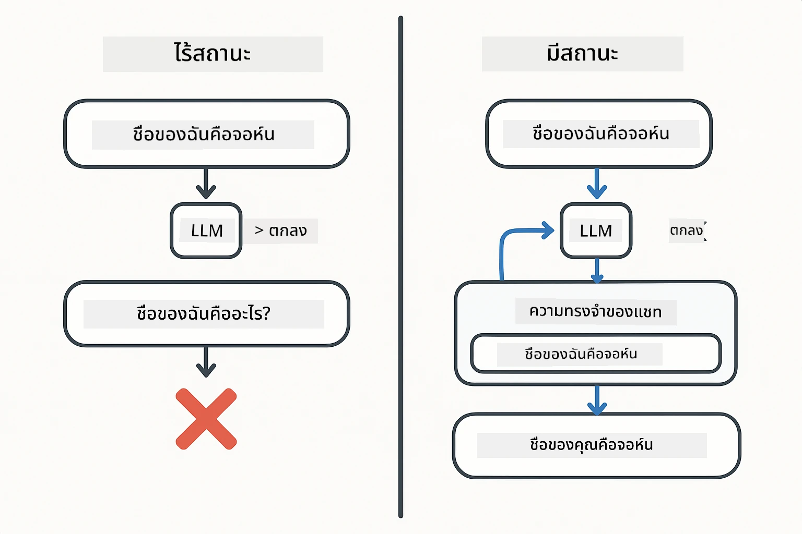
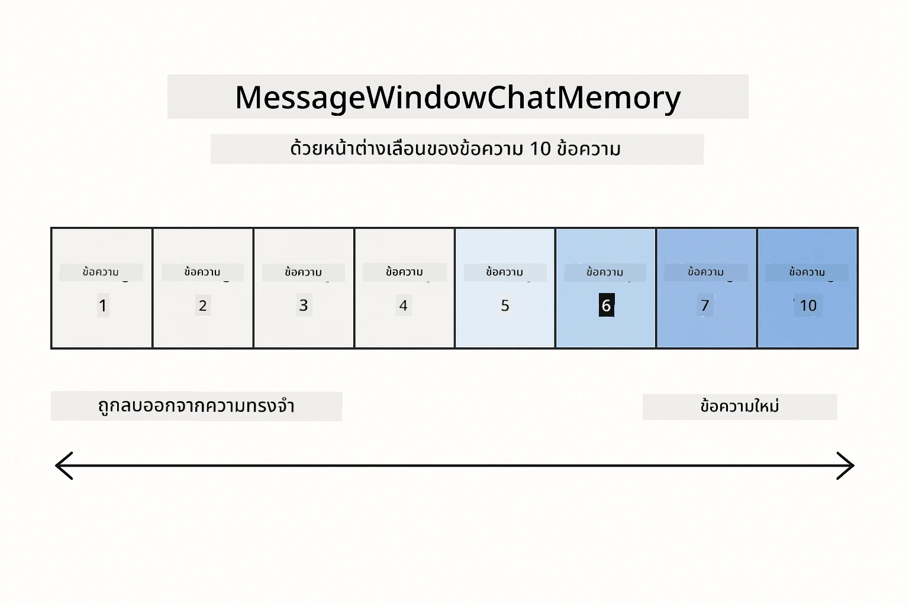
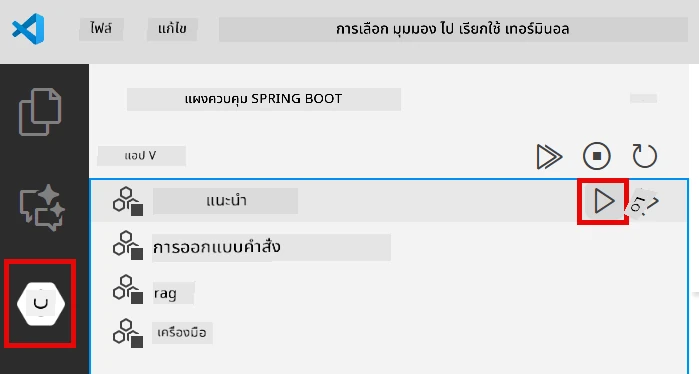
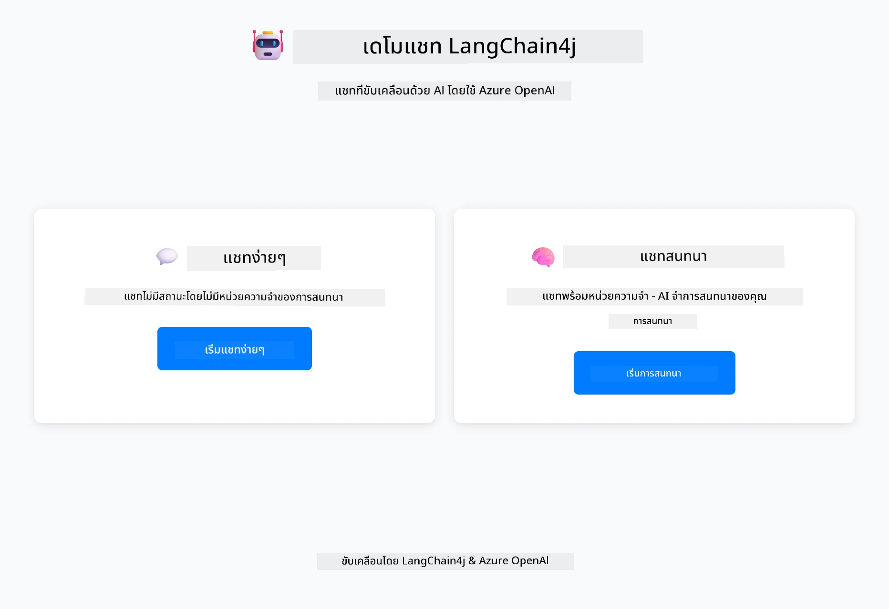
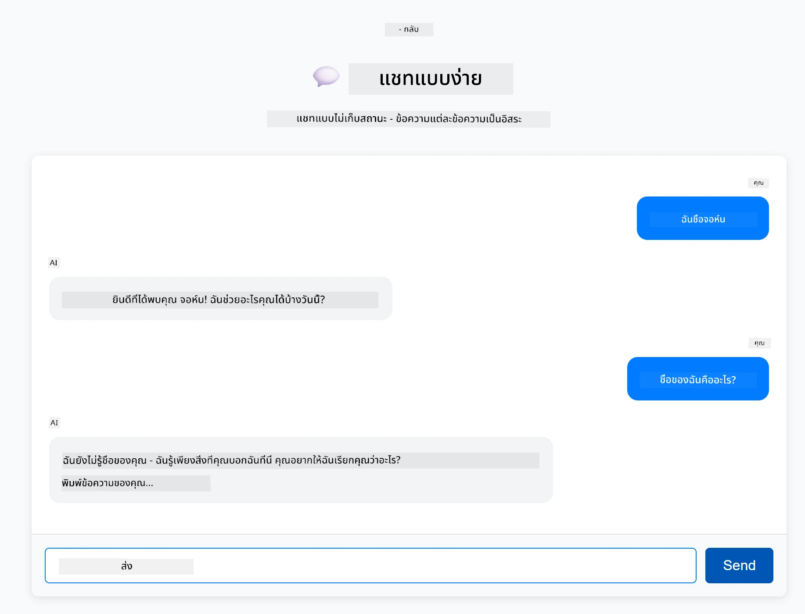
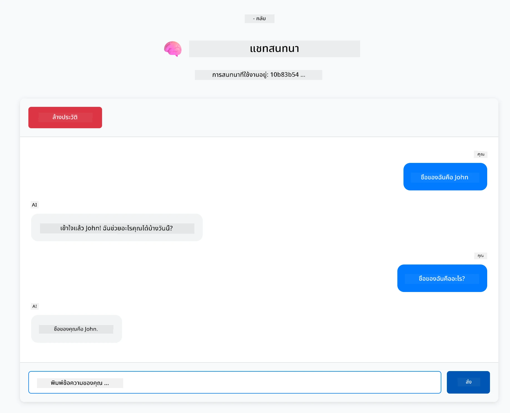

# Module 01: เริ่มต้นกับ LangChain4j

## สารบัญ

- [สิ่งที่คุณจะได้เรียนรู้](../../../01-introduction)
- [ข้อกำหนดเบื้องต้น](../../../01-introduction)
- [ทำความเข้าใจปัญหาหลัก](../../../01-introduction)
- [ทำความเข้าใจโทเค็น](../../../01-introduction)
- [การทำงานของหน่วยความจำ](../../../01-introduction)
- [การใช้งาน LangChain4j ในที่นี้](../../../01-introduction)
- [ปรับใช้โครงสร้างพื้นฐาน Azure OpenAI](../../../01-introduction)
- [รันแอปพลิเคชันในเครื่อง](../../../01-introduction)
- [การใช้งานแอปพลิเคชัน](../../../01-introduction)
  - [แชทแบบไม่มีสถานะ (แผงซ้าย)](../../../01-introduction)
  - [แชทแบบมีสถานะ (แผงขวา)](../../../01-introduction)
- [ขั้นตอนถัดไป](../../../01-introduction)

## สิ่งที่คุณจะได้เรียนรู้

ถ้าคุณทำตาม quick start เสร็จแล้ว คุณจะเห็นวิธีส่ง prompt และรับคำตอบ นั่นคือพื้นฐาน แต่แอปพลิเคชันจริงต้องการมากกว่านั้น โมดูลนี้จะสอนวิธีสร้าง AI สนทนาที่จดจำบริบทและรักษาสถานะ — ความแตกต่างระหว่างเดโมครั้งเดียวกับแอปพลิเคชันที่พร้อมใช้งานจริง

เราจะใช้ GPT-5 ของ Azure OpenAI ตลอดคำแนะนำนี้ เพราะความสามารถในการให้เหตุผลขั้นสูงช่วยให้เห็นพฤติกรรมของรูปแบบต่างๆ ชัดเจนขึ้น เมื่อคุณเพิ่มหน่วยความจำ คุณจะเห็นความแตกต่างอย่างชัดเจน ซึ่งช่วยให้เข้าใจว่าส่วนประกอบแต่ละอย่างนำอะไรมาให้แอปพลิเคชันของคุณ

คุณจะสร้างแอปพลิเคชันหนึ่งตัวที่แสดงทั้งสองรูปแบบ:

**แชทแบบไม่มีสถานะ** - แต่ละคำขอเป็นอิสระ โมเดลไม่มีหน่วยความจำของข้อความก่อนหน้า นี่คือรูปแบบที่คุณใช้ใน quick start

**สนทนาแบบมีสถานะ** - แต่ละคำขอรวมประวัติการสนทนา โมเดลรักษาบริบทข้ามหลายรอบ นี่คือสิ่งที่แอปพลิเคชันในงานจริงต้องการ

## ข้อกำหนดเบื้องต้น

- บัญชี Azure ที่มีสิทธิ์เข้าถึง Azure OpenAI
- Java 21, Maven 3.9+
- Azure CLI (https://learn.microsoft.com/en-us/cli/azure/install-azure-cli)
- Azure Developer CLI (azd) (https://learn.microsoft.com/en-us/azure/developer/azure-developer-cli/install-azd)

> **หมายเหตุ:** Java, Maven, Azure CLI และ Azure Developer CLI (azd) ติดตั้งไว้ล่วงหน้าใน devcontainer ที่ให้มา

> **หมายเหตุ:** โมดูลนี้ใช้ GPT-5 บน Azure OpenAI การปรับใช้ถูกตั้งค่าอัตโนมัติผ่าน `azd up` — ห้ามแก้ไขชื่อโมเดลในโค้ด

## ทำความเข้าใจปัญหาหลัก

โมเดลภาษาไม่มีสถานะ การเรียก API แต่ละครั้งเป็นอิสระ หากคุณส่ง "My name is John" แล้วถาม "What's my name?" โมเดลจะไม่รู้ว่าคุณเพิ่งแนะนำตัว มันปฏิบัติต่อทุกคำขอเหมือนเป็นการสนทนาแรกที่คุณเคยมี

สิ่งนี้ใช้ได้กับคำถาม-คำตอบง่ายๆ แต่ไร้ประโยชน์สำหรับแอปจริง บอทบริการลูกค้าต้องจำสิ่งที่คุณบอก ผู้ช่วยส่วนตัวต้องมีบริบท การสนทนาหลายรอบต้องการหน่วยความจำ



*ความแตกต่างระหว่างการสนทนาแบบไม่มีสถานะ (เรียกอิสระ) กับแบบมีสถานะ (รับรู้บริบท)*

## ทำความเข้าใจโทเค็น

ก่อนเข้าสู่การสนทนา สิ่งสำคัญคือต้องเข้าใจโทเค็น — หน่วยพื้นฐานของข้อความที่โมเดลภาษาประมวลผล:


*ตัวอย่างการแบ่งข้อความเป็นโทเค็น — "I love AI!" กลายเป็นหน่วยประมวลผลแยก 4 หน่วย*

โทเค็นคือวิธีที่โมเดล AI วัดและประมวลผลข้อความ คำ เครื่องหมายวรรคตอน และแม้แต่ช่องว่างก็เป็นโทเค็น โมเดลของคุณมีขีดจำกัดจำนวนโทเค็นที่ประมวลผลได้ในครั้งเดียว (400,000 สำหรับ GPT-5 โดยมีโทเค็นนำเข้าได้สูงสุด 272,000 และโทเค็นส่งออก 128,000) การเข้าใจโทเค็นช่วยให้คุณจัดการความยาวการสนทนาและค่าใช้จ่ายได้

## การทำงานของหน่วยความจำ

หน่วยความจำแชทแก้ปัญหาไม่มีสถานะโดยการเก็บประวัติการสนทนา ก่อนส่งคำขอไปยังโมเดล เฟรมเวิร์กจะเพิ่มข้อความก่อนหน้าที่เกี่ยวข้องเข้าไป เมื่อคุณถาม "What's my name?" ระบบจะส่งประวัติการสนทนาทั้งหมด ทำให้โมเดลเห็นว่าคุณเคยบอกว่า "My name is John" มาก่อน

LangChain4j มีการใช้งานหน่วยความจำที่จัดการเรื่องนี้โดยอัตโนมัติ คุณเลือกจำนวนข้อความที่จะเก็บไว้ และเฟรมเวิร์กจะจัดการหน้าต่างบริบทให้



*MessageWindowChatMemory รักษาหน้าต่างเลื่อนของข้อความล่าสุด โดยลบข้อความเก่าออกโดยอัตโนมัติ*

## การใช้งาน LangChain4j ในที่นี้

โมดูลนี้ขยาย quick start โดยผสานรวม Spring Boot และเพิ่มหน่วยความจำสนทนา นี่คือวิธีที่ส่วนประกอบต่างๆ ทำงานร่วมกัน:

**Dependencies** — เพิ่มไลบรารี LangChain4j สองตัว:

```xml
<dependency>
    <groupId>dev.langchain4j</groupId>
    <artifactId>langchain4j</artifactId> <!-- Inherited from BOM in root pom.xml -->
</dependency>
<dependency>
    <groupId>dev.langchain4j</groupId>
    <artifactId>langchain4j-open-ai-official</artifactId> <!-- Inherited from BOM in root pom.xml -->
</dependency>
```

**Chat Model** — กำหนดค่า Azure OpenAI เป็น Spring bean ([LangChainConfig.java](../../../01-introduction/src/main/java/com/example/langchain4j/config/LangChainConfig.java)):

```java
@Bean
public OpenAiOfficialChatModel openAiOfficialChatModel() {
    return OpenAiOfficialChatModel.builder()
            .baseUrl(azureEndpoint)
            .apiKey(azureApiKey)
            .modelName(deploymentName)
            .timeout(Duration.ofMinutes(5))
            .maxRetries(3)
            .build();
}
```

ตัวสร้างอ่านข้อมูลรับรองจากตัวแปรสภาพแวดล้อมที่ตั้งค่าโดย `azd up` การตั้งค่า `baseUrl` เป็นจุดสิ้นสุด Azure ของคุณทำให้ไคลเอนต์ OpenAI ทำงานกับ Azure OpenAI ได้

**Conversation Memory** — ติดตามประวัติแชทด้วย MessageWindowChatMemory ([ConversationService.java](../../../01-introduction/src/main/java/com/example/langchain4j/service/ConversationService.java)):

```java
ChatMemory memory = MessageWindowChatMemory.withMaxMessages(10);

memory.add(UserMessage.from("My name is John"));
memory.add(AiMessage.from("Nice to meet you, John!"));

memory.add(UserMessage.from("What's my name?"));
AiMessage aiMessage = chatModel.chat(memory.messages()).aiMessage();
memory.add(aiMessage);
```

สร้างหน่วยความจำด้วย `withMaxMessages(10)` เพื่อเก็บข้อความล่าสุด 10 ข้อความ เพิ่มข้อความผู้ใช้และ AI ด้วยตัวห่อประเภท: `UserMessage.from(text)` และ `AiMessage.from(text)` ดึงประวัติด้วย `memory.messages()` และส่งไปยังโมเดล บริการเก็บหน่วยความจำแยกตาม ID การสนทนา ทำให้ผู้ใช้หลายคนสามารถแชทพร้อมกันได้

> **🤖 ลองใช้ [GitHub Copilot](https://github.com/features/copilot) Chat:** เปิด [`ConversationService.java`](../../../01-introduction/src/main/java/com/example/langchain4j/service/ConversationService.java) และถาม:
> - "MessageWindowChatMemory ตัดสินใจทิ้งข้อความใดเมื่อหน้าต่างเต็มอย่างไร?"
> - "ฉันสามารถสร้างที่เก็บหน่วยความจำแบบกำหนดเองโดยใช้ฐานข้อมูลแทนการเก็บในหน่วยความจำได้ไหม?"
> - "ฉันจะเพิ่มการสรุปเพื่อบีบอัดประวัติการสนทนาเก่าได้อย่างไร?"

จุดสิ้นสุดแชทแบบไม่มีสถานะข้ามหน่วยความจำทั้งหมด — แค่ `chatModel.chat(prompt)` เหมือน quick start จุดสิ้นสุดแบบมีสถานะเพิ่มข้อความลงในหน่วยความจำ ดึงประวัติ และรวมบริบทนั้นกับแต่ละคำขอ การกำหนดค่าโมเดลเหมือนกัน แต่รูปแบบต่างกัน

## ปรับใช้โครงสร้างพื้นฐาน Azure OpenAI

**Bash:**
```bash
cd 01-introduction
azd up  # เลือกการสมัครใช้งานและตำแหน่งที่ตั้ง (แนะนำ eastus2)
```

**PowerShell:**
```powershell
cd 01-introduction
azd up  # เลือกการสมัครใช้งานและตำแหน่งที่ตั้ง (แนะนำ eastus2)
```

> **หมายเหตุ:** หากพบข้อผิดพลาดหมดเวลารอ (`RequestConflict: Cannot modify resource ... provisioning state is not terminal`) ให้รัน `azd up` อีกครั้ง ทรัพยากร Azure อาจยังอยู่ระหว่างการจัดเตรียม และการลองใหม่จะช่วยให้การปรับใช้เสร็จสมบูรณ์เมื่อทรัพยากรเข้าสู่สถานะสิ้นสุด

สิ่งนี้จะ:
1. ปรับใช้ทรัพยากร Azure OpenAI พร้อมโมเดล GPT-5 และ text-embedding-3-small
2. สร้างไฟล์ `.env` อัตโนมัติในโฟลเดอร์โปรเจกต์ด้วยข้อมูลรับรอง
3. ตั้งค่าตัวแปรสภาพแวดล้อมที่จำเป็นทั้งหมด

**มีปัญหาการปรับใช้?** ดู [Infrastructure README](infra/README.md) สำหรับการแก้ไขปัญหาโดยละเอียด รวมถึงปัญหาชื่อโดเมนย่อยซ้ำ ขั้นตอนปรับใช้ด้วยตนเองใน Azure Portal และคำแนะนำการตั้งค่าโมเดล

**ตรวจสอบการปรับใช้สำเร็จ:**

**Bash:**
```bash
cat ../.env  # ควรแสดง AZURE_OPENAI_ENDPOINT, API_KEY, เป็นต้น
```

**PowerShell:**
```powershell
Get-Content ..\.env  # ควรแสดง AZURE_OPENAI_ENDPOINT, API_KEY, เป็นต้น
```

> **หมายเหตุ:** คำสั่ง `azd up` สร้างไฟล์ `.env` อัตโนมัติ หากต้องการอัปเดตภายหลัง คุณสามารถแก้ไขไฟล์ `.env` ด้วยตนเองหรือสร้างใหม่โดยรัน:
>
> **Bash:**
> ```bash
> cd ..
> bash .azd-env.sh
> ```
>
> **PowerShell:**
> ```powershell
> cd ..
> .\.azd-env.ps1
> ```

## รันแอปพลิเคชันในเครื่อง

**ตรวจสอบการปรับใช้:**

ตรวจสอบว่าไฟล์ `.env` อยู่ในไดเรกทอรีรากพร้อมข้อมูลรับรอง Azure:

**Bash:**
```bash
cat ../.env  # ควรแสดง AZURE_OPENAI_ENDPOINT, API_KEY, DEPLOYMENT
```

**PowerShell:**
```powershell
Get-Content ..\.env  # ควรแสดง AZURE_OPENAI_ENDPOINT, API_KEY, DEPLOYMENT
```

**เริ่มแอปพลิเคชัน:**

**ตัวเลือก 1: ใช้ Spring Boot Dashboard (แนะนำสำหรับผู้ใช้ VS Code)**

dev container มีส่วนขยาย Spring Boot Dashboard ซึ่งให้ส่วนติดต่อผู้ใช้แบบกราฟิกสำหรับจัดการแอป Spring Boot ทั้งหมด คุณจะพบใน Activity Bar ด้านซ้ายของ VS Code (มองหาไอคอน Spring Boot)

จาก Spring Boot Dashboard คุณสามารถ:
- ดูแอป Spring Boot ทั้งหมดใน workspace
- เริ่ม/หยุดแอปด้วยคลิกเดียว
- ดูบันทึกแอปแบบเรียลไทม์
- ตรวจสอบสถานะแอป

คลิกปุ่มเล่นข้าง "introduction" เพื่อเริ่มโมดูลนี้ หรือเริ่มทุกโมดูลพร้อมกัน



**ตัวเลือก 2: ใช้สคริปต์ shell**

เริ่มแอปเว็บทั้งหมด (โมดูล 01-04):

**Bash:**
```bash
cd ..  # จากไดเรกทอรีรูท
./start-all.sh
```

**PowerShell:**
```powershell
cd ..  # จากไดเรกทอรีรูท
.\start-all.ps1
```

หรือเริ่มแค่โมดูลนี้:

**Bash:**
```bash
cd 01-introduction
./start.sh
```

**PowerShell:**
```powershell
cd 01-introduction
.\start.ps1
```

ทั้งสองสคริปต์โหลดตัวแปรสภาพแวดล้อมจากไฟล์ `.env` ที่รากโปรเจกต์โดยอัตโนมัติ และจะสร้าง JAR หากยังไม่มี

> **หมายเหตุ:** หากคุณต้องการสร้างทุกโมดูลด้วยตนเองก่อนเริ่ม:
>
> **Bash:**
> ```bash
> cd ..  # Go to root directory
> mvn clean package -DskipTests
> ```
>
> **PowerShell:**
> ```powershell
> cd ..  # Go to root directory
> mvn clean package -DskipTests
> ```

เปิด http://localhost:8080 ในเบราว์เซอร์ของคุณ

**เพื่อหยุด:**

**Bash:**
```bash
./stop.sh  # โมดูลนี้เท่านั้น
# หรือ
cd .. && ./stop-all.sh  # ทุกโมดูล
```

**PowerShell:**
```powershell
.\stop.ps1  # โมดูลนี้เท่านั้น
# หรือ
cd ..; .\stop-all.ps1  # ทุกโมดูล
```

## การใช้งานแอปพลิเคชัน

แอปพลิเคชันมีอินเทอร์เฟซเว็บพร้อมแชทสองแบบวางข้างกัน



*แดชบอร์ดแสดงตัวเลือก Simple Chat (ไม่มีสถานะ) และ Conversational Chat (มีสถานะ)*

### แชทแบบไม่มีสถานะ (แผงซ้าย)

ลองอันนี้ก่อน ถามว่า "My name is John" แล้วถามทันทีว่า "What's my name?" โมเดลจะไม่จำเพราะแต่ละข้อความเป็นอิสระ นี่แสดงปัญหาหลักของการรวมโมเดลภาษาแบบพื้นฐาน — ไม่มีบริบทการสนทนา



*AI ไม่จำชื่อคุณจากข้อความก่อนหน้า*

### แชทแบบมีสถานะ (แผงขวา)

ลองลำดับเดียวกันที่นี่ ถามว่า "My name is John" แล้วถาม "What's my name?" คราวนี้มันจำได้ ความแตกต่างคือ MessageWindowChatMemory — มันเก็บประวัติการสนทนาและรวมไว้กับแต่ละคำขอ นี่คือวิธีที่ AI สนทนาในงานจริงทำงาน



*AI จำชื่อคุณจากการสนทนาก่อนหน้า*

ทั้งสองแผงใช้โมเดล GPT-5 เดียวกัน ความแตกต่างเพียงอย่างเดียวคือหน่วยความจำ ซึ่งทำให้เห็นชัดเจนว่าหน่วยความจำช่วยแอปพลิเคชันของคุณอย่างไรและทำไมจึงจำเป็นสำหรับกรณีใช้งานจริง

## ขั้นตอนถัดไป

**โมดูลถัดไป:** [02-prompt-engineering - การออกแบบ Prompt กับ GPT-5](../02-prompt-engineering/README.md)

---

**การนำทาง:** [← ก่อนหน้า: Module 00 - Quick Start](../00-quick-start/README.md) | [กลับสู่หน้าหลัก](../README.md) | [ถัดไป: Module 02 - Prompt Engineering →](../02-prompt-engineering/README.md)

---

<!-- CO-OP TRANSLATOR DISCLAIMER START -->
**ข้อจำกัดความรับผิดชอบ**:  
เอกสารนี้ได้รับการแปลโดยใช้บริการแปลภาษาอัตโนมัติ [Co-op Translator](https://github.com/Azure/co-op-translator) แม้เราจะพยายามให้ความถูกต้องสูงสุด แต่โปรดทราบว่าการแปลโดยอัตโนมัติอาจมีข้อผิดพลาดหรือความไม่ถูกต้อง เอกสารต้นฉบับในภาษาต้นทางถือเป็นแหล่งข้อมูลที่เชื่อถือได้ สำหรับข้อมูลที่สำคัญ ขอแนะนำให้ใช้บริการแปลโดยผู้เชี่ยวชาญมนุษย์ เราไม่รับผิดชอบต่อความเข้าใจผิดหรือการตีความผิดใด ๆ ที่เกิดจากการใช้การแปลนี้
<!-- CO-OP TRANSLATOR DISCLAIMER END -->