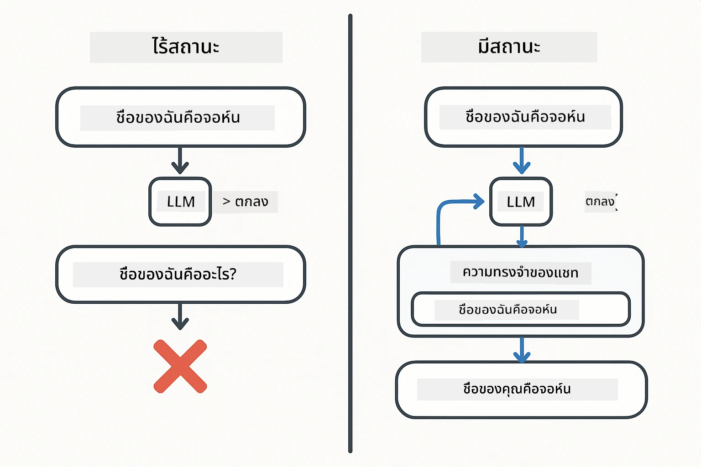
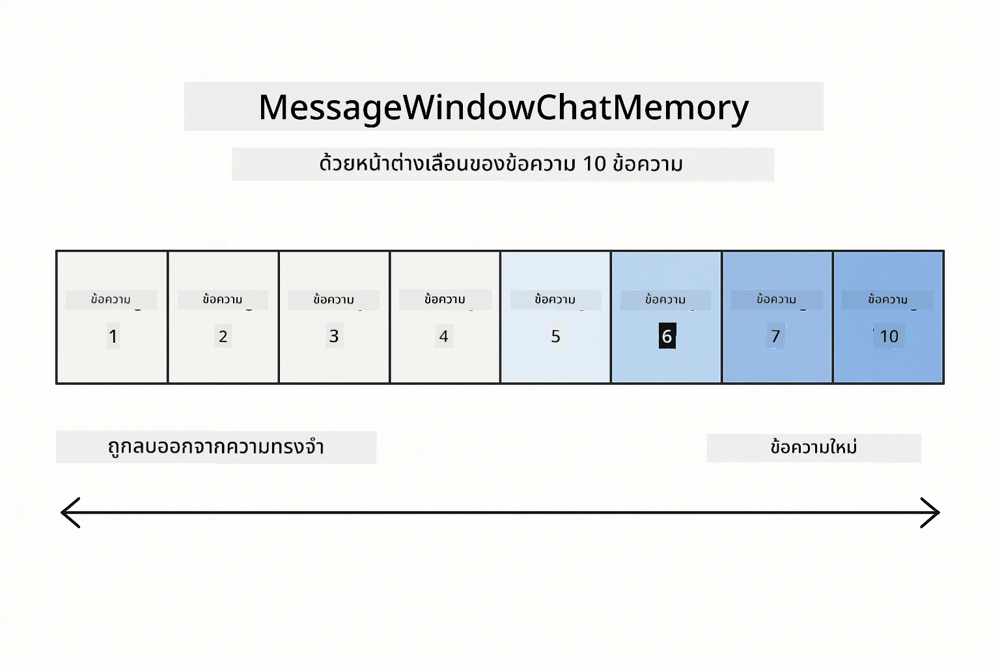
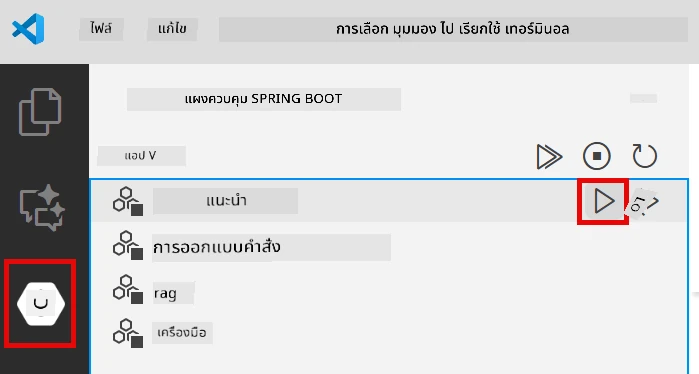
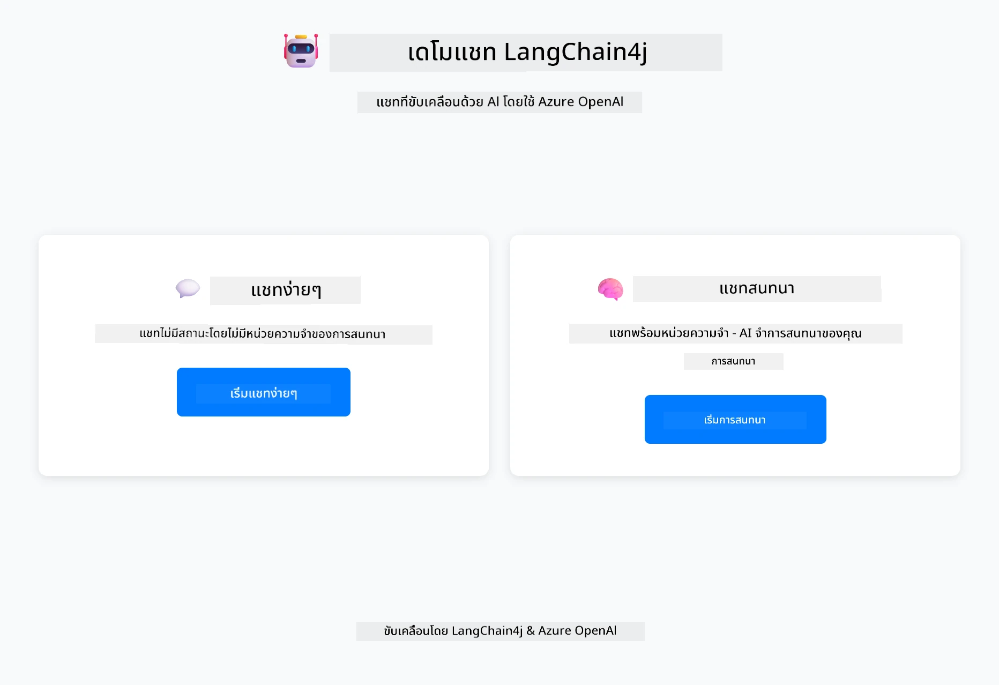
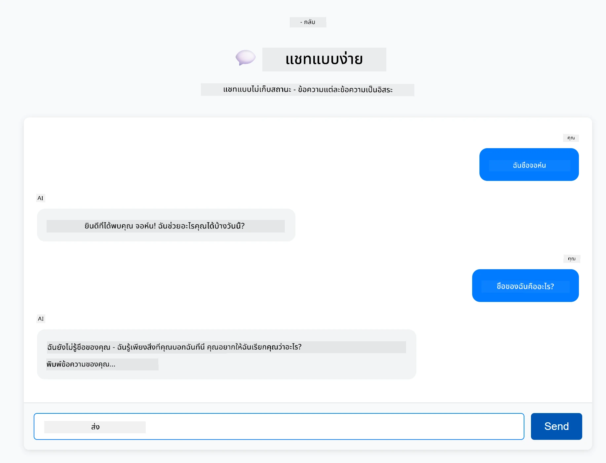
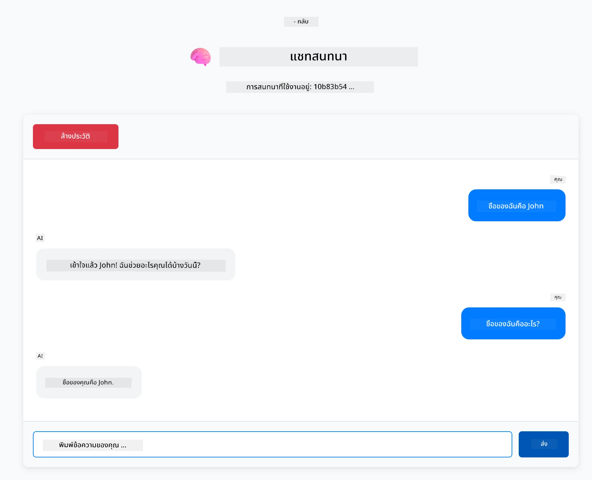

# Module 01: เริ่มต้นใช้งาน LangChain4j

##สารบัญ

- [วิดีโอสอนใช้งาน](#สิ่งที่คุณจะได้เรียนรู้)
- [สิ่งที่คุณจะได้เรียนรู้](#ข้อกำหนดเบื้องต้น)
- [ข้อกำหนดเบื้องต้น](#ทำความเข้าใจปัญหาหลัก)
- [ทำความเข้าใจปัญหาหลัก](#ทำความเข้าใจโทเค็น)
- [ทำความเข้าใจโทเค็น](#หน่วยความจำทำงานอย่างไร)
- [หน่วยความจำทำงานอย่างไร](#วิธีที่ใช้-langchain4j-นี้)
- [วิธีที่ใช้ LangChain4j นี้](#ปรับใช้โครงสร้างพื้นฐาน-azure-openai)
- [ปรับใช้โครงสร้างพื้นฐาน Azure OpenAI](#รันแอปพลิเคชันท้องถิ่น)
- [รันแอปพลิเคชันท้องถิ่น](#การใช้แอปพลิเคชัน)
- [การใช้แอปพลิเคชัน](#แชทแบบไม่มีสถานะ-แผงซ้าย)
  - [แชทแบบไม่มีสถานะ (แผงซ้าย)](#แชทแบบมีสถานะ-แผงขวา)
  - [แชทแบบมีสถานะ (แผงขวา)](#ขั้นตอนถัดไป)
- [ขั้นตอนถัดไป](#next-steps)

## วิดีโอสอนใช้งาน

รับชมเซสชันสดนี้ซึ่งอธิบายวิธีเริ่มต้นใช้งานโมดูลนี้:

<a href="https://www.youtube.com/live/nl_troDm8rQ?si=6b85S8xGjWnT2fX9"></a>

## สิ่งที่คุณจะได้เรียนรู้

นี่คือจุดเริ่มต้นของคุณกับ LangChain4j และ Azure OpenAI เราจะเริ่มจากพื้นฐานและเริ่มสร้างแอปพลิเคชันสไตล์การผลิต โมดูลนี้เน้นที่ AI การสนทนาที่จดจำบริบทและรักษาสถานะ — แนวคิดพื้นฐานที่โมดูลต่อๆ ไปจะสร้างขึ้นจากสิ่งนี้

เราจะใช้ GPT-5.2 ของ Azure OpenAI ตลอดคำแนะนำนี้ เพราะความสามารถในการเหตุผลขั้นสูงของมันทำให้พฤติกรรมของรูปแบบต่างๆ ชัดเจนขึ้น เมื่อคุณเพิ่มหน่วยความจำ คุณจะเห็นความแตกต่างได้อย่างชัดเจน ซึ่งช่วยให้เข้าใจองค์ประกอบแต่ละส่วนของแอปพลิเคชันได้ง่ายขึ้น

คุณจะสร้างแอปพลิเคชันหนึ่งตัวที่แสดงทั้งสองรูปแบบ:

**แชทแบบไม่มีสถานะ** - ทุกคำขอเป็นอิสระอย่างสมบูรณ์ โมเดลไม่มีหน่วยความจำของข้อความก่อนหน้า นี่คือจุดเริ่มต้นที่ง่ายที่สุด

**การสนทนาแบบมีสถานะ** - แต่ละคำขอรวมประวัติการสนทนา โมเดลรักษาบริบทตลอดหลายรอบ นี่คือสิ่งที่แอปพลิเคชันจริงในงานผลิตต้องการ

## ข้อกำหนดเบื้องต้น

- บัญชีสมาชิก Azure ที่เข้าถึง Azure OpenAI ได้
- Java 21, Maven 3.9+
- Azure CLI (https://learn.microsoft.com/en-us/cli/azure/install-azure-cli)
- Azure Developer CLI (azd) (https://learn.microsoft.com/en-us/azure/developer/azure-developer-cli/install-azd)

> **หมายเหตุ:** Java, Maven, Azure CLI และ Azure Developer CLI (azd) ได้ติดตั้งไว้ล่วงหน้าใน devcontainer ที่เตรียมไว้ให้แล้ว

> **หมายเหตุ:** โมดูลนี้ใช้ GPT-5.2 บน Azure OpenAI การปรับใช้ถูกกำหนดค่าจาก `azd up` โดยอัตโนมัติ — อย่าเปลี่ยนชื่อโมเดลในโค้ด

## ทำความเข้าใจปัญหาหลัก

โมเดลภาษาไม่มีสถานะ ทุกการเรียก API เป็นอิสระ หากคุณพิมพ์ว่า "My name is John" และถามว่า "What's my name?" โมเดลจะไม่ทราบว่าคุณเพิ่งแนะนำตัวเอง มันปฏิบัติต่อทุกคำขอเหมือนเป็นการสนทนาแรกที่คุณเคยมี

สิ่งนี้ใช้ได้ดีกับคำถามง่ายๆ แต่ไม่มีประโยชน์สำหรับแอปพลิเคชันจริงๆ หุ่นยนต์บริการลูกค้าต้องจำสิ่งที่คุณบอกให้พวกเขาทราบ ผู้ช่วยส่วนตัวต้องมีบริบท การสนทนาแบบหลายรอบต้องมีหน่วยความจำ

แผนภาพด้านล่างเปรียบเทียบสองวิธี — ทางซ้ายคือการเรียกแบบไม่มีสถานะที่ลืมชื่อคุณ และทางขวาคือการเรียกแบบมีสถานะที่ใช้ ChatMemory ซึ่งจดจำได้



*ความแตกต่างระหว่างการสนทนาแบบไม่มีสถานะ (เรียกอิสระ) และแบบมีสถานะ (รับรู้บริบท)*

## ทำความเข้าใจโทเค็น

ก่อนลงลึกในบทสนทนา จำเป็นต้องเข้าใจโทเค็น — หน่วยพื้นฐานของข้อความที่โมเดลภาษาใช้ประมวลผล:


*ตัวอย่างการแบ่งข้อความออกเป็นโทเค็น — "I love AI!" แบ่งเป็น 4 หน่วยประมวลผลแยกกัน*

โทเค็นคือวิธีที่โมเดล AI วัดและประมวลผลข้อความ คำ เครื่องหมายวรรคตอน และแม้แต่ช่องว่างสามารถเป็นโทเค็นได้ โมเดลของคุณมีจำกัดว่าประมวลผลโทเค็นได้กี่โทเค็นในครั้งเดียว (400,000 สำหรับ GPT-5.2 โดยมีโทเค็นนำเข้าได้สูงสุด 272,000 และโทเค็นส่งออก 128,000) การเข้าใจโทเค็นช่วยให้คุณจัดการความยาวบทสนทนาและค่าใช้จ่ายได้

## หน่วยความจำทำงานอย่างไร

หน่วยความจำช่วยแก้ปัญหาแบบไม่มีสถานะโดยเก็บประวัติการสนทนา ก่อนจะส่งคำขอไปยังโมเดล เฟรมเวิร์กจะเพิ่มข้อความก่อนหน้าที่เกี่ยวข้องเข้าไป เมื่อคุณถามว่า "What's my name?" ระบบจะส่งประวัติการสนทนาทั้งหมด ทำให้โมเดลเห็นว่าคุณเพิ่งบอกว่า "My name is John"

LangChain4j มีการใช้งานหน่วยความจำที่จัดการกระบวนการนี้โดยอัตโนมัติ คุณเลือกจำนวนข้อความที่เก็บไว้ เฟรมเวิร์กจะจัดการหน้าต่างบริบทให้ แผนภาพด้านล่างแสดงว่า MessageWindowChatMemory รักษาหน้าต่างเลื่อนของข้อความล่าสุดอย่างไร



*MessageWindowChatMemory รักษาหน้าต่างเลื่อนของข้อความล่าสุด โดยลบข้อความเก่าโดยอัตโนมัติ*

## วิธีที่ใช้ LangChain4j นี้

โมดูลนี้ผสานรวม Spring Boot และเพิ่มหน่วยความจำการสนทนา นี่คือวิธีที่ชิ้นส่วนต่างๆ ประสานกัน:

**Dependencies** - เพิ่มไลบรารี LangChain4j สองตัว:

```xml
<dependency>
    <groupId>dev.langchain4j</groupId>
    <artifactId>langchain4j</artifactId> <!-- Inherited from BOM in root pom.xml -->
</dependency>
<dependency>
    <groupId>dev.langchain4j</groupId>
    <artifactId>langchain4j-open-ai-official</artifactId> <!-- Inherited from BOM in root pom.xml -->
</dependency>
```
  
**Chat Model** - กำหนดค่า Azure OpenAI เป็น Spring bean ([LangChainConfig.java](../../../01-introduction/src/main/java/com/example/langchain4j/config/LangChainConfig.java)):

```java
@Bean
public OpenAiOfficialChatModel openAiOfficialChatModel() {
    return OpenAiOfficialChatModel.builder()
            .baseUrl(azureEndpoint)
            .apiKey(azureApiKey)
            .modelName(deploymentName)
            .timeout(Duration.ofMinutes(5))
            .maxRetries(3)
            .build();
}
```
  
Builder อ่านข้อมูลรับรองจากตัวแปรสภาพแวดล้อมที่ตั้งไว้โดย `azd up` การตั้งค่า `baseUrl` เป็น endpoint ของ Azure ทำให้ไคลเอนต์ OpenAI ทำงานกับ Azure OpenAI ได้

**หน่วยความจำการสนทนา** - ติดตามประวัติแชทด้วย MessageWindowChatMemory ([ConversationService.java](../../../01-introduction/src/main/java/com/example/langchain4j/service/ConversationService.java)):

```java
ChatMemory memory = MessageWindowChatMemory.withMaxMessages(10);

memory.add(UserMessage.from("My name is John"));
memory.add(AiMessage.from("Nice to meet you, John!"));

memory.add(UserMessage.from("What's my name?"));
AiMessage aiMessage = chatModel.chat(memory.messages()).aiMessage();
memory.add(aiMessage);
```
  
สร้างหน่วยความจำด้วย `withMaxMessages(10)` เพื่อเก็บข้อความล่าสุด 10 ข้อความ เพิ่มข้อความผู้ใช้และ AI ด้วยตัวห่อประเภท: `UserMessage.from(text)` และ `AiMessage.from(text)` ดึงประวัติด้วย `memory.messages()` และส่งไปยังโมเดล บริการเก็บตัวอย่างหน่วยความจำแยกกันสำหรับแต่ละรหัสการสนทนา ทำให้ผู้ใช้หลายคนแชทพร้อมกันได้

> **🤖 ลองใช้ [GitHub Copilot](https://github.com/features/copilot) Chat:** เปิด [`ConversationService.java`](../../../01-introduction/src/main/java/com/example/langchain4j/service/ConversationService.java) และถามว่า:
> - "MessageWindowChatMemory ตัดสินใจทิ้งข้อความไหนเมื่อหน้าต่างเต็มอย่างไร?"
> - "ฉันจะสร้างหน่วยความจำแบบกำหนดเองโดยใช้ฐานข้อมูลแทนเก็บในหน่วยความจำได้ไหม?"
> - "ฉันจะเพิ่มการสรุปเพื่อบีบอัดประวัติการสนทนาเก่าได้อย่างไร?"

จุดสิ้นสุดแชทแบบไม่มีสถานะจะข้ามหน่วยความจำโดยสมบูรณ์ — เพียงแค่ `chatModel.chat(prompt)` เหมือนเริ่มต้นอย่างรวดเร็ว จุดสิ้นสุดแบบมีสถานะจะเพิ่มข้อความลงในหน่วยความจำ ดึงประวัติ และใส่บริบทนั้นในแต่ละคำขอ การตั้งค่าโมเดลเหมือนกัน แต่รูปแบบต่างกัน

## ปรับใช้โครงสร้างพื้นฐาน Azure OpenAI

**Bash:**  
```bash
cd 01-introduction
azd up  # เลือกการสมัครใช้งานและตำแหน่งที่ตั้ง (แนะนำ eastus2)
```
  
**PowerShell:**  
```powershell
cd 01-introduction
azd up  # เลือกการสมัครสมาชิกและตำแหน่งที่ตั้ง (แนะนำ eastus2)
```
  
> **หมายเหตุ:** หากคุณพบข้อผิดพลาดหมดเวลารอ (`RequestConflict: Cannot modify resource ... provisioning state is not terminal`) ให้รัน `azd up` อีกครั้ง Azure อาจยังอยู่ระหว่างการจัดสรรทรัพยากรในพื้นหลัง การลองใหม่จะช่วยให้การปรับใช้เสร็จสมบูรณ์เมื่อทรัพยากรเข้าสู่สถานะสุดท้าย

สิ่งนี้จะ:
1. ปรับใช้ทรัพยากร Azure OpenAI ด้วยโมเดล GPT-5.2 และ text-embedding-3-small
2. สร้างไฟล์ `.env` ในโฟลเดอร์โปรเจกต์โดยอัตโนมัติพร้อมข้อมูลรับรอง
3. ตั้งค่าตัวแปรสภาพแวดล้อมทั้งหมดที่จำเป็น

**มีปัญหาเรื่องการปรับใช้?** ดูที่ [Infrastructure README](infra/README.md) สำหรับคำแนะนำขั้นตอนแก้ปัญหาอย่างละเอียด รวมถึงปัญหาชื่อโดเมนย่อยซ้ำ ขั้นตอนการปรับใช้ Azure Portal ด้วยตนเอง และแนวทางการตั้งค่าโมเดล

**ตรวจสอบว่า deployment สำเร็จ:**

**Bash:**  
```bash
cat ../.env  # ควรแสดง AZURE_OPENAI_ENDPOINT, API_KEY, เป็นต้น
```
  
**PowerShell:**  
```powershell
Get-Content ..\.env  # ควรแสดง AZURE_OPENAI_ENDPOINT, API_KEY, เป็นต้น
```
  
> **หมายเหตุ:** คำสั่ง `azd up` จะสร้างไฟล์ `.env` โดยอัตโนมัติ หากต้องแก้ไขทีหลัง คุณสามารถแก้ไขไฟล์ `.env` ด้วยตนเองหรือลองสร้างใหม่โดยรัน:
>  
> **Bash:**  
> ```bash
> cd ..
> bash .azd-env.sh
> ```
>  
> **PowerShell:**  
> ```powershell
> cd ..
> .\.azd-env.ps1
> ```
  
## รันแอปพลิเคชันท้องถิ่น

**ตรวจสอบการปรับใช้:**

ตรวจสอบว่าไฟล์ `.env` อยู่ในไดเรกทอรีหลักพร้อมข้อมูลรับรอง Azure รันคำสั่งนี้จากไดเรกทอรีโมดูล (`01-introduction/`):

**Bash:**  
```bash
cat ../.env  # ควรแสดง AZURE_OPENAI_ENDPOINT, API_KEY, DEPLOYMENT
```
  
**PowerShell:**  
```powershell
Get-Content ..\.env  # ควรแสดง AZURE_OPENAI_ENDPOINT, API_KEY, DEPLOYMENT
```
  
**เริ่มต้นแอปพลิเคชัน:**

**ตัวเลือกที่ 1: ใช้ Spring Boot Dashboard (แนะนำสำหรับผู้ใช้ VS Code)**

dev container รวมส่วนขยาย Spring Boot Dashboard ซึ่งให้ส่วนติดต่อผู้ใช้แบบกราฟิกสำหรับจัดการแอปพลิเคชัน Spring Boot ทั้งหมด คุณจะพบได้ใน Activity Bar ด้านซ้ายใน VS Code (ดูไอคอน Spring Boot)

จาก Spring Boot Dashboard คุณสามารถ:  
- ดูแอปพลิเคชัน Spring Boot ทั้งหมดใน workspace  
- เริ่ม/หยุดแอปพลิเคชันได้ด้วยคลิกเดียว  
- ดูบันทึกแอปพลิเคชันแบบเรียลไทม์  
- ตรวจสอบสถานะแอปพลิเคชัน

เพียงคลิกปุ่มเล่นข้างๆ "introduction" เพื่อเริ่มโมดูลนี้ หรือเริ่มโมดูลทั้งหมดพร้อมกัน



*Spring Boot Dashboard ใน VS Code — เริ่ม หยุด และตรวจสอบทุกโมดูลจากที่เดียว*

**ตัวเลือกที่ 2: ใช้สคริปต์เชลล์**

เริ่มแอปพลิเคชันเว็บทั้งหมด (โมดูล 01-04):

**Bash:**  
```bash
cd ..  # จากไดเรกทอรีรูท
./start-all.sh
```
  
**PowerShell:**  
```powershell
cd ..  # จากไดเรกทอรีราก
.\start-all.ps1
```
  
หรือเริ่มแค่โมดูลนี้:

**Bash:**  
```bash
cd 01-introduction
./start.sh
```
  
**PowerShell:**  
```powershell
cd 01-introduction
.\start.ps1
```
  
สคริปต์ทั้งสองโหลดตัวแปรสภาพแวดล้อมจากไฟล์ `.env` ที่โฟลเดอร์รากโดยอัตโนมัติ และจะสร้าง JAR หากยังไม่มี

> **หมายเหตุ:** หากคุณต้องการสร้างทุกโมดูลด้วยตนเองก่อนเริ่ม:
>  
> **Bash:**  
> ```bash
> cd ..  # Go to root directory
> mvn clean package -DskipTests
> ```
>  
> **PowerShell:**  
> ```powershell
> cd ..  # Go to root directory
> mvn clean package -DskipTests
> ```
  
เปิด http://localhost:8080 ในเบราว์เซอร์ของคุณ

**หยุดแอปพลิเคชัน:**

**Bash:**  
```bash
./stop.sh  # เฉพาะโมดูลนี้
# หรือ
cd .. && ./stop-all.sh  # ทุกโมดูล
```
  
**PowerShell:**  
```powershell
.\stop.ps1  # โมดูลนี้เท่านั้น
# หรือ
cd ..; .\stop-all.ps1  # ทุกโมดูล
```
  
## การใช้แอปพลิเคชัน

แอปพลิเคชันมีส่วนติดต่อเว็บที่แสดงสองระบบแชทขนานกัน



*แดชบอร์ดแสดงตัวเลือกแชทง่าย (ไม่มีสถานะ) และแชทแบบสนทนา (มีสถานะ)*

### แชทแบบไม่มีสถานะ (แผงซ้าย)

ลองอันนี้ก่อน พิมพ์ "My name is John" แล้วถามทันทีว่า "What's my name?" โมเดลจะไม่จำเพราะแต่ละข้อความแยกกัน แสดงปัญหาหลักของการรวมโมเดลภาษาอย่างง่าย — ไม่มีบริบทการสนทนา



*AI ไม่จำชื่อของคุณจากข้อความก่อนหน้า*

### แชทแบบมีสถานะ (แผงขวา)

ลองชุดคำสั่งเดียวกันนี้ที่นี่ พิมพ์ "My name is John" แล้วถาม "What's my name?" คราวนี้มันจำได้ ความต่างคือ MessageWindowChatMemory — มันเก็บประวัติการสนทนาและรวมเข้าไปกับทุกคำขอ นี่คือวิธีที่ AI สนทนาในระบบผลิตงานจริงทำงาน



*AI จำชื่อของคุณจากก่อนหน้านี้ในการสนทนา*

แผงทั้งสองใช้โมเดล GPT-5.2 ตัวเดียวกัน ต่างกันแค่หน่วยความจำ ซึ่งช่วยให้เห็นภาพชัดเจนว่าหน่วยความจำมีประโยชน์อย่างไรกับแอปพลิเคชันของคุณและเหตุใดจึงจำเป็นสำหรับการใช้งานจริง

## ขั้นตอนถัดไป

**โมดูลถัดไป:** [02-prompt-engineering - การออกแบบ Prompt ด้วย GPT-5.2](../02-prompt-engineering/README.md)

---

**การนำทาง:** [← กลับไปหน้าแรก](../README.md) | [ถัดไป: Module 02 - Prompt Engineering →](../02-prompt-engineering/README.md)

---

<!-- CO-OP TRANSLATOR DISCLAIMER START -->
**ปฏิเสธความรับผิดชอบ**:
เอกสารนี้ได้รับการแปลโดยใช้บริการแปลภาษา AI [Co-op Translator](https://github.com/Azure/co-op-translator) ขณะที่เราพยายามให้ความถูกต้อง โปรดทราบว่าการแปลโดยอัตโนมัติอาจมีข้อผิดพลาดหรือความไม่ถูกต้อง เอกสารต้นฉบับในภาษาต้นทางควรถูกพิจารณาเป็นแหล่งข้อมูลที่เชื่อถือได้ สำหรับข้อมูลที่สำคัญ แนะนำให้ใช้การแปลโดยมนุษย์มืออาชีพ เราไม่รับผิดชอบต่อความเข้าใจผิดหรือการตีความที่ผิดพลาดที่เกิดขึ้นจากการใช้การแปลนี้
<!-- CO-OP TRANSLATOR DISCLAIMER END -->