<!--
CO_OP_TRANSLATOR_METADATA:
{
  "original_hash": "8d787826cad7e92bf5cdbd116b1e6116",
  "translation_date": "2025-12-13T16:09:52+00:00",
  "source_file": "02-prompt-engineering/README.md",
  "language_code": "th"
}
-->
# Module 02: การออกแบบคำสั่งกับ GPT-5

## สารบัญ

- [สิ่งที่คุณจะได้เรียนรู้](../../../02-prompt-engineering)
- [ข้อกำหนดเบื้องต้น](../../../02-prompt-engineering)
- [ทำความเข้าใจการออกแบบคำสั่ง](../../../02-prompt-engineering)
- [วิธีการใช้ LangChain4j ในโมดูลนี้](../../../02-prompt-engineering)
- [รูปแบบหลัก](../../../02-prompt-engineering)
- [การใช้ทรัพยากร Azure ที่มีอยู่](../../../02-prompt-engineering)
- [ภาพหน้าจอแอปพลิเคชัน](../../../02-prompt-engineering)
- [สำรวจรูปแบบต่างๆ](../../../02-prompt-engineering)
  - [ความกระตือรือร้นต่ำ vs สูง](../../../02-prompt-engineering)
  - [การดำเนินงานตามงาน (คำแนะนำเครื่องมือ)](../../../02-prompt-engineering)
  - [โค้ดที่สะท้อนตนเอง](../../../02-prompt-engineering)
  - [การวิเคราะห์แบบมีโครงสร้าง](../../../02-prompt-engineering)
  - [แชทหลายรอบ](../../../02-prompt-engineering)
  - [การให้เหตุผลทีละขั้นตอน](../../../02-prompt-engineering)
  - [ผลลัพธ์ที่ถูกจำกัด](../../../02-prompt-engineering)
- [สิ่งที่คุณกำลังเรียนรู้อย่างแท้จริง](../../../02-prompt-engineering)
- [ขั้นตอนถัดไป](../../../02-prompt-engineering)

## สิ่งที่คุณจะได้เรียนรู้

ในโมดูลก่อนหน้านี้ คุณได้เห็นว่าหน่วยความจำช่วยให้ AI สนทนาได้อย่างไร และใช้ GitHub Models สำหรับการโต้ตอบพื้นฐาน ตอนนี้เราจะมุ่งเน้นที่วิธีการตั้งคำถาม — คำสั่ง (prompt) เอง — โดยใช้ GPT-5 ของ Azure OpenAI วิธีที่คุณจัดโครงสร้างคำสั่งมีผลอย่างมากต่อคุณภาพของคำตอบที่ได้รับ

เราจะใช้ GPT-5 เพราะมันเพิ่มการควบคุมการให้เหตุผล — คุณสามารถบอกโมเดลได้ว่าจะคิดมากน้อยแค่ไหนก่อนตอบ นี่ทำให้กลยุทธ์การตั้งคำสั่งต่างๆ ชัดเจนขึ้นและช่วยให้คุณเข้าใจว่าเมื่อใดควรใช้วิธีใด นอกจากนี้เรายังได้ประโยชน์จากข้อจำกัดอัตราการใช้งานที่น้อยกว่าของ Azure สำหรับ GPT-5 เมื่อเทียบกับ GitHub Models

## ข้อกำหนดเบื้องต้น

- ผ่านโมดูล 01 แล้ว (ทรัพยากร Azure OpenAI ถูกติดตั้งแล้ว)
- ไฟล์ `.env` ในไดเรกทอรีหลักที่มีข้อมูลรับรอง Azure (สร้างโดย `azd up` ในโมดูล 01)

> **หมายเหตุ:** หากคุณยังไม่ผ่านโมดูล 01 กรุณาทำตามคำแนะนำการติดตั้งในโมดูลนั้นก่อน

## ทำความเข้าใจการออกแบบคำสั่ง

การออกแบบคำสั่งคือการออกแบบข้อความป้อนเข้าที่ทำให้คุณได้ผลลัพธ์ที่ต้องการอย่างสม่ำเสมอ มันไม่ใช่แค่การตั้งคำถาม — แต่เป็นการจัดโครงสร้างคำขอเพื่อให้โมเดลเข้าใจอย่างชัดเจนว่าคุณต้องการอะไรและจะส่งมอบอย่างไร

คิดเหมือนกับการให้คำแนะนำเพื่อนร่วมงาน "แก้บั๊ก" นั้นคลุมเครือ แต่ "แก้ข้อผิดพลาด null pointer ใน UserService.java บรรทัดที่ 45 โดยเพิ่มการตรวจสอบ null" นั้นชัดเจน โมเดลภาษาใช้หลักการเดียวกัน — ความเฉพาะเจาะจงและโครงสร้างมีความสำคัญ

## วิธีการใช้ LangChain4j ในโมดูลนี้

โมดูลนี้แสดงรูปแบบการตั้งคำสั่งขั้นสูงโดยใช้พื้นฐาน LangChain4j เดิมจากโมดูลก่อนหน้า โดยเน้นที่โครงสร้างคำสั่งและการควบคุมการให้เหตุผล


*วิธีที่ LangChain4j เชื่อมต่อคำสั่งของคุณกับ Azure OpenAI GPT-5*

**การพึ่งพา** - โมดูล 02 ใช้การพึ่งพา langchain4j ดังต่อไปนี้ที่กำหนดใน `pom.xml`:
```xml
<dependency>
    <groupId>dev.langchain4j</groupId>
    <artifactId>langchain4j</artifactId> <!-- Inherited from BOM in root pom.xml -->
</dependency>
<dependency>
    <groupId>dev.langchain4j</groupId>
    <artifactId>langchain4j-open-ai-official</artifactId> <!-- Inherited from BOM in root pom.xml -->
</dependency>
```

**การตั้งค่า OpenAiOfficialChatModel** - [LangChainConfig.java](../../../02-prompt-engineering/src/main/java/com/example/langchain4j/prompts/config/LangChainConfig.java)

โมเดลแชทถูกตั้งค่าเป็น Spring bean ด้วยตนเองโดยใช้ไคลเอนต์ OpenAI Official ซึ่งรองรับจุดเชื่อมต่อ Azure OpenAI ความแตกต่างหลักจากโมดูล 01 คือวิธีที่เราจัดโครงสร้างคำสั่งที่ส่งไปยัง `chatModel.chat()` ไม่ใช่การตั้งค่าโมเดลเอง

**ข้อความระบบและผู้ใช้** - [Gpt5PromptService.java](../../../02-prompt-engineering/src/main/java/com/example/langchain4j/prompts/service/Gpt5PromptService.java)

LangChain4j แยกประเภทข้อความเพื่อความชัดเจน `SystemMessage` กำหนดพฤติกรรมและบริบทของ AI (เช่น "คุณเป็นผู้ตรวจสอบโค้ด") ขณะที่ `UserMessage` มีคำขอจริง การแยกนี้ช่วยให้คุณรักษาพฤติกรรม AI ที่สม่ำเสมอในคำถามของผู้ใช้ต่างๆ

```java
SystemMessage systemMsg = SystemMessage.from(
    "You are a helpful Java programming expert."
);

UserMessage userMsg = UserMessage.from(
    "Explain what a List is in Java"
);

String response = chatModel.chat(systemMsg, userMsg);
```

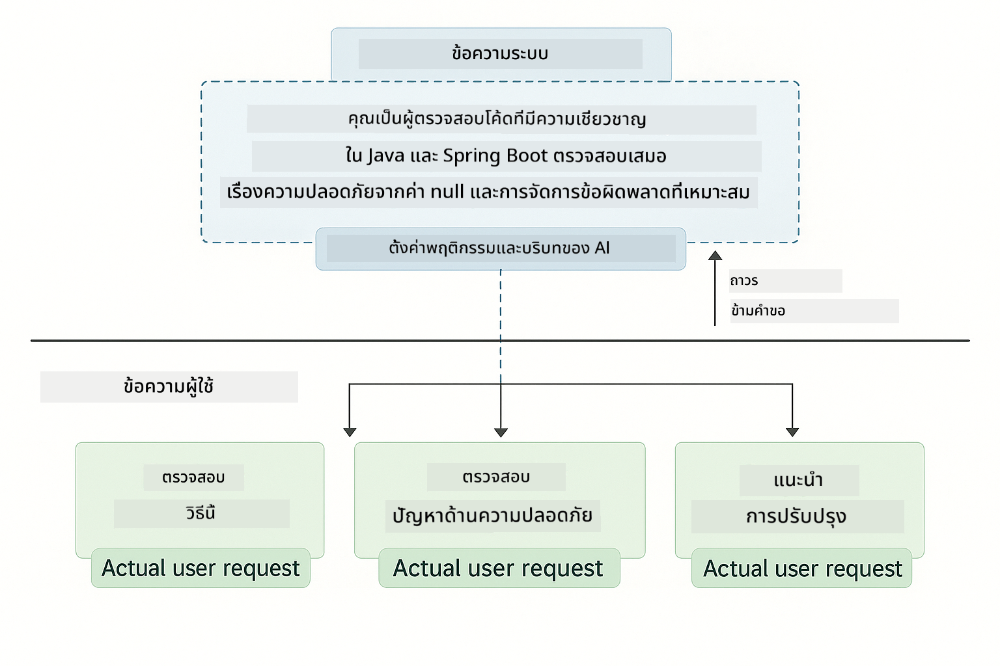

*SystemMessage ให้บริบทถาวรในขณะที่ UserMessages มีคำขอแต่ละรายการ*

**MessageWindowChatMemory สำหรับการสนทนาหลายรอบ** - สำหรับรูปแบบการสนทนาหลายรอบ เราใช้ `MessageWindowChatMemory` จากโมดูล 01 ซ้ำ แต่ละเซสชันจะมีอินสแตนซ์หน่วยความจำของตัวเองเก็บไว้ใน `Map<String, ChatMemory>` ทำให้สามารถสนทนาหลายรายการพร้อมกันโดยไม่ปะปนบริบท

**เทมเพลตคำสั่ง** - จุดเน้นจริงๆ คือการออกแบบคำสั่ง ไม่ใช่ API ใหม่ของ LangChain4j รูปแบบแต่ละแบบ (ความกระตือรือร้นต่ำ, สูง, การดำเนินงานตามงาน ฯลฯ) ใช้วิธี `chatModel.chat(prompt)` เดียวกันแต่ด้วยสตริงคำสั่งที่จัดโครงสร้างอย่างระมัดระวัง แท็ก XML คำแนะนำ และรูปแบบทั้งหมดเป็นส่วนหนึ่งของข้อความคำสั่ง ไม่ใช่ฟีเจอร์ของ LangChain4j

**การควบคุมการให้เหตุผล** - ความพยายามในการให้เหตุผลของ GPT-5 ถูกควบคุมผ่านคำแนะนำในคำสั่ง เช่น "สูงสุด 2 ขั้นตอนการให้เหตุผล" หรือ "สำรวจอย่างละเอียด" เทคนิคเหล่านี้เป็นเทคนิคการออกแบบคำสั่ง ไม่ใช่การตั้งค่าของ LangChain4j ไลบรารีเพียงแค่ส่งคำสั่งของคุณไปยังโมเดล

ข้อสรุปสำคัญ: LangChain4j ให้โครงสร้างพื้นฐาน (การเชื่อมต่อโมเดลผ่าน [LangChainConfig.java](../../../02-prompt-engineering/src/main/java/com/example/langchain4j/prompts/config/LangChainConfig.java), หน่วยความจำ, การจัดการข้อความผ่าน [Gpt5PromptService.java](../../../02-prompt-engineering/src/main/java/com/example/langchain4j/prompts/service/Gpt5PromptService.java)) ขณะที่โมดูลนี้สอนวิธีสร้างคำสั่งที่มีประสิทธิภาพภายในโครงสร้างนั้น

## รูปแบบหลัก

ไม่ใช่ทุกปัญหาที่ต้องใช้วิธีเดียวกัน บางคำถามต้องการคำตอบเร็ว บางคำถามต้องการการคิดลึก บางคำถามต้องการการให้เหตุผลที่มองเห็นได้ บางคำถามต้องการแค่ผลลัพธ์ โมดูลนี้ครอบคลุมแปดรูปแบบการตั้งคำสั่ง — แต่ละแบบเหมาะกับสถานการณ์ต่างกัน คุณจะได้ทดลองทั้งหมดเพื่อเรียนรู้ว่าแต่ละวิธีเหมาะกับเมื่อใด


*ภาพรวมของแปดรูปแบบการออกแบบคำสั่งและกรณีการใช้งาน*


*ความกระตือรือร้นต่ำ (เร็ว ตรงไปตรงมา) vs ความกระตือรือร้นสูง (ละเอียด รอบคอบ) ในการให้เหตุผล*

**ความกระตือรือร้นต่ำ (เร็ว & เน้นตรงจุด)** - สำหรับคำถามง่ายๆ ที่คุณต้องการคำตอบเร็วและตรงไปตรงมา โมเดลจะให้เหตุผลน้อยที่สุด — สูงสุด 2 ขั้นตอน ใช้สำหรับการคำนวณ การค้นหา หรือคำถามตรงๆ

```java
String prompt = """
    <reasoning_effort>low</reasoning_effort>
    <instruction>maximum 2 reasoning steps</instruction>
    
    What is 15% of 200?
    """;

String response = chatModel.chat(prompt);
```

> 💡 **สำรวจด้วย GitHub Copilot:** เปิด [`Gpt5PromptService.java`](../../../02-prompt-engineering/src/main/java/com/example/langchain4j/prompts/service/Gpt5PromptService.java) และถาม:
> - "ความแตกต่างระหว่างรูปแบบความกระตือรือร้นต่ำและสูงคืออะไร?"
> - "แท็ก XML ในคำสั่งช่วยจัดโครงสร้างคำตอบของ AI อย่างไร?"
> - "เมื่อใดควรใช้รูปแบบสะท้อนตนเองกับคำสั่งตรงๆ?"

**ความกระตือรือร้นสูง (ลึก & รอบคอบ)** - สำหรับปัญหาซับซ้อนที่ต้องการการวิเคราะห์อย่างละเอียด โมเดลจะสำรวจอย่างละเอียดและแสดงเหตุผลอย่างละเอียด ใช้สำหรับการออกแบบระบบ การตัดสินใจสถาปัตยกรรม หรือการวิจัยที่ซับซ้อน

```java
String prompt = """
    <reasoning_effort>high</reasoning_effort>
    <instruction>explore thoroughly, show detailed reasoning</instruction>
    
    Design a caching strategy for a high-traffic REST API.
    """;

String response = chatModel.chat(prompt);
```

**การดำเนินงานตามงาน (ความก้าวหน้าทีละขั้นตอน)** - สำหรับเวิร์กโฟลว์หลายขั้นตอน โมเดลจะให้แผนล่วงหน้า บรรยายแต่ละขั้นตอนขณะทำงาน แล้วสรุป ใช้สำหรับการย้ายระบบ การใช้งาน หรือกระบวนการหลายขั้นตอน

```java
String prompt = """
    <task>Create a REST endpoint for user registration</task>
    <preamble>Provide an upfront plan</preamble>
    <narration>Narrate each step as you work</narration>
    <summary>Summarize what was accomplished</summary>
    """;

String response = chatModel.chat(prompt);
```

การตั้งคำสั่งแบบ Chain-of-Thought ขอให้โมเดลแสดงกระบวนการให้เหตุผลของมันอย่างชัดเจน ช่วยเพิ่มความแม่นยำสำหรับงานซับซ้อน การแยกขั้นตอนช่วยให้ทั้งมนุษย์และ AI เข้าใจตรรกะ

> **🤖 ลองใช้ [GitHub Copilot](https://github.com/features/copilot) Chat:** ถามเกี่ยวกับรูปแบบนี้:
> - "ฉันจะปรับรูปแบบการดำเนินงานตามงานสำหรับงานที่ใช้เวลานานอย่างไร?"
> - "แนวทางปฏิบัติที่ดีที่สุดสำหรับการจัดโครงสร้างคำแนะนำเครื่องมือในแอปพลิเคชันจริงคืออะไร?"
> - "ฉันจะจับและแสดงความคืบหน้าระหว่างขั้นตอนใน UI ได้อย่างไร?"


*แผน → ดำเนินการ → สรุปเวิร์กโฟลว์สำหรับงานหลายขั้นตอน*

**โค้ดที่สะท้อนตนเอง** - สำหรับการสร้างโค้ดคุณภาพระดับผลิต โมเดลจะสร้างโค้ด ตรวจสอบตามเกณฑ์คุณภาพ และปรับปรุงอย่างต่อเนื่อง ใช้เมื่อสร้างฟีเจอร์หรือบริการใหม่

```java
String prompt = """
    <task>Create an email validation service</task>
    <quality_criteria>
    - Correct logic and error handling
    - Best practices (clean code, proper naming)
    - Performance optimization
    - Security considerations
    </quality_criteria>
    <instruction>Generate code, evaluate against criteria, improve iteratively</instruction>
    """;

String response = chatModel.chat(prompt);
```

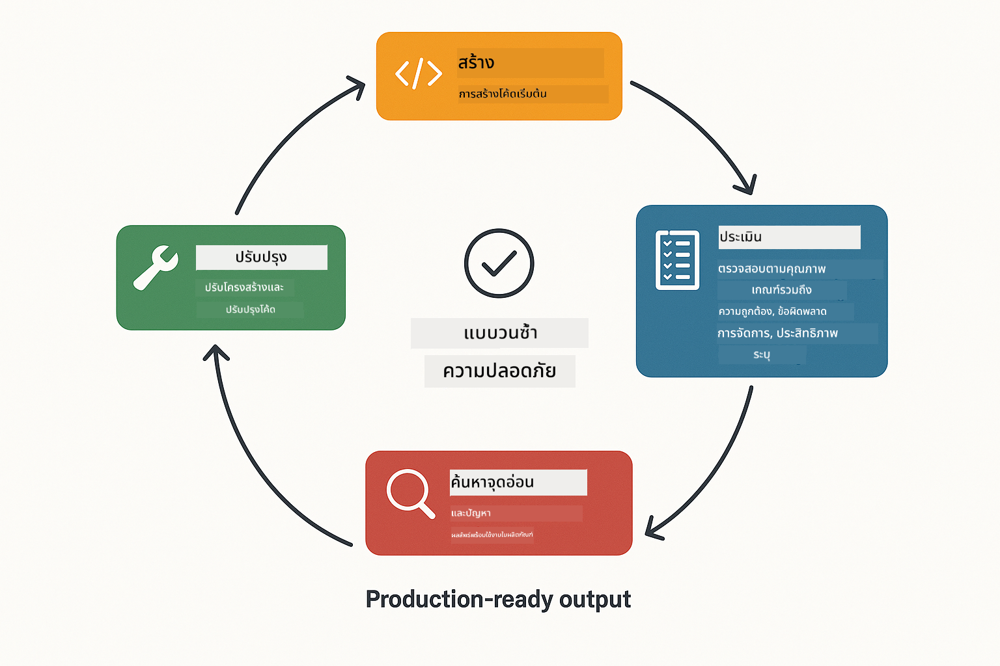

*วงจรปรับปรุงแบบวนซ้ำ - สร้าง, ประเมิน, ระบุปัญหา, ปรับปรุง, ทำซ้ำ*

**การวิเคราะห์แบบมีโครงสร้าง** - สำหรับการประเมินที่สม่ำเสมอ โมเดลจะตรวจสอบโค้ดโดยใช้กรอบงานที่กำหนดไว้ (ความถูกต้อง, แนวปฏิบัติ, ประสิทธิภาพ, ความปลอดภัย) ใช้สำหรับการตรวจสอบโค้ดหรือประเมินคุณภาพ

```java
String prompt = """
    <code>
    public List getUsers() {
        return database.query("SELECT * FROM users");
    }
    </code>
    
    <framework>
    Evaluate using these categories:
    1. Correctness - Logic and functionality
    2. Best Practices - Code quality
    3. Performance - Efficiency concerns
    4. Security - Vulnerabilities
    </framework>
    """;

String response = chatModel.chat(prompt);
```

> **🤖 ลองใช้ [GitHub Copilot](https://github.com/features/copilot) Chat:** ถามเกี่ยวกับการวิเคราะห์แบบมีโครงสร้าง:
> - "ฉันจะปรับแต่งกรอบการวิเคราะห์สำหรับการตรวจสอบโค้ดประเภทต่างๆ ได้อย่างไร?"
> - "วิธีที่ดีที่สุดในการแยกวิเคราะห์และดำเนินการกับผลลัพธ์ที่มีโครงสร้างโปรแกรมมิ่งคืออะไร?"
> - "ฉันจะทำให้ระดับความรุนแรงสม่ำเสมอในแต่ละเซสชันการตรวจสอบได้อย่างไร?"

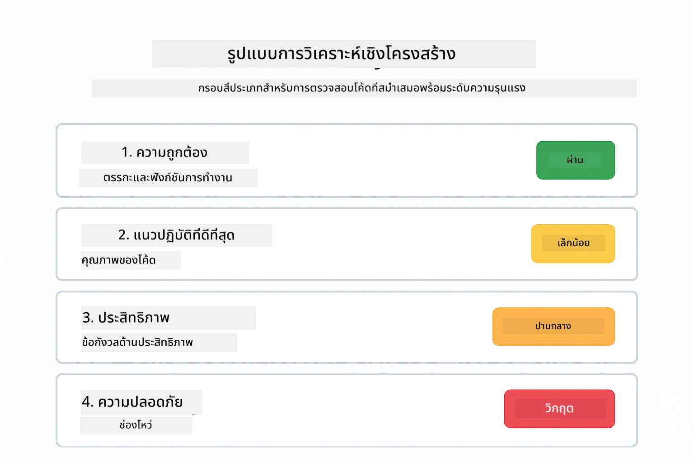

*กรอบงานสี่หมวดหมู่สำหรับการตรวจสอบโค้ดที่สม่ำเสมอพร้อมระดับความรุนแรง*

**แชทหลายรอบ** - สำหรับการสนทนาที่ต้องการบริบท โมเดลจะจดจำข้อความก่อนหน้าและสร้างต่อจากนั้น ใช้สำหรับการช่วยเหลือแบบโต้ตอบหรือ Q&A ซับซ้อน

```java
ChatMemory memory = MessageWindowChatMemory.withMaxMessages(10);

memory.add(UserMessage.from("What is Spring Boot?"));
AiMessage aiMessage1 = chatModel.chat(memory.messages()).aiMessage();
memory.add(aiMessage1);

memory.add(UserMessage.from("Show me an example"));
AiMessage aiMessage2 = chatModel.chat(memory.messages()).aiMessage();
memory.add(aiMessage2);
```

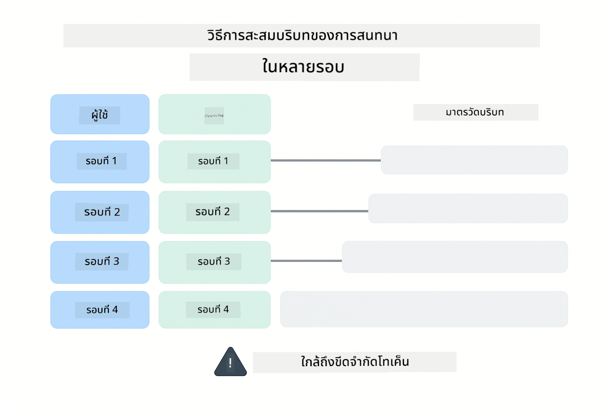

*วิธีที่บริบทการสนทนาสะสมผ่านหลายรอบจนถึงขีดจำกัดโทเค็น*

**การให้เหตุผลทีละขั้นตอน** - สำหรับปัญหาที่ต้องการตรรกะที่มองเห็นได้ โมเดลจะแสดงเหตุผลอย่างชัดเจนในแต่ละขั้นตอน ใช้สำหรับปัญหาคณิตศาสตร์ ปริศนาตรรกะ หรือเมื่อคุณต้องการเข้าใจกระบวนการคิด

```java
String prompt = """
    <instruction>Show your reasoning step-by-step</instruction>
    
    If a train travels 120 km in 2 hours, then stops for 30 minutes,
    then travels another 90 km in 1.5 hours, what is the average speed
    for the entire journey including the stop?
    """;

String response = chatModel.chat(prompt);
```

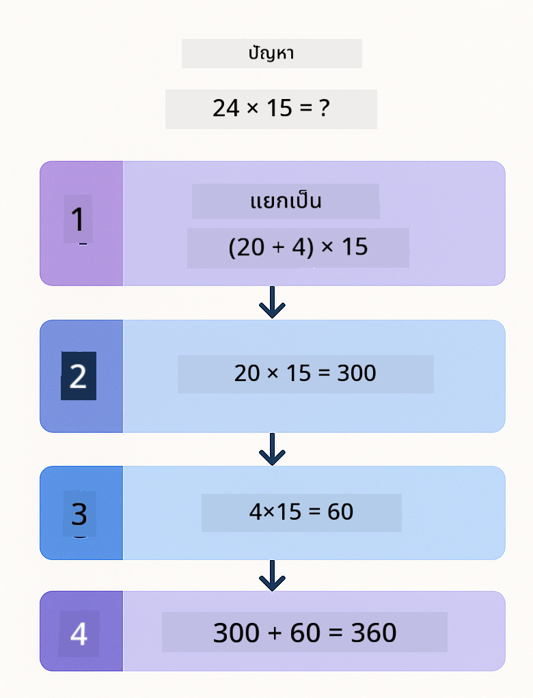

*แยกปัญหาเป็นขั้นตอนตรรกะที่ชัดเจน*

**ผลลัพธ์ที่ถูกจำกัด** - สำหรับคำตอบที่ต้องการรูปแบบเฉพาะ โมเดลจะปฏิบัติตามกฎรูปแบบและความยาวอย่างเคร่งครัด ใช้สำหรับสรุปหรือเมื่อคุณต้องการโครงสร้างผลลัพธ์ที่แม่นยำ

```java
String prompt = """
    <constraints>
    - Exactly 100 words
    - Bullet point format
    - Technical terms only
    </constraints>
    
    Summarize the key concepts of machine learning.
    """;

String response = chatModel.chat(prompt);
```

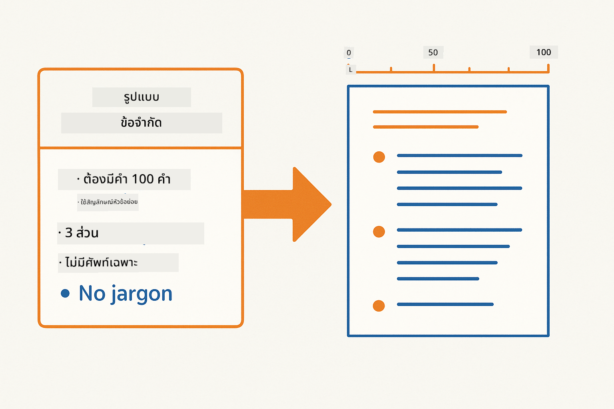

*บังคับใช้รูปแบบ ความยาว และข้อกำหนดโครงสร้างเฉพาะ*

## การใช้ทรัพยากร Azure ที่มีอยู่

**ตรวจสอบการติดตั้ง:**

ตรวจสอบให้แน่ใจว่าไฟล์ `.env` อยู่ในไดเรกทอรีหลักพร้อมข้อมูลรับรอง Azure (สร้างในโมดูล 01):
```bash
cat ../.env  # ควรแสดง AZURE_OPENAI_ENDPOINT, API_KEY, DEPLOYMENT
```

**เริ่มแอปพลิเคชัน:**

> **หมายเหตุ:** หากคุณเริ่มแอปพลิเคชันทั้งหมดด้วย `./start-all.sh` จากโมดูล 01 แล้ว โมดูลนี้จะทำงานบนพอร์ต 8083 อยู่แล้ว คุณสามารถข้ามคำสั่งเริ่มต้นด้านล่างและไปที่ http://localhost:8083 ได้เลย

**ตัวเลือก 1: ใช้ Spring Boot Dashboard (แนะนำสำหรับผู้ใช้ VS Code)**

คอนเทนเนอร์ dev มีส่วนขยาย Spring Boot Dashboard ซึ่งให้ส่วนติดต่อแบบกราฟิกสำหรับจัดการแอปพลิเคชัน Spring Boot ทั้งหมด คุณจะพบได้ใน Activity Bar ด้านซ้ายของ VS Code (มองหาไอคอน Spring Boot)

จาก Spring Boot Dashboard คุณสามารถ:
- ดูแอปพลิเคชัน Spring Boot ทั้งหมดใน workspace
- เริ่ม/หยุดแอปพลิเคชันด้วยคลิกเดียว
- ดูบันทึกแอปพลิเคชันแบบเรียลไทม์
- ตรวจสอบสถานะแอปพลิเคชัน

เพียงคลิกปุ่มเล่นข้าง "prompt-engineering" เพื่อเริ่มโมดูลนี้ หรือเริ่มทุกโมดูลพร้อมกัน


**ตัวเลือก 2: ใช้สคริปต์เชลล์**

เริ่มแอปพลิเคชันเว็บทั้งหมด (โมดูล 01-04):

**Bash:**
```bash
cd ..  # จากไดเรกทอรีรูท
./start-all.sh
```

**PowerShell:**
```powershell
cd ..  # จากไดเรกทอรีรูท
.\start-all.ps1
```

หรือเริ่มแค่โมดูลนี้:

**Bash:**
```bash
cd 02-prompt-engineering
./start.sh
```

**PowerShell:**
```powershell
cd 02-prompt-engineering
.\start.ps1
```

ทั้งสองสคริปต์จะโหลดตัวแปรสภาพแวดล้อมจากไฟล์ `.env` ในไดเรกทอรีหลักโดยอัตโนมัติ และจะสร้าง JAR หากยังไม่มี

> **หมายเหตุ:** หากคุณต้องการสร้างโมดูลทั้งหมดด้วยตนเองก่อนเริ่ม:
>
> **Bash:**
> ```bash
> cd ..  # Go to root directory
> mvn clean package -DskipTests
> ```
>
> **PowerShell:**
> ```powershell
> cd ..  # Go to root directory
> mvn clean package -DskipTests
> ```

เปิด http://localhost:8083 ในเบราว์เซอร์ของคุณ

**เพื่อหยุด:**

**Bash:**
```bash
./stop.sh  # โมดูลนี้เท่านั้น
# หรือ
cd .. && ./stop-all.sh  # ทุกโมดูล
```

**PowerShell:**
```powershell
.\stop.ps1  # โมดูลนี้เท่านั้น
# หรือ
cd ..; .\stop-all.ps1  # ทุกโมดูล
```

## ภาพหน้าจอแอปพลิเคชัน

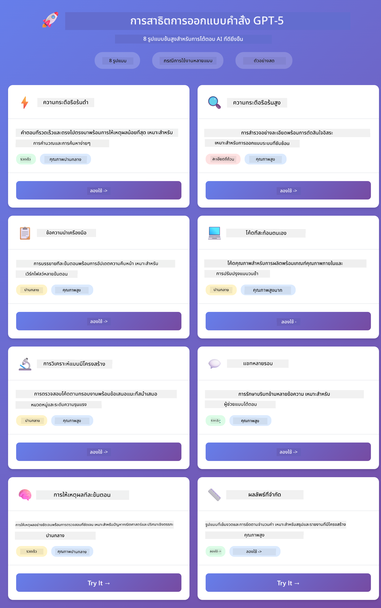

*แดชบอร์ดหลักแสดงรูปแบบการออกแบบคำสั่งทั้ง 8 รูปแบบพร้อมลักษณะและกรณีการใช้งาน*

## สำรวจรูปแบบต่างๆ

อินเทอร์เฟซเว็บช่วยให้คุณทดลองกับกลยุทธ์การตั้งคำสั่งต่างๆ รูปแบบแต่ละแบบแก้ปัญหาต่างกัน — ลองใช้เพื่อดูว่าแต่ละวิธีเหมาะกับเมื่อใด

### ความกระตือรือร้นต่ำ vs สูง

ถามคำถามง่ายๆ เช่น "15% ของ 200 คือเท่าไหร่?" โดยใช้ความกระตือรือร้นต่ำ คุณจะได้รับคำตอบทันทีและตรงไปตรงมา ตอนนี้ถามคำถามซับซ้อน เช่น "ออกแบบกลยุทธ์แคชสำหรับ API ที่มีการใช้งานสูง" โดยใช้ความกระตือรือร้นสูง ดูว่าโมเดลช้าลงและให้เหตุผลอย่างละเอียดอย่างไร โมเดลเดียวกัน โครงสร้างคำถามเดียวกัน — แต่คำสั่งบอกให้คิดมากน้อยแค่ไหน

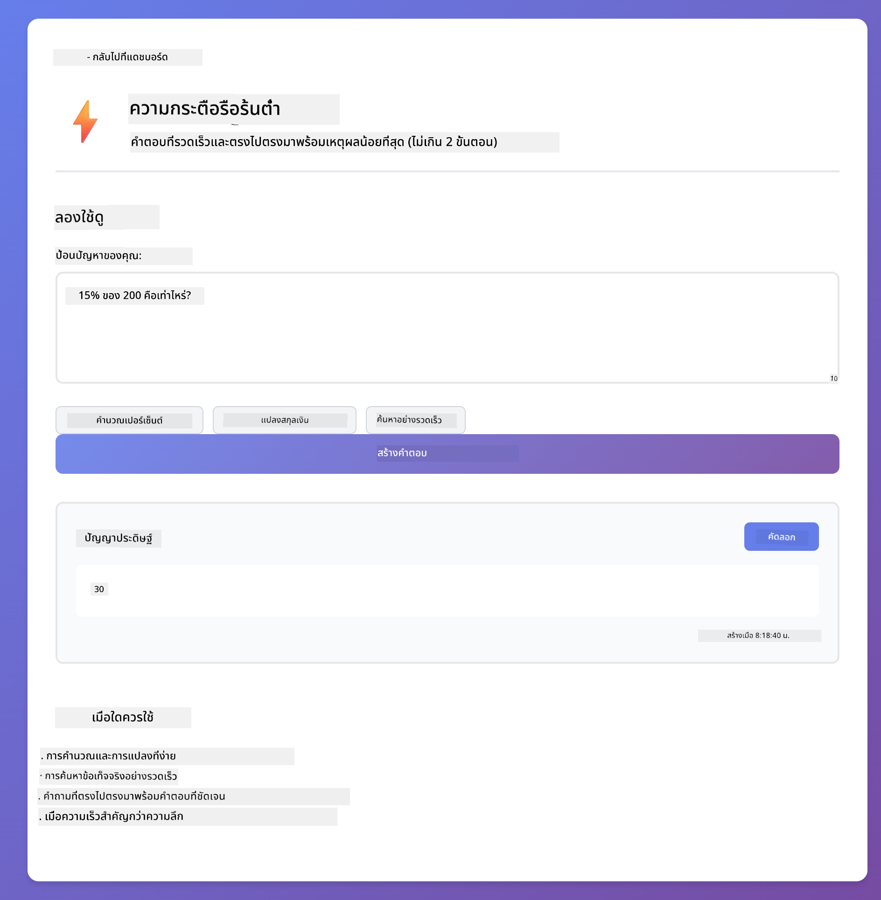
*การคำนวณอย่างรวดเร็วด้วยเหตุผลน้อยที่สุด*

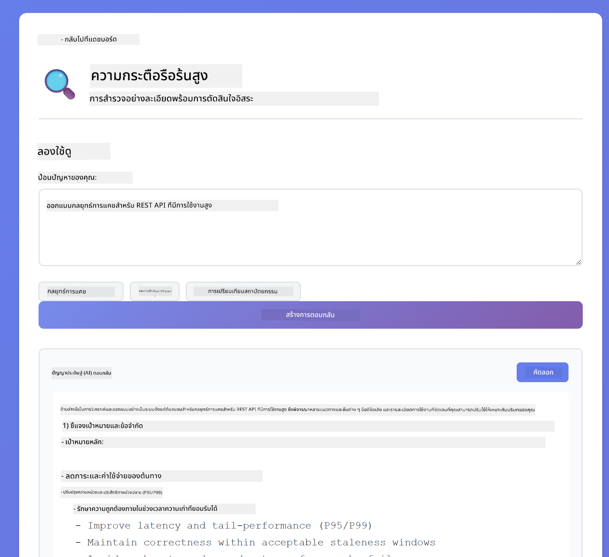

*กลยุทธ์การแคชอย่างครอบคลุม (2.8MB)*

### การดำเนินงานของงาน (คำแนะนำเครื่องมือ)

เวิร์กโฟลว์หลายขั้นตอนได้รับประโยชน์จากการวางแผนล่วงหน้าและการบรรยายความคืบหน้า โมเดลจะสรุปสิ่งที่จะทำ บรรยายแต่ละขั้นตอน จากนั้นสรุปผลลัพธ์

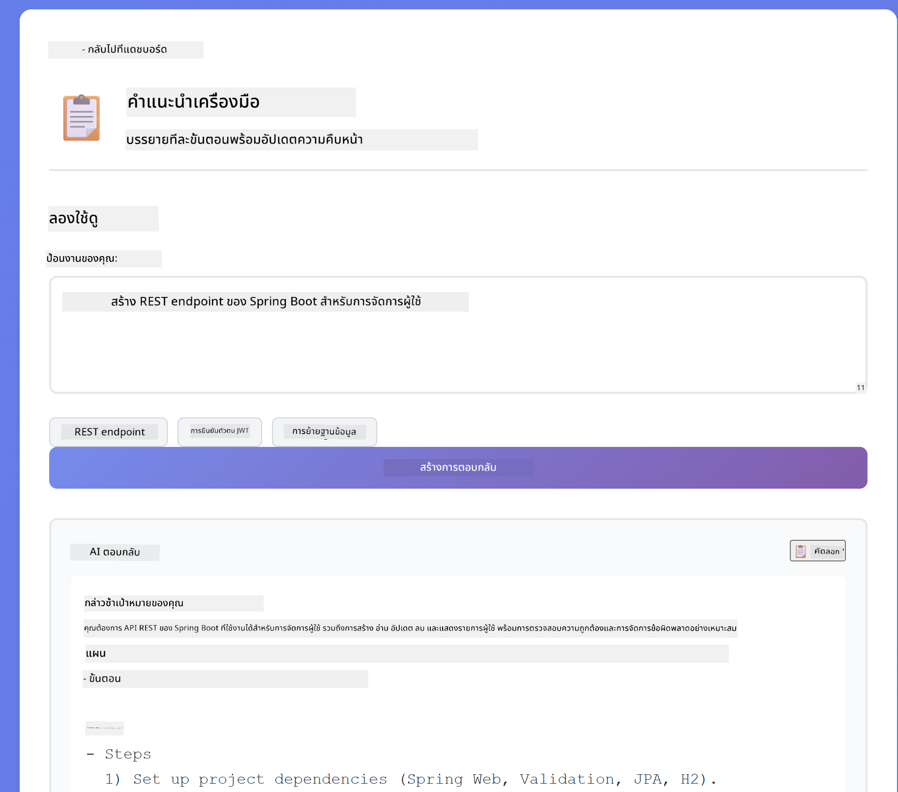

*การสร้าง REST endpoint พร้อมการบรรยายทีละขั้นตอน (3.9MB)*

### โค้ดที่สะท้อนตนเอง

ลอง "สร้างบริการตรวจสอบอีเมล" แทนที่จะสร้างโค้ดและหยุด โมเดลจะสร้าง ประเมินตามเกณฑ์คุณภาพ ระบุจุดอ่อน และปรับปรุง คุณจะเห็นมันทำซ้ำจนกว่าโค้ดจะได้มาตรฐานการผลิต

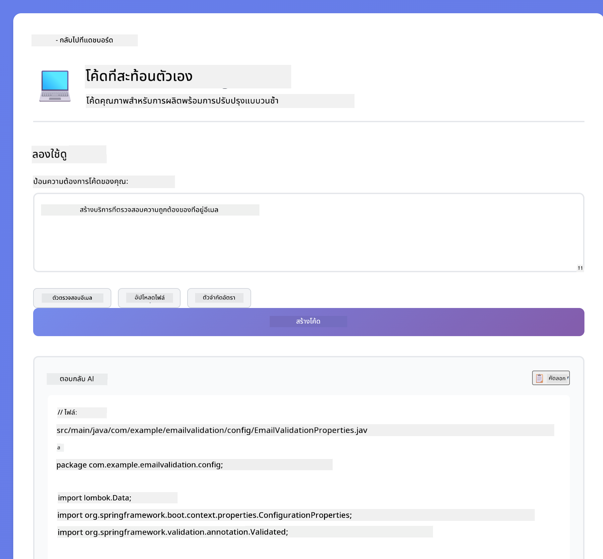

*บริการตรวจสอบอีเมลครบถ้วน (5.2MB)*

### การวิเคราะห์เชิงโครงสร้าง

การตรวจสอบโค้ดต้องการกรอบการประเมินที่สม่ำเสมอ โมเดลวิเคราะห์โค้ดโดยใช้หมวดหมู่คงที่ (ความถูกต้อง, แนวปฏิบัติ, ประสิทธิภาพ, ความปลอดภัย) พร้อมระดับความรุนแรง

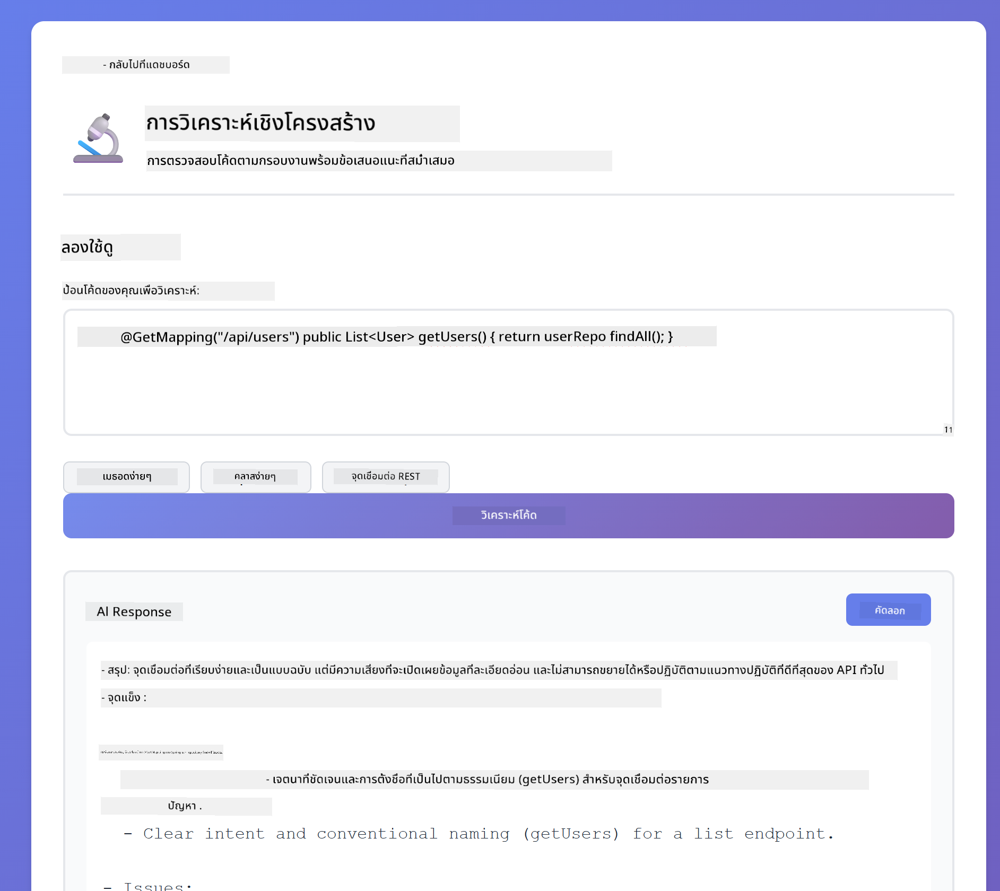

*การตรวจสอบโค้ดตามกรอบงาน*

### แชทหลายรอบ

ถามว่า "Spring Boot คืออะไร?" แล้วตามด้วย "แสดงตัวอย่างให้ดู" ทันที โมเดลจะจำคำถามแรกและให้ตัวอย่าง Spring Boot โดยเฉพาะ หากไม่มีความจำ คำถามที่สองจะกว้างเกินไป


*การรักษาบริบทข้ามคำถาม*

### การให้เหตุผลทีละขั้นตอน

เลือกโจทย์คณิตศาสตร์และลองทั้งการให้เหตุผลทีละขั้นตอนและความกระตือรือร้นต่ำ ความกระตือรือร้นต่ำให้คำตอบอย่างรวดเร็วแต่ไม่ชัดเจน การให้เหตุผลทีละขั้นตอนแสดงการคำนวณและการตัดสินใจทุกขั้นตอน

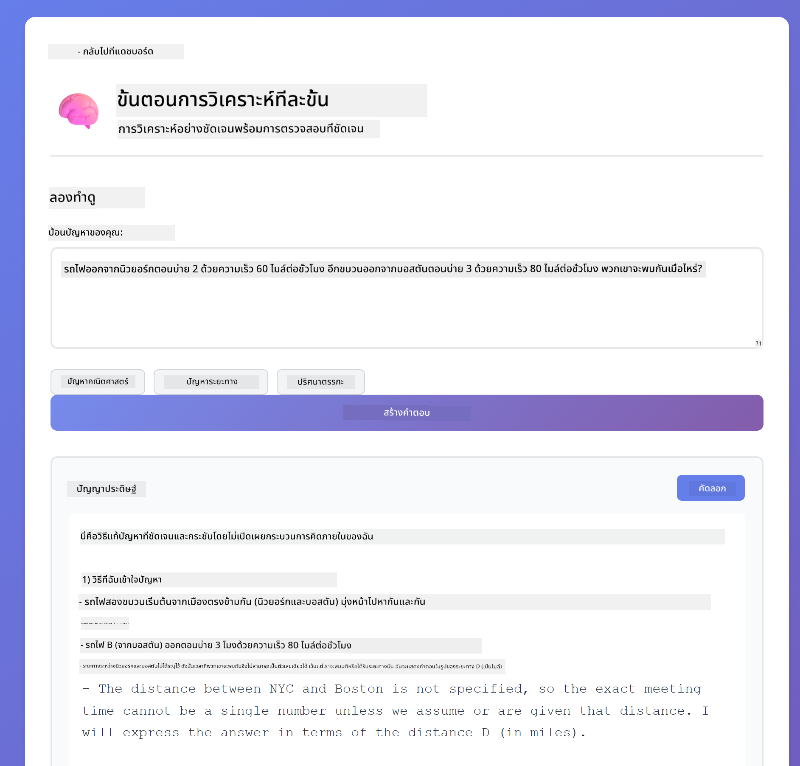

*โจทย์คณิตศาสตร์พร้อมขั้นตอนชัดเจน*

### ผลลัพธ์ที่จำกัด

เมื่อคุณต้องการรูปแบบเฉพาะหรือจำนวนคำที่แน่นอน รูปแบบนี้จะบังคับให้ปฏิบัติตามอย่างเคร่งครัด ลองสร้างสรุปที่มีคำ 100 คำในรูปแบบรายการหัวข้อ


*สรุปการเรียนรู้ของเครื่องพร้อมการควบคุมรูปแบบ*

## สิ่งที่คุณกำลังเรียนรู้จริงๆ

**ความพยายามในการให้เหตุผลเปลี่ยนทุกอย่าง**

GPT-5 ให้คุณควบคุมความพยายามในการคำนวณผ่านคำสั่งของคุณ ความพยายามต่ำหมายถึงการตอบสนองอย่างรวดเร็วด้วยการสำรวจน้อย ความพยายามสูงหมายถึงโมเดลใช้เวลาคิดอย่างลึกซึ้ง คุณกำลังเรียนรู้ที่จะจับคู่ความพยายามกับความซับซ้อนของงาน - อย่าเสียเวลากับคำถามง่ายๆ แต่ก็อย่าเร่งรีบการตัดสินใจที่ซับซ้อนเช่นกัน

**โครงสร้างชี้นำพฤติกรรม**

สังเกตแท็ก XML ในคำสั่งไหม? มันไม่ใช่แค่การตกแต่ง โมเดลปฏิบัติตามคำสั่งที่มีโครงสร้างได้ดีกว่าข้อความอิสระ เมื่อคุณต้องการกระบวนการหลายขั้นตอนหรือตรรกะซับซ้อน โครงสร้างช่วยให้โมเดลติดตามตำแหน่งและสิ่งที่จะทำต่อไป


*โครงสร้างของคำสั่งที่มีการจัดระเบียบชัดเจนและสไตล์ XML*

**คุณภาพผ่านการประเมินตนเอง**

รูปแบบการสะท้อนตนเองทำงานโดยการทำให้เกณฑ์คุณภาพชัดเจน แทนที่จะหวังว่าโมเดลจะ "ทำถูก" คุณบอกมันอย่างชัดเจนว่า "ถูกต้อง" หมายถึงอะไร: ตรรกะถูกต้อง, การจัดการข้อผิดพลาด, ประสิทธิภาพ, ความปลอดภัย โมเดลจึงสามารถประเมินผลลัพธ์ของตัวเองและปรับปรุงได้ นี่เปลี่ยนการสร้างโค้ดจากการเสี่ยงโชคเป็นกระบวนการ

**บริบทมีขีดจำกัด**

การสนทนาหลายรอบทำงานโดยการรวมประวัติข้อความในแต่ละคำขอ แต่มีขีดจำกัด - ทุกโมเดลมีจำนวนโทเค็นสูงสุด เมื่อการสนทนาเพิ่มขึ้น คุณจะต้องมีกลยุทธ์เพื่อรักษาบริบทที่เกี่ยวข้องโดยไม่เกินขีดจำกัด โมดูลนี้แสดงให้เห็นว่า memory ทำงานอย่างไร; ต่อไปคุณจะได้เรียนรู้ว่าเมื่อใดควรสรุป, เมื่อใดควรลืม, และเมื่อใดควรดึงข้อมูล

## ขั้นตอนถัดไป

**โมดูลถัดไป:** [03-rag - RAG (Retrieval-Augmented Generation)](../03-rag/README.md)

---

**การนำทาง:** [← ก่อนหน้า: โมดูล 01 - บทนำ](../01-introduction/README.md) | [กลับสู่หน้าหลัก](../README.md) | [ถัดไป: โมดูล 03 - RAG →](../03-rag/README.md)

---

<!-- CO-OP TRANSLATOR DISCLAIMER START -->
**ข้อจำกัดความรับผิดชอบ**:  
เอกสารนี้ได้รับการแปลโดยใช้บริการแปลภาษาอัตโนมัติ [Co-op Translator](https://github.com/Azure/co-op-translator) แม้เราจะพยายามให้ความถูกต้องสูงสุด แต่โปรดทราบว่าการแปลอัตโนมัติอาจมีข้อผิดพลาดหรือความไม่ถูกต้อง เอกสารต้นฉบับในภาษาต้นทางถือเป็นแหล่งข้อมูลที่เชื่อถือได้ สำหรับข้อมูลที่สำคัญ ขอแนะนำให้ใช้บริการแปลโดยผู้เชี่ยวชาญมนุษย์ เราไม่รับผิดชอบต่อความเข้าใจผิดหรือการตีความผิดใด ๆ ที่เกิดจากการใช้การแปลนี้
<!-- CO-OP TRANSLATOR DISCLAIMER END -->