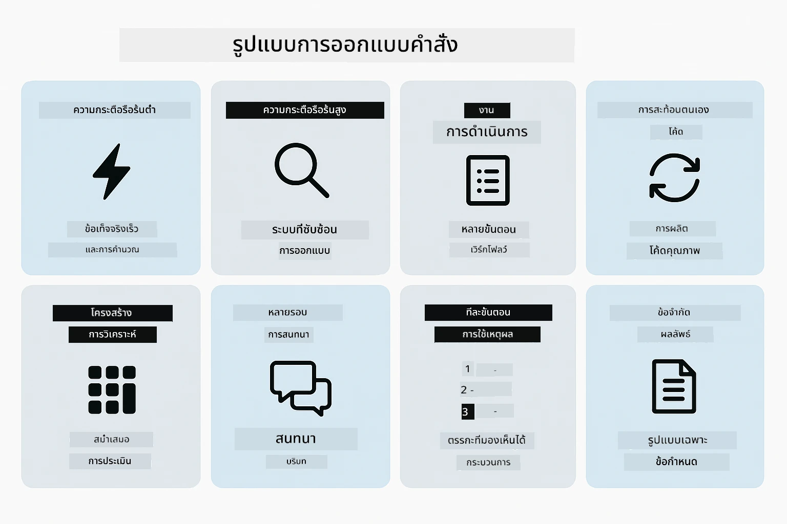
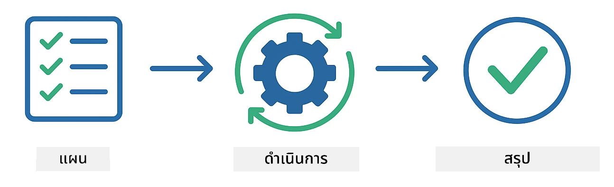
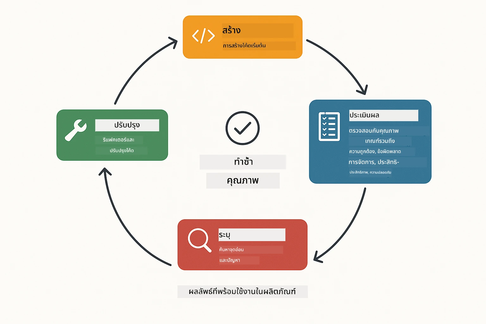
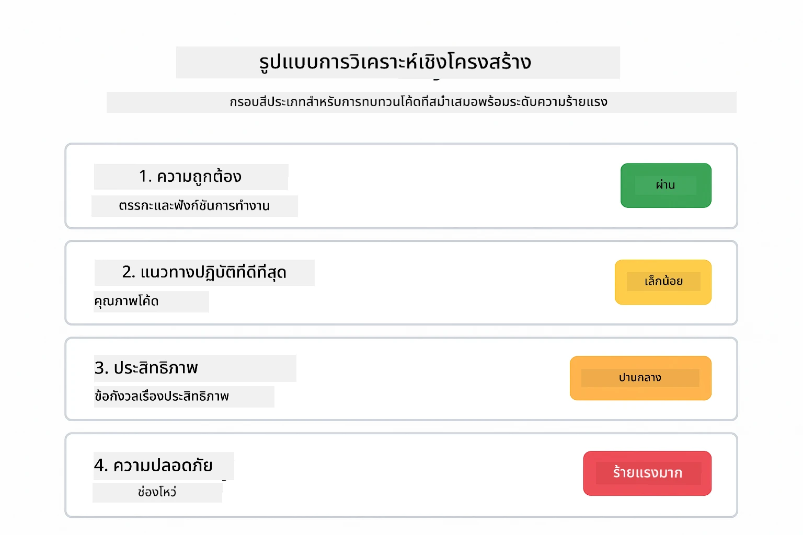
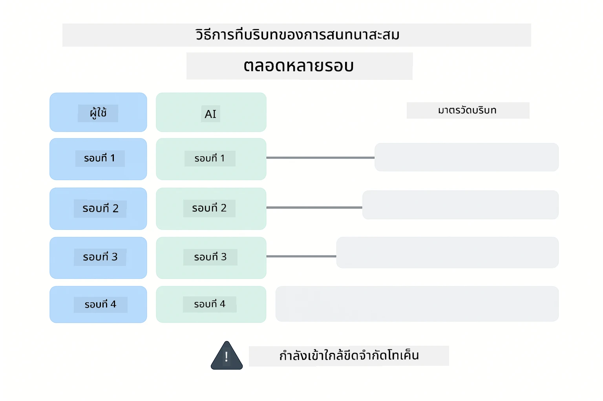
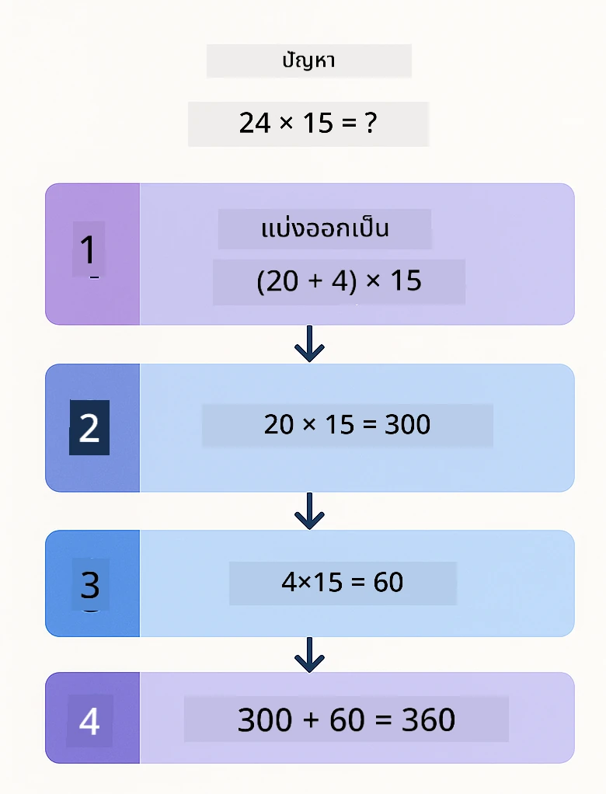
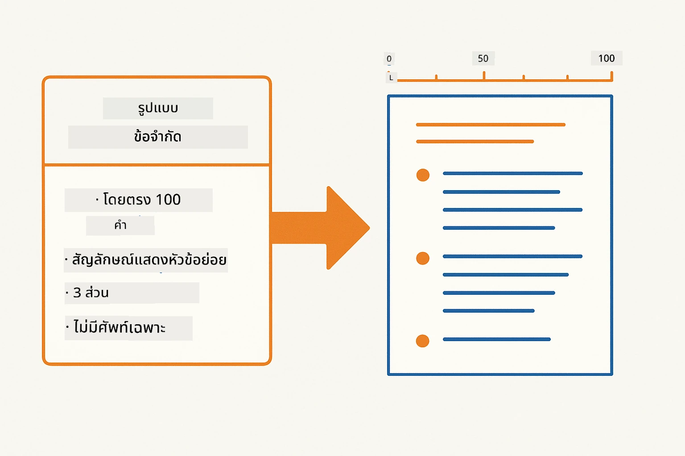
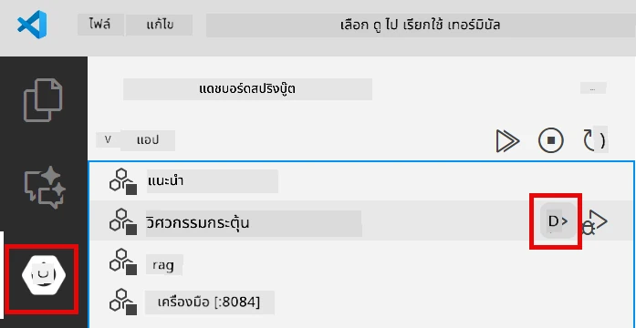
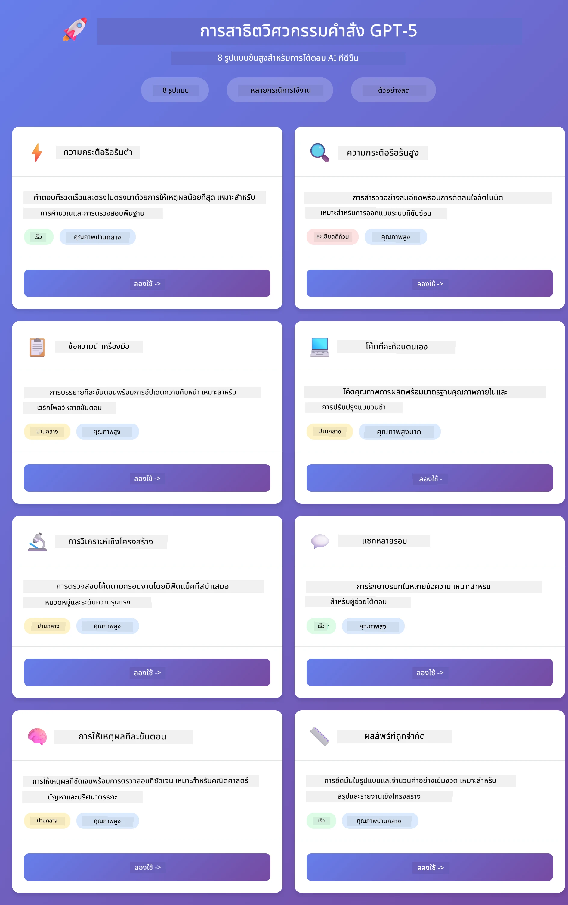
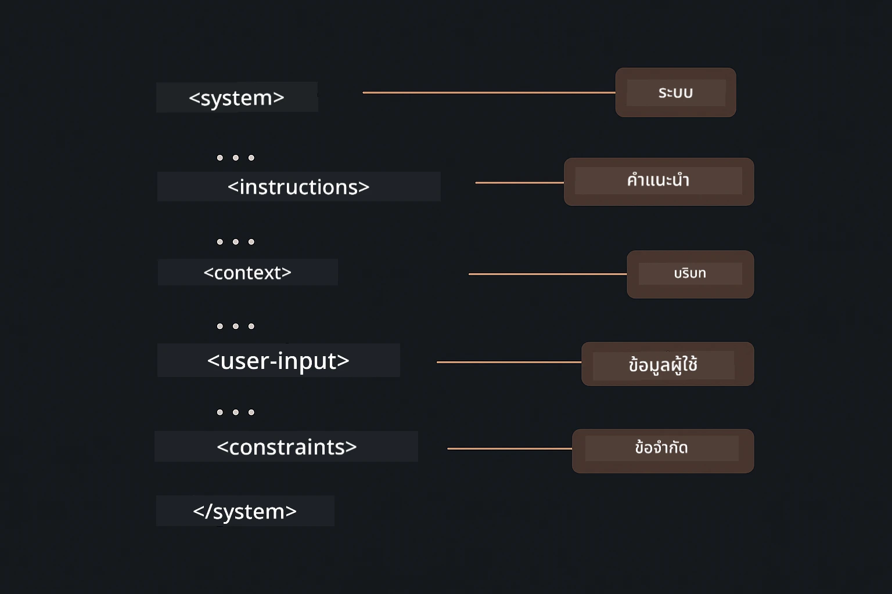

# Module 02: การออกแบบคำสั่ง (Prompt Engineering) กับ GPT-5.2

## สารบัญ

- [วิดีโอสอน](#วิดีโอสอน)
- [สิ่งที่คุณจะได้เรียนรู้](#สิ่งที่คุณจะได้เรียนรู้)
- [สิ่งที่ต้องเตรียมก่อนเรียน](#สิ่งที่ต้องเตรียมก่อนเรียน)
- [ความเข้าใจเกี่ยวกับการออกแบบคำสั่ง](#ความเข้าใจเกี่ยวกับการออกแบบคำสั่ง)
- [พื้นฐานการออกแบบคำสั่ง](#พื้นฐานการออกแบบคำสั่ง)
  - [Zero-Shot Prompting](#zero-shot-prompting)
  - [Few-Shot Prompting](#few-shot-prompting)
  - [Chain of Thought](#chain-of-thought)
  - [Role-Based Prompting](#role-based-prompting)
  - [Prompt Templates](#prompt-templates)
- [รูปแบบขั้นสูง](#รูปแบบขั้นสูง)
- [รันแอปพลิเคชัน](#เรียกใช้แอปพลิเคชัน)
- [ภาพหน้าจอแอปพลิเคชัน](#ภาพหน้าจอแอปพลิเคชัน)
- [สำรวจรูปแบบต่างๆ](#การสำรวจรูปแบบต่าง-ๆ)
  - [ความกระตือรือร้นต่ำ vs สูง](#ความกระตือรือร้นต่ำกับสูง)
  - [การปฏิบัติงานตามขั้นตอน (เครื่องมือเบื้องต้น)](#การดำเนินงานตามงาน-tool-preambles)
  - [โค้ดที่สะท้อนตนเอง](#โค้ดที่สะท้อนตนเอง)
  - [การวิเคราะห์แบบมีโครงสร้าง](#การวิเคราะห์แบบมีโครงสร้าง)
  - [แชทหลายรอบ](#แชทแบบหลายรอบ)
  - [เหตุผลทีละขั้นตอน](#การคิดเชิงตรรกะแบบขั้นตอนต่อขั้นตอน)
  - [ผลลัพธ์ที่ถูกจำกัด](#ผลลัพธ์แบบจำกัด)
- [สิ่งที่คุณกำลังเรียนรู้อย่างแท้จริง](#สิ่งที่คุณกำลังเรียนรู้จริง-ๆ)
- [ก้าวต่อไป](#ขั้นตอนต่อไป)

## วิดีโอสอน

ชมการสอนแบบสดนี้ที่อธิบายวิธีเริ่มต้นกับโมดูลนี้:

<a href="https://www.youtube.com/live/PJ6aBaE6bog?si=LDshyBrTRodP-wke"></a>

## สิ่งที่คุณจะได้เรียนรู้

แผนภาพต่อไปนี้แสดงภาพรวมของหัวข้อและทักษะสำคัญที่คุณจะพัฒนาในโมดูลนี้ — ตั้งแต่เทคนิคการปรับแต่งคำสั่งจนถึงขั้นตอนการทำงานทีละขั้นตอนที่คุณจะปฏิบัติตาม


ในโมดูลก่อนหน้านี้ คุณได้เห็นว่าหน่วยความจำช่วยให้ AI สนทนาใช้งานกับ Azure OpenAI ได้อย่างไร ตอนนี้เราจะเน้นที่วิธีการตั้งคำถาม — คำสั่ง prompt เอง — โดยใช้ GPT-5.2 ของ Azure OpenAI วิธีที่คุณจัดโครงสร้างคำสั่งจะส่งผลอย่างมีนัยสำคัญต่อคุณภาพของคำตอบที่ได้รับ เราจะเริ่มด้วยการทบทวนเทคนิคการตั้ง prompt พื้นฐาน แล้วค่อยเข้าสู่รูปแบบขั้นสูงแปดรูปแบบที่ใช้ประโยชน์สูงสุดจากความสามารถของ GPT-5.2

เราใช้ GPT-5.2 เพราะมันเปิดตัวฟีเจอร์การควบคุมการให้เหตุผล — คุณสามารถบอกโมเดลได้ว่าจะให้คิดมากแค่ไหนก่อนที่จะตอบ นี่ทำให้กลยุทธ์การตั้งคำสั่งต่างๆ ชัดเจนขึ้นและช่วยให้คุณเข้าใจว่าเมื่อไรควรใช้แต่ละวิธี

## สิ่งที่ต้องเตรียมก่อนเรียน

- ทำโมดูล 01 เสร็จสมบูรณ์แล้ว (พร้อมใช้งาน Azure OpenAI resources)
- ไฟล์ `.env` ในโฟลเดอร์หลักที่มีข้อมูลรับรอง Azure (ถูกสร้างโดยคำสั่ง `azd up` ในโมดูล 01)

> **หมายเหตุ:** หากคุณยังไม่ได้ทำโมดูล 01 ให้ทำตามคำแนะนำการติดตั้งในนั้นก่อน

## ความเข้าใจเกี่ยวกับการออกแบบคำสั่ง

โดยพื้นฐานแล้ว การออกแบบคำสั่งคือความแตกต่างระหว่างคำสั่งที่คลุมเครือกับคำสั่งที่ชัดเจน ดังภาพประกอบด้านล่างนี้


การออกแบบคำสั่งเกี่ยวกับการออกแบบข้อความนำเข้าที่ทำให้คุณได้ผลลัพธ์ที่ต้องการอย่างสม่ำเสมอ ไม่ใช่แค่การตั้งคำถาม — แต่เป็นการจัดโครงสร้างคำขอให้โมเดลเข้าใจอย่างชัดเจนว่าคุณต้องการอะไรและจะตอบอย่างไร

ลองนึกถึงเหมือนการให้คำแนะนำเพื่อนร่วมงาน “แก้บั๊ก” เป็นคำสั่งที่คลุมเครือ “แก้ข้อผิดพลาด null pointer exception ใน UserService.java บรรทัด 45 โดยการเพิ่มการตรวจสอบ null” ชัดเจนกว่า โมเดลภาษาก็ทำงานแบบเดียวกัน — ความชัดเจนและโครงสร้างมีความสำคัญ

แผนภาพด้านล่างแสดงให้เห็นว่า LangChain4j เข้ากับภาพนี้อย่างไร — โดยการเชื่อมคำสั่ง prompt ของคุณกับโมเดลผ่านองค์ประกอบ SystemMessage และ UserMessage


LangChain4j ให้โครงสร้างพื้นฐาน — การเชื่อมต่อโมเดล หน่วยความจำ และประเภทข้อความ — ในขณะที่รูปแบบ prompt คือข้อความที่คุณจัดโครงสร้างอย่างระมัดระวังส่งผ่านโครงสร้างพื้นฐานนั้น บล็อกสำคัญคืิอ `SystemMessage` (ซึ่งกำหนดพฤติกรรมและบทบาทของ AI) และ `UserMessage` (ซึ่งบรรจุคำขอของคุณจริงๆ)

## พื้นฐานการออกแบบคำสั่ง

เทคนิคหลักห้าข้อที่แสดงด้านล่างนี้เป็นรากฐานของการออกแบบคำสั่งที่มีประสิทธิภาพ แต่ละข้อเจาะจงด้านต่างๆ ของวิธีการสื่อสารกับโมเดลภาษา


ก่อนจะลงลึกในรูปแบบขั้นสูงในโมดูลนี้ ให้ทบทวนเทคนิคตั้ง prompt พื้นฐานทั้งห้าข้อนี้ก่อน นี่คือบล็อกพื้นฐานที่นักออกแบบคำสั่งทุกคนควรรู้

### Zero-Shot Prompting

วิธีที่ง่ายที่สุด: ให้คำสั่งตรงไปยังโมเดลโดยไม่มีตัวอย่าง โมเดลอาศัยการฝึกสอนของตัวเองทั้งหมดเพื่อเข้าใจและทำงานตามคำสั่งนี้ เหมาะสำหรับคำขอที่ตรงไปตรงมาที่พฤติกรรมที่คาดหวังชัดเจน


*คำสั่งตรงโดยไม่มีตัวอย่าง — โมเดลจะสรุปงานจากคำสั่งนั้นเอง*

```java
String prompt = "Classify this sentiment: 'I absolutely loved the movie!'";
String response = model.chat(prompt);
// การตอบสนอง: "เชิงบวก"
```
  
**เมื่อใช้:** การจัดประเภทง่ายๆ คำถามตรงๆ การแปลภาษา หรือทุกงานที่โมเดลจัดการได้โดยไม่ต้องมีคำแนะนำเพิ่มเติม

### Few-Shot Prompting

ให้ตัวอย่างเพื่อแสดงรูปแบบที่ต้องการให้โมเดลปฏิบัติตาม โมเดลเรียนรู้รูปแบบอินพุต-เอาต์พุตจากตัวอย่างและนำไปใช้กับข้อมูลใหม่ วิธีนี้ช่วยเพิ่มความสม่ำเสมออย่างมากสำหรับงานที่รูปแบบหรือพฤติกรรมที่ต้องการไม่ชัดเจน


*เรียนรู้จากตัวอย่าง — โมเดลระบุรูปแบบและใช้กับข้อมูลใหม่*

```java
String prompt = """
    Classify the sentiment as positive, negative, or neutral.
    
    Examples:
    Text: "This product exceeded my expectations!" → Positive
    Text: "It's okay, nothing special." → Neutral
    Text: "Waste of money, very disappointed." → Negative
    
    Now classify this:
    Text: "Best purchase I've made all year!"
    """;
String response = model.chat(prompt);
```
  
**เมื่อใช้:** การจัดประเภทแบบกำหนดเอง การจัดรูปแบบที่คงที่ งานเฉพาะทาง หรือเมื่อผลลัพธ์ zero-shot ไม่สม่ำเสมอ

### Chain of Thought

ขอให้โมเดลแสดงกระบวนการให้เหตุผลทีละขั้นตอน แทนที่จะตอบทันที โมเดลจะแยกปัญหาและทำงานผ่านแต่ละส่วนอย่างชัดเจน วิธีนี้ช่วยเพิ่มความแม่นยำในการแก้ปัญหาคณิตศาสตร์ ตรรกะ และการให้เหตุผลหลายขั้นตอน


*การให้เหตุผลทีละขั้นตอน — แยกปัญหาซับซ้อนออกเป็นขั้นตอนตรรกะที่ชัดเจน*

```java
String prompt = """
    Problem: A store has 15 apples. They sell 8 apples and then 
    receive a shipment of 12 more apples. How many apples do they have now?
    
    Let's solve this step-by-step:
    """;
String response = model.chat(prompt);
// แบบจำลองแสดง: 15 - 8 = 7 จากนั้น 7 + 12 = 19 แอปเปิ้ล
```
  
**เมื่อใช้:** ปัญหาคณิตศาสตร์ ปริศนาตรรกะ การดีบั๊ก หรือทุกงานที่แสดงกระบวนการคิดช่วยเพิ่มความแม่นยำและความน่าเชื่อถือ

### Role-Based Prompting

กำหนดบุคลิกหรือบทบาทของ AI ก่อนถามคำถาม วิธีนี้ให้บริบทที่กำหนดโทนเสียง ความลึก และจุดสนใจของคำตอบ “สถาปนิกซอฟต์แวร์” ให้คำแนะนำที่แตกต่างจาก “นักพัฒนาระดับจูเนียร์” หรือ “ผู้ตรวจสอบความปลอดภัย”


*กำหนดบริบทและบุคลิก — คำถามเดียวกันได้รับคำตอบต่างกันตามบทบาทที่กำหนด*

```java
String prompt = """
    You are an experienced software architect reviewing code.
    Provide a brief code review for this function:
    
    def calculate_total(items):
        total = 0
        for item in items:
            total = total + item['price']
        return total
    """;
String response = model.chat(prompt);
```
  
**เมื่อใช้:** การตรวจสอบโค้ด การสอน การวิเคราะห์เฉพาะโดเมน หรือเมื่อคุณต้องการคำตอบที่ปรับให้เหมาะกับระดับความเชี่ยวชาญหรือมุมมองเฉพาะ

### Prompt Templates

สร้างคำสั่งที่นำกลับมาใช้ได้ซ้ำโดยมีตัวแปรแทนที่ แทนที่จะเขียนคำสั่งใหม่ทุกครั้ง ให้กำหนดแม่แบบครั้งเดียวแล้วแทนค่าตัวแปรต่างๆ คลาส `PromptTemplate` ของ LangChain4j ทำให้สิ่งนี้ง่ายด้วยไวยากรณ์ `{{variable}}`


*คำสั่งที่ใช้ซ้ำได้ด้วยตัวแปรแทนที่ — แม่แบบเดียว ใช้งานหลายครั้ง*

```java
PromptTemplate template = PromptTemplate.from(
    "What's the best time to visit {{destination}} for {{activity}}?"
);

Prompt prompt = template.apply(Map.of(
    "destination", "Paris",
    "activity", "sightseeing"
));

String response = model.chat(prompt.text());
```
  
**เมื่อใช้:** การสืบค้นซ้ำที่มีอินพุตแตกต่างกัน การประมวลผลเป็นชุด การสร้างเวิร์กโฟลว์ AI ที่นำกลับมาใช้ซ้ำได้ หรือทุกกรณีที่โครงสร้างคำสั่งเหมือนเดิมแต่ข้อมูลเปลี่ยน

---

พื้นฐานห้าข้อนี้มอบชุดเครื่องมือที่มั่นคงสำหรับงานตั้ง prompt ส่วนที่เหลือของโมดูลนี้จะต่อยอดด้วย **รูปแบบขั้นสูงแปดแบบ** ที่ใช้ประโยชน์จากการควบคุมการให้เหตุผล การประเมินตนเอง และผลลัพธ์แบบมีโครงสร้างของ GPT-5.2

## รูปแบบขั้นสูง

เมื่อเข้าใจพื้นฐานแล้ว มาดูรูปแบบขั้นสูงแปดแบบที่ทำให้โมดูลนี้โดดเด่น ปัญหาไม่ใช่ทั้งหมดที่ต้องการวิธีแบบเดียวกัน บางคำถามต้องการคำตอบรวดเร็ว บางคำถามต้องการการคิดลึก บางคำถามต้องการเหตุผลที่เห็นได้ชัดเจน บางคำถามต้องการแค่ผลลัพธ์ รูปแบบแต่ละแบบด้านล่างนี้ถูกปรับแต่งสำหรับสถานการณ์ต่างๆ — และการควบคุมการให้เหตุผลของ GPT-5.2 ทำให้ความแตกต่างชัดเจนยิ่งขึ้น



*ภาพรวมของแปดรูปแบบการออกแบบคำสั่งและกรณีใช้งาน*

GPT-5.2 เพิ่มมิติอีกมิติหนึ่งให้กับรูปแบบเหล่านี้: *การควบคุมการให้เหตุผล* แถบเลื่อนด้านล่างแสดงว่าคุณสามารถปรับความพยายามในการคิดของโมเดลได้จากการตอบคำถามรวดเร็วตรงไปตรงมาจนถึงการวิเคราะห์อย่างลึกซึ้ง


*การควบคุมการให้เหตุผลของ GPT-5.2 ให้คุณระบุได้ว่าโมเดลควรคิดมากแค่ไหน — ตั้งแต่คำตอบตรงที่รวดเร็วจนถึงการสำรวจเชิงลึก*

**ความกระตือรือร้นต่ำ (ตอบเร็ว & ตรงประเด็น)** - สำหรับคำถามง่ายๆ ที่คุณต้องการคำตอบตรงและรวดเร็ว โมเดลใช้การคิดน้อยที่สุด — สูงสุด 2 ขั้นตอน ใช้สำหรับการคำนวณ การค้นหา หรือคำถามตรงๆ

```java
String prompt = """
    <context_gathering>
    - Search depth: very low
    - Bias strongly towards providing a correct answer as quickly as possible
    - Usually, this means an absolute maximum of 2 reasoning steps
    - If you think you need more time, state what you know and what's uncertain
    </context_gathering>
    
    Problem: What is 15% of 200?
    
    Provide your answer:
    """;

String response = chatModel.chat(prompt);
```
  
> 💡 **ทดลองกับ GitHub Copilot:** เปิด [`Gpt5PromptService.java`](../../../02-prompt-engineering/src/main/java/com/example/langchain4j/prompts/service/Gpt5PromptService.java) และถาม:
> - "ความแตกต่างระหว่างรูปแบบ prompting ความกระตือรือร้นต่ำกับสูงคืออะไร?"
> - "แท็ก XML ใน prompt ช่วยจัดโครงสร้างการตอบของ AI อย่างไร?"
> - "เมื่อไรควรใช้รูปแบบสะท้อนตนเองแทนการสั่งตรงๆ?"

**ความกระตือรือร้นสูง (คิดลึก & รอบด้าน)** - สำหรับปัญหาซับซ้อนที่ต้องการการวิเคราะห์ครอบคลุม โมเดลจะสำรวจอย่างละเอียดและแสดงกระบวนการให้เหตุผลอย่างลึกซึ้ง ใช้สำหรับการออกแบบระบบ การตัดสินใจด้านสถาปัตยกรรม หรือการวิจัยที่ซับซ้อน

```java
String prompt = """
    Analyze this problem thoroughly and provide a comprehensive solution.
    Consider multiple approaches, trade-offs, and important details.
    Show your analysis and reasoning in your response.
    
    Problem: Design a caching strategy for a high-traffic REST API.
    """;

String response = chatModel.chat(prompt);
```
  
**การปฏิบัติงานตามขั้นตอน (ความก้าวหน้าทีละขั้นตอน)** - สำหรับเวิร์กโฟลว์ที่มีหลายขั้นตอน โมเดลจะนำเสนอแผนล่วงหน้า บรรยายแต่ละขั้นตอนขณะทำงาน แล้วสรุปผล ใช้สำหรับการย้ายข้อมูล การนำไปใช้ หรือทุกกระบวนการที่มีหลายขั้นตอน

```java
String prompt = """
    <task_execution>
    1. First, briefly restate the user's goal in a friendly way
    
    2. Create a step-by-step plan:
       - List all steps needed
       - Identify potential challenges
       - Outline success criteria
    
    3. Execute each step:
       - Narrate what you're doing
       - Show progress clearly
       - Handle any issues that arise
    
    4. Summarize:
       - What was completed
       - Any important notes
       - Next steps if applicable
    </task_execution>
    
    <tool_preambles>
    - Always begin by rephrasing the user's goal clearly
    - Outline your plan before executing
    - Narrate each step as you go
    - Finish with a distinct summary
    </tool_preambles>
    
    Task: Create a REST endpoint for user registration
    
    Begin execution:
    """;

String response = chatModel.chat(prompt);
```
  
การตั้ง prompt แบบ Chain-of-Thought ขอให้โมเดลแสดงกระบวนการให้เหตุผล ซึ่งช่วยเพิ่มความแม่นยำสำหรับงานที่ซับซ้อน การแบ่งขั้นตอนช่วยให้ทั้งมนุษย์และ AI เข้าใจตรรกะ

> **🤖 ลองกับ [GitHub Copilot](https://github.com/features/copilot) Chat:** ถามเกี่ยวกับรูปแบบนี้:
> - "จะปรับรูปแบบการทำงานขั้นตอนสำหรับงานที่ทำเวลานานได้อย่างไร?"
> - "แนวทางที่ดีที่สุดในการจัดโครงสร้างเครื่องมือเบื้องต้นในแอปพลิเคชันจริงคืออะไร?"
> - "จะจับและแสดงสถานะความก้าวหน้าระหว่างทางใน UI อย่างไร?"

แผนภาพด้านล่างแสดงเวิร์กโฟลว์แบบวางแผน → ดำเนินการ → สรุป



*เวิร์กโฟลว์ วางแผน → ดำเนินการ → สรุป สำหรับงานหลายขั้นตอน*

**โค้ดที่สะท้อนตนเอง** - สำหรับการสร้างโค้ดที่ใช้ในสภาพแวดล้อมจริง โมเดลจะสร้างโค้ดตามมาตรฐาน พร้อมการจัดการข้อผิดพลาดอย่างเหมาะสม ใช้เมื่อสร้างฟีเจอร์หรือบริการใหม่

```java
String prompt = """
    Generate Java code with production-quality standards: Create an email validation service
    Keep it simple and include basic error handling.
    """;

String response = chatModel.chat(prompt);
```
  
แผนภาพด้านล่างแสดงวงจรการปรับปรุงอย่างต่อเนื่อง — สร้าง, ประเมิน, ระบุจุดอ่อน, และปรับแต่งจนโค้ดได้มาตรฐาน



*วงจรปรับปรุงซ้ำ — สร้าง, ประเมิน, ระบุปัญหา, ปรับปรุง, ทำซ้ำ*

**การวิเคราะห์แบบมีโครงสร้าง** - สำหรับการประเมินที่สม่ำเสมอ โมเดลจะตรวจสอบโค้ดโดยใช้กรอบการทำงานที่ตายตัว (ถูกต้อง, แนวปฏิบัติ, ประสิทธิภาพ, ความปลอดภัย, การบำรุงรักษา) ใช้สำหรับการตรวจสอบโค้ดหรือตรวจสอบคุณภาพ

```java
String prompt = """
    <analysis_framework>
    You are an expert code reviewer. Analyze the code for:
    
    1. Correctness
       - Does it work as intended?
       - Are there logical errors?
    
    2. Best Practices
       - Follows language conventions?
       - Appropriate design patterns?
    
    3. Performance
       - Any inefficiencies?
       - Scalability concerns?
    
    4. Security
       - Potential vulnerabilities?
       - Input validation?
    
    5. Maintainability
       - Code clarity?
       - Documentation?
    
    <output_format>
    Provide your analysis in this structure:
    - Summary: One-sentence overall assessment
    - Strengths: 2-3 positive points
    - Issues: List any problems found with severity (High/Medium/Low)
    - Recommendations: Specific improvements
    </output_format>
    </analysis_framework>
    
    Code to analyze:
    ```
    public List getUsers() {
        return database.query("SELECT * FROM users");
    }
    ```
    Provide your structured analysis:
    """;

String response = chatModel.chat(prompt);
```
  
> **🤖 ลองกับ [GitHub Copilot](https://github.com/features/copilot) Chat:** ถามเกี่ยวกับการวิเคราะห์แบบมีโครงสร้าง:
> - "จะปรับแต่งกรอบการวิเคราะห์สำหรับการตรวจสอบโค้ดประเภทต่างๆ อย่างไร?"
> - "วิธีที่ดีที่สุดในการแยกวิเคราะห์และจัดการกับผลลัพธ์แบบมีโครงสร้างในโปรแกรมคืออะไร?"
> - "จะทำให้ระดับความร้ายแรงเหมือนกันในการตรวจสอบหลายรอบได้อย่างไร?"

แผนภาพต่อไปนี้แสดงกรอบงานที่จัดการการตรวจสอบโค้ดเป็นหมวดหมู่และระดับความร้ายแรงอย่างสม่ำเสมอ



*กรอบการทำงานสำหรับการตรวจสอบโค้ดอย่างสม่ำเสมอพร้อมระดับความร้ายแรง*

**แชทหลายรอบ** - สำหรับการสนทนาที่ต้องการบริบท โมเดลจะจดจำข้อความก่อนหน้าและสร้างต่อจากนั้น ใช้สำหรับการช่วยเหลือแบบตอบโต้หรือถามตอบซับซ้อน

```java
ChatMemory memory = MessageWindowChatMemory.withMaxMessages(10);

memory.add(UserMessage.from("What is Spring Boot?"));
AiMessage aiMessage1 = chatModel.chat(memory.messages()).aiMessage();
memory.add(aiMessage1);

memory.add(UserMessage.from("Show me an example"));
AiMessage aiMessage2 = chatModel.chat(memory.messages()).aiMessage();
memory.add(aiMessage2);
```
  
แผนภาพด้านล่างแสดงภาพว่าบริบทการสนทนาเพิ่มขึ้นอย่างไรในแต่ละรอบ และสัมพันธ์กับขีดจำกัดจำนวนโทเค็นของโมเดล



*วิธีที่บริบทการสนทนาสะสมผ่านหลายรอบจนถึงขีดจำกัดโทเค็น*

**เหตุผลทีละขั้นตอน** - สำหรับปัญหาที่ต้องการตรรกะที่เห็นได้ชัด โมเดลจะแสดงกระบวนการให้เหตุผลทีละขั้นตอน ใช้กับปัญหาคณิตศาสตร์ ปริศนาตรรกะ หรือเมื่อคุณต้องการเข้าใจกระบวนการคิด

```java
String prompt = """
    <instruction>Show your reasoning step-by-step</instruction>
    
    If a train travels 120 km in 2 hours, then stops for 30 minutes,
    then travels another 90 km in 1.5 hours, what is the average speed
    for the entire journey including the stop?
    """;

String response = chatModel.chat(prompt);
```
  
แผนภาพด้านล่างแสดงว่าโมเดลแบ่งปัญหาออกเป็นขั้นตอนตรรกะที่ระบุหมายเลขไว้อย่างชัดเจน


*การแบ่งปัญหาออกเป็นขั้นตอนเชิงตรรกะอย่างชัดเจน*

**ผลลัพธ์แบบจำกัด** - สำหรับคำตอบที่มีข้อกำหนดรูปแบบเฉพาะ แบบจำลองจะปฏิบัติตามกฎรูปแบบและความยาวอย่างเคร่งครัด ใช้สิ่งนี้สำหรับบทสรุปหรือเมื่อคุณต้องการโครงสร้างผลลัพธ์ที่แม่นยำ

```java
String prompt = """
    <constraints>
    - Exactly 100 words
    - Bullet point format
    - Technical terms only
    </constraints>
    
    Summarize the key concepts of machine learning.
    """;

String response = chatModel.chat(prompt);
```

แผนภาพต่อไปนี้แสดงวิธีที่ข้อจำกัดช่วยแนะนำแบบจำลองให้สร้างผลลัพธ์ที่ปฏิบัติตามรูปแบบและข้อกำหนดความยาวของคุณอย่างเคร่งครัด



*การบังคับใช้ข้อกำหนดรูปแบบ ความยาว และโครงสร้างเฉพาะ*

## เรียกใช้แอปพลิเคชัน

**ตรวจสอบการปรับใช้:**

ตรวจสอบให้แน่ใจว่าไฟล์ `.env` มีอยู่ในโฟลเดอร์ root พร้อมข้อมูลรับรองของ Azure (สร้างในระหว่างโมดูล 01) เรียกใช้นี้จากโฟลเดอร์โมดูล (`02-prompt-engineering/`):

**Bash:**
```bash
cat ../.env  # ควรแสดง AZURE_OPENAI_ENDPOINT, API_KEY, DEPLOYMENT
```

**PowerShell:**
```powershell
Get-Content ..\.env  # ควรแสดง AZURE_OPENAI_ENDPOINT, API_KEY, DEPLOYMENT
```

**เริ่มต้นแอปพลิเคชัน:**

> **หมายเหตุ:** หากคุณได้เริ่มแอปพลิเคชันทั้งหมดแล้วโดยใช้ `./start-all.sh` จากโฟลเดอร์ root (ตามที่อธิบายในโมดูล 01) โมดูลนี้จะทำงานอยู่ที่พอร์ต 8083 แล้ว คุณสามารถข้ามคำสั่งเริ่มต้นด้านล่างและไปที่ http://localhost:8083 ได้เลย

**ตัวเลือกที่ 1: ใช้ Spring Boot Dashboard (แนะนำสำหรับผู้ใช้ VS Code)**

คอนเทนเนอร์ dev มีส่วนขยาย Spring Boot Dashboard ซึ่งมอบอินเทอร์เฟซแบบภาพเพื่อจัดการแอปพลิเคชัน Spring Boot ทั้งหมด คุณสามารถหาได้ในแถบกิจกรรมด้านซ้ายของ VS Code (ค้นหาไอคอน Spring Boot)

จาก Spring Boot Dashboard คุณสามารถ:
- ดูแอปพลิเคชัน Spring Boot ทั้งหมดใน workspace
- เริ่ม/หยุดแอปพลิเคชันด้วยการคลิกครั้งเดียว
- ดูบันทึกแอปพลิเคชันแบบเรียลไทม์
- ตรวจสอบสถานะแอปพลิเคชัน

เพียงคลิกปุ่มเล่นข้าง "prompt-engineering" เพื่อเริ่มโมดูลนี้ หรือเริ่มโมดูลทั้งหมดพร้อมกัน



*Spring Boot Dashboard ใน VS Code — เริ่ม หยุด และตรวจสอบโมดูลทั้งหมดจากที่เดียว*

**ตัวเลือกที่ 2: ใช้สคริปต์ shell**

เริ่มแอปพลิเคชันเว็บทั้งหมด (โมดูล 01-04):

**Bash:**
```bash
cd ..  # จากไดเรกทอรีรูท
./start-all.sh
```

**PowerShell:**
```powershell
cd ..  # จากไดเรกทอรีรูท
.\start-all.ps1
```

หรือเริ่มแค่โมดูลนี้:

**Bash:**
```bash
cd 02-prompt-engineering
./start.sh
```

**PowerShell:**
```powershell
cd 02-prompt-engineering
.\start.ps1
```

ทั้งสองสคริปต์จะโหลดตัวแปรสภาพแวดล้อมจากไฟล์ `.env` ที่ root อัตโนมัติและจะสร้าง JAR หากยังไม่มีอยู่

> **หมายเหตุ:** หากคุณต้องการสร้างโมดูลทั้งหมดด้วยตนเองก่อนเริ่ม:
>
> **Bash:**
> ```bash
> cd ..  # Go to root directory
> mvn clean package -DskipTests
> ```
>
> **PowerShell:**
> ```powershell
> cd ..  # Go to root directory
> mvn clean package -DskipTests
> ```

เปิด http://localhost:8083 ในเบราว์เซอร์ของคุณ

**เพื่อหยุด:**

**Bash:**
```bash
./stop.sh  # โมดูลนี้เท่านั้น
# หรือ
cd .. && ./stop-all.sh  # ทุกโมดูล
```

**PowerShell:**
```powershell
.\stop.ps1  # โมดูลนี้เท่านั้น
# หรือ
cd ..; .\stop-all.ps1  # โมดูลทั้งหมด
```

## ภาพหน้าจอแอปพลิเคชัน

นี่คืออินเทอร์เฟซหลักของโมดูล prompt engineering ที่ซึ่งคุณสามารถทดลองกับรูปแบบทั้งแปดคู่ขนานกัน



*แดชบอร์ดหลักที่แสดงรูปแบบ prompt engineering ทั้ง 8 รูปแบบพร้อมคุณลักษณะและกรณีใช้งาน*

## การสำรวจรูปแบบต่าง ๆ

อินเทอร์เฟซเว็บช่วยให้คุณทดลองใช้กลยุทธ์การ prompt ที่แตกต่างกัน แต่ละรูปแบบแก้ปัญหาที่แตกต่างกัน - ลองใช้เพื่อดูว่าเมื่อไหร่ที่แต่ละวิธีเหมาะสม

> **หมายเหตุ: สตรีมมิ่งกับไม่สตรีมมิ่ง** — แต่ละหน้าของรูปแบบจะมีปุ่มสองปุ่ม: **🔴 สตรีมการตอบกลับ (สด)** กับตัวเลือก **ไม่สตรีมมิ่ง** สตรีมมิ่งใช้ Server-Sent Events (SSE) เพื่อแสดง token แบบเรียลไทม์ขณะที่แบบจำลองสร้างผลลัพธ์ ทำให้คุณเห็นความก้าวหน้าทันที ตัวเลือกไม่สตรีมมิ่งจะรอจนกว่าจะได้รับคำตอบทั้งหมดก่อนแสดง สำหรับ prompt ที่ทำให้เกิดการคิดเชิงลึก (เช่น High Eagerness, Self-Reflecting Code) การเรียกแบบไม่สตรีมมิ่งอาจใช้เวลานาน — บางครั้งเป็นนาที — โดยไม่มีข้อมูลย้อนกลับให้เห็น **ใช้สตรีมมิ่งเมื่อต้องทดลองกับ prompt ที่ซับซ้อน** เพื่อให้คุณเห็นแบบจำลองทำงานและหลีกเลี่ยงความรู้สึกว่าการร้องขอหมดเวลา
>
> **หมายเหตุ: เบราว์เซอร์ที่ใช้** — ฟีเจอร์สตรีมมิ่งใช้ Fetch Streams API (`response.body.getReader()`) ซึ่งต้องใช้เบราว์เซอร์เต็มรูปแบบ (Chrome, Edge, Firefox, Safari) และไม่ทำงานบน Simple Browser ที่มาพร้อมกับ VS Code เพราะ webview ของมันไม่รองรับ ReadableStream API หากคุณใช้ Simple Browser ปุ่มไม่สตรีมมิ่งจะยังใช้งานได้ตามปกติ — มีผลกระทบกับแค่ปุ่มสตรีมมิ่ง เปิด `http://localhost:8083` ในเบราว์เซอร์ภายนอกเพื่อประสบการณ์เต็มรูปแบบ

### ความกระตือรือร้นต่ำกับสูง

ถามคำถามง่ายๆ เช่น "15% ของ 200 คือเท่าไหร่?" โดยใช้ความกระตือรือร้นต่ำ คุณจะได้รับคำตอบที่รวดเร็วและตรงจุด ตอนนี้ลองถามคำถามซับซ้อนเช่น "ออกแบบกลยุทธ์การแคชสำหรับ API ที่มีการเข้าใช้สูง" โดยใช้ความกระตือรือร้นสูง คลิก **🔴 สตรีมการตอบกลับ (สด)** และดูการคิดเชิงลึกของแบบจำลองแสดงผลทีละ token แบบเดียวกัน แบบคำถามเดียวกันแตกต่างที่ prompt บอกให้คิดมากน้อยแค่ไหน

### การดำเนินงานตามงาน (Tool Preambles)

เวิร์กโฟลว์หลายขั้นตอนได้ประโยชน์จากการวางแผนล่วงหน้าและการบรรยายความก้าวหน้า แบบจำลองจะสรุปว่าจะทำอะไร บรรยายแต่ละขั้นตอน แล้วสรุปผลลัพธ์

### โค้ดที่สะท้อนตนเอง

ลองถาม "สร้างบริการตรวจสอบอีเมล" แทนที่จะสร้างโค้ดแล้วหยุด แบบจำลองจะสร้างโค้ด ประเมินตามเกณฑ์คุณภาพ ระบุจุดอ่อน และปรับปรุง คุณจะเห็นมันวนซ้ำจนโค้ดได้มาตรฐานพร้อมใช้งานจริง

### การวิเคราะห์แบบมีโครงสร้าง

การรีวิวโค้ดต้องใช้กรอบการประเมินที่สม่ำเสมอ แบบจำลองวิเคราะห์โค้ดโดยใช้หมวดหมู่ตายตัว (ถูกต้องแนวปฏิบัติ ประสิทธิภาพ ความปลอดภัย) พร้อมระดับความรุนแรง

### แชทแบบหลายรอบ

ถาม "Spring Boot คืออะไร?" จากนั้นถามต่อทันทีว่า "แสดงตัวอย่างให้ดูหน่อย" แบบจำลองจะจำคำถามแรกและให้ตัวอย่าง Spring Boot เฉพาะเจาะจง หากไม่มีความจำ คำถามที่สองจะกว้างเกินไป

### การคิดเชิงตรรกะแบบขั้นตอนต่อขั้นตอน

เลือกโจทย์คณิตศาสตร์แล้วลองใช้ทั้งสองวิธี Step-by-Step Reasoning และ Low Eagerness ความกระตือรือร้นต่ำจะให้คำตอบอย่างรวดเร็วแต่ไม่แสดงขั้นตอน ส่วนแบบขั้นตอนต่อขั้นตอนจะโชว์ทุกการคำนวณและการตัดสินใจ

### ผลลัพธ์แบบจำกัด

เมื่อคุณต้องการรูปแบบหรือจำนวนคำที่เจาะจง รูปแบบนี้จะบังคับให้ปฏิบัติตามอย่างเคร่งครัด ลองสร้างบทสรุปที่มีคำจำนวน 100 คำในรูปแบบหัวข้อย่อย

## สิ่งที่คุณกำลังเรียนรู้จริง ๆ

**ความพยายามในการคิดเปลี่ยนทุกอย่าง**

GPT-5.2 ให้คุณควบคุมความพยายามในการประมวลผลผ่าน prompt ของคุณ ความพยายามต่ำหมายถึงคำตอบที่รวดเร็วและสำรวจน้อย ความพยายามสูงหมายถึงแบบจำลองใช้เวลาในการคิดอย่างลึกซึ้ง คุณกำลังเรียนรู้ที่จะจับคู่ความพยายามกับความซับซ้อนของงาน — อย่าเสียเวลากับคำถามง่าย ๆ แต่ก็อย่าเร่งการตัดสินใจที่ซับซ้อนเกินไป

**โครงสร้างนำพฤติกรรม**

สังเกตแท็ก XML ใน prompt หรือไม่? มันไม่ใช่แค่การตกแต่ง แบบจำลองจะปฏิบัติตามคำสั่งแบบมีโครงสร้างได้แม่นยำกว่าข้อความเสรี เมื่อคุณต้องการกระบวนการหลายขั้นตอนหรือโลจิกซับซ้อน โครงสร้างจะช่วยให้แบบจำลองติดตามตำแหน่งและขั้นตอนถัดไปได้ แผนภาพด้านล่างแจกแจง prompt ที่มีโครงสร้างดี แสดงว่าแท็ก เช่น `<system>`, `<instructions>`, `<context>`, `<user-input>`, และ `<constraints>` ช่วยจัดคำสั่งของคุณเป็นส่วน ๆ ที่ชัดเจน



*โครงสร้างของ prompt ที่มีโครงสร้างดีพร้อมส่วนที่ชัดเจนและการจัดการแบบ XML*

**คุณภาพผ่านการประเมินตนเอง**

รูปแบบสะท้อนตนเองทำงานโดยการระบุเกณฑ์คุณภาพอย่างชัดเจน แทนที่จะหวังว่าแบบจำลองจะ "ทำได้ถูกต้อง" คุณบอกแบบจำลองว่า "ถูกต้อง" หมายถึงอย่างไร: ตรรกะที่ถูกต้อง การจัดการข้อผิดพลาด ประสิทธิภาพ ความปลอดภัย จากนั้นแบบจำลองจะประเมินผลลัพธ์ของตัวเองและปรับปรุง นี่ทำให้การสร้างโค้ดเปลี่ยนจากการเสี่ยงโชคเป็นกระบวนการ

**บริบทมีขีดจำกัด**

บทสนทนาแบบหลายรอบทำงานด้วยการรวมประวัติข้อความกับแต่ละคำขอ แต่มีขีดจำกัด—ทุกแบบจำลองมีจำนวนโทเคนสูงสุด เมื่อบทสนทนายาวขึ้นคุณจะต้องมีวิธีเก็บบริบทที่เกี่ยวข้องโดยไม่เกินขีดจำกัดนี้ โมดูลนี้แสดงให้เห็นว่า memory ทำงานอย่างไร และต่อไปคุณจะได้เรียนรู้ว่าเมื่อไหร่ควรสรุป เมื่อไหร่ควรลืม และเมื่อไหร่ควรดึงข้อมูลคืน

## ขั้นตอนต่อไป

**โมดูลถัดไป:** [03-rag - RAG (Retrieval-Augmented Generation)](../03-rag/README.md)

---

**นำทาง:** [← ก่อนหน้า: โมดูล 01 - บทนำ](../01-introduction/README.md) | [กลับสู่หน้าหลัก](../README.md) | [ถัดไป: โมดูล 03 - RAG →](../03-rag/README.md)

---

<!-- CO-OP TRANSLATOR DISCLAIMER START -->
**ปฏิเสธความรับผิดชอบ**:
เอกสารนี้ได้รับการแปลโดยใช้บริการแปลภาษา AI [Co-op Translator](https://github.com/Azure/co-op-translator) ขณะที่เราพยายามให้ความถูกต้อง โปรดทราบว่าการแปลโดยอัตโนมัติอาจมีข้อผิดพลาดหรือความไม่ถูกต้อง เอกสารต้นฉบับในภาษาต้นทางควรถูกพิจารณาเป็นแหล่งข้อมูลที่เชื่อถือได้ สำหรับข้อมูลที่สำคัญ แนะนำให้ใช้การแปลโดยมนุษย์มืออาชีพ เราไม่รับผิดชอบต่อความเข้าใจผิดหรือการตีความที่ผิดพลาดที่เกิดขึ้นจากการใช้การแปลนี้
<!-- CO-OP TRANSLATOR DISCLAIMER END -->