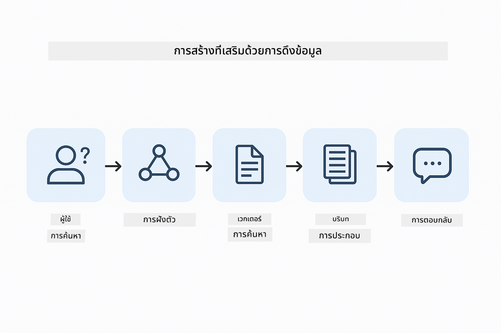
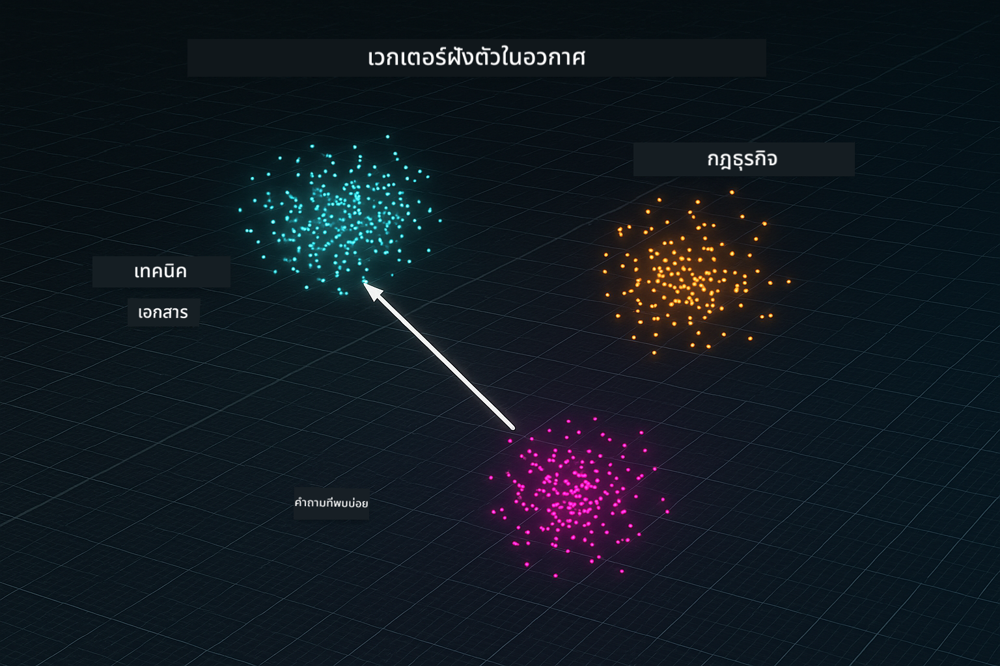
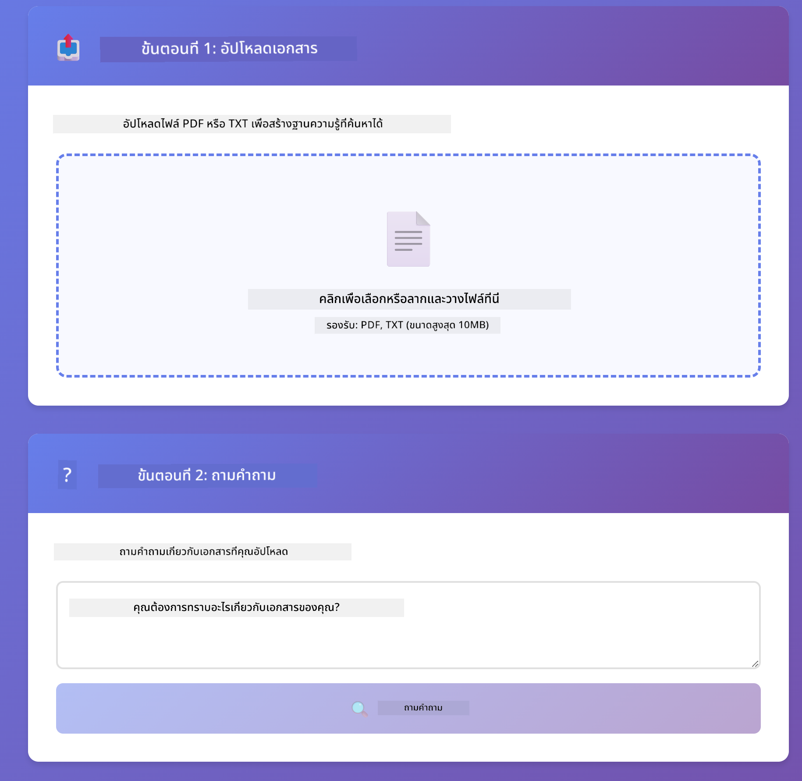

<!--
CO_OP_TRANSLATOR_METADATA:
{
  "original_hash": "81d087662fb3dd7b7124bce1a9c9ec86",
  "translation_date": "2026-01-05T23:32:04+00:00",
  "source_file": "03-rag/README.md",
  "language_code": "th"
}
-->
# Module 03: RAG (Retrieval-Augmented Generation)

## Table of Contents

- [What You'll Learn](../../../03-rag)
- [Prerequisites](../../../03-rag)
- [Understanding RAG](../../../03-rag)
- [How It Works](../../../03-rag)
  - [Document Processing](../../../03-rag)
  - [Creating Embeddings](../../../03-rag)
  - [Semantic Search](../../../03-rag)
  - [Answer Generation](../../../03-rag)
- [Run the Application](../../../03-rag)
- [Using the Application](../../../03-rag)
  - [Upload a Document](../../../03-rag)
  - [Ask Questions](../../../03-rag)
  - [Check Source References](../../../03-rag)
  - [Experiment with Questions](../../../03-rag)
- [Key Concepts](../../../03-rag)
  - [Chunking Strategy](../../../03-rag)
  - [Similarity Scores](../../../03-rag)
  - [In-Memory Storage](../../../03-rag)
  - [Context Window Management](../../../03-rag)
- [When RAG Matters](../../../03-rag)
- [Next Steps](../../../03-rag)

## What You'll Learn

ในโมดูลก่อนหน้านี้ คุณได้เรียนรู้วิธีการสนทนากับ AI และการจัดโครงสร้างพรอมต์ของคุณอย่างมีประสิทธิภาพ แต่มีข้อจำกัดพื้นฐานอย่างหนึ่ง: โมเดลภาษาเพียงรู้ในสิ่งที่ถูกฝึกมาเท่านั้น พวกมันไม่สามารถตอบคำถามเกี่ยวกับนโยบายของบริษัทของคุณ เอกสารโครงการของคุณ หรือข้อมูลใด ๆ ที่ไม่ได้ถูกฝึกมา

RAG (Retrieval-Augmented Generation) แก้ปัญหานี้ แทนที่จะพยายามสอนโมเดลด้วยข้อมูลของคุณ (ซึ่งใช้ทรัพยากรมากและทำได้ยาก) คุณให้โมเดลสามารถค้นหาข้อมูลจากเอกสารของคุณ เมื่อมีคนถามคำถาม ระบบจะค้นหาข้อมูลที่เกี่ยวข้องแล้วใส่เข้าไปในพรอมต์ โมเดลจึงตอบโดยอิงจากบริบทที่ถูกดึงมา

คิดว่า RAG เหมือนกับการให้โมเดลมีห้องสมุดอ้างอิง เมื่อคุณถามคำถาม ระบบจะ:

1. **User Query** - คุณถามคำถาม
2. **Embedding** - แปลงคำถามเป็นเวกเตอร์
3. **Vector Search** - ค้นหาเอกสารชิ้นส่วนที่คล้ายกัน
4. **Context Assembly** - เพิ่มชิ้นส่วนที่เกี่ยวข้องในพรอมต์
5. **Response** - LLM สร้างคำตอบตามบริบท

นี่ทำให้คำตอบของโมเดลมีฐานจากข้อมูลจริงของคุณ แทนที่จะอาศัยความรู้จากการฝึกสอนหรือเดาคำตอบ



*กระบวนการ RAG - จากคำถามของผู้ใช้ ไปสู่การค้นหาเชิงความหมาย และการสร้างคำตอบโดยอ้างอิงบริบท*

## Prerequisites

- ทำโมดูล 01 เสร็จแล้ว (ติดตั้งทรัพยากร Azure OpenAI)
- ไฟล์ `.env` ในไดเรกทอรีหลักที่มีข้อมูลรับรอง Azure (สร้างโดย `azd up` ในโมดูล 01)

> **หมายเหตุ:** หากคุณยังไม่ได้ทำโมดูล 01 ให้ทำตามคำแนะนำการติดตั้งที่นั่นก่อน

## How It Works

### Document Processing

[DocumentService.java](../../../03-rag/src/main/java/com/example/langchain4j/rag/service/DocumentService.java)

เมื่อคุณอัปโหลดเอกสาร ระบบจะแบ่งเอกสารออกเป็นชิ้นส่วนย่อย ๆ ขนาดเล็กพอเหมาะกับบริบทของโมเดล ชิ้นส่วนเหล่านี้จะทับซ้อนกันเล็กน้อยเพื่อไม่ให้สูญเสียบริบทบริเวณขอบเขต

```java
Document document = FileSystemDocumentLoader.loadDocument("sample-document.txt");

DocumentSplitter splitter = DocumentSplitters
    .recursive(300, 30, new OpenAiTokenizer());

List<TextSegment> segments = splitter.split(document);
```

> **🤖 ทดลองกับ [GitHub Copilot](https://github.com/features/copilot) แชท:** เปิด [`DocumentService.java`](../../../03-rag/src/main/java/com/example/langchain4j/rag/service/DocumentService.java) และถาม:
> - "LangChain4j แบ่งเอกสารเป็นชิ้นส่วนอย่างไรและเพราะเหตุใดการทับซ้อนจึงสำคัญ?"
> - "ขนาดชิ้นส่วนที่เหมาะสมสำหรับเอกสารแต่ละประเภทคือเท่าไหร่และทำไม?"
> - "ฉันควรจัดการกับเอกสารหลายภาษา หรือมีรูปแบบพิเศษอย่างไร?"

### Creating Embeddings

[LangChainRagConfig.java](../../../03-rag/src/main/java/com/example/langchain4j/rag/config/LangChainRagConfig.java)

แต่ละชิ้นส่วนจะถูกแปลงเป็นการแทนค่าตัวเลขที่เรียกว่า embedding ซึ่งเปรียบเสมือนลายนิ้วมือทางคณิตศาสตร์ที่ถ่ายทอดความหมายของข้อความ ข้อความที่คล้ายกันจะได้ embedding ที่คล้ายกัน

```java
@Bean
public EmbeddingModel embeddingModel() {
    return OpenAiOfficialEmbeddingModel.builder()
        .baseUrl(azureOpenAiEndpoint)
        .apiKey(azureOpenAiKey)
        .modelName(azureEmbeddingDeploymentName)
        .build();
}

EmbeddingStore<TextSegment> embeddingStore = 
    new InMemoryEmbeddingStore<>();
```



*เอกสารถูกแทนด้วยเวกเตอร์ในพื้นที่ embedding - เนื้อหาคล้ายกันจะอยู่ใกล้กัน*

### Semantic Search

[RagService.java](../../../03-rag/src/main/java/com/example/langchain4j/rag/service/RagService.java)

เมื่อคุณถามคำถาม คำถามนั้นเองจะถูกแปลงเป็น embedding ระบบจะเปรียบเทียบ embedding ของคำถามของคุณกับ embedding ของชิ้นส่วนเอกสารทั้งหมด ระบบจะหาชิ้นส่วนที่มีความหมายใกล้เคียงกันมากที่สุด — ไม่ใช่แค่คำหลักตรงกัน แต่เป็นความคล้ายคลึงเชิงความหมายจริง ๆ

```java
Embedding queryEmbedding = embeddingModel.embed(question).content();

List<EmbeddingMatch<TextSegment>> matches = 
    embeddingStore.findRelevant(queryEmbedding, 5, 0.7);

for (EmbeddingMatch<TextSegment> match : matches) {
    String relevantText = match.embedded().text();
    double score = match.score();
}
```

> **🤖 ทดลองกับ [GitHub Copilot](https://github.com/features/copilot) แชท:** เปิด [`RagService.java`](../../../03-rag/src/main/java/com/example/langchain4j/rag/service/RagService.java) และถาม:
> - "การค้นหาความคล้ายคลึงกันทำงานกับ embeddings อย่างไรและอะไรเป็นตัวกำหนดคะแนน?"
> - "ฉันควรกำหนดเกณฑ์ความคล้ายคลึงอย่างไรและมันส่งผลอย่างไรกับผลลัพธ์?"
> - "จะจัดการอย่างไรเมื่อไม่พบเอกสารที่เกี่ยวข้อง?"

### Answer Generation

[RagService.java](../../../03-rag/src/main/java/com/example/langchain4j/rag/service/RagService.java)

ชิ้นส่วนที่เกี่ยวข้องที่สุดจะถูกใส่ในพรอมต์ส่งให้โมเดล โมเดลอ่านเฉพาะชิ้นส่วนเหล่านั้นและตอบคำถามตามข้อมูลนั้น ซึ่งช่วยป้องกัน hallucination — โมเดลจะตอบได้แค่จากข้อมูลที่ถูกนำเสนออยู่เท่านั้น

## Run the Application

**ตรวจสอบการติดตั้ง:**

ตรวจสอบว่าไฟล์ `.env` อยู่ในไดเรกทอรีหลักและมีข้อมูลรับรอง Azure (ถูกสร้างในโมดูล 01):
```bash
cat ../.env  # ควรแสดง AZURE_OPENAI_ENDPOINT, API_KEY, DEPLOYMENT
```

**เริ่มแอปพลิเคชัน:**

> **หมายเหตุ:** หากคุณเริ่มแอปทั้งหมดด้วย `./start-all.sh` จากโมดูล 01 แล้ว โมดูลนี้จะรันที่พอร์ต 8081 อยู่แล้ว คุณสามารถข้ามคำสั่งเริ่มด้านล่างแล้วไปที่ http://localhost:8081 ได้เลย

**ตัวเลือก 1: ใช้ Spring Boot Dashboard (แนะนำสำหรับผู้ใช้ VS Code)**

Dev container มี Spring Boot Dashboard extension ซึ่งเป็นอินเทอร์เฟซสำหรับจัดการแอป Spring Boot ทั้งหมด คุณจะเจอมันใน Activity Bar ด้านซ้ายของ VS Code (หาสัญลักษณ์ Spring Boot)

จาก Spring Boot Dashboard คุณสามารถ:
- ดูแอป Spring Boot ทั้งหมดใน workspace
- เริ่ม/หยุดแอปด้วยคลิกเดียว
- ดูบันทึกแอปแบบเรียลไทม์
- ตรวจสอบสถานะแอป

แค่คลิกปุ่มเล่นข้าง "rag" เพื่อเริ่มโมดูลนี้ หรือจะเริ่มทุกโมดูลพร้อมกันก็ได้


**ตัวเลือก 2: ใช้ shell scripts**

เริ่มแอปเว็บทั้งหมด (โมดูล 01-04):

**Bash:**
```bash
cd ..  # จากไดเรกทอรีรูท
./start-all.sh
```

**PowerShell:**
```powershell
cd ..  # จากไดเรกทอรีรูท
.\start-all.ps1
```

หรือเริ่มแค่โมดูลนี้:

**Bash:**
```bash
cd 03-rag
./start.sh
```

**PowerShell:**
```powershell
cd 03-rag
.\start.ps1
```

สคริปต์ทั้งสองจะโหลด environment variables จากไฟล์ `.env` ใน root อัตโนมัติและจะ build JARs หากยังไม่มี

> **หมายเหตุ:** หากต้องการ build ทุกโมดูลด้วยตัวเองก่อนเริ่มทำงาน:
>
> **Bash:**
> ```bash
> cd ..  # Go to root directory
> mvn clean package -DskipTests
> ```
>
> **PowerShell:**
> ```powershell
> cd ..  # Go to root directory
> mvn clean package -DskipTests
> ```

เปิด http://localhost:8081 ในเบราว์เซอร์ของคุณ

**หยุดการทำงาน:**

**Bash:**
```bash
./stop.sh  # เฉพาะโมดูลนี้
# หรือ
cd .. && ./stop-all.sh  # ทุกโมดูล
```

**PowerShell:**
```powershell
.\stop.ps1  # โมดูลนี้เท่านั้น
# หรือ
cd ..; .\stop-all.ps1  # ทุกโมดูล
```

## Using the Application

แอปมาพร้อมอินเทอร์เฟซเว็บสำหรับอัปโหลดเอกสารและถามคำถาม

<a href="images/rag-homepage.png"></a>

*อินเทอร์เฟซแอป RAG - อัปโหลดเอกสารและถามคำถาม*

### Upload a Document

เริ่มต้นด้วยการอัปโหลดเอกสาร — ไฟล์ TXT เหมาะสำหรับการทดสอบ มีไฟล์ `sample-document.txt` ให้ในโฟลเดอร์นี้ซึ่งมีข้อมูลเกี่ยวกับฟีเจอร์ของ LangChain4j การใช้งาน RAG และแนวทางปฏิบัติที่ดีที่สุด — เหมาะสำหรับการทดสอบระบบ

ระบบจะประมวลผลเอกสาร แบ่งเป็นชิ้นส่วน และสร้าง embeddings สำหรับแต่ละชิ้นส่วน โดยทำงานอัตโนมัติเมื่อคุณอัปโหลด

### Ask Questions

ถามคำถามเฉพาะเจาะจงเกี่ยวกับเนื้อหาในเอกสาร ลองถามข้อเท็จจริงที่ระบุชัดเจนในเอกสาร ระบบจะค้นหาชิ้นส่วนที่เกี่ยวข้อง นำมาใส่ในพรอมต์ และสร้างคำตอบให้

### Check Source References

สังเกตว่าคำตอบแต่ละข้อจะมีแหล่งอ้างอิงพร้อมคะแนนความคล้ายคลึง คะแนนเหล่านี้ (0 ถึง 1) แสดงว่าชิ้นส่วนนั้นเกี่ยวข้องกับคำถามมากน้อยแค่ไหน คะแนนสูงแปลว่าแมตช์ดี นี่ช่วยให้คุณตรวจสอบคำตอบกับแหล่งข้อมูลจริง

<a href="images/rag-query-results.png"></a>

*ผลลัพธ์คำถามพร้อมคำตอบที่มีแหล่งอ้างอิงและคะแนนความเกี่ยวข้อง*

### Experiment with Questions

ลองถามคำถามประเภทต่าง ๆ:
- ข้อเท็จจริงเฉพาะ: "หัวข้อหลักคืออะไร?"
- การเปรียบเทียบ: "ความแตกต่างระหว่าง X กับ Y คืออะไร?"
- สรุป: "สรุปประเด็นสำคัญเกี่ยวกับ Z"

สังเกตวิธีที่คะแนนความเกี่ยวข้องเปลี่ยนไปตามความเข้ากันของคำถามกับเนื้อหาในเอกสาร

## Key Concepts

### Chunking Strategy

เอกสารถูกแบ่งเป็นชิ้นละ 300 โทเคนโดยมีทับซ้อน 30 โทเคน ความสมดุลนี้ทำให้แต่ละชิ้นมีบริบทเพียงพอและยังเล็กพอที่จะใส่หลายชิ้นลงในพรอมต์ได้

### Similarity Scores

คะแนนอยู่ระหว่าง 0 ถึง 1:
- 0.7-1.0: เกี่ยวข้องสูง ตรงกันเป๊ะ
- 0.5-0.7: เกี่ยวข้อง มีบริบทดี
- ต่ำกว่า 0.5: ถูกกรองออก ไม่คล้ายกันมาก

ระบบดึงเฉพาะชิ้นส่วนที่คะแนนสูงกว่าค่าตั้งไว้เพื่อคุณภาพ

### In-Memory Storage

โมดูลนี้ใช้การเก็บข้อมูลในหน่วยความจำเพื่อความเรียบง่าย เมื่อรีสตาร์ทแอปข้อมูลเอกสารที่อัปโหลดจะหายไป ระบบจริงใช้ฐานข้อมูลเวกเตอร์ถาวรเช่น Qdrant หรือ Azure AI Search

### Context Window Management

แต่ละโมเดลมีขนาดบริบทสูงสุด คุณไม่สามารถใส่ทุกชิ้นส่วนจากเอกสารขนาดใหญ่ได้ ระบบดึงชิ้นส่วนที่เกี่ยวข้องมากที่สุดจำนวน N (ค่าเริ่มต้น 5) เพื่อให้อยู่ในขอบเขตและมีบริบทเพียงพอสำหรับคำตอบที่แม่นยำ

## When RAG Matters

**ใช้ RAG เมื่อ:**
- ตอบคำถามเกี่ยวกับเอกสารที่เป็นกรรมสิทธิ์
- ข้อมูลเปลี่ยนแปลงบ่อย (นโยบาย ราคา สเปค)
- ต้องการความถูกต้องพร้อมแหล่งที่มา
- เนื้อหามากเกินกว่าจะใส่ในพรอมต์เดียว
- ต้องการคำตอบที่ตรวจสอบได้และมีฐานข้อมูลสนับสนุน

**อย่าใช้ RAG เมื่อ:**
- คำถามต้องการความรู้ทั่วไปที่โมเดลมีอยู่แล้ว
- ต้องการข้อมูลแบบเรียลไทม์ (RAG ทำงานบนเอกสารที่อัปโหลด)
- เนื้อหามีขนาดเล็กพอใส่ในพรอมต์โดยตรง

## Next Steps

**Next Module:** [04-tools - AI Agents with Tools](../04-tools/README.md)

---

**Navigation:** [← Previous: Module 02 - Prompt Engineering](../02-prompt-engineering/README.md) | [Back to Main](../README.md) | [Next: Module 04 - Tools →](../04-tools/README.md)

---

<!-- CO-OP TRANSLATOR DISCLAIMER START -->
**ข้อจำกัดความรับผิดชอบ**: เอกสารนี้ได้รับการแปลโดยใช้บริการแปลภาษา AI [Co-op Translator](https://github.com/Azure/co-op-translator) แม้เราจะพยายามให้ความถูกต้องสูงสุด แต่โปรดทราบว่าการแปลอัตโนมัติอาจมีข้อผิดพลาดหรือความคลาดเคลื่อนได้ เอกสารต้นฉบับในภาษาต้นฉบับถือเป็นแหล่งข้อมูลที่เป็นทางการ สำหรับข้อมูลที่สำคัญแนะนำให้ใช้บริการแปลโดยผู้เชี่ยวชาญด้านภาษามนุษย์ เราจะไม่รับผิดชอบต่อความเข้าใจผิดหรือการตีความที่ไม่ถูกต้องใด ๆ ที่เกิดจากการใช้การแปลนี้
<!-- CO-OP TRANSLATOR DISCLAIMER END -->