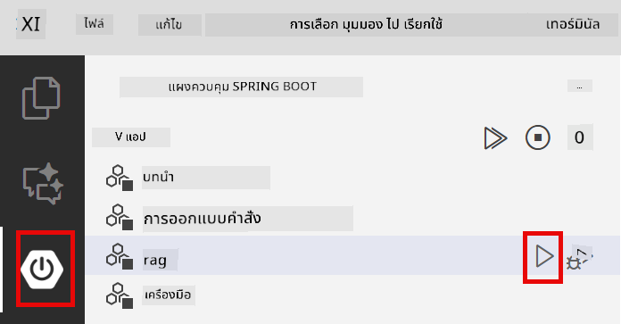

<!--
CO_OP_TRANSLATOR_METADATA:
{
  "original_hash": "f538a51cfd13147d40d84e936a0f485c",
  "translation_date": "2025-12-13T17:03:50+00:00",
  "source_file": "03-rag/README.md",
  "language_code": "th"
}
-->
# Module 03: RAG (Retrieval-Augmented Generation)

## Table of Contents

- [สิ่งที่คุณจะได้เรียนรู้](../../../03-rag)
- [ข้อกำหนดเบื้องต้น](../../../03-rag)
- [ทำความเข้าใจ RAG](../../../03-rag)
- [วิธีการทำงาน](../../../03-rag)
  - [การประมวลผลเอกสาร](../../../03-rag)
  - [การสร้าง Embeddings](../../../03-rag)
  - [การค้นหาเชิงความหมาย](../../../03-rag)
  - [การสร้างคำตอบ](../../../03-rag)
- [การรันแอปพลิเคชัน](../../../03-rag)
- [การใช้งานแอปพลิเคชัน](../../../03-rag)
  - [อัปโหลดเอกสาร](../../../03-rag)
  - [ถามคำถาม](../../../03-rag)
  - [ตรวจสอบแหล่งอ้างอิง](../../../03-rag)
  - [ทดลองถามคำถาม](../../../03-rag)
- [แนวคิดสำคัญ](../../../03-rag)
  - [กลยุทธ์การแบ่งชิ้นส่วน](../../../03-rag)
  - [คะแนนความคล้ายคลึง](../../../03-rag)
  - [การจัดเก็บในหน่วยความจำ](../../../03-rag)
  - [การจัดการหน้าต่างบริบท](../../../03-rag)
- [เมื่อใดที่ RAG มีความสำคัญ](../../../03-rag)
- [ขั้นตอนถัดไป](../../../03-rag)

## What You'll Learn

ในโมดูลก่อนหน้านี้ คุณได้เรียนรู้วิธีการสนทนากับ AI และการจัดโครงสร้างคำสั่งอย่างมีประสิทธิภาพ แต่มีข้อจำกัดพื้นฐาน: โมเดลภาษาเรียนรู้ได้เฉพาะสิ่งที่ได้รับการฝึกฝนมาเท่านั้น พวกมันไม่สามารถตอบคำถามเกี่ยวกับนโยบายของบริษัทคุณ เอกสารโครงการของคุณ หรือข้อมูลใด ๆ ที่ไม่ได้ถูกฝึกสอน

RAG (Retrieval-Augmented Generation) แก้ปัญหานี้ แทนที่จะพยายามสอนโมเดลด้วยข้อมูลของคุณ (ซึ่งมีค่าใช้จ่ายสูงและไม่เหมาะสม) คุณให้โมเดลสามารถค้นหาข้อมูลจากเอกสารของคุณ เมื่อมีคนถามคำถาม ระบบจะค้นหาข้อมูลที่เกี่ยวข้องและรวมไว้ในคำสั่ง โมเดลจึงตอบคำถามโดยอิงจากบริบทที่ถูกดึงมา

คิดว่า RAG เป็นการให้โมเดลมีห้องสมุดอ้างอิง เมื่อคุณถามคำถาม ระบบจะ:

1. **คำถามของผู้ใช้** - คุณถามคำถาม
2. **การสร้าง Embedding** - แปลงคำถามเป็นเวกเตอร์
3. **การค้นหาเวกเตอร์** - ค้นหาชิ้นส่วนเอกสารที่คล้ายกัน
4. **การประกอบบริบท** - เพิ่มชิ้นส่วนที่เกี่ยวข้องในคำสั่ง
5. **การตอบกลับ** - LLM สร้างคำตอบโดยอิงจากบริบท

นี่ทำให้คำตอบของโมเดลมีพื้นฐานจากข้อมูลจริงของคุณ แทนที่จะพึ่งพาความรู้จากการฝึกสอนหรือการสร้างคำตอบขึ้นมาเอง


*กระบวนการทำงานของ RAG - จากคำถามผู้ใช้ไปสู่การค้นหาเชิงความหมายและการสร้างคำตอบโดยมีบริบท*

## Prerequisites

- ทำโมดูล 01 เสร็จสมบูรณ์ (ทรัพยากร Azure OpenAI ถูกติดตั้งแล้ว)
- ไฟล์ `.env` ในไดเรกทอรีหลักที่มีข้อมูลรับรอง Azure (สร้างโดย `azd up` ในโมดูล 01)

> **หมายเหตุ:** หากคุณยังไม่ได้ทำโมดูล 01 ให้ทำตามคำแนะนำการติดตั้งที่นั่นก่อน

## How It Works

**การประมวลผลเอกสาร** - [DocumentService.java](../../../03-rag/src/main/java/com/example/langchain4j/rag/service/DocumentService.java)

เมื่อคุณอัปโหลดเอกสาร ระบบจะแบ่งเอกสารเป็นชิ้นส่วนเล็ก ๆ ที่พอดีกับหน้าต่างบริบทของโมเดล ชิ้นส่วนเหล่านี้จะทับซ้อนกันเล็กน้อยเพื่อไม่ให้สูญเสียบริบทที่ขอบเขต

```java
Document document = FileSystemDocumentLoader.loadDocument("sample-document.txt");

DocumentSplitter splitter = DocumentSplitters
    .recursive(300, 30, new OpenAiTokenizer());

List<TextSegment> segments = splitter.split(document);
```

> **🤖 ลองใช้ [GitHub Copilot](https://github.com/features/copilot) Chat:** เปิด [`DocumentService.java`](../../../03-rag/src/main/java/com/example/langchain4j/rag/service/DocumentService.java) และถาม:
> - "LangChain4j แบ่งเอกสารเป็นชิ้นส่วนอย่างไรและทำไมการทับซ้อนจึงสำคัญ?"
> - "ขนาดชิ้นส่วนที่เหมาะสมสำหรับเอกสารประเภทต่าง ๆ คือเท่าไหร่และเพราะเหตุใด?"
> - "ฉันจะจัดการกับเอกสารที่มีหลายภาษา หรือมีรูปแบบพิเศษอย่างไร?"

**การสร้าง Embeddings** - [LangChainRagConfig.java](../../../03-rag/src/main/java/com/example/langchain4j/rag/config/LangChainRagConfig.java)

แต่ละชิ้นส่วนจะถูกแปลงเป็นตัวแทนเชิงตัวเลขที่เรียกว่า embedding ซึ่งเป็นลายนิ้วมือทางคณิตศาสตร์ที่จับความหมายของข้อความ ข้อความที่มีความหมายใกล้เคียงกันจะสร้าง embeddings ที่คล้ายกัน

```java
@Bean
public EmbeddingModel embeddingModel() {
    return OpenAiOfficialEmbeddingModel.builder()
        .baseUrl(azureOpenAiEndpoint)
        .apiKey(azureOpenAiKey)
        .modelName(azureEmbeddingDeploymentName)
        .build();
}

EmbeddingStore<TextSegment> embeddingStore = 
    new InMemoryEmbeddingStore<>();
```


*เอกสารถูกแทนด้วยเวกเตอร์ในพื้นที่ embedding - เนื้อหาที่คล้ายกันจะรวมกลุ่มกัน*

**การค้นหาเชิงความหมาย** - [RagService.java](../../../03-rag/src/main/java/com/example/langchain4j/rag/service/RagService.java)

เมื่อคุณถามคำถาม คำถามของคุณจะถูกแปลงเป็น embedding ระบบจะเปรียบเทียบ embedding ของคำถามกับ embeddings ของชิ้นส่วนเอกสารทั้งหมด เพื่อค้นหาชิ้นส่วนที่มีความหมายใกล้เคียงที่สุด — ไม่ใช่แค่คำสำคัญที่ตรงกัน แต่เป็นความคล้ายคลึงเชิงความหมายจริง ๆ

```java
Embedding queryEmbedding = embeddingModel.embed(question).content();

List<EmbeddingMatch<TextSegment>> matches = 
    embeddingStore.findRelevant(queryEmbedding, 5, 0.7);

for (EmbeddingMatch<TextSegment> match : matches) {
    String relevantText = match.embedded().text();
    double score = match.score();
}
```

> **🤖 ลองใช้ [GitHub Copilot](https://github.com/features/copilot) Chat:** เปิด [`RagService.java`](../../../03-rag/src/main/java/com/example/langchain4j/rag/service/RagService.java) และถาม:
> - "การค้นหาความคล้ายคลึงทำงานอย่างไรกับ embeddings และอะไรเป็นตัวกำหนดคะแนน?"
> - "ฉันควรใช้เกณฑ์ความคล้ายคลึงเท่าไหร่และมันส่งผลต่อผลลัพธ์อย่างไร?"
> - "ฉันจะจัดการกับกรณีที่ไม่พบเอกสารที่เกี่ยวข้องได้อย่างไร?"

**การสร้างคำตอบ** - [RagService.java](../../../03-rag/src/main/java/com/example/langchain4j/rag/service/RagService.java)

ชิ้นส่วนที่เกี่ยวข้องที่สุดจะถูกรวมไว้ในคำสั่งส่งให้โมเดล โมเดลจะอ่านชิ้นส่วนนั้นและตอบคำถามของคุณโดยอิงจากข้อมูลนี้ ซึ่งช่วยป้องกันการสร้างคำตอบที่ไม่ถูกต้อง — โมเดลจะตอบได้เฉพาะจากข้อมูลที่มีอยู่เท่านั้น

## Run the Application

**ตรวจสอบการติดตั้ง:**

ตรวจสอบว่าไฟล์ `.env` มีอยู่ในไดเรกทอรีหลักพร้อมข้อมูลรับรอง Azure (สร้างในโมดูล 01):
```bash
cat ../.env  # ควรแสดง AZURE_OPENAI_ENDPOINT, API_KEY, DEPLOYMENT
```

**เริ่มแอปพลิเคชัน:**

> **หมายเหตุ:** หากคุณเริ่มแอปพลิเคชันทั้งหมดด้วย `./start-all.sh` จากโมดูล 01 แล้ว โมดูลนี้จะรันอยู่ที่พอร์ต 8081 คุณสามารถข้ามคำสั่งเริ่มด้านล่างและไปที่ http://localhost:8081 ได้เลย

**ตัวเลือกที่ 1: ใช้ Spring Boot Dashboard (แนะนำสำหรับผู้ใช้ VS Code)**

คอนเทนเนอร์ dev มีส่วนขยาย Spring Boot Dashboard ซึ่งให้หน้าต่างแสดงผลแบบกราฟิกสำหรับจัดการแอปพลิเคชัน Spring Boot ทั้งหมด คุณสามารถหาได้ที่แถบกิจกรรมด้านซ้ายของ VS Code (มองหาไอคอน Spring Boot)

จาก Spring Boot Dashboard คุณสามารถ:
- ดูแอปพลิเคชัน Spring Boot ทั้งหมดใน workspace
- เริ่ม/หยุดแอปพลิเคชันด้วยคลิกเดียว
- ดูบันทึกแอปพลิเคชันแบบเรียลไทม์
- ตรวจสอบสถานะแอปพลิเคชัน

เพียงคลิกปุ่มเล่นข้าง "rag" เพื่อเริ่มโมดูลนี้ หรือเริ่มทุกโมดูลพร้อมกัน



**ตัวเลือกที่ 2: ใช้สคริปต์ shell**

เริ่มแอปพลิเคชันเว็บทั้งหมด (โมดูล 01-04):

**Bash:**
```bash
cd ..  # จากไดเรกทอรีรูท
./start-all.sh
```

**PowerShell:**
```powershell
cd ..  # จากไดเรกทอรีรูท
.\start-all.ps1
```

หรือเริ่มแค่โมดูลนี้:

**Bash:**
```bash
cd 03-rag
./start.sh
```

**PowerShell:**
```powershell
cd 03-rag
.\start.ps1
```

ทั้งสองสคริปต์จะโหลดตัวแปรสภาพแวดล้อมจากไฟล์ `.env` ในไดเรกทอรีหลักโดยอัตโนมัติ และจะสร้างไฟล์ JAR หากยังไม่มี

> **หมายเหตุ:** หากคุณต้องการสร้างโมดูลทั้งหมดด้วยตนเองก่อนเริ่ม:
>
> **Bash:**
> ```bash
> cd ..  # Go to root directory
> mvn clean package -DskipTests
> ```
>
> **PowerShell:**
> ```powershell
> cd ..  # Go to root directory
> mvn clean package -DskipTests
> ```

เปิด http://localhost:8081 ในเบราว์เซอร์ของคุณ

**เพื่อหยุด:**

**Bash:**
```bash
./stop.sh  # โมดูลนี้เท่านั้น
# หรือ
cd .. && ./stop-all.sh  # ทุกโมดูล
```

**PowerShell:**
```powershell
.\stop.ps1  # โมดูลนี้เท่านั้น
# หรือ
cd ..; .\stop-all.ps1  # ทุกโมดูล
```

## Using the Application

แอปพลิเคชันมีอินเทอร์เฟซเว็บสำหรับอัปโหลดเอกสารและถามคำถาม

<a href="images/rag-homepage.png"></a>

*อินเทอร์เฟซแอปพลิเคชัน RAG - อัปโหลดเอกสารและถามคำถาม*

**อัปโหลดเอกสาร**

เริ่มต้นด้วยการอัปโหลดเอกสาร — ไฟล์ TXT เหมาะสำหรับการทดสอบ มีไฟล์ `sample-document.txt` ในไดเรกทอรีนี้ที่มีข้อมูลเกี่ยวกับฟีเจอร์ของ LangChain4j การใช้งาน RAG และแนวทางปฏิบัติที่ดีที่สุด — เหมาะสำหรับทดสอบระบบ

ระบบจะประมวลผลเอกสารของคุณ แบ่งเป็นชิ้นส่วน และสร้าง embeddings สำหรับแต่ละชิ้นส่วนโดยอัตโนมัติเมื่อคุณอัปโหลด

**ถามคำถาม**

ตอนนี้ถามคำถามเฉพาะเจาะจงเกี่ยวกับเนื้อหาในเอกสาร ลองถามข้อเท็จจริงที่ระบุชัดเจนในเอกสาร ระบบจะค้นหาชิ้นส่วนที่เกี่ยวข้อง รวมไว้ในคำสั่ง และสร้างคำตอบ

**ตรวจสอบแหล่งอ้างอิง**

สังเกตว่าคำตอบแต่ละข้อจะมีแหล่งอ้างอิงพร้อมคะแนนความคล้ายคลึง คะแนนเหล่านี้ (0 ถึง 1) แสดงว่าชิ้นส่วนนั้นเกี่ยวข้องกับคำถามของคุณมากน้อยแค่ไหน คะแนนสูงหมายถึงการจับคู่ที่ดี ซึ่งช่วยให้คุณตรวจสอบคำตอบกับแหล่งข้อมูลต้นทางได้

<a href="images/rag-query-results.png"></a>

*ผลลัพธ์การค้นหาแสดงคำตอบพร้อมแหล่งอ้างอิงและคะแนนความเกี่ยวข้อง*

**ทดลองถามคำถาม**

ลองถามคำถามหลายประเภท:
- ข้อเท็จจริงเฉพาะ: "หัวข้อหลักคืออะไร?"
- การเปรียบเทียบ: "ความแตกต่างระหว่าง X กับ Y คืออะไร?"
- สรุป: "สรุปประเด็นสำคัญเกี่ยวกับ Z"

สังเกตว่าคะแนนความเกี่ยวข้องเปลี่ยนแปลงอย่างไรตามความเหมาะสมของคำถามกับเนื้อหาเอกสาร

## Key Concepts

**กลยุทธ์การแบ่งชิ้นส่วน**

เอกสารถูกแบ่งเป็นชิ้นส่วนละ 300 โทเค็น โดยมีการทับซ้อน 30 โทเค็น สมดุลนี้ช่วยให้แต่ละชิ้นส่วนมีบริบทเพียงพอที่จะมีความหมาย ในขณะที่ยังเล็กพอที่จะรวมหลายชิ้นส่วนในคำสั่งได้

**คะแนนความคล้ายคลึง**

คะแนนอยู่ในช่วง 0 ถึง 1:
- 0.7-1.0: เกี่ยวข้องสูง ตรงกันเป๊ะ
- 0.5-0.7: เกี่ยวข้อง มีบริบทดี
- ต่ำกว่า 0.5: ถูกกรองออก เพราะไม่คล้ายกันพอ

ระบบจะดึงชิ้นส่วนที่มีคะแนนเกินเกณฑ์ขั้นต่ำเท่านั้นเพื่อให้ได้คุณภาพ

**การจัดเก็บในหน่วยความจำ**

โมดูลนี้ใช้การจัดเก็บในหน่วยความจำเพื่อความเรียบง่าย เมื่อคุณรีสตาร์ทแอปพลิเคชัน เอกสารที่อัปโหลดจะหายไป ระบบในสภาพแวดล้อมจริงจะใช้ฐานข้อมูลเวกเตอร์ถาวร เช่น Qdrant หรือ Azure AI Search

**การจัดการหน้าต่างบริบท**

แต่ละโมเดลมีขนาดหน้าต่างบริบทสูงสุด คุณไม่สามารถใส่ชิ้นส่วนทั้งหมดจากเอกสารขนาดใหญ่ได้ ระบบจะดึงชิ้นส่วนที่เกี่ยวข้องมากที่สุดจำนวน N ชิ้น (ค่าเริ่มต้น 5 ชิ้น) เพื่อให้อยู่ในขีดจำกัดและให้บริบทเพียงพอสำหรับคำตอบที่แม่นยำ

## When RAG Matters

**ใช้ RAG เมื่อ:**
- ต้องตอบคำถามเกี่ยวกับเอกสารลิขสิทธิ์
- ข้อมูลเปลี่ยนแปลงบ่อย (นโยบาย ราคา สเปค)
- ต้องการความแม่นยำพร้อมแหล่งอ้างอิง
- เนื้อหามีขนาดใหญ่เกินกว่าจะใส่ในคำสั่งเดียว
- ต้องการคำตอบที่ตรวจสอบได้และมีพื้นฐาน

**ไม่ใช้ RAG เมื่อ:**
- คำถามต้องการความรู้ทั่วไปที่โมเดลมีอยู่แล้ว
- ต้องการข้อมูลแบบเรียลไทม์ (RAG ทำงานกับเอกสารที่อัปโหลด)
- เนื้อหามีขนาดเล็กพอที่จะใส่ในคำสั่งโดยตรง

## Next Steps

**โมดูลถัดไป:** [04-tools - AI Agents with Tools](../04-tools/README.md)

---

**การนำทาง:** [← ก่อนหน้า: Module 02 - Prompt Engineering](../02-prompt-engineering/README.md) | [กลับสู่หน้าหลัก](../README.md) | [ถัดไป: Module 04 - Tools →](../04-tools/README.md)

---

<!-- CO-OP TRANSLATOR DISCLAIMER START -->
**ข้อจำกัดความรับผิดชอบ**:  
เอกสารนี้ได้รับการแปลโดยใช้บริการแปลภาษาอัตโนมัติ [Co-op Translator](https://github.com/Azure/co-op-translator) แม้เราจะพยายามให้ความถูกต้องสูงสุด แต่โปรดทราบว่าการแปลอัตโนมัติอาจมีข้อผิดพลาดหรือความไม่ถูกต้อง เอกสารต้นฉบับในภาษาต้นทางถือเป็นแหล่งข้อมูลที่เชื่อถือได้ สำหรับข้อมูลที่สำคัญ ขอแนะนำให้ใช้บริการแปลโดยผู้เชี่ยวชาญมนุษย์ เราไม่รับผิดชอบต่อความเข้าใจผิดหรือการตีความผิดใด ๆ ที่เกิดจากการใช้การแปลนี้
<!-- CO-OP TRANSLATOR DISCLAIMER END -->