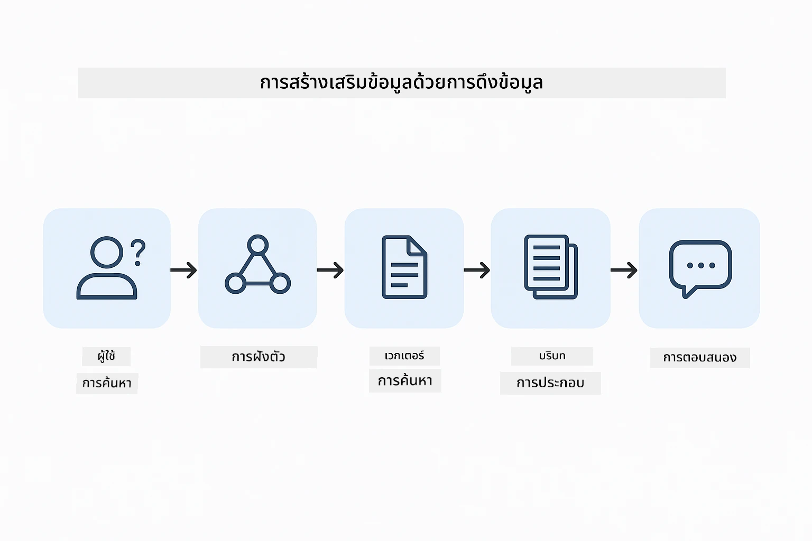
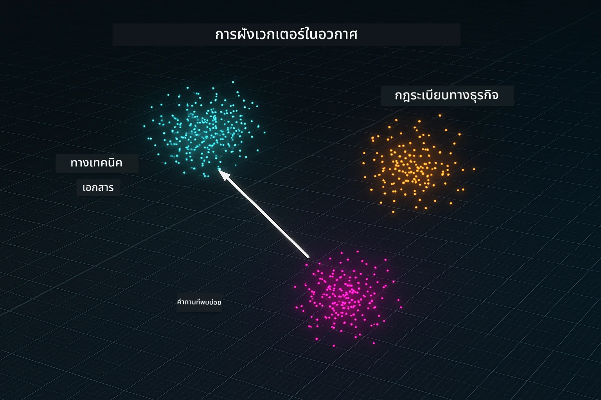
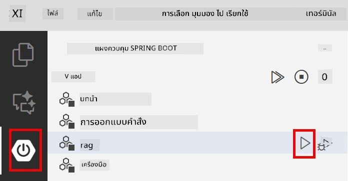
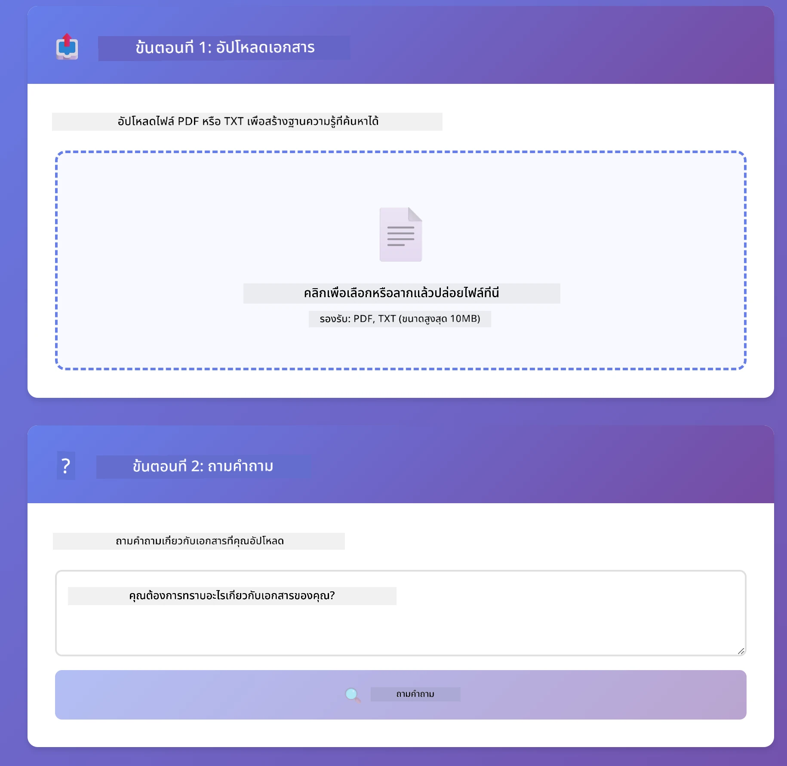
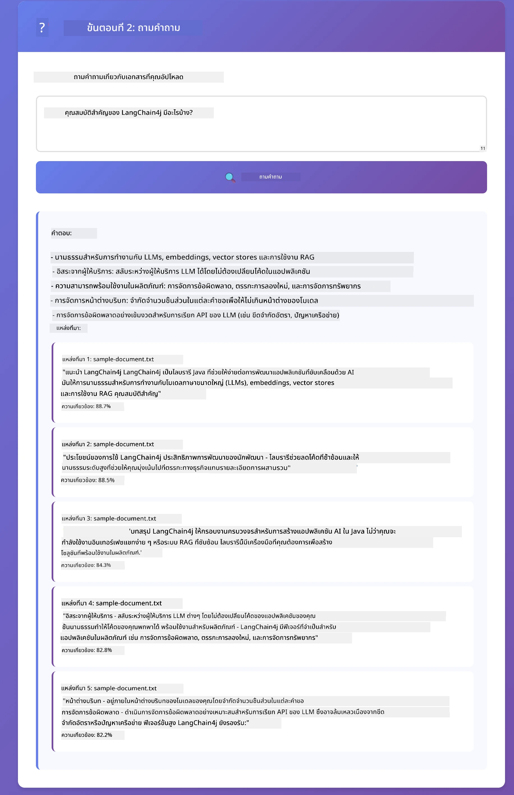

# Module 03: RAG (Retrieval-Augmented Generation)

## Table of Contents

- [Video Walkthrough](#video-walkthrough)
- [What You'll Learn](#what-youll-learn)
- [Prerequisites](#prerequisites)
- [Understanding RAG](#understanding-rag)
  - [Which RAG Approach Does This Tutorial Use?](#which-rag-approach-does-this-tutorial-use)
- [How It Works](#how-it-works)
  - [Document Processing](#document-processing)
  - [Creating Embeddings](#creating-embeddings)
  - [Semantic Search](#semantic-search)
  - [Answer Generation](#การสร้างคำตอบ)
- [Run the Application](#รันแอปพลิเคชัน)
- [Using the Application](#การใช้แอปพลิเคชัน)
  - [Upload a Document](#อัปโหลดเอกสาร)
  - [Ask Questions](#ถามคำถาม)
  - [Check Source References](#ตรวจสอบการอ้างอิงแหล่งที่มา)
  - [Experiment with Questions](#ทดลองถามคำถามต่าง-ๆ)
- [Key Concepts](#แนวคิดสำคัญ)
  - [Chunking Strategy](#ยุทธศาสตร์การแบ่งชิ้น)
  - [Similarity Scores](#คะแนนความคล้ายคลึง)
  - [In-Memory Storage](#การเก็บข้อมูลในหน่วยความจำ)
  - [Context Window Management](#การจัดการหน้าต่างบริบท)
- [When RAG Matters](#เมื่อไหร่ที่-rag-มีความสำคัญ)
- [Next Steps](#ก้าวต่อไป)

## Video Walkthrough

ชมการสาธิตสดนี้ที่อธิบายวิธีเริ่มต้นกับโมดูลนี้:

<a href="https://www.youtube.com/watch?v=_olq75ZH_eY"></a>

## What You'll Learn

ในโมดูลก่อนหน้า คุณได้เรียนรู้วิธีพูดคุยกับ AI และจัดโครงสร้างคำสั่งอย่างมีประสิทธิภาพ แต่มีข้อจำกัดพื้นฐาน: โมเดลภาษาเพียงรู้ในสิ่งที่เรียนรู้ระหว่างการฝึกเท่านั้น มันไม่สามารถตอบคำถามเกี่ยวกับนโยบายบริษัทของคุณ เอกสารโครงการของคุณ หรือข้อมูลใด ๆ ที่ไม่ได้ถูกฝึกมา

RAG (Retrieval-Augmented Generation) แก้ปัญหานี้ แทนที่จะพยายามสอนโมเดลด้วยข้อมูลของคุณ (ซึ่งแพงและไม่ใช่เรื่องปฏิบัติได้) คุณให้มันสามารถค้นหาข้อมูลจากเอกสารของคุณ เมื่อใครสักคนถามคำถาม ระบบจะหาข้อมูลที่เกี่ยวข้องและรวมไว้ในคำสั่ง โมเดลจึงตอบตามบริบทที่ถูกดึงมา

คิดว่า RAG เป็นการให้โมเดลมีห้องสมุดอ้างอิง เมื่อคุณถามคำถาม ระบบจะ:

1. **User Query** - คุณถามคำถาม
2. **Embedding** - แปลงคำถามของคุณเป็นเวกเตอร์
3. **Vector Search** - หาชิ้นส่วนเอกสารที่เหมือนกัน
4. **Context Assembly** - เติมชิ้นส่วนที่เกี่ยวข้องเข้าไปในคำสั่ง
5. **Response** - LLM สร้างคำตอบตามบริบทนั้น

สิ่งนี้ช่วยให้คำตอบของโมเดลมีฐานในข้อมูลจริงของคุณแทนที่จะพึ่งพาความรู้ที่ได้จากการฝึกหรือสร้างคำตอบขึ้นมาเอง

## Prerequisites

- เสร็จสิ้น [Module 01 - Introduction](../01-introduction/README.md) (ทรัพยากร Azure OpenAI ถูกปรับใช้ รวมถึงโมเดลฝังตัว `text-embedding-3-small`)
- มีไฟล์ `.env` ในไดเรกทอรีหลักพร้อมข้อมูลรับรอง Azure (สร้างโดยคำสั่ง `azd up` ใน Module 01)

> **Note:** หากคุณยังไม่เสร็จ Module 01 กรุณาทำตามคำแนะนำการปรับใช้ที่นั่นก่อน คำสั่ง `azd up` จะปรับใช้โมเดลแชท GPT และโมเดลฝังตัวที่โมดูลนี้ใช้

## Understanding RAG

แผนภาพด้านล่างแสดงแนวคิดหลัก: แทนที่จะพึ่งพาข้อมูลการฝึกของโมเดลเพียงอย่างเดียว RAG ให้โมเดลมีห้องสมุดอ้างอิงจากเอกสารของคุณเพื่อปรึกษาก่อนสร้างคำตอบแต่ละครั้ง


*แผนภาพนี้แสดงความแตกต่างระหว่าง LLM ปกติ (เดาจากข้อมูลการฝึก) กับ LLM ที่มี RAG (ปรึกษาเอกสารของคุณก่อน)*

นี่คือการเชื่อมต่อส่วนประกอบตั้งแต่ต้นจนจบ คำถามของผู้ใช้ไหลผ่านสี่ขั้นตอน — การฝังตัว, การค้นหาเวกเตอร์, การประกอบบริบท, และการสร้างคำตอบ — ทุกขั้นตอนสร้างต่อกัน:



*แผนภาพนี้แสดงกระบวนการ RAG ตั้งแต่ต้นจนจบ — คำถามของผู้ใช้ไหลผ่านการฝังตัว, การค้นหาเวกเตอร์, การประกอบบริบท, และการสร้างคำตอบ*

ส่วนที่เหลือของโมดูลนี้จะอธิบายแต่ละขั้นตอนโดยละเอียด พร้อมด้วยโค้ดที่คุณสามารถรันและแก้ไขได้

### Which RAG Approach Does This Tutorial Use?

LangChain4j มีวิธีการใช้ RAG สามวิธี แต่ละวิธีมีระดับนามธรรมแตกต่างกัน แผนภาพด้านล่างเปรียบเทียบแต่ละวิธีใบข้างกัน:


*แผนภาพนี้เปรียบเทียบสามวิธี RAG ใน LangChain4j — Easy, Native, และ Advanced — แสดงส่วนประกอบหลักและช่วงเวลาที่ควรใช้*

| Approach | What It Does | Trade-off |
|---|---|---|
| **Easy RAG** | เชื่อมทุกอย่างโดยอัตโนมัติผ่าน `AiServices` และ `ContentRetriever` คุณทำการระบุ interface, แนบ retriever, แล้ว LangChain4j ดูแลการฝังตัว, การค้นหา, และการประกอบคำสั่งเบื้องหลัง | โค้ดน้อย แต่คุณจะไม่เห็นสิ่งที่เกิดขึ้นในแต่ละขั้นตอน |
| **Native RAG** | คุณเรียกโมเดลฝังตัว, ค้นหาในร้านค้า, สร้างคำสั่ง, และสร้างคำตอบเอง — ทีละขั้นตอนอย่างชัดเจน | โค้ดมากขึ้น แต่ทุกขั้นตอนเห็นได้และปรับได้ |
| **Advanced RAG** | ใช้เฟรมเวิร์ก `RetrievalAugmentor` ที่มีตัวแปลงคำถาม, ตัวนำทาง, ตัวจัดอันดับใหม่ และตัวฉีดเนื้อหาที่เสียบได้ สำหรับระบบระดับผลิต | ยืดหยุ่นสูงสุด แต่ซับซ้อนมากกว่า |

**บทเรียนนี้ใช้วิธี Native** ขั้นตอนแต่ละส่วนของ pipeline RAG — ฝังตัวคำถาม, ค้นหาจากร้านเวกเตอร์, ประกอบบริบท, สร้างคำตอบ — ถูกเขียนออกมาอย่างชัดเจนใน [`RagService.java`](../../../03-rag/src/main/java/com/example/langchain4j/rag/service/RagService.java) นี่เป็นเจตนา: ในฐานะแหล่งเรียนรู้ สิ่งสำคัญกว่าคือคุณเห็นและเข้าใจแต่ละขั้นตอนมากกว่าการย่นโค้ด เมื่อคุณคุ้นเคยกับวิธีประกอบส่วนต่าง ๆ แล้ว คุณสามารถย้ายไปใช้ Easy RAG สำหรับต้นแบบรวดเร็ว หรือ Advanced RAG สำหรับระบบผลิตได้

> **💡 สนใจ Easy RAG ไหม?** LangChain4j ยังมีวิธี Easy RAG ที่ใช้ `AiServices` กับ `ContentRetriever` ดูแลการฝังตัว, การค้นหา และการประกอบคำสั่งแบบอัตโนมัติ โมดูลนี้เลือกทางชัดเจนกว่านั้น — เปิด pipeline เพื่อคุณเห็นและควบคุมแต่ละขั้นตอนเอง

แผนภาพด้านล่างแสดง pipeline Easy RAG สังเกตว่า `AiServices` และ `EmbeddingStoreContentRetriever` ซ่อนความซับซ้อนทั้งหมด — คุณโหลดเอกสาร, แนบ retriever, และได้คำตอบ วิธี Native ในโมดูลนี้เปิดทุกขั้นตอนที่ซ่อน:


*แผนภาพนี้แสดง pipeline Easy RAG เปรียบเทียบกับ Native ที่โมดูลนี้ใช้: Easy RAG ซ่อนการฝังตัว, การค้นหา, การประกอบคำสั่ง ไว้ใน `AiServices` และ `ContentRetriever` — คุณโหลดเอกสาร, แนบ retriever, และได้คำตอบ Native เปิด pipeline เพื่อให้คุณเรียกแต่ละขั้นตอน (ฝัง, ค้นหา, ประกอบบริบท, สร้างคำตอบ) เอง โดยให้มองเห็นและควบคุมครบถ้วน*

## How It Works

Pipeline RAG ในโมดูลนี้แบ่งออกเป็นสี่ขั้นตอนที่ทำงานต่อเนื่องทุกครั้งที่ผู้ใช้ถามคำถาม ขั้นแรก เอกสารที่อัปโหลดจะถูก **แยกและแบ่งเป็นส่วนเล็ก ๆ** ที่จัดการได้ งวดเหล่านั้นจะถูกแปลงเป็น **เวกเตอร์ฝังตัว** และเก็บไว้เพื่อให้เปรียบเทียบทางคณิตศาสตร์ได้ เมื่อมีคำถาม ระบบจะทำ **การค้นหาเชิงความหมาย** เพื่อหางวดที่เกี่ยวข้องมากที่สุด และสุดท้ายส่งผ่านคลุมบริบทไปยัง LLM เพื่อ **สร้างคำตอบ** ส่วนถัดไปจะอธิบายแต่ละขั้นตอนพร้อมโค้ดและแผนภาพ มาดูขั้นตอนแรกกัน

### Document Processing

[DocumentService.java](../../../03-rag/src/main/java/com/example/langchain4j/rag/service/DocumentService.java)

เมื่อคุณอัปโหลดเอกสาร ระบบจะทำการแยกวิเคราะห์ (PDF หรือข้อความธรรมดา) แนบข้อมูลเมตา เช่น ชื่อไฟล์ แล้วแบ่งออกเป็นชิ้นเล็ก ๆ — ชิ้นเล็กที่สามารถใส่ใน context window ของโมเดลได้ง่าย ชิ้นเหล่านี้จะทับซ้อนกันเล็กน้อยเพื่อไม่ให้เสียบริบทตรงขอบเขต

```java
// แยกวิเคราะห์ไฟล์ที่อัปโหลดและห่อหุ้มในเอกสาร LangChain4j
Document document = Document.from(content, metadata);

// แบ่งเป็นชิ้นขนาด 300 โทเค็นโดยมีการทับซ้อน 30 โทเค็น
DocumentSplitter splitter = DocumentSplitters
    .recursive(300, 30);

List<TextSegment> segments = splitter.split(document);
```

แผนภาพด้านล่างแสดงการทำงานนี้อย่างเป็นภาพ สังเกตว่าชิ้นแต่ละชิ้นจะแบ่งปันโทเคนบางส่วนกับเพื่อนบ้าน — ทับซ้อนกัน 30 โทเคนเพื่อให้บริบทสำคัญไม่ถูกละเลยที่ขอบเขต:


*แผนภาพนี้แสดงการแบ่งเอกสารเป็นชิ้นขนาด 300 โทเคนที่ทับซ้อน 30 โทเคน เพื่อรักษาบริบทที่ขอบเขตชิ้นงาน*

> **🤖 ลองกับ [GitHub Copilot](https://github.com/features/copilot) Chat:** เปิด [`DocumentService.java`](../../../03-rag/src/main/java/com/example/langchain4j/rag/service/DocumentService.java) แล้วถามว่า:
> - "LangChain4j แบ่งเอกสารเป็นชิ้นอย่างไรและทำไมต้องทับซ้อน"
> - "ขนาดชิ้นที่เหมาะสมสำหรับประเภทเอกสารต่าง ๆ คือเท่าไรและเพราะเหตุใด"
> - "จะจัดการเอกสารหลายภาษา หรือที่มีรูปแบบพิเศษได้อย่างไร"

### Creating Embeddings

[LangChainRagConfig.java](../../../03-rag/src/main/java/com/example/langchain4j/rag/config/LangChainRagConfig.java)

ชิ้นส่วนแต่ละชิ้นจะถูกแปลงเป็นการแทนค่าตัวเลขเรียกว่าการฝังตัว (embedding) — โดยพื้นฐานคือเครื่องมือแปลงความหมายเป็นตัวเลข โมเดลฝังตัวไม่ใช่ "ฉลาด" เหมือนโมเดลแชท มันไม่สามารถทำตามคำสั่ง, ให้เหตุผล หรือ ตอบคำถามได้ สิ่งที่มันทำได้คือแม็ปข้อความเข้าสู่พื้นที่คณิตศาสตร์ที่ความหมายเหมือนกันอยู่ใกล้กัน — เช่น "car" อยู่ใกล้ "automobile", "refund policy" อยู่ใกล้ "return my money" คิดว่าโมเดลแชทเป็นคนที่คุณพูดคุยด้วย โมเดลฝังตัวเป็นระบบเก็บเอกสารที่ดีมาก

แผนภาพด้านล่างแสดงแนวคิดนี้ — ข้อความเข้าไป, เวกเตอร์ตัวเลขออกมา, และความหมายที่ใกล้เคียงกันจะสร้างเวกเตอร์ที่อยู่ใกล้กัน:


*แผนภาพนี้แสดงการแปลงข้อความเป็นเวกเตอร์ตัวเลขโดยโมเดลฝังตัว โดยวางความหมายที่เหมือนกัน เช่น "car" และ "automobile" ให้อยู่ใกล้กันในเวกเตอร์สเปซ*

```java
@Bean
public EmbeddingModel embeddingModel() {
    return OpenAiOfficialEmbeddingModel.builder()
        .baseUrl(azureOpenAiEndpoint)
        .apiKey(azureOpenAiKey)
        .modelName(azureEmbeddingDeploymentName)
        .build();
}

EmbeddingStore<TextSegment> embeddingStore = 
    new InMemoryEmbeddingStore<>();
```

แผนภาพคลาสด้านล่างแสดงสองกระแสแยกใน pipeline RAG และคลาส LangChain4j ที่ใช้งาน พื้นที่ **ingestion flow** (ทำงานครั้งเดียวตอนอัปโหลด) จะแบ่งเอกสาร, ฝังตัวชิ้นงาน, และเก็บผ่าน `.addAll()` ส่วน **query flow** (ทำงานทุกครั้งเมื่อมีคำถาม) ฝังตัวคำถาม, ค้นหาในร้านผ่าน `.search()`, และส่งบริบทที่จับคู่ไปยังโมเดลแชท ทั้งสองเส้นทางมาบรรจบกันที่อินเทอร์เฟซ `EmbeddingStore<TextSegment>` ร่วมกัน:


*แผนภาพนี้แสดงสองเส้นทางใน pipeline RAG — ingestion และ query — และการเชื่อมต่อผ่าน EmbeddingStore ที่ใช้ร่วมกัน*

เมื่อ embeddings ถูกเก็บไว้ เนื้อหาที่คล้ายกันจะรวมกลุ่มกันตามธรรมชาติในพื้นที่เวกเตอร์ ภาพด้านล่างแสดงวิธีที่เอกสารเกี่ยวกับหัวข้อที่สัมพันธ์กันรวมเป็นกลุ่มใกล้กัน ซึ่งช่วยให้การค้นหาเชิงความหมายเป็นไปได้:



*ภาพนี้แสดงการจัดกลุ่มเอกสารที่เกี่ยวข้องในพื้นที่เวกเตอร์ 3 มิติ โดยมีหัวข้อต่าง ๆ เช่น เอกสารทางเทคนิค, กฎธุรกิจ, และ FAQ แบ่งเป็นกลุ่มชัดเจน*

เมื่อผู้ใช้ค้นหา ระบบทำตามสี่ขั้นตอน: ฝังเอกสารครั้งเดียว, ฝังคำถามแต่ละครั้ง, เปรียบเทียบเวกเตอร์คำถามกับเวกเตอร์เก็บในร้านโดยใช้ cosine similarity, และคืนค่าชิ้นส่วนคะแนนสูงสุด K อันดับ แผนภาพด้านล่างแสดงแต่ละขั้นตอนและคลาส LangChain4j ที่เกี่ยวข้อง:


*แผนภาพนี้แสดงกระบวนการค้นหาด้วย embedding 4 ขั้นตอน: ฝังเอกสาร, ฝังคำถาม, เปรียบเทียบเวกเตอร์ด้วย cosine similarity, และคืนผลลัพธ์ท็อปเค*

### Semantic Search

[RagService.java](../../../03-rag/src/main/java/com/example/langchain4j/rag/service/RagService.java)

เมื่อคุณถามคำถาม คำถามของคุณก็ถูกแปลงเป็น embedding ด้วย ระบบเปรียบเทียบ embedding คำถามของคุณกับ embedding ชิ้นส่วนเอกสารทั้งหมด หาชิ้นที่มีความหมายใกล้เคียงที่สุด — ไม่ใช่แค่คำหลักตรงกัน แต่ความหมายใกล้เคียงจริง ๆ

```java
Embedding queryEmbedding = embeddingModel.embed(question).content();

EmbeddingSearchRequest searchRequest = EmbeddingSearchRequest.builder()
    .queryEmbedding(queryEmbedding)
    .maxResults(5)
    .minScore(0.5)
    .build();

EmbeddingSearchResult<TextSegment> searchResult = embeddingStore.search(searchRequest);
List<EmbeddingMatch<TextSegment>> matches = searchResult.matches();

for (EmbeddingMatch<TextSegment> match : matches) {
    String relevantText = match.embedded().text();
    double score = match.score();
}
```

แผนภาพด้านล่างเปรียบเทียบการค้นหาเชิงความหมายกับการค้นหาด้วยคำหลัก การค้นหาด้วยคำหลัก "vehicle" จะพลาดชิ้นส่วนที่พูดถึง "cars and trucks" แต่การค้นหาเชิงความหมายเข้าใจว่าหมายถึงสิ่งเดียวกันและคืนผลลัพธ์เป็นคะแนนสูง:


*แผนภาพนี้เปรียบเทียบการค้นหาด้วยคำหลักกับการค้นหาเชิงความหมาย แสดงให้เห็นว่าการค้นหาเชิงความหมายดึงเนื้อหาที่เกี่ยวข้องทางความหมายแม้ว่าคำหลักจะแตกต่างกัน*

เบื้องหลัง ความคล้ายคลึงถูกวัดโดยใช้ cosine similarity — กล่าวง่าย ๆ คือถามว่า "ลูกศรสองอันนี้ชี้ไปในทิศทางเดียวกันไหม?" ชิ้นสองชิ้นอาจใช้คำต่างกันโดยสิ้นเชิง แต่ถ้าความหมายเหมือนกัน เวกเตอร์ของสองชิ้นนี้จะชี้ไปทางเดียวกันและให้คะแนนใกล้ 1.0:


*ไดอะแกรมนี้แสดงความคล้ายคลึงแบบโคไซน์ในฐานะมุมระหว่างเวกเตอร์ฝังตัว — เวกเตอร์ที่จัดแนวมากกว่ามีคะแนนใกล้เคียงกับ 1.0 ซึ่งบ่งชี้ความคล้ายคลึงกันทางความหมายที่สูงกว่า*

> **🤖 ลองใช้กับ [GitHub Copilot](https://github.com/features/copilot) แชท:** เปิด [`RagService.java`](../../../03-rag/src/main/java/com/example/langchain4j/rag/service/RagService.java) และถามว่า:
> - "การค้นหาความคล้ายคลึงทำงานอย่างไรกับ embeddings และอะไรที่กำหนดคะแนน?"
> - "ฉันควรใช้เกณฑ์ความคล้ายคลึงเท่าไหร่และมันส่งผลต่อผลลัพธ์อย่างไร?"
> - "ฉันจัดการกับกรณีที่ไม่พบเอกสารที่เกี่ยวข้องได้อย่างไร?"

### การสร้างคำตอบ

[RagService.java](../../../03-rag/src/main/java/com/example/langchain4j/rag/service/RagService.java)

ชิ้นส่วนที่เกี่ยวข้องที่สุดถูกประกอบเป็นข้อความแจ้งที่มีโครงสร้างซึ่งรวมถึงคำสั่งที่ชัดเจน บริบทที่เรียกคืนมา และคำถามของผู้ใช้ โมเดลจะอ่านชิ้นส่วนเหล่านั้นและตอบโดยอิงจากข้อมูลนั้น — โมเดลสามารถใช้ได้เฉพาะสิ่งที่อยู่ตรงหน้าเท่านั้น ซึ่งช่วยป้องกันการจินตนาการเกินจริง

```java
String context = matches.stream()
    .map(match -> match.embedded().text())
    .collect(Collectors.joining("\n\n"));

String prompt = String.format("""
    Answer the question based on the following context.
    If the answer cannot be found in the context, say so.

    Context:
    %s

    Question: %s

    Answer:""", context, request.question());

String answer = chatModel.chat(prompt);
```

ไดอะแกรมด้านล่างแสดงการทำงานของการประกอบนี้ — ชิ้นที่ได้คะแนนสูงสุดจากขั้นตอนการค้นหาจะถูกแทรกลงในแม่แบบคำแจ้ง และ `OpenAiOfficialChatModel` จะสร้างคำตอบที่มีพื้นฐาน:


*ไดอะแกรมนี้แสดงวิธีการประกอบชิ้นที่ได้คะแนนสูงสุดเป็นคำแจ้งที่มีโครงสร้าง ทำให้โมเดลสามารถสร้างคำตอบที่มีพื้นฐานจากข้อมูลของคุณ*

## รันแอปพลิเคชัน

**ตรวจสอบการดีพลอย:**

ตรวจสอบให้แน่ใจว่าไฟล์ `.env` มีอยู่ในไดเรกทอรีหลักพร้อมข้อมูลประจำตัว Azure (สร้างขึ้นในโมดูล 01) รันคำสั่งนี้จากไดเรกทอรีโมดูล (`03-rag/`):

**Bash:**
```bash
cat ../.env  # ควรแสดง AZURE_OPENAI_ENDPOINT, API_KEY, DEPLOYMENT
```

**PowerShell:**
```powershell
Get-Content ..\.env  # ควรแสดง AZURE_OPENAI_ENDPOINT, API_KEY, DEPLOYMENT
```

**เริ่มแอปพลิเคชัน:**

> **หมายเหตุ:** หากคุณเริ่มแอปพลิเคชันทั้งหมดแล้วโดยใช้ `./start-all.sh` จากไดเรกทอรีราก (ตามที่อธิบายในโมดูล 01) โมดูลนี้จะทำงานอยู่บนพอร์ต 8081 อยู่แล้ว คุณสามารถข้ามคำสั่งเริ่มด้านล่างและไปที่ http://localhost:8081 ได้เลย

**ตัวเลือกที่ 1: ใช้ Spring Boot Dashboard (แนะนำสำหรับผู้ใช้ VS Code)**

คอนเทนเนอร์สำหรับนักพัฒนารวมส่วนขยาย Spring Boot Dashboard ซึ่งมีอินเทอร์เฟซแบบภาพสำหรับจัดการแอป Spring Boot ทั้งหมด คุณสามารถหาได้ในแถบกิจกรรมด้านซ้ายของ VS Code (มองหาไอคอน Spring Boot)

จาก Spring Boot Dashboard คุณสามารถ:
- ดูแอปพลิเคชัน Spring Boot ที่มีในพื้นที่ทำงานทั้งหมด
- เริ่ม/หยุดแอปพลิเคชันด้วยการคลิกครั้งเดียว
- ดูล็อกของแอปพลิเคชันแบบเรียลไทม์
- ตรวจสอบสถานะแอปพลิเคชัน

เพียงคลิกปุ่มเล่นข้าง ๆ "rag" เพื่อเริ่มโมดูลนี้ หรือเริ่มโมดูลทั้งหมดพร้อมกัน



*ภาพหน้าจอนี้แสดง Spring Boot Dashboard ใน VS Code ซึ่งคุณสามารถเริ่ม หยุด และตรวจสอบแอปพลิเคชันได้อย่างง่ายดาย*

**ตัวเลือกที่ 2: ใช้สคริปต์เชลล์**

เริ่มแอปพลิเคชันเว็บทั้งหมด (โมดูล 01-04):

**Bash:**
```bash
cd ..  # จากไดเรกทอรีรูท
./start-all.sh
```

**PowerShell:**
```powershell
cd ..  # จากไดเรกทอรีราก
.\start-all.ps1
```

หรือเริ่มเฉพาะโมดูลนี้:

**Bash:**
```bash
cd 03-rag
./start.sh
```

**PowerShell:**
```powershell
cd 03-rag
.\start.ps1
```

สคริปต์ทั้งสองจะโหลดตัวแปรสภาพแวดล้อมโดยอัตโนมัติจากไฟล์ `.env` ในโฟลเดอร์หลัก และจะสร้างไฟล์ JAR หากยังไม่มี

> **หมายเหตุ:** หากคุณต้องการสร้างโมดูลทั้งหมดด้วยตนเองก่อนเริ่ม:
>
> **Bash:**
> ```bash
> cd ..  # Go to root directory
> mvn clean package -DskipTests
> ```
>
> **PowerShell:**
> ```powershell
> cd ..  # Go to root directory
> mvn clean package -DskipTests
> ```

เปิด http://localhost:8081 ในเว็บเบราว์เซอร์ของคุณ

**เพื่อหยุด:**

**Bash:**
```bash
./stop.sh  # โมดูลนี้เท่านั้น
# หรือ
cd .. && ./stop-all.sh  # ทุกโมดูล
```

**PowerShell:**
```powershell
.\stop.ps1  # โมดูลนี้เท่านั้น
# หรือ
cd ..; .\stop-all.ps1  # ทุกโมดูล
```

## การใช้แอปพลิเคชัน

แอปพลิเคชันมีอินเทอร์เฟซเว็บสำหรับอัปโหลดเอกสารและสอบถามคำถาม

<a href="images/rag-homepage.png"></a>

*ภาพหน้าจอนี้แสดงอินเทอร์เฟซของแอป RAG ซึ่งคุณสามารถอัปโหลดเอกสารและถามคำถาม*

### อัปโหลดเอกสาร

เริ่มต้นด้วยการอัปโหลดเอกสาร — ไฟล์ TXT ใช้ทดสอบได้ดีที่สุด มีไฟล์ `sample-document.txt` ให้ในไดเรกทอรีนี้ซึ่งมีข้อมูลเกี่ยวกับฟีเจอร์ของ LangChain4j การใช้งาน RAG และแนวปฏิบัติที่ดีที่สุด — เหมาะสำหรับทดสอบระบบ

ระบบจะประมวลผลเอกสารของคุณ แบ่งเป็นชิ้น และสร้าง embeddings สำหรับแต่ละชิ้นโดยอัตโนมัติเมื่อคุณอัปโหลด

### ถามคำถาม

ตอนนี้ถามคำถามเฉพาะเจาะจงเกี่ยวกับเนื้อหาในเอกสาร ลองถามข้อเท็จจริงที่ระบุอย่างชัดเจนในเอกสาร ระบบจะค้นหาชิ้นที่เกี่ยวข้อง นำมาใส่ในคำแจ้ง และสร้างคำตอบ

### ตรวจสอบการอ้างอิงแหล่งที่มา

สังเกตว่าคำตอบแต่ละข้อจะรวมการอ้างอิงแหล่งที่มาพร้อมคะแนนความคล้ายคลึง ซึ่งคะแนนเหล่านี้ (0 ถึง 1) แสดงให้เห็นว่าชิ้นหนึ่ง ๆ มีความเกี่ยวข้องกับคำถามของคุณมากแค่ไหน คะแนนสูงหมายถึงการจับคู่ที่ดีกว่า ช่วยให้คุณตรวจสอบคำตอบกับแหล่งข้อมูลต้นทางได้

<a href="images/rag-query-results.png"></a>

*ภาพหน้าจอนี้แสดงผลลัพธ์การค้นหาคำถาม พร้อมคำตอบที่สร้างขึ้น การอ้างอิงแหล่งที่มา และคะแนนความเกี่ยวข้องของแต่ละชิ้นที่ถูกเรียกคืน*

### ทดลองถามคำถามต่าง ๆ

ลองถามคำถามหลายประเภทย่อย:
- ข้อเท็จจริงเฉพาะ: "หัวข้อหลักคืออะไร?"
- การเปรียบเทียบ: "ความแตกต่างระหว่าง X กับ Y คืออะไร?"
- สรุป: "สรุปประเด็นสำคัญเกี่ยวกับ Z"

สังเกตว่าคะแนนความเกี่ยวข้องเปลี่ยนแปลงอย่างไรตามความสอดคล้องของคำถามกับเนื้อหาเอกสาร

## แนวคิดสำคัญ

### ยุทธศาสตร์การแบ่งชิ้น

เอกสารถูกแบ่งเป็นชิ้นละ 300 โทเคน โดยมีการเหลื่อมกัน 30 โทเคน การเลือกนี้ช่วยให้แต่ละชิ้นมีบริบทเพียงพอที่จะมีความหมายในขณะที่ยังคงขนาดเล็กพอที่จะรวมหลายชิ้นในคำแจ้งได้

### คะแนนความคล้ายคลึง

ชิ้นที่ถูกเรียกคืนแต่ละชิ้นมาพร้อมกับคะแนนความคล้ายคลึงระหว่าง 0 ถึง 1 ซึ่งบอกว่าชิ้นนั้นสอดคล้องกับคำถามของผู้ใช้แค่ไหน ไดอะแกรมด้านล่างแสดงช่วงคะแนนและวิธีที่ระบบใช้กรองผลลัพธ์:


*ไดอะแกรมนี้แสดงช่วงคะแนนจาก 0 ถึง 1 พร้อมเกณฑ์ขั้นต่ำที่ 0.5 ซึ่งกรองชิ้นที่ไม่เกี่ยวข้องออก*

คะแนนช่วง 0 ถึง 1:
- 0.7-1.0: เกี่ยวข้องสูง ตรงกันอย่างชัดเจน
- 0.5-0.7: เกี่ยวข้อง บริบทดี
- ต่ำกว่า 0.5: ถูกกรองออก เพราะไม่เหมือนกันมากเกินไป

ระบบจะเรียกคืนชิ้นที่มีคะแนนเกินเกณฑ์ขั้นต่ำเท่านั้น เพื่อรักษาคุณภาพ

Embeddings ทำงานได้ดีเมื่อความหมายจัดกลุ่มชัดเจน แต่ก็มีจุดบอด ไดอะแกรมด้านล่างแสดงโหมดล้มเหลวทั่วไป — ชิ้นที่ใหญ่เกินไปจะสร้างเวกเตอร์ที่ไม่ชัดเจน ชิ้นเล็กเกินไปขาดบริบท คำที่คลุมเครือชี้ไปยังหลายกลุ่ม และการค้นหาตรง ๆ (ID, หมายเลขชิ้นส่วน) ไม่ทำงานกับ embeddings เลย:


*ไดอะแกรมนี้แสดงโหมดล้มเหลวทั่วไปของ embeddings: ชิ้นใหญ่เกินไป, ชิ้นเล็กเกินไป, คำคลุมเครือที่ชี้ไปยังหลายกลุ่ม และการค้นหาตรงอย่าง ID*

### การเก็บข้อมูลในหน่วยความจำ

โมดูลนี้ใช้การเก็บข้อมูลในหน่วยความจำเพื่อความเรียบง่าย เมื่อคุณรีสตาร์ทแอปพลิเคชัน เอกสารที่อัปโหลดจะสูญหาย ระบบโปรดักชันจะใช้ฐานข้อมูลเวกเตอร์ถาวร เช่น Qdrant หรือ Azure AI Search

### การจัดการหน้าต่างบริบท

แต่ละโมเดลมีขนาดหน้าต่างบริบทสูงสุด คุณไม่สามารถใส่ชิ้นจากเอกสารใหญ่ทั้งหมดได้ ระบบจึงเรียกคืนชิ้นที่เกี่ยวข้องสูงสุด N ชิ้น (ตั้งค่าเริ่มต้นที่ 5) เพื่อให้อยู่ในขีดจำกัดและยังให้บริบทเพียงพอสำหรับคำตอบที่แม่นยำ

## เมื่อไหร่ที่ RAG มีความสำคัญ

RAG ไม่ใช่วิธีที่เหมาะสมเสมอไป คำแนะนำการตัดสินใจด้านล่างช่วยคุณกำหนดว่าเมื่อใดที่ RAG เพิ่มมูลค่า และเมื่อใดที่วิธีที่ง่ายกว่ — เช่น การรวมเนื้อหาโดยตรงในคำแจ้งหรือพึ่งพาความรู้ที่ฝังในโมเดล — ก็เพียงพอแล้ว:


*ไดอะแกรมนี้แสดงคำแนะนำการตัดสินใจว่าควรใช้ RAG เมื่อใด และเมื่อใดที่วิธีง่าย ๆ ก็เพียงพอ*

## ก้าวต่อไป

**โมดูลถัดไป:** [04-tools - เอเจนต์ AI พร้อมเครื่องมือ](../04-tools/README.md)

---

**นำทาง:** [← ก่อนหน้า: โมดูล 02 - การสร้างคำแจ้ง](../02-prompt-engineering/README.md) | [กลับสู่หลัก](../README.md) | [ถัดไป: โมดูล 04 - เครื่องมือ →](../04-tools/README.md)

---

<!-- CO-OP TRANSLATOR DISCLAIMER START -->
**ปฏิเสธความรับผิดชอบ**:
เอกสารนี้ได้รับการแปลโดยใช้บริการแปลภาษา AI [Co-op Translator](https://github.com/Azure/co-op-translator) ขณะที่เราพยายามให้ความถูกต้อง โปรดทราบว่าการแปลโดยอัตโนมัติอาจมีข้อผิดพลาดหรือความไม่ถูกต้อง เอกสารต้นฉบับในภาษาต้นทางควรถูกพิจารณาเป็นแหล่งข้อมูลที่เชื่อถือได้ สำหรับข้อมูลที่สำคัญ แนะนำให้ใช้การแปลโดยมนุษย์มืออาชีพ เราไม่รับผิดชอบต่อความเข้าใจผิดหรือการตีความที่ผิดพลาดที่เกิดขึ้นจากการใช้การแปลนี้
<!-- CO-OP TRANSLATOR DISCLAIMER END -->