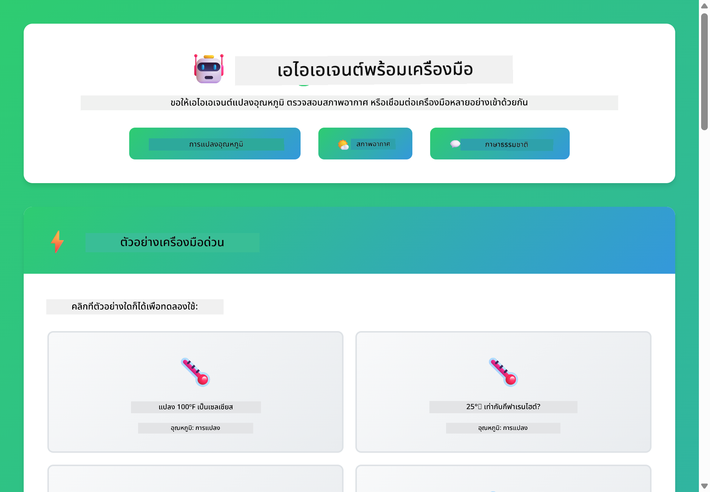

<!--
CO_OP_TRANSLATOR_METADATA:
{
  "original_hash": "13ec450c12cdd1a863baa2b778f27cd7",
  "translation_date": "2025-12-31T01:05:26+00:00",
  "source_file": "04-tools/README.md",
  "language_code": "th"
}
-->
# Module 04: ตัวแทน AI ที่มีเครื่องมือ

## Table of Contents

- [สิ่งที่คุณจะได้เรียนรู้](../../../04-tools)
- [ข้อกำหนดเบื้องต้น](../../../04-tools)
- [ทำความเข้าใจตัวแทน AI ที่มีเครื่องมือ](../../../04-tools)
- [วิธีการเรียกใช้เครื่องมือ](../../../04-tools)
  - [คำจำกัดความของเครื่องมือ](../../../04-tools)
  - [การตัดสินใจ](../../../04-tools)
  - [การดำเนินการ](../../../04-tools)
  - [การสร้างคำตอบ](../../../04-tools)
- [การเชนเครื่องมือ](../../../04-tools)
- [เรียกใช้แอปพลิเคชัน](../../../04-tools)
- [การใช้งานแอปพลิเคชัน](../../../04-tools)
  - [ลองการใช้เครื่องมืออย่างง่าย](../../../04-tools)
  - [ทดสอบการเชนเครื่องมือ](../../../04-tools)
  - [ดูการไหลของการสนทนา](../../../04-tools)
  - [สังเกตกระบวนการให้เหตุผล](../../../04-tools)
  - [ทดลองคำขอที่แตกต่างกัน](../../../04-tools)
- [แนวคิดสำคัญ](../../../04-tools)
  - [รูปแบบ ReAct (การให้เหตุผลและการกระทำ)](../../../04-tools)
  - [คำอธิบายของเครื่องมือสำคัญ](../../../04-tools)
  - [การจัดการเซสชัน](../../../04-tools)
  - [การจัดการข้อผิดพลาด](../../../04-tools)
- [เครื่องมือที่มีให้ใช้งาน](../../../04-tools)
- [เมื่อใดควรใช้ตัวแทนที่ใช้เครื่องมือ](../../../04-tools)
- [ขั้นตอนถัดไป](../../../04-tools)

## สิ่งที่คุณจะได้เรียนรู้

จนถึงตอนนี้ คุณได้เรียนรู้วิธีการสนทนากับ AI การจัดโครงสร้างพรอมต์อย่างมีประสิทธิภาพ และการยึดคำตอบให้สอดคล้องกับเอกสารของคุณ แต่ยังคงมีข้อจำกัดพื้นฐานอยู่: แบบจำลองภาษาสามารถสร้างข้อความได้เท่านั้น มันไม่สามารถตรวจสอบสภาพอากาศ ทำการคำนวณ คิวรีฐานข้อมูล หรือโต้ตอบกับระบบภายนอกได้

เครื่องมือเปลี่ยนสิ่งนี้ได้ โดยการให้แบบจำลองสามารถเรียกใช้ฟังก์ชันได้ คุณจะแปลงมันจากเครื่องสร้างข้อความเป็นตัวแทนที่สามารถทำการกระทำได้ แบบจำลองจะตัดสินใจเมื่อมันต้องการเครื่องมือ เครื่องมือใดที่ควรใช้ และพารามิเตอร์อะไรที่จะส่งไป โค้ดของคุณจะเรียกใช้ฟังก์ชันและส่งผลลัพธ์กลับมา แบบจำลองจะรวมผลลัพธ์นั้นลงในคำตอบของมัน

## ข้อกำหนดเบื้องต้น

- สำเร็จ Module 01 (ทรัพยากร Azure OpenAI ถูกนำขึ้น)
- มีไฟล์ `.env` ในไดเรกทอรีรากที่มีข้อมูลรับรอง Azure (สร้างโดย `azd up` ใน Module 01)

> **หมายเหตุ:** หากคุณยังไม่เสร็จ Module 01 ให้ทำตามคำแนะนำการปรับใช้ที่นั่นก่อน

## ทำความเข้าใจตัวแทน AI ที่มีเครื่องมือ

> **📝 หมายเหตุ:** คำว่า "agents" ในโมดูลนี้หมายถึงผู้ช่วย AI ที่ขยายความสามารถด้วยการเรียกใช้งานเครื่องมือ ซึ่งแตกต่างจากรูปแบบ **Agentic AI** (ตัวแทนอิสระที่มีการวางแผน ความจำ และการให้เหตุผลแบบหลายขั้นตอน) ที่เราจะครอบคลุมใน [Module 05: MCP](../05-mcp/README.md)

ตัวแทน AI ที่มีเครื่องมือตามรูปแบบการให้เหตุผลและการกระทำ (ReAct):

1. ผู้ใช้ถามคำถาม
2. ตัวแทนให้เหตุผลว่าต้องรู้อะไรบ้าง
3. ตัวแทนตัดสินใจว่าต้องใช้เครื่องมือหรือไม่
4. ถ้าต้องการ ตัวแทนเรียกใช้เครื่องมือที่เหมาะสมพร้อมพารามิเตอร์ที่ถูกต้อง
5. เครื่องมือทำงานและส่งข้อมูลกลับ
6. ตัวแทนรวมผลลัพธ์และให้คำตอบสุดท้าย


*รูปแบบ ReAct - วิธีที่ตัวแทน AI สลับระหว่างการให้เหตุผลและการกระทำเพื่อแก้ปัญหา*

สิ่งนี้เกิดขึ้นโดยอัตโนมัติ คุณนิยามเครื่องมือและคำอธิบายของมัน แบบจำลองจะจัดการการตัดสินใจเกี่ยวกับเมื่อใดและอย่างไรในการใช้เครื่องมือเหล่านั้น

## วิธีการเรียกใช้เครื่องมือ

**คำจำกัดความของเครื่องมือ** - [WeatherTool.java](../../../04-tools/src/main/java/com/example/langchain4j/agents/tools/WeatherTool.java) | [TemperatureTool.java](../../../04-tools/src/main/java/com/example/langchain4j/agents/tools/TemperatureTool.java)

คุณนิยามฟังก์ชันพร้อมคำอธิบายที่ชัดเจนและสเปคพารามิเตอร์ แบบจำลองจะเห็นคำอธิบายเหล่านี้ใน system prompt และเข้าใจว่าแต่ละเครื่องมือทำงานอย่างไร

```java
@Component
public class WeatherTool {
    
    @Tool("Get the current weather for a location")
    public String getCurrentWeather(@P("Location name") String location) {
        // ตรรกะการค้นหาข้อมูลสภาพอากาศของคุณ
        return "Weather in " + location + ": 22°C, cloudy";
    }
}

@AiService
public interface Assistant {
    String chat(@MemoryId String sessionId, @UserMessage String message);
}

// Spring Boot จะเชื่อมต่อ Assistant โดยอัตโนมัติกับ:
// - บีน ChatModel
// - เมธอด @Tool ทั้งหมดจากคลาส @Component
// - ChatMemoryProvider สำหรับการจัดการเซสชัน
```

> **🤖 ลองใช้กับ [GitHub Copilot](https://github.com/features/copilot) Chat:** เปิด [`WeatherTool.java`](../../../04-tools/src/main/java/com/example/langchain4j/agents/tools/WeatherTool.java) และถาม:
> - "ฉันจะรวม API สภาพอากาศจริงอย่าง OpenWeatherMap แทนข้อมูลจำลองได้อย่างไร?"
> - "อะไรที่ทำให้คำอธิบายของเครื่องมือดีและช่วยให้ AI ใช้มันได้อย่างถูกต้อง?"
> - "ฉันจัดการข้อผิดพลาดของ API และข้อจำกัดอัตรา (rate limits) ในการใช้งานเครื่องมืออย่างไร?"

**การตัดสินใจ**

เมื่อผู้ใช้ถามว่า "สภาพอากาศใน Seattle เป็นอย่างไร?" แบบจำลองจะรู้ว่าต้องใช้เครื่องมือสภาพอากาศ มันจะสร้างการเรียกฟังก์ชันพร้อมพารามิเตอร์ location ตั้งค่าเป็น "Seattle"

**การดำเนินการ** - [AgentService.java](../../../04-tools/src/main/java/com/example/langchain4j/agents/service/AgentService.java)

Spring Boot จะทำการ auto-wire อินเทอร์เฟซ declarative `@AiService` พร้อมเครื่องมือที่ลงทะเบียนทั้งหมด และ LangChain4j จะดำเนินการเรียกเครื่องมือโดยอัตโนมัติ

> **🤖 ลองใช้กับ [GitHub Copilot](https://github.com/features/copilot) Chat:** เปิด [`AgentService.java`](../../../04-tools/src/main/java/com/example/langchain4j/agents/service/AgentService.java) และถาม:
> - "รูปแบบ ReAct ทำงานอย่างไรและทำไมจึงมีประสิทธิภาพสำหรับตัวแทน AI?"
> - "ตัวแทนตัดสินใจเลือกเครื่องมือใดและเรียงลำดับการใช้เครื่องมืออย่างไร?"
> - "จะเกิดอะไรขึ้นถ้าการดำเนินการของเครื่องมือล้มเหลว — ควรจัดการข้อผิดพลาดอย่างไรให้ทนทาน?"

**การสร้างคำตอบ**

แบบจำลองได้รับข้อมูลสภาพอากาศและจัดรูปแบบเป็นคำตอบภาษาธรรมชาติสำหรับผู้ใช้

### ทำไมต้องใช้ Declarative AI Services?

โมดูลนี้ใช้การรวม LangChain4j กับ Spring Boot โดยใช้อินเทอร์เฟซ declarative `@AiService`:

- **การ auto-wiring ของ Spring Boot** - ChatModel และเครื่องมือถูกฉีดเข้าโดยอัตโนมัติ
- **รูปแบบ @MemoryId** - การจัดการหน่วยความจำแบบเซสชันโดยอัตโนมัติ
- **อินสแตนซ์เดียว** - ผู้ช่วยถูกสร้างครั้งเดียวและนำกลับมาใช้ซ้ำเพื่อประสิทธิภาพที่ดีขึ้น
- **การดำเนินการแบบปลอดชนิด** - เมธอด Java ถูกเรียกโดยตรงพร้อมการแปลงชนิด
- **การประสานงานหลายรอบ** - จัดการการเชนเครื่องมือโดยอัตโนมัติ
- **ไม่มีโค้ดซ้ำมาก** - ไม่มีการเรียก AiServices.builder() หรือ HashMap หน่วยความจำด้วยตนเอง

วิธีการทางเลือก (การใช้ `AiServices.builder()` ด้วยตนเอง) ต้องการโค้ดมากขึ้นและพลาดประโยชน์การรวมกับ Spring Boot

## การเชนเครื่องมือ

**การเชนเครื่องมือ** - AI อาจเรียกเครื่องมือหลายตัวเรียงตามลำดับ ลองถาม "สภาพอากาศใน Seattle เป็นอย่างไรและฉันควรพกร่มไหม?" และดูการเชน `getCurrentWeather` พร้อมการให้เหตุผลเกี่ยวกับอุปกรณ์กันฝน

<a href="images/tool-chaining.png"></a>

*การเรียกเครื่องมือแบบต่อเนื่อง - เอาต์พุตของเครื่องมือหนึ่งเป็นป้อนข้อมูลสำหรับการตัดสินใจถัดไป*

**การล้มเหลวอย่างสง่างาม** - ลองขอสภาพอากาศในเมืองที่ไม่มีข้อมูลจำลอง เครื่องมือจะส่งข้อความข้อผิดพลาด และ AI จะอธิบายว่ามันไม่สามารถช่วยได้ เครื่องมือล้มเหลวอย่างปลอดภัย

สิ่งนี้เกิดขึ้นในรอบการสนทนาเดียว ตัวแทนจะประสานงานการเรียกเครื่องมือหลายรายการโดยอัตโนมัติ

## เรียกใช้แอปพลิเคชัน

**ตรวจสอบการปรับใช้:**

ตรวจสอบให้แน่ใจว่าไฟล์ `.env` อยู่ในไดเรกทอรีรากที่มีข้อมูลรับรอง Azure (สร้างขึ้นระหว่าง Module 01):
```bash
cat ../.env  # ควรแสดง AZURE_OPENAI_ENDPOINT, API_KEY, DEPLOYMENT
```

**เริ่มแอปพลิเคชัน:**

> **หมายเหตุ:** หากคุณเริ่มใช้งานแอปพลิเคชันทั้งหมดแล้วโดยใช้ `./start-all.sh` จาก Module 01 โมดูลนี้จะรันอยู่บนพอร์ต 8084 แล้ว คุณสามารถข้ามคำสั่งเริ่มด้านล่างและไปที่ http://localhost:8084 ได้เลย

**ตัวเลือก 1: ใช้ Spring Boot Dashboard (แนะนำสำหรับผู้ใช้ VS Code)**

dev container มีส่วนขยาย Spring Boot Dashboard ซึ่งให้ส่วนติดต่อแบบภาพสำหรับจัดการแอปพลิเคชัน Spring Boot ทั้งหมด คุณสามารถหาได้ใน Activity Bar ทางด้านซ้ายของ VS Code (มองหาไอคอน Spring Boot)

จาก Spring Boot Dashboard คุณสามารถ:
- ดูแอปพลิเคชัน Spring Boot ทั้งหมดที่มีใน workspace
- เริ่ม/หยุดแอปพลิเคชันด้วยคลิกเดียว
- ดูบันทึกแอปพลิเคชันแบบเรียลไทม์
- ตรวจสอบสถานะของแอปพลิเคชัน

เพียงคลิกปุ่มเล่นข้าง "tools" เพื่อเริ่มโมดูลนี้ หรือเริ่มโมดูลทั้งหมดพร้อมกัน


**ตัวเลือก 2: ใช้สคริปต์เชลล์**

เริ่มเว็บแอปพลิเคชันทั้งหมด (โมดูล 01-04):

**Bash:**
```bash
cd ..  # จากไดเรกทอรีรูท
./start-all.sh
```

**PowerShell:**
```powershell
cd ..  # จากไดเรกทอรีราก
.\start-all.ps1
```

หรือเริ่มเฉพาะโมดูลนี้:

**Bash:**
```bash
cd 04-tools
./start.sh
```

**PowerShell:**
```powershell
cd 04-tools
.\start.ps1
```

ทั้งสองสคริปต์จะโหลดตัวแปรสภาพแวดล้อมจากไฟล์ `.env` ในรากโปรเจ็กต์โดยอัตโนมัติและจะสร้าง JAR หากยังไม่มี

> **หมายเหตุ:** หากคุณต้องการสร้างโมดูลทั้งหมดด้วยตนเองก่อนเริ่ม:
>
> **Bash:**
> ```bash
> cd ..  # Go to root directory
> mvn clean package -DskipTests
> ```
>
> **PowerShell:**
> ```powershell
> cd ..  # Go to root directory
> mvn clean package -DskipTests
> ```

เปิด http://localhost:8084 ในเบราว์เซอร์ของคุณ

**เพื่อหยุด:**

**Bash:**
```bash
./stop.sh  # เฉพาะโมดูลนี้
# หรือ
cd .. && ./stop-all.sh  # โมดูลทั้งหมด
```

**PowerShell:**
```powershell
.\stop.ps1  # เฉพาะโมดูลนี้
# หรือ
cd ..; .\stop-all.ps1  # โมดูลทั้งหมด
```

## การใช้งานแอปพลิเคชัน

แอปพลิเคชันมีอินเทอร์เฟซเว็บที่คุณสามารถโต้ตอบกับตัวแทน AI ที่เข้าถึงเครื่องมือดูสภาพอากาศและการแปลงอุณหภูมิได้

<a href="images/tools-homepage.png"></a>

*อินเทอร์เฟซ AI Agent Tools - ตัวอย่างด่วนและอินเทอร์เฟซแชทสำหรับโต้ตอบกับเครื่องมือ*

**ลองการใช้เครื่องมืออย่างง่าย**

เริ่มด้วยคำขอที่ตรงไปตรงมา: "แปลง 100 องศาฟาเรนไฮต์เป็นเซลเซียส" ตัวแทนจะรู้ว่าต้องใช้เครื่องมือแปลงอุณหภูมิ เรียกใช้ด้วยพารามิเตอร์ที่ถูกต้อง และส่งผลลัพธ์กลับสังเกตว่ามันรู้สึกเป็นธรรมชาติอย่างไร — คุณไม่ได้ระบุว่าต้องใช้เครื่องมือใดหรือเรียกใช้มันอย่างไร

**ทดสอบการเชนเครื่องมือ**

ตอนนี้ลองสิ่งที่ซับซ้อนขึ้น: "สภาพอากาศใน Seattle เป็นอย่างไรและแปลงเป็นฟาเรนไฮต์ด้วย?" ดูตัวแทนทำงานเป็นขั้นตอน มันจะดึงสภาพอากาศ (ซึ่งส่งกลับเป็นเซลเซียส) ตระหนักว่าต้องแปลงเป็นฟาเรนไฮต์ เรียกใช้เครื่องมือแปลง แล้วรวมผลลัพธ์ทั้งสองเป็นคำตอบเดียว

**ดูการไหลของการสนทนา**

อินเทอร์เฟซแชทเก็บประวัติการสนทนา ทำให้คุณสามารถมีปฏิสัมพันธ์แบบหลายรอบได้ คุณสามารถเห็นคำถามและคำตอบก่อนหน้าได้ทั้งหมด ทำให้ง่ายต่อการติดตามการสนทนาและเข้าใจว่าตัวแทนสร้างบริบทอย่างไรในหลายๆ การแลกเปลี่ยน

<a href="images/tools-conversation-demo.png"></a>

*การสนทนาหลายรอบแสดงการแปลงอย่างง่าย การค้นหาสภาพอากาศ และการเชนเครื่องมือ*

**ทดลองคำขอที่แตกต่างกัน**

ลองชุดต่างๆ:
- การค้นหาสภาพอากาศ: "สภาพอากาศใน Tokyo เป็นอย่างไร?"
- การแปลงอุณหภูมิ: "25°C เท่ากับกี่เคลวิน?"
- คำถามรวม: "ตรวจสอบสภาพอากาศใน Paris และบอกฉันว่ามันสูงกว่า 20°C หรือไม่"

สังเกตว่าตัวแทนตีความภาษาเชิงธรรมชาติและแมปไปยังการเรียกเครื่องมือที่เหมาะสมอย่างไร

## แนวคิดสำคัญ

**รูปแบบ ReAct (การให้เหตุผลและการกระทำ)**

ตัวแทนสลับระหว่างการให้เหตุผล (ตัดสินใจว่าจะทำอย่างไร) และการกระทำ (ใช้เครื่องมือ) รูปแบบนี้ช่วยให้การแก้ปัญหาเป็นไปอย่างอิสระมากกว่าการตอบกลับคำสั่งอย่างเดียว

**คำอธิบายของเครื่องมือสำคัญ**

คุณภาพของคำอธิบายเครื่องมือส่งผลโดยตรงต่อความสามารถของตัวแทนในการใช้งานอย่างถูกต้อง คำอธิบายที่ชัดเจนและเฉพาะเจาะจงช่วยให้แบบจำลองเข้าใจเมื่อใดและอย่างไรที่จะเรียกแต่ละเครื่องมือ

**การจัดการเซสชัน**

อนโนเทชัน `@MemoryId` ช่วยให้มีการจัดการหน่วยความจำตามเซสชันโดยอัตโนมัติ แต่ละ session ID จะได้ `ChatMemory` ของตัวเองที่จัดการโดย bean `ChatMemoryProvider` ช่วยขจัดความจำเป็นในการติดตามหน่วยความจำด้วยตนเอง

**การจัดการข้อผิดพลาด**

เครื่องมือสามารถล้มเหลวได้ — API หมดเวลา พารามิเตอร์อาจไม่ถูกต้อง บริการภายนอกอาจล่ม ตัวแทนในสภาพแวดล้อมการผลิตจำเป็นต้องมีการจัดการข้อผิดพลาดเพื่อให้แบบจำลองสามารถอธิบายปัญหาหรือทดลองทางเลือกอื่นได้

## เครื่องมือที่มีให้ใช้งาน

**เครื่องมือสภาพอากาศ** (ข้อมูลจำลองสำหรับสาธิต):
- ดึงสภาพอากาศปัจจุบันสำหรับตำแหน่ง
- ดึงพยากรณ์หลายวัน

**เครื่องมือแปลงอุณหภูมิ**:
- เซลเซียสเป็นฟาเรนไฮต์
- ฟาเรนไฮต์เป็นเซลเซียส
- เซลเซียสเป็นเคลวิน
- เคลวินเป็นเซลเซียส
- ฟาเรนไฮต์เป็นเคลวิน
- เคลวินเป็นฟาเรนไฮต์

นี่เป็นตัวอย่างง่ายๆ แต่รูปแบบนี้ขยายไปยังฟังก์ชันใดๆ ได้: คิวรีฐานข้อมูล การเรียก API การคำนวณ การทำงานกับไฟล์ หรือคำสั่งระบบ

## เมื่อใดควรใช้ตัวแทนที่ใช้เครื่องมือ

**ใช้เครื่องมือเมื่อ:**
- คำตอบต้องการข้อมูลเรียลไทม์ (สภาพอากาศ ราคาหุ้น สต็อกสินค้า)
- คุณต้องทำการคำนวณที่ซับซ้อนเกินคณิตศาสตร์ง่ายๆ
- การเข้าถึงฐานข้อมูลหรือ API
- การทำการกระทำ (ส่งอีเมล สร้างตั๋ว อัปเดตระเบียน)
- การรวมแหล่งข้อมูลหลายแห่ง

**อย่าใช้เครื่องมือเมื่อ:**
- คำถามตอบได้จากความรู้ทั่วไป
- คำตอบเป็นเพียงการสนทนา
- ความหน่วงของเครื่องมือจะทำให้ประสบการณ์ช้าจนเกินไป

## ขั้นตอนถัดไป

**โมดูลถัดไป:** [05-mcp - Model Context Protocol (MCP)](../05-mcp/README.md)

---

**การนำทาง:** [← ก่อนหน้า: Module 03 - RAG](../03-rag/README.md) | [กลับไปที่หน้าหลัก](../README.md) | [ถัดไป: Module 05 - MCP →](../05-mcp/README.md)

---

<!-- CO-OP TRANSLATOR DISCLAIMER START -->
ข้อจำกัดความรับผิดชอบ:
เอกสารฉบับนี้ได้รับการแปลโดยใช้บริการแปลภาษาด้วย AI [Co-op Translator](https://github.com/Azure/co-op-translator) แม้ว่าเราจะพยายามให้การแปลมีความถูกต้อง โปรดทราบว่าการแปลอัตโนมัติอาจมีข้อผิดพลาดหรือความไม่แม่นยำ เอกสารต้นฉบับในภาษาต้นทางควรถูกพิจารณาเป็นแหล่งข้อมูลที่มีอำนาจ สำหรับข้อมูลที่มีความสำคัญสูง ขอแนะนำให้ใช้บริการแปลโดยผู้เชี่ยวชาญเป็นคนทำการแปล เราจะไม่รับผิดชอบต่อความเข้าใจผิดหรือการตีความที่เกิดขึ้นจากการใช้การแปลฉบับนี้
<!-- CO-OP TRANSLATOR DISCLAIMER END -->