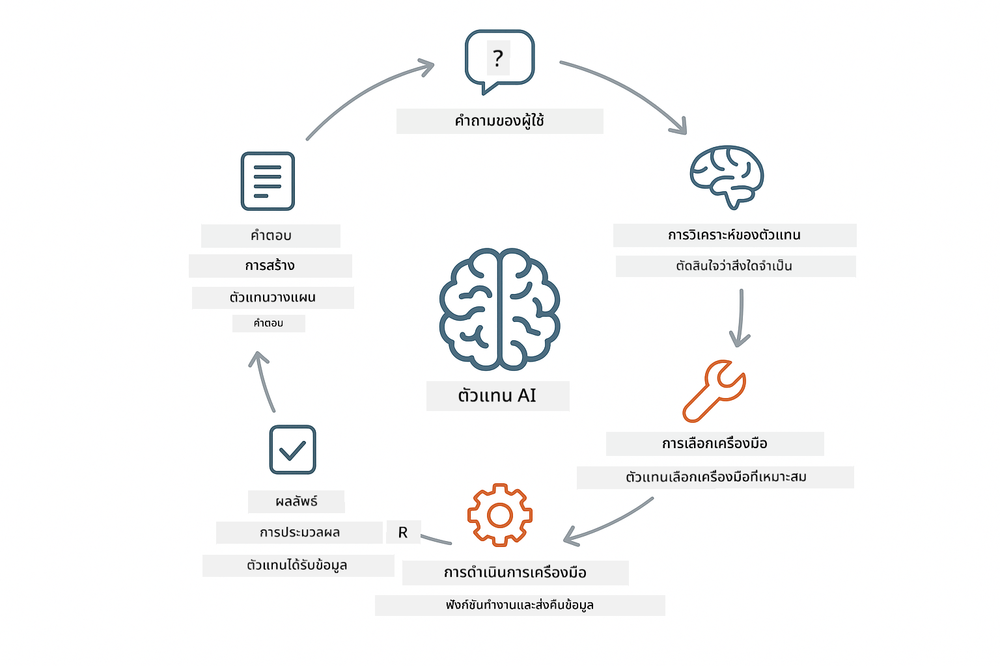
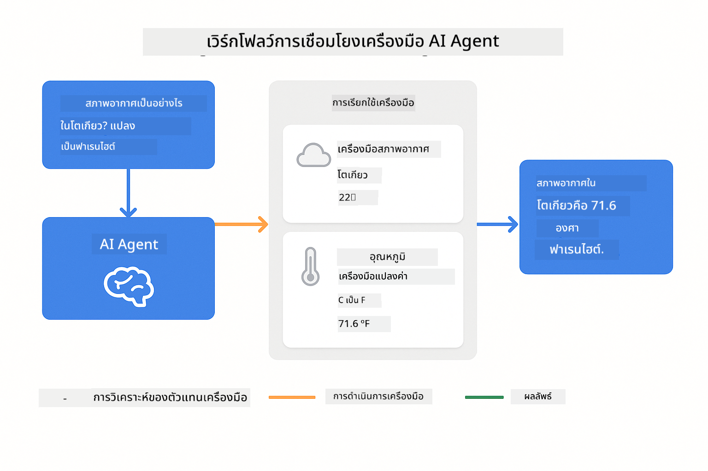
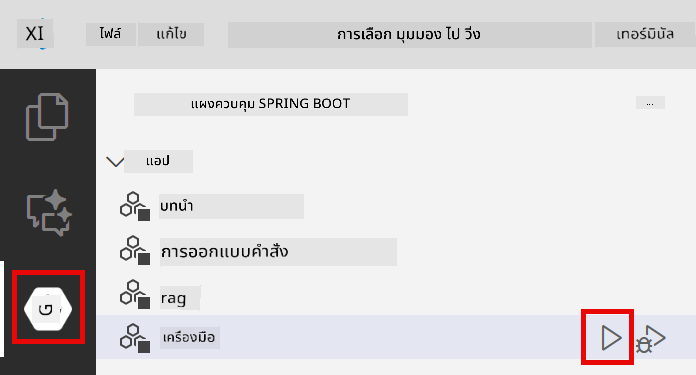
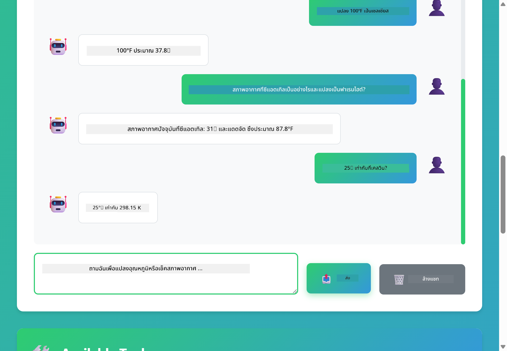

<!--
CO_OP_TRANSLATOR_METADATA:
{
  "original_hash": "aa23f106e7f53270924c9dd39c629004",
  "translation_date": "2025-12-13T18:57:14+00:00",
  "source_file": "04-tools/README.md",
  "language_code": "th"
}
-->
# Module 04: ตัวแทน AI พร้อมเครื่องมือ

## สารบัญ

- [สิ่งที่คุณจะได้เรียนรู้](../../../04-tools)
- [ข้อกำหนดเบื้องต้น](../../../04-tools)
- [ทำความเข้าใจตัวแทน AI พร้อมเครื่องมือ](../../../04-tools)
- [การทำงานของการเรียกใช้เครื่องมือ](../../../04-tools)
  - [คำจำกัดความของเครื่องมือ](../../../04-tools)
  - [การตัดสินใจ](../../../04-tools)
  - [การดำเนินการ](../../../04-tools)
  - [การสร้างการตอบกลับ](../../../04-tools)
- [การเชื่อมโยงเครื่องมือ](../../../04-tools)
- [รันแอปพลิเคชัน](../../../04-tools)
- [การใช้งานแอปพลิเคชัน](../../../04-tools)
  - [ลองใช้เครื่องมืออย่างง่าย](../../../04-tools)
  - [ทดสอบการเชื่อมโยงเครื่องมือ](../../../04-tools)
  - [ดูการไหลของการสนทนา](../../../04-tools)
  - [สังเกตการให้เหตุผล](../../../04-tools)
  - [ทดลองกับคำขอที่แตกต่างกัน](../../../04-tools)
- [แนวคิดสำคัญ](../../../04-tools)
  - [รูปแบบ ReAct (การให้เหตุผลและการกระทำ)](../../../04-tools)
  - [คำอธิบายเครื่องมือมีความสำคัญ](../../../04-tools)
  - [การจัดการเซสชัน](../../../04-tools)
  - [การจัดการข้อผิดพลาด](../../../04-tools)
- [เครื่องมือที่มีให้ใช้](../../../04-tools)
- [เมื่อใดควรใช้ตัวแทนที่ใช้เครื่องมือ](../../../04-tools)
- [ขั้นตอนถัดไป](../../../04-tools)

## สิ่งที่คุณจะได้เรียนรู้

จนถึงตอนนี้ คุณได้เรียนรู้วิธีการสนทนากับ AI การจัดโครงสร้างพรอมต์อย่างมีประสิทธิภาพ และการยึดคำตอบกับเอกสารของคุณ แต่ยังมีข้อจำกัดพื้นฐาน: โมเดลภาษาเพียงแค่สร้างข้อความเท่านั้น มันไม่สามารถตรวจสอบสภาพอากาศ คำนวณ ค้นหาข้อมูลในฐานข้อมูล หรือโต้ตอบกับระบบภายนอกได้

เครื่องมือเปลี่ยนแปลงสิ่งนี้ โดยการให้โมเดลเข้าถึงฟังก์ชันที่สามารถเรียกใช้ได้ คุณจะเปลี่ยนมันจากเครื่องสร้างข้อความเป็นตัวแทนที่สามารถดำเนินการได้ โมเดลจะตัดสินใจว่าเมื่อใดที่ต้องใช้เครื่องมือ เครื่องมือใดที่จะใช้ และพารามิเตอร์ใดที่จะส่งไป โค้ดของคุณจะดำเนินการฟังก์ชันและส่งผลลัพธ์กลับมา โมเดลจะนำผลลัพธ์นั้นมารวมในคำตอบของมัน

## ข้อกำหนดเบื้องต้น

- ทำ Module 01 เสร็จสมบูรณ์ (ทรัพยากร Azure OpenAI ถูกปรับใช้แล้ว)
- ไฟล์ `.env` ในไดเรกทอรีหลักพร้อมข้อมูลรับรอง Azure (สร้างโดย `azd up` ใน Module 01)

> **หมายเหตุ:** หากคุณยังไม่ได้ทำ Module 01 ให้ทำตามคำแนะนำการปรับใช้ที่นั่นก่อน

## ทำความเข้าใจตัวแทน AI พร้อมเครื่องมือ

ตัวแทน AI พร้อมเครื่องมือทำงานตามรูปแบบการให้เหตุผลและการกระทำ (ReAct):

1. ผู้ใช้ถามคำถาม
2. ตัวแทนให้เหตุผลเกี่ยวกับสิ่งที่ต้องรู้
3. ตัวแทนตัดสินใจว่าต้องใช้เครื่องมือหรือไม่
4. ถ้าใช่ ตัวแทนจะเรียกใช้เครื่องมือที่เหมาะสมพร้อมพารามิเตอร์ที่ถูกต้อง
5. เครื่องมือดำเนินการและส่งข้อมูลกลับ
6. ตัวแทนนำผลลัพธ์มารวมและให้คำตอบสุดท้าย



*รูปแบบ ReAct - วิธีที่ตัวแทน AI สลับกันระหว่างการให้เหตุผลและการกระทำเพื่อแก้ปัญหา*

สิ่งนี้เกิดขึ้นโดยอัตโนมัติ คุณกำหนดเครื่องมือและคำอธิบายของพวกมัน โมเดลจะจัดการการตัดสินใจว่าเมื่อใดและอย่างไรที่จะใช้เครื่องมือเหล่านั้น

## การทำงานของการเรียกใช้เครื่องมือ

**คำจำกัดความของเครื่องมือ** - [WeatherTool.java](../../../04-tools/src/main/java/com/example/langchain4j/agents/tools/WeatherTool.java) | [TemperatureTool.java](../../../04-tools/src/main/java/com/example/langchain4j/agents/tools/TemperatureTool.java)

คุณกำหนดฟังก์ชันพร้อมคำอธิบายที่ชัดเจนและการระบุพารามิเตอร์ โมเดลจะเห็นคำอธิบายเหล่านี้ในพรอมต์ระบบและเข้าใจว่าแต่ละเครื่องมือทำอะไร

```java
@Component
public class WeatherTool {
    
    @Tool("Get the current weather for a location")
    public String getCurrentWeather(@P("Location name") String location) {
        // ตรรกะการค้นหาสภาพอากาศของคุณ
        return "Weather in " + location + ": 22°C, cloudy";
    }
}

@AiService
public interface Assistant {
    String chat(@MemoryId String sessionId, @UserMessage String message);
}

// ผู้ช่วยถูกเชื่อมต่อโดยอัตโนมัติโดย Spring Boot ด้วย:
// - bean ของ ChatModel
// - เมธอด @Tool ทั้งหมดจากคลาส @Component
// - ChatMemoryProvider สำหรับการจัดการเซสชัน
```

> **🤖 ลองใช้กับ [GitHub Copilot](https://github.com/features/copilot) Chat:** เปิด [`WeatherTool.java`](../../../04-tools/src/main/java/com/example/langchain4j/agents/tools/WeatherTool.java) และถาม:
> - "ฉันจะรวม API สภาพอากาศจริงอย่าง OpenWeatherMap แทนข้อมูลจำลองได้อย่างไร?"
> - "อะไรทำให้คำอธิบายเครื่องมือดีที่ช่วยให้ AI ใช้งานได้ถูกต้อง?"
> - "ฉันจะจัดการข้อผิดพลาด API และข้อจำกัดอัตราในเครื่องมืออย่างไร?"

**การตัดสินใจ**

เมื่อผู้ใช้ถามว่า "สภาพอากาศที่ซีแอตเทิลเป็นอย่างไร?" โมเดลจะรู้ว่าต้องใช้เครื่องมือสภาพอากาศ มันจะสร้างการเรียกฟังก์ชันพร้อมพารามิเตอร์ location ตั้งค่าเป็น "Seattle"

**การดำเนินการ** - [AgentService.java](../../../04-tools/src/main/java/com/example/langchain4j/agents/service/AgentService.java)

Spring Boot จะเชื่อมต่ออินเทอร์เฟซ `@AiService` แบบประกาศกับเครื่องมือที่ลงทะเบียนทั้งหมด และ LangChain4j จะดำเนินการเรียกใช้เครื่องมือโดยอัตโนมัติ

> **🤖 ลองใช้กับ [GitHub Copilot](https://github.com/features/copilot) Chat:** เปิด [`AgentService.java`](../../../04-tools/src/main/java/com/example/langchain4j/agents/service/AgentService.java) และถาม:
> - "รูปแบบ ReAct ทำงานอย่างไรและทำไมจึงมีประสิทธิภาพสำหรับตัวแทน AI?"
> - "ตัวแทนตัดสินใจเลือกใช้เครื่องมือใดและลำดับอย่างไร?"
> - "ถ้าการดำเนินการเครื่องมือล้มเหลว จะจัดการข้อผิดพลาดอย่างไรให้มั่นคง?"

**การสร้างการตอบกลับ**

โมเดลได้รับข้อมูลสภาพอากาศและจัดรูปแบบเป็นคำตอบภาษาธรรมชาติสำหรับผู้ใช้

### ทำไมต้องใช้บริการ AI แบบประกาศ?

โมดูลนี้ใช้การผสานรวม LangChain4j กับ Spring Boot ผ่านอินเทอร์เฟซ `@AiService` แบบประกาศ:

- **Spring Boot auto-wiring** - ChatModel และเครื่องมือถูกฉีดโดยอัตโนมัติ
- **รูปแบบ @MemoryId** - การจัดการหน่วยความจำตามเซสชันโดยอัตโนมัติ
- **อินสแตนซ์เดียว** - ผู้ช่วยถูกสร้างครั้งเดียวและใช้ซ้ำเพื่อประสิทธิภาพที่ดีขึ้น
- **การดำเนินการแบบปลอดภัยตามชนิดข้อมูล** - เรียกใช้เมธอด Java โดยตรงพร้อมการแปลงชนิดข้อมูล
- **การจัดการหลายรอบสนทนา** - จัดการการเชื่อมโยงเครื่องมือโดยอัตโนมัติ
- **ไม่มีโค้ดซ้ำซ้อน** - ไม่ต้องเรียก AiServices.builder() ด้วยตนเองหรือใช้ HashMap สำหรับหน่วยความจำ

วิธีอื่น (ใช้ AiServices.builder() ด้วยตนเอง) ต้องเขียนโค้ดมากขึ้นและขาดประโยชน์จากการผสานรวม Spring Boot

## การเชื่อมโยงเครื่องมือ

**การเชื่อมโยงเครื่องมือ** - AI อาจเรียกใช้เครื่องมือหลายตัวต่อเนื่องกัน ถามว่า "สภาพอากาศที่ซีแอตเทิลเป็นอย่างไร และฉันควรเอาร่มไปไหม?" แล้วดูว่ามันเชื่อมโยง `getCurrentWeather` กับการให้เหตุผลเกี่ยวกับอุปกรณ์กันฝนอย่างไร

<a href="images/tool-chaining.png"></a>

*การเรียกใช้เครื่องมือแบบต่อเนื่อง - ผลลัพธ์ของเครื่องมือหนึ่งเป็นข้อมูลสำหรับการตัดสินใจถัดไป*

**การล้มเหลวอย่างนุ่มนวล** - ถามหาสภาพอากาศในเมืองที่ไม่มีในข้อมูลจำลอง เครื่องมือจะส่งข้อความแสดงข้อผิดพลาด และ AI จะอธิบายว่าช่วยไม่ได้ เครื่องมือล้มเหลวอย่างปลอดภัย

สิ่งนี้เกิดขึ้นในรอบสนทนาเดียว ตัวแทนจะจัดการเรียกใช้เครื่องมือหลายตัวโดยอัตโนมัติ

## รันแอปพลิเคชัน

**ตรวจสอบการปรับใช้:**

ตรวจสอบว่าไฟล์ `.env` อยู่ในไดเรกทอรีหลักพร้อมข้อมูลรับรอง Azure (สร้างใน Module 01):
```bash
cat ../.env  # ควรแสดง AZURE_OPENAI_ENDPOINT, API_KEY, DEPLOYMENT
```

**เริ่มแอปพลิเคชัน:**

> **หมายเหตุ:** หากคุณเริ่มแอปพลิเคชันทั้งหมดด้วย `./start-all.sh` จาก Module 01 แล้ว โมดูลนี้กำลังทำงานบนพอร์ต 8084 อยู่แล้ว คุณสามารถข้ามคำสั่งเริ่มต้นด้านล่างและไปที่ http://localhost:8084 ได้เลย

**ตัวเลือก 1: ใช้ Spring Boot Dashboard (แนะนำสำหรับผู้ใช้ VS Code)**

คอนเทนเนอร์ dev มีส่วนขยาย Spring Boot Dashboard ซึ่งให้ส่วนติดต่อแบบกราฟิกสำหรับจัดการแอปพลิเคชัน Spring Boot ทั้งหมด คุณจะพบได้ในแถบกิจกรรมด้านซ้ายของ VS Code (มองหาไอคอน Spring Boot)

จาก Spring Boot Dashboard คุณสามารถ:
- ดูแอปพลิเคชัน Spring Boot ทั้งหมดในพื้นที่ทำงาน
- เริ่ม/หยุดแอปพลิเคชันด้วยคลิกเดียว
- ดูบันทึกแอปพลิเคชันแบบเรียลไทม์
- ตรวจสอบสถานะแอปพลิเคชัน

เพียงคลิกปุ่มเล่นข้าง "tools" เพื่อเริ่มโมดูลนี้ หรือเริ่มทุกโมดูลพร้อมกัน



**ตัวเลือก 2: ใช้สคริปต์เชลล์**

เริ่มแอปพลิเคชันเว็บทั้งหมด (โมดูล 01-04):

**Bash:**
```bash
cd ..  # จากไดเรกทอรีรูท
./start-all.sh
```

**PowerShell:**
```powershell
cd ..  # จากไดเรกทอรีรูท
.\start-all.ps1
```

หรือเริ่มแค่โมดูลนี้:

**Bash:**
```bash
cd 04-tools
./start.sh
```

**PowerShell:**
```powershell
cd 04-tools
.\start.ps1
```

ทั้งสองสคริปต์จะโหลดตัวแปรสภาพแวดล้อมจากไฟล์ `.env` ในไดเรกทอรีหลักโดยอัตโนมัติ และจะสร้าง JAR หากยังไม่มี

> **หมายเหตุ:** หากคุณต้องการสร้างโมดูลทั้งหมดด้วยตนเองก่อนเริ่ม:
>
> **Bash:**
> ```bash
> cd ..  # Go to root directory
> mvn clean package -DskipTests
> ```
>
> **PowerShell:**
> ```powershell
> cd ..  # Go to root directory
> mvn clean package -DskipTests
> ```

เปิด http://localhost:8084 ในเบราว์เซอร์ของคุณ

**เพื่อหยุด:**

**Bash:**
```bash
./stop.sh  # โมดูลนี้เท่านั้น
# หรือ
cd .. && ./stop-all.sh  # ทุกโมดูล
```

**PowerShell:**
```powershell
.\stop.ps1  # โมดูลนี้เท่านั้น
# หรือ
cd ..; .\stop-all.ps1  # ทุกโมดูล
```

## การใช้งานแอปพลิเคชัน

แอปพลิเคชันมีอินเทอร์เฟซเว็บที่คุณสามารถโต้ตอบกับตัวแทน AI ที่เข้าถึงเครื่องมือสภาพอากาศและแปลงอุณหภูมิได้

<a href="images/tools-homepage.png"></a>

*อินเทอร์เฟซเครื่องมือ AI Agent - ตัวอย่างด่วนและอินเทอร์เฟซแชทสำหรับโต้ตอบกับเครื่องมือ*

**ลองใช้เครื่องมืออย่างง่าย**

เริ่มด้วยคำขอที่ตรงไปตรงมา: "แปลง 100 องศาฟาเรนไฮต์เป็นเซลเซียส" ตัวแทนจะรู้ว่าต้องใช้เครื่องมือแปลงอุณหภูมิ เรียกใช้ด้วยพารามิเตอร์ที่ถูกต้อง และส่งผลลัพธ์กลับมา สังเกตว่ามันเป็นธรรมชาติอย่างไร - คุณไม่ได้ระบุว่าจะใช้เครื่องมือใดหรือวิธีเรียกใช้

**ทดสอบการเชื่อมโยงเครื่องมือ**

ลองคำขอที่ซับซ้อนขึ้น: "สภาพอากาศที่ซีแอตเทิลเป็นอย่างไร และแปลงเป็นฟาเรนไฮต์" ดูตัวแทนทำงานเป็นขั้นตอน มันจะดึงข้อมูลสภาพอากาศ (ซึ่งเป็นเซลเซียส) รู้ว่าต้องแปลงเป็นฟาเรนไฮต์ เรียกใช้เครื่องมือแปลง และรวมผลลัพธ์ทั้งสองเป็นคำตอบเดียว

**ดูการไหลของการสนทนา**

อินเทอร์เฟซแชทเก็บประวัติการสนทนา ทำให้คุณสามารถมีปฏิสัมพันธ์หลายรอบ คุณสามารถดูคำถามและคำตอบก่อนหน้าได้ทั้งหมด ทำให้ง่ายต่อการติดตามการสนทนาและเข้าใจว่าตัวแทนสร้างบริบทอย่างไรในหลายรอบ

<a href="images/tools-conversation-demo.png"></a>

*การสนทนาหลายรอบแสดงการแปลงอย่างง่าย การค้นหาสภาพอากาศ และการเชื่อมโยงเครื่องมือ*

**ทดลองกับคำขอที่แตกต่างกัน**

ลองชุดคำขอต่าง ๆ:
- การค้นหาสภาพอากาศ: "สภาพอากาศที่โตเกียวเป็นอย่างไร?"
- การแปลงอุณหภูมิ: "25°C เท่ากับกี่เคลวิน?"
- คำถามผสม: "ตรวจสอบสภาพอากาศที่ปารีสและบอกฉันว่ามันสูงกว่า 20°C หรือไม่"

สังเกตว่าตัวแทนตีความภาษาธรรมชาติและแมปไปยังการเรียกใช้เครื่องมือที่เหมาะสมอย่างไร

## แนวคิดสำคัญ

**รูปแบบ ReAct (การให้เหตุผลและการกระทำ)**

ตัวแทนสลับกันระหว่างการให้เหตุผล (ตัดสินใจว่าจะทำอะไร) และการกระทำ (ใช้เครื่องมือ) รูปแบบนี้ช่วยให้แก้ปัญหาได้อย่างอิสระแทนที่จะตอบแค่คำสั่ง

**คำอธิบายเครื่องมือมีความสำคัญ**

คุณภาพของคำอธิบายเครื่องมือส่งผลโดยตรงต่อการใช้งานของตัวแทน คำอธิบายที่ชัดเจนและเฉพาะเจาะจงช่วยให้โมเดลเข้าใจว่าเมื่อใดและอย่างไรจะเรียกใช้แต่ละเครื่องมือ

**การจัดการเซสชัน**

แอนโนเทชัน `@MemoryId` ช่วยให้การจัดการหน่วยความจำตามเซสชันเป็นไปโดยอัตโนมัติ แต่ละ ID เซสชันจะได้อินสแตนซ์ `ChatMemory` ของตัวเองที่จัดการโดยบีน `ChatMemoryProvider` ทำให้ไม่ต้องติดตามหน่วยความจำด้วยตนเอง

**การจัดการข้อผิดพลาด**

เครื่องมืออาจล้มเหลว - API หมดเวลา พารามิเตอร์อาจไม่ถูกต้อง บริการภายนอกล่ม ตัวแทนในสภาพแวดล้อมจริงต้องมีการจัดการข้อผิดพลาดเพื่อให้โมเดลอธิบายปัญหาหรือพยายามทางเลือกอื่น

## เครื่องมือที่มีให้ใช้

**เครื่องมือสภาพอากาศ** (ข้อมูลจำลองสำหรับสาธิต):
- ดึงสภาพอากาศปัจจุบันสำหรับสถานที่
- ดึงพยากรณ์หลายวัน

**เครื่องมือแปลงอุณหภูมิ**:
- เซลเซียสเป็นฟาเรนไฮต์
- ฟาเรนไฮต์เป็นเซลเซียส
- เซลเซียสเป็นเคลวิน
- เคลวินเป็นเซลเซียส
- ฟาเรนไฮต์เป็นเคลวิน
- เคลวินเป็นฟาเรนไฮต์

นี่เป็นตัวอย่างง่าย ๆ แต่รูปแบบนี้ขยายไปยังฟังก์ชันใด ๆ ได้: การค้นหาฐานข้อมูล การเรียก API การคำนวณ การจัดการไฟล์ หรือคำสั่งระบบ

## เมื่อใดควรใช้ตัวแทนที่ใช้เครื่องมือ

**ใช้เครื่องมือเมื่อ:**
- คำตอบต้องการข้อมูลเรียลไทม์ (สภาพอากาศ ราคาหุ้น สต็อกสินค้า)
- ต้องการคำนวณที่ซับซ้อนกว่าคณิตศาสตร์พื้นฐาน
- เข้าถึงฐานข้อมูลหรือ API
- ดำเนินการ (ส่งอีเมล สร้างตั๋ว อัปเดตบันทึก)
- รวมแหล่งข้อมูลหลายแหล่ง

**ไม่ใช้เครื่องมือเมื่อ:**
- คำถามตอบได้จากความรู้ทั่วไป
- คำตอบเป็นการสนทนาอย่างเดียว
- ความหน่วงของเครื่องมือจะทำให้ประสบการณ์ช้าเกินไป

## ขั้นตอนถัดไป

**โมดูลถัดไป:** [05-mcp - Model Context Protocol (MCP)](../05-mcp/README.md)

---

**การนำทาง:** [← ก่อนหน้า: Module 03 - RAG](../03-rag/README.md) | [กลับสู่หน้าหลัก](../README.md) | [ถัดไป: Module 05 - MCP →](../05-mcp/README.md)

---

<!-- CO-OP TRANSLATOR DISCLAIMER START -->
**ข้อจำกัดความรับผิดชอบ**:  
เอกสารนี้ได้รับการแปลโดยใช้บริการแปลภาษาอัตโนมัติ [Co-op Translator](https://github.com/Azure/co-op-translator) แม้เราจะพยายามให้ความถูกต้องสูงสุด แต่โปรดทราบว่าการแปลอัตโนมัติอาจมีข้อผิดพลาดหรือความไม่ถูกต้อง เอกสารต้นฉบับในภาษาต้นทางถือเป็นแหล่งข้อมูลที่เชื่อถือได้ สำหรับข้อมูลที่สำคัญ ขอแนะนำให้ใช้บริการแปลโดยผู้เชี่ยวชาญมนุษย์ เราไม่รับผิดชอบต่อความเข้าใจผิดหรือการตีความผิดใด ๆ ที่เกิดจากการใช้การแปลนี้
<!-- CO-OP TRANSLATOR DISCLAIMER END -->