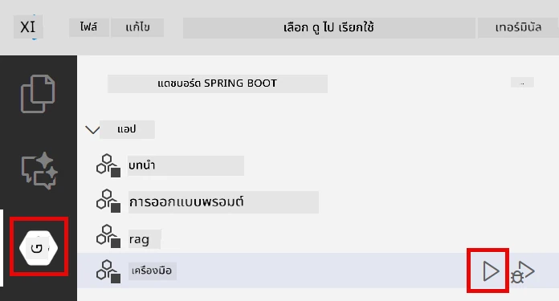
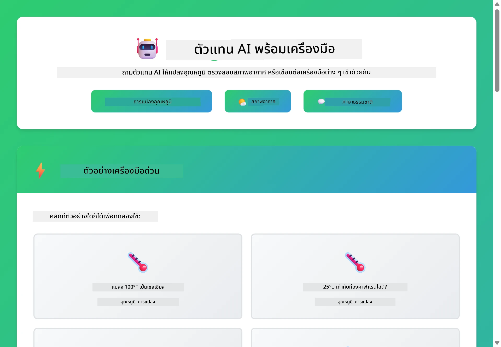
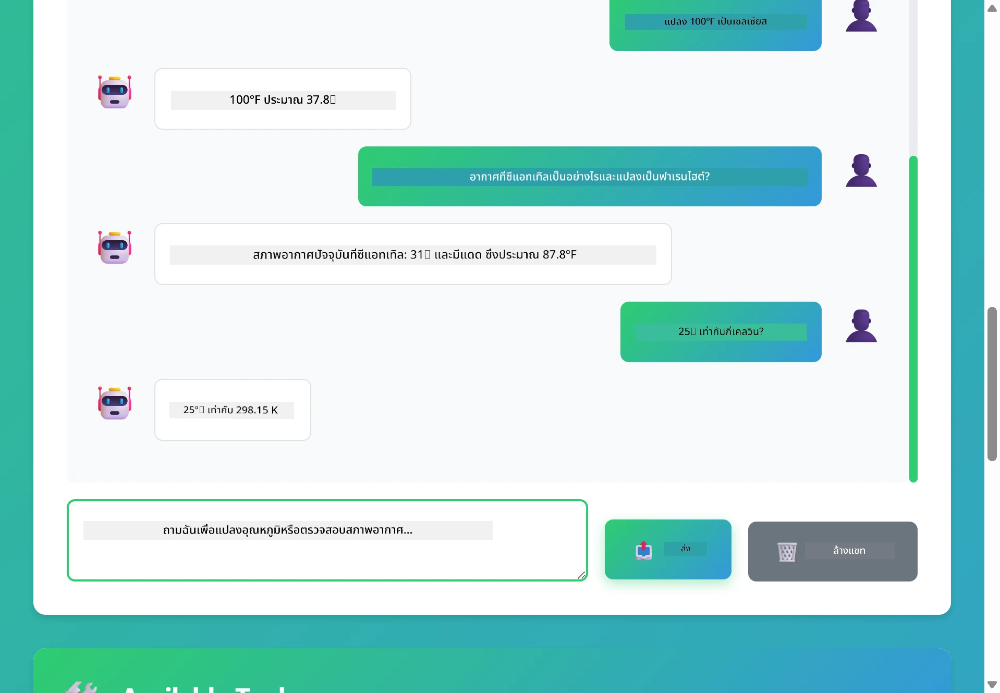

# Module 04: เอเจนต์ AI พร้อมเครื่องมือ

## สารบัญ

- [วิดีโอสอน](#วิดีโอสอน)
- [สิ่งที่คุณจะได้เรียนรู้](#สิ่งที่คุณจะได้เรียนรู้)
- [ข้อกำหนดพื้นฐาน](#ข้อกำหนดพื้นฐาน)
- [ความเข้าใจเกี่ยวกับเอเจนต์ AI พร้อมเครื่องมือ](#ความเข้าใจเกี่ยวกับเอเจนต์-ai-พร้อมเครื่องมือ)
- [วิธีการทำงานของการเรียกเครื่องมือ](#วิธีการทำงานของการเรียกเครื่องมือ)
  - [คำนิยามของเครื่องมือ](#คำนิยามของเครื่องมือ)
  - [การตัดสินใจ](#การตัดสินใจ)
  - [การดำเนินการ](#การดำเนินการ)
  - [การสร้างคำตอบ](#การสร้างคำตอบ)
  - [สถาปัตยกรรม: การเชื่อมต่ออัตโนมัติของ Spring Boot](#สถาปัตยกรรม-การเชื่อมต่ออัตโนมัติของ-spring-boot)
- [การเชื่อมโยงเครื่องมือ](#การเชื่อมโยงเครื่องมือ)
- [รันแอปพลิเคชัน](#รันแอปพลิเคชัน)
- [การใช้งานแอปพลิเคชัน](#การใช้แอปพลิเคชัน)
  - [ลองใช้เครื่องมืออย่างง่าย](#ลองใช้เครื่องมืออย่างง่าย)
  - [ทดสอบการเชื่อมโยงเครื่องมือ](#ทดสอบการเชื่อมโยงเครื่องมือ)
  - [ดูการไหลของการสนทนา](#ดูการไหลของบทสนทนา)
  - [ทดลองกับคำขอต่าง ๆ](#ทดลองคำขอหลากหลาย)
- [แนวคิดสำคัญ](#แนวคิดสำคัญ)
  - [รูปแบบ ReAct (เหตุผลและการกระทำ)](#รูปแบบ-react-การให้เหตุผลและการกระทำ)
  - [ความสำคัญของคำอธิบายเครื่องมือ](#คำอธิบายเครื่องมือสำคัญ)
  - [การจัดการเซสชัน](#การจัดการเซสชัน)
  - [การจัดการข้อผิดพลาด](#การจัดการข้อผิดพลาด)
- [เครื่องมือที่มีให้ใช้งาน](#เครื่องมือที่มีให้ใช้งาน)
- [เมื่อใดควรใช้เอเจนต์ที่ใช้เครื่องมือ](#เมื่อใดควรใช้เอเจนต์ที่ใช้เครื่องมือ)
- [เครื่องมือ vs RAG](#เครื่องมือกับ-rag)
- [ขั้นตอนถัดไป](#ขั้นตอนถัดไป)

## วิดีโอสอน

รับชมเซสชันสดนี้ที่อธิบายวิธีเริ่มต้นกับโมดูลนี้:

<a href="https://www.youtube.com/watch?v=O_J30kZc0rw"></a>

## สิ่งที่คุณจะได้เรียนรู้

จนถึงตอนนี้ คุณได้เรียนรู้วิธีพูดคุยกับ AI การสร้างโครงสร้างพรอมต์อย่างมีประสิทธิภาพ และการยึดคำตอบให้เชื่อมโยงกับเอกสารของคุณแล้ว แต่ยังมีข้อจำกัดพื้นฐาน คือ โมเดลภาษาสามารถสร้างข้อความได้เท่านั้น พวกมันไม่สามารถตรวจสอบสภาพอากาศ คำนวณข้อมูล สืบค้นฐานข้อมูล หรือโต้ตอบกับระบบภายนอกได้

เครื่องมือช่วยเปลี่ยนเรื่องนี้ โดยการให้โมเดลเข้าถึงฟังก์ชันที่มันเรียกใช้ได้ คุณจะเปลี่ยนมันจากเครื่องสร้างข้อความให้เป็นเอเจนต์ที่สามารถดำเนินการได้ โมเดลจะตัดสินใจว่าเมื่อไหร่ที่ต้องใช้เครื่องมือ เครื่องมือใดที่จะใช้ และต้องส่งพารามิเตอร์อะไร โค้ดของคุณจะทำการเรียกฟังก์ชันและส่งผลลัพธ์กลับมา โมเดลจะรวมผลลัพธ์นั้นลงในคำตอบของมัน

## ข้อกำหนดพื้นฐาน

- ผ่าน [Module 01 - Introduction](../01-introduction/README.md) แล้ว (ได้ทำการปรับใช้ทรัพยากร Azure OpenAI)
- ผ่านโมดูลก่อนหน้าที่แนะนำ (โมดูลนี้อ้างอิงถึง [แนวคิด RAG จาก Module 03](../03-rag/README.md) ในการเปรียบเทียบ Tools vs RAG)
- มีไฟล์ `.env` ในไดเรกทอรีรากที่มีข้อมูลประจำตัว Azure (สร้างได้โดยคำสั่ง `azd up` ใน Module 01)

> **หมายเหตุ:** หากคุณยังไม่ได้ผ่าน Module 01 โปรดทำตามคำแนะนำการปรับใช้ที่นั่นก่อน

## ความเข้าใจเกี่ยวกับเอเจนต์ AI พร้อมเครื่องมือ

> **📝 หมายเหตุ:** คำว่า "เอเจนต์" ในโมดูลนี้หมายถึงผู้ช่วย AI ที่เพิ่มความสามารถในการเรียกใช้เครื่องมือ ซึ่งแตกต่างจากรูปแบบ **Agentic AI** (เอเจนต์อิสระที่มีการวางแผน ความจำ และการใช้เหตุผลหลายขั้นตอน) ซึ่งเราจะพูดถึงใน [Module 05: MCP](../05-mcp/README.md)

ถ้าไม่มีเครื่องมือ โมเดลภาษาจะสร้างข้อความได้จากข้อมูลที่ฝึกมาเท่านั้น ถามมันถึงสภาพอากาศตอนนี้ มันก็ต้องเดาให้ ถ้ามีเครื่องมือ มันสามารถเรียกใช้ API สภาพอากาศ คำนวณ หรือสืบค้นฐานข้อมูล — แล้วสอดแทรกผลลัพธ์จริงเหล่านั้นลงในคำตอบของมัน


*ถ้าไม่มีเครื่องมือ โมเดลจะเดาเท่านั้น — แต่ถ้ามีเครื่องมือ มันจะเรียก API รันการคำนวณ และส่งข้อมูลเรียลไทม์กลับมา*

เอเจนต์ AI พร้อมเครื่องมือทำตามรูปแบบ **Reasoning and Acting (ReAct)** โมเดลไม่ได้แค่ตอบกลับ — แต่คิดวิเคราะห์ว่าตัวเองต้องการอะไร ดำเนินการโดยเรียกเครื่องมือ ตรวจสอบผลลัพธ์ แล้วตัดสินใจว่าจะดำเนินการต่อหรือตอบคำถามขั้นสุดท้าย:

1. **Reason** — เอเจนต์วิเคราะห์คำถามของผู้ใช้และกำหนดข้อมูลที่ต้องการ
2. **Act** — เอเจนต์เลือกเครื่องมือที่เหมาะสม สร้างพารามิเตอร์ที่ถูกต้อง และเรียกใช้เครื่องมือนั้น
3. **Observe** — เอเจนต์รับผลลัพธ์จากเครื่องมือและประเมินผล
4. **Repeat or Respond** — ถ้าต้องการข้อมูลเพิ่ม เอเจนต์จะวนกลับไปขั้นตอนก่อนหน้า มิฉะนั้นจะสร้างคำตอบเป็นภาษาธรรมชาติ


*วงจร ReAct — เอเจนต์คิดวิเคราะห์ว่าจะทำอะไร ดำเนินการโดยเรียกเครื่องมือ ตรวจสอบผลลัพธ์ และวนลูปจนกว่าจะตอบคำถามได้*

สิ่งนี้เกิดขึ้นโดยอัตโนมัติ คุณกำหนดเครื่องมือและคำอธิบายของมัน โมเดลจะจัดการการตัดสินใจว่าจะใช้เครื่องมือเมื่อไหร่และอย่างไร

## วิธีการทำงานของการเรียกเครื่องมือ

### คำนิยามของเครื่องมือ

[WeatherTool.java](../../../04-tools/src/main/java/com/example/langchain4j/agents/tools/WeatherTool.java) | [TemperatureTool.java](../../../04-tools/src/main/java/com/example/langchain4j/agents/tools/TemperatureTool.java)

คุณกำหนดฟังก์ชันด้วยคำอธิบายและพารามิเตอร์ที่ชัดเจน โมเดลเห็นคำอธิบายเหล่านี้ในพรอมต์ระบบและเข้าใจว่าเครื่องมือแต่ละตัวทำอะไร

```java
@Component
public class WeatherTool {
    
    @Tool("Get the current weather for a location")
    public String getCurrentWeather(@P("Location name") String location) {
        // ตรรกะการค้นหาสภาพอากาศของคุณ
        return "Weather in " + location + ": 22°C, cloudy";
    }
}

@AiService
public interface Assistant {
    String chat(@MemoryId String sessionId, @UserMessage String message);
}

// ผู้ช่วยถูกเชื่อมต่อโดยอัตโนมัติด้วย Spring Boot กับ:
// - บีน ChatModel
// - เมธอด @Tool ทั้งหมดจากคลาส @Component
// - ChatMemoryProvider สำหรับการจัดการเซสชัน
```

แผนภาพด้านล่างแจกแจงทุกแอนโนเทชันและแสดงให้เห็นว่าแต่ละส่วนช่วยให้ AI เข้าใจว่าเมื่อไหร่ต้องเรียกเครื่องมือและส่งอาร์กิวเมนต์อะไร:


*โครงสร้างของการนิยามเครื่องมือ — @Tool บอก AI ว่าจะใช้เมื่อไหร่, @P อธิบายแต่ละพารามิเตอร์, และ @AiService เชื่อมทุกอย่างเข้าด้วยกันตอนเริ่มต้น*

> **🤖 ลองใช้กับ [GitHub Copilot](https://github.com/features/copilot) Chat:** เปิด [`WeatherTool.java`](../../../04-tools/src/main/java/com/example/langchain4j/agents/tools/WeatherTool.java) และถาม:
> - "จะผนวก API สภาพอากาศจริงอย่าง OpenWeatherMap แทนข้อมูลจำลองอย่างไร?"
> - "อะไรคือคำอธิบายเครื่องมือที่ดีที่จะช่วย AI ใช้งานได้ถูกต้อง?"
> - "จะจัดการกับข้อผิดพลาด API และข้อจำกัดความถี่อย่างไรในเครื่องมือ?"

### การตัดสินใจ

เมื่อผู้ใช้ถามว่า "สภาพอากาศที่ซีแอตเทิลเป็นอย่างไร?" โมเดลไม่ได้เลือกเครื่องมือแบบสุ่ม แต่มันเปรียบเทียบเจตนาของผู้ใช้กับคำอธิบายเครื่องมือทุกชิ้นที่มันมีคะแนนความเกี่ยวข้อง แล้วเลือกเครื่องมือที่เหมาะสมที่สุด จากนั้นจะสร้างการเรียกฟังก์ชันที่มีโครงสร้างพร้อมพารามิเตอร์ที่ถูกต้อง ในกรณีนี้คือการตั้ง `location` เป็น `"Seattle"`

ถ้าไม่มีเครื่องมือใดตรงกับคำขอของผู้ใช้ โมเดลจะตอบจากความรู้ของตัวเอง ถ้ามีหลายเครื่องมือที่ตรงกัน มันจะเลือกตัวที่เฉพาะเจาะจงที่สุด


*โมเดลประเมินเครื่องมือทุกตัวเทียบกับเจตนาผู้ใช้และเลือกคนที่เหมาะสมที่สุด — นี่คือเหตุผลว่าทำไมการเขียนคำอธิบายเครื่องมือให้ชัดเจนและเฉพาะเจาะจงจึงสำคัญ*

### การดำเนินการ

[AgentService.java](../../../04-tools/src/main/java/com/example/langchain4j/agents/service/AgentService.java)

Spring Boot เชื่อมต่ออัตโนมัติอินเทอร์เฟซ `@AiService` กับเครื่องมือที่ลงทะเบียนทั้งหมด และ LangChain4j ดำเนินการเรียกเครื่องมือโดยอัตโนมัติ เบื้องหลัง การเรียกใช้เครื่องมือหนึ่งครั้งไหลผ่านหกขั้นตอน — จากคำถามจากผู้ใช้จนถึงคำตอบภาษาธรรมชาติ:


*การไหลตั้งแต่ต้นจนจบ — ผู้ใช้ถามคำถาม, โมเดลเลือกเครื่องมือ, LangChain4j ดำเนินการ, และโมเดลสอดแทรกผลลัพธ์ลงในคำตอบ*

เบื้องหลัง `AiServices` รันลูปการเรียกเครื่องมือเดียวกันสำหรับเครื่องมือใด ๆ — ที่นี่แสดงตัวอย่างด้วย `Calculator` ลำดับไดอะแกรมด้านล่างแสดงสิ่งที่เกิดขึ้นจริงภายใต้ระบบ:


*ลูปการเรียกเครื่องมือ — `AiServices` ส่งข้อความและสกีมาของเครื่องมือไปยัง LLM, LLM ตอบกลับด้วยการเรียกฟังก์ชัน เช่น `add(42, 58)`, LangChain4j เรียกใช้เมธอด `Calculator` ภายในเครื่อง และส่งผลลัพธ์กลับเพื่อคำตอบขั้นสุดท้าย*

> **🤖 ลองใช้กับ [GitHub Copilot](https://github.com/features/copilot) Chat:** เปิด [`AgentService.java`](../../../04-tools/src/main/java/com/example/langchain4j/agents/service/AgentService.java) และถาม:
> - "รูปแบบ ReAct ทำงานอย่างไร และทำไมถึงมีประสิทธิผลสำหรับเอเจนต์ AI?"
> - "เอเจนต์ตัดสินใจเลือกเครื่องมือและลำดับการใช้งานอย่างไร?"
> - "ถ้าเรียกใช้เครื่องมือแล้วล้มเหลว จะจัดการข้อผิดพลาดอย่างไรให้แข็งแกร่ง?"

### การสร้างคำตอบ

โมเดลได้รับข้อมูลสภาพอากาศและจัดรูปแบบให้เป็นภาษาธรรมชาติเพื่อตอบผู้ใช้

### สถาปัตยกรรม: การเชื่อมต่ออัตโนมัติของ Spring Boot

โมดูลนี้ใช้การผสาน LangChain4j กับ Spring Boot โดยใช้ `@AiService` อินเทอร์เฟซแบบประกาศ Spring Boot จะค้นหา `@Component` ที่มีเมธอด `@Tool` ทั้งหมด, bean ของ `ChatModel` และ `ChatMemoryProvider` — จากนั้นเชื่อมต่อทั้งหมดเข้ากับอินเทอร์เฟซ `Assistant` ตัวเดียวโดยไม่มีโค้ดซ้ำซ้อน


*อินเทอร์เฟซ @AiService เชื่อม ChatModel, คอมโพเนนต์เครื่องมือ และ memory provider — Spring Boot จัดการการเชื่อมต่อทั้งหมดโดยอัตโนมัติ*

นี่คือลำดับชีวิตคำขอเต็มรูปแบบในรูปแบบลำดับภาพ — จาก HTTP request ผ่าน controller, service, proxy ที่เชื่อมต่ออัตโนมัติ กระทั่งการเรียกเครื่องมือและกลับมา:


*ลำดับชีวิตคำขอ Spring Boot แบบสมบูรณ์ — HTTP request ไหลผ่าน controller และ service ไปยัง proxy Assistant ที่เชื่อมต่ออัตโนมัติซึ่งควบคุม LLM และการเรียกเครื่องมือโดยอัตโนมัติ*

ประโยชน์หลักของวิธีนี้:

- **การเชื่อมต่ออัตโนมัติของ Spring Boot** — ฉีด ChatModel และเครื่องมือโดยอัตโนมัติ
- **รูปแบบ @MemoryId** — การจัดการความจำตามเซสชันโดยอัตโนมัติ
- **สร้างอินสแตนซ์เดียว** — สร้าง Assistant ครั้งเดียวใช้งานซ้ำได้เพื่อประสิทธิภาพที่ดีกว่า
- **การเรียกใช้งานแบบ type-safe** — เรียกเมธอด Java โดยตรงพร้อมแปลงประเภทข้อมูล
- **การประสานงานแบบหลายรอบ** — รองรับการเชื่อมโยงเครื่องมือโดยอัตโนมัติ
- **ศูนย์โค้ดซ้ำซ้อน** — ไม่มีการเรียก `AiServices.builder()` ด้วยตนเองหรือการจัดการแฮชแมพความจำ

วิธีการแบบอื่น ๆ (เรียก `AiServices.builder()` ด้วยมือ) ต้องเขียนโค้ดมากขึ้นและพลาดประโยชน์ของการรวมกับ Spring Boot

## การเชื่อมโยงเครื่องมือ

**การเชื่อมโยงเครื่องมือ** — พลังที่แท้จริงของเอเจนต์ที่ใช้เครื่องมือถูกแสดงออกเมื่อคำถามเดียวต้องใช้หลายเครื่องมือ ลองถามว่า "สภาพอากาศที่ซีแอตเทิลในหน่วยฟาเรนไฮต์เป็นอย่างไร?" เอเจนต์จะเชื่อมต่อสองเครื่องมือโดยอัตโนมัติ: เรียก `getCurrentWeather` เพื่อรับอุณหภูมิในเซลเซียส จากนั้นส่งค่าดังกล่าวไปยัง `celsiusToFahrenheit` เพื่อแปลงหน่วย — ทั้งหมดนี้ในรอบการสนทนาเดียว


*การเชื่อมโยงเครื่องมือในปฏิบัติ — เอเจนต์เรียก getCurrentWeather ก่อน แล้วนำผลลัพธ์เซลเซียสไปผ่าน celsiusToFahrenheit และตอบคำถามรวมกัน*

**การล้มเหลวอย่างอ่อนโยน** — ลองถามหาสภาพอากาศในเมืองที่ไม่มีในข้อมูลจำลอง เครื่องมือจะส่งข้อความแสดงข้อผิดพลาด และ AI จะอธิบายว่ามันไม่สามารถช่วยได้แทนที่จะล่ม แอปพลิเคชันปลอดภัยจากการล้มเหลว แผนภาพด้านล่างเปรียบเทียบสองวิธี — เมื่อจัดการข้อผิดพลาดได้ดี เอเจนต์จับข้อยกเว้นและตอบกลับอย่างช่วยเหลือ ในขณะที่ถ้าไม่จัดการ แอปพลิเคชันจะล่มทั้งระบบ:


*เมื่อเครื่องมือผิดพลาด เอเจนต์จับข้อผิดพลาดและตอบกลับพร้อมคำอธิบายอย่างช่วยเหลือแทนที่จะล่ม*

สิ่งนี้เกิดขึ้นในรอบการสนทนาเดียว เอเจนต์ประสานการเรียกเครื่องมือหลายครั้งโดยอัตโนมัติ

## รันแอปพลิเคชัน

**ตรวจสอบการปรับใช้:**

ตรวจสอบให้แน่ใจว่าไฟล์ `.env` อยู่ในไดเรกทอรีรากและมีข้อมูลประจำตัว Azure (ซึ่งสร้างใน Module 01) รันคำสั่งนี้จากไดเรกทอรีโมดูล (`04-tools/`):

**Bash:**
```bash
cat ../.env  # ควรแสดง AZURE_OPENAI_ENDPOINT, API_KEY, DEPLOYMENT
```

**PowerShell:**
```powershell
Get-Content ..\.env  # ควรแสดง AZURE_OPENAI_ENDPOINT, API_KEY, DEPLOYMENT
```

**เริ่มแอปพลิเคชัน:**

> **หมายเหตุ:** หากคุณเริ่มแอปพลิเคชันทั้งหมดด้วย `./start-all.sh` จากไดเรกทอรีราก (ตามที่อธิบายใน Module 01) โมดูลนี้จะทำงานอยู่บนพอร์ต 8084 แล้ว คุณสามารถข้ามคำสั่งเริ่มด้านล่างและไปที่ http://localhost:8084 ได้เลย

**ตัวเลือก 1: ใช้ Spring Boot Dashboard (แนะนำสำหรับผู้ใช้ VS Code)**

dev container มีส่วนขยาย Spring Boot Dashboard ที่ให้หน้าจอจัดการแอป Spring Boot ทั้งหมด คุณสามารถหาได้ที่แถบกิจกรรมด้านซ้ายของ VS Code (มองหาไอคอน Spring Boot)

จาก Spring Boot Dashboard คุณสามารถ:
- ดูแอป Spring Boot ทั้งหมดที่มีในพื้นที่ทำงาน
- สตาร์ท/หยุดแอปด้วยคลิกเดียว
- ดูบันทึกของแอปแบบเรียลไทม์
- ติดตามสถานะของแอป

เพียงคลิกปุ่มเล่นข้าง ๆ "tools" เพื่อเริ่มโมดูลนี้ หรือเริ่มทุกโมดูลพร้อมกัน

นี่คือลักษณะของ Spring Boot Dashboard ใน VS Code:


*แดชบอร์ด Spring Boot ใน VS Code — เริ่มต้น หยุด และตรวจสอบโมดูลทั้งหมดจากที่เดียว*

**ตัวเลือกที่ 2: การใช้สคริปต์เชลล์**

เริ่มต้นเว็บแอปพลิเคชันทั้งหมด (โมดูล 01-04):

**Bash:**
```bash
cd ..  # จากไดเรกทอรีรูท
./start-all.sh
```

**PowerShell:**
```powershell
cd ..  # จากไดเรกทอรีราก
.\start-all.ps1
```

หรือเริ่มต้นแค่โมดูลนี้:

**Bash:**
```bash
cd 04-tools
./start.sh
```

**PowerShell:**
```powershell
cd 04-tools
.\start.ps1
```

ทั้งสองสคริปต์จะโหลดตัวแปรสิ่งแวดล้อมจากไฟล์ `.env` ที่รูทโดยอัตโนมัติและจะสร้าง JAR ถ้ายังไม่มีอยู่

> **หมายเหตุ:** ถ้าคุณต้องการสร้างโมดูลทั้งหมดด้วยตนเองก่อนเริ่ม:
>
> **Bash:**
> ```bash
> cd ..  # Go to root directory
> mvn clean package -DskipTests
> ```
>
> **PowerShell:**
> ```powershell
> cd ..  # Go to root directory
> mvn clean package -DskipTests
> ```

เปิด http://localhost:8084 ในเบราว์เซอร์ของคุณ

**เพื่อหยุด:**

**Bash:**
```bash
./stop.sh  # โมดูลนี้เท่านั้น
# หรือ
cd .. && ./stop-all.sh  # โมดูลทั้งหมด
```

**PowerShell:**
```powershell
.\stop.ps1  # โมดูลนี้เท่านั้น
# หรือ
cd ..; .\stop-all.ps1  # ทุกโมดูล
```

## การใช้แอปพลิเคชัน

แอปพลิเคชันมีอินเทอร์เฟซเว็บที่คุณสามารถโต้ตอบกับเอเจนต์ AI ที่มีการเข้าถึงเครื่องมือเกี่ยวกับสภาพอากาศและการแปลงอุณหภูมิ นี่คือลักษณะของอินเทอร์เฟซ — มีตัวอย่างเริ่มต้นอย่างรวดเร็วและแผงแชทสำหรับส่งคำขอ:

<a href="images/tools-homepage.png"></a>

*อินเทอร์เฟซเครื่องมือเอเจนต์ AI - ตัวอย่างอย่างรวดเร็วและอินเทอร์เฟซแชทสำหรับโต้ตอบกับเครื่องมือ*

### ลองใช้เครื่องมืออย่างง่าย

เริ่มต้นด้วยคำขอที่ตรงไปตรงมา: "แปลง 100 องศาฟาเรนไฮต์เป็นเซลเซียส" เอเจนต์จะรับรู้ว่าต้องใช้เครื่องมือแปลงอุณหภูมิ เรียกใช้ด้วยพารามิเตอร์ที่ถูกต้อง และส่งผลลัพธ์กลับมา สังเกตว่ามันดูเป็นธรรมชาติ — คุณไม่ต้องระบุว่าใช้เครื่องมืออะไรหรือเรียกอย่างไร

### ทดสอบการเชื่อมโยงเครื่องมือ

ตอนนี้ลองคำขอที่ซับซ้อนมากขึ้น: "สภาพอากาศในซีแอตเทิลเป็นอย่างไรและแปลงเป็นฟาเรนไฮต์" ดูเอเจนต์ทำงานทีละขั้นตอน มันจะดึงข้อมูลสภาพอากาศ (ที่ส่งกลับเป็นเซลเซียส) รับรู้ว่าต้องแปลงเป็นฟาเรนไฮต์ เรียกเครื่องมือแปลง แล้วรวมผลลัพธ์ทั้งสองมาเป็นคำตอบเดียว

### ดูการไหลของบทสนทนา

อินเทอร์เฟซแชทจะเก็บประวัติการสนทนา ทำให้คุณสามารถมีการสนทนาหลายตารอบได้ คุณสามารถดูคำถามและคำตอบทั้งหมดก่อนหน้านี้ ทำให้ง่ายต่อการติดตามบทสนทนาและเข้าใจว่าเอเจนต์สร้างบริบทอย่างไรในแต่ละรอบ

<a href="images/tools-conversation-demo.png"></a>

*บทสนทนาแบบหลายรอบที่แสดงการแปลงง่ายๆ การตรวจสอบสภาพอากาศ และการเชื่อมโยงเครื่องมือ*

### ทดลองคำขอหลากหลาย

ลองคำขอที่แตกต่างกัน:
- ตรวจสอบสภาพอากาศ: "สภาพอากาศในโตเกียวเป็นอย่างไร?"
- การแปลงอุณหภูมิ: "25°C เป็นเคลวินเท่าไร?"
- คำถามผสม: "ตรวจสอบสภาพอากาศในปารีสและบอกฉันว่ามันสูงกว่า 20°C ไหม"

สังเกตว่าเอเจนต์ตีความภาษาธรรมชาติอย่างไรและแม็ปไปยังการเรียกเครื่องมือที่เหมาะสม

## แนวคิดสำคัญ

### รูปแบบ ReAct (การให้เหตุผลและการกระทำ)

เอเจนต์สลับกันระหว่างการให้เหตุผล (ตัดสินใจว่าจะทำอะไร) และการกระทำ (ใช้เครื่องมือ) รูปแบบนี้ช่วยให้แก้ปัญหาโดยอัตโนมัติ ไม่ใช่แค่ตอบคำสั่ง

### คำอธิบายเครื่องมือสำคัญ

คุณภาพของคำอธิบายเครื่องมือส่งผลโดยตรงกับวิธีที่เอเจนต์ใช้งาน เครื่องมือที่มีคำอธิบายชัดเจนและเฉพาะจะช่วยให้โมเดลเข้าใจว่าเมื่อไรและอย่างไรจึงควรเรียกใช้เครื่องมือนั้นๆ

### การจัดการเซสชัน

คำอธิบาย `@MemoryId` ช่วยให้จัดการหน่วยความจำแบบเซสชันโดยอัตโนมัติ เซสชันแต่ละ ID จะได้อินสแตนซ์ `ChatMemory` ที่จัดการโดยบีน `ChatMemoryProvider` ทำให้ผู้ใช้หลายคนสามารถโต้ตอบกับเอเจนต์พร้อมกันโดยไม่ปะปนกัน แผนภาพด้านล่างแสดงวิธีการที่ผู้ใช้หลายคนถูกกำหนดไปยังที่เก็บประวัติแยกตามเซสชัน ID:


*เซสชัน ID แต่ละตัวแม็ปไปยังประวัติการสนทนาแยกกัน — ผู้ใช้จะไม่เห็นข้อความของกันและกัน*

### การจัดการข้อผิดพลาด

เครื่องมืออาจล้มเหลว — API หมดเวลา พารามิเตอร์อาจไม่ถูกต้อง บริการภายนอกล่ม เอเจนต์ผลิตภัณฑ์จึงต้องมีการจัดการข้อผิดพลาดเพื่อให้โมเดลสามารถอธิบายปัญหาหรือพยายามทางเลือกอื่นแทนที่จะล่มทั้งแอปพลิเคชัน เมื่อเครื่องมือโยนข้อผิดพลาด LangChain4j จะจับไว้แล้วส่งข้อความข้อผิดพลาดกลับไปยังโมเดลที่สามารถอธิบายปัญหาเป็นภาษาธรรมชาติได้

## เครื่องมือที่มีให้ใช้งาน

แผนภาพด้านล่างแสดงระบบนิเวศของเครื่องมือที่คุณสามารถสร้างได้ โมดูลนี้สาธิตเครื่องมือสภาพอากาศและอุณหภูมิ แต่รูปแบบ `@Tool` เดียวกันนี้ใช้ได้กับเมธอด Java ใดก็ได้ — ตั้งแต่การสืบค้นฐานข้อมูลจนถึงการประมวลผลการชำระเงิน


*เมธอด Java ใดที่ติดแท็ก @Tool จะพร้อมใช้สำหรับ AI — รูปแบบนี้ขยายไปยังฐานข้อมูล, API, อีเมล, การจัดการไฟล์ และอื่นๆ*

## เมื่อใดควรใช้เอเจนต์ที่ใช้เครื่องมือ

ไม่ใช่ทุกคำขอต้องใช้เครื่องมือ การตัดสินใจขึ้นอยู่กับว่า AI จำเป็นต้องโต้ตอบกับระบบภายนอกหรือสามารถตอบจากความรู้ของตัวเองได้ คู่มือด้านล่างสรุปว่าเมื่อใดเครื่องมือเพิ่มคุณค่าและเมื่อใดที่ไม่จำเป็น:


*คู่มือการตัดสินใจอย่างรวดเร็ว — เครื่องมือสำหรับข้อมูลเรียลไทม์ การคำนวณ และการกระทำ; งานความรู้ทั่วไปและสร้างสรรค์ไม่ต้องใช้*

## เครื่องมือกับ RAG

โมดูล 03 และ 04 ขยายขีดความสามารถของ AI แต่ในวิธีที่แตกต่างกันโดยพื้นฐาน RAG ให้โมเดลเข้าถึง **ความรู้** โดยการดึงเอกสาร เครื่องมือให้โมเดลความสามารถในการดำเนิน **การกระทำ** โดยการเรียกฟังก์ชัน แผนภาพด้านล่างเปรียบเทียบทั้งสองวิธีข้างเคียงกัน — ตั้งแต่โฟลว์เวิร์คแต่ละแบบไปจนถึงข้อแลกเปลี่ยนระหว่างกัน:


*RAG ดึงข้อมูลจากเอกสารสแตติก — เครื่องมือดำเนินการและดึงข้อมูลเรียลไทม์ ตัวระบบผลิตหลายแห่งผสมผสานทั้งสองอย่าง*

ในทางปฏิบัติ ระบบการผลิตหลายแห่งรวมทั้งสองแนวทาง: RAG สำหรับยึดคำตอบจากเอกสารของคุณ และเครื่องมือสำหรับดึงข้อมูลสดหรือปฏิบัติการ

## ขั้นตอนถัดไป

**โมดูลถัดไป:** [05-mcp - โปรโตคอลบริบทโมเดล (MCP)](../05-mcp/README.md)

---

**การนำทาง:** [← ก่อนหน้า: โมดูล 03 - RAG](../03-rag/README.md) | [กลับสู่หลัก](../README.md) | [ถัดไป: โมดูล 05 - MCP →](../05-mcp/README.md)

---

<!-- CO-OP TRANSLATOR DISCLAIMER START -->
**ปฏิเสธความรับผิดชอบ**:
เอกสารนี้ได้รับการแปลโดยใช้บริการแปลภาษา AI [Co-op Translator](https://github.com/Azure/co-op-translator) ขณะที่เราพยายามให้ความถูกต้อง โปรดทราบว่าการแปลโดยอัตโนมัติอาจมีข้อผิดพลาดหรือความไม่ถูกต้อง เอกสารต้นฉบับในภาษาต้นทางควรถูกพิจารณาเป็นแหล่งข้อมูลที่เชื่อถือได้ สำหรับข้อมูลที่สำคัญ แนะนำให้ใช้การแปลโดยมนุษย์มืออาชีพ เราไม่รับผิดชอบต่อความเข้าใจผิดหรือการตีความที่ผิดพลาดที่เกิดขึ้นจากการใช้การแปลนี้
<!-- CO-OP TRANSLATOR DISCLAIMER END -->