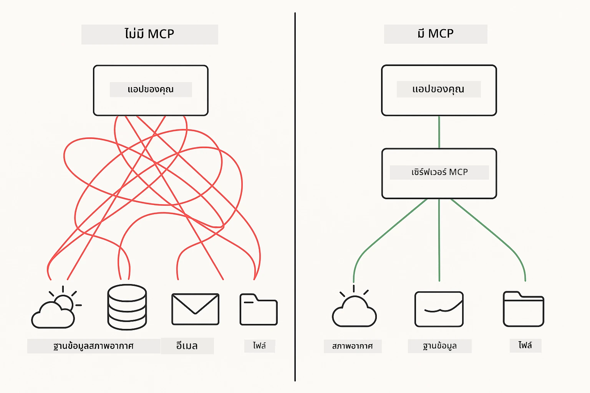
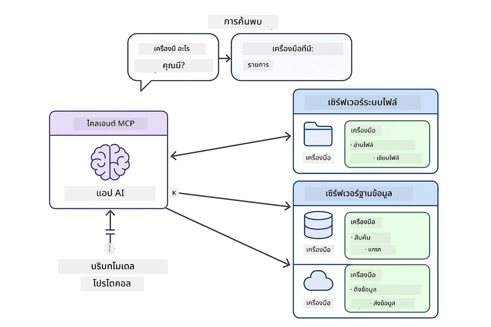
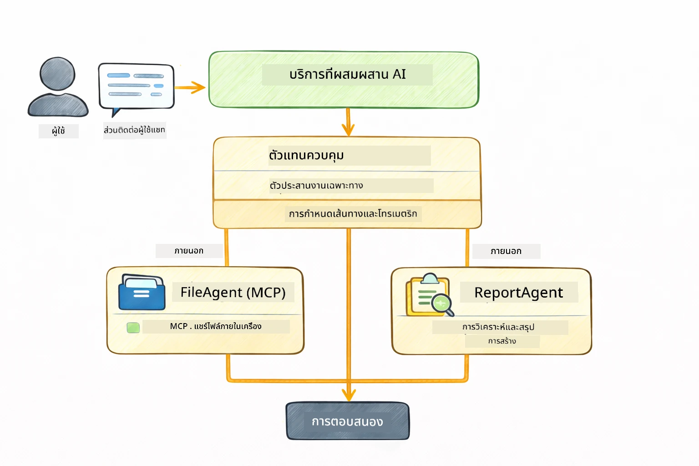

<!--
CO_OP_TRANSLATOR_METADATA:
{
  "original_hash": "6c816d130a1fa47570c11907e72d84ae",
  "translation_date": "2026-01-05T23:33:45+00:00",
  "source_file": "05-mcp/README.md",
  "language_code": "th"
}
-->
# Module 05: โปรโตคอลบริบทโมเดล (MCP)

## สารบัญ

- [สิ่งที่คุณจะได้เรียนรู้](../../../05-mcp)
- [MCP คืออะไร?](../../../05-mcp)
- [วิธีที่ MCP ทำงาน](../../../05-mcp)
- [โมดูล Agentic](../../../05-mcp)
- [การรันตัวอย่าง](../../../05-mcp)
  - [สิ่งที่ต้องเตรียม](../../../05-mcp)
- [เริ่มต้นอย่างรวดเร็ว](../../../05-mcp)
  - [การจัดการไฟล์ (Stdio)](../../../05-mcp)
  - [Supervisor Agent](../../../05-mcp)
    - [ความเข้าใจผลลัพธ์](../../../05-mcp)
    - [กลยุทธ์การตอบกลับ](../../../05-mcp)
    - [คำอธิบายฟีเจอร์ของโมดูล Agentic](../../../05-mcp)
- [แนวคิดหลัก](../../../05-mcp)
- [ขอแสดงความยินดี!](../../../05-mcp)
  - [จะทำอะไรต่อไป?](../../../05-mcp)

## สิ่งที่คุณจะได้เรียนรู้

คุณได้สร้าง AI สนทนา เชี่ยวชาญการใช้ prompt ทำให้คำตอบอิงตามเอกสาร และสร้างเอเจนต์พร้อมเครื่องมือ แต่เครื่องมือเหล่านั้นล้วนสร้างขึ้นเฉพาะสำหรับแอปพลิเคชันของคุณเองเท่านั้น ถ้าคุณสามารถให้ AI ของคุณเข้าถึงระบบนิเวศเครื่องมือมาตรฐานที่ใครๆ ก็สร้างและแบ่งปันได้ล่ะ? ในโมดูลนี้ คุณจะได้เรียนรู้วิธีทำเช่นนั้นด้วยโปรโตคอลบริบทโมเดล (Model Context Protocol - MCP) และโมดูล agentic ของ LangChain4j เราเริ่มด้วยการสาธิตโปรแกรมอ่านไฟล์ MCP ง่ายๆ แล้วแสดงให้เห็นว่ามันรวมเข้ากับเวิร์กโฟลว์ agentic ขั้นสูงโดยใช้รูปแบบ Supervisor Agent ได้อย่างไร

## MCP คืออะไร?

โปรโตคอลบริบทโมเดล (MCP) ให้สิ่งที่ต้องการ — วิธีมาตรฐานสำหรับแอปพลิเคชัน AI ในการค้นหาและใช้เครื่องมือภายนอก แทนที่จะเขียนอินทิเกรชันแบบกำหนดเองสำหรับแต่ละแหล่งข้อมูลหรือบริการ คุณเชื่อมต่อกับเซิร์ฟเวอร์ MCP ที่เปิดเผยความสามารถของเครื่องมือในรูปแบบที่สอดคล้องกัน เอเจนต์ AI ของคุณจึงสามารถค้นหาและใช้เครื่องมือเหล่านี้ได้โดยอัตโนมัติ



*ก่อน MCP: อินทิเกรชันแบบจุดต่อจุดซับซ้อน หลัง MCP: โปรโตคอลเดียว ความเป็นไปได้ไร้ขีดจำกัด*

MCP แก้ปัญหาพื้นฐานในการพัฒนา AI: อินทิเกรชันทุกตัวเป็นแบบกำหนดเอง อยากเข้าถึง GitHub? โค้ดแบบกำหนดเอง อยากอ่านไฟล์? โค้ดแบบกำหนดเอง อยากสืบค้นฐานข้อมูล? โค้ดแบบกำหนดเอง และอินทิเกรชันเหล่านี้ไม่ทำงานร่วมกับแอป AI อื่นๆ

MCP มาตรฐานนี้ เซิร์ฟเวอร์ MCP เปิดเผยเครื่องมือพร้อมคำอธิบายและสคีมาเครื่องมือที่ชัดเจน ลูกค้า MCP ใดๆ ก็สามารถเชื่อมต่อ ค้นหาเครื่องมือที่ใช้ได้ และใช้งาน เครื่องมือสร้างครั้งเดียว ใช้ได้ทุกที่



*สถาปัตยกรรมโปรโตคอลบริบทโมเดล — การค้นหาและใช้งานเครื่องมือแบบมาตรฐาน*

## วิธีที่ MCP ทำงาน

**สถาปัตยกรรมเซิร์ฟเวอร์-ไคลเอ็นต์**

MCP ใช้รูปแบบลูกค้า-เซิร์ฟเวอร์ เซิร์ฟเวอร์ให้บริการเครื่องมือ — เช่น อ่านไฟล์ สืบค้นฐานข้อมูล เรียกใช้งาน API ไคลเอ็นต์ (แอป AI ของคุณ) เชื่อมต่อกับเซิร์ฟเวอร์และใช้เครื่องมือเหล่านั้น

เพื่อใช้ MCP กับ LangChain4j ให้เพิ่ม dependency Maven ดังนี้:

```xml
<dependency>
    <groupId>dev.langchain4j</groupId>
    <artifactId>langchain4j-mcp</artifactId>
    <version>${langchain4j.version}</version>
</dependency>
```

**การค้นหาเครื่องมือ**

เมื่อไคลเอ็นต์ของคุณเชื่อมต่อกับเซิร์ฟเวอร์ MCP มันจะถามว่า "คุณมีเครื่องมืออะไรบ้าง?" เซิร์ฟเวอร์ตอบกลับด้วยรายการเครื่องมือ พร้อมคำอธิบายและสคีมากำหนดพารามิเตอร์ เอเจนต์ AI ของคุณสามารถตัดสินใจเลือกเครื่องมือใช้งานตามคำขอของผู้ใช้

**กลไกการส่งข้อมูล**

MCP รองรับกลไกการส่งข้อมูลหลายแบบ โมดูลนี้สาธิตการส่งข้อมูลแบบ Stdio สำหรับกระบวนการในเครื่อง:


*กลไกการส่งข้อมูล MCP: HTTP สำหรับเซิร์ฟเวอร์ระยะไกล, Stdio สำหรับกระบวนการในเครื่อง*

**Stdio** - [StdioTransportDemo.java](../../../05-mcp/src/main/java/com/example/langchain4j/mcp/StdioTransportDemo.java)

สำหรับกระบวนการในเครื่อง แอปของคุณจะสร้างเซิร์ฟเวอร์เป็นซับโพรเซส และสื่อสารผ่านทาง input/output มาตรฐาน เหมาะสำหรับเข้าถึงระบบไฟล์หรือเครื่องมือบรรทัดคำสั่ง

```java
McpTransport stdioTransport = new StdioMcpTransport.Builder()
    .command(List.of(
        npmCmd, "exec",
        "@modelcontextprotocol/server-filesystem@2025.12.18",
        resourcesDir
    ))
    .logEvents(false)
    .build();
```

> **🤖 ลองใช้กับ [GitHub Copilot](https://github.com/features/copilot) Chat:** เปิด [`StdioTransportDemo.java`](../../../05-mcp/src/main/java/com/example/langchain4j/mcp/StdioTransportDemo.java) และถาม:
> - "การส่งข้อมูลแบบ Stdio ทำงานอย่างไร และเมื่อใดควรใช้แทน HTTP?"
> - "LangChain4j จัดการวงจรชีวิตของกระบวนการเซิร์ฟเวอร์ MCP ที่สร้างขึ้นอย่างไร?"
> - "ผลกระทบด้านความปลอดภัยของการให้ AI เข้าถึงระบบแฟ้มคืออะไร?"

## โมดูล Agentic

ในขณะที่ MCP ให้เครื่องมือที่มาตรฐาน โมดูล agentic ของ LangChain4j ให้วิธีการเชิงประกาศในการสร้างเอเจนต์ที่ควบคุมเครื่องมือเหล่านั้น การกำกับด้วย `@Agent` และ `AgenticServices` ช่วยให้คุณกำหนดพฤติกรรมเอเจนต์ผ่านอินเตอร์เฟส แทนการเขียนโค้ดเชิงกระบวนการ

ในโมดูลนี้ คุณจะสำรวจรูปแบบ **Supervisor Agent** — แนวทาง agentic AI ขั้นสูงที่เอเจนต์ "ผู้ดูแล" ตัดสินใจแบบไดนามิกว่าจะเรียกเอเจนต์ย่อยตัวใดตามคำขอของผู้ใช้ เราจะรวมแนวคิดทั้งสองนี้โดยให้อีกเอเจนต์ย่อยของเรามีความสามารถเข้าถึงไฟล์ผ่าน MCP

เพื่อใช้โมดูล agentic ให้เพิ่ม dependency Maven ดังนี้:

```xml
<dependency>
    <groupId>dev.langchain4j</groupId>
    <artifactId>langchain4j-agentic</artifactId>
    <version>${langchain4j.mcp.version}</version>
</dependency>
```

> **⚠️ ทดลอง:** โมดูล `langchain4j-agentic` เป็น **รุ่นทดลอง** และอาจมีการเปลี่ยนแปลง วิธีที่เสถียรในการสร้างผู้ช่วย AI คือ `langchain4j-core` พร้อมเครื่องมือแบบกำหนดเอง (Module 04)

## การรันตัวอย่าง

### สิ่งที่ต้องเตรียม

- Java 21+ และ Maven 3.9+
- Node.js 16+ และ npm (สำหรับเซิร์ฟเวอร์ MCP)
- กำหนดค่าตัวแปรแวดล้อมในไฟล์ `.env` (จากไดเรกทอรีราก):
  - `AZURE_OPENAI_ENDPOINT`, `AZURE_OPENAI_API_KEY`, `AZURE_OPENAI_DEPLOYMENT` (เหมือน Module 01-04)

> **หมายเหตุ:** หากยังไม่ได้ตั้งค่าตัวแปรแวดล้อม ดูที่ [Module 00 - Quick Start](../00-quick-start/README.md) สำหรับคำแนะนำ หรือก็อปปี้ `.env.example` เป็น `.env` ในไดเรกทอรีรากและกรอกค่าของคุณ

## เริ่มต้นอย่างรวดเร็ว

**ใช้ VS Code:** คลิกขวาที่ไฟล์เดโมใด ๆ ใน Explorer แล้วเลือก **"Run Java"** หรือใช้การตั้งค่าการเปิดรันจากหน้ารันและดีบัก (ตรวจว่าคุณเพิ่ม token ในไฟล์ `.env` แล้ว)

**ใช้ Maven:** อีกทางเลือกหนึ่งคือรันคำสั่งในบรรทัดคำสั่งด้วยตัวอย่างด้านล่าง

### การจัดการไฟล์ (Stdio)

นี้แสดงถึงเครื่องมือแบบซับโพรเซสในเครื่อง

**✅ ไม่ต้องเตรียมอะไรเพิ่ม** — เซิร์ฟเวอร์ MCP จะถูกสร้างขึ้นอัตโนมัติ

**ใช้สคริปต์เริ่มต้น (แนะนำ):**

สคริปต์เริ่มต้นโหลดตัวแปรแวดล้อมจากไฟล์ `.env` รากโดยอัตโนมัติ:

**Bash:**
```bash
cd 05-mcp
chmod +x start-stdio.sh
./start-stdio.sh
```

**PowerShell:**
```powershell
cd 05-mcp
.\start-stdio.ps1
```

**ใช้ VS Code:** คลิกขวาที่ `StdioTransportDemo.java` แล้วเลือก **"Run Java"** (ตรวจสอบว่าไฟล์ `.env` ถูกตั้งค่าแล้ว)

แอปพลิเคชันจะสร้างเซิร์ฟเวอร์ MCP ระบบไฟล์โดยอัตโนมัติและอ่านไฟล์ในเครื่อง ดูวิธีการจัดการซับโพรเซสที่ทำเพื่อคุณ

**ผลลัพธ์ที่คาดหวัง:**
```
Assistant response: The file provides an overview of LangChain4j, an open-source Java library
for integrating Large Language Models (LLMs) into Java applications...
```

### Supervisor Agent

รูปแบบ **Supervisor Agent** เป็นรูปแบบ agentic AI ที่ **ยืดหยุ่น** ผู้ดูแลใช้ LLM ตัดสินใจอิสระว่าจะเรียกเอเจนต์ใดตามคำขอผู้ใช้ ในตัวอย่างถัดไป เรารวมการเข้าถึงไฟล์ผ่าน MCP กับเอเจนต์ LLM เพื่อสร้างเวิร์กโฟลว์อ่านไฟล์ → สร้างรายงานที่ควบคุมการทำงานโดยผู้ดูแล

ในเดโมนี้ `FileAgent` อ่านไฟล์ด้วยเครื่องมือระบบไฟล์ MCP และ `ReportAgent` สร้างรายงานที่มีสรุปผู้บริหาร (1 ประโยค) 3 จุดสำคัญ และคำแนะนำ ผู้ดูแลจัดการเวิร์กโฟลว์นี้โดยอัตโนมัติ:



```
┌─────────────┐      ┌──────────────┐
│  FileAgent  │ ───▶ │ ReportAgent  │
│ (MCP tools) │      │  (pure LLM)  │
└─────────────┘      └──────────────┘
   outputKey:           outputKey:
  'fileContent'         'report'
```

แต่ละเอเจนต์เก็บผลลัพธ์ไว้ใน **Agentic Scope** (หน่วยความจำแชร์) ให้เอเจนต์ถัดไปเข้าถึงผลลัพธ์ก่อนหน้าได้ แสดงให้เห็นว่าเครื่องมือ MCP รวมเข้ากับเวิร์กโฟลว์ agentic ได้อย่างราบรื่น — ผู้ดูแลไม่จำเป็นต้องรู้ *วิธี* อ่านไฟล์ เพียงรู้ว่า `FileAgent` ทำได้

#### การรันเดโม

สคริปต์เริ่มต้นโหลดตัวแปรแวดล้อมจากไฟล์ `.env` รากโดยอัตโนมัติ:

**Bash:**
```bash
cd 05-mcp
chmod +x start-supervisor.sh
./start-supervisor.sh
```

**PowerShell:**
```powershell
cd 05-mcp
.\start-supervisor.ps1
```

**ใช้ VS Code:** คลิกขวาที่ `SupervisorAgentDemo.java` แล้วเลือก **"Run Java"** (ตรวจสอบว่าไฟล์ `.env` ถูกตั้งค่าแล้ว)

#### วิธีการทำงานของ Supervisor

```java
// ขั้นตอนที่ 1: FileAgent อ่านไฟล์โดยใช้เครื่องมือ MCP
FileAgent fileAgent = AgenticServices.agentBuilder(FileAgent.class)
        .chatModel(model)
        .toolProvider(mcpToolProvider)  // มีเครื่องมือ MCP สำหรับการดำเนินการไฟล์
        .build();

// ขั้นตอนที่ 2: ReportAgent สร้างรายงานที่มีโครงสร้าง
ReportAgent reportAgent = AgenticServices.agentBuilder(ReportAgent.class)
        .chatModel(model)
        .build();

// ผู้ควบคุมการทำงานจัดการลำดับงานไฟล์ → รายงาน
SupervisorAgent supervisor = AgenticServices.supervisorBuilder()
        .chatModel(model)
        .subAgents(fileAgent, reportAgent)
        .responseStrategy(SupervisorResponseStrategy.LAST)  // ส่งคืนรายงานสุดท้าย
        .build();

// ผู้ควบคุมการทำงานตัดสินใจเลือกตัวแทนที่จะเรียกใช้งานตามคำขอ
String response = supervisor.invoke("Read the file at /path/file.txt and generate a report");
```

#### กลยุทธ์การตอบกลับ

เมื่อคุณตั้งค่า `SupervisorAgent` คุณกำหนดวิธีให้มันสรุปคำตอบสุดท้ายแก่ผู้ใช้หลังจากเอเจนต์ย่อยทำงานเสร็จ กลยุทธ์ที่ใช้ได้มีดังนี้:

| กลยุทธ์ | คำอธิบาย |
|----------|-------------|
| **LAST** | ผู้ดูแลคืนผลลัพธ์ของเอเจนต์หรือเครื่องมือย่อยตัวสุดท้าย เหมาะเมื่อเอเจนต์สุดท้ายในเวิร์กโฟลว์ออกแบบมาเพื่อสร้างคำตอบสมบูรณ์ (เช่น "เอเจนต์สรุป" ในกระบวนการวิจัย) |
| **SUMMARY** | ผู้ดูแลใช้ LLM ภายในสังเคราะห์สรุปการสนทนาและผลลัพธ์เอเจนต์ย่อยทั้งหมด แล้วคืนสรุปนั้นเป็นคำตอบสุดท้าย ให้คำตอบที่ชัดเจนและรวบรวมแก่ผู้ใช้ |
| **SCORED** | ระบบใช้ LLM ภายในให้คะแนนทั้งคำตอบ LAST และ SUMMARY ตามคำขอผู้ใช้เดิม จากนั้นคืนผลลัพธ์ที่ได้คะแนนสูงกว่า |

ดู [SupervisorAgentDemo.java](../../../05-mcp/src/main/java/com/example/langchain4j/mcp/SupervisorAgentDemo.java) สำหรับการใช้งานครบถ้วน

> **🤖 ลองใช้กับ [GitHub Copilot](https://github.com/features/copilot) Chat:** เปิด [`SupervisorAgentDemo.java`](../../../05-mcp/src/main/java/com/example/langchain4j/mcp/SupervisorAgentDemo.java) และถาม:
> - "ผู้ดูแลตัดสินใจเลือกเอเจนต์ไหนใช้งานอย่างไร?"
> - "ความแตกต่างระหว่างรูปแบบ Supervisor และ Sequential workflow คืออะไร?"
> - "ฉันจะปรับแต่งพฤติกรรมการวางแผนของ Supervisor ได้อย่างไร?"

#### ความเข้าใจผลลัพธ์

เมื่อคุณรันเดโม จะเห็นกระบวนการสรุปวิธีที่ผู้ดูแลควบคุมเอเจนต์หลายตัว นี่คือความหมายของแต่ละส่วน:

```
======================================================================
  FILE → REPORT WORKFLOW DEMO
======================================================================

This demo shows a clear 2-step workflow: read a file, then generate a report.
The Supervisor orchestrates the agents automatically based on the request.
```

**หัวเรื่อง** แนะนำแนวคิดเวิร์กโฟลว์: ท่อทำงานตั่งแต่การอ่านไฟล์ถึงการสร้างรายงานที่เน้นเป้าหมาย

```
--- WORKFLOW ---------------------------------------------------------
  ┌─────────────┐      ┌──────────────┐
  │  FileAgent  │ ───▶ │ ReportAgent  │
  │ (MCP tools) │      │  (pure LLM)  │
  └─────────────┘      └──────────────┘
   outputKey:           outputKey:
   'fileContent'        'report'

--- AVAILABLE AGENTS -------------------------------------------------
  [FILE]   FileAgent   - Reads files via MCP → stores in 'fileContent'
  [REPORT] ReportAgent - Generates structured report → stores in 'report'
```

**แผนภาพเวิร์กโฟลว์** แสดงการไหลของข้อมูลระหว่างเอเจนต์แต่ละตัว มีบทบาทเฉพาะ:
- **FileAgent** อ่านไฟล์ด้วยเครื่องมือ MCP และเก็บข้อมูลดิบใน `fileContent`
- **ReportAgent** รับข้อมูลนี้และสร้างรายงานที่มีโครงสร้างใน `report`

```
--- USER REQUEST -----------------------------------------------------
  "Read the file at .../file.txt and generate a report on its contents"
```

**คำขอของผู้ใช้** แสดงงานที่ได้รับ ผู้ดูแลแยกวิเคราะห์และตัดสินใจเรียก FileAgent → ReportAgent

```
--- SUPERVISOR ORCHESTRATION -----------------------------------------
  The Supervisor decides which agents to invoke and passes data between them...

  +-- STEP 1: Supervisor chose -> FileAgent (reading file via MCP)
  |
  |   Input: .../file.txt
  |
  |   Result: LangChain4j is an open-source, provider-agnostic Java framework for building LLM...
  +-- [OK] FileAgent (reading file via MCP) completed

  +-- STEP 2: Supervisor chose -> ReportAgent (generating structured report)
  |
  |   Input: LangChain4j is an open-source, provider-agnostic Java framew...
  |
  |   Result: Executive Summary...
  +-- [OK] ReportAgent (generating structured report) completed
```

**การจัดการโดยผู้ดูแล** แสดงการทำงานเป็น 2 ขั้นตอน:
1. **FileAgent** อ่านไฟล์ผ่าน MCP และเก็บข้อมูล
2. **ReportAgent** รับข้อมูลและสร้างรายงานที่มีโครงสร้าง

ผู้ดูแลตัดสินใจได้ **อย่างอิสระ** ตามคำขอของผู้ใช้

```
--- FINAL RESPONSE ---------------------------------------------------
Executive Summary
...

Key Points
...

Recommendations
...

--- AGENTIC SCOPE (Data Flow) ----------------------------------------
  Each agent stores its output for downstream agents to consume:
  * fileContent: LangChain4j is an open-source, provider-agnostic Java framework...
  * report: Executive Summary...
```

#### คำอธิบายฟีเจอร์ของโมดูล Agentic

ตัวอย่างนี้แสดงฟีเจอร์ขั้นสูงหลายอย่างของโมดูล agentic ลองดู Agentic Scope และ Agent Listeners อย่างใกล้ชิด

**Agentic Scope** คือตัวเก็บหน่วยความจำแชร์ที่เอเจนต์เก็บผลลัพธ์โดยใช้ `@Agent(outputKey="...")` ทำให้:
- เอเจนต์ตัวหลังเข้าถึงผลลัพธ์ของเอเจนต์ก่อนหน้าได้
- ผู้ดูแลสังเคราะห์คำตอบสุดท้าย
- คุณตรวจสอบผลลัพธ์ของแต่ละเอเจนต์ได้

```java
ResultWithAgenticScope<String> result = supervisor.invokeWithAgenticScope(request);
AgenticScope scope = result.agenticScope();
String fileContent = scope.readState("fileContent");  // ข้อมูลไฟล์ดิบจาก FileAgent
String report = scope.readState("report");            // รายงานโครงสร้างจาก ReportAgent
```

**Agent Listeners** ช่วยติดตามและดีบักการทำงานของเอเจนต์ ผลลัพธ์ทีละขั้นตอนจากเดโมมาจาก AgentListener ที่เชื่อมต่อกับทุกการเรียกเอเจนต์:
- **beforeAgentInvocation** - เรียกเมื่อผู้ดูแลเลือกเอเจนต์ ให้เห็นว่าเลือกเอเจนต์ไหนและทำไม
- **afterAgentInvocation** - เรียกเมื่อเอเจนต์ทำงานเสร็จ แสดงผลลัพธ์
- **inheritedBySubagents** - เมื่อเป็นจริง ตัวฟังนี้ตรวจสอบเอเจนต์ทั้งหมดในลำดับชั้น

```java
AgentListener monitor = new AgentListener() {
    private int step = 0;
    
    @Override
    public void beforeAgentInvocation(AgentRequest request) {
        step++;
        System.out.println("  +-- STEP " + step + ": " + request.agentName());
    }
    
    @Override
    public void afterAgentInvocation(AgentResponse response) {
        System.out.println("  +-- [OK] " + response.agentName() + " completed");
    }
    
    @Override
    public boolean inheritedBySubagents() {
        return true; // แพร่กระจายไปยังผู้ช่วยย่อยทั้งหมด
    }
};
```

นอกเหนือจากรูปแบบ Supervisor โมดูล `langchain4j-agentic` ยังมีรูปแบบเวิร์กโฟลว์และฟีเจอร์ทรงพลังหลายอย่าง:

| รูปแบบ | คำอธิบาย | กรณีใช้งาน |
|---------|-------------|----------|
| **Sequential** | รันเอเจนต์ตามลำดับ ผลลัพธ์ส่งต่อ | ท่อทำงาน: วิจัย → วิเคราะห์ → รายงาน |
| **Parallel** | รันเอเจนต์พร้อมกัน | งานอิสระ: สภาพอากาศ + ข่าว + หุ้น |
| **Loop** | วนซ้ำจนกว่าจะถึงเงื่อนไข | การให้คะแนนคุณภาพ: ปรับจนได้คะแนน ≥ 0.8 |
| **Conditional** | เลือกเส้นทางตามเงื่อนไข | การจัดประเภท → ส่งต่อไปเอเจนต์เฉพาะทาง |
| **Human-in-the-Loop** | เพิ่มจุดตรวจสอบมนุษย์ | เวิร์กโฟลว์อนุมัติ, ตรวจสอบเนื้อหา |

## แนวคิดหลัก

เมื่อคุณได้สำรวจ MCP และโมดูล agentic ในการใช้งานแล้ว มาสรุปว่าเมื่อใดควรใช้แต่ละแนวทาง

**MCP** เหมาะเมื่อคุณต้องการใช้ประโยชน์จากระบบนิเวศเครื่องมือที่มีอยู่ สร้างเครื่องมือที่แอปพลิเคชันหลายตัวสามารถแชร์ ใช้บริการภายนอกด้วยโปรโตคอลมาตรฐาน หรือสลับการใช้งานเครื่องมือโดยไม่ต้องแก้โค้ด

**โมดูล Agentic** เหมาะที่สุดเมื่อคุณต้องการกำหนดเอเจนต์เชิงประกาศด้วย annotation `@Agent` ต้องการควบคุมเวิร์กโฟลว์ (เรียงลำดับ, วนซ้ำ, พร้อมกัน) ชอบออกแบบเอเจนต์ด้วยอินเตอร์เฟสมากกว่าโค้ดเชิงกระบวนการ หรือรวมเอเจนต์หลายตัวที่แชร์ผลลัพธ์ผ่าน `outputKey`

**รูปแบบ Supervisor Agent** โดดเด่นเมื่อเวิร์กโฟลว์ไม่สามารถคาดการณ์ล่วงหน้าและต้องให้ LLM ตัดสินใจ เมื่อมีเอเจนต์เฉพาะทางหลายตัวที่ต้องจัดการแบบไดนามิก สร้างระบบสนทนาเส้นทางไปความสามารถต่างๆ หรือต้องการพฤติกรรมเอเจนต์ที่ยืดหยุ่นและปรับตัวได้สูงสุด
## ขอแสดงความยินดี!

คุณได้เรียนจบหลักสูตร LangChain4j สำหรับผู้เริ่มต้นแล้ว คุณได้เรียนรู้:

- วิธีสร้าง AI สนทนาพร้อมความจำ (โมดูล 01)
- รูปแบบการออกแบบคำสั่งสำหรับงานต่าง ๆ (โมดูล 02)
- การจับคู่คำตอบกับเอกสารของคุณด้วย RAG (โมดูล 03)
- การสร้างตัวแทน AI พื้นฐาน (ผู้ช่วย) ด้วยเครื่องมือที่กำหนดเอง (โมดูล 04)
- การผนวกเครื่องมือมาตรฐานกับ LangChain4j MCP และโมดูล Agentic (โมดูล 05)

### ต่อไปคืออะไร?

หลังจากเรียนจบแต่ละโมดูลแล้ว ให้สำรวจ [คู่มือการทดสอบ](../docs/TESTING.md) เพื่อดูแนวคิดการทดสอบ LangChain4j ในการปฏิบัติ

**แหล่งข้อมูลอย่างเป็นทางการ:**
- [เอกสาร LangChain4j](https://docs.langchain4j.dev/) - คู่มือครอบคลุมและการอ้างอิง API
- [LangChain4j GitHub](https://github.com/langchain4j/langchain4j) - โค้ดต้นฉบับและตัวอย่าง
- [บทแนะนำ LangChain4j](https://docs.langchain4j.dev/tutorials/) - บทแนะนำทีละขั้นตอนสำหรับกรณีการใช้งานต่าง ๆ

ขอขอบคุณที่เรียนจบหลักสูตรนี้!

---

**การนำทาง:** [← ก่อนหน้า: โมดูล 04 - เครื่องมือ](../04-tools/README.md) | [กลับสู่หน้าหลัก](../README.md)

---

<!-- CO-OP TRANSLATOR DISCLAIMER START -->
**ข้อจำกัดความรับผิดชอบ**:  
เอกสารนี้ได้รับการแปลโดยใช้บริการแปลภาษาอัตโนมัติ [Co-op Translator](https://github.com/Azure/co-op-translator) แม้เราจะพยายามให้ความถูกต้องสูงสุด แต่โปรดทราบว่าการแปลโดยอัตโนมัติอาจมีข้อผิดพลาดหรือความไม่แม่นยำ เอกสารต้นฉบับในภาษาดั้งเดิมถือเป็นแหล่งข้อมูลที่เชื่อถือได้ สำหรับข้อมูลที่สำคัญ ขอแนะนำให้ใช้บริการแปลโดยผู้เชี่ยวชาญด้านมนุษย์ เราจะไม่รับผิดชอบต่อความเข้าใจผิดหรือการตีความที่ผิดพลาดใด ๆ ที่เกิดจากการใช้การแปลนี้
<!-- CO-OP TRANSLATOR DISCLAIMER END -->