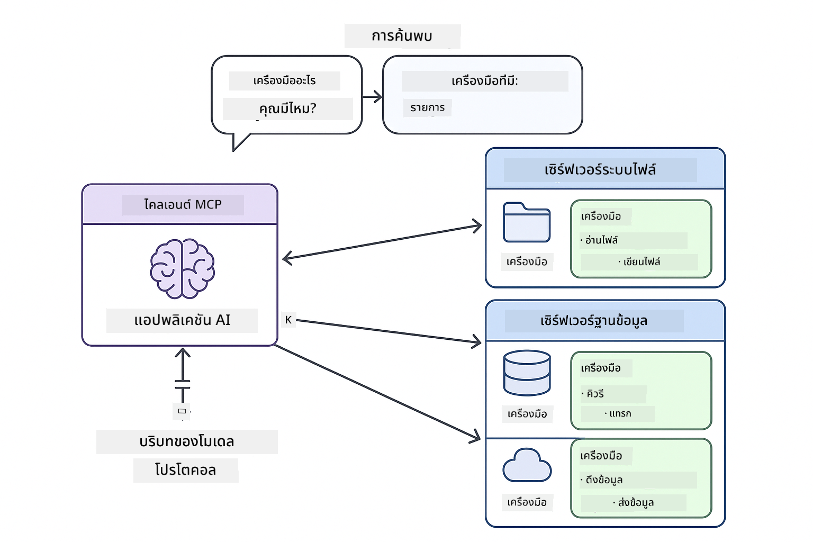

<!--
CO_OP_TRANSLATOR_METADATA:
{
  "original_hash": "c25ec1f10ef156c53e190cdf8b0711ab",
  "translation_date": "2025-12-13T17:53:52+00:00",
  "source_file": "05-mcp/README.md",
  "language_code": "th"
}
-->
# Module 05: โปรโตคอลบริบทของโมเดล (MCP)

## สารบัญ

- [สิ่งที่คุณจะได้เรียนรู้](../../../05-mcp)
- [ทำความเข้าใจ MCP](../../../05-mcp)
- [MCP ทำงานอย่างไร](../../../05-mcp)
  - [สถาปัตยกรรมเซิร์ฟเวอร์-ไคลเอนต์](../../../05-mcp)
  - [การค้นหาเครื่องมือ](../../../05-mcp)
  - [กลไกการขนส่ง](../../../05-mcp)
- [ข้อกำหนดเบื้องต้น](../../../05-mcp)
- [สิ่งที่โมดูลนี้ครอบคลุม](../../../05-mcp)
- [เริ่มต้นอย่างรวดเร็ว](../../../05-mcp)
  - [ตัวอย่างที่ 1: เครื่องคิดเลขระยะไกล (Streamable HTTP)](../../../05-mcp)
  - [ตัวอย่างที่ 2: การดำเนินการไฟล์ (Stdio)](../../../05-mcp)
  - [ตัวอย่างที่ 3: การวิเคราะห์ Git (Docker)](../../../05-mcp)
- [แนวคิดสำคัญ](../../../05-mcp)
  - [การเลือกกลไกการขนส่ง](../../../05-mcp)
  - [การค้นหาเครื่องมือ](../../../05-mcp)
  - [การจัดการเซสชัน](../../../05-mcp)
  - [ข้อควรพิจารณาข้ามแพลตฟอร์ม](../../../05-mcp)
- [เมื่อใดควรใช้ MCP](../../../05-mcp)
- [ระบบนิเวศ MCP](../../../05-mcp)
- [ขอแสดงความยินดี!](../../../05-mcp)
  - [ขั้นตอนถัดไป?](../../../05-mcp)
- [การแก้ไขปัญหา](../../../05-mcp)

## สิ่งที่คุณจะได้เรียนรู้

คุณได้สร้าง AI สนทนา, เชี่ยวชาญการใช้พรอมต์, ตอบสนองโดยอิงเอกสาร และสร้างเอเจนต์ที่มีเครื่องมือ แต่เครื่องมือเหล่านั้นล้วนสร้างขึ้นเฉพาะสำหรับแอปพลิเคชันของคุณเท่านั้น แล้วถ้าคุณสามารถให้ AI ของคุณเข้าถึงระบบนิเวศเครื่องมือมาตรฐานที่ใครก็สามารถสร้างและแชร์ได้ล่ะ?

โปรโตคอลบริบทของโมเดล (MCP) ให้สิ่งนั้น — วิธีมาตรฐานสำหรับแอปพลิเคชัน AI ในการค้นหาและใช้เครื่องมือภายนอก แทนที่จะเขียนการผสานรวมแบบกำหนดเองสำหรับแต่ละแหล่งข้อมูลหรือบริการ คุณเชื่อมต่อกับเซิร์ฟเวอร์ MCP ที่เปิดเผยความสามารถในรูปแบบที่สอดคล้องกัน จากนั้นเอเจนต์ AI ของคุณสามารถค้นหาและใช้เครื่องมือเหล่านี้โดยอัตโนมัติ


*ก่อน MCP: การผสานรวมแบบจุดต่อจุดที่ซับซ้อน หลัง MCP: โปรโตคอลเดียว ความเป็นไปได้ไม่รู้จบ*

## ทำความเข้าใจ MCP

MCP แก้ปัญหาพื้นฐานในการพัฒนา AI: ทุกการผสานรวมเป็นแบบกำหนดเอง ต้องการเข้าถึง GitHub? โค้ดกำหนดเอง ต้องการอ่านไฟล์? โค้ดกำหนดเอง ต้องการสอบถามฐานข้อมูล? โค้ดกำหนดเอง และไม่มีการผสานรวมใดที่ทำงานร่วมกับแอป AI อื่นได้

MCP มาตรฐานนี้ เซิร์ฟเวอร์ MCP เปิดเผยเครื่องมือพร้อมคำอธิบายและสคีมาอย่างชัดเจน ไคลเอนต์ MCP ใด ๆ ก็สามารถเชื่อมต่อ ค้นหาเครื่องมือที่มี และใช้งานได้ สร้างครั้งเดียว ใช้ได้ทุกที่



*สถาปัตยกรรมโปรโตคอลบริบทของโมเดล - การค้นหาและเรียกใช้เครื่องมือแบบมาตรฐาน*

## MCP ทำงานอย่างไร

**สถาปัตยกรรมเซิร์ฟเวอร์-ไคลเอนต์**

MCP ใช้โมเดลไคลเอนต์-เซิร์ฟเวอร์ เซิร์ฟเวอร์ให้บริการเครื่องมือ — อ่านไฟล์, สอบถามฐานข้อมูล, เรียก API ไคลเอนต์ (แอป AI ของคุณ) เชื่อมต่อกับเซิร์ฟเวอร์และใช้เครื่องมือเหล่านั้น

**การค้นหาเครื่องมือ**

เมื่อไคลเอนต์ของคุณเชื่อมต่อกับเซิร์ฟเวอร์ MCP มันจะถามว่า "คุณมีเครื่องมืออะไรบ้าง?" เซิร์ฟเวอร์ตอบกลับด้วยรายการเครื่องมือที่มี พร้อมคำอธิบายและสคีมาพารามิเตอร์ เอเจนต์ AI ของคุณจึงตัดสินใจเลือกใช้เครื่องมือจากคำขอของผู้ใช้

**กลไกการขนส่ง**

MCP กำหนดกลไกการขนส่งสองแบบ: HTTP สำหรับเซิร์ฟเวอร์ระยะไกล, Stdio สำหรับกระบวนการในเครื่อง (รวมถึงคอนเทนเนอร์ Docker):


*กลไกการขนส่ง MCP: HTTP สำหรับเซิร์ฟเวอร์ระยะไกล, Stdio สำหรับกระบวนการในเครื่อง (รวมถึงคอนเทนเนอร์ Docker)*

**Streamable HTTP** - [StreamableHttpDemo.java](../../../05-mcp/src/main/java/com/example/langchain4j/mcp/StreamableHttpDemo.java)

สำหรับเซิร์ฟเวอร์ระยะไกล แอปของคุณส่งคำขอ HTTP ไปยังเซิร์ฟเวอร์ที่รันบนเครือข่าย ใช้ Server-Sent Events สำหรับการสื่อสารแบบเรียลไทม์

```java
McpTransport httpTransport = new StreamableHttpMcpTransport.Builder()
    .url("http://localhost:3001/mcp")
    .timeout(Duration.ofSeconds(60))
    .logRequests(true)
    .logResponses(true)
    .build();
```

> **🤖 ลองใช้กับ [GitHub Copilot](https://github.com/features/copilot) Chat:** เปิด [`StreamableHttpDemo.java`](../../../05-mcp/src/main/java/com/example/langchain4j/mcp/StreamableHttpDemo.java) และถาม:
> - "MCP แตกต่างจากการผสานรวมเครื่องมือโดยตรงใน Module 04 อย่างไร?"
> - "ข้อดีของการใช้ MCP สำหรับการแชร์เครื่องมือระหว่างแอปพลิเคชันคืออะไร?"
> - "ฉันจัดการกับการเชื่อมต่อล้มเหลวหรือหมดเวลาของเซิร์ฟเวอร์ MCP อย่างไร?"

**Stdio** - [StdioTransportDemo.java](../../../05-mcp/src/main/java/com/example/langchain4j/mcp/StdioTransportDemo.java)

สำหรับกระบวนการในเครื่อง แอปของคุณสร้างเซิร์ฟเวอร์เป็น subprocess และสื่อสารผ่าน standard input/output เหมาะสำหรับการเข้าถึงระบบไฟล์หรือเครื่องมือบรรทัดคำสั่ง

```java
McpTransport stdioTransport = new StdioMcpTransport.Builder()
    .command(List.of(
        npmCmd, "exec",
        "@modelcontextprotocol/server-filesystem@0.6.2",
        resourcesDir
    ))
    .logEvents(false)
    .build();
```

> **🤖 ลองใช้กับ [GitHub Copilot](https://github.com/features/copilot) Chat:** เปิด [`StdioTransportDemo.java`](../../../05-mcp/src/main/java/com/example/langchain4j/mcp/StdioTransportDemo.java) และถาม:
> - "กลไกการขนส่ง Stdio ทำงานอย่างไรและเมื่อใดควรใช้แทน HTTP?"
> - "LangChain4j จัดการวงจรชีวิตของกระบวนการเซิร์ฟเวอร์ MCP ที่ถูกสร้างขึ้นอย่างไร?"
> - "ผลกระทบด้านความปลอดภัยของการให้ AI เข้าถึงระบบไฟล์คืออะไร?"

**Docker (ใช้ Stdio)** - [GitRepositoryAnalyzer.java](../../../05-mcp/src/main/java/com/example/langchain4j/mcp/GitRepositoryAnalyzer.java)

สำหรับบริการที่รันในคอนเทนเนอร์ ใช้กลไกขนส่ง stdio เพื่อสื่อสารกับคอนเทนเนอร์ Docker ผ่าน `docker run` เหมาะสำหรับการพึ่งพาที่ซับซ้อนหรือสภาพแวดล้อมแยกส่วน

```java
McpTransport dockerTransport = new StdioMcpTransport.Builder()
    .command(List.of(
        "docker", "run",
        "-e", "GITHUB_PERSONAL_ACCESS_TOKEN=" + System.getenv("GITHUB_TOKEN"),
        "-v", volumeMapping,
        "-i", "mcp/git"
    ))
    .logEvents(true)
    .build();
```

> **🤖 ลองใช้กับ [GitHub Copilot](https://github.com/features/copilot) Chat:** เปิด [`GitRepositoryAnalyzer.java`](../../../05-mcp/src/main/java/com/example/langchain4j/mcp/GitRepositoryAnalyzer.java) และถาม:
> - "กลไกการขนส่ง Docker แยกเซิร์ฟเวอร์ MCP อย่างไรและมีข้อดีอะไรบ้าง?"
> - "ฉันตั้งค่าการแมปโวลุ่มเพื่อแชร์ข้อมูลระหว่างโฮสต์กับคอนเทนเนอร์ MCP อย่างไร?"
> - "แนวทางปฏิบัติที่ดีที่สุดสำหรับการจัดการวงจรชีวิตเซิร์ฟเวอร์ MCP บน Docker ในการผลิตคืออะไร?"

## การรันตัวอย่าง

### ข้อกำหนดเบื้องต้น

- Java 21+, Maven 3.9+
- Node.js 16+ และ npm (สำหรับเซิร์ฟเวอร์ MCP)
- **Docker Desktop** - ต้อง **กำลังรัน** สำหรับตัวอย่างที่ 3 (ไม่ใช่แค่ติดตั้ง)
- โทเค็นเข้าถึงส่วนตัว GitHub ตั้งค่าในไฟล์ `.env` (จาก Module 00)

> **หมายเหตุ:** หากคุณยังไม่ได้ตั้งค่าโทเค็น GitHub ดู [Module 00 - เริ่มต้นอย่างรวดเร็ว](../00-quick-start/README.md) สำหรับคำแนะนำ

> **⚠️ ผู้ใช้ Docker:** ก่อนรันตัวอย่างที่ 3 ตรวจสอบว่า Docker Desktop กำลังรันด้วยคำสั่ง `docker ps` หากพบข้อผิดพลาดการเชื่อมต่อ ให้เริ่ม Docker Desktop และรอประมาณ 30 วินาทีเพื่อเริ่มต้น

## เริ่มต้นอย่างรวดเร็ว

**ใช้ VS Code:** คลิกขวาที่ไฟล์ตัวอย่างใน Explorer แล้วเลือก **"Run Java"** หรือใช้การตั้งค่า launch จากแผง Run and Debug (ตรวจสอบว่าเพิ่มโทเค็นในไฟล์ `.env` แล้ว)

**ใช้ Maven:** หรือรันจากบรรทัดคำสั่งด้วยตัวอย่างด้านล่าง

**⚠️ สำคัญ:** ตัวอย่างบางตัวมีข้อกำหนดเบื้องต้น (เช่น ต้องเริ่มเซิร์ฟเวอร์ MCP หรือสร้างอิมเมจ Docker) ตรวจสอบความต้องการแต่ละตัวอย่างก่อนรัน

### ตัวอย่างที่ 1: เครื่องคิดเลขระยะไกล (Streamable HTTP)

แสดงการผสานรวมเครื่องมือผ่านเครือข่าย

**⚠️ ข้อกำหนดเบื้องต้น:** ต้องเริ่มเซิร์ฟเวอร์ MCP ก่อน (ดู Terminal 1 ด้านล่าง)

**Terminal 1 - เริ่มเซิร์ฟเวอร์ MCP:**

**Bash:**
```bash
git clone https://github.com/modelcontextprotocol/servers.git
cd servers/src/everything
npm install
node dist/streamableHttp.js
```

**PowerShell:**
```powershell
git clone https://github.com/modelcontextprotocol/servers.git
cd servers/src/everything
npm install
node dist/streamableHttp.js
```

**Terminal 2 - รันตัวอย่าง:**

**ใช้ VS Code:** คลิกขวาที่ `StreamableHttpDemo.java` แล้วเลือก **"Run Java"**

**ใช้ Maven:**

**Bash:**
```bash
export GITHUB_TOKEN=your_token_here
cd 05-mcp
mvn compile exec:java -Dexec.mainClass=com.example.langchain4j.mcp.StreamableHttpDemo
```

**PowerShell:**
```powershell
$env:GITHUB_TOKEN=your_token_here
cd 05-mcp
mvn --% compile exec:java -Dexec.mainClass=com.example.langchain4j.mcp.StreamableHttpDemo
```

ดูเอเจนต์ค้นหาเครื่องมือที่มี จากนั้นใช้เครื่องคิดเลขทำการบวกเลข

### ตัวอย่างที่ 2: การดำเนินการไฟล์ (Stdio)

แสดงเครื่องมือที่รันเป็น subprocess ในเครื่อง

**✅ ไม่ต้องมีข้อกำหนดเบื้องต้น** — เซิร์ฟเวอร์ MCP จะถูกสร้างขึ้นโดยอัตโนมัติ

**ใช้ VS Code:** คลิกขวาที่ `StdioTransportDemo.java` แล้วเลือก **"Run Java"**

**ใช้ Maven:**

**Bash:**
```bash
export GITHUB_TOKEN=your_token_here
cd 05-mcp
mvn compile exec:java -Dexec.mainClass=com.example.langchain4j.mcp.StdioTransportDemo
```

**PowerShell:**
```powershell
$env:GITHUB_TOKEN=your_token_here
cd 05-mcp
mvn --% compile exec:java -Dexec.mainClass=com.example.langchain4j.mcp.StdioTransportDemo
```

แอปสร้างเซิร์ฟเวอร์ MCP สำหรับระบบไฟล์โดยอัตโนมัติและอ่านไฟล์ในเครื่อง สังเกตการจัดการ subprocess ที่ทำให้คุณไม่ต้องดูแลเอง

**ผลลัพธ์ที่คาดหวัง:**
```
Assistant response: The content of the file is "Kaboom!".
```

### ตัวอย่างที่ 3: การวิเคราะห์ Git (Docker)

แสดงเซิร์ฟเวอร์เครื่องมือที่รันในคอนเทนเนอร์

**⚠️ ข้อกำหนดเบื้องต้น:** 
1. **Docker Desktop ต้องกำลังรัน** (ไม่ใช่แค่ติดตั้ง)
2. **ผู้ใช้ Windows:** แนะนำโหมด WSL 2 (Docker Desktop Settings → General → "Use the WSL 2 based engine") โหมด Hyper-V ต้องตั้งค่าแชร์ไฟล์ด้วยตนเอง
3. ต้องสร้างอิมเมจ Docker ก่อน (ดู Terminal 1 ด้านล่าง)

**ตรวจสอบว่า Docker กำลังรัน:**

**Bash:**
```bash
docker ps  # ควรแสดงรายการคอนเทนเนอร์ ไม่ใช่ข้อผิดพลาด
```

**PowerShell:**
```powershell
docker ps  # ควรแสดงรายการคอนเทนเนอร์ ไม่ใช่ข้อผิดพลาด
```

ถ้าเห็นข้อผิดพลาดเช่น "Cannot connect to Docker daemon" หรือ "The system cannot find the file specified" ให้เริ่ม Docker Desktop และรอให้เริ่มต้น (~30 วินาที)

**การแก้ไขปัญหา:**
- ถ้า AI รายงานว่าคลังเก็บว่างเปล่าหรือไม่มีไฟล์ แสดงว่าการแมปโวลุ่ม (`-v`) ไม่ทำงาน
- **ผู้ใช้ Windows Hyper-V:** เพิ่มไดเรกทอรีโปรเจกต์ใน Docker Desktop Settings → Resources → File sharing แล้วรีสตาร์ท Docker Desktop
- **วิธีแนะนำ:** เปลี่ยนเป็นโหมด WSL 2 เพื่อแชร์ไฟล์อัตโนมัติ (Settings → General → เปิดใช้งาน "Use the WSL 2 based engine")

**Terminal 1 - สร้างอิมเมจ Docker:**

**Bash:**
```bash
cd servers/src/git
docker build -t mcp/git .
```

**PowerShell:**
```powershell
cd servers/src/git
docker build -t mcp/git .
```

**Terminal 2 - รันโปรแกรมวิเคราะห์:**

**ใช้ VS Code:** คลิกขวาที่ `GitRepositoryAnalyzer.java` แล้วเลือก **"Run Java"**

**ใช้ Maven:**

**Bash:**
```bash
export GITHUB_TOKEN=your_token_here
cd 05-mcp
mvn compile exec:java -Dexec.mainClass=com.example.langchain4j.mcp.GitRepositoryAnalyzer
```

**PowerShell:**
```powershell
$env:GITHUB_TOKEN=your_token_here
cd 05-mcp
mvn --% compile exec:java -Dexec.mainClass=com.example.langchain4j.mcp.GitRepositoryAnalyzer
```

แอปรันคอนเทนเนอร์ Docker, แมปโฟลเดอร์รีโพสิตอรีของคุณ และวิเคราะห์โครงสร้างและเนื้อหาของรีโพสิตอรีผ่านเอเจนต์ AI

## แนวคิดสำคัญ

**การเลือกกลไกการขนส่ง**

เลือกตามที่ตั้งของเครื่องมือ:
- บริการระยะไกล → Streamable HTTP
- ระบบไฟล์ในเครื่อง → Stdio
- การพึ่งพาที่ซับซ้อน → Docker

**การค้นหาเครื่องมือ**

ไคลเอนต์ MCP ค้นหาเครื่องมือที่มีโดยอัตโนมัติเมื่อเชื่อมต่อ เอเจนต์ AI ของคุณเห็นคำอธิบายเครื่องมือและตัดสินใจเลือกใช้ตามคำขอของผู้ใช้

**การจัดการเซสชัน**

กลไก Streamable HTTP รักษาเซสชัน ทำให้มีการโต้ตอบแบบมีสถานะกับเซิร์ฟเวอร์ระยะไกล ส่วน Stdio และ Docker มักเป็นแบบไม่มีสถานะ

**ข้อควรพิจารณาข้ามแพลตฟอร์ม**

ตัวอย่างจัดการความแตกต่างของแพลตฟอร์มโดยอัตโนมัติ (คำสั่ง Windows กับ Unix, การแปลงเส้นทางสำหรับ Docker) ซึ่งสำคัญสำหรับการใช้งานจริงในสภาพแวดล้อมต่าง ๆ

## เมื่อใดควรใช้ MCP

**ใช้ MCP เมื่อ:**
- ต้องการใช้ประโยชน์จากระบบนิเวศเครื่องมือที่มีอยู่
- สร้างเครื่องมือที่หลายแอปจะใช้
- ผสานรวมบริการบุคคลที่สามด้วยโปรโตคอลมาตรฐาน
- ต้องการเปลี่ยนแปลงการใช้งานเครื่องมือโดยไม่ต้องแก้ไขโค้ด

**ใช้เครื่องมือกำหนดเอง (Module 04) เมื่อ:**
- สร้างฟังก์ชันเฉพาะแอปพลิเคชัน
- ประสิทธิภาพเป็นสิ่งสำคัญ (MCP มี overhead)
- เครื่องมือของคุณเรียบง่ายและไม่ต้องใช้ซ้ำ
- ต้องการควบคุมการทำงานอย่างเต็มที่

## ระบบนิเวศ MCP

โปรโตคอลบริบทของโมเดลเป็นมาตรฐานเปิดที่มีระบบนิเวศเติบโต:

- เซิร์ฟเวอร์ MCP อย่างเป็นทางการสำหรับงานทั่วไป (ระบบไฟล์, Git, ฐานข้อมูล)
- เซิร์ฟเวอร์ที่ชุมชนสร้างสำหรับบริการต่าง ๆ
- คำอธิบายและสคีมาเครื่องมือมาตรฐาน
- ความเข้ากันได้ข้ามเฟรมเวิร์ก (ทำงานกับไคลเอนต์ MCP ใดก็ได้)

มาตรฐานนี้หมายความว่าเครื่องมือที่สร้างสำหรับแอป AI หนึ่งจะทำงานกับแอปอื่น ๆ สร้างระบบนิเวศความสามารถที่ใช้ร่วมกัน

## ขอแสดงความยินดี!

คุณได้จบหลักสูตร LangChain4j สำหรับผู้เริ่มต้นแล้ว คุณได้เรียนรู้:

- วิธีสร้าง AI สนทนาพร้อมหน่วยความจำ (Module 01)
- รูปแบบวิศวกรรมพรอมต์สำหรับงานต่าง ๆ (Module 02)
- การตอบสนองโดยอิงเอกสารด้วย RAG (Module 03)
- การสร้างเอเจนต์ AI ด้วยเครื่องมือกำหนดเอง (Module 04)
- การผสานรวมเครื่องมือมาตรฐานผ่าน MCP (Module 05)

ตอนนี้คุณมีพื้นฐานในการสร้างแอป AI สำหรับการใช้งานจริง แนวคิดที่เรียนรู้ใช้ได้กับเฟรมเวิร์กหรือโมเดลใด ๆ — เป็นรูปแบบพื้นฐานในวิศวกรรม AI

### ขั้นตอนถัดไป?

หลังจากจบโมดูลแล้ว สำรวจ [คู่มือการทดสอบ](../docs/TESTING.md) เพื่อดูแนวคิดการทดสอบ LangChain4j ในการปฏิบัติ

**แหล่งข้อมูลอย่างเป็นทางการ:**
- [เอกสาร LangChain4j](https://docs.langchain4j.dev/) - คู่มือและอ้างอิง API ครบถ้วน
- [LangChain4j GitHub](https://github.com/langchain4j/langchain4j) - โค้ดต้นฉบับและตัวอย่าง
- [บทเรียน LangChain4j](https://docs.langchain4j.dev/tutorials/) - บทเรียนทีละขั้นตอนสำหรับกรณีใช้งานต่าง ๆ

ขอบคุณที่เรียนจบหลักสูตรนี้!

---

**การนำทาง:** [← ก่อนหน้า: Module 04 - เครื่องมือ](../04-tools/README.md) | [กลับสู่หน้าหลัก](../README.md)

---

## การแก้ไขปัญหา

### ไวยากรณ์คำสั่ง Maven บน PowerShell
**ปัญหา**: คำสั่ง Maven ล้มเหลวพร้อมข้อผิดพลาด `Unknown lifecycle phase ".mainClass=..."`

**สาเหตุ**: PowerShell ตีความ `=` เป็นตัวดำเนินการกำหนดตัวแปร ทำให้ไวยากรณ์ property ของ Maven ผิดพลาด

**วิธีแก้ไข**: ใช้ตัวดำเนินการหยุดการแยกวิเคราะห์ `--%` ก่อนคำสั่ง Maven:

**PowerShell:**
```powershell
mvn --% compile exec:java -Dexec.mainClass=com.example.langchain4j.mcp.StreamableHttpDemo
```

**Bash:**
```bash
mvn compile exec:java -Dexec.mainClass=com.example.langchain4j.mcp.StreamableHttpDemo
```

ตัวดำเนินการ `--%` บอก PowerShell ให้ส่งอาร์กิวเมนต์ที่เหลือทั้งหมดไปยัง Maven โดยตรงโดยไม่ตีความ

### ปัญหาการเชื่อมต่อ Docker

**ปัญหา**: คำสั่ง Docker ล้มเหลวพร้อมข้อความ "Cannot connect to Docker daemon" หรือ "The system cannot find the file specified"

**สาเหตุ**: Docker Desktop ไม่ได้รันหรือยังไม่เริ่มต้นสมบูรณ์

**วิธีแก้ไข**: 
1. เริ่มต้น Docker Desktop
2. รอประมาณ 30 วินาทีเพื่อให้เริ่มต้นสมบูรณ์
3. ตรวจสอบด้วยคำสั่ง `docker ps` (ควรแสดงรายการคอนเทนเนอร์ ไม่ใช่ข้อผิดพลาด)
4. จากนั้นรันตัวอย่างของคุณ

### การแมปโวลุ่ม Docker บน Windows

**ปัญหา**: ตัววิเคราะห์ที่เก็บ Git รายงานว่าที่เก็บว่างเปล่าหรือไม่มีไฟล์

**สาเหตุ**: การแมปโวลุ่ม (`-v`) ไม่ทำงานเนื่องจากการตั้งค่าการแชร์ไฟล์

**วิธีแก้ไข**:
- **แนะนำ:** เปลี่ยนไปใช้โหมด WSL 2 (Docker Desktop Settings → General → "Use the WSL 2 based engine")
- **ทางเลือก (Hyper-V):** เพิ่มไดเรกทอรีโปรเจกต์ใน Docker Desktop Settings → Resources → File sharing แล้วรีสตาร์ท Docker Desktop

---

<!-- CO-OP TRANSLATOR DISCLAIMER START -->
**ข้อจำกัดความรับผิดชอบ**:  
เอกสารนี้ได้รับการแปลโดยใช้บริการแปลภาษาอัตโนมัติ [Co-op Translator](https://github.com/Azure/co-op-translator) แม้เราจะพยายามให้ความถูกต้องสูงสุด แต่โปรดทราบว่าการแปลอัตโนมัติอาจมีข้อผิดพลาดหรือความไม่ถูกต้อง เอกสารต้นฉบับในภาษาต้นทางถือเป็นแหล่งข้อมูลที่เชื่อถือได้ สำหรับข้อมูลที่สำคัญ ขอแนะนำให้ใช้บริการแปลโดยผู้เชี่ยวชาญมนุษย์ เราไม่รับผิดชอบต่อความเข้าใจผิดหรือการตีความผิดใด ๆ ที่เกิดจากการใช้การแปลนี้
<!-- CO-OP TRANSLATOR DISCLAIMER END -->