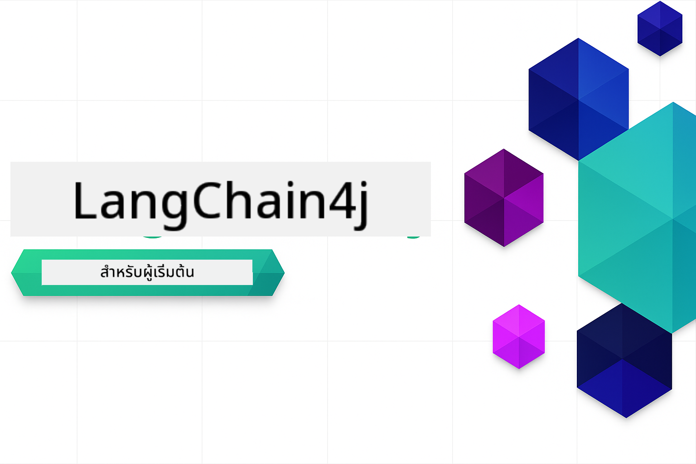

<!--
CO_OP_TRANSLATOR_METADATA:
{
  "original_hash": "d61ab6c245562094cc3dddecf08b50d3",
  "translation_date": "2025-12-31T00:59:33+00:00",
  "source_file": "README.md",
  "language_code": "th"
}
-->


### 🌐 การสนับสนุนหลายภาษา

#### สนับสนุนผ่าน GitHub Action (อัตโนมัติ & อัปเดตอยู่เสมอ)

<!-- CO-OP TRANSLATOR LANGUAGES TABLE START -->
[อาหรับ](../ar/README.md) | [เบงกาลี](../bn/README.md) | [บัลแกเรีย](../bg/README.md) | [พม่า (เมียนมา)](../my/README.md) | [จีน (ตัวย่อ)](../zh/README.md) | [จีน (ตัวเต็ม, ฮ่องกง)](../hk/README.md) | [จีน (ตัวเต็ม, มาเก๊า)](../mo/README.md) | [จีน (ตัวเต็ม, ไต้หวัน)](../tw/README.md) | [โครเอเชีย](../hr/README.md) | [เช็ก](../cs/README.md) | [เดนมาร์ก](../da/README.md) | [ดัตช์](../nl/README.md) | [เอสโตเนีย](../et/README.md) | [ฟินแลนด์](../fi/README.md) | [ฝรั่งเศส](../fr/README.md) | [เยอรมัน](../de/README.md) | [กรีก](../el/README.md) | [ฮีบรู](../he/README.md) | [ฮินดี](../hi/README.md) | [ฮังการี](../hu/README.md) | [อินโดนีเซีย](../id/README.md) | [อิตาลี](../it/README.md) | [ญี่ปุ่น](../ja/README.md) | [กันนาดา](../kn/README.md) | [เกาหลี](../ko/README.md) | [ลิธัวเนีย](../lt/README.md) | [มาเลย์](../ms/README.md) | [มาลายาลัม](../ml/README.md) | [มาราธี](../mr/README.md) | [เนปาลี](../ne/README.md) | [พิดจินไนจีเรีย](../pcm/README.md) | [นอร์เวย์](../no/README.md) | [เปอร์เซีย (ฟาร์ซี)](../fa/README.md) | [โปแลนด์](../pl/README.md) | [โปรตุเกส (บราซิล)](../br/README.md) | [โปรตุเกส (โปรตุเกส)](../pt/README.md) | [ปัญจาบี (กุรมุขี)](../pa/README.md) | [โรมาเนีย](../ro/README.md) | [รัสเซีย](../ru/README.md) | [เซอร์เบีย (ซีริลลิก)](../sr/README.md) | [สโลวัก](../sk/README.md) | [สโลวีเนีย](../sl/README.md) | [สเปน](../es/README.md) | [สวาฮิลี](../sw/README.md) | [สวีเดน](../sv/README.md) | [ทากาล็อก (ฟิลิปปินส์)](../tl/README.md) | [ทมิฬ](../ta/README.md) | [เทลูกู](../te/README.md) | [ไทย](./README.md) | [ตุรกี](../tr/README.md) | [ยูเครน](../uk/README.md) | [อูรดู](../ur/README.md) | [เวียดนาม](../vi/README.md)
<!-- CO-OP TRANSLATOR LANGUAGES TABLE END -->

# LangChain4j สำหรับผู้เริ่มต้น

คอร์สเรียนสำหรับการสร้างแอปพลิเคชัน AI ด้วย LangChain4j และ Azure OpenAI GPT-5 ตั้งแต่การแชทพื้นฐานไปจนถึงเอเจนต์ AI

**ใหม่กับ LangChain4j?** ดูที่ [คำศัพท์](docs/GLOSSARY.md) สำหรับคำนิยามของคำศัพท์และแนวคิดหลัก

## Table of Contents

1. [เริ่มต้นอย่างรวดเร็ว](00-quick-start/README.md) - เริ่มต้นกับ LangChain4j
2. [บทนำ](01-introduction/README.md) - เรียนรู้พื้นฐานของ LangChain4j
3. [การออกแบบพรอมต์](02-prompt-engineering/README.md) - เชี่ยวชาญการออกแบบพรอมต์ที่มีประสิทธิภาพ
4. [RAG (Retrieval-Augmented Generation)](03-rag/README.md) - สร้างระบบความรู้ที่ชาญฉลาด
5. [เครื่องมือ](04-tools/README.md) - รวมเครื่องมือภายนอกและผู้ช่วยแบบง่าย
6. [MCP (Model Context Protocol)](05-mcp/README.md) - ทำงานกับ Model Context Protocol (MCP) และโมดูลเอเจนต์
---

##  Learning Path

> **เริ่มต้นอย่างรวดเร็ว**

1. Fork this repository to your GitHub account
2. คลิก **Code** → แท็บ **Codespaces** → **...** → **New with options...**
3. ใช้ค่าตั้งต้น – ซึ่งจะเลือกคอนเทนเนอร์สำหรับการพัฒนา (Development container) ที่สร้างขึ้นสำหรับคอร์สนี้
4. คลิก **Create codespace**
5. รอ 5-10 นาทีจนสภาพแวดล้อมพร้อม
6. ข้ามไปยัง [เริ่มต้นอย่างรวดเร็ว](./00-quick-start/README.md) เพื่อเริ่มได้เลย!

> **ต้องการโคลนลงเครื่องของคุณหรือไม่?**
>
> ที่เก็บนี้มีการแปลมากกว่า 50 ภาษา ซึ่งจะเพิ่มขนาดการดาวน์โหลดอย่างมีนัยสำคัญ หากต้องการโคลนโดยไม่รวมการแปล ให้ใช้ sparse checkout:
> ```bash
> git clone --filter=blob:none --sparse https://github.com/microsoft/LangChain4j-for-Beginners.git
> cd LangChain4j-for-Beginners
> git sparse-checkout set --no-cone '/*' '!translations' '!translated_images'
> ```
> สิ่งนี้จะให้ทุกสิ่งที่คุณต้องการเพื่อทำคอร์สให้เสร็จด้วยการดาวน์โหลดที่รวดเร็วขึ้นมาก

หลังจากทำโมดูลเสร็จแล้ว ให้สำรวจ [คู่มือการทดสอบ](docs/TESTING.md) เพื่อดูแนวคิดการทดสอบของ LangChain4j ในการปฏิบัติ

> **หมายเหตุ:** การฝึกอบรมนี้ใช้ทั้ง GitHub Models และ Azure OpenAI. โมดูล [เริ่มต้นอย่างรวดเร็ว](00-quick-start/README.md) และ [MCP](05-mcp/README.md) ใช้ GitHub Models (ไม่ต้องมีการสมัครสมาชิก Azure) ในขณะที่โมดูล 1-4 ใช้ Azure OpenAI GPT-5


## การเรียนรู้ด้วย GitHub Copilot

เพื่อเริ่มเขียนโค้ดได้อย่างรวดเร็ว ให้เปิดโปรเจกต์นี้ใน GitHub Codespace หรือ IDE ในเครื่องของคุณด้วย devcontainer ที่ให้มา Devcontainer ที่ใช้ในคอร์สนี้ถูกตั้งค่าล่วงหน้าด้วย GitHub Copilot สำหรับการเขียนโปรแกรมแบบจับคู่กับ AI

ตัวอย่างโค้ดแต่ละตัวมีคำถามแนะนำที่คุณสามารถถาม GitHub Copilot เพื่อเพิ่มความเข้าใจ มองหาสัญลักษณ์ 💡/🤖 ใน:

- **หัวไฟล์ Java** - คำถามที่เฉพาะสำหรับแต่ละตัวอย่าง
- **Module READMEs** - คำถามเพื่อสำรวจหลังตัวอย่างโค้ด

**วิธีการใช้:** เปิดไฟล์โค้ดใดก็ได้แล้วถาม Copilot ด้วยคำถามที่แนะนำ มันมีบริบทเต็มของฐานโค้ดและสามารถอธิบาย ขยาย และแนะนำทางเลือกได้

ต้องการเรียนรู้เพิ่มเติมไหม? ดูที่ [Copilot for AI Paired Programming](https://aka.ms/GitHubCopilotAI).


## แหล่งข้อมูลเพิ่มเติม

<!-- CO-OP TRANSLATOR OTHER COURSES START -->
### LangChain
[](https://aka.ms/langchain4j-for-beginners)
[](https://aka.ms/langchainjs-for-beginners?WT.mc_id=m365-94501-dwahlin)

---

### Azure / Edge / MCP / Agents
[](https://github.com/microsoft/AZD-for-beginners?WT.mc_id=academic-105485-koreyst)
[](https://github.com/microsoft/edgeai-for-beginners?WT.mc_id=academic-105485-koreyst)
[](https://github.com/microsoft/mcp-for-beginners?WT.mc_id=academic-105485-koreyst)
[](https://github.com/microsoft/ai-agents-for-beginners?WT.mc_id=academic-105485-koreyst)

---
 
### Generative AI Series
[](https://github.com/microsoft/generative-ai-for-beginners?WT.mc_id=academic-105485-koreyst)
[-9333EA?style=for-the-badge&labelColor=E5E7EB&color=9333EA)](https://github.com/microsoft/Generative-AI-for-beginners-dotnet?WT.mc_id=academic-105485-koreyst)
[-C084FC?style=for-the-badge&labelColor=E5E7EB&color=C084FC)](https://github.com/microsoft/generative-ai-for-beginners-java?WT.mc_id=academic-105485-koreyst)
[-E879F9?style=for-the-badge&labelColor=E5E7EB&color=E879F9)](https://github.com/microsoft/generative-ai-with-javascript?WT.mc_id=academic-105485-koreyst)

---
 
### Core Learning
[](https://aka.ms/ml-beginners?WT.mc_id=academic-105485-koreyst)
[](https://aka.ms/datascience-beginners?WT.mc_id=academic-105485-koreyst)
[](https://aka.ms/ai-beginners?WT.mc_id=academic-105485-koreyst)
[](https://github.com/microsoft/Security-101?WT.mc_id=academic-96948-sayoung)
[](https://aka.ms/webdev-beginners?WT.mc_id=academic-105485-koreyst)
[](https://aka.ms/iot-beginners?WT.mc_id=academic-105485-koreyst)
[](https://github.com/microsoft/xr-development-for-beginners?WT.mc_id=academic-105485-koreyst)

---
 
### Copilot Series
[](https://aka.ms/GitHubCopilotAI?WT.mc_id=academic-105485-koreyst)
[](https://github.com/microsoft/mastering-github-copilot-for-dotnet-csharp-developers?WT.mc_id=academic-105485-koreyst)
[](https://github.com/microsoft/CopilotAdventures?WT.mc_id=academic-105485-koreyst)
<!-- CO-OP TRANSLATOR OTHER COURSES END -->

## ขอความช่วยเหลือ

หากคุณติดขัดหรือมีคำถามเกี่ยวกับการสร้างแอป AI เข้าร่วมได้ที่:

[](https://aka.ms/foundry/discord)

หากคุณมีความคิดเห็นเกี่ยวกับผลิตภัณฑ์หรือพบข้อผิดพลาดขณะพัฒนา เยี่ยมชม:

[](https://aka.ms/foundry/forum)

## ใบอนุญาต

ใบอนุญาต MIT - ดูไฟล์ [LICENSE](../../LICENSE) สำหรับรายละเอียด.

---

<!-- CO-OP TRANSLATOR DISCLAIMER START -->
ข้อจำกัดความรับผิดชอบ:
เอกสารฉบับนี้ได้รับการแปลโดยใช้บริการแปลด้วย AI [Co-op Translator](https://github.com/Azure/co-op-translator) แม้ว่าเราจะมุ่งมั่นเพื่อความถูกต้อง โปรดทราบว่าการแปลอัตโนมัติอาจมีข้อผิดพลาดหรือความคลาดเคลื่อน เอกสารต้นฉบับในภาษาต้นทางควรถือเป็นแหล่งข้อมูลหลัก สำหรับข้อมูลที่สำคัญ แนะนำให้ใช้การแปลโดยนักแปลมืออาชีพ เราไม่รับผิดชอบต่อความเข้าใจผิดหรือการตีความที่ผิดพลาดใดๆ ที่เกิดจากการใช้การแปลฉบับนี้
<!-- CO-OP TRANSLATOR DISCLAIMER END -->