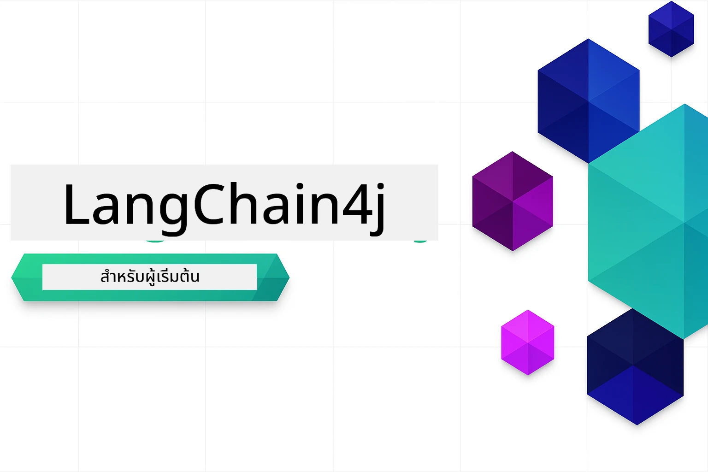

# LangChain4j สำหรับผู้เริ่มต้น

คอร์สสำหรับการสร้างแอปพลิเคชัน AI ด้วย LangChain4j และ Azure OpenAI GPT-5.2 ตั้งแต่แชทพื้นฐานจนถึงเอเจนต์ AI

### 🌐 รองรับหลายภาษา

#### รองรับผ่าน GitHub Action (อัตโนมัติ & อัปเดตเสมอ)

<!-- CO-OP TRANSLATOR LANGUAGES TABLE START -->
[Arabic](../ar/README.md) | [Bengali](../bn/README.md) | [Bulgarian](../bg/README.md) | [Burmese (Myanmar)](../my/README.md) | [Chinese (Simplified)](../zh-CN/README.md) | [Chinese (Traditional, Hong Kong)](../zh-HK/README.md) | [Chinese (Traditional, Macau)](../zh-MO/README.md) | [Chinese (Traditional, Taiwan)](../zh-TW/README.md) | [Croatian](../hr/README.md) | [Czech](../cs/README.md) | [Danish](../da/README.md) | [Dutch](../nl/README.md) | [Estonian](../et/README.md) | [Finnish](../fi/README.md) | [French](../fr/README.md) | [German](../de/README.md) | [Greek](../el/README.md) | [Hebrew](../he/README.md) | [Hindi](../hi/README.md) | [Hungarian](../hu/README.md) | [Indonesian](../id/README.md) | [Italian](../it/README.md) | [Japanese](../ja/README.md) | [Kannada](../kn/README.md) | [Khmer](../km/README.md) | [Korean](../ko/README.md) | [Lithuanian](../lt/README.md) | [Malay](../ms/README.md) | [Malayalam](../ml/README.md) | [Marathi](../mr/README.md) | [Nepali](../ne/README.md) | [Nigerian Pidgin](../pcm/README.md) | [Norwegian](../no/README.md) | [Persian (Farsi)](../fa/README.md) | [Polish](../pl/README.md) | [Portuguese (Brazil)](../pt-BR/README.md) | [Portuguese (Portugal)](../pt-PT/README.md) | [Punjabi (Gurmukhi)](../pa/README.md) | [Romanian](../ro/README.md) | [Russian](../ru/README.md) | [Serbian (Cyrillic)](../sr/README.md) | [Slovak](../sk/README.md) | [Slovenian](../sl/README.md) | [Spanish](../es/README.md) | [Swahili](../sw/README.md) | [Swedish](../sv/README.md) | [Tagalog (Filipino)](../tl/README.md) | [Tamil](../ta/README.md) | [Telugu](../te/README.md) | [Thai](./README.md) | [Turkish](../tr/README.md) | [Ukrainian](../uk/README.md) | [Urdu](../ur/README.md) | [Vietnamese](../vi/README.md)

> **ต้องการโคลนแบบท้องถิ่น?**
>
> ที่เก็บนี้มีการแปลมากกว่า 50 ภาษา ซึ่งจะเพิ่มขนาดดาวน์โหลดอย่างมีนัยสำคัญ ในการโคลนโดยไม่รวมการแปล ให้ใช้ sparse checkout:
>
> **Bash / macOS / Linux:**
> ```bash
> git clone --filter=blob:none --sparse https://github.com/microsoft/LangChain4j-for-Beginners.git
> cd LangChain4j-for-Beginners
> git sparse-checkout set --no-cone '/*' '!translations' '!translated_images'
> ```
>
> **CMD (Windows):**
> ```cmd
> git clone --filter=blob:none --sparse https://github.com/microsoft/LangChain4j-for-Beginners.git
> cd LangChain4j-for-Beginners
> git sparse-checkout set --no-cone "/*" "!translations" "!translated_images"
> ```
>
> วิธีนี้จะให้ทุกอย่างที่คุณต้องการเพื่อทำคอร์สนี้ให้เสร็จด้วยความเร็วดาวน์โหลดที่เร็วขึ้นมาก
<!-- CO-OP TRANSLATOR LANGUAGES TABLE END -->

## สารบัญ

1. [บทนำ](01-introduction/README.md) - เรียนรู้พื้นฐานของ LangChain4j  
2. [การออกแบบพรอมต์](02-prompt-engineering/README.md) - เก่งในการออกแบบพรอมต์ที่มีประสิทธิภาพ  
3. [RAG (Retrieval-Augmented Generation)](03-rag/README.md) - สร้างระบบความรู้ที่ชาญฉลาด  
4. [เครื่องมือ](04-tools/README.md) - รวมเครื่องมือภายนอกและผู้ช่วยง่ายๆ  
5. [MCP (Model Context Protocol)](05-mcp/README.md) - ทำงานกับ Model Context Protocol (MCP) และโมดูล Agentic  

### วิดีโอสาธิต

แต่ละโมดูลมีเซสชันถ่ายทอดสดประกอบที่เราจะพาท่านผ่านแนวคิดและโค้ดทีละขั้นตอน

| โมดูล | วิดีโอ |
|--------|-------|
| 01 - บทนำ | [เริ่มต้นกับ LangChain4j](https://www.youtube.com/live/nl_troDm8rQ) |
| 02 - การออกแบบพรอมต์ | [การออกแบบพรอมต์กับ LangChain4j](https://www.youtube.com/live/PJ6aBaE6bog) |
| 03 - RAG | [RAG กับ LangChain4j](https://www.youtube.com/watch?v=_olq75ZH_eY) |
| 04 - เครื่องมือ & 05 - MCP | [เอเจนต์ AI กับเครื่องมือและ MCP](https://www.youtube.com/watch?v=O_J30kZc0rw) |

---

## เส้นทางการเรียนรู้

**ใหม่กับ LangChain4j?** ดู [พจนานุกรมศัพท์](docs/GLOSSARY.md) สำหรับคำจำกัดความของคำสำคัญและแนวคิด

> **เริ่มต้นอย่างรวดเร็ว**

1. Fork ที่เก็บนี้ไปยังบัญชี GitHub ของคุณ  
2. คลิก **Code** → แท็บ **Codespaces** → **...** → **New with options...**  
3. ใช้ค่าเริ่มต้น – จะเลือก Development container ที่สร้างสำหรับคอร์สนี้  
4. คลิก **Create codespace**  
5. รอ 5-10 นาทีจนสภาพแวดล้อมพร้อมใช้งาน  
6. เข้าสู่ [บทนำ](./01-introduction/README.md) เพื่อเริ่มต้นได้เลย!

หลังจากทำโมดูลเสร็จ Explore [คู่มือการทดสอบ](docs/TESTING.md) เพื่อดูแนวคิดการทดสอบ LangChain4j ในการปฏิบัติ

> **หมายเหตุ:** การฝึกอบรมนี้ใช้ Azure OpenAI เริ่มต้นด้วย [บัญชี Azure ฟรี](https://aka.ms/azure-free-account) หากคุณยังไม่มี

## การเรียนรู้กับ GitHub Copilot

เพื่อเริ่มต้นเขียนโค้ดอย่างรวดเร็ว เปิดโปรเจกต์นี้ใน GitHub Codespace หรือ IDE แบบท้องถิ่นของคุณโดยใช้ devcontainer ที่ให้มา Devcontainer ที่ใช้ในคอร์สนี้มีการตั้งค่าล่วงหน้ารวม GitHub Copilot สำหรับการเขียนโปรแกรมร่วมกับ AI

ตัวอย่างโค้ดแต่ละตัวมีคำถามแนะนำที่คุณสามารถถาม GitHub Copilot เพื่อเพิ่มความเข้าใจ ค้นหาคำแนะนำ 💡/🤖 ใน:

- **ส่วนหัวไฟล์ Java** – คำถามเฉพาะสำหรับแต่ละตัวอย่าง  
- **README โมดูล** – คำถามสำรวจหลังจากตัวอย่างโค้ด  

**วิธีใช้:** เปิดไฟล์โค้ดใดก็ได้และถามคำถามที่แนะนำกับ Copilot มันมีบริบทเต็มของโค้ดและสามารถอธิบาย ขยาย และแนะนำทางเลือกได้  

ต้องการเรียนรู้เพิ่มเติม? ดูที่ [Copilot สำหรับการเขียนโปรแกรมร่วมกับ AI](https://aka.ms/GitHubCopilotAI)

## แหล่งข้อมูลเพิ่มเติม

<!-- CO-OP TRANSLATOR OTHER COURSES START -->
### LangChain
[](https://aka.ms/langchain4j-for-beginners)
[](https://aka.ms/langchainjs-for-beginners?WT.mc_id=m365-94501-dwahlin)
[](https://github.com/microsoft/langchain-for-beginners?WT.mc_id=m365-94501-dwahlin)
---

### Azure / Edge / MCP / Agents
[](https://github.com/microsoft/AZD-for-beginners?WT.mc_id=academic-105485-koreyst)
[](https://github.com/microsoft/edgeai-for-beginners?WT.mc_id=academic-105485-koreyst)
[](https://github.com/microsoft/mcp-for-beginners?WT.mc_id=academic-105485-koreyst)
[](https://github.com/microsoft/ai-agents-for-beginners?WT.mc_id=academic-105485-koreyst)

---
 
### Generative AI Series
[](https://github.com/microsoft/generative-ai-for-beginners?WT.mc_id=academic-105485-koreyst)
[-9333EA?style=for-the-badge&labelColor=E5E7EB&color=9333EA)](https://github.com/microsoft/Generative-AI-for-beginners-dotnet?WT.mc_id=academic-105485-koreyst)
[-C084FC?style=for-the-badge&labelColor=E5E7EB&color=C084FC)](https://github.com/microsoft/generative-ai-for-beginners-java?WT.mc_id=academic-105485-koreyst)
[-E879F9?style=for-the-badge&labelColor=E5E7EB&color=E879F9)](https://github.com/microsoft/generative-ai-with-javascript?WT.mc_id=academic-105485-koreyst)

---
 
### Core Learning
[](https://aka.ms/ml-beginners?WT.mc_id=academic-105485-koreyst)
[](https://aka.ms/datascience-beginners?WT.mc_id=academic-105485-koreyst)
[](https://aka.ms/ai-beginners?WT.mc_id=academic-105485-koreyst)
[](https://github.com/microsoft/Security-101?WT.mc_id=academic-96948-sayoung)

[](https://aka.ms/webdev-beginners?WT.mc_id=academic-105485-koreyst)
[](https://aka.ms/iot-beginners?WT.mc_id=academic-105485-koreyst)
[](https://github.com/microsoft/xr-development-for-beginners?WT.mc_id=academic-105485-koreyst)

---
 
### ชุดเรื่อง Copilot
[](https://aka.ms/GitHubCopilotAI?WT.mc_id=academic-105485-koreyst)
[](https://github.com/microsoft/mastering-github-copilot-for-dotnet-csharp-developers?WT.mc_id=academic-105485-koreyst)
[](https://github.com/microsoft/CopilotAdventures?WT.mc_id=academic-105485-koreyst)
<!-- CO-OP TRANSLATOR OTHER COURSES END -->

## การขอความช่วยเหลือ

หากคุณติดขัดหรือมีคำถามเกี่ยวกับการสร้างแอป AI เข้าร่วมได้ที่:

[](https://aka.ms/foundry/discord)

หากคุณมีข้อเสนอแนะเกี่ยวกับผลิตภัณฑ์หรือพบข้อผิดพลาดในระหว่างการพัฒนา โปรดไปที่:

[](https://aka.ms/foundry/forum)

## ใบอนุญาต

ใบอนุญาต MIT - ดูรายละเอียดได้ในไฟล์ [LICENSE](../../LICENSE)

---

<!-- CO-OP TRANSLATOR DISCLAIMER START -->
**ปฏิเสธความรับผิดชอบ**:
เอกสารนี้ได้รับการแปลโดยใช้บริการแปลภาษา AI [Co-op Translator](https://github.com/Azure/co-op-translator) ขณะที่เราพยายามให้ความถูกต้อง โปรดทราบว่าการแปลโดยอัตโนมัติอาจมีข้อผิดพลาดหรือความไม่ถูกต้อง เอกสารต้นฉบับในภาษาต้นทางควรถูกพิจารณาเป็นแหล่งข้อมูลที่เชื่อถือได้ สำหรับข้อมูลที่สำคัญ แนะนำให้ใช้การแปลโดยมนุษย์มืออาชีพ เราไม่รับผิดชอบต่อความเข้าใจผิดหรือการตีความที่ผิดพลาดที่เกิดขึ้นจากการใช้การแปลนี้
<!-- CO-OP TRANSLATOR DISCLAIMER END -->