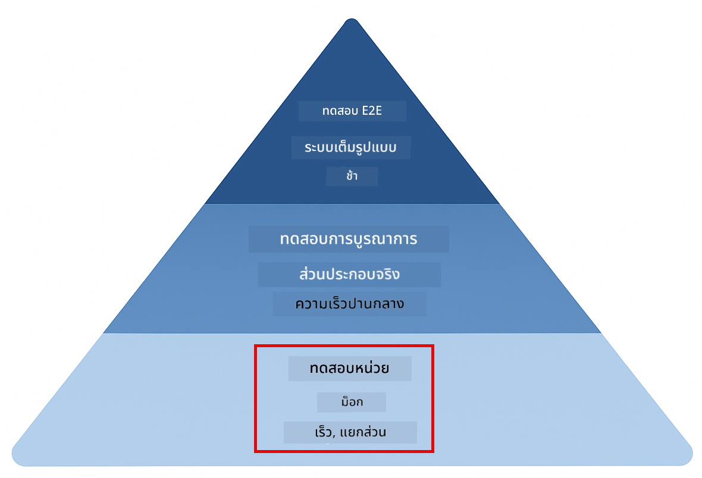
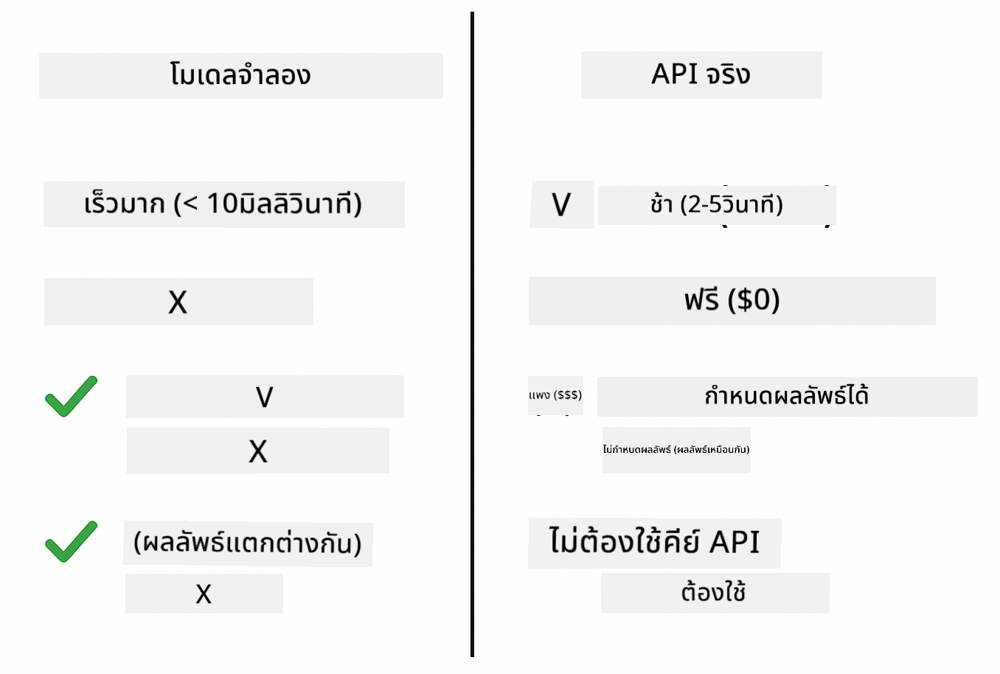
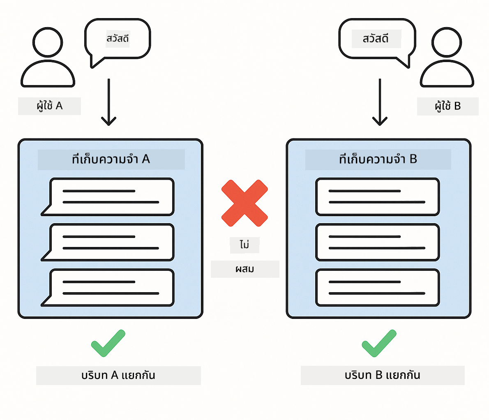
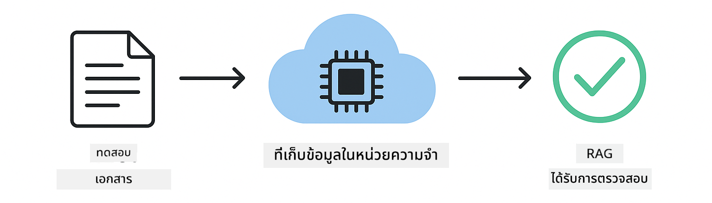

<!--
CO_OP_TRANSLATOR_METADATA:
{
  "original_hash": "ed93b3c14d58734ac10162967da958c1",
  "translation_date": "2025-12-31T01:09:27+00:00",
  "source_file": "docs/TESTING.md",
  "language_code": "th"
}
-->
# การทดสอบแอปพลิเคชัน LangChain4j

## สารบัญ

- [เริ่มต้นด่วน](../../../docs)
- [การทดสอบครอบคลุมอะไรบ้าง](../../../docs)
- [การรันการทดสอบ](../../../docs)
- [การรันการทดสอบใน VS Code](../../../docs)
- [รูปแบบการทดสอบ](../../../docs)
- [ปรัชญาการทดสอบ](../../../docs)
- [ขั้นตอนถัดไป](../../../docs)

คู่มือนี้จะแนะนำคุณผ่านการทดสอบที่สาธิตวิธีการทดสอบแอปพลิเคชัน AI โดยไม่ต้องใช้คีย์ API หรือบริการภายนอก

## Quick Start

รันการทดสอบทั้งหมดด้วยคำสั่งเดียว:

**Bash:**
```bash
mvn test
```

**PowerShell:**
```powershell
mvn --% test
```


*การรันการทดสอบสำเร็จแสดงให้เห็นว่าการทดสอบทั้งหมดผ่านโดยไม่มีข้อผิดพลาด*

## การทดสอบครอบคลุมอะไรบ้าง

หลักสูตรนี้มุ่งเน้นที่การทดสอบแบบ **unit tests** ที่รันในเครื่อง แต่ละการทดสอบจะแสดงแนวคิดเฉพาะของ LangChain4j อย่างเป็นเอกเทศ



*ปิรามิดการทดสอบแสดงความสมดุลระหว่าง unit tests (รวดเร็ว แยกตัว), integration tests (ส่วนประกอบจริง), และ end-to-end tests การฝึกอบรมนี้ครอบคลุมการทดสอบแบบ unit*

| Module | Tests | Focus | Key Files |
|--------|-------|-------|-----------|
| **00 - เริ่มต้นด่วน** | 6 | Prompt templates and variable substitution | `SimpleQuickStartTest.java` |
| **01 - บทนำ** | 8 | Conversation memory and stateful chat | `SimpleConversationTest.java` |
| **02 - วิศวกรรมพรอมต์** | 12 | GPT-5 patterns, eagerness levels, structured output | `SimpleGpt5PromptTest.java` |
| **03 - RAG** | 10 | Document ingestion, embeddings, similarity search | `DocumentServiceTest.java` |
| **04 - เครื่องมือ** | 12 | Function calling and tool chaining | `SimpleToolsTest.java` |
| **05 - MCP** | 8 | Model Context Protocol with Stdio transport | `SimpleMcpTest.java` |

## การรันการทดสอบ

**รันการทดสอบทั้งหมดจากรูท:**

**Bash:**
```bash
mvn test
```

**PowerShell:**
```powershell
mvn --% test
```

**รันการทดสอบสำหรับโมดูลเฉพาะ:**

**Bash:**
```bash
cd 01-introduction && mvn test
# หรือจากรูท
mvn test -pl 01-introduction
```

**PowerShell:**
```powershell
cd 01-introduction; mvn --% test
# หรือจากรูท
mvn --% test -pl 01-introduction
```

**รันคลาสการทดสอบเดียว:**

**Bash:**
```bash
mvn test -Dtest=SimpleConversationTest
```

**PowerShell:**
```powershell
mvn --% test -Dtest=SimpleConversationTest
```

**รันเมทอดการทดสอบเฉพาะ:**

**Bash:**
```bash
mvn test -Dtest=SimpleConversationTest#ควรรักษาประวัติการสนทนา
```

**PowerShell:**
```powershell
mvn --% test -Dtest=SimpleConversationTest#ควรรักษาประวัติการสนทนา
```

## การรันการทดสอบใน VS Code

หากคุณใช้ Visual Studio Code, Test Explorer จะให้ส่วนติดต่อแบบกราฟิกสำหรับการรันและดีบักการทดสอบ


*VS Code Test Explorer แสดงโครงต้นไม้ของการทดสอบพร้อมคลาสการทดสอบ Java ทั้งหมดและเมทอดการทดสอบแต่ละรายการ*

**ในการรันการทดสอบใน VS Code:**

1. เปิด Test Explorer โดยคลิกไอคอนหลอดทดลองใน Activity Bar
2. ขยายโครงต้นไม้ของการทดสอบเพื่อดูโมดูลและคลาสการทดสอบทั้งหมด
3. คลิกปุ่มเล่นข้างการทดสอบใดก็ได้เพื่อรันเป็นการทดสอบเดี่ยว
4. คลิก "Run All Tests" เพื่อรันชุดการทดสอบทั้งหมด
5. คลิกขวาที่การทดสอบและเลือก "Debug Test" เพื่อวางเบรกพอยท์และก้าวผ่านโค้ด

Test Explorer แสดงเครื่องหมายถูกสีเขียวสำหรับการทดสอบที่ผ่านและให้ข้อความความล้มเหลวที่ละเอียดเมื่อการทดสอบล้มเหลว

## รูปแบบการทดสอบ

### รูปแบบที่ 1: การทดสอบเทมเพลตพรอมต์

รูปแบบที่ง่ายที่สุดคือการทดสอบเทมเพลตพรอมต์โดยไม่เรียกโมเดล AI ใด ๆ คุณตรวจสอบว่าการแทนที่ตัวแปรทำงานถูกต้องและพรอมต์ถูกจัดรูปแบบตามที่คาดไว้


*การทดสอบเทมเพลตพรอมต์แสดงการไหลของการแทนที่ตัวแปร: เทมเพลตที่มีช่องว่าง → ใส่ค่าลงไป → ตรวจสอบเอาต์พุตที่จัดรูปแบบแล้ว*

```java
@Test
@DisplayName("Should format prompt template with variables")
void testPromptTemplateFormatting() {
    PromptTemplate template = PromptTemplate.from(
        "Best time to visit {{destination}} for {{activity}}?"
    );
    
    Prompt prompt = template.apply(Map.of(
        "destination", "Paris",
        "activity", "sightseeing"
    ));
    
    assertThat(prompt.text()).isEqualTo("Best time to visit Paris for sightseeing?");
}
```

การทดสอบนี้อยู่ที่ `00-quick-start/src/test/java/com/example/langchain4j/quickstart/SimpleQuickStartTest.java`.

**รันมัน:**

**Bash:**
```bash
cd 00-quick-start && mvn test -Dtest=SimpleQuickStartTest#ทดสอบการจัดรูปแบบเทมเพลตพรอมต์
```

**PowerShell:**
```powershell
cd 00-quick-start; mvn --% test -Dtest=SimpleQuickStartTest#ทดสอบการจัดรูปแบบเทมเพลตพรอมต์
```

### รูปแบบที่ 2: การม็อกโมเดลภาษา

เมื่อทดสอบตรรกะการสนทนา ให้ใช้ Mockito เพื่อสร้างโมเดลปลอมที่คืนคำตอบที่กำหนดไว้ล่วงหน้า วิธีนี้ทำให้การทดสอบรวดเร็ว ฟรี และมีผลลัพธ์แน่นอน



*การเปรียบเทียบแสดงเหตุผลที่ม็อกเป็นที่ต้องการสำหรับการทดสอบ: มันรวดเร็ว ฟรี แน่นอน และไม่ต้องใช้คีย์ API*

```java
@ExtendWith(MockitoExtension.class)
class SimpleConversationTest {
    
    private ConversationService conversationService;
    
    @Mock
    private OpenAiOfficialChatModel mockChatModel;
    
    @BeforeEach
    void setUp() {
        ChatResponse mockResponse = ChatResponse.builder()
            .aiMessage(AiMessage.from("This is a test response"))
            .build();
        when(mockChatModel.chat(anyList())).thenReturn(mockResponse);
        
        conversationService = new ConversationService(mockChatModel);
    }
    
    @Test
    void shouldMaintainConversationHistory() {
        String conversationId = conversationService.startConversation();
        
        ChatResponse mockResponse1 = ChatResponse.builder()
            .aiMessage(AiMessage.from("Response 1"))
            .build();
        ChatResponse mockResponse2 = ChatResponse.builder()
            .aiMessage(AiMessage.from("Response 2"))
            .build();
        ChatResponse mockResponse3 = ChatResponse.builder()
            .aiMessage(AiMessage.from("Response 3"))
            .build();
        
        when(mockChatModel.chat(anyList()))
            .thenReturn(mockResponse1)
            .thenReturn(mockResponse2)
            .thenReturn(mockResponse3);

        conversationService.chat(conversationId, "First message");
        conversationService.chat(conversationId, "Second message");
        conversationService.chat(conversationId, "Third message");

        List<ChatMessage> history = conversationService.getHistory(conversationId);
        assertThat(history).hasSize(6); // 3 ข้อความจากผู้ใช้ + 3 ข้อความจาก AI
    }
}
```

รูปแบบนี้ปรากฏใน `01-introduction/src/test/java/com/example/langchain4j/service/SimpleConversationTest.java` ม็อกช่วยให้พฤติกรรมคงที่เพื่อให้คุณตรวจสอบการจัดการหน่วยความจำได้อย่างถูกต้อง

### รูปแบบที่ 3: การทดสอบการแยกการสนทนา

หน่วยความจำการสนทนาต้องรักษาความแยกสำหรับผู้ใช้หลายคน การทดสอบนี้ตรวจสอบว่าไม่มีการผสมบริบทระหว่างการสนทนา



*การทดสอบการแยกการสนทนาแสดงที่เก็บประวัติที่แยกกันสำหรับผู้ใช้ต่าง ๆ เพื่อป้องกันการผสมบริบท*

```java
@Test
void shouldIsolateConversationsByid() {
    String conv1 = conversationService.startConversation();
    String conv2 = conversationService.startConversation();
    
    ChatResponse mockResponse = ChatResponse.builder()
        .aiMessage(AiMessage.from("Response"))
        .build();
    when(mockChatModel.chat(anyList())).thenReturn(mockResponse);

    conversationService.chat(conv1, "Message for conversation 1");
    conversationService.chat(conv2, "Message for conversation 2");

    List<ChatMessage> history1 = conversationService.getHistory(conv1);
    List<ChatMessage> history2 = conversationService.getHistory(conv2);
    
    assertThat(history1).hasSize(2);
    assertThat(history2).hasSize(2);
}
```

แต่ละการสนทนารักษาประวัติที่เป็นอิสระของตน ในระบบการผลิต การแยกนี้มีความสำคัญสำหรับแอปพลิเคชันหลายผู้ใช้

### รูปแบบที่ 4: การทดสอบเครื่องมือแยกกัน

เครื่องมือเป็นฟังก์ชันที่ AI สามารถเรียกได้ ทดสอบเครื่องมือโดยตรงเพื่อให้แน่ใจว่ามันทำงานถูกต้องไม่ว่า AI จะตัดสินใจอย่างไร


*การทดสอบเครื่องมือแยกกันแสดงการรันเครื่องมือแบบม็อกโดยไม่มีการเรียก AI เพื่อยืนยันตรรกะทางธุรกิจ*

```java
@Test
void shouldConvertCelsiusToFahrenheit() {
    TemperatureTool tempTool = new TemperatureTool();
    String result = tempTool.celsiusToFahrenheit(25.0);
    assertThat(result).containsPattern("77[.,]0°F");
}

@Test
void shouldDemonstrateToolChaining() {
    WeatherTool weatherTool = new WeatherTool();
    TemperatureTool tempTool = new TemperatureTool();

    String weatherResult = weatherTool.getCurrentWeather("Seattle");
    assertThat(weatherResult).containsPattern("\\d+°C");

    String conversionResult = tempTool.celsiusToFahrenheit(22.0);
    assertThat(conversionResult).containsPattern("71[.,]6°F");
}
```

การทดสอบเหล่านี้จาก `04-tools/src/test/java/com/example/langchain4j/agents/tools/SimpleToolsTest.java` ยืนยันตรรกะของเครื่องมือโดยไม่ต้องมีการมีส่วนร่วมของ AI ตัวอย่างการเชื่อมโยงแสดงว่าเอาต์พุตของเครื่องมือหนึ่งถูกป้อนเป็นอินพุตของอีกเครื่องมือหนึ่งอย่างไร

### รูปแบบที่ 5: การทดสอบ RAG แบบอยู่ในหน่วยความจำ

ระบบ RAG โดยทั่วไปต้องการฐานข้อมูลเวกเตอร์และบริการ embedding รูปแบบในหน่วยความจำช่วยให้คุณทดสอบทั้งพายป์ไลน์โดยไม่ต้องพึ่งพาภายนอก



*เวิร์กโฟลว์การทดสอบ RAG ในหน่วยความจำแสดงการแยกเอกสาร การจัดเก็บ embedding และการค้นหาความคล้ายคลึงโดยไม่ต้องใช้ฐานข้อมูล*

```java
@Test
void testProcessTextDocument() {
    String content = "This is a test document.\nIt has multiple lines.";
    InputStream inputStream = new ByteArrayInputStream(content.getBytes(StandardCharsets.UTF_8));
    
    DocumentService.ProcessedDocument result = 
        documentService.processDocument(inputStream, "test.txt");

    assertNotNull(result);
    assertTrue(result.segments().size() > 0);
    assertEquals("test.txt", result.segments().get(0).metadata().getString("filename"));
}
```

การทดสอบนี้จาก `03-rag/src/test/java/com/example/langchain4j/rag/service/DocumentServiceTest.java` สร้างเอกสารในหน่วยความจำและตรวจสอบการแบ่งชิ้นและการจัดการเมตาดาต้า

### รูปแบบที่ 6: การทดสอบการรวม MCP

โมดูล MCP ทดสอบการรวม Model Context Protocol โดยใช้การส่งผ่าน stdio การทดสอบเหล่านี้ตรวจสอบว่าแอปของคุณสามารถสปอนช์และสื่อสารกับเซิร์ฟเวอร์ MCP ในฐานะ subprocess ได้

การทดสอบใน `05-mcp/src/test/java/com/example/langchain4j/mcp/SimpleMcpTest.java` ยืนยันพฤติกรรมของไคลเอนต์ MCP

**รันพวกมัน:**

**Bash:**
```bash
cd 05-mcp && mvn test
```

**PowerShell:**
```powershell
cd 05-mcp; mvn --% test
```

## ปรัชญาการทดสอบ

ทดสอบโค้ดของคุณ ไม่ใช่ AI การทดสอบของคุณควรยืนยันโค้ดที่คุณเขียนโดยตรวจสอบว่าพรอมต์ถูกสร้างขึ้นอย่างไร หน่วยความจำถูกจัดการอย่างไร และเครื่องมือทำงานอย่างไร คำตอบของ AI มีความแปรปรวนและไม่ควรเป็นส่วนหนึ่งของการยืนยันการทดสอบ ถามตัวเองว่าพรอมต์เทมเพลตของคุณแทนที่ตัวแปรอย่างถูกต้องหรือไม่ แทนที่จะถามว่า AI ให้คำตอบที่ถูกต้องหรือไม่

ใช้ม็อกสำหรับโมเดลภาษา พวกมันเป็นการพึ่งพาภายนอกที่ช้า แพง และไม่แน่นอน การม็อกทำให้การทดสอบรวดเร็วในระดับมิลลิวินาที แทนที่จะเป็นวินาที ฟรีโดยไม่เสียค่าใช้จ่าย API และให้ผลลัพธ์คงที่เหมือนเดิมทุกครั้ง

รักษาความเป็นอิสระของการทดสอบ แต่ละการทดสอบควรตั้งค่าข้อมูลของตัวเอง ไม่พึ่งพาการทดสอบอื่น และทำความสะอาดหลังตัวเอง การทดสอบควรผ่านไม่ว่าจะรันตามลำดับใดก็ตาม

ทดสอบกรณีขอบเขตนอกเหนือจากเส้นทางที่สมบูรณ์ ลองอินพุตว่าง อินพุตขนาดใหญ่พิเศษ อักขระพิเศษ พารามิเตอร์ไม่ถูกต้อง และเงื่อนไขขอบเขต เหล่านี้มักเผยบั๊กที่การใช้งานปกติไม่เห็น

ใช้ชื่อที่บรรยายความหมาย เปรียบเทียบ `shouldMaintainConversationHistoryAcrossMultipleMessages()` กับ `test1()` ชื่อแรกบอกคุณอย่างชัดเจนว่ากำลังทดสอบอะไร ทำให้การดีบักเมื่อเกิดความล้มเหลวง่ายขึ้นมาก

## ขั้นตอนถัดไป

ตอนนี้ที่คุณเข้าใจรูปแบบการทดสอบแล้ว ให้เจาะลึกในแต่ละโมดูล:

- **[00 - Quick Start](../00-quick-start/README.md)** - เริ่มต้นด้วยพื้นฐานเทมเพลตพรอมต์
- **[01 - Introduction](../01-introduction/README.md)** - เรียนรู้การจัดการหน่วยความจำการสนทนา
- **[02 - Prompt Engineering](../02-prompt-engineering/README.md)** - เชี่ยวชาญรูปแบบการพรอมต์ของ GPT-5
- **[03 - RAG](../03-rag/README.md)** - สร้างระบบ retrieval-augmented generation
- **[04 - Tools](../04-tools/README.md)** - นำฟังก์ชันการเรียกและการเชื่อมเครื่องมือไปใช้
- **[05 - MCP](../05-mcp/README.md)** - รวม Model Context Protocol

README ของแต่ละโมดูลให้คำอธิบายโดยละเอียดของแนวคิดที่ทดสอบที่นี่

---

**Navigation:** [← กลับไปหน้าหลัก](../README.md)

---

<!-- CO-OP TRANSLATOR DISCLAIMER START -->
คำปฏิเสธความรับผิด:
เอกสารฉบับนี้ได้รับการแปลโดยใช้บริการแปลด้วย AI Co-op Translator (https://github.com/Azure/co-op-translator) แม้ว่าเราจะพยายามให้การแปลมีความถูกต้อง โปรดทราบว่าการแปลอัตโนมัติอาจมีข้อผิดพลาดหรือความไม่แม่นยำ เอกสารต้นฉบับในภาษาดั้งเดิมควรถูกพิจารณาเป็นแหล่งข้อมูลหลักที่เชื่อถือได้ สำหรับข้อมูลที่สำคัญ แนะนำให้ใช้การแปลโดยนักแปลมืออาชีพ เราไม่รับผิดชอบต่อความเข้าใจผิดหรือการตีความที่ผิดพลาดที่เกิดจากการใช้การแปลนี้
<!-- CO-OP TRANSLATOR DISCLAIMER END -->