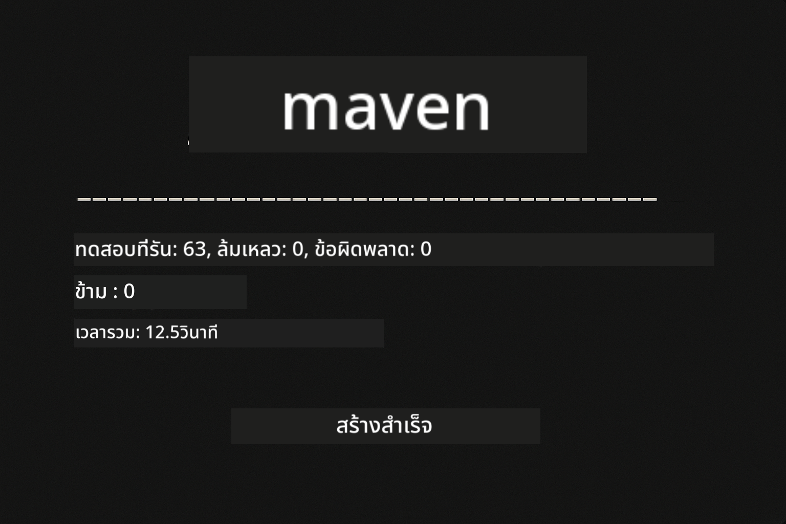
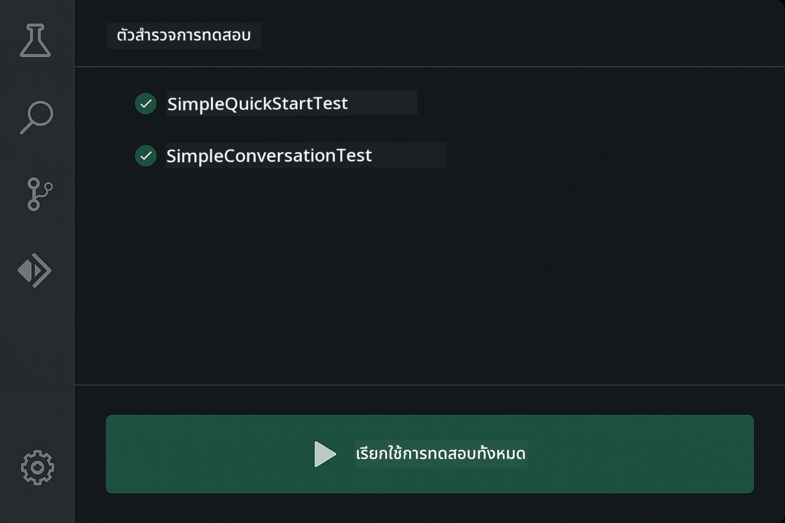
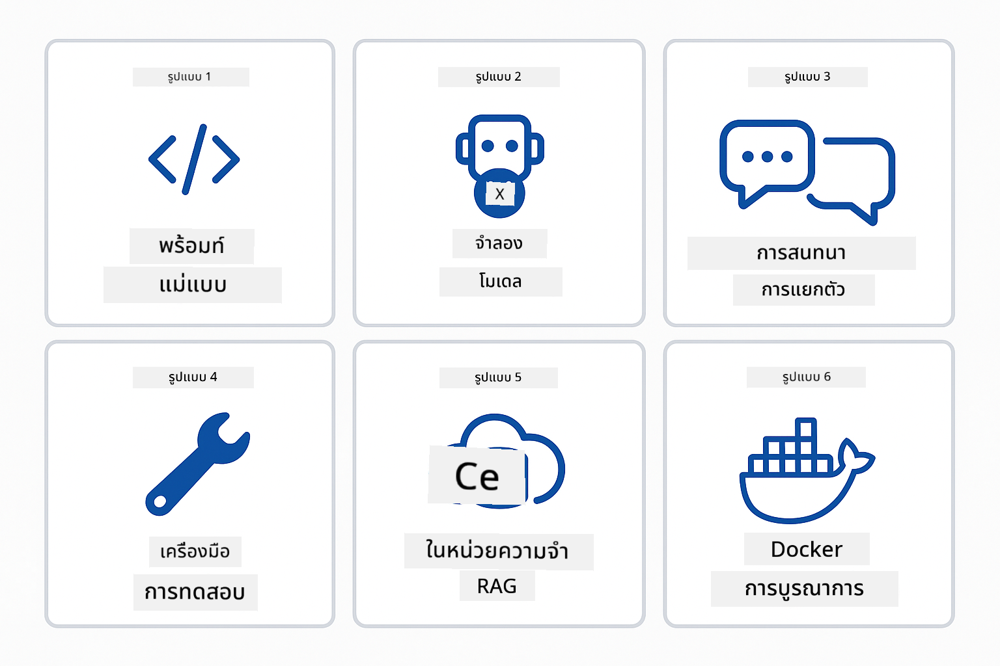
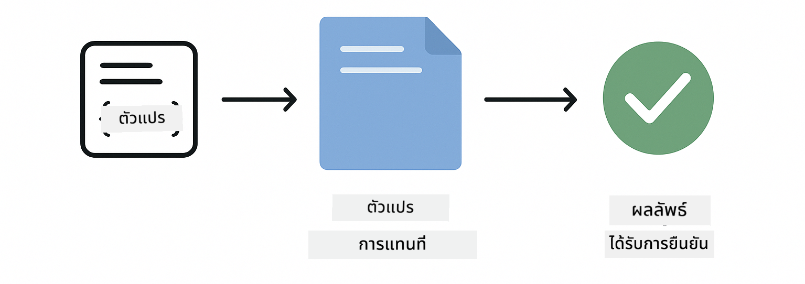

<!--
CO_OP_TRANSLATOR_METADATA:
{
  "original_hash": "b975537560c404d5f254331832811e78",
  "translation_date": "2025-12-13T21:04:23+00:00",
  "source_file": "docs/TESTING.md",
  "language_code": "th"
}
-->
# การทดสอบแอปพลิเคชัน LangChain4j

## สารบัญ

- [เริ่มต้นอย่างรวดเร็ว](../../../docs)
- [สิ่งที่การทดสอบครอบคลุม](../../../docs)
- [การรันการทดสอบ](../../../docs)
- [การรันทดสอบใน VS Code](../../../docs)
- [รูปแบบการทดสอบ](../../../docs)
- [ปรัชญาการทดสอบ](../../../docs)
- [ขั้นตอนถัดไป](../../../docs)

คำแนะนำนี้จะพาคุณผ่านการทดสอบที่แสดงวิธีการทดสอบแอปพลิเคชัน AI โดยไม่ต้องใช้คีย์ API หรือบริการภายนอก

## เริ่มต้นอย่างรวดเร็ว

รันการทดสอบทั้งหมดด้วยคำสั่งเดียว:

**Bash:**
```bash
mvn test
```

**PowerShell:**
```powershell
mvn --% test
```



*ผลการทดสอบที่สำเร็จแสดงให้เห็นว่าการทดสอบทั้งหมดผ่านโดยไม่มีข้อผิดพลาด*

## สิ่งที่การทดสอบครอบคลุม

หลักสูตรนี้เน้นที่ **การทดสอบหน่วย** ที่รันในเครื่องแต่ละเครื่อง การทดสอบแต่ละรายการแสดงแนวคิด LangChain4j เฉพาะในรูปแบบแยกส่วน


*พีระมิดการทดสอบแสดงสมดุลระหว่างการทดสอบหน่วย (รวดเร็ว แยกส่วน), การทดสอบแบบบูรณาการ (ส่วนประกอบจริง), และการทดสอบแบบครบวงจร (ระบบเต็มรูปแบบพร้อม Docker) การฝึกอบรมนี้ครอบคลุมการทดสอบหน่วย*

| โมดูล | การทดสอบ | จุดเน้น | ไฟล์สำคัญ |
|--------|-------|-------|-----------|
| **00 - เริ่มต้นอย่างรวดเร็ว** | 6 | แม่แบบพรอมต์และการแทนที่ตัวแปร | `SimpleQuickStartTest.java` |
| **01 - บทนำ** | 8 | หน่วยความจำการสนทนาและแชทแบบมีสถานะ | `SimpleConversationTest.java` |
| **02 - วิศวกรรมพรอมต์** | 12 | รูปแบบ GPT-5, ระดับความกระตือรือร้น, ผลลัพธ์ที่มีโครงสร้าง | `SimpleGpt5PromptTest.java` |
| **03 - RAG** | 10 | การนำเข้าข้อมูลเอกสาร, การฝังตัว, การค้นหาความคล้ายคลึง | `DocumentServiceTest.java` |
| **04 - เครื่องมือ** | 12 | การเรียกฟังก์ชันและการเชื่อมโยงเครื่องมือ | `SimpleToolsTest.java` |
| **05 - MCP** | 15 | โปรโตคอลบริบทโมเดลกับ Docker | `SimpleMcpTest.java`, `McpDockerTransportTest.java` |

## การรันการทดสอบ

**รันการทดสอบทั้งหมดจากโฟลเดอร์ราก:**

**Bash:**
```bash
mvn test
```

**PowerShell:**
```powershell
mvn --% test
```

**รันการทดสอบสำหรับโมดูลเฉพาะ:**

**Bash:**
```bash
cd 01-introduction && mvn test
# หรือจากรูท
mvn test -pl 01-introduction
```

**PowerShell:**
```powershell
cd 01-introduction; mvn --% test
# หรือจากรูท
mvn --% test -pl 01-introduction
```

**รันคลาสทดสอบเดียว:**

**Bash:**
```bash
mvn test -Dtest=SimpleConversationTest
```

**PowerShell:**
```powershell
mvn --% test -Dtest=SimpleConversationTest
```

**รันเมธอดทดสอบเฉพาะ:**

**Bash:**
```bash
mvn test -Dtest=SimpleConversationTest#ควรรักษาประวัติการสนทนาไว้
```

**PowerShell:**
```powershell
mvn --% test -Dtest=SimpleConversationTest#ควรรักษาประวัติการสนทนาไว้
```

## การรันทดสอบใน VS Code

ถ้าคุณใช้ Visual Studio Code, Test Explorer จะให้ส่วนติดต่อกราฟิกสำหรับรันและดีบักการทดสอบ



*VS Code Test Explorer แสดงโครงสร้างต้นไม้การทดสอบพร้อมคลาสทดสอบ Java ทั้งหมดและเมธอดทดสอบแต่ละรายการ*

**วิธีรันทดสอบใน VS Code:**

1. เปิด Test Explorer โดยคลิกไอคอนบีกเกอร์ในแถบกิจกรรม
2. ขยายต้นไม้การทดสอบเพื่อดูโมดูลและคลาสทดสอบทั้งหมด
3. คลิกปุ่มเล่นข้างๆ การทดสอบใดก็ได้เพื่อรันแยก
4. คลิก "Run All Tests" เพื่อรันชุดทดสอบทั้งหมด
5. คลิกขวาที่การทดสอบใดๆ และเลือก "Debug Test" เพื่อกำหนดเบรกพอยต์และก้าวผ่านโค้ด

Test Explorer แสดงเครื่องหมายถูกสีเขียวสำหรับการทดสอบที่ผ่านและให้ข้อความล้มเหลวอย่างละเอียดเมื่อการทดสอบล้มเหลว

## รูปแบบการทดสอบ



*รูปแบบการทดสอบหกแบบสำหรับแอปพลิเคชัน LangChain4j: แม่แบบพรอมต์, การจำลองโมเดล, การแยกการสนทนา, การทดสอบเครื่องมือ, RAG ในหน่วยความจำ, และการบูรณาการ Docker*

### รูปแบบที่ 1: การทดสอบแม่แบบพรอมต์

รูปแบบที่ง่ายที่สุดคือการทดสอบแม่แบบพรอมต์โดยไม่เรียกใช้โมเดล AI คุณตรวจสอบว่าการแทนที่ตัวแปรทำงานถูกต้องและพรอมต์ถูกจัดรูปแบบตามที่คาดไว้



*การทดสอบแม่แบบพรอมต์แสดงลำดับการแทนที่ตัวแปร: แม่แบบที่มีที่ว่าง → ค่าที่ใช้ → ผลลัพธ์ที่จัดรูปแบบได้รับการตรวจสอบ*

```java
@Test
@DisplayName("Should format prompt template with variables")
void testPromptTemplateFormatting() {
    PromptTemplate template = PromptTemplate.from(
        "Best time to visit {{destination}} for {{activity}}?"
    );
    
    Prompt prompt = template.apply(Map.of(
        "destination", "Paris",
        "activity", "sightseeing"
    ));
    
    assertThat(prompt.text()).isEqualTo("Best time to visit Paris for sightseeing?");
}
```

การทดสอบนี้อยู่ใน `00-quick-start/src/test/java/com/example/langchain4j/quickstart/SimpleQuickStartTest.java`

**รันได้โดย:**

**Bash:**
```bash
cd 00-quick-start && mvn test -Dtest=SimpleQuickStartTest#ทดสอบการจัดรูปแบบเทมเพลตพร้อมท์
```

**PowerShell:**
```powershell
cd 00-quick-start; mvn --% test -Dtest=SimpleQuickStartTest#ทดสอบการจัดรูปแบบเทมเพลตพร้อมท์
```

### รูปแบบที่ 2: การจำลองโมเดลภาษา

เมื่อทดสอบตรรกะการสนทนา ใช้ Mockito เพื่อสร้างโมเดลปลอมที่ส่งคืนคำตอบที่กำหนดไว้ล่วงหน้า วิธีนี้ทำให้การทดสอบรวดเร็ว ฟรี และมีผลลัพธ์แน่นอน


*การเปรียบเทียบแสดงเหตุผลที่การจำลองเป็นที่นิยมสำหรับการทดสอบ: รวดเร็ว ฟรี แน่นอน และไม่ต้องใช้คีย์ API*

```java
@ExtendWith(MockitoExtension.class)
class SimpleConversationTest {
    
    private ConversationService conversationService;
    
    @Mock
    private OpenAiOfficialChatModel mockChatModel;
    
    @BeforeEach
    void setUp() {
        ChatResponse mockResponse = ChatResponse.builder()
            .aiMessage(AiMessage.from("This is a test response"))
            .build();
        when(mockChatModel.chat(anyList())).thenReturn(mockResponse);
        
        conversationService = new ConversationService(mockChatModel);
    }
    
    @Test
    void shouldMaintainConversationHistory() {
        String conversationId = conversationService.startConversation();
        
        ChatResponse mockResponse1 = ChatResponse.builder()
            .aiMessage(AiMessage.from("Response 1"))
            .build();
        ChatResponse mockResponse2 = ChatResponse.builder()
            .aiMessage(AiMessage.from("Response 2"))
            .build();
        ChatResponse mockResponse3 = ChatResponse.builder()
            .aiMessage(AiMessage.from("Response 3"))
            .build();
        
        when(mockChatModel.chat(anyList()))
            .thenReturn(mockResponse1)
            .thenReturn(mockResponse2)
            .thenReturn(mockResponse3);

        conversationService.chat(conversationId, "First message");
        conversationService.chat(conversationId, "Second message");
        conversationService.chat(conversationId, "Third message");

        List<ChatMessage> history = conversationService.getHistory(conversationId);
        assertThat(history).hasSize(6); // 3 ข้อความจากผู้ใช้ + 3 ข้อความจาก AI
    }
}
```

รูปแบบนี้ปรากฏใน `01-introduction/src/test/java/com/example/langchain4j/service/SimpleConversationTest.java` การจำลองช่วยให้พฤติกรรมสม่ำเสมอเพื่อให้คุณตรวจสอบการจัดการหน่วยความจำได้ถูกต้อง

### รูปแบบที่ 3: การทดสอบการแยกการสนทนา

หน่วยความจำการสนทนาต้องแยกผู้ใช้หลายคนออกจากกัน การทดสอบนี้ตรวจสอบว่าการสนทนาไม่ผสมผสานบริบทกัน


*การทดสอบการแยกการสนทนาแสดงที่เก็บหน่วยความจำแยกสำหรับผู้ใช้แต่ละคนเพื่อป้องกันการผสมผสานบริบท*

```java
@Test
void shouldIsolateConversationsByid() {
    String conv1 = conversationService.startConversation();
    String conv2 = conversationService.startConversation();
    
    ChatResponse mockResponse = ChatResponse.builder()
        .aiMessage(AiMessage.from("Response"))
        .build();
    when(mockChatModel.chat(anyList())).thenReturn(mockResponse);

    conversationService.chat(conv1, "Message for conversation 1");
    conversationService.chat(conv2, "Message for conversation 2");

    List<ChatMessage> history1 = conversationService.getHistory(conv1);
    List<ChatMessage> history2 = conversationService.getHistory(conv2);
    
    assertThat(history1).hasSize(2);
    assertThat(history2).hasSize(2);
}
```

แต่ละการสนทนาจะเก็บประวัติของตัวเองอย่างอิสระ ในระบบการผลิต การแยกนี้มีความสำคัญสำหรับแอปพลิเคชันหลายผู้ใช้

### รูปแบบที่ 4: การทดสอบเครื่องมืออย่างอิสระ

เครื่องมือคือฟังก์ชันที่ AI สามารถเรียกใช้ได้ ทดสอบเครื่องมือโดยตรงเพื่อให้แน่ใจว่าทำงานถูกต้องไม่ขึ้นกับการตัดสินใจของ AI


*การทดสอบเครื่องมืออย่างอิสระแสดงการรันเครื่องมือจำลองโดยไม่เรียก AI เพื่อยืนยันตรรกะธุรกิจ*

```java
@Test
void shouldConvertCelsiusToFahrenheit() {
    TemperatureTool tempTool = new TemperatureTool();
    String result = tempTool.celsiusToFahrenheit(25.0);
    assertThat(result).containsPattern("77[.,]0°F");
}

@Test
void shouldDemonstrateToolChaining() {
    WeatherTool weatherTool = new WeatherTool();
    TemperatureTool tempTool = new TemperatureTool();

    String weatherResult = weatherTool.getCurrentWeather("Seattle");
    assertThat(weatherResult).containsPattern("\\d+°C");

    String conversionResult = tempTool.celsiusToFahrenheit(22.0);
    assertThat(conversionResult).containsPattern("71[.,]6°F");
}
```

การทดสอบเหล่านี้จาก `04-tools/src/test/java/com/example/langchain4j/agents/tools/SimpleToolsTest.java` ตรวจสอบตรรกะเครื่องมือโดยไม่เกี่ยวข้องกับ AI ตัวอย่างการเชื่อมโยงแสดงว่าผลลัพธ์ของเครื่องมือหนึ่งถูกป้อนเป็นอินพุตของอีกเครื่องมือหนึ่ง

### รูปแบบที่ 5: การทดสอบ RAG ในหน่วยความจำ

ระบบ RAG โดยทั่วไปต้องใช้ฐานข้อมูลเวกเตอร์และบริการฝังตัว รูปแบบในหน่วยความจำช่วยให้คุณทดสอบทั้งกระบวนการโดยไม่ต้องพึ่งพาภายนอก


*เวิร์กโฟลว์การทดสอบ RAG ในหน่วยความจำแสดงการแยกวิเคราะห์เอกสาร, การเก็บฝังตัว, และการค้นหาความคล้ายคลึงโดยไม่ต้องใช้ฐานข้อมูล*

```java
@Test
void testProcessTextDocument() {
    String content = "This is a test document.\nIt has multiple lines.";
    InputStream inputStream = new ByteArrayInputStream(content.getBytes(StandardCharsets.UTF_8));
    
    DocumentService.ProcessedDocument result = 
        documentService.processDocument(inputStream, "test.txt");

    assertNotNull(result);
    assertTrue(result.segments().size() > 0);
    assertEquals("test.txt", result.segments().get(0).metadata().getString("filename"));
}
```

การทดสอบนี้จาก `03-rag/src/test/java/com/example/langchain4j/rag/service/DocumentServiceTest.java` สร้างเอกสารในหน่วยความจำและตรวจสอบการแบ่งชิ้นและการจัดการเมตาดาต้า

### รูปแบบที่ 6: การทดสอบบูรณาการด้วย Docker

บางฟีเจอร์ต้องใช้โครงสร้างพื้นฐานจริง โมดูล MCP ใช้ Testcontainers เพื่อสร้างคอนเทนเนอร์ Docker สำหรับการทดสอบบูรณาการ การทดสอบเหล่านี้ยืนยันว่าโค้ดของคุณทำงานกับบริการจริงในขณะที่ยังคงแยกการทดสอบ


*การทดสอบบูรณาการ MCP กับ Testcontainers แสดงวงจรชีวิตคอนเทนเนอร์อัตโนมัติ: เริ่มต้น, รันทดสอบ, หยุด, และทำความสะอาด*

การทดสอบใน `05-mcp/src/test/java/com/example/langchain4j/mcp/McpDockerTransportTest.java` ต้องการให้ Docker ทำงานอยู่

**รันได้โดย:**

**Bash:**
```bash
cd 05-mcp && mvn test
```

**PowerShell:**
```powershell
cd 05-mcp; mvn --% test
```

## ปรัชญาการทดสอบ

ทดสอบโค้ดของคุณ ไม่ใช่ AI การทดสอบของคุณควรตรวจสอบโค้ดที่คุณเขียนโดยดูว่าพรอมต์ถูกสร้างอย่างไร หน่วยความจำถูกจัดการอย่างไร และเครื่องมือทำงานอย่างไร คำตอบของ AI มีความแปรผันและไม่ควรเป็นส่วนหนึ่งของการยืนยันผลการทดสอบ ถามตัวเองว่าพรอมต์ของคุณแทนที่ตัวแปรถูกต้องหรือไม่ ไม่ใช่ว่า AI ให้คำตอบที่ถูกต้องหรือไม่

ใช้การจำลองสำหรับโมเดลภาษา เพราะเป็นการพึ่งพาภายนอกที่ช้า แพง และไม่แน่นอน การจำลองทำให้การทดสอบรวดเร็วในระดับมิลลิวินาที แถมฟรีไม่มีค่าใช้จ่าย API และมีผลลัพธ์แน่นอนเหมือนเดิมทุกครั้ง

รักษาการทดสอบให้เป็นอิสระ การทดสอบแต่ละรายการควรตั้งค่าข้อมูลของตัวเอง ไม่พึ่งพาการทดสอบอื่น และทำความสะอาดหลังตัวเอง การทดสอบควรผ่านไม่ว่าจะรันในลำดับใด

ทดสอบกรณีขอบเขตนอกเหนือเส้นทางปกติ ลองอินพุตว่าง อินพุตขนาดใหญ่ ตัวอักษรพิเศษ พารามิเตอร์ไม่ถูกต้อง และเงื่อนไขขอบเขต เหล่านี้มักเปิดเผยบั๊กที่การใช้งานปกติไม่พบ

ใช้ชื่อที่บรรยายความหมาย เปรียบเทียบ `shouldMaintainConversationHistoryAcrossMultipleMessages()` กับ `test1()` ชื่อแรกบอกคุณอย่างชัดเจนว่ากำลังทดสอบอะไร ทำให้การดีบักเมื่อเกิดข้อผิดพลาดง่ายขึ้นมาก

## ขั้นตอนถัดไป

ตอนนี้คุณเข้าใจรูปแบบการทดสอบแล้ว ดำดิ่งลึกลงในแต่ละโมดูล:

- **[00 - เริ่มต้นอย่างรวดเร็ว](../00-quick-start/README.md)** - เริ่มต้นด้วยพื้นฐานแม่แบบพรอมต์
- **[01 - บทนำ](../01-introduction/README.md)** - เรียนรู้การจัดการหน่วยความจำการสนทนา
- **[02 - วิศวกรรมพรอมต์](../02-prompt-engineering/README.md)** - เชี่ยวชาญรูปแบบการพรอมต์ GPT-5
- **[03 - RAG](../03-rag/README.md)** - สร้างระบบการสร้างข้อมูลเสริมการดึงข้อมูล
- **[04 - เครื่องมือ](../04-tools/README.md)** - นำฟังก์ชันการเรียกและการเชื่อมโยงเครื่องมือไปใช้
- **[05 - MCP](../05-mcp/README.md)** - บูรณาการโปรโตคอลบริบทโมเดลกับ Docker

README ของแต่ละโมดูลให้คำอธิบายโดยละเอียดของแนวคิดที่ทดสอบที่นี่

---

**การนำทาง:** [← กลับไปยังหน้าหลัก](../README.md)

---

<!-- CO-OP TRANSLATOR DISCLAIMER START -->
**ข้อจำกัดความรับผิดชอบ**:  
เอกสารนี้ได้รับการแปลโดยใช้บริการแปลภาษาอัตโนมัติ [Co-op Translator](https://github.com/Azure/co-op-translator) แม้เราจะพยายามให้ความถูกต้องสูงสุด แต่โปรดทราบว่าการแปลอัตโนมัติอาจมีข้อผิดพลาดหรือความไม่ถูกต้อง เอกสารต้นฉบับในภาษาต้นทางถือเป็นแหล่งข้อมูลที่เชื่อถือได้ สำหรับข้อมูลที่สำคัญ ขอแนะนำให้ใช้บริการแปลโดยผู้เชี่ยวชาญมนุษย์ เราไม่รับผิดชอบต่อความเข้าใจผิดหรือการตีความผิดใด ๆ ที่เกิดจากการใช้การแปลนี้
<!-- CO-OP TRANSLATOR DISCLAIMER END -->