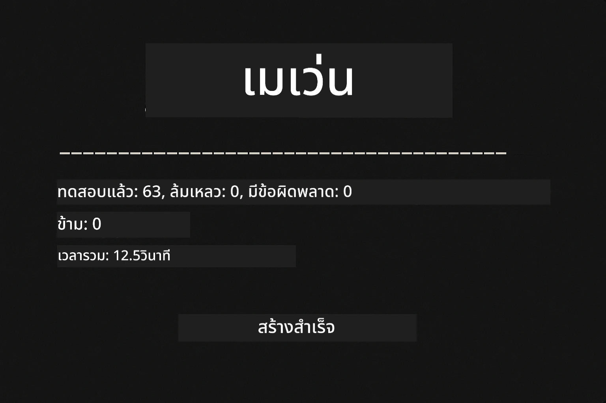
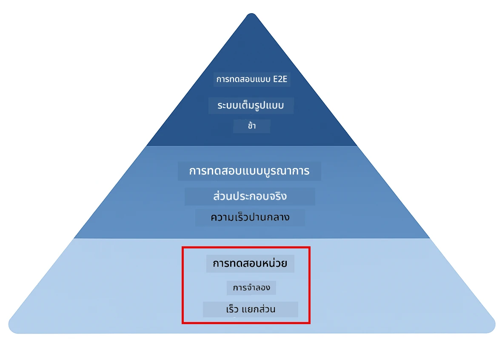
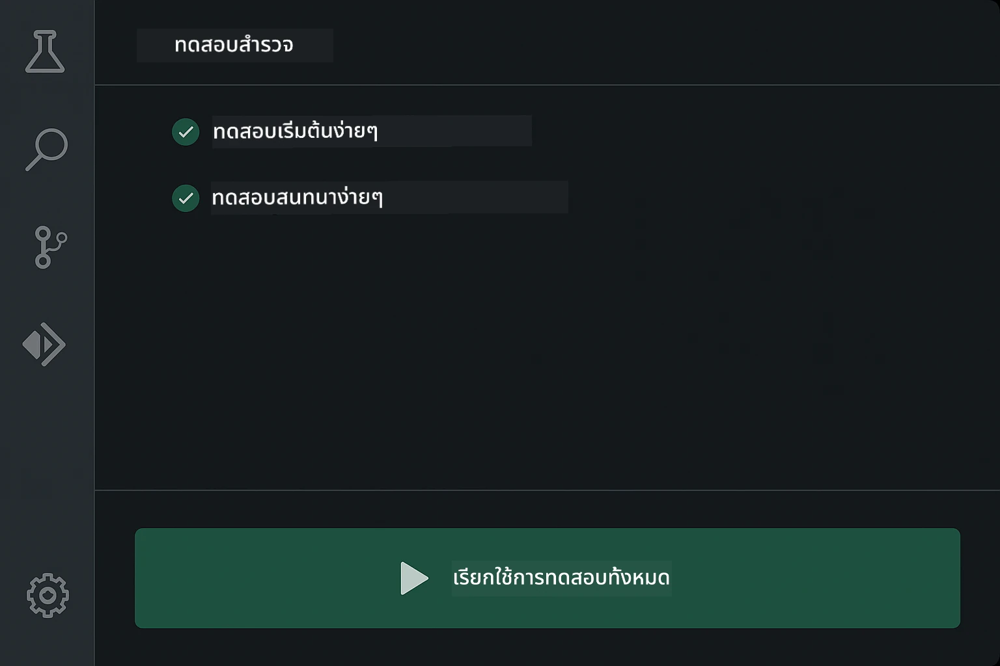
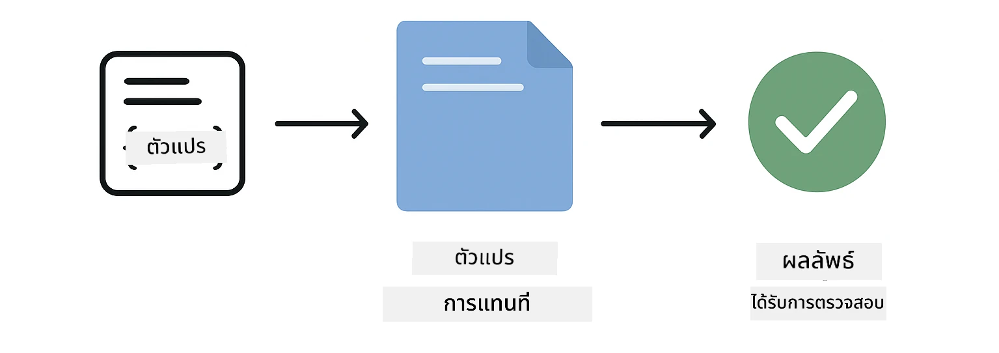
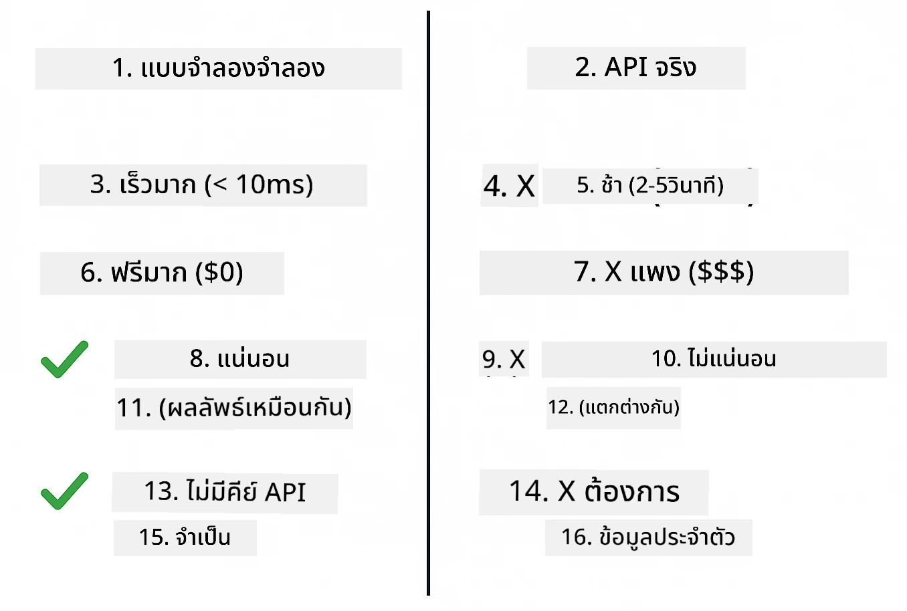
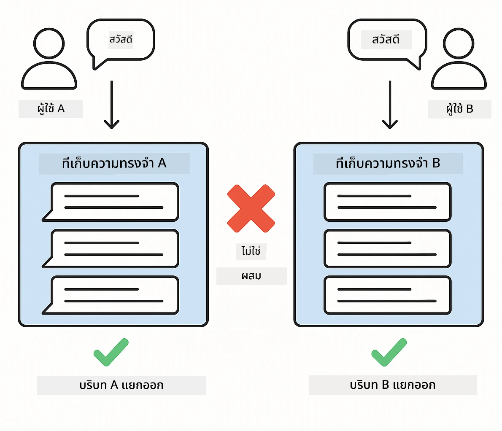
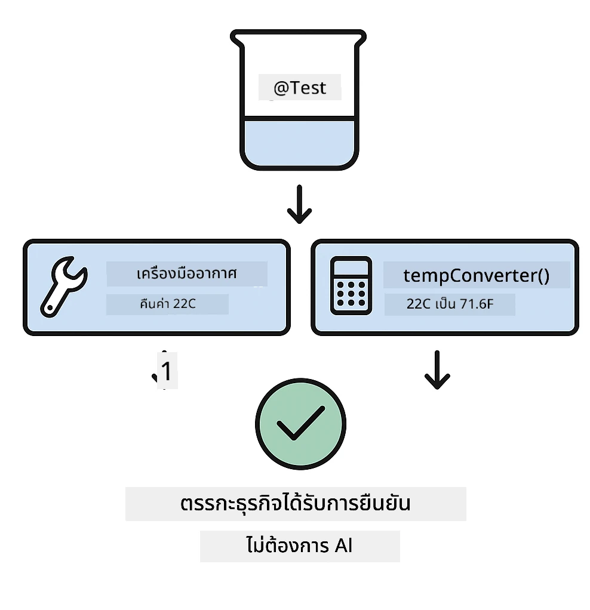
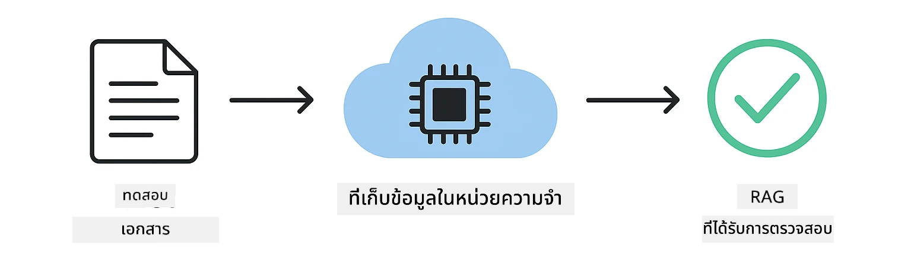

# การทดสอบแอปพลิเคชัน LangChain4j

## สารบัญ

- [เริ่มต้นอย่างรวดเร็ว](#เริ่มต้นอย่างรวดเร็ว)
- [สิ่งที่การทดสอบครอบคลุม](#สิ่งที่การทดสอบครอบคลุม)
- [การรันการทดสอบ](#การรันการทดสอบ)
- [การรันทดสอบใน VS Code](#การรันทดสอบใน-vs-code)
- [รูปแบบการทดสอบ](#รูปแบบการทดสอบ)
- [ปรัชญาการทดสอบ](#ปรัชญาการทดสอบ)
- [ขั้นตอนถัดไป](#ขั้นตอนถัดไป)

คู่มือฉบับนี้จะพาคุณผ่านการทดสอบที่แสดงให้เห็นวิธีการทดสอบแอป AI โดยไม่ต้องการคีย์ API หรือบริการภายนอก

## เริ่มต้นอย่างรวดเร็ว

รันการทดสอบทั้งหมดด้วยคำสั่งเดียว:

**Bash:**
```bash
mvn test
```

**PowerShell:**
```powershell
mvn --% test
```

เมื่อการทดสอบทั้งหมดผ่าน คุณจะเห็นผลลัพธ์เหมือนภาพด้านล่าง — การทดสอบรันไม่มีความล้มเหลว



*การรันทดสอบสำเร็จแสดงให้เห็นว่าการทดสอบทั้งหมดผ่านโดยไม่มีข้อผิดพลาด*

## สิ่งที่การทดสอบครอบคลุม

หลักสูตรนี้เน้นที่ **unit tests** ที่รันในเครื่องแต่ละชุดทดสอบจะสาธิตแนวคิด LangChain4j เฉพาะอย่างในแยกจากกัน พีระมิดการทดสอบด้านล่างแสดงตำแหน่งของ unit tests — ซึ่งเป็นพื้นฐานที่รวดเร็วและเชื่อถือได้ที่แผนกลยุทธ์การทดสอบอื่นๆ สร้างขึ้น



*พีระมิดการทดสอบแสดงความสมดุลระหว่าง unit tests (รวดเร็ว, แยกจากกัน), integration tests (ส่วนประกอบจริง), และ end-to-end tests การฝึกอบรมนี้ครอบคลุม unit testing*

| โมดูล | การทดสอบ | จุดสนใจ | ไฟล์หลัก |
|--------|-------|-------|-----------|
| **01 - บทนำ** | 8 | ความทรงจำบทสนทนาและแชทแบบมีสถานะ | `SimpleConversationTest.java` |
| **02 - การออกแบบ Prompt** | 12 | รูปแบบ GPT-5.2, ระดับความกระตือรือร้น, เอาต์พุตแบบมีโครงสร้าง | `SimpleGpt5PromptTest.java` |
| **03 - RAG** | 10 | การนำเข้าข้อมูลเอกสาร, การฝังตัว, การค้นหาความคล้ายคลึง | `DocumentServiceTest.java` |
| **04 - เครื่องมือ** | 12 | การเรียกฟังก์ชันและการเชื่อมเครื่องมือ | `SimpleToolsTest.java` |
| **05 - MCP** | 8 | โปรโตคอลบริบทโมเดลกับการส่งผ่าน stdio | `SimpleMcpTest.java` |

## การรันการทดสอบ

**รันการทดสอบทั้งหมดจากโฟลเดอร์ root:**

**Bash:**
```bash
mvn test
```

**PowerShell:**
```powershell
mvn --% test
```

**รันการทดสอบสำหรับโมดูลเฉพาะ:**

**Bash:**
```bash
cd 01-introduction && mvn test
# หรือจากรูท
mvn test -pl 01-introduction
```

**PowerShell:**
```powershell
cd 01-introduction; mvn --% test
# หรือจากรูท
mvn --% test -pl 01-introduction
```

**รันการทดสอบคลาสเดียว:**

**Bash:**
```bash
mvn test -Dtest=SimpleConversationTest
```

**PowerShell:**
```powershell
mvn --% test -Dtest=SimpleConversationTest
```

**รันเมธอดทดสอบเฉพาะ:**

**Bash:**
```bash
mvn test -Dtest=SimpleConversationTest#ควรรักษาประวัติการสนทนาไว้
```

**PowerShell:**
```powershell
mvn --% test -Dtest=SimpleConversationTest#ควรรักษาประวัติการสนทนาไว้
```

## การรันทดสอบใน VS Code

หากคุณใช้ Visual Studio Code, Test Explorer ให้ส่วนต่อประสานกราฟิกสำหรับการรันและดีบักการทดสอบ



*VS Code Test Explorer แสดงโครงสร้างต้นไม้การทดสอบพร้อมคลาสทดสอบ Java ทั้งหมดและเมธอดทดสอบแยก*

**วิธีรันทดสอบใน VS Code:**

1. เปิด Test Explorer โดยคลิกไอคอนบีกเกอร์ในแถบ Activity
2. ขยายโครงสร้างต้นไม้การทดสอบเพื่อดูโมดูลและคลาสทดสอบทั้งหมด
3. คลิกปุ่มเล่นข้างการทดสอบใดก็ได้เพื่อรันทดสอบแยก
4. คลิก "Run All Tests" เพื่อรันชุดทดสอบทั้งหมด
5. คลิกขวาที่การทดสอบแล้วเลือก "Debug Test" ตั้งเบรกพอยต์และก้าวผ่านโค้ด

Test Explorer แสดงเครื่องหมายถูกสีเขียวเมื่อการทดสอบผ่านและแจ้งข้อความความล้มเหลวอย่างละเอียดเมื่อการทดสอบล้มเหลว

## รูปแบบการทดสอบ

### รูปแบบ 1: การทดสอบ Prompt Templates

รูปแบบที่ง่ายที่สุดทดสอบเทมเพลต prompt โดยไม่ต้องเรียกโมเดล AI คุณจะตรวจสอบว่าการแทนที่ตัวแปรทำงานถูกต้องและ prompt ถูกฟอร์แมตตามที่คาดหวัง



*การทดสอบเทมเพลต prompt แสดงการไหลของการแทนที่ตัวแปร: เทมเพลตที่มีตัวแปร → ค่าถูกนำไปใช้ → ยืนยันเอาต์พุตที่ฟอร์แมต*

```java
@Test
@DisplayName("Should format prompt template with variables")
void testPromptTemplateFormatting() {
    PromptTemplate template = PromptTemplate.from(
        "Best time to visit {{destination}} for {{activity}}?"
    );
    
    Prompt prompt = template.apply(Map.of(
        "destination", "Paris",
        "activity", "sightseeing"
    ));
    
    assertThat(prompt.text()).isEqualTo("Best time to visit Paris for sightseeing?");
}
```

รูปแบบนี้ยืนยันว่าการแทนที่ตัวแปรทำงานถูกต้องและ prompt ถูกฟอร์แมตตามที่ควร — ไม่ต้องใช้คีย์ API หรือเรียกโมเดล

### รูปแบบ 2: การ Mock โมเดลภาษา

เมื่อทดสอบตรรกะบทสนทนา ใช้ Mockito สร้างโมเดลปลอมที่ส่งคืนคำตอบที่กำหนดไว้ล่วงหน้า นี้ทำให้การทดสอบรวดเร็ว ฟรี และคาดเดาได้



*เปรียบเทียบแสดงว่าทำไม mocks จึงถูกเลือกสำหรับการทดสอบ: เร็ว, ฟรี, คาดเดาได้ และไม่ต้องใช้คีย์ API*

```java
@ExtendWith(MockitoExtension.class)
class SimpleConversationTest {
    
    private ConversationService conversationService;
    
    @Mock
    private OpenAiOfficialChatModel mockChatModel;
    
    @BeforeEach
    void setUp() {
        ChatResponse mockResponse = ChatResponse.builder()
            .aiMessage(AiMessage.from("This is a test response"))
            .build();
        when(mockChatModel.chat(anyList())).thenReturn(mockResponse);
        
        conversationService = new ConversationService(mockChatModel);
    }
    
    @Test
    void shouldMaintainConversationHistory() {
        String conversationId = conversationService.startConversation();
        
        ChatResponse mockResponse1 = ChatResponse.builder()
            .aiMessage(AiMessage.from("Response 1"))
            .build();
        ChatResponse mockResponse2 = ChatResponse.builder()
            .aiMessage(AiMessage.from("Response 2"))
            .build();
        ChatResponse mockResponse3 = ChatResponse.builder()
            .aiMessage(AiMessage.from("Response 3"))
            .build();
        
        when(mockChatModel.chat(anyList()))
            .thenReturn(mockResponse1)
            .thenReturn(mockResponse2)
            .thenReturn(mockResponse3);

        conversationService.chat(conversationId, "First message");
        conversationService.chat(conversationId, "Second message");
        conversationService.chat(conversationId, "Third message");

        List<ChatMessage> history = conversationService.getHistory(conversationId);
        assertThat(history).hasSize(6); // ข้อความจากผู้ใช้ 3 ข้อความ + ข้อความจาก AI 3 ข้อความ
    }
}
```

รูปแบบนี้ปรากฏใน `01-introduction/src/test/java/com/example/langchain4j/service/SimpleConversationTest.java` mock ช่วยให้พฤติกรรมคงที่เพื่อให้คุณตรวจสอบการจัดการความจำทำงานถูกต้อง

### รูปแบบ 3: การทดสอบการแยกบทสนทนา

ความทรงจำของบทสนทนาจะต้องแยกผู้ใช้หลายคนออกจากกัน การทดสอบนี้ยืนยันว่าบทสนทนาไม่มีการผสมบริบท



*การทดสอบการแยกบทสนทนาแสดงที่เก็บความจำแยกต่างหากสำหรับผู้ใช้ต่าง ๆ เพื่อป้องกันการผสมบริบท*

```java
@Test
void shouldIsolateConversationsByid() {
    String conv1 = conversationService.startConversation();
    String conv2 = conversationService.startConversation();
    
    ChatResponse mockResponse = ChatResponse.builder()
        .aiMessage(AiMessage.from("Response"))
        .build();
    when(mockChatModel.chat(anyList())).thenReturn(mockResponse);

    conversationService.chat(conv1, "Message for conversation 1");
    conversationService.chat(conv2, "Message for conversation 2");

    List<ChatMessage> history1 = conversationService.getHistory(conv1);
    List<ChatMessage> history2 = conversationService.getHistory(conv2);
    
    assertThat(history1).hasSize(2);
    assertThat(history2).hasSize(2);
}
```

แต่ละบทสนทนาจะเก็บประวัติของตนเองอย่างอิสระ ในระบบโปรดักชัน การแยกนี้สำคัญสำหรับแอปพลิเคชันหลายผู้ใช้

### รูปแบบ 4: การทดสอบเครื่องมือแบบอิสระ

เครื่องมือคือฟังก์ชันที่ AI สามารถเรียกใช้ ทดสอบเครื่องมือโดยตรงเพื่อให้แน่ใจว่าทำงานถูกต้องโดยไม่ขึ้นกับการตัดสินใจของ AI



*การทดสอบเครื่องมือแบบอิสระแสดงการรันเครื่องมือแบบ mock โดยไม่ต้องเรียก AI เพื่อยืนยันตรรกะธุรกิจ*

```java
@Test
void shouldConvertCelsiusToFahrenheit() {
    TemperatureTool tempTool = new TemperatureTool();
    String result = tempTool.celsiusToFahrenheit(25.0);
    assertThat(result).containsPattern("77[.,]0°F");
}

@Test
void shouldDemonstrateToolChaining() {
    WeatherTool weatherTool = new WeatherTool();
    TemperatureTool tempTool = new TemperatureTool();

    String weatherResult = weatherTool.getCurrentWeather("Seattle");
    assertThat(weatherResult).containsPattern("\\d+°C");

    String conversionResult = tempTool.celsiusToFahrenheit(22.0);
    assertThat(conversionResult).containsPattern("71[.,]6°F");
}
```

การทดสอบนี้จาก `04-tools/src/test/java/com/example/langchain4j/agents/tools/SimpleToolsTest.java` ตรวจสอบตรรกะเครื่องมือโดยไม่เกี่ยวข้องกับ AI ตัวอย่างการเชื่อมโยงแสดงเอาต์พุตของเครื่องมือหนึ่งเป็นอินพุตของอีกเครื่องมือหนึ่ง

### รูปแบบ 5: การทดสอบ RAG ในหน่วยความจำ

ระบบ RAG โดยทั่วไปต้องการฐานข้อมูลเวกเตอร์และบริการ embedding รูปแบบในหน่วยความจำช่วยให้คุณทดสอบทั้ง pipeline โดยไม่ต้องพึ่งพาภายนอก



*เวิร์กโฟลว์การทดสอบ RAG ในหน่วยความจำแสดงการแยกเอกสาร, การเก็บ embedding, และการค้นหาความคล้ายคลึงโดยไม่ต้องใช้ฐานข้อมูล*

```java
@Test
void testProcessTextDocument() {
    String content = "This is a test document.\nIt has multiple lines.";
    InputStream inputStream = new ByteArrayInputStream(content.getBytes(StandardCharsets.UTF_8));
    
    DocumentService.ProcessedDocument result = 
        documentService.processDocument(inputStream, "test.txt");

    assertNotNull(result);
    assertTrue(result.segments().size() > 0);
    assertEquals("test.txt", result.segments().get(0).metadata().getString("filename"));
}
```

การทดสอบนี้จาก `03-rag/src/test/java/com/example/langchain4j/rag/service/DocumentServiceTest.java` สร้างเอกสารในหน่วยความจำและตรวจสอบการแบ่งส่วนและการจัดการเมตาดาต้า

### รูปแบบ 6: การทดสอบการผสาน MCP

โมดูล MCP ทดสอบการผสาน Model Context Protocol โดยใช้การส่งผ่าน stdio การทดสอบเหล่านี้ตรวจสอบว่าแอปของคุณสามารถสร้างและสื่อสารกับเซิร์ฟเวอร์ MCP เป็น subprocess ได้

การทดสอบใน `05-mcp/src/test/java/com/example/langchain4j/mcp/SimpleMcpTest.java` ตรวจสอบพฤติกรรมของลูกค้า MCP

**รันได้ดังนี้:**

**Bash:**
```bash
cd 05-mcp && mvn test
```

**PowerShell:**
```powershell
cd 05-mcp; mvn --% test
```

## ปรัชญาการทดสอบ

ทดสอบโค้ดของคุณ ไม่ใช่ AI การทดสอบของคุณควรตรวจสอบโค้ดที่คุณเขียนโดยเช็คว่าพรอมต์ถูกสร้างอย่างไร ความจำถูกจัดการอย่างไร และเครื่องมือทำงานได้อย่างไร การตอบสนองของ AI มีความแปรผันและไม่ควรเป็นส่วนหนึ่งของข้อสรุปของการทดสอบ ถามตัวเองว่าพรอมต์ของคุณแทนที่ตัวแปรได้ถูกต้องหรือไม่ ไม่ใช่ว่า AI ให้คำตอบถูกหรือไม่

ใช้ mock สำหรับโมเดลภาษา พวกมันเป็นการพึ่งพาภายนอกที่ช้า, แพง, และไม่คงที่ การทำ mock ทำให้การทดสอบรวดเร็ววัดเป็นมิลลิวินาทีแทนวินาที, ฟรีไม่มีค่าใช้จ่าย API, และคงที่ได้ผลลัพธ์เหมือนเดิมทุกครั้ง

รักษาการทดสอบให้เป็นอิสระ แต่ละการทดสอบควรตั้งค่าข้อมูลของตัวเอง ไม่อาศัยการทดสอบอื่น และล้างข้อมูลหลังทำเสร็จ การทดสอบควรผ่านไม่ว่าจะรันลำดับไหน

ทดสอบกรณีขอบเขตนอกเหนือเส้นทางปกติ ลองอินพุตว่าง, อินพุตขนาดใหญ่มาก, อักขระพิเศษ, พารามิเตอร์ไม่ถูกต้อง, และเงื่อนไขขอบเขต เหล่านี้มักเปิดเผยข้อบกพร่องที่การใช้งานปกติไม่แสดง

ใช้ชื่อที่สื่อความหมาย เปรียบเทียบ `shouldMaintainConversationHistoryAcrossMultipleMessages()` กับ `test1()` ชื่อแรกบอกว่าอะไรถูกทดสอบ ทำให้แก้ไขข้อผิดพลาดได้ง่ายขึ้นมาก

## ขั้นตอนถัดไป

เมื่อคุณเข้าใจรูปแบบการทดสอบแล้ว ดำดิ่งลึกลงในแต่ละโมดูล:

- **[01 - บทนำ](../01-introduction/README.md)** - เรียนรู้การจัดการความทรงจำบทสนทนา
- **[02 - การออกแบบ Prompt](../02-prompt-engineering/README.md)** - เชี่ยวชาญรูปแบบ prompting GPT-5.2
- **[03 - RAG](../03-rag/README.md)** - สร้างระบบ retrieval-augmented generation
- **[04 - เครื่องมือ](../04-tools/README.md)** - ใช้งานการเรียกฟังก์ชันและสายงานเครื่องมือ
- **[05 - MCP](../05-mcp/README.md)** - ผสานโปรโตคอลบริบทโมเดล

README ของแต่ละโมดูลให้คำอธิบายอย่างละเอียดของแนวคิดที่ทดสอบในนี้

---

**การนำทาง:** [← กลับไปหน้าหลัก](../README.md)

---

<!-- CO-OP TRANSLATOR DISCLAIMER START -->
**ปฏิเสธความรับผิดชอบ**:
เอกสารนี้ได้รับการแปลโดยใช้บริการแปลภาษา AI [Co-op Translator](https://github.com/Azure/co-op-translator) ขณะที่เราพยายามให้ความถูกต้อง โปรดทราบว่าการแปลโดยอัตโนมัติอาจมีข้อผิดพลาดหรือความไม่ถูกต้อง เอกสารต้นฉบับในภาษาต้นทางควรถูกพิจารณาเป็นแหล่งข้อมูลที่เชื่อถือได้ สำหรับข้อมูลที่สำคัญ แนะนำให้ใช้การแปลโดยมนุษย์มืออาชีพ เราไม่รับผิดชอบต่อความเข้าใจผิดหรือการตีความที่ผิดพลาดที่เกิดขึ้นจากการใช้การแปลนี้
<!-- CO-OP TRANSLATOR DISCLAIMER END -->