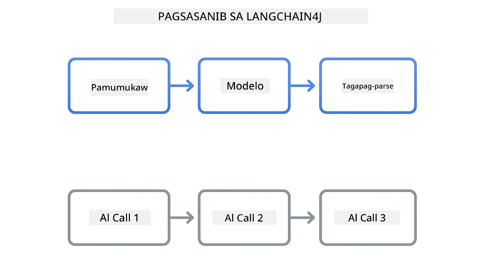
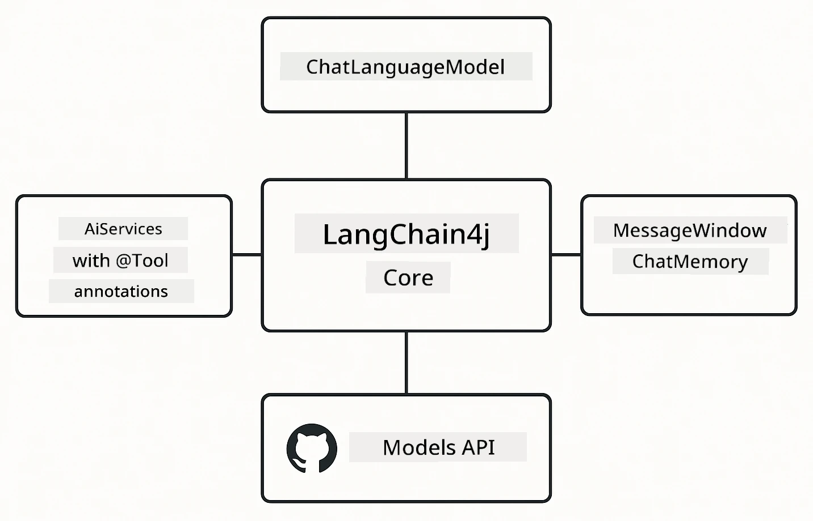

<!--
CO_OP_TRANSLATOR_METADATA:
{
  "original_hash": "22b5d7c8d7585325e38b37fd29eafe25",
  "translation_date": "2026-01-06T00:30:37+00:00",
  "source_file": "00-quick-start/README.md",
  "language_code": "tl"
}
-->
# Module 00: Mabilis na Simula

## Talaan ng Nilalaman

- [Panimula](../../../00-quick-start)
- [Ano ang LangChain4j?](../../../00-quick-start)
- [Mga Pagdepende ng LangChain4j](../../../00-quick-start)
- [Mga Kinakailangan](../../../00-quick-start)
- [Pagsasaayos](../../../00-quick-start)
  - [1. Kunin ang Iyong GitHub Token](../../../00-quick-start)
  - [2. Itakda ang Iyong Token](../../../00-quick-start)
- [Patakbuhin ang mga Halimbawa](../../../00-quick-start)
  - [1. Pangunahing Chat](../../../00-quick-start)
  - [2. Mga Pattern ng Prompt](../../../00-quick-start)
  - [3. Pagtawag sa Function](../../../00-quick-start)
  - [4. Mga Tanong at Sagot sa Dokumento (RAG)](../../../00-quick-start)
  - [5. Responsableng AI](../../../00-quick-start)
- [Ano ang Ipinapakita ng Bawat Halimbawa](../../../00-quick-start)
- [Mga Susunod na Hakbang](../../../00-quick-start)
- [Pag-aayos ng Problema](../../../00-quick-start)

## Panimula

Ang mabilis na simula na ito ay nilayon upang mapatakbo ka agad gamit ang LangChain4j sa pinakamaikling oras. Saklaw nito ang pinaka-pangunahing kaalaman sa paggawa ng mga AI application gamit ang LangChain4j at GitHub Models. Sa mga susunod na module gagamit ka ng Azure OpenAI kasama ang LangChain4j upang gumawa ng mas advanced na mga application.

## Ano ang LangChain4j?

Ang LangChain4j ay isang Java library na nagpapadali sa paggawa ng mga AI-powered na application. Sa halip na asikasuhin ang HTTP clients at JSON parsing, ginagamit mo ang malinis na Java APIs.

Ang "chain" sa LangChain ay tumutukoy sa pagsasama-sama ng maraming bahagi - maaari mong i-chain ang isang prompt sa isang model hanggang sa parser, o pagsamahin ang maraming tawag sa AI kung saan ang output ng isa ay nagsisilbing input para sa kasunod. Nakatuon ang mabilis na simula na ito sa mga pundasyon bago tuklasin ang mas komplikadong chains.



*Pagsasama ng mga bahagi sa LangChain4j - ang mga pundasyon na nagsasanib para makagawa ng makapangyarihang AI workflows*

Gagamit tayo ng tatlong pangunahing bahagi:

**ChatLanguageModel** - Ang interface para sa pakikipag-interaksyon sa AI model. Tawagin ang `model.chat("prompt")` at makakuha ng sagot na string. Ginagamit natin ang `OpenAiOfficialChatModel` na gumagana sa OpenAI-compatible endpoints tulad ng GitHub Models.

**AiServices** - Gumagawa ng type-safe AI service interfaces. I-define ang mga method, lagyan ng anotasyon gamit ang `@Tool`, at pinangangasiwaan ng LangChain4j ang pag-o-orchestrate. Automatic na tinatawag ng AI ang iyong Java methods kapag kinakailangan.

**MessageWindowChatMemory** - Nagpapanatili ng kasaysayan ng pag-uusap. Kung wala ito, bawat request ay independyente. Kung meron, naaalala ng AI ang mga nakaraang mensahe at nagpapanatili ng konteksto sa maraming turn.



*Arkitektura ng LangChain4j - mga pangunahing bahagi na nagtitulungan para paganahin ang iyong AI applications*

## Mga Pagdepende ng LangChain4j

Ang mabilis na simula na ito ay gumagamit ng dalawang Maven dependencies sa [`pom.xml`](../../../00-quick-start/pom.xml):

```xml
<!-- Core LangChain4j library -->
<dependency>
    <groupId>dev.langchain4j</groupId>
    <artifactId>langchain4j</artifactId> <!-- Inherited from BOM in root pom.xml -->
</dependency>

<!-- OpenAI integration (works with GitHub Models) -->
<dependency>
    <groupId>dev.langchain4j</groupId>
    <artifactId>langchain4j-open-ai-official</artifactId> <!-- Inherited from BOM in root pom.xml -->
</dependency>
```

Ang `langchain4j-open-ai-official` module ay nagbibigay ng `OpenAiOfficialChatModel` class na kumokonekta sa OpenAI-compatible na mga API. Ginagamit ng GitHub Models ang parehong API format, kaya walang espesyal na adapter na kailangan - ituturo mo lang ang base URL sa `https://models.github.ai/inference`.

## Mga Kinakailangan

**Gumagamit ng Dev Container?** Nakainstall na ang Java at Maven. Kailangan mo lang ng GitHub Personal Access Token.

**Local na Pag-develop:**
- Java 21+, Maven 3.9+
- GitHub Personal Access Token (mga tagubilin sa ibaba)

> **Tala:** Ginagamit ng module na ito ang `gpt-4.1-nano` mula sa GitHub Models. Huwag baguhin ang pangalan ng model sa code - na-configure ito para gumana sa mga available na modelo ng GitHub.

## Pagsasaayos

### 1. Kunin ang Iyong GitHub Token

1. Punta sa [GitHub Settings → Personal Access Tokens](https://github.com/settings/personal-access-tokens)
2. I-click ang "Generate new token"
3. Magtakda ng makabuluhang pangalan (hal., "LangChain4j Demo")
4. Itakda ang expiration (7 araw ang rekomendado)
5. Sa ilalim ng "Account permissions", hanapin ang "Models" at itakda sa "Read-only"
6. I-click ang "Generate token"
7. Kopyahin at i-save ang iyong token - hindi mo na ito makikita muli

### 2. Itakda ang Iyong Token

**Opsyon 1: Gamit ang VS Code (Inirerekomenda)**

Kung gumagamit ka ng VS Code, idagdag ang iyong token sa `.env` file sa root ng proyekto:

Kung wala ang `.env` file, kopyahin ang `.env.example` papuntang `.env` o gumawa ng bagong `.env` file sa root ng proyekto.

**Halimbawa ng `.env` file:**
```bash
# Sa /workspaces/LangChain4j-for-Beginners/.env
GITHUB_TOKEN=your_token_here
```

Pagkatapos ay maaari kang mag-right-click sa kahit anong demo file (hal., `BasicChatDemo.java`) sa Explorer at piliin ang **"Run Java"** o gamitin ang launch configurations mula sa Run and Debug panel.

**Opsyon 2: Gamit ang Terminal**

Itakda ang token bilang environment variable:

**Bash:**
```bash
export GITHUB_TOKEN=your_token_here
```

**PowerShell:**
```powershell
$env:GITHUB_TOKEN=your_token_here
```

## Patakbuhin ang mga Halimbawa

**Gamit ang VS Code:** Mag-right-click lang sa kahit anong demo file sa Explorer at piliin ang **"Run Java"**, o gamitin ang launch configurations mula sa Run and Debug panel (siguraduhing naidagdag mo na ang token sa `.env` file).

**Gamit ang Maven:** Pwede rin patakbuhin mula sa command line:

### 1. Pangunahing Chat

**Bash:**
```bash
mvn compile exec:java -Dexec.mainClass=com.example.langchain4j.quickstart.BasicChatDemo
```

**PowerShell:**
```powershell
mvn --% compile exec:java -Dexec.mainClass=com.example.langchain4j.quickstart.BasicChatDemo
```

### 2. Mga Pattern ng Prompt

**Bash:**
```bash
mvn compile exec:java -Dexec.mainClass=com.example.langchain4j.quickstart.PromptEngineeringDemo
```

**PowerShell:**
```powershell
mvn --% compile exec:java -Dexec.mainClass=com.example.langchain4j.quickstart.PromptEngineeringDemo
```

Ipinapakita ang zero-shot, few-shot, chain-of-thought, at role-based prompting.

### 3. Pagtawag sa Function

**Bash:**
```bash
mvn compile exec:java -Dexec.mainClass=com.example.langchain4j.quickstart.ToolIntegrationDemo
```

**PowerShell:**
```powershell
mvn --% compile exec:java -Dexec.mainClass=com.example.langchain4j.quickstart.ToolIntegrationDemo
```

Automatic na tinatawag ng AI ang iyong mga Java method kapag kinakailangan.

### 4. Mga Tanong at Sagot sa Dokumento (RAG)

**Bash:**
```bash
mvn compile exec:java -Dexec.mainClass=com.example.langchain4j.quickstart.SimpleReaderDemo
```

**PowerShell:**
```powershell
mvn --% compile exec:java -Dexec.mainClass=com.example.langchain4j.quickstart.SimpleReaderDemo
```

Magtanong tungkol sa nilalaman ng `document.txt`.

### 5. Responsableng AI

**Bash:**
```bash
mvn compile exec:java -Dexec.mainClass=com.example.langchain4j.quickstart.ResponsibleAIDemo
```

**PowerShell:**
```powershell
mvn --% compile exec:java -Dexec.mainClass=com.example.langchain4j.quickstart.ResponsibleAIDemo
```

Tingnan kung paano hinaharang ng mga AI safety filters ang mapanganib na nilalaman.

## Ano ang Ipinapakita ng Bawat Halimbawa

**Pangunahing Chat** - [BasicChatDemo.java](../../../00-quick-start/src/main/java/com/example/langchain4j/quickstart/BasicChatDemo.java)

Magsimula dito upang makita ang LangChain4j sa pinakapayak nitong anyo. Gumawa ka ng `OpenAiOfficialChatModel`, magpadala ng prompt gamit ang `.chat()`, at makakuha ng tugon. Ipinapakita nito ang pundasyon: kung paano i-initialize ang mga modelo gamit ang custom endpoints at API keys. Kapag naintindihan mo na ang pattern na ito, lahat ng iba pang mga bagay ay nakabatay dito.

```java
ChatLanguageModel model = OpenAiOfficialChatModel.builder()
    .baseUrl("https://models.github.ai/inference")
    .apiKey(System.getenv("GITHUB_TOKEN"))
    .modelName("gpt-4.1-nano")
    .build();

String response = model.chat("What is LangChain4j?");
System.out.println(response);
```

> **🤖 Subukan gamit ang [GitHub Copilot](https://github.com/features/copilot) Chat:** Buksan ang [`BasicChatDemo.java`](../../../00-quick-start/src/main/java/com/example/langchain4j/quickstart/BasicChatDemo.java) at itanong:
> - "Paano ako lilipat mula sa GitHub Models papuntang Azure OpenAI sa code na ito?"
> - "Anong iba pang mga parameter ang pwede kong i-configure sa OpenAiOfficialChatModel.builder()?"
> - "Paano ako magdadagdag ng streaming responses imbes na maghintay sa kompletong sagot?"

**Prompt Engineering** - [PromptEngineeringDemo.java](../../../00-quick-start/src/main/java/com/example/langchain4j/quickstart/PromptEngineeringDemo.java)

Ngayon na alam mo na kung paano makipag-usap sa isang model, tuklasin natin kung ano ang sinasabi mo dito. Ginagamit ng demo na ito ang parehong setup ng model pero nagpapakita ng apat na iba't ibang pattern ng prompting. Subukan ang zero-shot prompts para sa direktang utos, few-shot prompts na natututo mula sa mga halimbawa, chain-of-thought prompts na nagpapakita ng mga hakbang ng pag-iisip, at role-based prompts na nagtatakda ng konteksto. Makikita mo kung paano nagbibigay ang parehong modelo ng ibang-ibang resulta depende sa kung paano mo ibinabalangkas ang iyong kahilingan.

```java
PromptTemplate template = PromptTemplate.from(
    "What's the best time to visit {{destination}} for {{activity}}?"
);

Prompt prompt = template.apply(Map.of(
    "destination", "Paris",
    "activity", "sightseeing"
));

String response = model.chat(prompt.text());
```

> **🤖 Subukan gamit ang [GitHub Copilot](https://github.com/features/copilot) Chat:** Buksan ang [`PromptEngineeringDemo.java`](../../../00-quick-start/src/main/java/com/example/langchain4j/quickstart/PromptEngineeringDemo.java) at itanong:
> - "Ano ang pinagkaiba ng zero-shot at few-shot prompting, at kailan dapat gamitin ang bawat isa?"
> - "Paano naaapektuhan ng temperature parameter ang mga sagot ng model?"
> - "Ano ang mga teknik para maiwasan ang prompt injection attacks sa production?"
> - "Paano ako gagawa ng reusable na PromptTemplate objects para sa mga karaniwang pattern?"

**Pagsasama ng Tool** - [ToolIntegrationDemo.java](../../../00-quick-start/src/main/java/com/example/langchain4j/quickstart/ToolIntegrationDemo.java)

Dito nagiging makapangyarihan ang LangChain4j. Gagamitin mo ang `AiServices` upang gumawa ng AI assistant na kayang tumawag sa iyong mga Java method. Lagyan lamang ng anotasyon ang mga method gamit ang `@Tool("deskripsyon")` at ang LangChain4j na ang bahala - automatic na pinipili ng AI kung kailan gagamitin ang bawat tool batay sa hinihiling ng user. Ipinapakita nito ang function calling, isang mahalagang teknik para makabuo ng AI na kayang magsagawa ng mga aksyon, hindi lang sumagot ng tanong.

```java
@Tool("Performs addition of two numeric values")
public double add(double a, double b) {
    return a + b;
}

MathAssistant assistant = AiServices.create(MathAssistant.class, model);
String response = assistant.chat("What is 25 plus 17?");
```

> **🤖 Subukan gamit ang [GitHub Copilot](https://github.com/features/copilot) Chat:** Buksan ang [`ToolIntegrationDemo.java`](../../../00-quick-start/src/main/java/com/example/langchain4j/quickstart/ToolIntegrationDemo.java) at itanong:
> - "Paano gumagana ang @Tool annotation at ano ang ginagawa ng LangChain4j rito sa likod?"
> - "Pwede bang tumawag ang AI ng maraming tool ng sunud-sunod para lutasin ang mga komplikadong problema?"
> - "Ano ang nangyayari kapag may nagtapon ng exception ang isang tool - paano ang pag-handle ng errors?"
> - "Paano ko isasama ang totoong API imbes ng halimbawa ng calculator na ito?"

**Mga Tanong at Sagot sa Dokumento (RAG)** - [SimpleReaderDemo.java](../../../00-quick-start/src/main/java/com/example/langchain4j/quickstart/SimpleReaderDemo.java)

Dito makikita mo ang pundasyon ng RAG (retrieval-augmented generation). Sa halip na umasa sa training data ng model, naglo-load ka ng nilalaman mula sa [`document.txt`](../../../00-quick-start/document.txt) at isinama mo ito sa prompt. Sumagot ang AI base sa iyong dokumento, hindi sa pangkalahatang kaalaman nito. Ito ang unang hakbang para makagawa ng sistema na kayang gumamit ng sarili mong data.

```java
Document document = FileSystemDocumentLoader.loadDocument("document.txt");
String content = document.text();

String prompt = "Based on this document: " + content + 
                "\nQuestion: What is the main topic?";
String response = model.chat(prompt);
```

> **Tala:** Ang simpleng paraang ito ay niloload ang buong dokumento sa prompt. Para sa malalaking file (>10KB), lalampas ka sa context limits. Tatalakayin sa Module 03 ang chunking at vector search para sa production RAG systems.

> **🤖 Subukan gamit ang [GitHub Copilot](https://github.com/features/copilot) Chat:** Buksan ang [`SimpleReaderDemo.java`](../../../00-quick-start/src/main/java/com/example/langchain4j/quickstart/SimpleReaderDemo.java) at itanong:
> - "Paano pinipigilan ng RAG ang AI hallucinations kumpara sa paggamit ng training data ng model?"
> - "Ano ang pinagkaiba ng simpleng paraan na ito sa paggamit ng vector embeddings para sa retrieval?"
> - "Paano ako mag- scale nito para harapin ang maraming dokumento o mas malaking knowledge base?"
> - "Ano ang mga best practice sa pag-istruktura ng prompt upang matiyak na ginagamit lamang ng AI ang ibinigay na konteksto?"

**Responsableng AI** - [ResponsibleAIDemo.java](../../../00-quick-start/src/main/java/com/example/langchain4j/quickstart/ResponsibleAIDemo.java)

Gumawa ng AI safety gamit ang depensa sa lalim. Ipinapakita ng demo na ito ang dalawang layer ng proteksyon na nagtutulungan:

**Bahagi 1: LangChain4j Input Guardrails** - Hinaharang ang mga mapanganib na prompt bago pa ito makarating sa LLM. Gumawa ng custom guardrails na nagcha-check para sa ipinagbabawal na mga keyword o pattern. Ito ay tumatakbo sa iyong code, kaya mabilis at libre.

```java
class DangerousContentGuardrail implements InputGuardrail {
    @Override
    public InputGuardrailResult validate(UserMessage userMessage) {
        String text = userMessage.singleText().toLowerCase();
        if (text.contains("explosives")) {
            return fatal("Blocked: contains prohibited keyword");
        }
        return success();
    }
}
```

**Bahagi 2: Provider Safety Filters** - May built-in na filters ang GitHub Models na nahuhuli ang mga maaaring hindi mahuli ng iyong guardrails. Makikita mo ang hard blocks (HTTP 400 errors) para sa matitinding paglabag at soft refusals kung saan magalang na tumatanggi ang AI.

> **🤖 Subukan gamit ang [GitHub Copilot](https://github.com/features/copilot) Chat:** Buksan ang [`ResponsibleAIDemo.java`](../../../00-quick-start/src/main/java/com/example/langchain4j/quickstart/ResponsibleAIDemo.java) at itanong:
> - "Ano ang InputGuardrail at paano ako gagawa ng sarili ko?"
> - "Ano ang pinagkaiba ng hard block at soft refusal?"
> - "Bakit kailangang gamitin parehong guardrails at provider filters?"

## Mga Susunod na Hakbang

**Susunod na Module:** [01-introduction - Pagsisimula gamit ang LangChain4j at gpt-5 sa Azure](../01-introduction/README.md)

---

**Navigation:** [← Balik sa Pangunahing](../README.md) | [Susunod: Module 01 - Panimula →](../01-introduction/README.md)

---

## Pag-aayos ng Problema

### Unang Beses na Maven Build

**Isyu:** Ang unang `mvn clean compile` o `mvn package` ay tumatagal (10-15 minuto)

**Dahilan:** Kailangan ng Maven i-download ang lahat ng dependencies ng proyekto (Spring Boot, LangChain4j libraries, Azure SDKs, atbp.) sa unang build.

**Solusyon:** Normal ang ganitong behavior. Mas mabilis ang mga susunod na build dahil naka-cache na locally ang dependencies. Depende ang oras ng pag-download sa bilis ng iyong network.

### Syntax ng PowerShell Maven Command

**Isyu:** Nabibigo ang Maven commands na may error na `Unknown lifecycle phase ".mainClass=..."`

**Dahilan:** Kinukuha ng PowerShell ang `=` bilang operator ng variable assignment, kaya nasisira ang syntax ng Maven property.
**Solusyon**: Gamitin ang stop-parsing operator na `--%` bago ang utos ng Maven:

**PowerShell:**
```powershell
mvn --% compile exec:java -Dexec.mainClass=com.example.langchain4j.quickstart.BasicChatDemo
```

**Bash:**
```bash
mvn compile exec:java -Dexec.mainClass=com.example.langchain4j.quickstart.BasicChatDemo
```

Ang operator na `--%` ay nagsasabi sa PowerShell na ipasa nang literal sa Maven ang lahat ng natitirang argumento nang walang interpretasyon.

### Pagpapakita ng Emoji sa Windows PowerShell

**Isyu**: Nagpapakita ang mga sagot ng AI ng mga kalat na karakter (hal. `????` o `â??`) sa halip na emojis sa PowerShell

**Sanhi**: Hindi suportado ng default na encoding ng PowerShell ang UTF-8 emojis

**Solusyon**: Patakbuhin ang utos na ito bago magpatakbo ng mga aplikasyon sa Java:
```cmd
chcp 65001
```

Pinipilit nito ang UTF-8 encoding sa terminal. Bilang alternatibo, gamitin ang Windows Terminal na may mas mahusay na suporta sa Unicode.

### Pag-debug ng mga Tawag sa API

**Isyu**: Mga error sa pagpapatunay, limitasyon sa rate, o mga hindi inaasahang tugon mula sa AI model

**Solusyon**: Kasama sa mga halimbawa ang `.logRequests(true)` at `.logResponses(true)` upang ipakita ang mga tawag sa API sa console. Nakakatulong ito sa pag-troubleshoot ng mga error sa pagpapatunay, limitasyon sa rate, o hindi inaasahang tugon. Alisin ang mga flag na ito sa produksyon upang mabawasan ang ingay sa log.

---

<!-- CO-OP TRANSLATOR DISCLAIMER START -->
**Pagsasalin ng Paunawa**:  
Ang dokumentong ito ay naisalin gamit ang AI translation service na [Co-op Translator](https://github.com/Azure/co-op-translator). Bagamat sinisikap naming maging tumpak ang pagsasalin, mangyaring tandaan na maaaring may mga pagkakamali o hindi eksaktong salin ang awtomatikong pagsasalin. Ang orihinal na dokumento sa kanyang orihinal na wika ang dapat ituring na pangunahing sanggunian. Para sa mahahalagang impormasyon, ipinapayo ang propesyonal na pagsasalin ng tao. Hindi kami mananagot sa anumang hindi pagkakaintindihan o maling interpretasyon na maaaring magmula sa paggamit ng pagsasaling ito.
<!-- CO-OP TRANSLATOR DISCLAIMER END -->