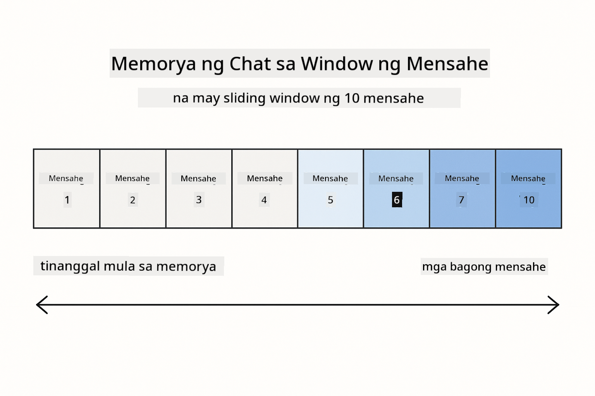
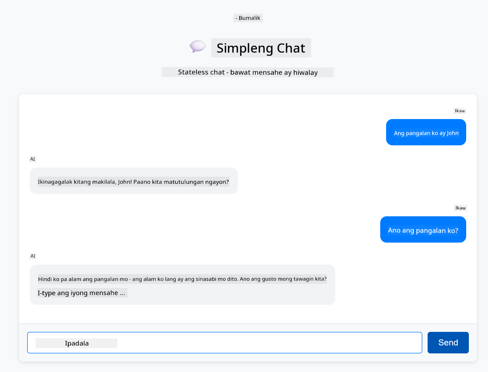
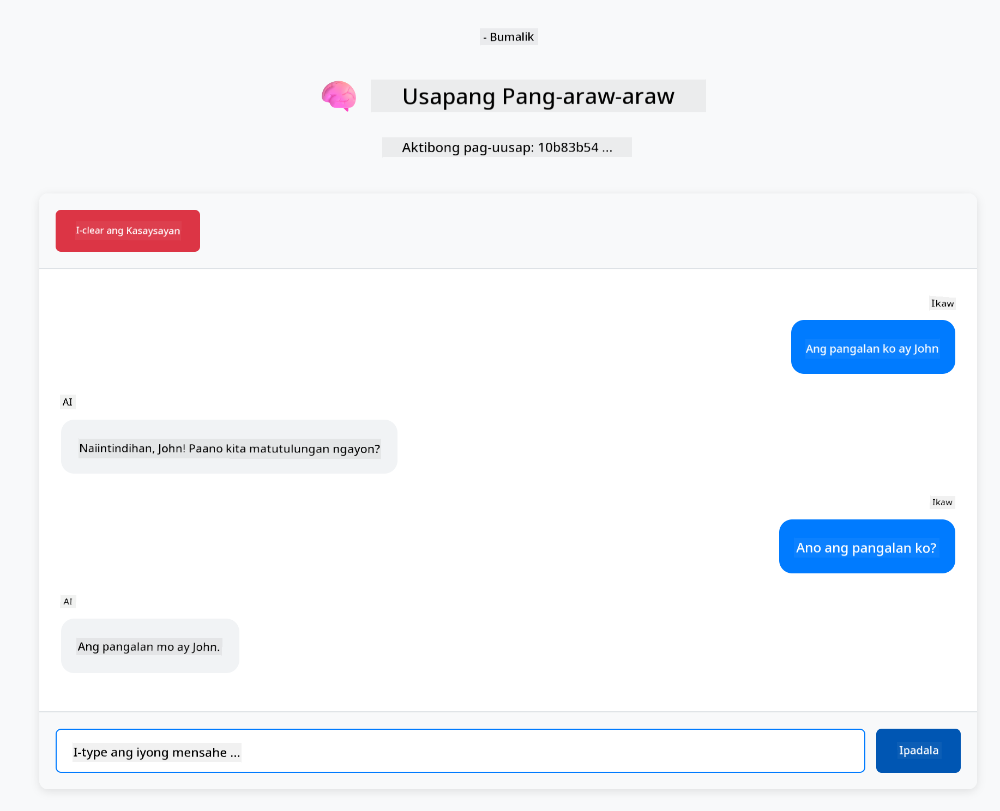

<!--
CO_OP_TRANSLATOR_METADATA:
{
  "original_hash": "c3e07ca58d0b8a3f47d3bf5728541e0a",
  "translation_date": "2025-12-13T13:53:35+00:00",
  "source_file": "01-introduction/README.md",
  "language_code": "tl"
}
-->
# Module 01: Pagsisimula sa LangChain4j

## Table of Contents

- [Ano ang Matututuhan Mo](../../../01-introduction)
- [Mga Kinakailangan](../../../01-introduction)
- [Pag-unawa sa Pangunahing Suliranin](../../../01-introduction)
- [Pag-unawa sa Tokens](../../../01-introduction)
- [Paano Gumagana ang Memorya](../../../01-introduction)
- [Paano Ito Gumagamit ng LangChain4j](../../../01-introduction)
- [I-deploy ang Azure OpenAI Infrastructure](../../../01-introduction)
- [Patakbuhin ang Aplikasyon Nang Lokal](../../../01-introduction)
- [Paggamit ng Aplikasyon](../../../01-introduction)
  - [Stateless Chat (Kaliwang Panel)](../../../01-introduction)
  - [Stateful Chat (Kanan Panel)](../../../01-introduction)
- [Mga Susunod na Hakbang](../../../01-introduction)

## Ano ang Matututuhan Mo

Kung natapos mo ang mabilisang pagsisimula, nakita mo kung paano magpadala ng mga prompt at makatanggap ng mga tugon. Iyan ang pundasyon, ngunit ang mga totoong aplikasyon ay nangangailangan pa ng higit. Itinuturo sa module na ito kung paano bumuo ng conversational AI na nakakaalala ng konteksto at nagpapanatili ng estado - ang pagkakaiba sa pagitan ng isang one-off demo at isang handang aplikasyon para sa produksyon.

Gagamitin natin ang GPT-5 ng Azure OpenAI sa buong gabay na ito dahil ang mga advanced na kakayahan nito sa pangangatwiran ay nagpapalinaw ng pag-uugali ng iba't ibang pattern. Kapag nagdagdag ka ng memorya, malinaw mong makikita ang pagkakaiba. Pinapadali nito ang pag-unawa kung ano ang dinadala ng bawat bahagi sa iyong aplikasyon.

Bubuuin mo ang isang aplikasyon na nagpapakita ng parehong mga pattern:

**Stateless Chat** - Bawat kahilingan ay independyente. Walang memorya ang modelo ng mga naunang mensahe. Ito ang pattern na ginamit mo sa mabilisang pagsisimula.

**Stateful Conversation** - Kasama sa bawat kahilingan ang kasaysayan ng pag-uusap. Pinapanatili ng modelo ang konteksto sa maraming pag-uusap. Ito ang kinakailangan ng mga aplikasyon sa produksyon.

## Mga Kinakailangan

- Azure subscription na may access sa Azure OpenAI
- Java 21, Maven 3.9+
- Azure CLI (https://learn.microsoft.com/en-us/cli/azure/install-azure-cli)
- Azure Developer CLI (azd) (https://learn.microsoft.com/en-us/azure/developer/azure-developer-cli/install-azd)

> **Note:** Pre-installed na ang Java, Maven, Azure CLI at Azure Developer CLI (azd) sa ibinigay na devcontainer.

> **Note:** Ginagamit ng module na ito ang GPT-5 sa Azure OpenAI. Ang deployment ay awtomatikong naka-configure gamit ang `azd up` - huwag baguhin ang pangalan ng modelo sa code.

## Pag-unawa sa Pangunahing Suliranin

Ang mga language model ay stateless. Bawat API call ay independyente. Kung magpapadala ka ng "My name is John" at pagkatapos ay magtatanong ng "What's my name?", wala itong ideya na ipinakilala mo ang iyong sarili. Tinuturing nito ang bawat kahilingan na parang ito ang unang pag-uusap mo kailanman.

Ayos lang ito para sa simpleng Q&A ngunit walang silbi para sa totoong aplikasyon. Kailangan ng mga customer service bot na maalala ang sinabi mo sa kanila. Kailangan ng mga personal assistant ng konteksto. Anumang multi-turn na pag-uusap ay nangangailangan ng memorya.


*Ang pagkakaiba sa pagitan ng stateless (independent calls) at stateful (context-aware) na mga pag-uusap*

## Pag-unawa sa Tokens

Bago sumabak sa mga pag-uusap, mahalagang maunawaan ang tokens - ang mga pangunahing yunit ng teksto na pinoproseso ng mga language model:


*Halimbawa kung paano hinahati ang teksto sa mga token - "I love AI!" ay nagiging 4 na magkakahiwalay na yunit ng pagproseso*

Ang mga token ang ginagamit ng mga AI model para sukatin at iproseso ang teksto. Maaaring mga salita, bantas, at kahit mga espasyo ay mga token. May limitasyon ang iyong modelo kung ilang token ang kaya nitong iproseso nang sabay-sabay (400,000 para sa GPT-5, na may hanggang 272,000 input tokens at 128,000 output tokens). Ang pag-unawa sa tokens ay tumutulong sa pamamahala ng haba ng pag-uusap at gastos.

## Paano Gumagana ang Memorya

Nilulutas ng chat memory ang problema ng pagiging stateless sa pamamagitan ng pagpapanatili ng kasaysayan ng pag-uusap. Bago ipadala ang iyong kahilingan sa modelo, idinadagdag ng framework ang mga kaugnay na naunang mensahe. Kapag tinanong mo "What's my name?", ipinapadala ng sistema ang buong kasaysayan ng pag-uusap, kaya nakikita ng modelo na sinabi mo dati na "My name is John."

Nagbibigay ang LangChain4j ng mga implementasyon ng memorya na awtomatikong humahawak nito. Pinipili mo kung ilang mensahe ang itatago at pinamamahalaan ng framework ang context window.



*Pinapanatili ng MessageWindowChatMemory ang sliding window ng mga kamakailang mensahe, awtomatikong tinatanggal ang mga luma*

## Paano Ito Gumagamit ng LangChain4j

Pinalalawak ng module na ito ang mabilisang pagsisimula sa pamamagitan ng pag-integrate ng Spring Boot at pagdagdag ng memorya sa pag-uusap. Ganito ang pagkakaugnay ng mga bahagi:

**Dependencies** - Magdagdag ng dalawang LangChain4j libraries:

```xml
<dependency>
    <groupId>dev.langchain4j</groupId>
    <artifactId>langchain4j</artifactId> <!-- Inherited from BOM in root pom.xml -->
</dependency>
<dependency>
    <groupId>dev.langchain4j</groupId>
    <artifactId>langchain4j-open-ai-official</artifactId> <!-- Inherited from BOM in root pom.xml -->
</dependency>
```

**Chat Model** - I-configure ang Azure OpenAI bilang Spring bean ([LangChainConfig.java](../../../01-introduction/src/main/java/com/example/langchain4j/config/LangChainConfig.java)):

```java
@Bean
public OpenAiOfficialChatModel openAiOfficialChatModel() {
    return OpenAiOfficialChatModel.builder()
            .baseUrl(azureEndpoint)
            .apiKey(azureApiKey)
            .modelName(deploymentName)
            .timeout(Duration.ofMinutes(5))
            .maxRetries(3)
            .build();
}
```

Binabasa ng builder ang mga kredensyal mula sa mga environment variable na itinakda ng `azd up`. Ang pagtatakda ng `baseUrl` sa iyong Azure endpoint ay nagpapagana sa OpenAI client na gumana sa Azure OpenAI.

**Conversation Memory** - Subaybayan ang kasaysayan ng chat gamit ang MessageWindowChatMemory ([ConversationService.java](../../../01-introduction/src/main/java/com/example/langchain4j/service/ConversationService.java)):

```java
ChatMemory memory = MessageWindowChatMemory.withMaxMessages(10);

memory.add(UserMessage.from("My name is John"));
memory.add(AiMessage.from("Nice to meet you, John!"));

memory.add(UserMessage.from("What's my name?"));
AiMessage aiMessage = chatModel.chat(memory.messages()).aiMessage();
memory.add(aiMessage);
```

Gumawa ng memorya gamit ang `withMaxMessages(10)` para panatilihin ang huling 10 mensahe. Magdagdag ng mga mensahe ng user at AI gamit ang typed wrappers: `UserMessage.from(text)` at `AiMessage.from(text)`. Kunin ang kasaysayan gamit ang `memory.messages()` at ipadala ito sa modelo. Nagtatago ang serbisyo ng hiwalay na mga memory instance para sa bawat conversation ID, na nagpapahintulot sa maraming user na mag-chat nang sabay-sabay.

> **🤖 Subukan gamit ang [GitHub Copilot](https://github.com/features/copilot) Chat:** Buksan ang [`ConversationService.java`](../../../01-introduction/src/main/java/com/example/langchain4j/service/ConversationService.java) at itanong:
> - "Paano pinipili ng MessageWindowChatMemory kung aling mga mensahe ang tatanggalin kapag puno na ang window?"
> - "Puwede ba akong gumawa ng custom memory storage gamit ang database sa halip na in-memory?"
> - "Paano ako magdadagdag ng summarization para i-compress ang lumang kasaysayan ng pag-uusap?"

Ang stateless chat endpoint ay hindi gumagamit ng memorya - diretso lang `chatModel.chat(prompt)` tulad ng mabilisang pagsisimula. Ang stateful endpoint ay nagdadagdag ng mga mensahe sa memorya, kumukuha ng kasaysayan, at isinasama ang kontekstong iyon sa bawat kahilingan. Parehong configuration ng modelo, magkaibang mga pattern.

## I-deploy ang Azure OpenAI Infrastructure

**Bash:**
```bash
cd 01-introduction
azd up  # Piliin ang subscription at lokasyon (inirerekomenda ang eastus2)
```

**PowerShell:**
```powershell
cd 01-introduction
azd up  # Piliin ang subscription at lokasyon (inirerekomenda ang eastus2)
```

> **Note:** Kung makaranas ng timeout error (`RequestConflict: Cannot modify resource ... provisioning state is not terminal`), patakbuhin lang muli ang `azd up`. Maaaring nagpapatuloy pa ang provisioning ng Azure resources sa background, at ang pag-ulit ay nagpapahintulot sa deployment na matapos kapag naabot na ng mga resources ang terminal state.

Ito ay:
1. Magde-deploy ng Azure OpenAI resource na may GPT-5 at text-embedding-3-small models
2. Awtomatikong gagawa ng `.env` file sa root ng proyekto na may mga kredensyal
3. Magse-set up ng lahat ng kinakailangang environment variables

**May problema sa deployment?** Tingnan ang [Infrastructure README](infra/README.md) para sa detalyadong troubleshooting kabilang ang mga conflict sa subdomain name, mga hakbang sa manual Azure Portal deployment, at gabay sa configuration ng modelo.

**I-verify kung matagumpay ang deployment:**

**Bash:**
```bash
cat ../.env  # Dapat ipakita ang AZURE_OPENAI_ENDPOINT, API_KEY, atbp.
```

**PowerShell:**
```powershell
Get-Content ..\.env  # Dapat ipakita ang AZURE_OPENAI_ENDPOINT, API_KEY, atbp.
```

> **Note:** Awtomatikong ginagawa ng `azd up` ang `.env` file. Kung kailangan mo itong i-update mamaya, maaari mo itong i-edit nang manu-mano o i-regenerate sa pamamagitan ng pagpapatakbo ng:
>
> **Bash:**
> ```bash
> cd ..
> bash .azd-env.sh
> ```
>
> **PowerShell:**
> ```powershell
> cd ..
> .\.azd-env.ps1
> ```

## Patakbuhin ang Aplikasyon Nang Lokal

**I-verify ang deployment:**

Siguraduhing naroroon ang `.env` file sa root directory na may Azure credentials:

**Bash:**
```bash
cat ../.env  # Dapat ipakita ang AZURE_OPENAI_ENDPOINT, API_KEY, DEPLOYMENT
```

**PowerShell:**
```powershell
Get-Content ..\.env  # Dapat ipakita ang AZURE_OPENAI_ENDPOINT, API_KEY, DEPLOYMENT
```

**Simulan ang mga aplikasyon:**

**Opsyon 1: Gamit ang Spring Boot Dashboard (Inirerekomenda para sa mga gumagamit ng VS Code)**

Kasama sa dev container ang Spring Boot Dashboard extension, na nagbibigay ng visual na interface para pamahalaan ang lahat ng Spring Boot applications. Makikita mo ito sa Activity Bar sa kaliwang bahagi ng VS Code (hanapin ang Spring Boot icon).

Mula sa Spring Boot Dashboard, maaari mong:
- Makita ang lahat ng available na Spring Boot applications sa workspace
- Simulan/hintuin ang mga aplikasyon sa isang click lang
- Tingnan ang mga log ng aplikasyon nang real-time
- Subaybayan ang status ng aplikasyon

I-click lang ang play button sa tabi ng "introduction" para simulan ang module na ito, o simulan lahat ng module nang sabay-sabay.


**Opsyon 2: Gamit ang shell scripts**

Simulan lahat ng web applications (modules 01-04):

**Bash:**
```bash
cd ..  # Mula sa root na direktoryo
./start-all.sh
```

**PowerShell:**
```powershell
cd ..  # Mula sa root na direktoryo
.\start-all.ps1
```

O simulan lang ang module na ito:

**Bash:**
```bash
cd 01-introduction
./start.sh
```

**PowerShell:**
```powershell
cd 01-introduction
.\start.ps1
```

Awtomatikong niloload ng parehong script ang environment variables mula sa root `.env` file at bubuuin ang mga JAR kung wala pa.

> **Note:** Kung nais mong manu-manong buuin lahat ng module bago magsimula:
>
> **Bash:**
> ```bash
> cd ..  # Go to root directory
> mvn clean package -DskipTests
> ```
>
> **PowerShell:**
> ```powershell
> cd ..  # Go to root directory
> mvn clean package -DskipTests
> ```

Buksan ang http://localhost:8080 sa iyong browser.

**Para itigil:**

**Bash:**
```bash
./stop.sh  # Para lamang sa module na ito
# O
cd .. && ./stop-all.sh  # Lahat ng mga module
```

**PowerShell:**
```powershell
.\stop.ps1  # Para lamang sa module na ito
# O
cd ..; .\stop-all.ps1  # Lahat ng mga module
```

## Paggamit ng Aplikasyon

Nagbibigay ang aplikasyon ng web interface na may dalawang chat implementation na magkatabi.


*Dashboard na nagpapakita ng parehong Simple Chat (stateless) at Conversational Chat (stateful) na mga opsyon*

### Stateless Chat (Kaliwang Panel)

Subukan ito muna. Itanong ang "My name is John" at pagkatapos ay agad itanong "What's my name?" Hindi ito makakaalala dahil bawat mensahe ay independyente. Ipinapakita nito ang pangunahing problema sa basic na integration ng language model - walang konteksto ng pag-uusap.



*Hindi naaalala ng AI ang iyong pangalan mula sa naunang mensahe*

### Stateful Chat (Kanan Panel)

Ngayon subukan ang parehong pagkakasunod dito. Itanong ang "My name is John" at pagkatapos ay "What's my name?" Ngayon ay naaalala nito. Ang pagkakaiba ay ang MessageWindowChatMemory - pinapanatili nito ang kasaysayan ng pag-uusap at isinasama ito sa bawat kahilingan. Ganito gumagana ang production conversational AI.



*Naalaala ng AI ang iyong pangalan mula sa naunang pag-uusap*

Parehong GPT-5 model ang ginagamit ng dalawang panel. Ang tanging pagkakaiba ay ang memorya. Pinapalinaw nito kung ano ang naidudulot ng memorya sa iyong aplikasyon at bakit ito mahalaga para sa totoong gamit.

## Mga Susunod na Hakbang

**Susunod na Module:** [02-prompt-engineering - Prompt Engineering with GPT-5](../02-prompt-engineering/README.md)

---

**Navigation:** [← Nakaraan: Module 00 - Quick Start](../00-quick-start/README.md) | [Bumalik sa Pangunahing Pahina](../README.md) | [Susunod: Module 02 - Prompt Engineering →](../02-prompt-engineering/README.md)

---

<!-- CO-OP TRANSLATOR DISCLAIMER START -->
**Paalala**:
Ang dokumentong ito ay isinalin gamit ang AI translation service na [Co-op Translator](https://github.com/Azure/co-op-translator). Bagamat nagsusumikap kami para sa katumpakan, pakatandaan na ang mga awtomatikong pagsasalin ay maaaring maglaman ng mga pagkakamali o di-tumpak na impormasyon. Ang orihinal na dokumento sa orihinal nitong wika ang dapat ituring na pangunahing sanggunian. Para sa mahahalagang impormasyon, inirerekomenda ang propesyonal na pagsasalin ng tao. Hindi kami mananagot sa anumang hindi pagkakaunawaan o maling interpretasyon na maaaring magmula sa paggamit ng pagsasaling ito.
<!-- CO-OP TRANSLATOR DISCLAIMER END -->