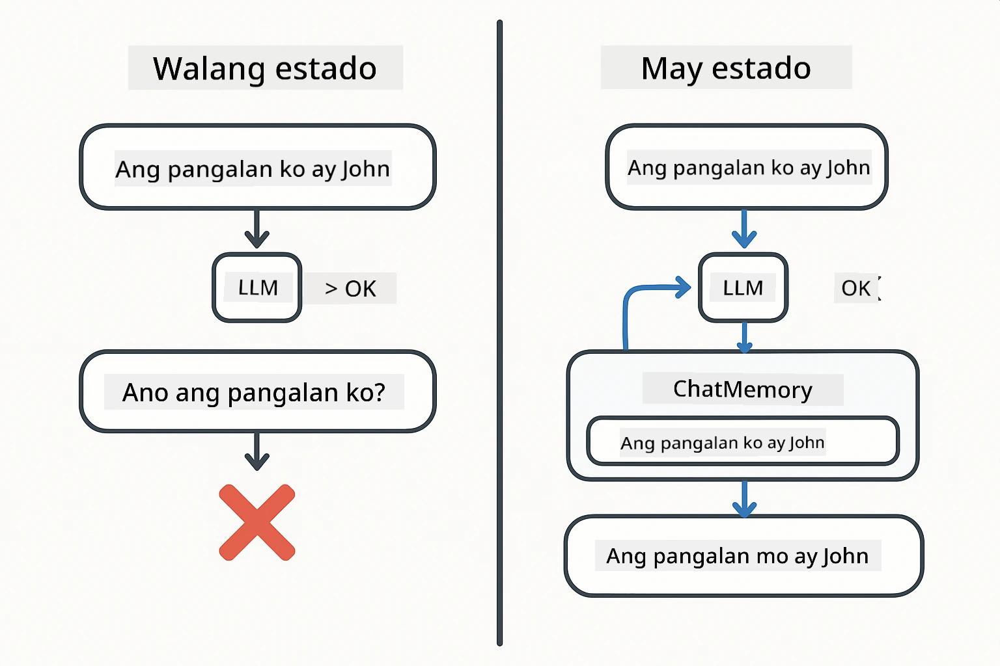
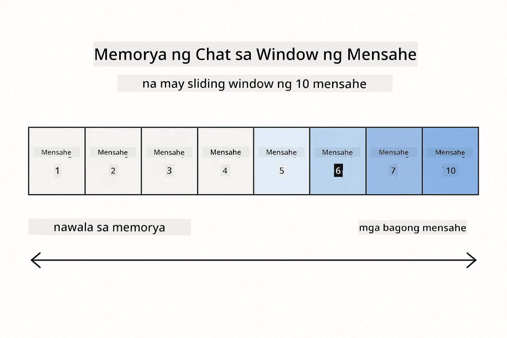
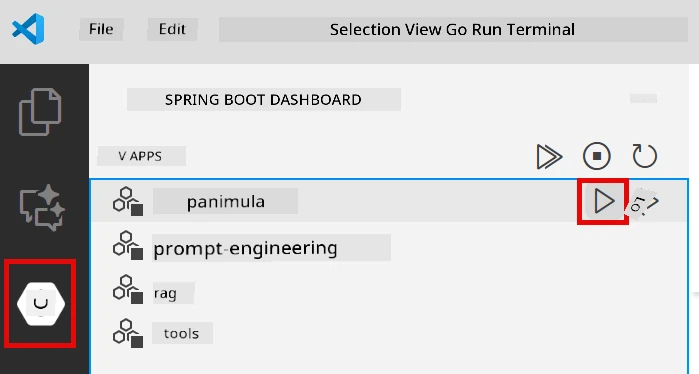
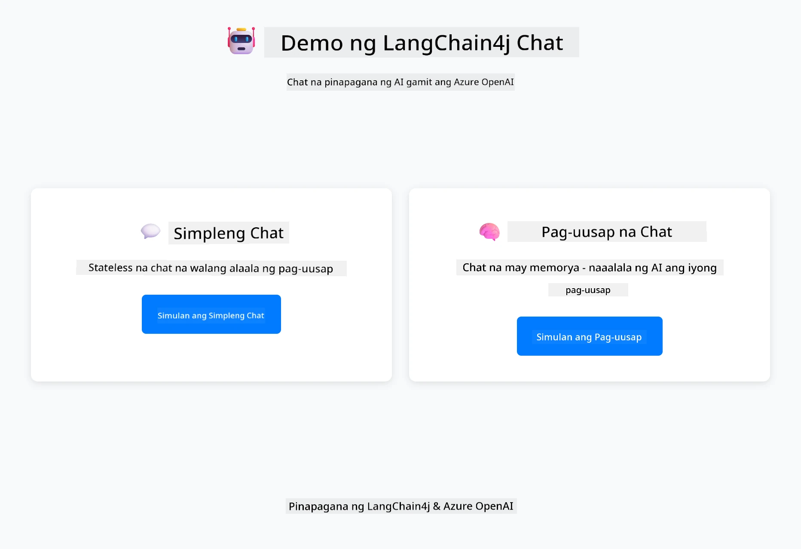
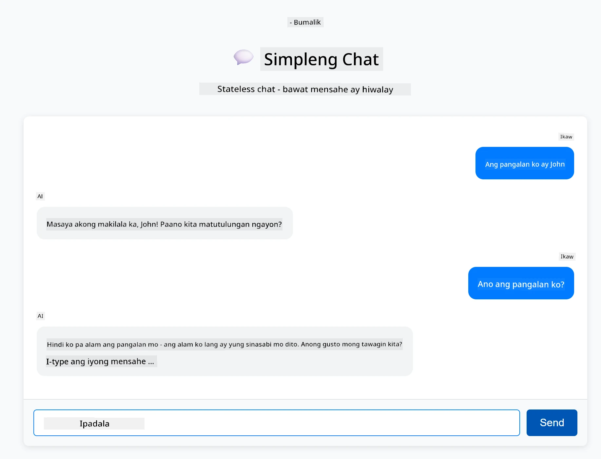
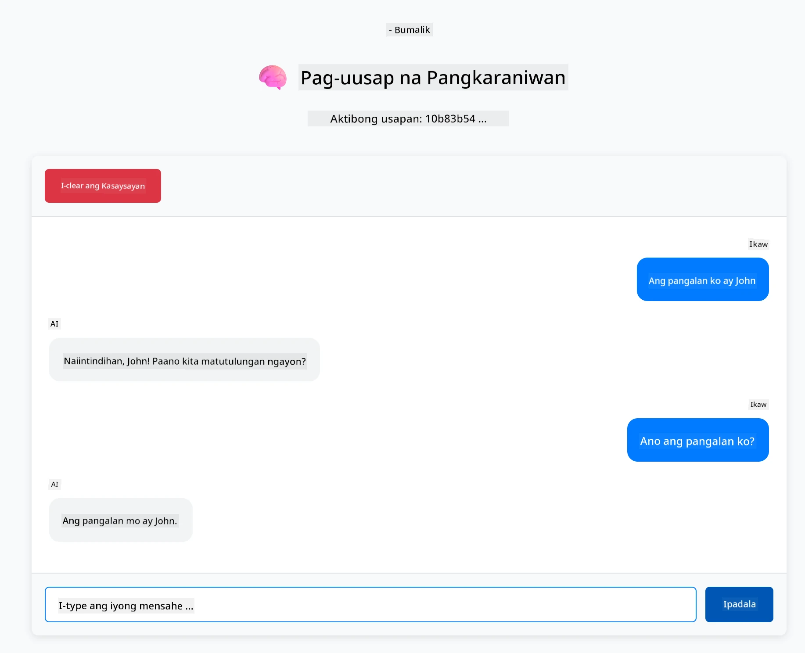

# Module 01: Pagsisimula sa LangChain4j

## Talaan ng Nilalaman

- [Video Walkthrough](#video-walkthrough)
- [Ano ang Matututunan Mo](#ano-ang-matututunan-mo)
- [Mga Kinakailangan](#mga-kinakailangan)
- [Pag-unawa sa Pangunahing Problema](#pag-unawa-sa-pangunahing-problema)
- [Pag-unawa sa mga Token](#pag-unawa-sa-mga-token)
- [Paano Gumagana ang Memorya](#paano-gumagana-ang-memorya)
- [Paano Ito Gumagamit ng LangChain4j](#paano-ito-gumagamit-ng-langchain4j)
- [I-deploy ang Azure OpenAI Infrastructure](#i-deploy-ang-azure-openai-infrastructure)
- [Patakbuhin ang Aplikasyon Nang Lokal](#patakbuhin-ang-aplikasyon-nang-lokal)
- [Paggamit ng Aplikasyon](#paggamit-ng-aplikasyon)
  - [Stateless Chat (Kaliwang Panel)](#stateless-chat-kaliwang-panel)
  - [Stateful Chat (Kanang Panel)](#stateful-chat-kanang-panel)
- [Mga Susunod na Hakbang](#mga-susunod-na-hakbang)

## Video Walkthrough

Panoorin ang live session na ito na nagpapaliwanag kung paano magsimula sa module na ito:

<a href="https://www.youtube.com/live/nl_troDm8rQ?si=6b85S8xGjWnT2fX9"></a>

## Ano ang Matututunan Mo

Ito ang iyong panimulang punto sa LangChain4j at Azure OpenAI. Magsisimula tayo sa mga pundasyon at sisimulang bumuo ng mga aplikasyon na pang-production. Nakatuon ang module na ito sa conversational AI na nakakaalala ng konteksto at nagpapanatili ng estado — ang mga pundamental na konsepto na pinagbatayan ng bawat susunod na module.

Gagamitin natin ang Azure OpenAI's GPT-5.2 sa buong gabay na ito dahil sa mga advanced na kakayahan nito sa pangangatwiran na nagpapalinaw sa pag-uugali ng iba't ibang mga pattern. Kapag inadd mo ang memorya, makikita mo nang malinaw ang pagkakaiba. Mas pinadadali nito ang pag-unawa kung ano ang dinadala ng bawat komponent sa iyong aplikasyon.

Bubuuin mo ang isang aplikasyon na nagpapakita ng dalawang pattern:

**Stateless Chat** - Ang bawat kahilingan ay independyente. Walang memorya ang modelo ng mga nakaraang mensahe. Ito ang pinakasimpleng panimulang punto.

**Stateful Conversation** - Kasama sa bawat kahilingan ang kasaysayan ng pag-uusap. Pinapanatili ng modelo ang konteksto sa maraming pag-uusap. Ito ang kinakailangan ng mga aplikasyon sa production.

## Mga Kinakailangan

- Subscription sa Azure na may access sa Azure OpenAI
- Java 21, Maven 3.9+
- Azure CLI (https://learn.microsoft.com/en-us/cli/azure/install-azure-cli)
- Azure Developer CLI (azd) (https://learn.microsoft.com/en-us/azure/developer/azure-developer-cli/install-azd)

> **Note:** Nakainstall na ang Java, Maven, Azure CLI at Azure Developer CLI (azd) sa ibinigay na devcontainer.

> **Note:** Ginagamit ng module na ito ang GPT-5.2 sa Azure OpenAI. Ang deployment ay awtomatikong nakasetup gamit ang `azd up` - huwag baguhin ang pangalan ng modelo sa code.

## Pag-unawa sa Pangunahing Problema

Ang mga language model ay stateless. Ang bawat tawag sa API ay independyente. Kung ipapadala mo ang "My name is John" at pagkatapos ay itanong "What’s my name?", wala itong ideya na ipinakilala mo lang ang iyong sarili. Tinatrato nito ang bawat kahilingan na parang iyon ang unang pag-uusap mo kailanman.

Ayos ito para sa simpleng Q&A ngunit hindi kapaki-pakinabang para sa mga totoong aplikasyon. Kailangang tandaan ng mga customer service bot ang sinabi mo sa kanila. Kailangang may konteksto ang mga personal assistant. Anumang multi-turn na pag-uusap ay nangangailangan ng memorya.

Ipinapakita ng sumusunod na diagram ang pagkakaiba ng dalawang paraan — sa kaliwa, isang stateless call na nakakalimot ng pangalan mo; sa kanan, isang stateful call na sinuportahan ng ChatMemory na natatandaan ito.



*Ang pagkakaiba sa pagitan ng stateless (mga independyenteng tawag) at stateful (may kamalayang konteksto) na mga pag-uusap*

## Pag-unawa sa mga Token

Bago pumasok sa mga pag-uusap, mahalagang maintindihan ang mga token - mga pangunahing yunit ng teksto na pinoproseso ng mga language model:


*Halimbawa kung paano hahatiin ang teksto sa mga token - "I love AI!" ay nagiging 4 na hiwalay na yunit ng proseso*

Ang mga token ay sukatan ng AI models sa pagsukat at pagproseso ng teksto. Mga salita, bantas, at maging mga spaces ay maaaring mga token. May limitasyon ang iyong modelo sa bilang ng token na kayang iproseso ng sabay (400,000 para sa GPT-5.2, na may hanggang 272,000 input tokens at 128,000 output tokens). Nakakatulong ang pag-unawa sa mga token upang mas maayos mong mapamahalaan ang haba ng pag-uusap at gastos.

## Paano Gumagana ang Memorya

Nilulutas ng chat memory ang problema ng pagiging stateless sa pamamagitan ng pagpapanatili ng kasaysayan ng pag-uusap. Bago ipadala ang iyong kahilingan sa modelo, pinapalimbag ng framework ang mga kaugnay na mga naunang mensahe. Kapag tinanong mo "What’s my name?", ipinapadala ng sistema ang buong kasaysayan ng pag-uusap, kaya nakikita ng modelo na sinasabi mo kanina "My name is John."

Nagbibigay ang LangChain4j ng mga memory implementation na awtomatikong humahawak nito. Pinipili mo kung ilan ang mga mensaheng itatago at ang framework ang nagmanage ng context window. Ipinapakita ng diagram sa ibaba kung paano nagpapanatili ang MessageWindowChatMemory ng sliding window ng mga pinakabagong mensahe.



*Pinapanatili ng MessageWindowChatMemory ang sliding window ng mga pinakabagong mensahe, awtomatikong tinatanggal ang mga lumang mensahe*

## Paano Ito Gumagamit ng LangChain4j

Pinagsasama ng module na ito ang Spring Boot at nagdaragdag ng conversation memory. Ganito ang pagkakapuwesto ng mga bahagi:

**Mga Dependensya** - Magdagdag ng dalawang LangChain4j libraries:

```xml
<dependency>
    <groupId>dev.langchain4j</groupId>
    <artifactId>langchain4j</artifactId> <!-- Inherited from BOM in root pom.xml -->
</dependency>
<dependency>
    <groupId>dev.langchain4j</groupId>
    <artifactId>langchain4j-open-ai-official</artifactId> <!-- Inherited from BOM in root pom.xml -->
</dependency>
```

**Chat Model** - I-configure ang Azure OpenAI bilang Spring bean ([LangChainConfig.java](../../../01-introduction/src/main/java/com/example/langchain4j/config/LangChainConfig.java)):

```java
@Bean
public OpenAiOfficialChatModel openAiOfficialChatModel() {
    return OpenAiOfficialChatModel.builder()
            .baseUrl(azureEndpoint)
            .apiKey(azureApiKey)
            .modelName(deploymentName)
            .timeout(Duration.ofMinutes(5))
            .maxRetries(3)
            .build();
}
```

Binabasa ng builder ang mga kredensyal mula sa environment variables na itinakda ng `azd up`. Ang pagseset ng `baseUrl` sa iyong Azure endpoint ay nagpapagana sa OpenAI client para gumana sa Azure OpenAI.

**Conversation Memory** - Subaybayan ang kasaysayan ng chat gamit ang MessageWindowChatMemory ([ConversationService.java](../../../01-introduction/src/main/java/com/example/langchain4j/service/ConversationService.java)):

```java
ChatMemory memory = MessageWindowChatMemory.withMaxMessages(10);

memory.add(UserMessage.from("My name is John"));
memory.add(AiMessage.from("Nice to meet you, John!"));

memory.add(UserMessage.from("What's my name?"));
AiMessage aiMessage = chatModel.chat(memory.messages()).aiMessage();
memory.add(aiMessage);
```

Gumawa ng memorya gamit ang `withMaxMessages(10)` para panatilihin ang huling 10 mensahe. Magdagdag ng mga mensahe ng user at AI gamit ang mga typed wrappers: `UserMessage.from(text)` at `AiMessage.from(text)`. Kunin ang kasaysayan gamit ang `memory.messages()` at ipadala ito sa modelo. Nag-iimbak ang serbisyo ng magkakahiwalay na mga memory instance sa bawat conversation ID, na nagpapahintulot sa maraming gumagamit na makipag-chat nang sabay-sabay.

> **🤖 Subukan gamit ang [GitHub Copilot](https://github.com/features/copilot) Chat:** Buksan ang [`ConversationService.java`](../../../01-introduction/src/main/java/com/example/langchain4j/service/ConversationService.java) at itanong:
> - "Paano pinipili ng MessageWindowChatMemory kung alin sa mga mensahe ang tatanggalin kapag puno na ang window?"
> - "Puwede ko bang ipatupad ang custom memory storage gamit ang database sa halip na in-memory?"
> - "Paano ko idadagdag ang summarization para kumonpres ang lumang kasaysayan ng pag-uusap?"

Ang stateless chat endpoint ay hindi gumagamit ng memorya — simpleng `chatModel.chat(prompt)` tulad ng quick start. Ang stateful endpoint naman ay nagdadagdag ng mga mensahe sa memorya, kinukuha ang kasaysayan, at isinasama ang kontekstong iyon sa bawat kahilingan. Parehong configuration ng modelo, magkaibang mga pattern.

## I-deploy ang Azure OpenAI Infrastructure

**Bash:**
```bash
cd 01-introduction
azd up  # Piliin ang subscription at lokasyon (inirerekomenda ang eastus2)
```

**PowerShell:**
```powershell
cd 01-introduction
azd up  # Piliin ang subscription at lokasyon (inirerekomenda ang eastus2)
```

> **Note:** Kung makaranas ka ng timeout error (`RequestConflict: Cannot modify resource ... provisioning state is not terminal`), patakbuhin lang muli ang `azd up`. Maaaring nagpapatuloy pa ang provisioning ng Azure resources sa background, at ang pagsubok muli ay nagpapahintulot sa deployment na matapos kapag naabot ng mga resources ang terminal state.

Ito ay:
1. Magde-deploy ng Azure OpenAI resource na may GPT-5.2 at text-embedding-3-small models
2. Awtomatikong gagawa ng `.env` file sa root ng proyekto na may kredensyal
3. Magse-set up ng lahat ng kinakailangang environment variables

**May problema sa deployment?** Tingnan ang [Infrastructure README](infra/README.md) para sa detalyadong troubleshooting tulad ng subdomain name conflicts, mga hakbang sa manual Azure Portal deployment, at mga gabay sa model configuration.

**Kumpirmahin ang tagumpay ng deployment:**

**Bash:**
```bash
cat ../.env  # Dapat ipakita ang AZURE_OPENAI_ENDPOINT, API_KEY, atbp.
```

**PowerShell:**
```powershell
Get-Content ..\.env  # Dapat ipakita ang AZURE_OPENAI_ENDPOINT, API_KEY, atbp.
```

> **Note:** Ang `azd up` command ay awtomatikong lumilikha ng `.env` file. Kung kailangan mo itong baguhin mamaya, maaari mo itong i-edit nang manu-mano o muling gawin ang pag-generate sa pamamagitan ng pagpapatakbo ng:
>
> **Bash:**
> ```bash
> cd ..
> bash .azd-env.sh
> ```
>
> **PowerShell:**
> ```powershell
> cd ..
> .\.azd-env.ps1
> ```

## Patakbuhin ang Aplikasyon Nang Lokal

**Kumpirmahin ang deployment:**

Siguraduhing naroroon ang `.env` file sa root directory na may Azure credentials. Patakbuhin ito mula sa directory ng module (`01-introduction/`):

**Bash:**
```bash
cat ../.env  # Dapat ipakita ang AZURE_OPENAI_ENDPOINT, API_KEY, DEPLOYMENT
```

**PowerShell:**
```powershell
Get-Content ..\.env  # Dapat ipakita ang AZURE_OPENAI_ENDPOINT, API_KEY, DEPLOYMENT
```

**Simulan ang mga aplikasyon:**

**Opsiyon 1: Gamit ang Spring Boot Dashboard (Inirerekomenda para sa mga gumagamit ng VS Code)**

Kasama sa dev container ang Spring Boot Dashboard extension, na nagbibigay ng visual interface para pamahalaan ang lahat ng Spring Boot applications. Makikita mo ito sa Activity Bar sa kaliwa ng VS Code (hanapin ang icon ng Spring Boot).

Mula sa Spring Boot Dashboard, maaari mong:
- Tingnan lahat ng Spring Boot applications sa workspace
- Simulan/hintuan ang mga aplikasyon gamit ang isang click lang
- Tingnan ang mga log ng aplikasyon nang real-time
- I-monitor ang status ng aplikasyon

Pindutin lang ang play button sa tabi ng "introduction" para simulan ang module na ito, o simulan ang lahat ng modules ng sabay-sabay.



*Ang Spring Boot Dashboard sa VS Code — simulan, hintuan, at i-monitor lahat ng modules mula sa isang lugar*

**Opsiyon 2: Gamit ang mga shell script**

Simulan ang lahat ng web applications (mga module 01-04):

**Bash:**
```bash
cd ..  # Mula sa root na direktoryo
./start-all.sh
```

**PowerShell:**
```powershell
cd ..  # Mula sa root directory
.\start-all.ps1
```

O simulan lamang ang module na ito:

**Bash:**
```bash
cd 01-introduction
./start.sh
```

**PowerShell:**
```powershell
cd 01-introduction
.\start.ps1
```

Awtomatikong niloload ng mga script ang environment variables mula sa root `.env` file at buuin ang mga JAR kung wala pa.

> **Note:** Kung nais mong manu-manong buuin lahat ng modules bago simulan:
>
> **Bash:**
> ```bash
> cd ..  # Go to root directory
> mvn clean package -DskipTests
> ```
>
> **PowerShell:**
> ```powershell
> cd ..  # Go to root directory
> mvn clean package -DskipTests
> ```

Buksan ang http://localhost:8080 sa iyong browser.

**Para itigil:**

**Bash:**
```bash
./stop.sh  # Ang modulong ito lamang
# O
cd .. && ./stop-all.sh  # Lahat ng mga module
```

**PowerShell:**
```powershell
.\stop.ps1  # Para sa module na ito lamang
# O
cd ..; .\stop-all.ps1  # Lahat ng mga module
```

## Paggamit ng Aplikasyon

Nagbibigay ang aplikasyon ng web interface na may dalawang chat implementations na magkakatabi.



*Dashboard na nagpapakita ng Simple Chat (stateless) at Conversational Chat (stateful) na mga opsyon*

### Stateless Chat (Kaliwang Panel)

Subukan ito muna. Itanong ang "My name is John" at pagkatapos ay agad itanong "What’s my name?" Hindi matatandaan ng modelo dahil ang bawat mensahe ay independyente. Ipinapakita nito ang pangunahing problema sa simpleng integrasyon ng language model — walang konteksto ng pag-uusap.



*Hindi natatandaan ng AI ang iyong pangalan mula sa naunang mensahe*

### Stateful Chat (Kanang Panel)

Ngayon subukan ang parehong hulihan dito. Itanong "My name is John" at pagkatapos ay "What’s my name?" Sa pagkakataong ito, natatandaan. Ang pinagkaiba ay ang MessageWindowChatMemory — pinapanatili nito ang kasaysayan ng pag-uusap at isinasama ito sa bawat kahilingan. Ganito gumagana ang production conversational AI.



*Natatandaan ng AI ang iyong pangalan mula sa naunang pag-uusap*

Parehong gumagamit ang dalawang panel ng GPT-5.2 model. Ang nag-iisang pagkakaiba ay ang memorya. Ito ang nagpapalinaw kung ano ang idinudulot ng memorya sa iyong aplikasyon at kung bakit ito mahalaga para sa mga totoong kaso ng paggamit.

## Mga Susunod na Hakbang

**Susunod na Module:** [02-prompt-engineering - Prompt Engineering with GPT-5.2](../02-prompt-engineering/README.md)

---

**Pag-navigate:** [← Babalik sa Pangunahing Pahina](../README.md) | [Susunod: Module 02 - Prompt Engineering →](../02-prompt-engineering/README.md)

---

<!-- CO-OP TRANSLATOR DISCLAIMER START -->
**Pagtatanggi**:
Ang dokumentong ito ay isinalin gamit ang serbisyo ng AI translation na [Co-op Translator](https://github.com/Azure/co-op-translator). Bagama't nagsusumikap kami para sa katumpakan, pakatandaan na ang awtomatikong pagsasalin ay maaaring maglaman ng mga pagkakamali o hindi pagkakatugma. Ang orihinal na dokumento sa orihinal nitong wika ang dapat ituring na pangunahing sanggunian. Para sa mahahalagang impormasyon, inirerekomenda ang propesyonal na pagsasalin ng tao. Hindi kami mananagot sa anumang maling pagkakaintindi o maling interpretasyon na nagmula sa paggamit ng pagsasaling ito.
<!-- CO-OP TRANSLATOR DISCLAIMER END -->