# Module 02: Prompt Engineering gamit ang GPT-5

## Table of Contents

- [Ano ang Matututuhan Mo](../../../02-prompt-engineering)
- [Mga Kinakailangan](../../../02-prompt-engineering)
- [Pag-unawa sa Prompt Engineering](../../../02-prompt-engineering)
- [Paano Ito Gumagamit ng LangChain4j](../../../02-prompt-engineering)
- [Ang Mga Pangunahing Pattern](../../../02-prompt-engineering)
- [Paggamit ng Umiiral na Azure Resources](../../../02-prompt-engineering)
- [Mga Screenshot ng Aplikasyon](../../../02-prompt-engineering)
- [Pagsusuri sa Mga Pattern](../../../02-prompt-engineering)
  - [Mababang vs Mataas na Kasigasigan](../../../02-prompt-engineering)
  - [Pagpapatupad ng Gawain (Tool Preambles)](../../../02-prompt-engineering)
  - [Self-Reflecting Code](../../../02-prompt-engineering)
  - [Structured Analysis](../../../02-prompt-engineering)
  - [Multi-Turn Chat](../../../02-prompt-engineering)
  - [Hakbang-hakbang na Pangangatwiran](../../../02-prompt-engineering)
  - [Limitadong Output](../../../02-prompt-engineering)
- [Ano Talagang Iyong Natututuhan](../../../02-prompt-engineering)
- [Mga Susunod na Hakbang](../../../02-prompt-engineering)

## Ano ang Matututuhan Mo

Sa nakaraang module, nakita mo kung paano pinapagana ng memorya ang conversational AI at ginamit ang GitHub Models para sa mga pangunahing interaksyon. Ngayon, magtutuon tayo sa kung paano ka magtatanong - ang mga prompt mismo - gamit ang Azure OpenAI's GPT-5. Ang paraan ng pag-istruktura ng iyong mga prompt ay malaki ang epekto sa kalidad ng mga sagot na matatanggap mo.

Gagamit tayo ng GPT-5 dahil ipinakikilala nito ang kontrol sa pangangatwiran - maaari mong sabihin sa modelo kung gaano karaming pag-iisip ang gagawin bago sumagot. Ginagawa nitong mas malinaw ang iba't ibang estratehiya sa pag-prompt at tinutulungan kang maunawaan kung kailan gagamitin ang bawat isa. Makikinabang din tayo mula sa mas kaunting rate limits ng Azure para sa GPT-5 kumpara sa GitHub Models.

## Mga Kinakailangan

- Natapos ang Module 01 (na-deploy ang Azure OpenAI resources)
- `.env` file sa root directory na may Azure credentials (nilikha ng `azd up` sa Module 01)

> **Tandaan:** Kung hindi mo pa natatapos ang Module 01, sundin muna ang mga tagubilin sa deployment doon.

## Pag-unawa sa Prompt Engineering

Ang prompt engineering ay tungkol sa pagdidisenyo ng input na teksto na palaging nagbibigay sa iyo ng mga resulta na kailangan mo. Hindi lang ito tungkol sa pagtatanong - ito ay tungkol sa pag-istruktura ng mga kahilingan upang maunawaan ng modelo nang eksakto kung ano ang gusto mo at kung paano ito ihahatid.

Isipin mo ito na parang pagbibigay ng mga tagubilin sa isang katrabaho. "Ayusin ang bug" ay malabo. "Ayusin ang null pointer exception sa UserService.java linya 45 sa pamamagitan ng pagdagdag ng null check" ay tiyak. Ganun din ang mga language model - mahalaga ang pagiging tiyak at istruktura.

## Paano Ito Gumagamit ng LangChain4j

Ipinapakita ng module na ito ang mga advanced na prompting pattern gamit ang parehong pundasyon ng LangChain4j mula sa mga naunang module, na nakatuon sa istruktura ng prompt at kontrol sa pangangatwiran.


*Paano ikinakabit ng LangChain4j ang iyong mga prompt sa Azure OpenAI GPT-5*

**Dependencies** - Ginagamit ng Module 02 ang mga sumusunod na langchain4j dependencies na tinukoy sa `pom.xml`:
```xml
<dependency>
    <groupId>dev.langchain4j</groupId>
    <artifactId>langchain4j</artifactId> <!-- Inherited from BOM in root pom.xml -->
</dependency>
<dependency>
    <groupId>dev.langchain4j</groupId>
    <artifactId>langchain4j-open-ai-official</artifactId> <!-- Inherited from BOM in root pom.xml -->
</dependency>
```

**OpenAiOfficialChatModel Configuration** - [LangChainConfig.java](../../../02-prompt-engineering/src/main/java/com/example/langchain4j/prompts/config/LangChainConfig.java)

Manu-manong kinokonpigura ang chat model bilang Spring bean gamit ang OpenAI Official client, na sumusuporta sa Azure OpenAI endpoints. Ang pangunahing pagkakaiba mula sa Module 01 ay kung paano natin iniistruktura ang mga prompt na ipinapadala sa `chatModel.chat()`, hindi ang setup ng modelo mismo.

**System at User Messages** - [Gpt5PromptService.java](../../../02-prompt-engineering/src/main/java/com/example/langchain4j/prompts/service/Gpt5PromptService.java)

Pinaghihiwalay ng LangChain4j ang mga uri ng mensahe para sa kalinawan. Ang `SystemMessage` ay nagtatakda ng pag-uugali at konteksto ng AI (tulad ng "Ikaw ay isang code reviewer"), habang ang `UserMessage` ay naglalaman ng aktwal na kahilingan. Pinapayagan ka ng paghihiwalay na ito na mapanatili ang pare-parehong pag-uugali ng AI sa iba't ibang user queries.

```java
SystemMessage systemMsg = SystemMessage.from(
    "You are a helpful Java programming expert."
);

UserMessage userMsg = UserMessage.from(
    "Explain what a List is in Java"
);

String response = chatModel.chat(systemMsg, userMsg);
```

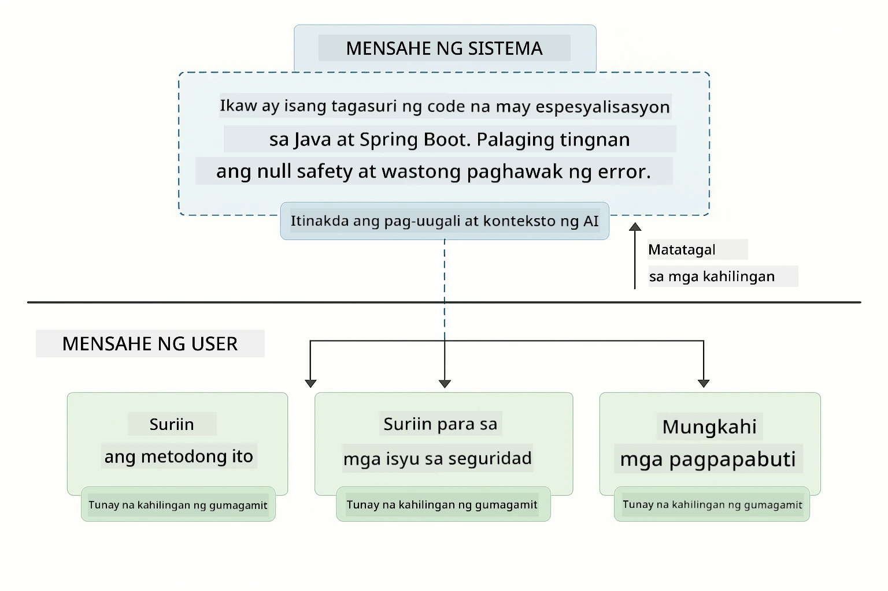

*Nagbibigay ang SystemMessage ng permanenteng konteksto habang ang UserMessages ay naglalaman ng mga indibidwal na kahilingan*

**MessageWindowChatMemory para sa Multi-Turn** - Para sa multi-turn conversation pattern, muling ginagamit natin ang `MessageWindowChatMemory` mula sa Module 01. Bawat session ay may sariling memory instance na naka-imbak sa isang `Map<String, ChatMemory>`, na nagpapahintulot ng maraming sabay-sabay na pag-uusap nang hindi nagkakahalo ang konteksto.

**Prompt Templates** - Ang tunay na pokus dito ay prompt engineering, hindi mga bagong LangChain4j API. Bawat pattern (mababang kasigasigan, mataas na kasigasigan, pagpapatupad ng gawain, atbp.) ay gumagamit ng parehong `chatModel.chat(prompt)` na pamamaraan ngunit may maingat na naistrukturang mga prompt string. Ang mga XML tag, mga tagubilin, at pag-format ay bahagi ng teksto ng prompt, hindi mga tampok ng LangChain4j.

**Kontrol sa Pangangatwiran** - Kinokontrol ang pagsisikap sa pangangatwiran ng GPT-5 sa pamamagitan ng mga tagubilin sa prompt tulad ng "maximum 2 reasoning steps" o "explore thoroughly". Ito ay mga teknik sa prompt engineering, hindi mga konfigurasyon ng LangChain4j. Ang library ay simpleng naghahatid ng iyong mga prompt sa modelo.

Ang mahalagang takeaway: Nagbibigay ang LangChain4j ng imprastraktura (koneksyon sa modelo sa pamamagitan ng [LangChainConfig.java](../../../02-prompt-engineering/src/main/java/com/example/langchain4j/prompts/config/LangChainConfig.java), memorya, paghawak ng mensahe sa pamamagitan ng [Gpt5PromptService.java](../../../02-prompt-engineering/src/main/java/com/example/langchain4j/prompts/service/Gpt5PromptService.java)), habang tinuturuan ka ng module na ito kung paano gumawa ng epektibong mga prompt sa loob ng imprastrakturang iyon.

## Ang Mga Pangunahing Pattern

Hindi lahat ng problema ay nangangailangan ng parehong pamamaraan. Ang ilang mga tanong ay nangangailangan ng mabilisang sagot, ang iba ay nangangailangan ng malalim na pag-iisip. Ang ilan ay nangangailangan ng nakikitang pangangatwiran, ang iba ay kailangan lang ng resulta. Saklaw ng module na ito ang walong prompting pattern - bawat isa ay na-optimize para sa iba't ibang mga sitwasyon. Susubukan mo silang lahat upang matutunan kung kailan pinakamahusay gamitin ang bawat isa.

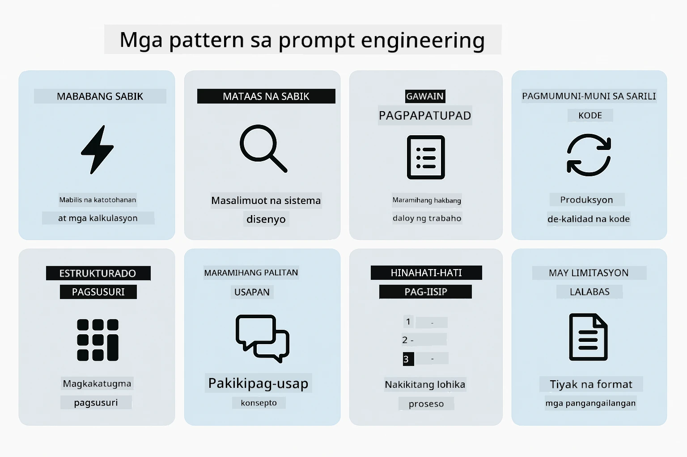

*Pangkalahatang-ideya ng walong prompt engineering pattern at ang kanilang mga gamit*

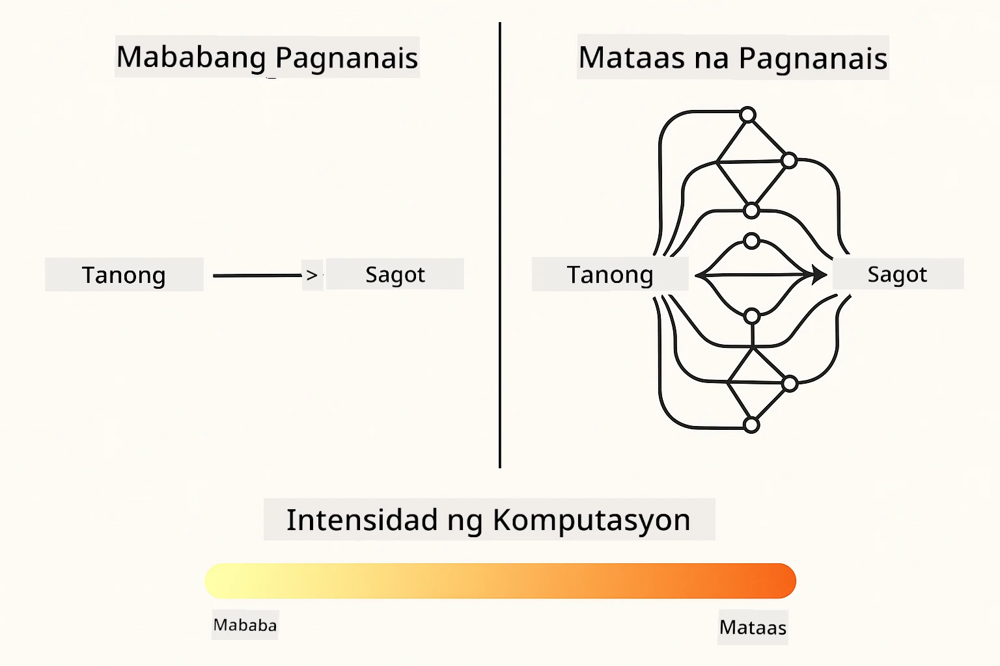

*Mababang kasigasigan (mabilis, diretso) vs Mataas na kasigasigan (masusing, eksploratoryo) na mga pamamaraan ng pangangatwiran*

**Mababang Kasigasigan (Mabilis at Nakatuon)** - Para sa mga simpleng tanong kung saan gusto mo ng mabilis at direktang sagot. Gumagawa ang modelo ng minimal na pangangatwiran - maximum na 2 hakbang. Gamitin ito para sa mga kalkulasyon, paghahanap, o mga tuwirang tanong.

```java
String prompt = """
    <reasoning_effort>low</reasoning_effort>
    <instruction>maximum 2 reasoning steps</instruction>
    
    What is 15% of 200?
    """;

String response = chatModel.chat(prompt);
```

> 💡 **Subukan gamit ang GitHub Copilot:** Buksan ang [`Gpt5PromptService.java`](../../../02-prompt-engineering/src/main/java/com/example/langchain4j/prompts/service/Gpt5PromptService.java) at itanong:
> - "Ano ang pagkakaiba ng mababang kasigasigan at mataas na kasigasigan na prompting pattern?"
> - "Paano nakakatulong ang mga XML tag sa mga prompt sa pag-istruktura ng sagot ng AI?"
> - "Kailan ko dapat gamitin ang self-reflection pattern kumpara sa direktang tagubilin?"

**Mataas na Kasigasigan (Malalim at Masusing)** - Para sa mga komplikadong problema kung saan gusto mo ng komprehensibong pagsusuri. Masusing ini-explore ng modelo at ipinapakita ang detalyadong pangangatwiran. Gamitin ito para sa disenyo ng sistema, mga desisyon sa arkitektura, o komplikadong pananaliksik.

```java
String prompt = """
    <reasoning_effort>high</reasoning_effort>
    <instruction>explore thoroughly, show detailed reasoning</instruction>
    
    Design a caching strategy for a high-traffic REST API.
    """;

String response = chatModel.chat(prompt);
```

**Pagpapatupad ng Gawain (Hakbang-hakbang na Progreso)** - Para sa mga multi-step na workflow. Nagbibigay ang modelo ng paunang plano, isinasalaysay ang bawat hakbang habang ginagawa, pagkatapos ay nagbibigay ng buod. Gamitin ito para sa mga migration, implementasyon, o anumang multi-step na proseso.

```java
String prompt = """
    <task>Create a REST endpoint for user registration</task>
    <preamble>Provide an upfront plan</preamble>
    <narration>Narrate each step as you work</narration>
    <summary>Summarize what was accomplished</summary>
    """;

String response = chatModel.chat(prompt);
```

Ang Chain-of-Thought prompting ay tahasang hinihiling sa modelo na ipakita ang proseso ng pangangatwiran nito, na nagpapabuti ng katumpakan para sa mga komplikadong gawain. Ang hakbang-hakbang na paghahati ay tumutulong sa parehong tao at AI na maunawaan ang lohika.

> **🤖 Subukan gamit ang [GitHub Copilot](https://github.com/features/copilot) Chat:** Itanong tungkol sa pattern na ito:
> - "Paano ko iaangkop ang task execution pattern para sa mga long-running na operasyon?"
> - "Ano ang mga pinakamahusay na kasanayan sa pag-istruktura ng tool preambles sa mga production application?"
> - "Paano ko mahuhuli at maipapakita ang mga intermediate progress update sa UI?"

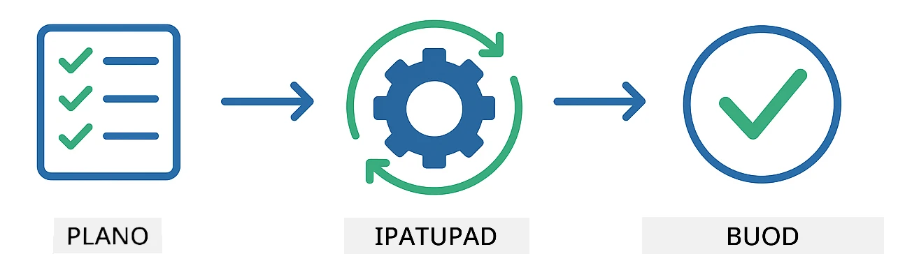

*Planuhin → Isagawa → Buodin na workflow para sa mga multi-step na gawain*

**Self-Reflecting Code** - Para sa pagbuo ng production-quality na code. Gumagawa ang modelo ng code, sinusuri ito laban sa mga pamantayan ng kalidad, at pinapabuti ito nang paulit-ulit. Gamitin ito kapag bumubuo ng mga bagong feature o serbisyo.

```java
String prompt = """
    <task>Create an email validation service</task>
    <quality_criteria>
    - Correct logic and error handling
    - Best practices (clean code, proper naming)
    - Performance optimization
    - Security considerations
    </quality_criteria>
    <instruction>Generate code, evaluate against criteria, improve iteratively</instruction>
    """;

String response = chatModel.chat(prompt);
```

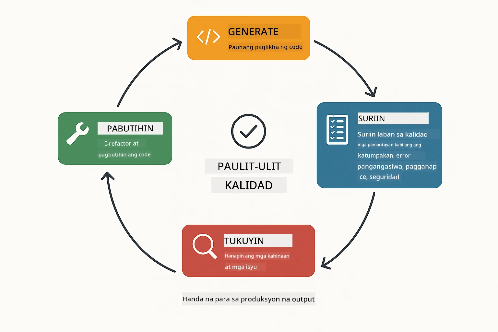

*Iteratibong loop ng pagpapabuti - gumawa, suriin, tukuyin ang mga isyu, pagbutihin, ulitin*

**Structured Analysis** - Para sa pare-parehong pagsusuri. Sinusuri ng modelo ang code gamit ang isang nakapirming framework (katumpakan, mga gawi, performance, seguridad). Gamitin ito para sa mga code review o pagsusuri ng kalidad.

```java
String prompt = """
    <code>
    public List getUsers() {
        return database.query("SELECT * FROM users");
    }
    </code>
    
    <framework>
    Evaluate using these categories:
    1. Correctness - Logic and functionality
    2. Best Practices - Code quality
    3. Performance - Efficiency concerns
    4. Security - Vulnerabilities
    </framework>
    """;

String response = chatModel.chat(prompt);
```

> **🤖 Subukan gamit ang [GitHub Copilot](https://github.com/features/copilot) Chat:** Itanong tungkol sa structured analysis:
> - "Paano ko maiaangkop ang analysis framework para sa iba't ibang uri ng code review?"
> - "Ano ang pinakamahusay na paraan para i-parse at i-aktuhan ang structured output programmatically?"
> - "Paano ko masisiguro ang pare-parehong severity levels sa iba't ibang review session?"

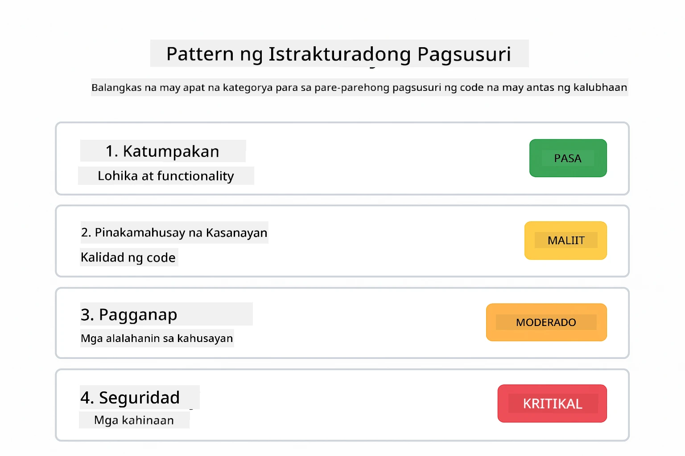

*Apat na kategorya na framework para sa pare-parehong code review na may severity levels*

**Multi-Turn Chat** - Para sa mga pag-uusap na nangangailangan ng konteksto. Naalala ng modelo ang mga naunang mensahe at pinapalawig ang mga ito. Gamitin ito para sa interactive help sessions o komplikadong Q&A.

```java
ChatMemory memory = MessageWindowChatMemory.withMaxMessages(10);

memory.add(UserMessage.from("What is Spring Boot?"));
AiMessage aiMessage1 = chatModel.chat(memory.messages()).aiMessage();
memory.add(aiMessage1);

memory.add(UserMessage.from("Show me an example"));
AiMessage aiMessage2 = chatModel.chat(memory.messages()).aiMessage();
memory.add(aiMessage2);
```

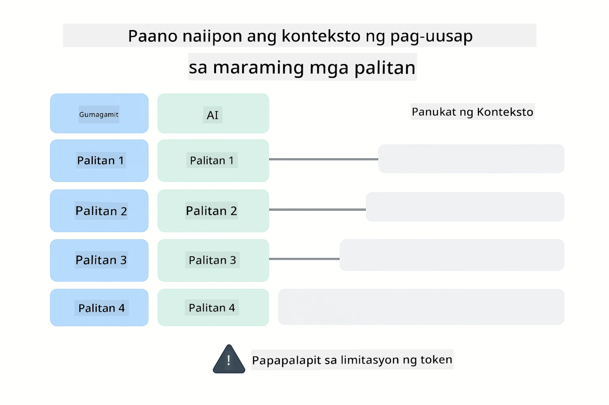

*Paano nag-iipon ang konteksto ng pag-uusap sa maraming turn hanggang maabot ang token limit*

**Hakbang-hakbang na Pangangatwiran** - Para sa mga problema na nangangailangan ng nakikitang lohika. Ipinapakita ng modelo ang tahasang pangangatwiran para sa bawat hakbang. Gamitin ito para sa mga math problem, logic puzzle, o kapag kailangan mong maunawaan ang proseso ng pag-iisip.

```java
String prompt = """
    <instruction>Show your reasoning step-by-step</instruction>
    
    If a train travels 120 km in 2 hours, then stops for 30 minutes,
    then travels another 90 km in 1.5 hours, what is the average speed
    for the entire journey including the stop?
    """;

String response = chatModel.chat(prompt);
```

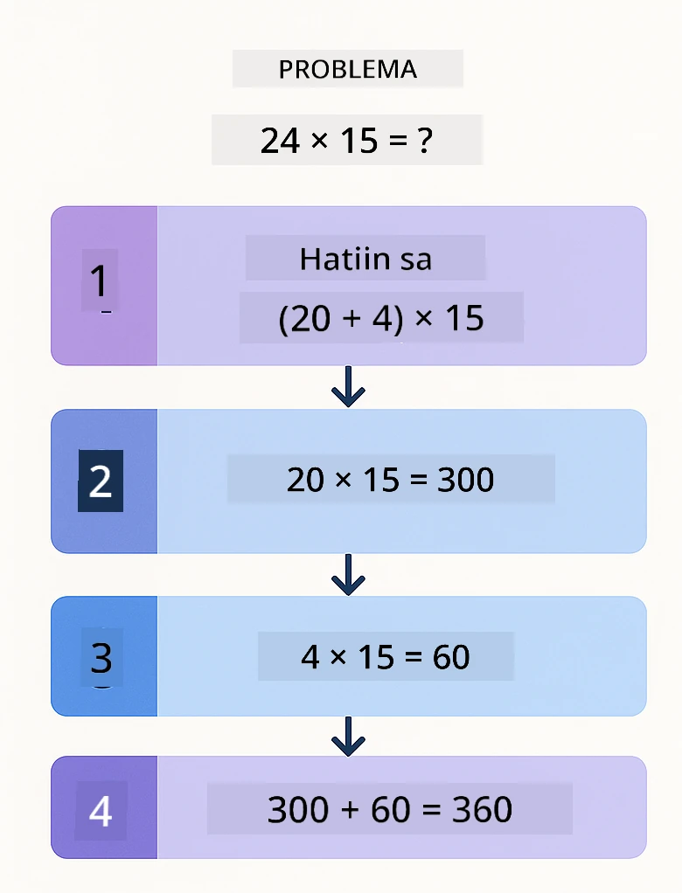

*Paghahati ng mga problema sa tahasang mga lohikal na hakbang*

**Limitadong Output** - Para sa mga sagot na may partikular na mga kinakailangan sa format. Mahigpit na sinusunod ng modelo ang mga patakaran sa format at haba. Gamitin ito para sa mga buod o kapag kailangan mo ng eksaktong istruktura ng output.

```java
String prompt = """
    <constraints>
    - Exactly 100 words
    - Bullet point format
    - Technical terms only
    </constraints>
    
    Summarize the key concepts of machine learning.
    """;

String response = chatModel.chat(prompt);
```

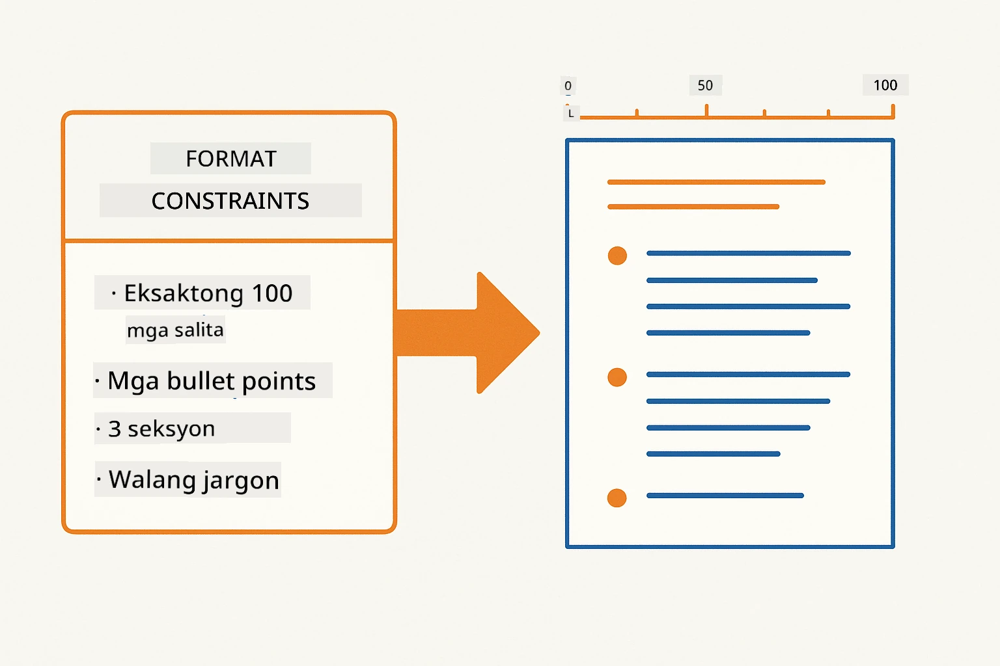

*Pagpapatupad ng partikular na format, haba, at mga kinakailangan sa istruktura*

## Paggamit ng Umiiral na Azure Resources

**Suriin ang deployment:**

Siguraduhing naroroon ang `.env` file sa root directory na may Azure credentials (nilikha noong Module 01):
```bash
cat ../.env  # Dapat ipakita ang AZURE_OPENAI_ENDPOINT, API_KEY, DEPLOYMENT
```

**Simulan ang aplikasyon:**

> **Tandaan:** Kung sinimulan mo na ang lahat ng aplikasyon gamit ang `./start-all.sh` mula sa Module 01, tumatakbo na ang module na ito sa port 8083. Maaari mong laktawan ang mga start command sa ibaba at direktang pumunta sa http://localhost:8083.

**Opsyon 1: Paggamit ng Spring Boot Dashboard (Inirerekomenda para sa mga gumagamit ng VS Code)**

Kasama sa dev container ang Spring Boot Dashboard extension, na nagbibigay ng visual na interface para pamahalaan ang lahat ng Spring Boot application. Makikita mo ito sa Activity Bar sa kaliwang bahagi ng VS Code (hanapin ang Spring Boot icon).

Mula sa Spring Boot Dashboard, maaari mong:
- Tingnan ang lahat ng available na Spring Boot application sa workspace
- Simulan/hintuin ang mga aplikasyon sa isang click lang
- Tingnan ang mga log ng aplikasyon nang real-time
- Subaybayan ang status ng aplikasyon

I-click lang ang play button sa tabi ng "prompt-engineering" para simulan ang module na ito, o simulan lahat ng module nang sabay-sabay.

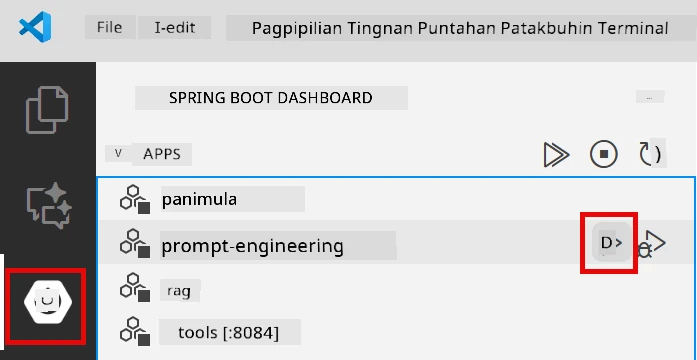

**Opsyon 2: Paggamit ng shell scripts**

Simulan ang lahat ng web application (modules 01-04):

**Bash:**
```bash
cd ..  # Mula sa root na direktoryo
./start-all.sh
```

**PowerShell:**
```powershell
cd ..  # Mula sa root na direktoryo
.\start-all.ps1
```

O simulan lang ang module na ito:

**Bash:**
```bash
cd 02-prompt-engineering
./start.sh
```

**PowerShell:**
```powershell
cd 02-prompt-engineering
.\start.ps1
```

Awtomatikong niloload ng parehong script ang mga environment variable mula sa root `.env` file at bubuuin ang mga JAR kung wala pa.

> **Tandaan:** Kung nais mong manu-manong buuin lahat ng module bago simulan:
>
> **Bash:**
> ```bash
> cd ..  # Go to root directory
> mvn clean package -DskipTests
> ```
>
> **PowerShell:**
> ```powershell
> cd ..  # Go to root directory
> mvn clean package -DskipTests
> ```

Buksan ang http://localhost:8083 sa iyong browser.

**Para itigil:**

**Bash:**
```bash
./stop.sh  # Para lamang sa module na ito
# O
cd .. && ./stop-all.sh  # Lahat ng mga module
```

**PowerShell:**
```powershell
.\stop.ps1  # Para lamang sa module na ito
# O
cd ..; .\stop-all.ps1  # Lahat ng mga module
```

## Mga Screenshot ng Aplikasyon

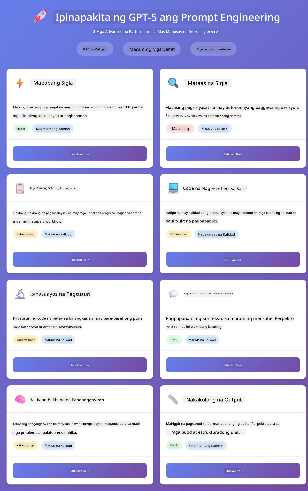

*Pangunahing dashboard na nagpapakita ng lahat ng 8 prompt engineering pattern kasama ang kanilang mga katangian at gamit*

## Pagsusuri sa Mga Pattern

Pinapayagan ka ng web interface na subukan ang iba't ibang mga estratehiya sa pag-prompt. Bawat pattern ay nagsosolusyon sa iba't ibang problema - subukan ang mga ito upang makita kung kailan pinakamahusay gamitin ang bawat isa.

### Mababang vs Mataas na Kasigasigan

Magtanong ng simpleng tanong tulad ng "Ano ang 15% ng 200?" gamit ang Mababang Kasigasigan. Makakakuha ka ng instant at direktang sagot. Ngayon magtanong ng isang komplikadong bagay tulad ng "Disenyo ng caching strategy para sa isang high-traffic API" gamit ang Mataas na Kasigasigan. Pansinin kung paano bumabagal ang modelo at nagbibigay ng detalyadong pangangatwiran. Parehong modelo, parehong istruktura ng tanong - ngunit sinasabi ng prompt kung gaano karaming pag-iisip ang gagawin.


*Mabilis na kalkulasyon na may minimal na pangangatwiran*

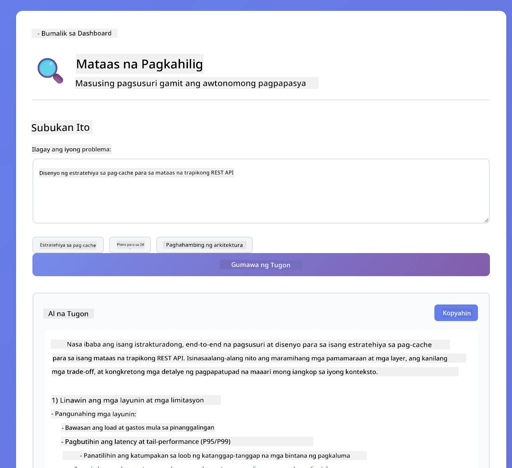

*Komprehensibong estratehiya sa caching (2.8MB)*

### Pagpapatupad ng Gawain (Mga Preambles ng Tool)

Nakikinabang ang mga multi-step na workflow mula sa maagang pagpaplano at pagsasalaysay ng progreso. Inilalahad ng modelo kung ano ang gagawin nito, isinasalaysay ang bawat hakbang, pagkatapos ay binubuod ang mga resulta.

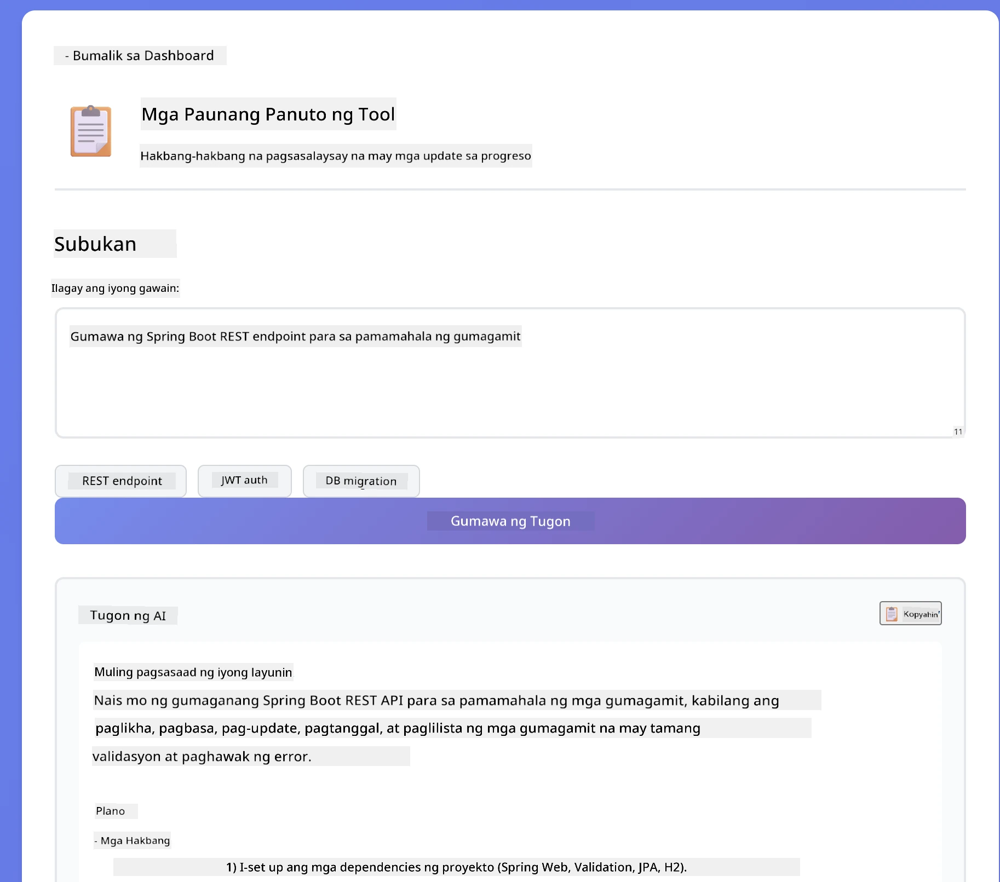

*Paglikha ng REST endpoint na may hakbang-hakbang na pagsasalaysay (3.9MB)*

### Sariling Pagsusuri ng Code

Subukan ang "Gumawa ng serbisyo para sa pag-validate ng email". Sa halip na basta gumawa ng code at huminto, ang modelo ay gumagawa, sinusuri laban sa mga pamantayan ng kalidad, tinutukoy ang mga kahinaan, at nagpapabuti. Makikita mo itong umulit hanggang ang code ay umabot sa pamantayan ng produksyon.

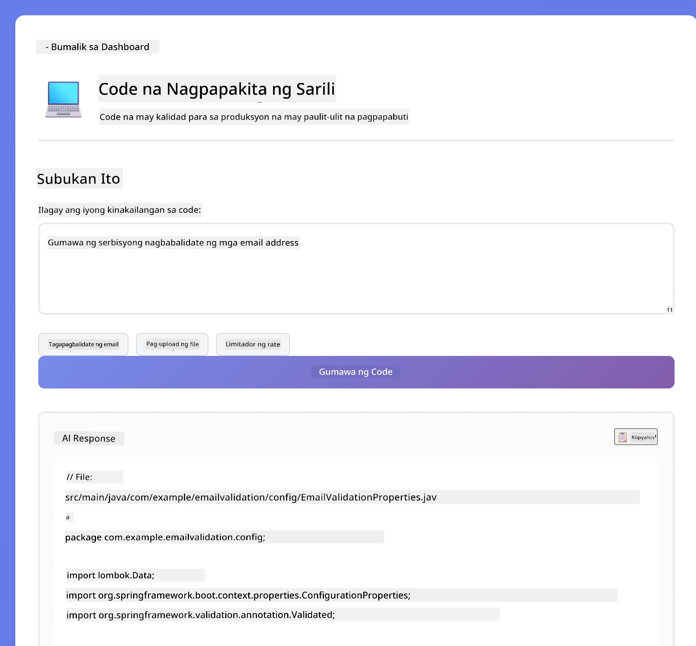

*Kompletong serbisyo sa pag-validate ng email (5.2MB)*

### Istrakturadong Pagsusuri

Kailangan ng mga pagsusuri ng code ng pare-parehong mga balangkas ng pagsusuri. Sinusuri ng modelo ang code gamit ang mga nakapirming kategorya (katumpakan, mga gawi, pagganap, seguridad) na may mga antas ng kaseryosohan.

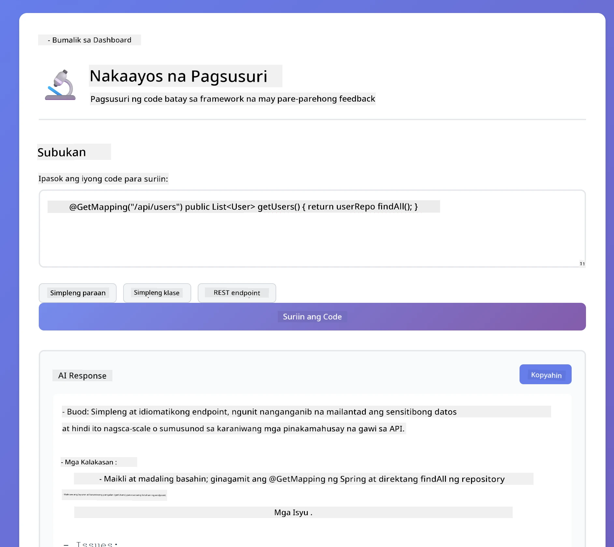

*Pagsusuri ng code batay sa balangkas*

### Multi-Turn Chat

Magtanong ng "Ano ang Spring Boot?" pagkatapos ay agad na sundan ng "Ipakita mo sa akin ang isang halimbawa". Naalala ng modelo ang iyong unang tanong at nagbibigay sa iyo ng isang partikular na halimbawa ng Spring Boot. Kung walang memorya, magiging masyadong malabo ang pangalawang tanong.

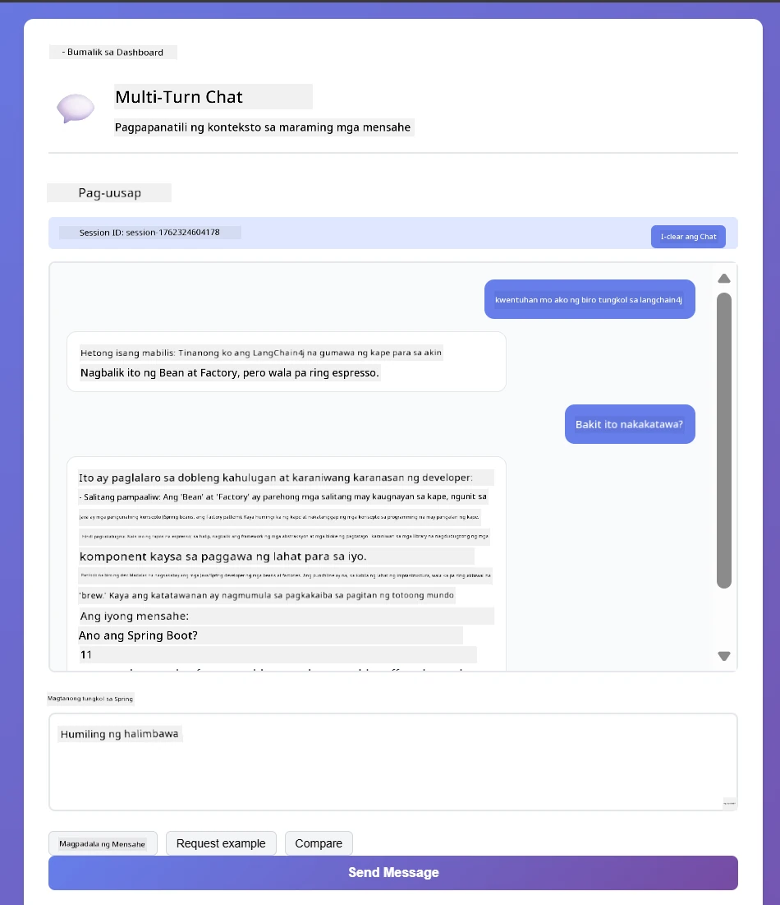

*Pagpapanatili ng konteksto sa mga tanong*

### Hakbang-hakbang na Pangangatwiran

Pumili ng isang problema sa matematika at subukan ito gamit ang parehong Hakbang-hakbang na Pangangatwiran at Mababang Kasigasigan. Ang mababang kasigasigan ay nagbibigay lang ng sagot - mabilis ngunit hindi malinaw. Ipinapakita ng hakbang-hakbang ang bawat kalkulasyon at desisyon.

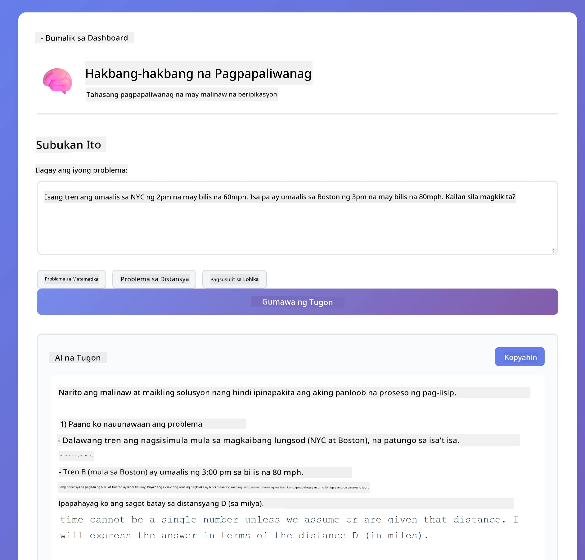

*Problema sa matematika na may malinaw na mga hakbang*

### Limitadong Output

Kapag kailangan mo ng mga tiyak na format o bilang ng salita, pinipilit ng pattern na ito ang mahigpit na pagsunod. Subukang gumawa ng buod na may eksaktong 100 salita sa format na bullet point.

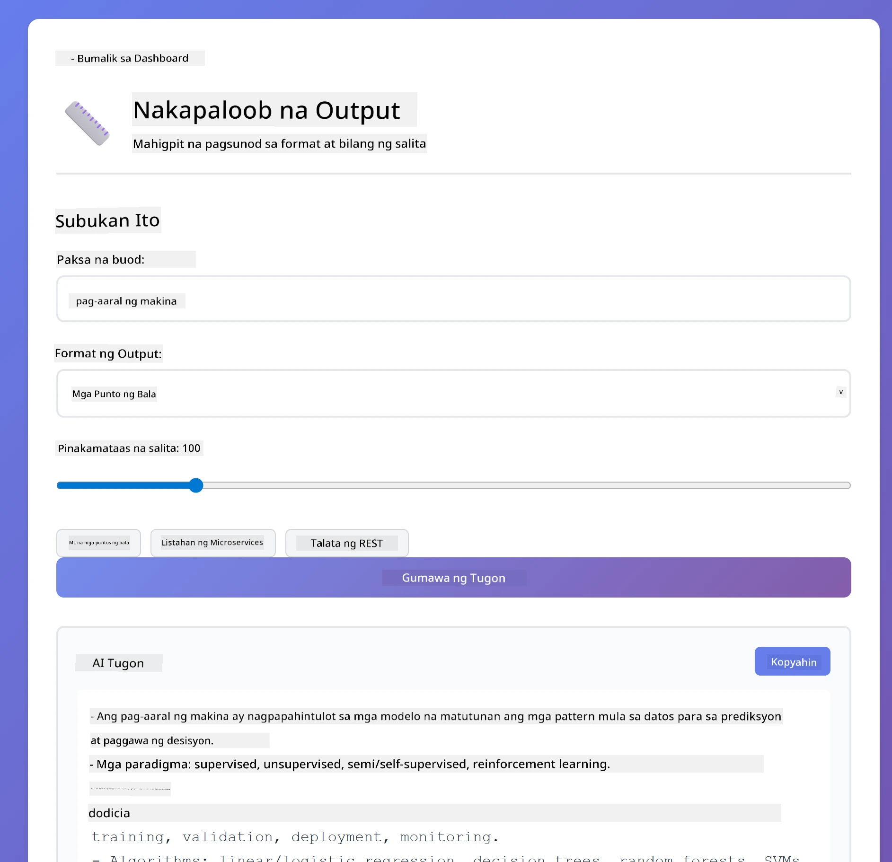

*Buod ng machine learning na may kontrol sa format*

## Ang Talagang Iyong Natututuhan

**Binabago ng Pagsisikap sa Pangangatwiran ang Lahat**

Pinapayagan ka ng GPT-5 na kontrolin ang pagsisikap sa komputasyon sa pamamagitan ng iyong mga prompt. Ang mababang pagsisikap ay nangangahulugan ng mabilis na mga tugon na may minimal na pagsisiyasat. Ang mataas na pagsisikap ay nangangahulugan na maglalaan ng oras ang modelo upang mag-isip nang malalim. Natututuhan mong iangkop ang pagsisikap sa kumplikasyon ng gawain - huwag sayangin ang oras sa mga simpleng tanong, ngunit huwag din magmadali sa mga kumplikadong desisyon.

**Gabay ng Istraktura ang Pag-uugali**

Napansin mo ba ang mga tag ng XML sa mga prompt? Hindi ito palamuti. Mas maaasahan ang pagsunod ng mga modelo sa mga istrakturadong tagubilin kaysa sa malayang teksto. Kapag kailangan mo ng mga multi-step na proseso o kumplikadong lohika, tinutulungan ng istraktura ang modelo na subaybayan kung nasaan ito at ano ang susunod.

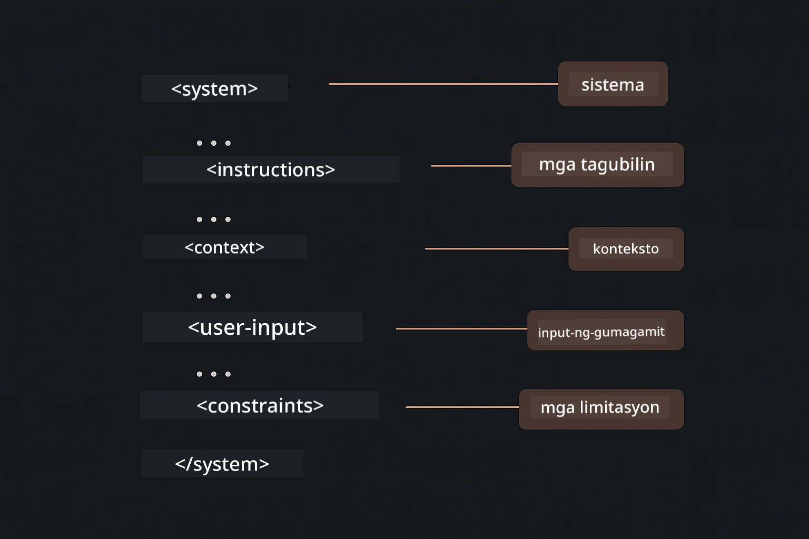

*Anatomiya ng isang maayos na istrakturadong prompt na may malinaw na mga seksyon at organisasyong estilo XML*

**Kalidad sa Pamamagitan ng Sariling Pagsusuri**

Gumagana ang mga pattern ng sariling pagsusuri sa pamamagitan ng pagpapahayag ng mga pamantayan ng kalidad. Sa halip na umasa na "tama ang gagawin" ng modelo, sinasabi mo sa kanya kung ano talaga ang ibig sabihin ng "tama": tamang lohika, paghawak ng error, pagganap, seguridad. Kaya nitong suriin ang sarili nitong output at magpabuti. Ginagawa nitong proseso ang pagbuo ng code mula sa isang suwerte.

**May Hangganan ang Konteksto**

Gumagana ang mga multi-turn na pag-uusap sa pamamagitan ng pagsasama ng kasaysayan ng mensahe sa bawat kahilingan. Ngunit may limitasyon - bawat modelo ay may maximum na bilang ng token. Habang lumalaki ang mga pag-uusap, kakailanganin mo ng mga estratehiya upang mapanatili ang kaugnay na konteksto nang hindi umaabot sa limitasyong iyon. Ipinapakita ng module na ito kung paano gumagana ang memorya; sa susunod ay matututuhan mo kung kailan magbubuod, kailan makakalimot, at kailan kukuha.

## Mga Susunod na Hakbang

**Susunod na Module:** [03-rag - RAG (Retrieval-Augmented Generation)](../03-rag/README.md)

---

**Pag-navigate:** [← Nakaraan: Module 01 - Panimula](../01-introduction/README.md) | [Bumalik sa Pangunahing Pahina](../README.md) | [Susunod: Module 03 - RAG →](../03-rag/README.md)

---

<!-- CO-OP TRANSLATOR DISCLAIMER START -->
**Paalala**:
Ang dokumentong ito ay isinalin gamit ang AI translation service na [Co-op Translator](https://github.com/Azure/co-op-translator). Bagamat nagsusumikap kami para sa katumpakan, pakatandaan na ang mga awtomatikong pagsasalin ay maaaring maglaman ng mga pagkakamali o di-tumpak na impormasyon. Ang orihinal na dokumento sa orihinal nitong wika ang dapat ituring na pangunahing sanggunian. Para sa mahahalagang impormasyon, inirerekomenda ang propesyonal na pagsasalin ng tao. Hindi kami mananagot sa anumang hindi pagkakaunawaan o maling interpretasyon na maaaring magmula sa paggamit ng pagsasaling ito.
<!-- CO-OP TRANSLATOR DISCLAIMER END -->