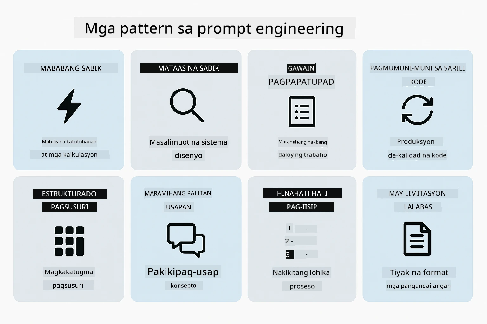
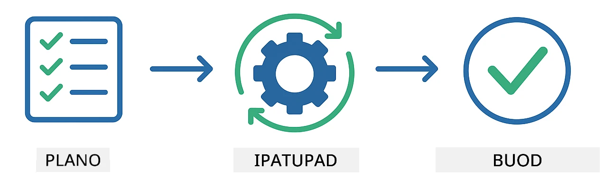
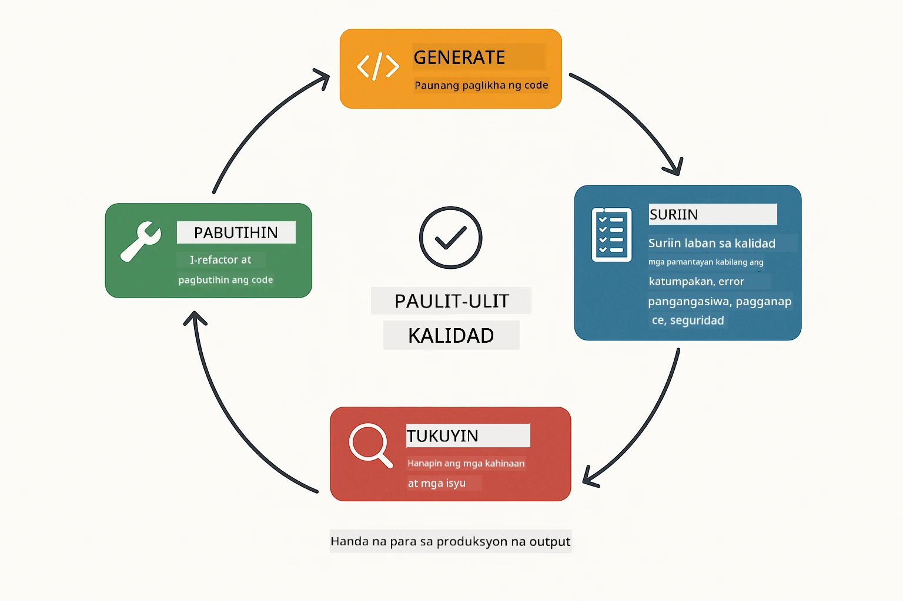
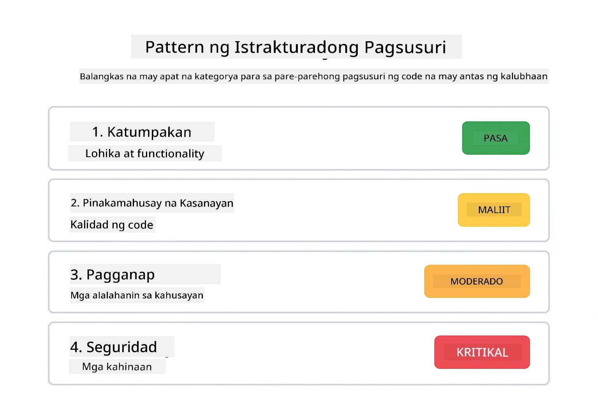
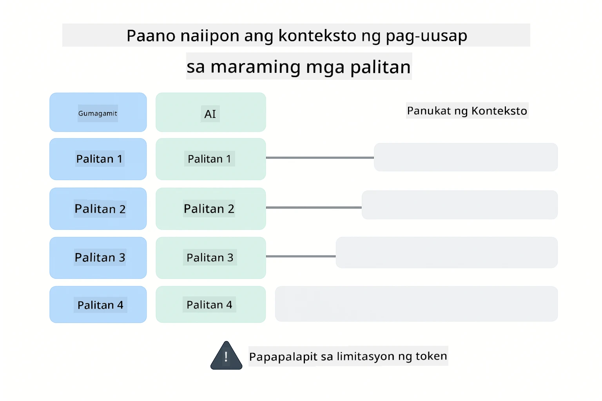
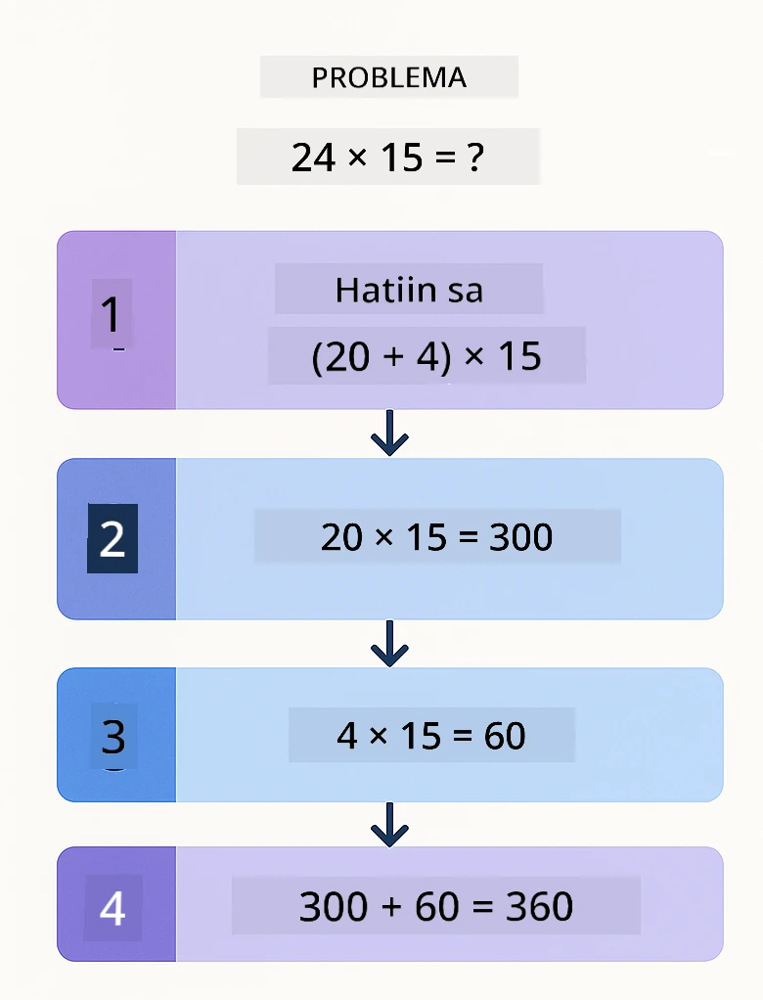
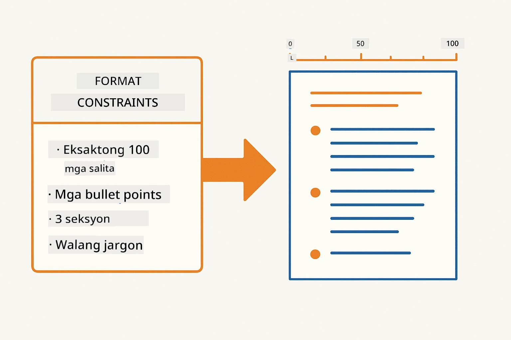
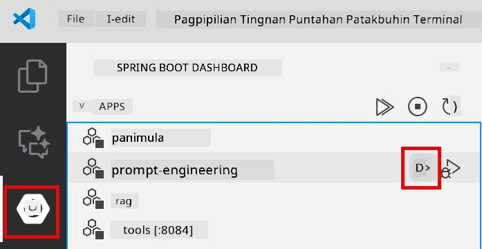
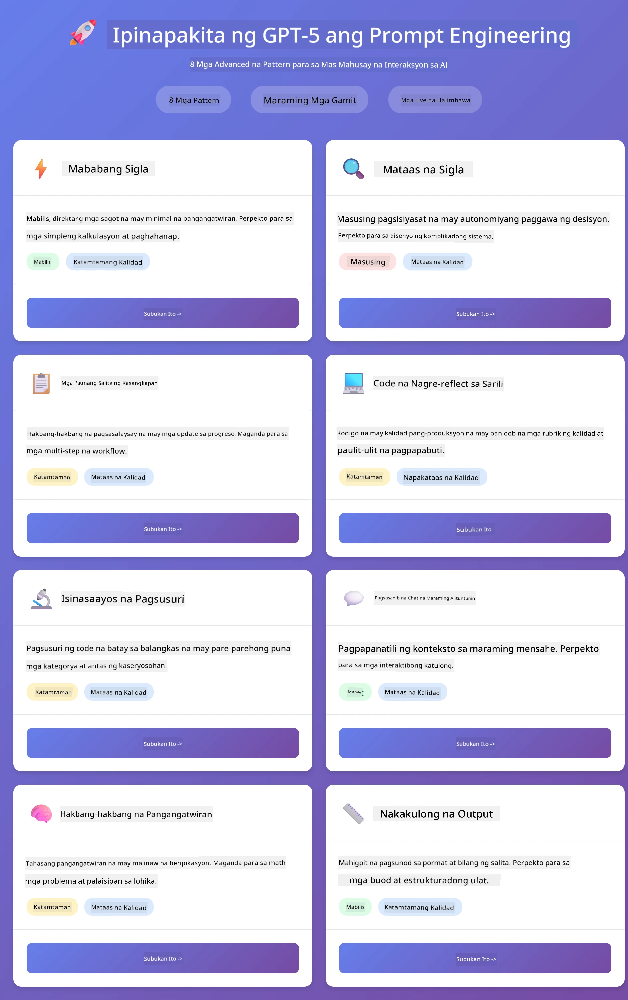
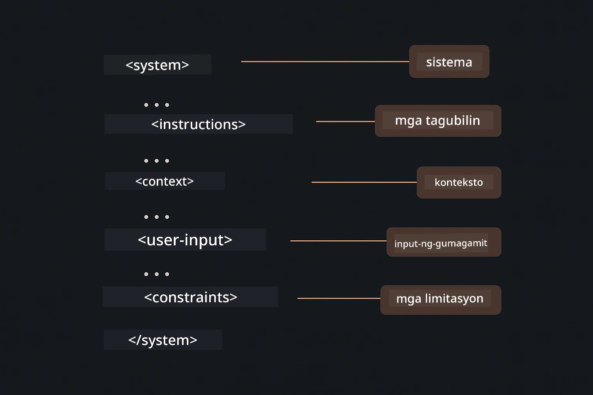

# Module 02: Prompt Engineering gamit ang GPT-5.2

## Talaan ng mga Nilalaman

- [Video Walkthrough](#video-walkthrough)
- [Ano ang Matututunan Mo](#ano-ang-matututunan-mo)
- [Mga Kinakailangan](#mga-kinakailangan)
- [Pag-unawa sa Prompt Engineering](#pag-unawa-sa-prompt-engineering)
- [Mga Pangunahing Kaalaman sa Prompt Engineering](#mga-pangunahing-kaalaman-sa-prompt-engineering)
  - [Zero-Shot Prompting](#zero-shot-prompting)
  - [Few-Shot Prompting](#few-shot-prompting)
  - [Chain of Thought](#chain-of-thought)
  - [Role-Based Prompting](#role-based-prompting)
  - [Prompt Templates](#prompt-templates)
- [Mga Advanced na Pattern](#mga-advanced-na-pattern)
- [Patakbuhin ang Aplikasyon](#patakbuhin-ang-aplikasyon)
- [Mga Screenshot ng Aplikasyon](#mga-screenshot-ng-aplikasyon)
- [Paggalugad sa mga Pattern](#pagsubok-sa-mga-pattern)
  - [Mababa vs Mataas na Pagsisikap](#mababang-vs-mataas-na-eagerness)
  - [Pagpapatupad ng Gawain (Mga Preambles ng Tool)](#pagpapaganap-ng-gawain-tool-preambles)
  - [Self-Reflecting Code](#self-reflecting-code)
  - [Structured Analysis](#structured-analysis)
  - [Multi-Turn Chat](#multi-turn-chat)
  - [Hakbang-hakbang na Pag-iisip](#hakbang-hakbang-na-pag-iisip)
  - [Limitadong Output](#limitadong-output)
- [Ang Tunay na Iyong Natutunan](#ano-ang-talagang-iyong-natututuhan)
- [Mga Susunod na Hakbang](#mga-susunod-na-hakbang)

## Video Walkthrough

Panoorin ang live session na ito na nagpapaliwanag kung paano magsimula gamit ang module na ito:

<a href="https://www.youtube.com/live/PJ6aBaE6bog?si=LDshyBrTRodP-wke"></a>

## Ano ang Matututunan Mo

Ang sumusunod na diagram ay nagbibigay ng pangkalahatang ideya ng mga pangunahing paksa at kasanayan na iyong i-de-develop sa module na ito — mula sa mga teknik ng pag-refine ng prompt hanggang sa hakbang-hakbang na workflow na susundan mo.


Sa nakaraang module, nakita mo kung paano nagbibigay ang memorya ng kakayahan sa conversational AI gamit ang Azure OpenAI. Ngayon tututok tayo sa kung paano ka magtatanong — ang mga prompt mismo — gamit ang GPT-5.2 ng Azure OpenAI. Ang paraan ng pagbuo ng iyong mga prompt ay malaki ang epekto sa kalidad ng mga sagot na makukuha mo. Magsisimula tayo sa pagsusuri ng mga pangunahing teknik ng prompting, pagkatapos ay lilipat sa walong advanced na pattern na ganap na umaabante sa kakayahan ng GPT-5.2.

Gagamit tayo ng GPT-5.2 dahil nagdadala ito ng kontrol sa pag-iisip - maaari mong sabihin sa modelo kung gaano karaming pag-iisip ang gagawin bago sumagot. Pinapalinaw nito ang iba't ibang stratihiya ng prompting at tinutulungan kang maunawaan kung kailan gagamitin ang bawat isa.

## Mga Kinakailangan

- Nakumpleto na ang Module 01 (naka-deploy na Azure OpenAI resources)
- `.env` file sa root directory na may Azure credentials (nilikha ng `azd up` sa Module 01)

> **Tandaan:** Kung hindi mo pa natatapos ang Module 01, sundan muna ang mga tagubilin sa deployment doon.

## Pag-unawa sa Prompt Engineering

Sa pinakapayak na kahulugan, ang prompt engineering ay ang pagkakaiba sa pagitan ng malabong mga tagubilin at tumpak na mga tagubilin, tulad ng ipinapakita ng paghahambing sa ibaba.


Ang prompt engineering ay tungkol sa pagdidisenyo ng input na teksto na palagian ay nakakuha sa iyo ng mga resulta na kailangan mo. Hindi lamang ito ang pagtatanong - ito ay ang pagbuo ng mga kahilingan upang maintindihan ng modelo nang eksakto kung ano ang gusto mo at paano ito ihahatid.

Isipin ito na parang nagbibigay ng instruksyon sa isang kasamahan. "Ayusin ang bug" ay malabo. "Ayusin ang null pointer exception sa UserService.java linya 45 sa pamamagitan ng pagdagdag ng null check" ay tiyak. Gumagana ang mga language model nang ganito — mahalaga ang espesipisidad at istruktura.

Ipinapakita ng diagram sa ibaba kung paano pumapasok ang LangChain4j sa larawan na ito — ikinakonekta ang iyong mga pattern ng prompt sa modelo sa pamamagitan ng mga SystemMessage at UserMessage na mga pang-construct.


Nagbibigay ang LangChain4j ng infrastraktura — koneksyon sa modelo, memorya, at mga uri ng mensahe — habang ang mga pattern ng prompt ay mga maingat na istrukturadong teksto na ipinapadala mo sa pamamagitan ng infrastraktura. Ang mga pangunahing sangkap ay `SystemMessage` (na nagtatakda ng ugali at papel ng AI) at `UserMessage` (na nagdadala ng iyong aktwal na kahilingan).

## Mga Pangunahing Kaalaman sa Prompt Engineering

Ang limang pangunahing teknik na ipinapakita sa ibaba ang pundasyon ng epektibong prompt engineering. Bawat isa ay tumutugon sa ibang aspeto kung paano ka makipag-usap sa mga language model.


Bago tayong tumuon sa mga advanced na pattern sa module na ito, repasuhin muna natin ang limang pundamental na teknik ng prompting. Ito ang mga pundasyon na dapat malaman ng bawat prompt engineer.

### Zero-Shot Prompting

Pinakasimpleng paraan: bigyan ang modelo ng direktang instruksyon nang walang halimbawa. Ang modelo ay umaasa nang buo sa kanyang training para maintindihan at isagawa ang gawain. Mabisa ito para sa mga simpleng utos kung saan halatang inaasahan ang kilos.


*Direktang instruksyon nang walang halimbawa — hinuhusgahan ng modelo ang gawain mula sa instruksyon lamang*

```java
String prompt = "Classify this sentiment: 'I absolutely loved the movie!'";
String response = model.chat(prompt);
// Tugon: "Positibo"
```

**Kailan gagamitin:** Simpleng klasipikasyon, direktang tanong, pagsasalin, o anumang gawain na kayang hawakan ng modelo nang walang dagdag na patnubay.

### Few-Shot Prompting

Magbigay ng mga halimbawa na nagpapakita ng pattern na gusto mong sundan ng modelo. Natutunan ng modelo ang inaasahang input-output na format mula sa mga halimbawa mo at inilalapat ito sa mga bagong inputs. Malaki ang pagbuti ng konsistensi para sa mga gawain na ang nais na format o asal ay hindi halata.


*Pagkatuto mula sa mga halimbawa — natutukoy ng modelo ang pattern at inilalapat ito sa mga bagong inputs*

```java
String prompt = """
    Classify the sentiment as positive, negative, or neutral.
    
    Examples:
    Text: "This product exceeded my expectations!" → Positive
    Text: "It's okay, nothing special." → Neutral
    Text: "Waste of money, very disappointed." → Negative
    
    Now classify this:
    Text: "Best purchase I've made all year!"
    """;
String response = model.chat(prompt);
```

**Kailan gagamitin:** Custom na klasipikasyon, tuloy-tuloy na pag-format, espesyalisadong gawain, o kapag hindi pare-pareho ang mga resulta ng zero-shot.

### Chain of Thought

Hilingin sa modelo na ipakita ang pag-iisip nito hakbang-hakbang. Sa halip na direktang sumagot, hinahati ng modelo ang problema at pinag-aaralan bawat bahagi nang malinaw. Pinapabuti nito ang katumpakan sa math, lohika, at multi-step na mga gawaing pang-pagkakataon.


*Hakbang-hakbang na pangangatwiran — hinahati ang kumplikadong problema sa malinaw na lohikal na hakbang*

```java
String prompt = """
    Problem: A store has 15 apples. They sell 8 apples and then 
    receive a shipment of 12 more apples. How many apples do they have now?
    
    Let's solve this step-by-step:
    """;
String response = model.chat(prompt);
// Ipinapakita ng modelo: 15 - 8 = 7, saka 7 + 12 = 19 na mansanas
```

**Kailan gagamitin:** Problema sa math, palaisipan sa lohika, debugging, o anumang gawain kung saan nakakatulong ang pagpapakita ng proseso ng pag-iisip para sa katumpakan at pagtitiwala.

### Role-Based Prompting

Magtakda ng persona o papel para sa AI bago itanong ang iyong tanong. Nagbibigay ito ng konteksto na humuhubog sa tono, lalim, at pokus ng sagot. Iba ang pananaw ng "software architect" kumpara sa "junior developer" o "security auditor".


*Pagtatakda ng konteksto at persona — ang parehong tanong ay may ibang sagot depende sa itinalagang papel*

```java
String prompt = """
    You are an experienced software architect reviewing code.
    Provide a brief code review for this function:
    
    def calculate_total(items):
        total = 0
        for item in items:
            total = total + item['price']
        return total
    """;
String response = model.chat(prompt);
```

**Kailan gagamitin:** Review ng code, pagtuturo, espesyalisadong pagsusuri, o kapag kailangan ng mga sagot na nakaayon sa isang partikular na antas ng kadalubhasaan o pananaw.

### Prompt Templates

Lumikha ng mga reusable na prompt na may mga placeholder na variable. Sa halip na sumulat ng bagong prompt sa bawat pagkakataon, tukuyin ang template isang beses lang at punan ang iba't ibang halaga. Pinapadali ito ng `PromptTemplate` na klase ng LangChain4j gamit ang `{{variable}}` na syntax.


*Reusable na mga prompt na may variable placeholders — isang template, maraming gamit*

```java
PromptTemplate template = PromptTemplate.from(
    "What's the best time to visit {{destination}} for {{activity}}?"
);

Prompt prompt = template.apply(Map.of(
    "destination", "Paris",
    "activity", "sightseeing"
));

String response = model.chat(prompt.text());
```

**Kailan gagamitin:** Paulit-ulit na mga tanong na may iba't ibang input, batch processing, pagbuo ng reusable na mga AI workflow, o anumang sitwasyon na pareho ang istruktura ng prompt pero nagbabago ang datos.

---

Ang limang punong teknik na ito ang nagbibigay sa iyo ng matibay na toolkit para sa karamihan ng mga gawain sa prompting. Ang natitirang bahagi ng module na ito ay bumubuo pa rito gamit ang **walong advanced na pattern** na gumagamit ng reasoning control, self-evaluation, at structured output na mga kakayahan ng GPT-5.2.

## Mga Advanced na Pattern

Pagkatapos masaklaw ang mga pundasyon, lumipat tayo sa walong advanced na pattern na nagpapasikat sa module na ito. Hindi lahat ng problema ay nangangailangan ng parehas na paraan. Ang ilang tanong ay nangangailangan ng mabilis na sagot, ang iba ay malalim na pag-iisip. Ang ilan ay nais ng nakikitang pag-iisip, ang iba ay ang resulta lamang ang kailangan. Bawat pattern sa ibaba ay na-optimize para sa ibang sitwasyon — at pinapalakas pa ng reasoning control ng GPT-5.2 ang mga pagkakaibang ito.



*Pangkalahatang ideya ng walong pattern ng prompt engineering at kanilang mga gamit*

Nagdadagdag ang GPT-5.2 ng isa pang dimensyon sa mga pattern na ito: *kontrol sa pag-iisip*. Ipinapakita ng slider sa ibaba kung paano mo maia-adjust ang pagsisikap ng pag-iisip ng modelo — mula sa mabilis, direktang mga sagot hanggang sa malalim at masusing pagsusuri.


*Pinahihintulutan ka ng reasoning control ng GPT-5.2 na tukuyin kung gaano karaming pag-iisip ang gagawin ng modelo — mula sa mabilis na direktang sagot hanggang sa malalim na pag-usisa*

**Mababang Pagsisikap (Mabilis at Pokus)** - Para sa simpleng mga tanong kung saan gusto mo ng mabilis, direktang sagot. Minimal na pag-iisip ang ginagawa ng modelo - maximum 2 hakbang. Gamitin ito para sa mga kalkulasyon, paghahanap, o simpleng tanong.

```java
String prompt = """
    <context_gathering>
    - Search depth: very low
    - Bias strongly towards providing a correct answer as quickly as possible
    - Usually, this means an absolute maximum of 2 reasoning steps
    - If you think you need more time, state what you know and what's uncertain
    </context_gathering>
    
    Problem: What is 15% of 200?
    
    Provide your answer:
    """;

String response = chatModel.chat(prompt);
```

> 💡 **Galugarin gamit ang GitHub Copilot:** Buksan ang [`Gpt5PromptService.java`](../../../02-prompt-engineering/src/main/java/com/example/langchain4j/prompts/service/Gpt5PromptService.java) at itanong:
> - "Ano ang pagkakaiba ng mababang pagsisikap sa mataas na pagsisikap na mga pattern ng prompting?"
> - "Paano nakakatulong ang mga XML tag sa mga prompt para istrukturahin ang sagot ng AI?"
> - "Kailan ko dapat gamitin ang mga self-reflection na pattern kumpara sa direktang instruksyon?"

**Mataas na Pagsisikap (Malalim at Masusing Pagsusuri)** - Para sa mga komplikadong problema kung saan gusto mo ng komprehensibong pagsusuri. Masusing sinusuri ng modelo at ipinapakita ang detalyadong pag-iisip. Gamitin ito para sa disenyo ng sistema, mga pagpapasya sa arkitektura, o komplikadong pananaliksik.

```java
String prompt = """
    Analyze this problem thoroughly and provide a comprehensive solution.
    Consider multiple approaches, trade-offs, and important details.
    Show your analysis and reasoning in your response.
    
    Problem: Design a caching strategy for a high-traffic REST API.
    """;

String response = chatModel.chat(prompt);
```

**Pagpapatupad ng Gawain (Hakbang-hakbang na Progreso)** - Para sa mga multi-step na workflow. Nagbibigay ang modelo ng planong panimula, nagsasalaysay ng bawat hakbang habang ginagawa, pagkatapos ay nagbibigay ng buod. Gamitin ito para sa mga migration, implementasyon, o anumang multi-step na proseso.

```java
String prompt = """
    <task_execution>
    1. First, briefly restate the user's goal in a friendly way
    
    2. Create a step-by-step plan:
       - List all steps needed
       - Identify potential challenges
       - Outline success criteria
    
    3. Execute each step:
       - Narrate what you're doing
       - Show progress clearly
       - Handle any issues that arise
    
    4. Summarize:
       - What was completed
       - Any important notes
       - Next steps if applicable
    </task_execution>
    
    <tool_preambles>
    - Always begin by rephrasing the user's goal clearly
    - Outline your plan before executing
    - Narrate each step as you go
    - Finish with a distinct summary
    </tool_preambles>
    
    Task: Create a REST endpoint for user registration
    
    Begin execution:
    """;

String response = chatModel.chat(prompt);
```

Ang Chain-of-Thought prompting ay tahasang hinihiling sa modelo na ipakita ang proseso ng pag-iisip, na nagpapabuti sa katumpakan para sa mga kumplikadong gawain. Ang hakbang-hakbang na paghahati ay nakakatulong sa parehong tao at AI na maunawaan ang lohika.

> **🤖 Subukan gamit ang [GitHub Copilot](https://github.com/features/copilot) Chat:** Magtanong tungkol sa pattern na ito:
> - "Paano ko iaangkop ang task execution pattern para sa mga long-running operation?"
> - "Ano ang mga pinakamahusay na praktis sa pag-istruktura ng mga tool preamble sa production na mga aplikasyon?"
> - "Paano ko maisusulat at maipapakita ang mga intermediate na progreso sa isang UI?"

Ipinapakita ng diagram sa ibaba ang Plan → Execute → Summarize na workflow.



*Plan → Execute → Summarize na workflow para sa mga multi-step na gawain*

**Self-Reflecting Code** - Para sa pagbuo ng production-quality na code. Gumagawa ang modelo ng code na sumusunod sa mga production standard na may tamang error handling. Gamitin ito kapag nagtatayo ng mga bagong feature o serbisyo.

```java
String prompt = """
    Generate Java code with production-quality standards: Create an email validation service
    Keep it simple and include basic error handling.
    """;

String response = chatModel.chat(prompt);
```

Ipinapakita ng diagram sa ibaba ang loop ng iterative na pagpapabuti — gumawa, suriin, tuklasin ang kahinaan, at pagbutihin hanggang matugunan ng code ang mga pamantayang pang-produksyon.



*Loop ng paulit-ulit na pagpapabuti - gumawa, suriin, tuklasin ang isyu, pagbutihin, ulitin*

**Structured Analysis** - Para sa tuloy-tuloy na pagsusuri. Nirereview ng modelo ang code gamit ang isang nakaayos na balangkas (katumpakan, praktis, performance, seguridad, maintainability). Gamitin ito para sa mga review ng code o pagsusuri ng kalidad.

```java
String prompt = """
    <analysis_framework>
    You are an expert code reviewer. Analyze the code for:
    
    1. Correctness
       - Does it work as intended?
       - Are there logical errors?
    
    2. Best Practices
       - Follows language conventions?
       - Appropriate design patterns?
    
    3. Performance
       - Any inefficiencies?
       - Scalability concerns?
    
    4. Security
       - Potential vulnerabilities?
       - Input validation?
    
    5. Maintainability
       - Code clarity?
       - Documentation?
    
    <output_format>
    Provide your analysis in this structure:
    - Summary: One-sentence overall assessment
    - Strengths: 2-3 positive points
    - Issues: List any problems found with severity (High/Medium/Low)
    - Recommendations: Specific improvements
    </output_format>
    </analysis_framework>
    
    Code to analyze:
    ```
    public List getUsers() {
        return database.query("SELECT * FROM users");
    }
    ```
    Provide your structured analysis:
    """;

String response = chatModel.chat(prompt);
```

> **🤖 Subukan gamit ang [GitHub Copilot](https://github.com/features/copilot) Chat:** Magtanong tungkol sa structured analysis:
> - "Paano ko maia-customize ang analysis framework para sa iba't ibang uri ng code review?"
> - "Ano ang pinakamainam na paraan para i-parse at gamitin ang structured output programmatically?"
> - "Paano ko masisiguro ang konsistenteng severity levels sa iba't ibang sesyon ng review?"

Ipinapakita ng sumusunod na diagram kung paano inaayos ng structured framework ang isang review ng code sa pare-parehong mga kategorya na may mga severity level.



*Balangkas para sa konsistenteng review ng code na may severity levels*

**Multi-Turn Chat** - Para sa mga pag-uusap na nangangailangan ng konteksto. Naaalala ng modelo ang mga naunang mensahe at bumubuo mula doon. Gamitin ito para sa interactive na help session o komplikadong Q&A.

```java
ChatMemory memory = MessageWindowChatMemory.withMaxMessages(10);

memory.add(UserMessage.from("What is Spring Boot?"));
AiMessage aiMessage1 = chatModel.chat(memory.messages()).aiMessage();
memory.add(aiMessage1);

memory.add(UserMessage.from("Show me an example"));
AiMessage aiMessage2 = chatModel.chat(memory.messages()).aiMessage();
memory.add(aiMessage2);
```

Ipinapakita ng diagram sa ibaba kung paano nag-iipon ang konteksto ng pag-uusap sa bawat turn at kung paano ito nauugnay sa token limit ng modelo.



*Paano nag-iipon ang konteksto ng pag-uusap sa maraming turn hanggang maabot ang token limit*

**Hakbang-hakbang na Pag-iisip** - Para sa mga problema na nangangailangan ng nakikitang lohika. Ipinapakita ng modelo ang malinaw na pag-iisip para sa bawat hakbang. Gamitin ito para sa mga problema sa math, palaisipan sa lohika, o kapag kailangan mong maunawaan ang proseso ng pag-iisip.

```java
String prompt = """
    <instruction>Show your reasoning step-by-step</instruction>
    
    If a train travels 120 km in 2 hours, then stops for 30 minutes,
    then travels another 90 km in 1.5 hours, what is the average speed
    for the entire journey including the stop?
    """;

String response = chatModel.chat(prompt);
```

Ipinapakita ng diagram sa ibaba kung paano hinahati-hati ng modelo ang mga problema sa malinaw, naka-number na mga hakbang ng lohika.


*Paghahati-hati ng mga problema sa malinaw na mga lohikal na hakbang*

**Limitadong Output** - Para sa mga sagot na may partikular na format na kinakailangan. Mahigpit na sinusunod ng modelo ang mga patakaran sa format at haba. Gamitin ito para sa mga buod o kung kailangan mo ng tiyak na istruktura ng output.

```java
String prompt = """
    <constraints>
    - Exactly 100 words
    - Bullet point format
    - Technical terms only
    </constraints>
    
    Summarize the key concepts of machine learning.
    """;

String response = chatModel.chat(prompt);
```

Ang sumusunod na diyagram ay nagpapakita kung paano ginagabayan ng mga limitasyon ang modelo upang gumawa ng output na mahigpit na sumusunod sa iyong mga kinakailangan sa format at haba.



*Pagsunod sa mga partikular na format, haba, at mga kinakailangan sa istruktura*

## Patakbuhin ang Aplikasyon

**Suriin ang deployment:**

Tiyaking ang `.env` file ay nasa root directory kasama ang mga kredensyal ng Azure (na ginawa sa Module 01). Patakbuhin ito mula sa directory ng module (`02-prompt-engineering/`):

**Bash:**
```bash
cat ../.env  # Dapat ipakita ang AZURE_OPENAI_ENDPOINT, API_KEY, DEPLOYMENT
```

**PowerShell:**
```powershell
Get-Content ..\.env  # Dapat ipakita ang AZURE_OPENAI_ENDPOINT, API_KEY, DEPLOYMENT
```

**Simulan ang aplikasyon:**

> **Tandaan:** Kung sinimulan mo na ang lahat ng aplikasyon gamit ang `./start-all.sh` mula sa root directory (tulad ng ipinaliwanag sa Module 01), tumatakbo na ang module na ito sa port 8083. Maari mong laktawan ang mga start command sa ibaba at diretso kang pumunta sa http://localhost:8083.

**Opsyon 1: Paggamit ng Spring Boot Dashboard (Inirerekomenda para sa mga gumagamit ng VS Code)**

Kasama sa dev container ang Spring Boot Dashboard extension, na nagbibigay ng visual na interface para pamahalaan ang lahat ng Spring Boot applications. Makikita mo ito sa Activity Bar sa kaliwang bahagi ng VS Code (hanapin ang icon ng Spring Boot).

Mula sa Spring Boot Dashboard, maaari mong:
- Tingnan ang lahat ng available na Spring Boot applications sa workspace
- Simulan/hintuin ang mga aplikasyon sa isang click lang
- Tingnan ang application logs nang real-time
- Subaybayan ang status ng aplikasyon

I-click lang ang play button sa tabi ng "prompt-engineering" upang simulan ang module na ito, o simulan lahat ng module nang sabay-sabay.



*Ang Spring Boot Dashboard sa VS Code — simulan, hintuin, at subaybayan lahat ng module mula sa isang lugar*

**Opsyon 2: Paggamit ng shell scripts**

Simulan lahat ng web applications (modules 01-04):

**Bash:**
```bash
cd ..  # Mula sa direktoryo ng ugat
./start-all.sh
```

**PowerShell:**
```powershell
cd ..  # Mula sa root na direktoryo
.\start-all.ps1
```

O simulan lang ang module na ito:

**Bash:**
```bash
cd 02-prompt-engineering
./start.sh
```

**PowerShell:**
```powershell
cd 02-prompt-engineering
.\start.ps1
```

Awtomatikong niloload ng parehong script ang environment variables mula sa root `.env` file at bubuuin ang mga JAR kung wala pa ang mga ito.

> **Tandaan:** Kung gusto mong i-build lahat ng module nang mano-mano bago simulan:
>
> **Bash:**
> ```bash
> cd ..  # Go to root directory
> mvn clean package -DskipTests
> ```
>
> **PowerShell:**
> ```powershell
> cd ..  # Go to root directory
> mvn clean package -DskipTests
> ```

Buksan ang http://localhost:8083 sa iyong browser.

**Para hintuin:**

**Bash:**
```bash
./stop.sh  # Ang modulong ito lamang
# O
cd .. && ./stop-all.sh  # Lahat ng mga module
```

**PowerShell:**
```powershell
.\stop.ps1  # Para lamang sa module na ito
# O
cd ..; .\stop-all.ps1  # Lahat ng mga module
```

## Mga Screenshot ng Aplikasyon

Narito ang pangunahing interface ng prompt engineering module, kung saan maaari mong subukan ang lahat ng walong pattern nang sabay-sabay.



*Ang pangunahing dashboard na nagpapakita ng lahat ng 8 prompt engineering patterns kasama ang kanilang mga katangian at gamit*

## Pagsubok sa mga Pattern

Pinapayagan ka ng web interface na mag-eksperimento sa iba't ibang prompting strategies. Bawat pattern ay nagsosolusyon ng iba't ibang problema - subukan ang mga ito upang makita kung kailan pinakamabisa ang bawat pamamaraan.

> **Tandaan: Streaming vs Non-Streaming** — Bawat pahina ng pattern ay may dalawang button: **🔴 Stream Response (Live)** at isang **Non-streaming** na opsyon. Ang streaming ay gumagamit ng Server-Sent Events (SSE) upang ipakita ang mga token nang real-time habang ginagawa ng modelo, kaya makikita mo agad ang progreso. Ang non-streaming na opsyon ay naghihintay ng buong sagot bago ipakita ito. Para sa mga prompt na nangangailangan ng malalim na pag-iisip (halimbawa, High Eagerness, Self-Reflecting Code), maaaring tumagal nang matagal ang non-streaming call — minsan ay ilang minuto — nang walang nakikitang feedback. **Gamitin ang streaming kapag nagsusubok sa komplikadong prompt** para makita mong gumagana ang modelo at maiwasan ang impresyong na-timeout ang request.
>
> **Tandaan: Kinakailangan ng Browser** — Ginagamit ng streaming feature ang Fetch Streams API (`response.body.getReader()`) na nangangailangan ng full browser (Chrome, Edge, Firefox, Safari). Hindi ito gumagana sa built-in Simple Browser ng VS Code, dahil ang webview nito ay hindi sumusuporta sa ReadableStream API. Kung gagamit ka ng Simple Browser, gagana pa rin ang non-streaming buttons nang normal — streaming buttons lang ang hindi. Buksan ang `http://localhost:8083` sa panlabas na browser para sa buong karanasan.

### Mababang vs Mataas na Eagerness

Magtanong ng simpleng katanungan tulad ng "Ano ang 15% ng 200?" gamit ang Low Eagerness. Agad kang makakakuha ng direktang sagot. Ngayon ay magtanong ng mas kumplikado tulad ng "Disenyo ng caching strategy para sa high-traffic API" gamit ang High Eagerness. I-click ang **🔴 Stream Response (Live)** at panoorin ang detalyadong pag-iisip ng modelo na lumalabas token-by-token. Parehong modelo, parehong estruktura ng tanong - ngunit sinasabi ng prompt kung gaano karaming pag-iisip ang gagawin.

### Pagpapaganap ng Gawain (Tool Preambles)

Ang mga multi-step workflows ay nakikinabang sa maagang pagpaplano at pagsasalaysay ng progreso. Ipinapakita ng modelo kung ano ang gagawin, sinasalaysay ang bawat hakbang, pagkatapos ay pinagsasama-sama ang mga resulta.

### Self-Reflecting Code

Subukan ang "Gumawa ng email validation service". Sa halip na gumawa lang ng code at tumigil, gumagawa ang modelo, sinusuri laban sa mga pamantayan ng kalidad, tinutukoy ang mga kahinaan, at pinapabuti ito. Makikita mong inuulit-ulit ito hanggang matugunan ng code ang mga pamantayan sa produksyon.

### Structured Analysis

Ang pag-review ng code ay nangangailangan ng pare-parehong mga balangkas ng pagsusuri. Sinusuri ng modelo ang code gamit ang mga nakatakdang kategorya (katumpakan, mga gawain, pagganap, seguridad) na may antas ng kaseryosohan.

### Multi-Turn Chat

Magtanong ng "Ano ang Spring Boot?" pagkatapos ay agad na sundan ng "Ipakita sa akin ang isang halimbawa". Tinatandaan ng modelo ang unang tanong mo at nagbibigay ng isang halimbawa ng Spring Boot nang partikular para sa iyo. Kung walang memorya, magiging masyadong malabo ang pangalawang tanong.

### Hakbang-hakbang na Pag-iisip

Pumili ng problema sa matematika at subukan ito gamit ang parehong Step-by-Step Reasoning at Low Eagerness. Ang low eagerness ay nagbibigay lang ng sagot - mabilis pero hindi malinaw. Ang step-by-step ay ipinapakita ang bawat kalkulasyon at desisyon.

### Limitadong Output

Kapag kailangan mo ng mga partikular na format o bilang ng salita, pinipilit ng pattern na ito ang mahigpit na pagsunod. Subukang gumawa ng buod na eksaktong 100 salita sa format na bullet point.

## Ano ang Talagang Iyong Natututuhan

**Binabago ng Pagsisikap sa Pag-iisip ang Lahat**

Pinapayagan ka ng GPT-5.2 na kontrolin ang pagsisikap sa komputasyon gamit ang iyong mga prompt. Ang mababang pagsisikap ay nangangahulugan ng mabilis na sagot na may minimal na pagsaliksik. Ang mataas na pagsisikap ay nangangahulugan na ginugugol ng modelo ang oras sa malalim na pag-iisip. Natututuhan mong iangkop ang pagsisikap ayon sa kumpleksidad ng gawain - huwag sayangin ang oras sa simpleng tanong, pero huwag din madaliin ang komplikadong desisyon.

**Pinapatnubayan ng Istruktura ang Pag-uugali**

Napansin mo ba ang mga XML tag sa mga prompt? Hindi ito dekorasyon lamang. Mas maaasahan ang pagsunod ng mga modelo sa mga istrukturadong tagubilin kaysa sa malayang teksto. Kapag kailangan mo ng multi-step na proseso o komplikadong lohika, tumutulong ang istruktura sa modelo na malaman kung nasaan ito at ano ang susunod. Ang diyagram sa ibaba ay naghahati ng maayos na istrukturang prompt, na nagpapakita kung paano ang mga tag na `<system>`, `<instructions>`, `<context>`, `<user-input>`, at `<constraints>` ay nag-oorganisa ng iyong mga tagubilin sa malinaw na mga seksyon.



*Anatomiya ng isang maayos na istrukturang prompt na may malinaw na mga seksyon at organisasyong estilo XML*

**Kalidad sa Pamamagitan ng Sariling Pagsusuri**

Gumagana ang self-reflecting patterns sa pagpapahayag nang malinaw ng mga pamantayan ng kalidad. Sa halip na umaasa na "tama" ang modelo, sinasabi mo nang eksakto kung ano ang ibig sabihin ng "tama": wastong lohika, error handling, pagganap, seguridad. Maaari nang suriin ng modelo ang sariling output at pagbutihin ito. Ginagawa nitong proseso ang paggawa ng code, hindi isang suwerte.

**Limitado ang Konteksto**

Ang multi-turn na pag-uusap ay gumagana sa pamamagitan ng pagsama ng kasaysayan ng mensahe sa bawat request. Pero may hangganan - bawat modelo ay may maximum na bilang ng token. Habang lumalaki ang pag-uusap, kakailanganin mo ng mga estratehiya upang panatilihin ang mahalagang konteksto nang hindi naaabot ang limitasyon. Ipinapakita sa module na ito kung paano gumagana ang memorya; sa hinaharap, matututunan mo kung kailan magbubuod, kailan magwawalang-bahala, at kailan kukuha muli.

## Mga Susunod na Hakbang

**Susunod na Module:** [03-rag - RAG (Retrieval-Augmented Generation)](../03-rag/README.md)

---

**Pag-navigate:** [← Nakaraan: Module 01 - Panimula](../01-introduction/README.md) | [Bumalik sa Pangunahing](../README.md) | [Susunod: Module 03 - RAG →](../03-rag/README.md)

---

<!-- CO-OP TRANSLATOR DISCLAIMER START -->
**Pagtatanggi**:
Ang dokumentong ito ay isinalin gamit ang serbisyo ng AI translation na [Co-op Translator](https://github.com/Azure/co-op-translator). Bagama't nagsusumikap kami para sa katumpakan, pakatandaan na ang awtomatikong pagsasalin ay maaaring maglaman ng mga pagkakamali o hindi pagkakatugma. Ang orihinal na dokumento sa orihinal nitong wika ang dapat ituring na pangunahing sanggunian. Para sa mahahalagang impormasyon, inirerekomenda ang propesyonal na pagsasalin ng tao. Hindi kami mananagot sa anumang maling pagkakaintindi o maling interpretasyon na nagmula sa paggamit ng pagsasaling ito.
<!-- CO-OP TRANSLATOR DISCLAIMER END -->