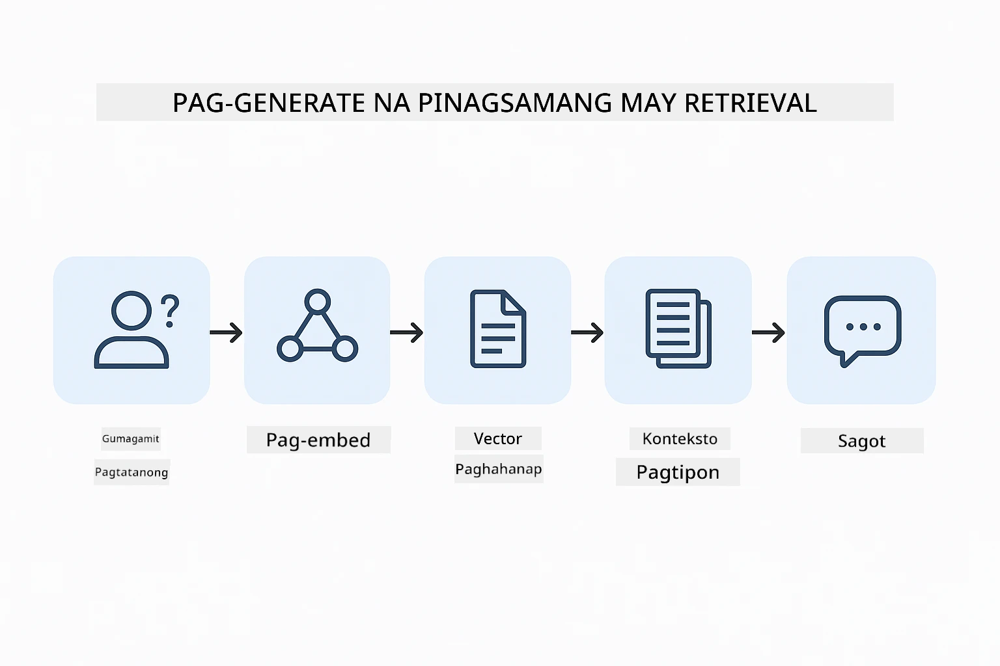
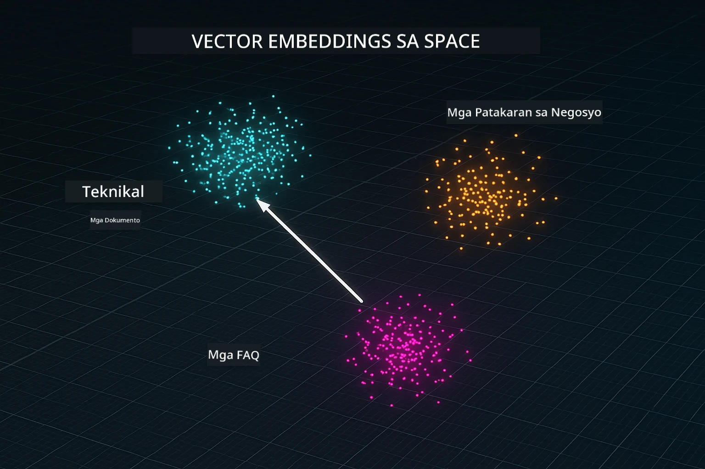
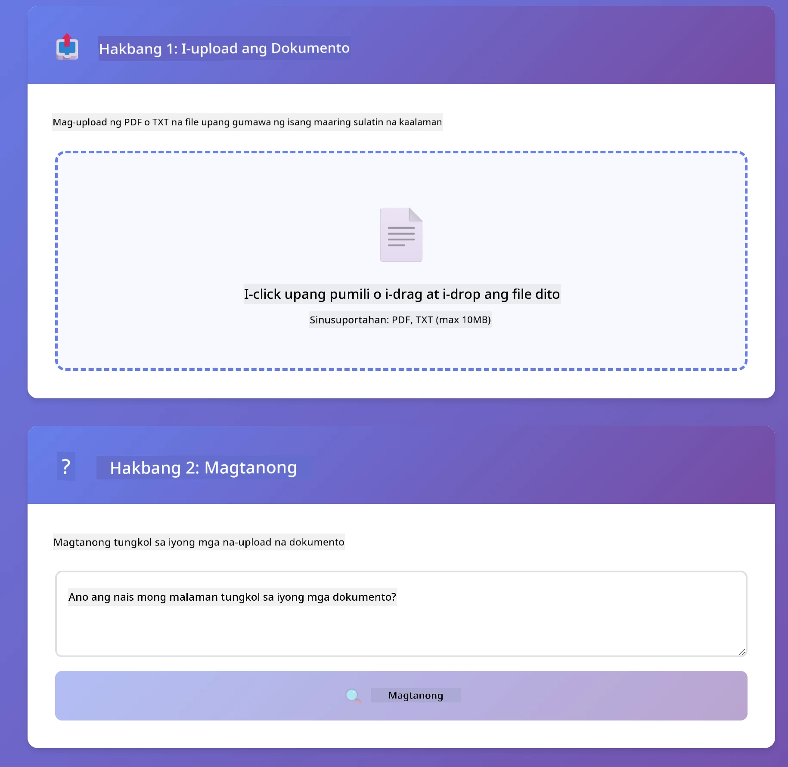

<!--
CO_OP_TRANSLATOR_METADATA:
{
  "original_hash": "81d087662fb3dd7b7124bce1a9c9ec86",
  "translation_date": "2026-01-06T00:31:21+00:00",
  "source_file": "03-rag/README.md",
  "language_code": "tl"
}
-->
# Module 03: RAG (Retrieval-Augmented Generation)

## Table of Contents

- [What You'll Learn](../../../03-rag)
- [Prerequisites](../../../03-rag)
- [Understanding RAG](../../../03-rag)
- [How It Works](../../../03-rag)
  - [Document Processing](../../../03-rag)
  - [Creating Embeddings](../../../03-rag)
  - [Semantic Search](../../../03-rag)
  - [Answer Generation](../../../03-rag)
- [Run the Application](../../../03-rag)
- [Using the Application](../../../03-rag)
  - [Upload a Document](../../../03-rag)
  - [Ask Questions](../../../03-rag)
  - [Check Source References](../../../03-rag)
  - [Experiment with Questions](../../../03-rag)
- [Key Concepts](../../../03-rag)
  - [Chunking Strategy](../../../03-rag)
  - [Similarity Scores](../../../03-rag)
  - [In-Memory Storage](../../../03-rag)
  - [Context Window Management](../../../03-rag)
- [When RAG Matters](../../../03-rag)
- [Next Steps](../../../03-rag)

## What You'll Learn

Sa mga naunang module, natutunan mo kung paano makipag-usap sa AI at magplano ng iyong mga prompt nang epektibo. Ngunit may isang pangunahing limitasyon: ang mga language model ay alam lamang ang mga natutunan nila sa panahon ng pagsasanay. Hindi sila makakasagot ng mga tanong tungkol sa mga polisiya ng iyong kumpanya, mga dokumento ng proyekto, o anumang impormasyong hindi nila na-train.

Pinapawi ng RAG (Retrieval-Augmented Generation) ang problemang ito. Sa halip na turuan ang modelo ng iyong impormasyon (na mahal at hindi praktikal), binibigyan mo ito ng kakayahang maghanap sa iyong mga dokumento. Kapag may nagtanong, hahanapin ng sistema ang angkop na impormasyon at isasama ito sa prompt. Sasagutin ng modelo ang tanong batay sa nakuha nitong konteksto.

Isipin ang RAG bilang pagbibigay sa modelo ng isang reperensyang silid-aklatan. Kapag nagtanong ka, ang sistema:

1. **User Query** - Nagtanong ka
2. **Embedding** - Kinokonbert ang iyong tanong sa vector
3. **Vector Search** - Hinahanap ang magkaparehong bahagi ng dokumento
4. **Context Assembly** - Idinadagdag ang mga may-kaugnayang bahagi sa prompt
5. **Response** - Gumagawa ng sagot ang LLM base sa konteksto

Ipinapatatag nito ang mga sagot ng modelo sa iyong aktwal na datos sa halip na umasa lang sa kaalaman mula sa training o mag-imbento ng sagot.



*Daloy ng RAG - mula sa tanong ng user patungo sa semantic search hanggang sa paggawa ng sagot na may konteksto*

## Prerequisites

- Nakumpleto ang Module 01 (na-deploy na ang Azure OpenAI resources)
- May `.env` file sa root directory na may credentials ng Azure (nilikha ng `azd up` sa Module 01)

> **Note:** Kung hindi mo pa natatapos ang Module 01, sundin muna ang mga tagubilin sa pag-deploy doon.

## How It Works

### Document Processing

[DocumentService.java](../../../03-rag/src/main/java/com/example/langchain4j/rag/service/DocumentService.java)

Kapag nag-upload ka ng dokumento, pinaghahati-hati ito ng sistema sa mga chunks — maliliit na piraso na komportableng kasya sa konteksto ng modelo. May kaunting overlap ang mga ito para hindi mawalan ng konteksto sa gilid.

```java
Document document = FileSystemDocumentLoader.loadDocument("sample-document.txt");

DocumentSplitter splitter = DocumentSplitters
    .recursive(300, 30, new OpenAiTokenizer());

List<TextSegment> segments = splitter.split(document);
```

> **🤖 Subukan gamit ang [GitHub Copilot](https://github.com/features/copilot) Chat:** Buksan ang [`DocumentService.java`](../../../03-rag/src/main/java/com/example/langchain4j/rag/service/DocumentService.java) at itanong:
> - "Paano hinahati ng LangChain4j ang mga dokumento sa chunks at bakit mahalaga ang overlap?"
> - "Ano ang optimal na laki ng chunk para sa iba't ibang uri ng dokumento at bakit?"
> - "Paano ko hahawakan ang mga dokumentong may iba't ibang wika o espesyal na format?"

### Creating Embeddings

[LangChainRagConfig.java](../../../03-rag/src/main/java/com/example/langchain4j/rag/config/LangChainRagConfig.java)

Bawat chunk ay kinokonbert sa numerikal na representasyon na tinatawag na embedding — sa madaling salita, isang matematikal na fingerprint na kumakatawan sa kahulugan ng teksto. Ang magkakatulad na teksto ay naglalabas ng magkakatulad na embeddings.

```java
@Bean
public EmbeddingModel embeddingModel() {
    return OpenAiOfficialEmbeddingModel.builder()
        .baseUrl(azureOpenAiEndpoint)
        .apiKey(azureOpenAiKey)
        .modelName(azureEmbeddingDeploymentName)
        .build();
}

EmbeddingStore<TextSegment> embeddingStore = 
    new InMemoryEmbeddingStore<>();
```



*Mga dokumentong kinakatawan bilang mga vector sa embedding space — magkaparehong nilalaman ay nagbuo ng magkakatabing cluster*

### Semantic Search

[RagService.java](../../../03-rag/src/main/java/com/example/langchain4j/rag/service/RagService.java)

Kapag nagtanong ka, ginawa ring embedding ang tanong mo. Inihahambing ng sistema ang embedding ng tanong mo sa embeddings ng lahat ng mga chunk ng dokumento. Hinahanap nito ang mga chunk na may pinaka-magkaparehong kahulugan — hindi lang batay sa mga keyword, kundi sa aktwal na semantic similarity.

```java
Embedding queryEmbedding = embeddingModel.embed(question).content();

List<EmbeddingMatch<TextSegment>> matches = 
    embeddingStore.findRelevant(queryEmbedding, 5, 0.7);

for (EmbeddingMatch<TextSegment> match : matches) {
    String relevantText = match.embedded().text();
    double score = match.score();
}
```

> **🤖 Subukan gamit ang [GitHub Copilot](https://github.com/features/copilot) Chat:** Buksan ang [`RagService.java`](../../../03-rag/src/main/java/com/example/langchain4j/rag/service/RagService.java) at itanong:
> - "Paano gumagana ang similarity search gamit ang embeddings at ano ang batayan ng score?"
> - "Anong similarity threshold ang dapat gamitin at paano ito nakaaapekto sa resulta?"
> - "Paano haharapin ang kaso na walang natagpuang relevant na dokumento?"

### Answer Generation

[RagService.java](../../../03-rag/src/main/java/com/example/langchain4j/rag/service/RagService.java)

Ang pinaka-angkop na mga chunk ang isinama sa prompt para sa modelo. Binabasa ng modelo ang mga partikular na chunks na iyon at sasagot sa tanong mo batay sa impormasyong iyon. Pinipigilan nito ang hallucination — makakasagot lang ang modelo mula sa nakikitang impormasyon.

## Run the Application

**Siguraduhing naka-deploy:**

Tiyakin na may `.env` file sa root directory na may Azure credentials (nilikha noong Module 01):
```bash
cat ../.env  # Dapat ipakita ang AZURE_OPENAI_ENDPOINT, API_KEY, DEPLOYMENT
```

**Simulan ang application:**

> **Note:** Kung sinimulan mo na ang lahat ng application gamit ang `./start-all.sh` mula sa Module 01, tumatakbo na ang module na ito sa port 8081. Maaari mong laktawan ang mga start command sa ibaba at direktang pumunta sa http://localhost:8081.

**Opsyon 1: Gamit ang Spring Boot Dashboard (Inirerekomenda para sa mga gumagamit ng VS Code)**

Kasama sa dev container ang extension na Spring Boot Dashboard na nagbibigay ng visual na interface para pamahalaan lahat ng Spring Boot application. Makikita mo ito sa Activity Bar sa kaliwang bahagi ng VS Code (hanapin ang Spring Boot icon).

Mula sa Spring Boot Dashboard, maaari mong:
- Tingnan ang lahat ng available na Spring Boot application sa workspace
- Simulan/patigilin ang mga application gamit ang isang click
- Tingnan ang mga log ng application nang real-time
- Bantayan ang status ng application

I-click lang ang play button malapit sa "rag" para simulan ang module na ito, o simulan lahat ng module nang sabay.


**Opsyon 2: Gamit ang shell scripts**

Simulan ang lahat ng web application (modules 01-04):

**Bash:**
```bash
cd ..  # Mula sa root na direktoryo
./start-all.sh
```

**PowerShell:**
```powershell
cd ..  # Mula sa root directory
.\start-all.ps1
```

O simulan lang ang module na ito:

**Bash:**
```bash
cd 03-rag
./start.sh
```

**PowerShell:**
```powershell
cd 03-rag
.\start.ps1
```

Awtomatikong ini-load ng mga script ang environment variables mula sa root `.env` file at ise-build ang mga JAR kung wala pa ang mga ito.

> **Note:** Kung nais mong manual na i-build lahat ng module bago simulan:
>
> **Bash:**
> ```bash
> cd ..  # Go to root directory
> mvn clean package -DskipTests
> ```
>
> **PowerShell:**
> ```powershell
> cd ..  # Go to root directory
> mvn clean package -DskipTests
> ```

Buksan ang http://localhost:8081 sa iyong browser.

**Para itigil:**

**Bash:**
```bash
./stop.sh  # Modulong ito lamang
# O
cd .. && ./stop-all.sh  # Lahat ng mga module
```

**PowerShell:**
```powershell
.\stop.ps1  # Sa modulong ito lamang
# O
cd ..; .\stop-all.ps1  # Lahat ng modules
```

## Using the Application

Nagbibigay ang application ng web interface para mag-upload ng dokumento at magtanong.

<a href="images/rag-homepage.png"></a>

*Interface ng RAG application — mag-upload ng dokumento at magtanong*

### Upload a Document

Simulan sa pag-upload ng dokumento — pinakamainam ang mga TXT file para sa pagsubok. Mayroong `sample-document.txt` sa folder na ito na naglalaman ng impormasyon tungkol sa mga tampok ng LangChain4j, implementasyon ng RAG, at mga best practice — perpekto para subukan ang sistema.

Pinoproseso ng sistema ang iyong dokumento, hinahati ito sa chunks, at lumilikha ng embeddings para sa bawat chunk. Nangyayari ito nang awtomatiko kapag nag-upload ka.

### Ask Questions

Magtanong ng mga tiyak na tanong tungkol sa laman ng dokumento. Subukan ang mga factual na tanong na malinaw na nakasaad sa dokumento. Hahanapin ng sistema ang mga may-kaugnayang chunk, isasama ito sa prompt, at gagawa ng sagot.

### Check Source References

Mapapansin mo na bawat sagot ay may kasamang reperensya mula sa pinanggalingan na may similarity scores. Ipinapakita ng mga score (mula 0 hanggang 1) kung gaano ka-relevant ang bawat chunk sa tanong mo. Mas mataas ang score, mas mahusay ang tugma. Makakatulong ito upang mapatunayan mo ang sagot gamit ang source material.

<a href="images/rag-query-results.png"></a>

*Mga resulta ng query na nagpapakita ng sagot na may mga reference mula sa pinagkunan at relevance scores*

### Experiment with Questions

Subukan ang iba't ibang uri ng tanong:
- Tiyak na mga katotohanan: "Ano ang pangunahing paksa?"
- Paghahambing: "Ano ang pagkakaiba ng X at Y?"
- Buod: "Ibuod ang mga pangunahing punto tungkol sa Z"

Pansinin kung paano nagbabago ang relevance scores depende sa kung gaano kaepektibo ang tanong mo sa pagtugma sa contenido ng dokumento.

## Key Concepts

### Chunking Strategy

Hinahati ang mga dokumento sa mga chunks na may 300 token na may overlap na 30 token. Ang balanse na ito ay tinitiyak na ang bawat chunk ay may sapat na konteksto upang magkahulugan habang nananatiling maliit para makapasok ang maraming chunks sa isang prompt.

### Similarity Scores

Ang mga score ay naglalaro mula 0 hanggang 1:
- 0.7-1.0: Labis na relevant, eksaktong tugma
- 0.5-0.7: Relevant, may magandang konteksto
- Mas mababa sa 0.5: Hindi isinama, masyadong hindi tugma

Kinuha lang muna ng sistema ang mga chunks na mataas sa minimum threshold para matiyak ang kalidad.

### In-Memory Storage

Gumagamit ang module na ito ng in-memory storage para maging simple. Kapag nirestart mo ang application, mawawala ang mga in-upload na dokumento. Sa production, gumagamit ng persistent vector databases tulad ng Qdrant o Azure AI Search.

### Context Window Management

Ang bawat modelo ay may maximum na context window. Hindi mo maaaring isama lahat ng chunks mula sa isang malaking dokumento. Kinukuha ng sistema ang top N na pinaka-relevant na chunks (default ay 5) para manatili sa limitasyon habang nagbibigay ng sapat na konteksto para sa tama at tumpak na sagot.

## When RAG Matters

**Gamitin ang RAG kapag:**
- Sumagot ng mga tanong tungkol sa mga proprietary na dokumento
- Madalas nagbabago ang impormasyon (mga polisiya, presyo, espesipikasyon)
- Kailangan ang eksaktong attribution sa source
- Ang nilalaman ay masyadong malaki para isama sa isang prompt
- Kailangan ang mga sagot na maaaring mapatunayan at nakabatay sa totoong datos

**Huwag gamitin ang RAG kapag:**
- Mga tanong na nangangailangan ng pangkalahatang kaalaman na mayroon na ang modelo
- Kailangan ng real-time na datos (gumagana ang RAG sa mga na-upload na dokumento)
- Ang nilalaman ay maliit lang at maaaring isama nang direkta sa prompt

## Next Steps

**Next Module:** [04-tools - AI Agents with Tools](../04-tools/README.md)

---

**Navigation:** [← Previous: Module 02 - Prompt Engineering](../02-prompt-engineering/README.md) | [Back to Main](../README.md) | [Next: Module 04 - Tools →](../04-tools/README.md)

---

<!-- CO-OP TRANSLATOR DISCLAIMER START -->
**Paunawa**:
Ang dokumentong ito ay isinalin gamit ang serbisyong pagsasalin ng AI na [Co-op Translator](https://github.com/Azure/co-op-translator). Bagamat nagsusumikap kami para sa katumpakan, pakatandaan na ang awtomatikong pagsasalin ay maaaring maglaman ng mga pagkakamali o di-katumpakan. Ang orihinal na dokumento sa orihinal nitong wika ang dapat ituring na pangunahing sanggunian. Para sa mahahalagang impormasyon, ipinapayo ang propesyonal na pagsasalin ng tao. Hindi kami mananagot sa anumang hindi pagkakaunawaan o maling interpretasyon na nagmumula sa paggamit ng pagsasaling ito.
<!-- CO-OP TRANSLATOR DISCLAIMER END -->