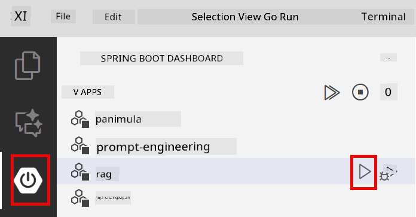
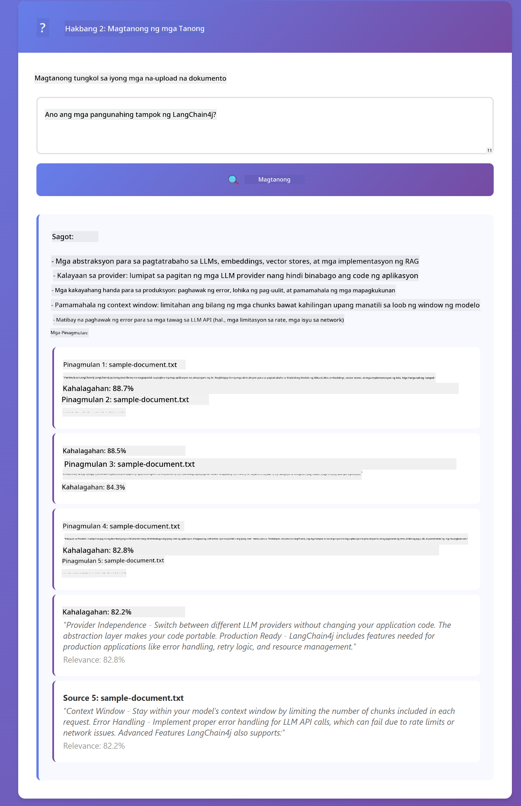

<!--
CO_OP_TRANSLATOR_METADATA:
{
  "original_hash": "f538a51cfd13147d40d84e936a0f485c",
  "translation_date": "2025-12-13T17:11:56+00:00",
  "source_file": "03-rag/README.md",
  "language_code": "tl"
}
-->
# Module 03: RAG (Retrieval-Augmented Generation)

## Table of Contents

- [What You'll Learn](../../../03-rag)
- [Prerequisites](../../../03-rag)
- [Understanding RAG](../../../03-rag)
- [How It Works](../../../03-rag)
  - [Document Processing](../../../03-rag)
  - [Creating Embeddings](../../../03-rag)
  - [Semantic Search](../../../03-rag)
  - [Answer Generation](../../../03-rag)
- [Run the Application](../../../03-rag)
- [Using the Application](../../../03-rag)
  - [Upload a Document](../../../03-rag)
  - [Ask Questions](../../../03-rag)
  - [Check Source References](../../../03-rag)
  - [Experiment with Questions](../../../03-rag)
- [Key Concepts](../../../03-rag)
  - [Chunking Strategy](../../../03-rag)
  - [Similarity Scores](../../../03-rag)
  - [In-Memory Storage](../../../03-rag)
  - [Context Window Management](../../../03-rag)
- [When RAG Matters](../../../03-rag)
- [Next Steps](../../../03-rag)

## What You'll Learn

Sa mga naunang module, natutunan mo kung paano makipag-usap sa AI at paano epektibong istraktura ang iyong mga prompt. Ngunit may isang pangunahing limitasyon: ang mga language model ay alam lamang ang mga natutunan nila sa panahon ng pagsasanay. Hindi nila masagot ang mga tanong tungkol sa mga patakaran ng iyong kumpanya, dokumentasyon ng iyong proyekto, o anumang impormasyon na hindi nila na-train.

Nilulutas ng RAG (Retrieval-Augmented Generation) ang problemang ito. Sa halip na subukang turuan ang modelo ng iyong impormasyon (na mahal at hindi praktikal), binibigyan mo ito ng kakayahang maghanap sa iyong mga dokumento. Kapag may nagtanong, hinahanap ng sistema ang kaugnay na impormasyon at isinasama ito sa prompt. Ang modelo ay sasagot batay sa nakuha nitong konteksto.

Isipin ang RAG bilang pagbibigay sa modelo ng isang reference library. Kapag nagtanong ka, ang sistema ay:

1. **User Query** - Nagtanong ka
2. **Embedding** - Kinokonvert ang tanong mo sa isang vector
3. **Vector Search** - Hinahanap ang mga katulad na bahagi ng dokumento
4. **Context Assembly** - Idinadagdag ang mga kaugnay na bahagi sa prompt
5. **Response** - Gumagawa ang LLM ng sagot batay sa konteksto

Ito ay naglalagay ng pundasyon sa mga sagot ng modelo gamit ang iyong aktwal na data sa halip na umasa sa kaalaman mula sa pagsasanay o gumawa ng mga sagot.


*Daloy ng RAG - mula sa user query hanggang semantic search hanggang sa pagbuo ng sagot na may konteksto*

## Prerequisites

- Nakumpleto ang Module 01 (Azure OpenAI resources na na-deploy)
- `.env` file sa root directory na may Azure credentials (nilikha ng `azd up` sa Module 01)

> **Note:** Kung hindi mo pa natatapos ang Module 01, sundin muna ang mga tagubilin sa deployment doon.

## How It Works

**Document Processing** - [DocumentService.java](../../../03-rag/src/main/java/com/example/langchain4j/rag/service/DocumentService.java)

Kapag nag-upload ka ng dokumento, hinahati ito ng sistema sa mga chunks - mas maliliit na bahagi na kasya nang maayos sa context window ng modelo. Ang mga chunks na ito ay bahagyang nag-o-overlap upang hindi mawala ang konteksto sa mga hangganan.

```java
Document document = FileSystemDocumentLoader.loadDocument("sample-document.txt");

DocumentSplitter splitter = DocumentSplitters
    .recursive(300, 30, new OpenAiTokenizer());

List<TextSegment> segments = splitter.split(document);
```

> **🤖 Try with [GitHub Copilot](https://github.com/features/copilot) Chat:** Buksan ang [`DocumentService.java`](../../../03-rag/src/main/java/com/example/langchain4j/rag/service/DocumentService.java) at itanong:
> - "Paano hinahati ng LangChain4j ang mga dokumento sa chunks at bakit mahalaga ang overlap?"
> - "Ano ang optimal na laki ng chunk para sa iba't ibang uri ng dokumento at bakit?"
> - "Paano ko haharapin ang mga dokumento na nasa maraming wika o may espesyal na format?"

**Creating Embeddings** - [LangChainRagConfig.java](../../../03-rag/src/main/java/com/example/langchain4j/rag/config/LangChainRagConfig.java)

Ang bawat chunk ay kino-convert sa isang numerikal na representasyon na tinatawag na embedding - isang matematikal na fingerprint na kumakatawan sa kahulugan ng teksto. Ang magkatulad na teksto ay nagreresulta sa magkatulad na embeddings.

```java
@Bean
public EmbeddingModel embeddingModel() {
    return OpenAiOfficialEmbeddingModel.builder()
        .baseUrl(azureOpenAiEndpoint)
        .apiKey(azureOpenAiKey)
        .modelName(azureEmbeddingDeploymentName)
        .build();
}

EmbeddingStore<TextSegment> embeddingStore = 
    new InMemoryEmbeddingStore<>();
```


*Mga dokumentong kinakatawan bilang mga vector sa embedding space - ang magkatulad na nilalaman ay nagkakatipon*

**Semantic Search** - [RagService.java](../../../03-rag/src/main/java/com/example/langchain4j/rag/service/RagService.java)

Kapag nagtanong ka, ang tanong mo ay nagiging embedding din. Kinukumpara ng sistema ang embedding ng tanong mo sa lahat ng embeddings ng mga chunks ng dokumento. Hinahanap nito ang mga chunks na may pinakakatulad na kahulugan - hindi lang mga tugmang keyword, kundi tunay na semantic similarity.

```java
Embedding queryEmbedding = embeddingModel.embed(question).content();

List<EmbeddingMatch<TextSegment>> matches = 
    embeddingStore.findRelevant(queryEmbedding, 5, 0.7);

for (EmbeddingMatch<TextSegment> match : matches) {
    String relevantText = match.embedded().text();
    double score = match.score();
}
```

> **🤖 Try with [GitHub Copilot](https://github.com/features/copilot) Chat:** Buksan ang [`RagService.java`](../../../03-rag/src/main/java/com/example/langchain4j/rag/service/RagService.java) at itanong:
> - "Paano gumagana ang similarity search gamit ang embeddings at ano ang nagtatakda ng score?"
> - "Anong similarity threshold ang dapat kong gamitin at paano ito nakakaapekto sa mga resulta?"
> - "Paano ko haharapin ang mga kaso kung saan walang relevant na dokumento na nahanap?"

**Answer Generation** - [RagService.java](../../../03-rag/src/main/java/com/example/langchain4j/rag/service/RagService.java)

Ang mga pinaka-kaugnay na chunks ay isinasama sa prompt para sa modelo. Binabasa ng modelo ang mga partikular na chunks na iyon at sinasagot ang tanong mo batay sa impormasyong iyon. Pinipigilan nito ang hallucination - ang modelo ay makakasagot lamang mula sa mga nasa harap nito.

## Run the Application

**Verify deployment:**

Siguraduhing may `.env` file sa root directory na may Azure credentials (nilikha noong Module 01):
```bash
cat ../.env  # Dapat ipakita ang AZURE_OPENAI_ENDPOINT, API_KEY, DEPLOYMENT
```

**Start the application:**

> **Note:** Kung sinimulan mo na ang lahat ng application gamit ang `./start-all.sh` mula sa Module 01, tumatakbo na ang module na ito sa port 8081. Maaari mong laktawan ang mga start command sa ibaba at direktang pumunta sa http://localhost:8081.

**Option 1: Using Spring Boot Dashboard (Recommended for VS Code users)**

Kasama sa dev container ang Spring Boot Dashboard extension, na nagbibigay ng visual na interface para pamahalaan ang lahat ng Spring Boot applications. Makikita mo ito sa Activity Bar sa kaliwang bahagi ng VS Code (hanapin ang Spring Boot icon).

Mula sa Spring Boot Dashboard, maaari mong:
- Tingnan ang lahat ng available na Spring Boot applications sa workspace
- Simulan/hintuin ang mga application sa isang click lang
- Tingnan ang mga log ng application nang real-time
- Subaybayan ang status ng application

I-click lang ang play button sa tabi ng "rag" para simulan ang module na ito, o simulan lahat ng module nang sabay-sabay.



**Option 2: Using shell scripts**

Simulan lahat ng web applications (modules 01-04):

**Bash:**
```bash
cd ..  # Mula sa root na direktoryo
./start-all.sh
```

**PowerShell:**
```powershell
cd ..  # Mula sa root na direktoryo
.\start-all.ps1
```

O simulan lang ang module na ito:

**Bash:**
```bash
cd 03-rag
./start.sh
```

**PowerShell:**
```powershell
cd 03-rag
.\start.ps1
```

Awtomatikong niloload ng parehong script ang environment variables mula sa root `.env` file at bubuuin ang mga JAR kung wala pa.

> **Note:** Kung gusto mong manu-manong buuin lahat ng module bago simulan:
>
> **Bash:**
> ```bash
> cd ..  # Go to root directory
> mvn clean package -DskipTests
> ```
>
> **PowerShell:**
> ```powershell
> cd ..  # Go to root directory
> mvn clean package -DskipTests
> ```

Buksan ang http://localhost:8081 sa iyong browser.

**To stop:**

**Bash:**
```bash
./stop.sh  # Para lamang sa module na ito
# O
cd .. && ./stop-all.sh  # Lahat ng mga module
```

**PowerShell:**
```powershell
.\stop.ps1  # Para lamang sa module na ito
# O
cd ..; .\stop-all.ps1  # Lahat ng mga module
```

## Using the Application

Nagbibigay ang application ng web interface para sa pag-upload ng dokumento at pagtatanong.

<a href="images/rag-homepage.png"></a>

*Interface ng RAG application - mag-upload ng dokumento at magtanong*

**Upload a Document**

Magsimula sa pag-upload ng dokumento - mas mainam ang mga TXT file para sa testing. Mayroong `sample-document.txt` sa direktoryong ito na naglalaman ng impormasyon tungkol sa mga feature ng LangChain4j, implementasyon ng RAG, at mga best practice - perpekto para sa pagsubok ng sistema.

Pinoproseso ng sistema ang iyong dokumento, hinahati ito sa mga chunks, at gumagawa ng embeddings para sa bawat chunk. Nangyayari ito nang awtomatiko kapag nag-upload ka.

**Ask Questions**

Ngayon magtanong ng mga tiyak na tanong tungkol sa nilalaman ng dokumento. Subukan ang mga factual na malinaw na nakasaad sa dokumento. Hinahanap ng sistema ang mga kaugnay na chunks, isinasama ito sa prompt, at bumubuo ng sagot.

**Check Source References**

Mapapansin na bawat sagot ay may kasamang mga source references na may similarity scores. Ipinapakita ng mga score na ito (0 hanggang 1) kung gaano kaugnay ang bawat chunk sa tanong mo. Mas mataas na score ay mas magandang tugma. Pinapayagan ka nitong beripikahin ang sagot laban sa pinanggalingang materyal.

<a href="images/rag-query-results.png"></a>

*Mga resulta ng query na nagpapakita ng sagot na may source references at relevance scores*

**Experiment with Questions**

Subukan ang iba't ibang uri ng tanong:
- Mga tiyak na katotohanan: "Ano ang pangunahing paksa?"
- Paghahambing: "Ano ang pagkakaiba ng X at Y?"
- Buod: "Ibuod ang mga pangunahing punto tungkol sa Z"

Pansinin kung paano nagbabago ang relevance scores batay sa kung gaano kahusay tumutugma ang tanong mo sa nilalaman ng dokumento.

## Key Concepts

**Chunking Strategy**

Hinahati ang mga dokumento sa 300-token na chunks na may 30 tokens na overlap. Ang balanse na ito ay nagsisiguro na bawat chunk ay may sapat na konteksto upang maging makahulugan habang nananatiling maliit para maisama ang maraming chunks sa isang prompt.

**Similarity Scores**

Ang mga score ay mula 0 hanggang 1:
- 0.7-1.0: Napaka-kaugnay, eksaktong tugma
- 0.5-0.7: Kaugnay, magandang konteksto
- Mas mababa sa 0.5: Hindi isinama, masyadong di-kaugnay

Kukunin lang ng sistema ang mga chunks na lampas sa minimum threshold para matiyak ang kalidad.

**In-Memory Storage**

Gumagamit ang module na ito ng in-memory storage para sa pagiging simple. Kapag nirestart mo ang application, mawawala ang mga na-upload na dokumento. Sa production, gumagamit ng persistent vector databases tulad ng Qdrant o Azure AI Search.

**Context Window Management**

Bawat modelo ay may maximum na context window. Hindi mo maaaring isama lahat ng chunks mula sa malaking dokumento. Kinukuha ng sistema ang top N na pinaka-kaugnay na chunks (default ay 5) upang manatili sa limitasyon habang nagbibigay ng sapat na konteksto para sa tumpak na sagot.

## When RAG Matters

**Gamitin ang RAG kapag:**
- Sumagot ng mga tanong tungkol sa proprietary na dokumento
- Madalas magbago ang impormasyon (mga patakaran, presyo, espesipikasyon)
- Kailangan ng katumpakan na may source attribution
- Sobrang laki ng nilalaman para isama sa isang prompt
- Kailangan ng mapapatunayang, grounded na mga sagot

**Huwag gamitin ang RAG kapag:**
- Mga tanong na nangangailangan ng pangkalahatang kaalaman na alam na ng modelo
- Kailangan ng real-time na data (gumagana ang RAG sa mga na-upload na dokumento)
- Maliit lang ang nilalaman para isama nang direkta sa mga prompt

## Next Steps

**Next Module:** [04-tools - AI Agents with Tools](../04-tools/README.md)

---

**Navigation:** [← Previous: Module 02 - Prompt Engineering](../02-prompt-engineering/README.md) | [Back to Main](../README.md) | [Next: Module 04 - Tools →](../04-tools/README.md)

---

<!-- CO-OP TRANSLATOR DISCLAIMER START -->
**Paalala**:
Ang dokumentong ito ay isinalin gamit ang AI translation service na [Co-op Translator](https://github.com/Azure/co-op-translator). Bagamat nagsusumikap kami para sa katumpakan, pakatandaan na ang mga awtomatikong pagsasalin ay maaaring maglaman ng mga pagkakamali o di-tumpak na impormasyon. Ang orihinal na dokumento sa kanyang sariling wika ang dapat ituring na pangunahing sanggunian. Para sa mahahalagang impormasyon, inirerekomenda ang propesyonal na pagsasalin ng tao. Hindi kami mananagot sa anumang hindi pagkakaunawaan o maling interpretasyon na maaaring magmula sa paggamit ng pagsasaling ito.
<!-- CO-OP TRANSLATOR DISCLAIMER END -->