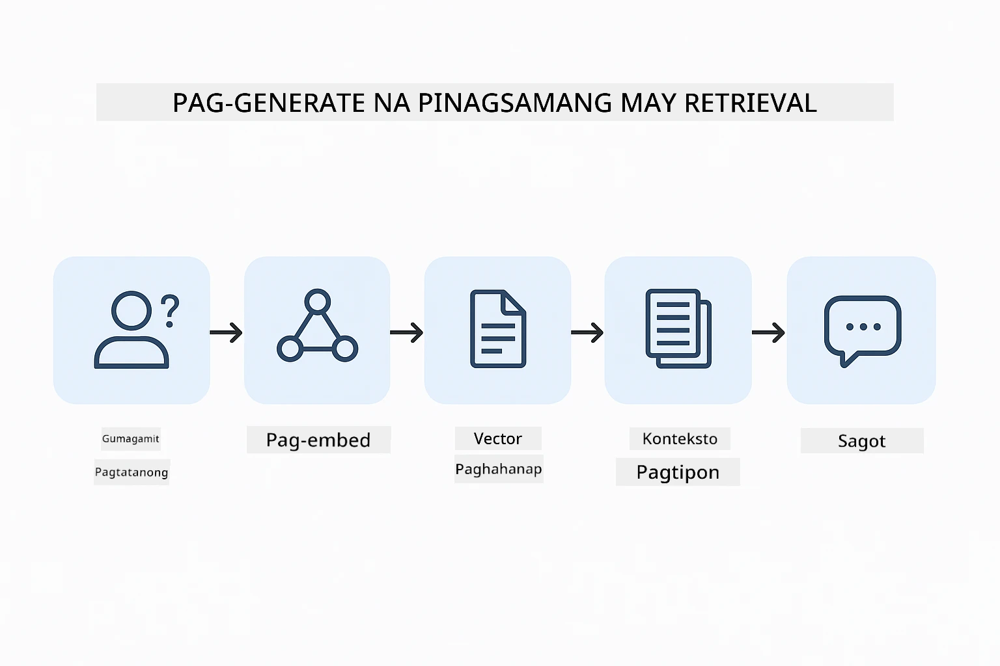
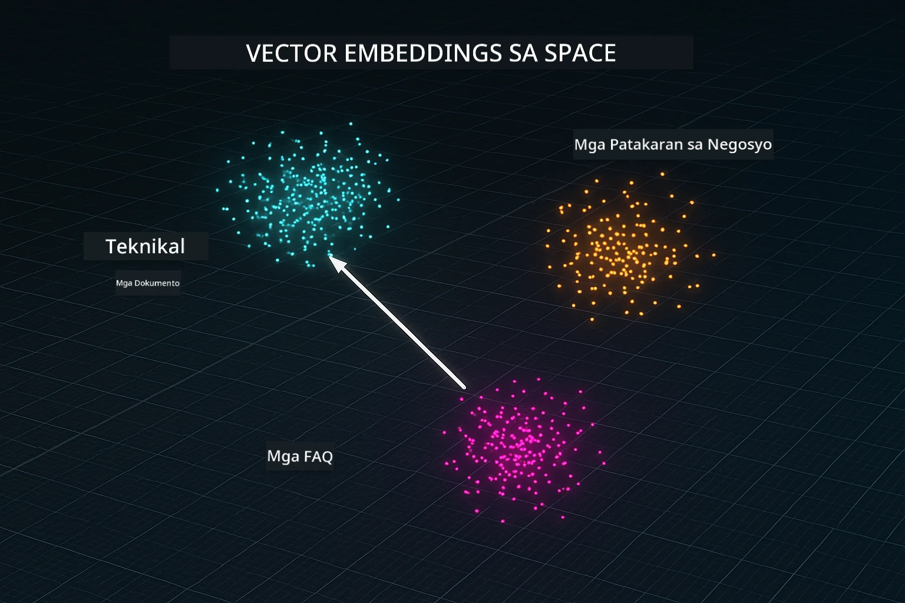
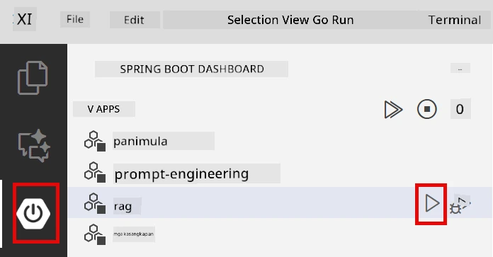
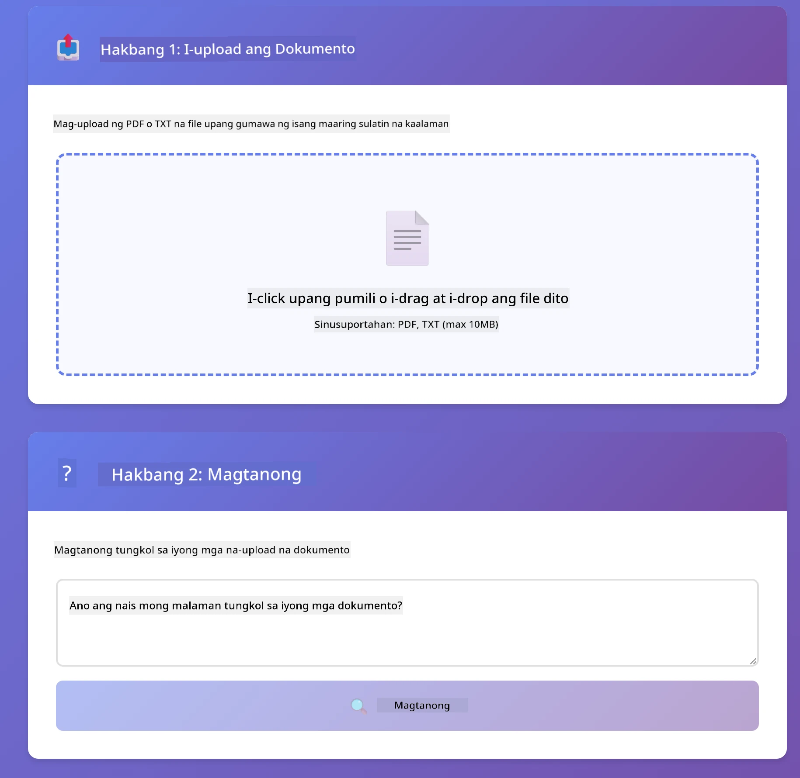
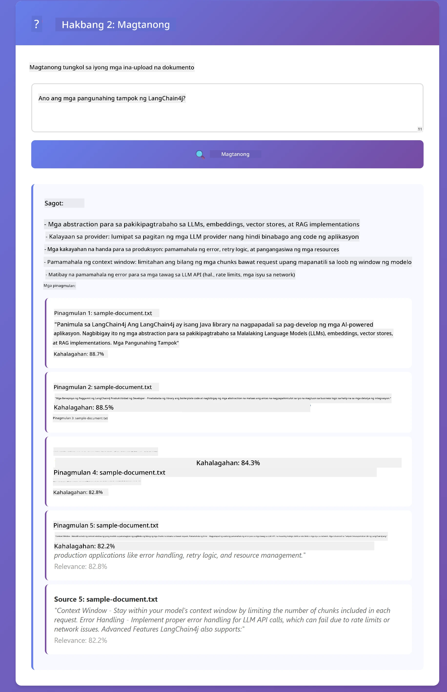

# Module 03: RAG (Retrieval-Augmented Generation)

## Table of Contents

- [Video Walkthrough](#video-walkthrough)
- [What You'll Learn](#what-youll-learn)
- [Prerequisites](#prerequisites)
- [Understanding RAG](#understanding-rag)
  - [Which RAG Approach Does This Tutorial Use?](#which-rag-approach-does-this-tutorial-use)
- [How It Works](#how-it-works)
  - [Document Processing](#document-processing)
  - [Creating Embeddings](#creating-embeddings)
  - [Semantic Search](#semantic-search)
  - [Answer Generation](#paggawa-ng-sagot)
- [Run the Application](#patakbuhin-ang-aplikasyon)
- [Using the Application](#paggamit-ng-aplikasyon)
  - [Upload a Document](#mag-upload-ng-dokumento)
  - [Ask Questions](#magtanong)
  - [Check Source References](#suriin-ang-mga-pinanggalingang-sanggunian)
  - [Experiment with Questions](#subukan-ang-ibat-ibang-mga-tanong)
- [Key Concepts](#mga-pangunahing-konsepto)
  - [Chunking Strategy](#chunking-strategy)
  - [Similarity Scores](#similarity-scores)
  - [In-Memory Storage](#in-memory-storage)
  - [Context Window Management](#pamamahala-ng-context-window)
- [When RAG Matters](#kailan-mahalaga-ang-rag)
- [Next Steps](#mga-susunod-na-hakbang)

## Video Walkthrough

Panoorin ang live session na ito na nagpapaliwanag kung paano magsimula sa module na ito:

<a href="https://www.youtube.com/watch?v=_olq75ZH_eY"></a>

## What You'll Learn

Sa mga naunang module, natutunan mo kung paano makipag-usap sa AI at maayos na istraktura ang iyong mga prompt. Ngunit may isang pangunahing limitasyon: ang mga language model ay nalalaman lamang ang kanilang natutunan sa panahon ng pagsasanay. Hindi nila masagot ang mga tanong tungkol sa mga patakaran ng iyong kumpanya, dokumentasyon ng iyong proyekto, o anumang impormasyon na hindi nila na-train.

Nilulutas ng RAG (Retrieval-Augmented Generation) ang problemang ito. Sa halip na subukang turuan ang modelo ng iyong mga impormasyon (na mahal at hindi praktikal), binibigyan mo ito ng kakayahang maghanap sa iyong mga dokumento. Kapag may nagtatanong, hinahanap ng sistema ang mga kaugnay na impormasyon at isinama ito sa prompt. Ang modelo ay sumasagot base sa nakuhang kontekstong iyon.

Isipin ang RAG bilang pagbibigay ng isang sangguniang aklatan sa modelo. Kapag may tanong ka, ang sistema ay:

1. **User Query** - Nagtanong ka
2. **Embedding** - Kino-convert ang iyong tanong sa vector
3. **Vector Search** - Hinahanap ang mga katulad na bahagi ng dokumento
4. **Context Assembly** - Idinadagdag ang mga kaugnay na bahagi sa prompt
5. **Response** - Gumagawa ng sagot ang LLM base sa konteksto

Ito ay nag-uugat sa mga sagot ng modelo sa iyong tunay na data sa halip na umasa lamang sa kanyang pinag-aralang kaalaman o gumawa ng mga sagot.

## Prerequisites

- Nakumpleto ang [Module 01 - Introduction](../01-introduction/README.md) (nakapag-deploy ng Azure OpenAI resources, kabilang ang `text-embedding-3-small` embedding model)
- `.env` na file sa root directory na may Azure credentials (nilikhang gamit ang `azd up` sa Module 01)

> **Note:** Kung hindi mo pa natatapos ang Module 01, sundin muna ang mga tagubilin doon. Ang `azd up` na command ay nagde-deploy ng GPT chat model at embedding model na ginagamit sa module na ito.

## Understanding RAG

Ang diagram sa ibaba ay nagpapakita ng pangunahing konsepto: sa halip na umasa lamang sa training data ng modelo, binibigyan ng RAG ito ng isang sangguniang aklatan ng iyong mga dokumento upang tignan bago gumawa ng bawat sagot.


*Ipinapakita ng diagram na ito ang pinagkaiba ng karaniwang LLM (na naghuhula base sa training data) at ng RAG-enhanced LLM (na kumukunsulta muna sa iyong mga dokumento).*

Ganito nag-uugnay ang mga bahagi mula simula hanggang katapusan. Ang tanong ng user ay dumadaan sa apat na yugto — embedding, vector search, context assembly, at answer generation — na bawat isa ay umaasa sa naunang hakbang:



*Ipinapakita ng diagram na ito ang end-to-end pipeline ng RAG — dumadaan ang tanong ng user sa embedding, vector search, context assembly, at answer generation.*

Ang natitirang bahagi ng module na ito ay naglalakad sa bawat yugto nang detalyado, kasama ang code na maaari mong patakbuhin at baguhin.

### Which RAG Approach Does This Tutorial Use?

Nag-aalok ang LangChain4j ng tatlong paraan upang ipatupad ang RAG, bawat isa ay may iba't ibang antas ng abstraction. Ang diagram sa ibaba ay inihahambing ang mga ito nang tabi-tabi:


*Ipinapakita ng diagram na ito ang tatlong RAG approaches ng LangChain4j — Easy, Native, at Advanced — na nagpapakita ng kanilang mga pangunahing bahagi at kung kailan gamitin ang bawat isa.*

| Approach | Ano ang Ginagawa Nito | Kapalit |
|---|---|---|
| **Easy RAG** | Awtomatikong inuugnay ang lahat gamit ang `AiServices` at `ContentRetriever`. Nag-aanotate ka ng isang interface, nag-aattach ng retriever, at ang LangChain4j na ang humahawak sa embedding, paghahanap, at pagpupulong ng prompt sa likod ng eksena. | Minimal na code, pero hindi mo direktang nakikita ang nangyayari sa bawat hakbang. |
| **Native RAG** | Ikaw ang tumatawag ng embedding model, naghahanap sa store, bumubuo ng prompt, at gumagawa ng sagot — isang hakbang kada oras na malinaw. | Mas maraming code, pero bawat yugto ay nakikita at mababago. |
| **Advanced RAG** | Gumagamit ng `RetrievalAugmentor` framework na may pluggable query transformers, routers, re-rankers, at content injectors para sa production-grade pipelines. | Pinakamalawak na flexibility, pero mas komplikado. |

**Ang tutorial na ito ay gumagamit ng Native approach.** Ang bawat hakbang ng RAG pipeline — embedding ng query, paghahanap sa vector store, pagbuo ng konteksto, at pag-generate ng sagot — ay isinulat nang malinaw sa [`RagService.java`](../../../03-rag/src/main/java/com/example/langchain4j/rag/service/RagService.java). Ito ay sinadya: bilang isang learning resource, mas mahalaga na makita at maintindihan mo ang bawat yugto kaysa mapaliit lang ang code. Kapag komportable ka na sa pagkakaugnay ng mga bahagi, maaari kang lumipat sa Easy RAG para sa mabilisang prototypes o sa Advanced RAG para sa mga production system.

> **💡 Nais mo bang malaman ang tungkol sa Easy RAG?** Nag-aalok din ang LangChain4j ng *Easy RAG* na paraan kung saan ang `AiServices` at `ContentRetriever` ang humahawak ng embedding, paghahanap, at prompt assembly nang awtomatiko. Ang module na ito ay sumusunod sa mas malinaw na paraan — binubuksan ang pipeline para makita at kontrolin mo ang bawat yugto.

Ang diagram sa ibaba ay nagpapakita ng Easy RAG pipeline. Pansinin kung paano itinatago ng `AiServices` at `EmbeddingStoreContentRetriever` ang lahat ng kahirapan — maglo-load ka ng dokumento, mag-aattach ng retriever, at makakakuha ng sagot. Binubuksan ng Native approach sa module na ito ang bawat hakbang na iyon:


*Ipinapakita ng diagram na ito ang Easy RAG pipeline. Ihambing ito sa Native approach na ginamit sa module na ito: itinatago ng Easy RAG ang embedding, retrieval, at prompt assembly sa likod ng `AiServices` at `ContentRetriever` — naglo-load ka ng dokumento, nag-aattach ng retriever, at nakakakuha ng sagot. Binubuksan ng Native approach ang pipeline para tawagin mo mismo ang bawat hakbang (embed, search, assemble context, generate) nang sarili mo, kaya may buong visibility at kontrol ka.*

## How It Works

Hinahati ang RAG pipeline sa module na ito sa apat na yugto na tumatakbo ng sunud-sunod sa tuwing may nagtatanong. Una, ang ini-upload na dokumento ay **pinoproseso at pinaghahati-hati** sa mga piraso na madaling hawakan. Ang mga pirasong iyon ay kino-convert sa **vector embeddings** at iniimbak para maikumpara nang matematika. Kapag dumating ang tanong, ginagawa ng sistema ang **semantic search** para hanapin ang mga pinaka-kaugnay na piraso, at bilang huli ay ipinapasa ang mga ito bilang konteksto sa LLM para sa **paggawa ng sagot**. Tumingin tayo sa unang hakbang.

### Document Processing

[DocumentService.java](../../../03-rag/src/main/java/com/example/langchain4j/rag/service/DocumentService.java)

Kapag nag-upload ka ng dokumento, pini-parse ito ng sistema (PDF o plain text), nilalagyan ng metadata tulad ng pangalan ng file, at pagkatapos hinahati ito sa mga chunks — mas maliliit na bahagi na pasok nang maayos sa context window ng modelo. Ang mga chunks na ito ay may konting overlap para hindi mawala ang konteksto sa mga hangganan.

```java
// Ipaloob ang na-upload na file at balutin ito sa isang LangChain4j Document
Document document = Document.from(content, metadata);

// Hatiin sa 300-token na mga bahagi na may 30-token na pagsasapaw
DocumentSplitter splitter = DocumentSplitters
    .recursive(300, 30);

List<TextSegment> segments = splitter.split(document);
```

Ipinapakita sa diagram sa ibaba kung paano ito gumagana nang biswal. Pansinin kung paano ang bawat chunk ay may kaunting pinagsasaluhang tokens sa mga kapitbahay niya — ang 30-token overlap ay nagsisigurong walang mahalagang konteksto ang malalampasan:


*Ipinapakita ng diagram na ito kung paanong hinahati ang dokumento sa 300-token chunks na may 30-token overlap, pinapanatili ang konteksto sa mga hangganan ng chunk.*

> **🤖 Subukan gamit ang [GitHub Copilot](https://github.com/features/copilot) Chat:** Buksan ang [`DocumentService.java`](../../../03-rag/src/main/java/com/example/langchain4j/rag/service/DocumentService.java) at magtanong:
> - "Paano hinahati ng LangChain4j ang mga dokumento sa chunks at bakit mahalaga ang overlap?"
> - "Ano ang optimal na laki ng chunk para sa iba't ibang uri ng dokumento at bakit?"
> - "Paano ko hahawakan ang mga dokumento sa maraming wika o may espesyal na pormat?"

### Creating Embeddings

[LangChainRagConfig.java](../../../03-rag/src/main/java/com/example/langchain4j/rag/config/LangChainRagConfig.java)

Ang bawat chunk ay kino-convert sa isang numerikal na representasyon na tinatawag na embedding — sa madaling salita, isang meaning-to-numbers converter. Hindi "matalino" ang embedding model tulad ng isang chat model; hindi ito sumusunod sa utos, nagre-reason, o sumasagot ng tanong. Ang kaya nito ay i-map ang teksto sa isang matematikal na espasyo kung saan ang magka-kaugnay na kahulugan ay nagtatambak nang malapit sa isa't isa — tulad ng "sasakyan" malapit sa "kotse," "refund policy" malapit sa "ibalik ang pera ko." Isipin ang chat model bilang isang taong pwedeng kausapin; ang embedding model naman ay isang napakagandang filing system.

Ipinapakita sa diagram sa ibaba ang konseptong ito — pumapasok ang teksto, lumalabas ang mga numerikal na vector, at ang mga magkatulad na kahulugan ay may vectors na malapit sa isa't isa:


*Ipinapakita ng diagram na ito kung paano kino-convert ng isang embedding model ang teksto sa mga numerikal na vector, inilalapit ang mga katulad na kahulugan — tulad ng "sasakyan" at "kotse" — sa vector space.*

```java
@Bean
public EmbeddingModel embeddingModel() {
    return OpenAiOfficialEmbeddingModel.builder()
        .baseUrl(azureOpenAiEndpoint)
        .apiKey(azureOpenAiKey)
        .modelName(azureEmbeddingDeploymentName)
        .build();
}

EmbeddingStore<TextSegment> embeddingStore = 
    new InMemoryEmbeddingStore<>();
```

Ipinapakita sa class diagram sa ibaba ang dalawang magkahiwalay na daloy sa RAG pipeline at ang mga LangChain4j classes na nagpapatupad sa mga ito. Ang **ingestion flow** (tumatakbo isang beses pag-upload) ay hinahati ang dokumento, ine-embed ang mga chunks, at iniimbak gamit ang `.addAll()`. Ang **query flow** (tumatakbo kada tanong ng user) ay ine-embed ang tanong, naghahanap sa store gamit ang `.search()`, at ipinapasa ang tugmang konteksto sa chat model. Parehong nagtatagpo ang dalawa sa shared `EmbeddingStore<TextSegment>` interface:


*Ipinapakita ng diagram na ito ang dalawang daloy sa RAG pipeline — ingestion at query — at kung paano sila kumokonekta gamit ang shared na EmbeddingStore.*

Kapag naimbak na ang embeddings, natural na nagsasama-sama ang mga magkakatulad na nilalaman sa vector space. Ipinapakita ng visualization sa ibaba kung paano nagiging malapit sa isa't isa ang mga dokumento tungkol sa magkakaugnay na paksa, na siyang nagpapagana sa semantic search:



*Ipinapakita ng visualization na ito kung paano nagsasama-sama ang mga related na dokumento sa 3D vector space, na may mga paksa tulad ng Technical Docs, Business Rules, at FAQs na bumubuo ng magkakahiwalay na grupo.*

Kapag naghahanap ang user, sinusunod ng sistema ang apat na hakbang: i-embed ang mga dokumento nang isang beses, i-embed ang query sa bawat paghahanap, ikumpara ang query vector laban sa lahat ng nakaimbak na vectors gamit ang cosine similarity, at ibalik ang top-K na pinakamataas ang puntos na chunks. Ipinapakita ng diagram sa ibaba ang bawat hakbang at ang mga LangChain4j classes na kasangkot:


*Ipinapakita ng diagram na ito ang apat na hakbang sa embedding search process: i-embed ang mga dokumento, i-embed ang query, ikumpara ang mga vector gamit ang cosine similarity, at ibalik ang top-K na resulta.*

### Semantic Search

[RagService.java](../../../03-rag/src/main/java/com/example/langchain4j/rag/service/RagService.java)

Kapag nagtatanong ka, ang iyong tanong ay na-eembed din. Kinukumpara ng sistema ang embedding ng iyong tanong sa lahat ng embeddings ng mga bahagi ng dokumento. Hinahanap nito ang mga chunks na may pinakakahawig na kahulugan - hindi lang mga salitang tugma, kundi totoong semantic similarity.

```java
Embedding queryEmbedding = embeddingModel.embed(question).content();

EmbeddingSearchRequest searchRequest = EmbeddingSearchRequest.builder()
    .queryEmbedding(queryEmbedding)
    .maxResults(5)
    .minScore(0.5)
    .build();

EmbeddingSearchResult<TextSegment> searchResult = embeddingStore.search(searchRequest);
List<EmbeddingMatch<TextSegment>> matches = searchResult.matches();

for (EmbeddingMatch<TextSegment> match : matches) {
    String relevantText = match.embedded().text();
    double score = match.score();
}
```

Ipinapakita ng diagram sa ibaba ang pagkakaiba ng semantic search sa tradisyunal na keyword search. Ang keyword search para sa "vehicle" ay hindi nakakita ng chunk tungkol sa "cars and trucks," ngunit naiintindihan ng semantic search na pareho ang ibig sabihin nito at ibinabalik ito bilang mataas ang puntos na tugma:


*Ipinapakita ng diagram na ito ang paghahambing ng keyword-based search at semantic search, na nagpapakita kung paano kinukuha ng semantic search ang mga konseptwal na related na nilalaman kahit na magkaiba ang eksaktong mga keyword.*

Sa likod ng telebisyon, sinusukat ang similarity gamit ang cosine similarity — sa madaling salita, tinatanong kung "pareho ba ang direksyon ng dalawang arrow na ito?" Maaaring magkaiba ng salita ang dalawang chunks, pero kung pareho ang ibig sabihin, pareho ang direksyon ng vectors nila at malapit sa score na 1.0:


*Ipinapakita ng diagram na ito ang cosine similarity bilang anggulo sa pagitan ng mga embedding vectors — mas magkakatugmang mga vectors ang may score na mas malapit sa 1.0, na nagpapahiwatig ng mas mataas na semantikong pagkakatulad.*

> **🤖 Subukan gamit ang [GitHub Copilot](https://github.com/features/copilot) Chat:** Buksan ang [`RagService.java`](../../../03-rag/src/main/java/com/example/langchain4j/rag/service/RagService.java) at itanong:
> - "Paano gumagana ang similarity search gamit ang embeddings at ano ang tumutukoy sa score?"
> - "Anong similarity threshold ang dapat kong gamitin at paano ito nakakaapekto sa mga resulta?"
> - "Paano ko haharapin ang mga kaso kung saan walang nahanap na kaugnay na dokumento?"

### Paggawa ng Sagot

[RagService.java](../../../03-rag/src/main/java/com/example/langchain4j/rag/service/RagService.java)

Ang pinaka-may-kinalamang mga chunk ay pinagsasama sa isang istrukturadong prompt na kasama ang mga tiyak na tagubilin, ang nakuha na konteksto, at ang tanong ng gumagamit. Binabasa ng modelo ang mga partikular na chunk na iyon at sumasagot base sa impormasyong iyon — maaari lamang nitong gamitin ang nasa harap nito, na nagpigil sa hallucination.

```java
String context = matches.stream()
    .map(match -> match.embedded().text())
    .collect(Collectors.joining("\n\n"));

String prompt = String.format("""
    Answer the question based on the following context.
    If the answer cannot be found in the context, say so.

    Context:
    %s

    Question: %s

    Answer:""", context, request.question());

String answer = chatModel.chat(prompt);
```

Ipinapakita ng diagram sa ibaba ang pagsasama na ito sa aksyon — ang mga pinakamataas na scoring chunks mula sa hakbang ng paghahanap ay inilalagay sa prompt template, at ang `OpenAiOfficialChatModel` ay bumubuo ng grounded na sagot:


*Ipinapakita ng diagram na ito kung paano pinagsasama ang mga pinakamataas na scoring chunks sa isang istrukturadong prompt, na nagpapahintulot sa modelo na bumuo ng grounded na sagot mula sa iyong data.*

## Patakbuhin ang Aplikasyon

**I-verify ang deployment:**

Siguraduhing mayroong `.env` file sa root directory na may Azure credentials (na ginawa noong Module 01). Patakbuhin ito mula sa module directory (`03-rag/`):

**Bash:**
```bash
cat ../.env  # Dapat ipakita ang AZURE_OPENAI_ENDPOINT, API_KEY, DEPLOYMENT
```

**PowerShell:**
```powershell
Get-Content ..\.env  # Dapat ipakita ang AZURE_OPENAI_ENDPOINT, API_KEY, DEPLOYMENT
```

**Simulan ang aplikasyon:**

> **Tandaan:** Kung sinimulan mo na lahat ng aplikasyon gamit ang `./start-all.sh` mula sa root directory (tulad ng inilarawan sa Module 01), ang module na ito ay tumatakbo na sa port 8081. Maaari mong laktawan ang mga start command sa ibaba at pumunta diretso sa http://localhost:8081.

**Opsyon 1: Paggamit ng Spring Boot Dashboard (Inirerekomenda para sa mga gumagamit ng VS Code)**

Kasama sa dev container ang Spring Boot Dashboard extension, na nagbibigay ng visual na interface para pamahalaan ang lahat ng Spring Boot applications. Makikita mo ito sa Activity Bar sa kaliwang bahagi ng VS Code (hanapin ang Spring Boot icon).

Mula sa Spring Boot Dashboard, maaari mong:
- Tingnan lahat ng available na Spring Boot applications sa workspace
- Simulan/tigilin ang mga aplikasyon sa isang click lang
- Tingnan ang mga logs ng aplikasyon nang real-time
- I-monitor ang status ng aplikasyon

I-click lang ang play button sa tabi ng "rag" para simulan ang module na ito, o simulan ang lahat ng module nang sabay-sabay.



*Ipinapakita ng screenshot na ito ang Spring Boot Dashboard sa VS Code, kung saan maaari mong simulan, itigil, at i-monitor ang mga aplikasyon nang visual.*

**Opsyon 2: Paggamit ng shell scripts**

Simulan lahat ng web applications (module 01-04):

**Bash:**
```bash
cd ..  # Mula sa root directory
./start-all.sh
```

**PowerShell:**
```powershell
cd ..  # Mula sa ugat na direktoryo
.\start-all.ps1
```

O simulan lang ang module na ito:

**Bash:**
```bash
cd 03-rag
./start.sh
```

**PowerShell:**
```powershell
cd 03-rag
.\start.ps1
```

Awtomatikong niloload ng parehong scripts ang mga environment variables mula sa root `.env` file at bubuuin ang mga JAR kung wala pa ito.

> **Tandaan:** Kung nais mong manu-manong buuin ang lahat ng modules bago simulan:
>
> **Bash:**
> ```bash
> cd ..  # Go to root directory
> mvn clean package -DskipTests
> ```
>
> **PowerShell:**
> ```powershell
> cd ..  # Go to root directory
> mvn clean package -DskipTests
> ```

Buksan ang http://localhost:8081 sa iyong browser.

**Para itigil:**

**Bash:**
```bash
./stop.sh  # Para lamang sa module na ito
# O
cd .. && ./stop-all.sh  # Lahat ng mga module
```

**PowerShell:**
```powershell
.\stop.ps1  # Para lamang sa module na ito
# O
cd ..; .\stop-all.ps1  # Lahat ng mga module
```

## Paggamit ng Aplikasyon

Nagbibigay ang aplikasyon ng web interface para sa pag-upload ng dokumento at pagtatanong.

<a href="images/rag-homepage.png"></a>

*Ipinapakita ng screenshot na ito ang interface ng RAG application kung saan ka nag-u-upload ng mga dokumento at nagtatanong.*

### Mag-upload ng Dokumento

Magsimula sa pag-upload ng dokumento - mas mainam ang mga TXT file para sa testing. Mayroong `sample-document.txt` sa direktoryong ito na naglalaman ng impormasyon tungkol sa mga tampok ng LangChain4j, implementasyon ng RAG, at mga best practices - perpekto para sa pagsusuri ng sistema.

Pinoproseso ng sistema ang iyong dokumento, hinahati ito sa mga chunk, at lumilikha ng embeddings para sa bawat chunk. Nangyayari ito nang awtomatiko kapag nag-upload ka.

### Magtanong

Ngayon, magtanong ng mga tiyak na tanong tungkol sa nilalaman ng dokumento. Subukan ang mga fact-based na tanong na malinaw na nakasaad sa dokumento. Hinahanap ng sistema ang may-kaugnayang mga chunk, isinama ito sa prompt, at bumubuo ng sagot.

### Suriin ang Mga Pinanggalingang Sanggunian

Mapapansin bawat sagot ay may kasamang sanggunian ng pinanggalingan na may mga similarity score. Ipinapakita ng mga score na ito (mula 0 hanggang 1) kung gaano kaugnay ang bawat chunk sa iyong tanong. Mas mataas na score ang ibig sabihin ay mas maganda ang tugma. Pinapayagan ka nitong i-verify ang sagot laban sa orihinal na materyal.

<a href="images/rag-query-results.png"></a>

*Ipinapakita ng screenshot na ito ang mga resulta ng query kasama ng nabuo na sagot, mga source references, at relevance scores para sa bawat nakuha na chunk.*

### Subukan ang Iba't Ibang Mga Tanong

Subukan ang iba't ibang uri ng tanong:
- Tiyak na fakta: "Ano ang pangunahing paksa?"
- Paghahambing: "Ano ang pagkakaiba ng X at Y?"
- Buod: "Buodin ang mga pangunahing punto tungkol sa Z"

Pansinin kung paano nagbabago ang relevance scores base sa kung gaano ka-akma ang tanong mo sa nilalaman ng dokumento.

## Mga Pangunahing Konsepto

### Chunking Strategy

Hinahati ang mga dokumento sa mga 300-token na chunk na may 30 token na overlap. Ang balanse na ito ay nagsisiguro na bawat chunk ay may sapat na konteksto para maging makahulugan habang nananatiling maliit upang maisama ang maraming chunk sa isang prompt.

### Similarity Scores

Bawat nakuha na chunk ay may kasamang similarity score mula 0 hanggang 1 na nagpapakita kung gaano kalapit ang tugma nito sa tanong ng gumagamit. Ipinapakita ng diagram sa ibaba ang mga saklaw ng score at kung paano ito ginagamit ng sistema para i-filter ang mga resulta:


*Ipinapakita ng diagram na ito ang mga saklaw ng score mula 0 hanggang 1, na may minimum threshold na 0.5 na nagfi-filter ng mga hindi kaugnay na chunk.*

Ang mga score ay nasa saklaw ng 0 hanggang 1:
- 0.7-1.0: Lubhang kaugnay, eksaktong tugma
- 0.5-0.7: Kaugnay, magandang konteksto
- Mas mababa sa 0.5: Na-filter, masyadong hindi magkakatulad

Tumutukoy lamang ang sistema ng mga chunk na lampas sa minimum threshold upang matiyak ang kalidad.

Maganda ang embeddings kapag mahusay na nako-cluster ang kahulugan, ngunit mayroon silang mga bulag na punto. Ipinapakita ng diagram sa ibaba ang mga karaniwang pagkabigo — ang mga masyadong malalaking chunk ay gumagawa ng malabong vectors, ang mga masyadong maliit na chunk ay kulang sa konteksto, ang mga malabong termino ay tumutukoy sa maraming cluster, at ang eksaktong tugma na paghahanap (IDs, mga part number) ay hindi gumagana gamit ang embeddings:


*Ipinapakita ng diagram na ito ang mga karaniwang failure mode ng embedding: masyadong malalaking chunk, masyadong maliit na chunk, mga malabong termino na tumutukoy sa maraming cluster, at eksaktong paghahanap tulad ng mga ID.*

### In-Memory Storage

Gumagamit ang module na ito ng in-memory storage para sa pagiging simple. Kapag nirestart mo ang application, mawawala ang mga na-upload na dokumento. Ang mga production system ay gumagamit ng persistent vector databases tulad ng Qdrant o Azure AI Search.

### Pamamahala ng Context Window

Bawat modelo ay may maximum na context window. Hindi mo maaaring isama lahat ng chunk mula sa isang malaking dokumento. Kinukuha ng sistema ang top N na pinaka-kaugnay na chunk (default 5) upang manatili sa loob ng mga limitasyon habang nagbibigay ng sapat na konteksto para sa tamang mga sagot.

## Kailan Mahalaga ang RAG

Hindi palaging tamang paraan ang RAG. Ang gabay sa desisyon sa ibaba ay tumutulong sa iyo upang matukoy kung kailan nagbibigay ng halaga ang RAG kumpara sa mga mas simpleng paraan — tulad ng direktang pagsama ng nilalaman sa prompt o pag-asa sa built-in na kaalaman ng modelo:


*Ipinapakita ng diagram na ito ang gabay sa desisyon kung kailan nagbibigay ng halaga ang RAG kumpara sa mga mas simpleng paraan na sapat na.*

## Mga Susunod na Hakbang

**Susunod na Module:** [04-tools - AI Agents with Tools](../04-tools/README.md)

---

**Navigation:** [← Nakaraan: Module 02 - Prompt Engineering](../02-prompt-engineering/README.md) | [Bumalik sa Main](../README.md) | [Susunod: Module 04 - Tools →](../04-tools/README.md)

---

<!-- CO-OP TRANSLATOR DISCLAIMER START -->
**Pagtatanggi**:
Ang dokumentong ito ay isinalin gamit ang serbisyo ng AI translation na [Co-op Translator](https://github.com/Azure/co-op-translator). Bagama't nagsusumikap kami para sa katumpakan, pakatandaan na ang awtomatikong pagsasalin ay maaaring maglaman ng mga pagkakamali o hindi pagkakatugma. Ang orihinal na dokumento sa orihinal nitong wika ang dapat ituring na pangunahing sanggunian. Para sa mahahalagang impormasyon, inirerekomenda ang propesyonal na pagsasalin ng tao. Hindi kami mananagot sa anumang maling pagkakaintindi o maling interpretasyon na nagmula sa paggamit ng pagsasaling ito.
<!-- CO-OP TRANSLATOR DISCLAIMER END -->