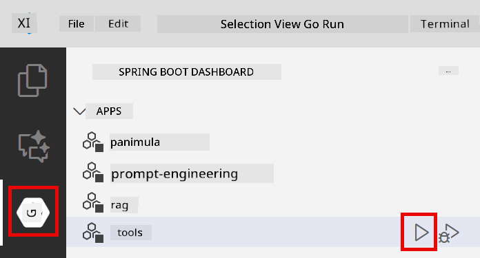
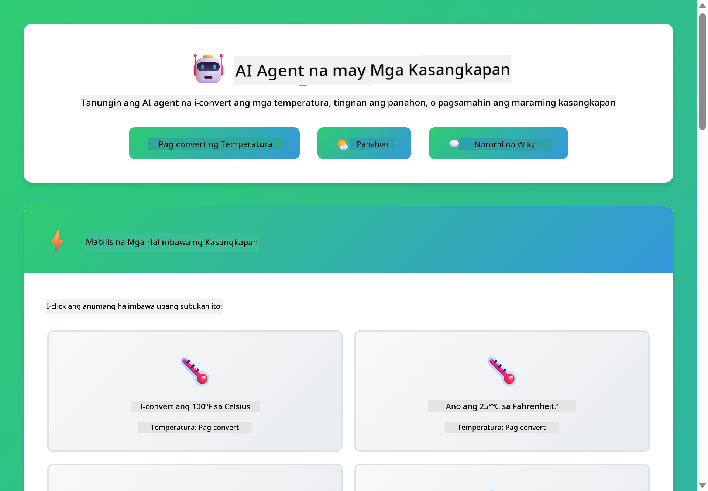

<!--
CO_OP_TRANSLATOR_METADATA:
{
  "original_hash": "aa23f106e7f53270924c9dd39c629004",
  "translation_date": "2025-12-13T19:13:20+00:00",
  "source_file": "04-tools/README.md",
  "language_code": "tl"
}
-->
# Module 04: Mga AI Agent na may Mga Kasangkapan

## Table of Contents

- [Ano ang Matututuhan Mo](../../../04-tools)
- [Mga Kinakailangan](../../../04-tools)
- [Pag-unawa sa AI Agents na may Mga Kasangkapan](../../../04-tools)
- [Paano Gumagana ang Pagtawag sa Kasangkapan](../../../04-tools)
  - [Mga Depinisyon ng Kasangkapan](../../../04-tools)
  - [Paggawa ng Desisyon](../../../04-tools)
  - [Pagpapatupad](../../../04-tools)
  - [Pagbuo ng Tugon](../../../04-tools)
- [Pagkakadena ng Kasangkapan](../../../04-tools)
- [Patakbuhin ang Aplikasyon](../../../04-tools)
- [Paggamit ng Aplikasyon](../../../04-tools)
  - [Subukan ang Simpleng Paggamit ng Kasangkapan](../../../04-tools)
  - [Subukan ang Pagkakadena ng Kasangkapan](../../../04-tools)
  - [Tingnan ang Daloy ng Usapan](../../../04-tools)
  - [Obserbahan ang Pangangatwiran](../../../04-tools)
  - [Magsagawa ng Eksperimento sa Iba't Ibang Kahilingan](../../../04-tools)
- [Mga Pangunahing Konsepto](../../../04-tools)
  - [ReAct Pattern (Pangangatwiran at Paggawa)](../../../04-tools)
  - [Mahalaga ang Mga Deskripsyon ng Kasangkapan](../../../04-tools)
  - [Pamamahala ng Sesyon](../../../04-tools)
  - [Paghawak ng Error](../../../04-tools)
- [Mga Magagamit na Kasangkapan](../../../04-tools)
- [Kailan Gagamitin ang Mga Agent na Batay sa Kasangkapan](../../../04-tools)
- [Mga Susunod na Hakbang](../../../04-tools)

## Ano ang Matututuhan Mo

Hanggang ngayon, natutunan mo kung paano makipag-usap sa AI, ayusin nang maayos ang mga prompt, at i-ugat ang mga tugon sa iyong mga dokumento. Ngunit may isang pangunahing limitasyon pa rin: ang mga language model ay makakalikha lamang ng teksto. Hindi nila kayang suriin ang panahon, magsagawa ng mga kalkulasyon, mag-query ng mga database, o makipag-ugnayan sa mga panlabas na sistema.

Binabago ito ng mga kasangkapan. Sa pagbibigay ng access sa modelo sa mga function na maaari nitong tawagan, nagiging isang agent ito na maaaring kumilos. Ang modelo ang nagdedesisyon kung kailan kailangan nito ng kasangkapan, kung alin ang gagamitin, at anong mga parameter ang ipapasa. Ang iyong code ang nagpapatupad ng function at nagbabalik ng resulta. Isinasama ng modelo ang resulta sa kanyang tugon.

## Mga Kinakailangan

- Natapos ang Module 01 (na-deploy ang Azure OpenAI resources)
- `.env` file sa root directory na may Azure credentials (nilikha ng `azd up` sa Module 01)

> **Tandaan:** Kung hindi mo pa natatapos ang Module 01, sundin muna ang mga tagubilin sa deployment doon.

## Pag-unawa sa AI Agents na may Mga Kasangkapan

Ang AI agent na may mga kasangkapan ay sumusunod sa pattern ng pangangatwiran at paggawa (ReAct):

1. Nagtanong ang user
2. Nagpapangatuwiran ang agent tungkol sa kailangan nitong malaman
3. Nagdedesisyon ang agent kung kailangan nito ng kasangkapan para sumagot
4. Kung oo, tinatawagan ng agent ang angkop na kasangkapan gamit ang tamang mga parameter
5. Pinapatupad ng kasangkapan at nagbabalik ng datos
6. Isinasama ng agent ang resulta at nagbibigay ng panghuling sagot


*Ang ReAct pattern - kung paano nagpapalitan ang AI agents ng pangangatwiran at paggawa upang lutasin ang mga problema*

Nangyayari ito nang awtomatiko. Ikaw ang nagdedeklara ng mga kasangkapan at ang kanilang mga deskripsyon. Ang modelo ang humahawak sa paggawa ng desisyon kung kailan at paano ito gagamitin.

## Paano Gumagana ang Pagtawag sa Kasangkapan

**Mga Depinisyon ng Kasangkapan** - [WeatherTool.java](../../../04-tools/src/main/java/com/example/langchain4j/agents/tools/WeatherTool.java) | [TemperatureTool.java](../../../04-tools/src/main/java/com/example/langchain4j/agents/tools/TemperatureTool.java)

Nagdedeklara ka ng mga function na may malinaw na mga deskripsyon at espesipikasyon ng mga parameter. Nakikita ng modelo ang mga deskripsyong ito sa system prompt nito at nauunawaan kung ano ang ginagawa ng bawat kasangkapan.

```java
@Component
public class WeatherTool {
    
    @Tool("Get the current weather for a location")
    public String getCurrentWeather(@P("Location name") String location) {
        // Ang iyong lohika sa paghahanap ng panahon
        return "Weather in " + location + ": 22°C, cloudy";
    }
}

@AiService
public interface Assistant {
    String chat(@MemoryId String sessionId, @UserMessage String message);
}

// Ang Assistant ay awtomatikong nakakabit ng Spring Boot sa:
// - ChatModel bean
// - Lahat ng @Tool na mga pamamaraan mula sa mga @Component na klase
// - ChatMemoryProvider para sa pamamahala ng sesyon
```

> **🤖 Subukan gamit ang [GitHub Copilot](https://github.com/features/copilot) Chat:** Buksan ang [`WeatherTool.java`](../../../04-tools/src/main/java/com/example/langchain4j/agents/tools/WeatherTool.java) at itanong:
> - "Paano ko isasama ang totoong weather API tulad ng OpenWeatherMap sa halip na mock data?"
> - "Ano ang bumubuo ng magandang deskripsyon ng kasangkapan na tumutulong sa AI na gamitin ito nang tama?"
> - "Paano ko hahawakan ang mga error sa API at mga rate limit sa mga implementasyon ng kasangkapan?"

**Paggawa ng Desisyon**

Kapag nagtanong ang user ng "Ano ang panahon sa Seattle?", nakikilala ng modelo na kailangan nito ang weather tool. Gumagawa ito ng function call na may parameter na lokasyon na "Seattle".

**Pagpapatupad** - [AgentService.java](../../../04-tools/src/main/java/com/example/langchain4j/agents/service/AgentService.java)

Awtomatikong ina-wire ng Spring Boot ang deklaratibong `@AiService` interface sa lahat ng nakarehistrong kasangkapan, at awtomatikong pinapatupad ng LangChain4j ang mga tawag sa kasangkapan.

> **🤖 Subukan gamit ang [GitHub Copilot](https://github.com/features/copilot) Chat:** Buksan ang [`AgentService.java`](../../../04-tools/src/main/java/com/example/langchain4j/agents/service/AgentService.java) at itanong:
> - "Paano gumagana ang ReAct pattern at bakit ito epektibo para sa mga AI agent?"
> - "Paano nagdedesisyon ang agent kung aling kasangkapan ang gagamitin at sa anong pagkakasunod?"
> - "Ano ang nangyayari kung pumalya ang pagpapatupad ng kasangkapan - paano ko dapat hawakan nang maayos ang mga error?"

**Pagbuo ng Tugon**

Tinatanggap ng modelo ang datos ng panahon at ini-format ito sa natural na tugon para sa user.

### Bakit Gamitin ang Declarative AI Services?

Ginagamit ng module na ito ang Spring Boot integration ng LangChain4j gamit ang deklaratibong `@AiService` interfaces:

- **Spring Boot auto-wiring** - Awtomatikong ini-inject ang ChatModel at mga kasangkapan
- **@MemoryId pattern** - Awtomatikong pamamahala ng memorya batay sa sesyon
- **Isang instance lang** - Isang beses nilikha ang assistant at muling ginagamit para sa mas mahusay na performance
- **Type-safe execution** - Direktang pagtawag sa mga Java method na may type conversion
- **Multi-turn orchestration** - Awtomatikong humahawak ng pagkakadena ng kasangkapan
- **Walang boilerplate** - Walang manual na AiServices.builder() calls o memory HashMap

Ang mga alternatibong paraan (manu-manong `AiServices.builder()`) ay nangangailangan ng mas maraming code at nawawala ang mga benepisyo ng Spring Boot integration.

## Pagkakadena ng Kasangkapan

**Pagkakadena ng Kasangkapan** - Maaaring tawagan ng AI ang maraming kasangkapan nang sunud-sunod. Itanong ang "Ano ang panahon sa Seattle at dapat ba akong magdala ng payong?" at panoorin itong ikadena ang `getCurrentWeather` kasama ang pangangatwiran tungkol sa gamit na pan-ulan.

<a href="images/tool-chaining.png"></a>

*Sunud-sunod na tawag sa kasangkapan - ang output ng isang kasangkapan ay pinapasok sa susunod na desisyon*

**Magandang Pagkabigo** - Magtanong tungkol sa panahon sa isang lungsod na wala sa mock data. Nagbabalik ang kasangkapan ng mensahe ng error, at ipinaliwanag ng AI na hindi ito makakatulong. Ligtas ang pagkabigo ng mga kasangkapan.

Nangyayari ito sa isang turn ng usapan. Ang agent ang nag-oorganisa ng maraming tawag sa kasangkapan nang awtonomo.

## Patakbuhin ang Aplikasyon

**Suriin ang deployment:**

Siguraduhing may `.env` file sa root directory na may Azure credentials (nilikha sa Module 01):
```bash
cat ../.env  # Dapat ipakita ang AZURE_OPENAI_ENDPOINT, API_KEY, DEPLOYMENT
```

**Simulan ang aplikasyon:**

> **Tandaan:** Kung sinimulan mo na ang lahat ng aplikasyon gamit ang `./start-all.sh` mula sa Module 01, tumatakbo na ang module na ito sa port 8084. Maaari mong laktawan ang mga utos sa pagsisimula sa ibaba at direktang pumunta sa http://localhost:8084.

**Opsyon 1: Gamit ang Spring Boot Dashboard (Inirerekomenda para sa mga gumagamit ng VS Code)**

Kasama sa dev container ang Spring Boot Dashboard extension, na nagbibigay ng visual na interface para pamahalaan ang lahat ng Spring Boot applications. Makikita mo ito sa Activity Bar sa kaliwang bahagi ng VS Code (hanapin ang icon ng Spring Boot).

Mula sa Spring Boot Dashboard, maaari mong:
- Tingnan ang lahat ng magagamit na Spring Boot applications sa workspace
- Simulan/hintuin ang mga aplikasyon sa isang click lang
- Tingnan ang mga log ng aplikasyon nang real-time
- Subaybayan ang status ng aplikasyon

I-click lang ang play button sa tabi ng "tools" para simulan ang module na ito, o simulan lahat ng module nang sabay-sabay.



**Opsyon 2: Gamit ang shell scripts**

Simulan lahat ng web applications (modules 01-04):

**Bash:**
```bash
cd ..  # Mula sa root na direktoryo
./start-all.sh
```

**PowerShell:**
```powershell
cd ..  # Mula sa root na direktoryo
.\start-all.ps1
```

O simulan lang ang module na ito:

**Bash:**
```bash
cd 04-tools
./start.sh
```

**PowerShell:**
```powershell
cd 04-tools
.\start.ps1
```

Awtomatikong niloload ng parehong script ang mga environment variable mula sa root `.env` file at bubuuin ang mga JAR kung wala pa.

> **Tandaan:** Kung nais mong manu-manong buuin lahat ng module bago simulan:
>
> **Bash:**
> ```bash
> cd ..  # Go to root directory
> mvn clean package -DskipTests
> ```
>
> **PowerShell:**
> ```powershell
> cd ..  # Go to root directory
> mvn clean package -DskipTests
> ```

Buksan ang http://localhost:8084 sa iyong browser.

**Para itigil:**

**Bash:**
```bash
./stop.sh  # Para lamang sa module na ito
# O
cd .. && ./stop-all.sh  # Lahat ng mga module
```

**PowerShell:**
```powershell
.\stop.ps1  # Para lamang sa module na ito
# O
cd ..; .\stop-all.ps1  # Lahat ng mga module
```

## Paggamit ng Aplikasyon

Nagbibigay ang aplikasyon ng web interface kung saan maaari kang makipag-ugnayan sa isang AI agent na may access sa mga kasangkapan para sa panahon at conversion ng temperatura.

<a href="images/tools-homepage.png"></a>

*Ang AI Agent Tools interface - mabilisang mga halimbawa at chat interface para makipag-ugnayan sa mga kasangkapan*

**Subukan ang Simpleng Paggamit ng Kasangkapan**

Magsimula sa isang tuwirang kahilingan: "I-convert ang 100 degrees Fahrenheit sa Celsius". Nakikilala ng agent na kailangan nito ang temperature conversion tool, tinatawagan ito gamit ang tamang mga parameter, at ibinabalik ang resulta. Pansinin kung gaano ito ka-natural - hindi mo kailangang tukuyin kung aling kasangkapan ang gagamitin o paano ito tatawagin.

**Subukan ang Pagkakadena ng Kasangkapan**

Ngayon subukan ang mas kumplikado: "Ano ang panahon sa Seattle at i-convert ito sa Fahrenheit?" Panoorin ang agent na gumagana nang hakbang-hakbang. Una nitong kinukuha ang panahon (na nagbabalik ng Celsius), nakikilala na kailangan nitong i-convert sa Fahrenheit, tinatawagan ang conversion tool, at pinagsasama ang parehong resulta sa isang tugon.

**Tingnan ang Daloy ng Usapan**

Pinananatili ng chat interface ang kasaysayan ng usapan, na nagpapahintulot sa iyo na magkaroon ng multi-turn na interaksyon. Makikita mo ang lahat ng mga naunang tanong at sagot, na nagpapadali sa pagsubaybay ng usapan at pag-unawa kung paano bumubuo ng konteksto ang agent sa maraming palitan.

<a href="images/tools-conversation-demo.png"></a>

*Multi-turn na usapan na nagpapakita ng simpleng conversion, pagtingin ng panahon, at pagkakadena ng kasangkapan*

**Magsagawa ng Eksperimento sa Iba't Ibang Kahilingan**

Subukan ang iba't ibang kumbinasyon:
- Pagtingin ng panahon: "Ano ang panahon sa Tokyo?"
- Conversion ng temperatura: "Ano ang 25°C sa Kelvin?"
- Pinagsamang mga tanong: "Suriin ang panahon sa Paris at sabihin kung ito ay higit sa 20°C"

Pansinin kung paano ini-interpret ng agent ang natural na wika at ini-map ito sa angkop na mga tawag sa kasangkapan.

## Mga Pangunahing Konsepto

**ReAct Pattern (Pangangatwiran at Paggawa)**

Nagpapalitan ang agent ng pangangatwiran (pagdedesisyon kung ano ang gagawin) at paggawa (paggamit ng mga kasangkapan). Pinapagana ng pattern na ito ang awtonomong paglutas ng problema sa halip na simpleng pagsagot sa mga utos.

**Mahalaga ang Mga Deskripsyon ng Kasangkapan**

Direktang naaapektuhan ng kalidad ng iyong mga deskripsyon ng kasangkapan kung gaano kahusay ito ginagamit ng agent. Ang malinaw at espesipikong mga deskripsyon ay tumutulong sa modelo na maunawaan kung kailan at paano tawagan ang bawat kasangkapan.

**Pamamahala ng Sesyon**

Pinapagana ng `@MemoryId` annotation ang awtomatikong pamamahala ng memorya batay sa sesyon. Bawat session ID ay nakakakuha ng sariling `ChatMemory` instance na pinamamahalaan ng `ChatMemoryProvider` bean, kaya hindi na kailangan ng manu-manong pagsubaybay ng memorya.

**Paghawak ng Error**

Maaaring pumalya ang mga kasangkapan - nag-timeout ang mga API, maaaring mali ang mga parameter, bumabagsak ang mga panlabas na serbisyo. Kailangan ng mga production agent ng paghawak ng error upang maipaliwanag ng modelo ang mga problema o subukan ang mga alternatibo.

## Mga Magagamit na Kasangkapan

**Mga Kasangkapan sa Panahon** (mock data para sa demonstrasyon):
- Kunin ang kasalukuyang panahon para sa isang lokasyon
- Kunin ang multi-day forecast

**Mga Kasangkapan sa Conversion ng Temperatura**:
- Celsius sa Fahrenheit
- Fahrenheit sa Celsius
- Celsius sa Kelvin
- Kelvin sa Celsius
- Fahrenheit sa Kelvin
- Kelvin sa Fahrenheit

Ito ay mga simpleng halimbawa, ngunit ang pattern ay maaaring i-extend sa anumang function: mga query sa database, tawag sa API, kalkulasyon, operasyon sa file, o mga utos ng sistema.

## Kailan Gagamitin ang Mga Agent na Batay sa Kasangkapan

**Gamitin ang mga kasangkapan kapag:**
- Nangangailangan ng real-time na datos (panahon, presyo ng stock, imbentaryo)
- Kailangan magsagawa ng mga kalkulasyon na lampas sa simpleng matematika
- Pag-access sa mga database o API
- Paggawa ng mga aksyon (pagpapadala ng email, paggawa ng ticket, pag-update ng mga rekord)
- Pagsasama-sama ng maraming pinagkukunan ng datos

**Huwag gamitin ang mga kasangkapan kapag:**
- Ang mga tanong ay masasagot mula sa pangkalahatang kaalaman
- Ang tugon ay purong usapan lang
- Ang latency ng kasangkapan ay magpapabagal ng karanasan

## Mga Susunod na Hakbang

**Susunod na Module:** [05-mcp - Model Context Protocol (MCP)](../05-mcp/README.md)

---

**Navigation:** [← Nakaraan: Module 03 - RAG](../03-rag/README.md) | [Bumalik sa Pangunahing Pahina](../README.md) | [Susunod: Module 05 - MCP →](../05-mcp/README.md)

---

<!-- CO-OP TRANSLATOR DISCLAIMER START -->
**Paalala**:
Ang dokumentong ito ay isinalin gamit ang AI translation service na [Co-op Translator](https://github.com/Azure/co-op-translator). Bagamat nagsusumikap kami para sa katumpakan, pakatandaan na ang mga awtomatikong pagsasalin ay maaaring maglaman ng mga pagkakamali o di-tumpak na impormasyon. Ang orihinal na dokumento sa orihinal nitong wika ang dapat ituring na pangunahing sanggunian. Para sa mahahalagang impormasyon, inirerekomenda ang propesyonal na pagsasalin ng tao. Hindi kami mananagot sa anumang hindi pagkakaunawaan o maling interpretasyon na maaaring magmula sa paggamit ng pagsasaling ito.
<!-- CO-OP TRANSLATOR DISCLAIMER END -->