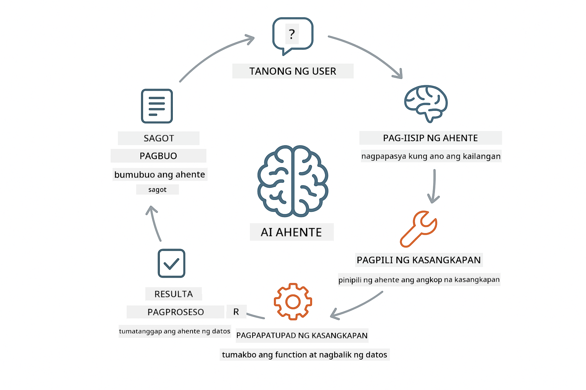
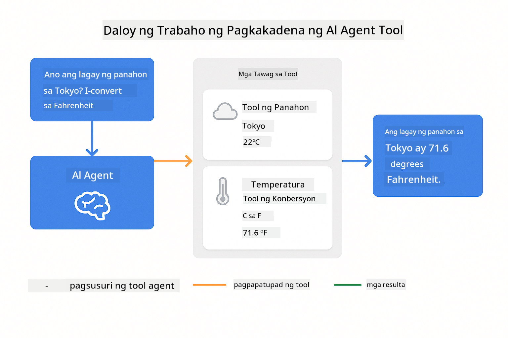
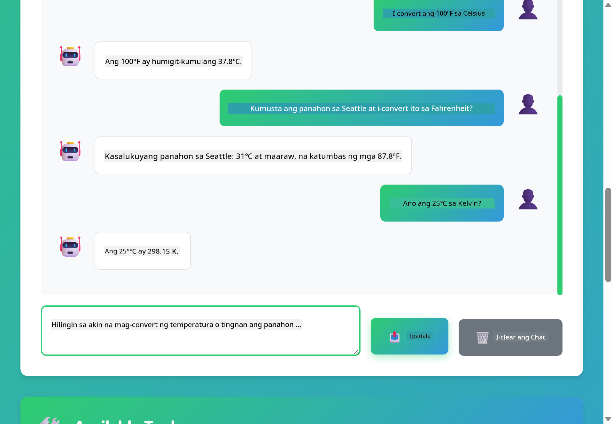

<!--
CO_OP_TRANSLATOR_METADATA:
{
  "original_hash": "844788938b26242f3cc54ce0d0951bea",
  "translation_date": "2026-01-06T00:33:47+00:00",
  "source_file": "04-tools/README.md",
  "language_code": "tl"
}
-->
# Module 04: AI Agents with Tools

## Table of Contents

- [What You'll Learn](../../../04-tools)
- [Prerequisites](../../../04-tools)
- [Understanding AI Agents with Tools](../../../04-tools)
- [How Tool Calling Works](../../../04-tools)
  - [Tool Definitions](../../../04-tools)
  - [Decision Making](../../../04-tools)
  - [Execution](../../../04-tools)
  - [Response Generation](../../../04-tools)
- [Tool Chaining](../../../04-tools)
- [Run the Application](../../../04-tools)
- [Using the Application](../../../04-tools)
  - [Try Simple Tool Usage](../../../04-tools)
  - [Test Tool Chaining](../../../04-tools)
  - [See Conversation Flow](../../../04-tools)
  - [Experiment with Different Requests](../../../04-tools)
- [Key Concepts](../../../04-tools)
  - [ReAct Pattern (Reasoning and Acting)](../../../04-tools)
  - [Tool Descriptions Matter](../../../04-tools)
  - [Session Management](../../../04-tools)
  - [Error Handling](../../../04-tools)
- [Available Tools](../../../04-tools)
- [When to Use Tool-Based Agents](../../../04-tools)
- [Next Steps](../../../04-tools)

## What You'll Learn

So far, natutunan mo kung paano makipag-usap sa AI, paano maayos na istraktura ang mga prompt, at ikabit ang mga sagot sa iyong mga dokumento. Ngunit may pangunahing limitasyon pa rin: ang mga language model ay makagagawa lamang ng teksto. Hindi nila kayang mag-check ng panahon, magsagawa ng kalkulasyon, mag-query sa mga database, o makipag-ugnayan sa mga panlabas na sistema.

Binabago ito ng mga tools. Sa pagbibigay ng access sa model ng mga function na maaari nitong tawagin, napapalitan mo ito mula sa isang tagagawa ng teksto patungo sa isang ahente na kayang kumilos. Ang model ang nagpapasya kung kailan kailangan nito ng tool, kung aling tool ang gagamitin, at anong mga parameter ang ipapasa. Isinasagawa ng iyong code ang function at ibinabalik ang resulta. Isinasama ng model ang resulta sa sagot nito.

## Prerequisites

- Natapos ang Module 01 (Azure OpenAI resources na-deploy na)
- `.env` file sa root directory na may Azure credentials (nalikha ng `azd up` sa Module 01)

> **Note:** Kung hindi mo pa natatapos ang Module 01, sundin muna ang mga tagubilin para sa deployment doon.

## Understanding AI Agents with Tools

> **📝 Note:** Ang salitang "agents" sa module na ito ay tumutukoy sa mga AI assistant na pinalakas ng kakayahang tumawag ng mga tool. Iba ito sa **Agentic AI** na mga pattern (mga autonomous agent na may planning, memorya, at multi-step reasoning) na tatalakayin natin sa [Module 05: MCP](../05-mcp/README.md).

Ang AI agent na may mga tools ay sumusunod sa isang pattern na reasoning at acting (ReAct):

1. Nagtanong ang user ng isang katanungan
2. Nagrereason ang agent kung ano ang kailangang malaman
3. Nagpapasya ang agent kung kailangan nito ng tool para sagutin
4. Kung oo, tinatawag ng agent ang angkop na tool gamit ang tamang mga parameter
5. Isinasagawa ng tool ang gawain at nagbabalik ng datos
6. Isinasama ng agent ang resulta at nagbibigay ng panghuling sagot



*Ang ReAct pattern - kung paano nagpapalitan ang AI agents ng pangangatwiran at pagkilos para lutasin ang mga problema*

Ito ay nangyayari nang awtomatiko. Iyon ang iyong itinakda na mga tool at ang kanilang mga deskripsyon. Ang model ang humahawak sa pagpapasya kung kailan at paano gamitin ang mga ito.

## How Tool Calling Works

### Tool Definitions

[WeatherTool.java](../../../04-tools/src/main/java/com/example/langchain4j/agents/tools/WeatherTool.java) | [TemperatureTool.java](../../../04-tools/src/main/java/com/example/langchain4j/agents/tools/TemperatureTool.java)

Nagde-define ka ng mga function na may malinaw na mga deskripsyon at mga espesipikasyon ng parameter. Nakikita ng model ang mga deskripsyong ito sa system prompt at nauunawaan kung ano ang ginagawa ng bawat tool.

```java
@Component
public class WeatherTool {
    
    @Tool("Get the current weather for a location")
    public String getCurrentWeather(@P("Location name") String location) {
        // Ang iyong lohika sa paghahanap ng panahon
        return "Weather in " + location + ": 22°C, cloudy";
    }
}

@AiService
public interface Assistant {
    String chat(@MemoryId String sessionId, @UserMessage String message);
}

// Ang Assistant ay awtomatikong nakakabit ng Spring Boot sa:
// - Bean ng ChatModel
// - Lahat ng @Tool na mga pamamaraan mula sa mga @Component na klase
// - ChatMemoryProvider para sa pamamahala ng session
```

> **🤖 Try with [GitHub Copilot](https://github.com/features/copilot) Chat:** Buksan ang [`WeatherTool.java`](../../../04-tools/src/main/java/com/example/langchain4j/agents/tools/WeatherTool.java) at itanong:
> - "Paano ko i-iintegrate ang totoong weather API tulad ng OpenWeatherMap imbes na mock data?"
> - "Ano ang gumagawa ng magandang tool description na tumutulong sa AI na gamitin ito nang tama?"
> - "Paano ako humahandle ng mga error sa API at rate limits sa implementasyon ng tool?"

### Decision Making

Kapag nagtanong ang user ng "What's the weather in Seattle?", nakikilala ng model na kailangan nito ang weather tool. Gumagawa ito ng tawag sa function na may parameter ng lokasyon na "Seattle".

### Execution

[AgentService.java](../../../04-tools/src/main/java/com/example/langchain4j/agents/service/AgentService.java)

Awtomatikong ina-auto-wire ng Spring Boot ang deklaratibong `@AiService` interface sa lahat ng nairehistrong mga tool, at awtomatikong isinasagawa ng LangChain4j ang mga tawag ng tool.

> **🤖 Try with [GitHub Copilot](https://github.com/features/copilot) Chat:** Buksan ang [`AgentService.java`](../../../04-tools/src/main/java/com/example/langchain4j/agents/service/AgentService.java) at itanong:
> - "Paano gumagana ang ReAct pattern at bakit ito epektibo para sa mga AI agents?"
> - "Paano nagpapasya ang agent kung aling tool ang gagamitin at sa anong pagkakasunod?"
> - "Ano ang nangyayari kapag pumalya ang pagsasagawa ng isang tool - paano ko hahandle nang maayos ang mga error?"

### Response Generation

Tinatanggap ng model ang mga datos ng panahon at ini-format ito sa isang natural na wikang sagot para sa user.

### Why Use Declarative AI Services?

Ginagamit ng module na ito ang integrasyon ng LangChain4j sa Spring Boot gamit ang deklaratibong `@AiService` interfaces:

- **Spring Boot auto-wiring** - Awtomatikong ini-inject ang ChatModel at mga tools
- **@MemoryId pattern** - Awtomatikong session-based na pamamahala ng memorya
- **Isang instance lang** - Assistant ay ginawa lamang minsan at nire-reuse para sa mas mahusay na performance
- **Type-safe execution** - Direktang pagtawag sa mga Java method na may type conversion
- **Multi-turn orchestration** - Awtomatikong humahandle ng tool chaining
- **Zero boilerplate** - Walang kailangang manwal na AiServices.builder() calls o memory HashMap

Ang mga alternatibong paraan (manwal na `AiServices.builder()`) ay nangangailangan ng mas maraming code at nawawala ang mga benepisyo ng Spring Boot integration.

## Tool Chaining

**Tool Chaining** - Maaaring tumawag ang AI ng sunud-sunod na maraming mga tool. Tanungin ang "What's the weather in Seattle and should I bring an umbrella?" at panoorin itong ikabit ang `getCurrentWeather` na may pangangatwiran tungkol sa rain gear.

<a href="images/tool-chaining.png"></a>

*Sunud-sunod na tawag ng tool - ang output ng isang tool ay ginagamit sa susunod na desisyon*

**Graceful Failures** - Humingi ng forecast sa isang lungsod na wala sa mock data. Nagbabalik ang tool ng error message, at ipinaliliwanag ng AI na hindi ito makakatulong. Ligtas ang mga pagkabigo ng tool.

Ito ay nangyayari sa iisang pag-uusap lang. Awtomatikong inaayos ng agent ang maraming tool calls.

## Run the Application

**Verify deployment:**

Siguraduhin na ang `.env` file ay nandiyan sa root directory na may Azure credentials (nalikha sa Module 01):
```bash
cat ../.env  # Dapat ipakita ang AZURE_OPENAI_ENDPOINT, API_KEY, DEPLOYMENT
```

**Start the application:**

> **Note:** Kung sinimulan mo na ang lahat ng applications gamit ang `./start-all.sh` mula sa Module 01, ang module na ito ay tumatakbo na sa port 8084. Maaari mong laktawan ang mga start command sa ibaba at pumunta diretso sa http://localhost:8084.

**Option 1: Using Spring Boot Dashboard (Inirerekomenda para sa mga gumagamit ng VS Code)**

Kasama sa dev container ang Spring Boot Dashboard extension, na nagbibigay ng visual interface para pamahalaan ang lahat ng Spring Boot applications. Makikita mo ito sa Activity Bar sa kaliwang bahagi ng VS Code (hanapin ang Spring Boot icon).

Mula sa Spring Boot Dashboard, maaari mong:
- Tingnan ang lahat ng available na Spring Boot applications sa workspace
- Simulan/hintuin ang mga application gamit ang isang click lang
- Tingnan ang mga application logs nang real-time
- Subaybayan ang status ng application

Pindutin lamang ang play button sa tabi ng "tools" para simulan ang module na ito, o simulan lahat ng module nang sabay.


**Option 2: Using shell scripts**

Simulan lahat ng web application (modules 01-04):

**Bash:**
```bash
cd ..  # Mula sa pangunahing direktoryo
./start-all.sh
```

**PowerShell:**
```powershell
cd ..  # Mula sa ugat na direktoryo
.\start-all.ps1
```

O simulan lang ang module na ito:

**Bash:**
```bash
cd 04-tools
./start.sh
```

**PowerShell:**
```powershell
cd 04-tools
.\start.ps1
```

Awtomatikong niloload ng mga script ang environment variables mula sa root `.env` file at itatayo ang mga JAR kung wala pa.

> **Note:** Kung gusto mong i-build lahat ng module nang manu-mano bago magsimula:
>
> **Bash:**
> ```bash
> cd ..  # Go to root directory
> mvn clean package -DskipTests
> ```
>
> **PowerShell:**
> ```powershell
> cd ..  # Go to root directory
> mvn clean package -DskipTests
> ```

Buksan ang http://localhost:8084 sa iyong browser.

**Para itigil:**

**Bash:**
```bash
./stop.sh  # Sa module na ito lang
# O
cd .. && ./stop-all.sh  # Lahat ng module
```

**PowerShell:**
```powershell
.\stop.ps1  # Sa module na ito lamang
# O
cd ..; .\stop-all.ps1  # Lahat ng modules
```

## Using the Application

Nagbibigay ang application ng web interface kung saan maaari kang makipag-ugnayan sa AI agent na may access sa weather at temperature conversion tools.

<a href="images/tools-homepage.png"></a>

*Ang AI Agent Tools interface - mabilisang mga halimbawa at chat interface para makipag-interact sa mga tools*

### Try Simple Tool Usage

Magsimula sa simpleng utos: "Convert 100 degrees Fahrenheit to Celsius". Nakikilala ng agent na kailangan nito ang temperature conversion tool, tinatawag ito gamit ang tamang mga parameter, at ibinabalik ang resulta. Pansinin kung gaano ito likas na pakiramdam - hindi mo kailangang sabihing aling tool ang gagamitin o paano ito tatawagin.

### Test Tool Chaining

Subukan ang mas kumplikadong tanong: "What's the weather in Seattle and convert it to Fahrenheit?" Panoorin ang agent na magtrabaho nang hakbang-hakbang. Una itong kukuha ng weather (na nagbabalik ng Celsius), napagtatanto na kailangang i-convert sa Fahrenheit, tinatawag ang conversion tool, at pinagsasama ang dalawang resulta sa isang sagot.

### See Conversation Flow

Pinapanatili ng chat interface ang kasaysayan ng pag-uusap, kaya maaari kang gumawa ng multi-turn na usapan. Makikita mo lahat ng mga nakaraang tanong at sagot, na nagpapadali para subaybayan ang pag-uusap at maintindihan kung paano bumubuo ng konteksto ang agent sa maraming palitan.

<a href="images/tools-conversation-demo.png"></a>

*Multi-turn na pag-uusap na nagpapakita ng simpleng conversion, paghahanap ng panahon, at tool chaining*

### Experiment with Different Requests

Subukan ang iba't ibang kumbinasyon:
- Mga paghahanap ng panahon: "What's the weather in Tokyo?"
- Mga conversion ng temperatura: "What is 25°C in Kelvin?"
- Pinagsamang mga tanong: "Check the weather in Paris and tell me if it's above 20°C"

Pansinin kung paano binibigyang-kahulugan ng agent ang natural na wika at iniaakma ito sa mga tamang tawag ng tool.

## Key Concepts

### ReAct Pattern (Reasoning and Acting)

Nagpapalitan ang agent ng pangangatwiran (nagpapasya kung ano ang gagawin) at pagkilos (paggamit ng mga tool). Pinapagana ng pattern na ito ang autonomous na paglutas ng problema kaysa basta sumagot lang ng instruksyon.

### Tool Descriptions Matter

Ang kalidad ng iyong mga deskripsyon ng tool ay direktang nakakaapekto kung paano ito ginagamit ng agent. Ang malinaw at espesipikong deskripsyon ay tumutulong sa modelo na maintindihan kung kailan at paano tawagin ang bawat tool.

### Session Management

Pinapagana ng anotasyong `@MemoryId` ang awtomatikong session-based na pamamahala ng memorya. Bawat session ID ay nakakakuha ng sariling `ChatMemory` instance na pinamamahalaan ng `ChatMemoryProvider` bean, kaya hindi na kailangan ng manwal na pagsubaybay ng memorya.

### Error Handling

Maaaring pumalya ang mga tool - mga API ay timeout, maaaring mali ang mga parameter, bumagsak ang mga panlabas na serbisyo. Kailangan ng mga production agent ng error handling para maipaliwanag ng model ang mga problema o subukan ang mga alternatibo.

## Available Tools

**Weather Tools** (mock data para sa demonstrasyon):
- Kunin ang kasalukuyang panahon para sa isang lokasyon
- Kunin ang multi-day forecast

**Temperature Conversion Tools**:
- Celsius papuntang Fahrenheit
- Fahrenheit papuntang Celsius
- Celsius papuntang Kelvin
- Kelvin papuntang Celsius
- Fahrenheit papuntang Kelvin
- Kelvin papuntang Fahrenheit

Ito ay simpleng mga halimbawa lang, pero ang pattern ay puwedeng palawakin sa anumang function: mga database query, tawag sa API, kalkulasyon, file operation, o mga utos ng sistema.

## When to Use Tool-Based Agents

**Gamitin ang mga tools kapag:**
- Kailangan ang real-time na datos (panahon, presyo ng stock, imbentaryo)
- Kailangan gumawa ng kalkulasyon lampas sa simpleng matematika
- Pag-access ng databases o APIs
- Pagsasagawa ng aksyon (magpadala ng email, gumawa ng ticket, i-update ang mga record)
- Pagsasama-sama ng maraming pinagkukunan ng datos

**Huwag gamitin ang mga tools kapag:**
- Ang mga tanong ay masasagot mula sa pangkalahatang kaalaman
- Puro pag-uusap lang ang sagot
- Ang latency ng tool ay magpapabagal ng karanasan

## Next Steps

**Next Module:** [05-mcp - Model Context Protocol (MCP)](../05-mcp/README.md)

---

**Navigation:** [← Previous: Module 03 - RAG](../03-rag/README.md) | [Back to Main](../README.md) | [Next: Module 05 - MCP →](../05-mcp/README.md)

---

<!-- CO-OP TRANSLATOR DISCLAIMER START -->
**Paunawa**:
Ang dokumentong ito ay isinalin gamit ang AI translation service na [Co-op Translator](https://github.com/Azure/co-op-translator). Bagamat nagsusumikap kami para sa katumpakan, pakitandaan na ang awtomatikong pagsasalin ay maaaring maglaman ng mga pagkakamali o hindi pagkakatugma. Ang orihinal na dokumento sa kanyang likas na wika ang dapat ituring na pangunahing sanggunian. Para sa mahahalagang impormasyon, inirerekomenda ang propesyonal na pagsasalin ng tao. Hindi kami mananagot sa anumang hindi pagkakaunawaan o maling interpretasyon na maaaring mangyari mula sa paggamit ng pagsasaling ito.
<!-- CO-OP TRANSLATOR DISCLAIMER END -->