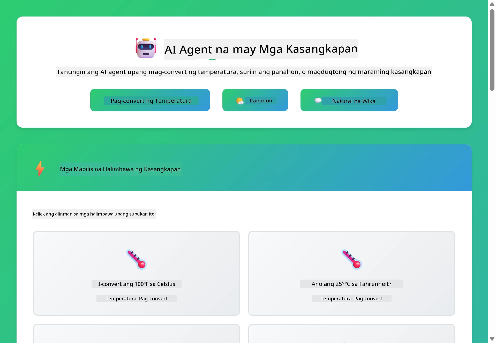
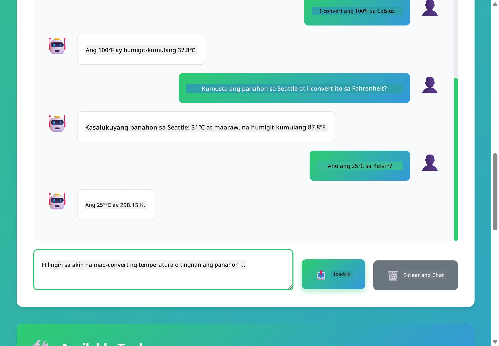

# Module 04: AI Agents with Tools

## Table of Contents

- [Video Walkthrough](#video-walkthrough)
- [What You'll Learn](#what-youll-learn)
- [Prerequisites](#prerequisites)
- [Understanding AI Agents with Tools](#understanding-ai-agents-with-tools)
- [How Tool Calling Works](#how-tool-calling-works)
  - [Tool Definitions](#tool-definitions)
  - [Decision Making](#decision-making)
  - [Execution](#execution)
  - [Response Generation](#response-generation)
  - [Architecture: Spring Boot Auto-Wiring](#architecture-spring-boot-auto-wiring)
- [Tool Chaining](#tool-chaining)
- [Run the Application](#run-the-application)
- [Using the Application](#paggamit-ng-application)
  - [Try Simple Tool Usage](#subukan-ang-simpleng-paggamit-ng-tools)
  - [Test Tool Chaining](#subukan-ang-pagsasunud-sunod-ng-tools)
  - [See Conversation Flow](#tingnan-ang-daloy-ng-usapan)
  - [Experiment with Different Requests](#eksperimento-sa-ibat-ibang-kahilingan)
- [Key Concepts](#mga-pangunahing-konsepto)
  - [ReAct Pattern (Reasoning and Acting)](#react-pattern-pagrason-at-pag-aksyon)
  - [Tool Descriptions Matter](#mahalaga-ang-mga-deskripsyon-ng-tool)
  - [Session Management](#pamamahala-ng-session)
  - [Error Handling](#pag-handle-ng-error)
- [Available Tools](#mga-available-na-tool)
- [When to Use Tool-Based Agents](#kailan-gamitin-ang-mga-tool-based-na-agents)
- [Tools vs RAG](#tools-vs-rag)
- [Next Steps](#mga-susunod-na-hakbang)

## Video Walkthrough

Panoorin ang live session na ito na nagpapaliwanag kung paano magsimula gamit ang module na ito:

<a href="https://www.youtube.com/watch?v=O_J30kZc0rw"></a>

## What You'll Learn

Hanggang ngayon, natutunan mo kung paano makipag-usap sa AI, ayusin nang maayos ang mga prompt, at gawing basehan ang iyong mga dokumento sa mga sagot. Ngunit may pangunahing limitasyon pa rin: ang mga language model ay kaya lamang gumawa ng teksto. Hindi nila kayang mag-check ng panahon, magsagawa ng mga kalkulasyon, mag-query sa mga database, o makipag-ugnayan sa mga panlabas na sistema.

Binabago ito ng mga Tools. Sa pagbibigay ng access sa modelo sa mga function na maaari nitong tawagan, napapalitan mo ito mula sa pagiging tagalikha ng teksto tungo sa pagiging isang agent na kayang gumawa ng mga aksyon. Ang modelo ang nagpapasya kung kailan kailangan nito ng tool, alin ang gagamitin, at kung anong mga parameter ang ipapasa. Isinasagawa ng iyong code ang function at ibinabalik ang resulta. Isinasama ng modelo ang resulta sa kanyang tugon.

## Prerequisites

- Nakumpleto ang [Module 01 - Introduction](../01-introduction/README.md) (na-deploy ang Azure OpenAI resources)
- Nakumpleto ang mga naunang module na inirerekomenda (ang module na ito ay nagre-refer sa [mga konsepto ng RAG mula sa Module 03](../03-rag/README.md) sa paghahambing ng Tools vs RAG)
- `.env` file sa root directory na may Azure credentials (nilikha gamit ang `azd up` sa Module 01)

> **Note:** Kung hindi mo pa natatapos ang Module 01, sundin muna ang mga tagubilin doon para sa deployment.

## Understanding AI Agents with Tools

> **📝 Note:** Ang salitang "agents" sa module na ito ay tumutukoy sa mga AI assistants na pinalakas ng kakayahang tumawag ng mga tool. Iba ito sa mga **Agentic AI** patterns (autonomous agents na may planning, memory, at multi-step reasoning) na tatalakayin sa [Module 05: MCP](../05-mcp/README.md).

Kung walang tools, ang language model ay kaya lamang gumawa ng teksto mula sa pinag-aralang datos. Kapag tinanong mo ito tungkol sa kasalukuyang panahon, huhulaan lang nito. Kung bibigyan mo ito ng mga tools, kaya nitong tumawag ng isang weather API, magsagawa ng mga kalkulasyon, o mag-query ng database — tapos ihalo ang mga totoong resulta sa kanyang sagot.


*Kapag walang tools, huhulaan lang ng modelo — kung may tools, kaya nitong tumawag ng APIs, magsagawa ng kalkulasyon, at magbalik ng real-time na datos.*

Ang isang AI agent na may tools ay sumusunod sa **Reasoning and Acting (ReAct)** pattern. Hindi lang basta sumasagot ang modelo — iniisip nito kung ano ang kailangan, kumikilos sa pamamagitan ng pagtawag ng tool, sinusuri ang resulta, at pagkatapos ay nagpapasya kung uulitin ang aksyon o ibibigay ang panghuling sagot:

1. **Reason** — Sinusuri ng agent ang tanong ng user at tinutukoy kung anong impormasyon ang kailangan nito
2. **Act** — Pinipili ng agent ang tamang tool, ginagawa ang wastong mga parameter, at tinatawagan ito
3. **Observe** — Tinatanggap ng agent ang output ng tool at sinusuri ang resulta
4. **Repeat or Respond** — Kung kailangan pa ng karagdagang data, uulit ang cycle; kung hindi, bumubuo ng sagot sa natural na wika


*Ang siklo ng ReAct — iniisip ng agent kung ano ang gagawin, kumikilos sa pamamagitan ng pagtawag ng tool, sinusuri ang resulta, at inuulit hanggang maibigay ang panghuling sagot.*

Nangyayari ito nang awtomatiko. Ikaw ang nagdedeklara ng mga tool at ang kanilang mga paglalarawan. Ang modelo ang humahawak ng pagpapasya kung kailan at paano ito gagamitin.

## How Tool Calling Works

### Tool Definitions

[WeatherTool.java](../../../04-tools/src/main/java/com/example/langchain4j/agents/tools/WeatherTool.java) | [TemperatureTool.java](../../../04-tools/src/main/java/com/example/langchain4j/agents/tools/TemperatureTool.java)

Nagdedeklara ka ng mga function na may malinaw na paglalarawan at pagtukoy sa mga parameter. Nakikita ng modelo ang mga paglalarawang ito sa prompt ng sistema at nauunawaan kung ano ang ginagawa ng bawat tool.

```java
@Component
public class WeatherTool {
    
    @Tool("Get the current weather for a location")
    public String getCurrentWeather(@P("Location name") String location) {
        // Ang iyong lohika sa paghahanap ng panahon
        return "Weather in " + location + ": 22°C, cloudy";
    }
}

@AiService
public interface Assistant {
    String chat(@MemoryId String sessionId, @UserMessage String message);
}

// Awtomatikong nakakabit ang Assistant sa pamamagitan ng Spring Boot gamit ang:
// - ChatModel bean
// - Lahat ng @Tool na mga metodo mula sa mga @Component na klase
// - ChatMemoryProvider para sa pamamahala ng session
```

Pinaghiwa-hiwalay ng diagram sa ibaba ang bawat anotasyon at ipinapakita kung paano tinutulungan ng bawat bahagi ang AI na maunawaan kung kailan tatawagin ang tool at anong mga argumento ang ipapasa:


*Anatomiya ng isang tool definition — sinasabi ng @Tool sa AI kung kailan gagamitin ito, inilalarawan ng @P ang bawat parameter, at pinag-uugnay ng @AiService ang lahat sa pagsisimula.*

> **🤖 Subukan gamit ang [GitHub Copilot](https://github.com/features/copilot) Chat:** Buksan ang [`WeatherTool.java`](../../../04-tools/src/main/java/com/example/langchain4j/agents/tools/WeatherTool.java) at itanong:
> - "Paano ko isasama ang totoong weather API tulad ng OpenWeatherMap sa halip na mock data?"
> - "Ano ang mga katangian ng magandang paglalarawan ng tool na tumutulong sa AI na gamitin ito nang tama?"
> - "Paano ko haharapin ang mga error sa API at mga rate limit sa mga implementasyon ng tool?"

### Decision Making

Kapag tinanong ng user na "Ano ang lagay ng panahon sa Seattle?", hindi basta pumipili ng tool ang modelo nang random. Kinukumpara nito ang layunin ng user sa bawat paglalarawan ng tool na mayroon ito, binibilang ang kahalagahan ng bawat isa, at pinipili ang pinakamainam. Gumagawa ito ng istrakturadong tawag sa function na may tamang mga parameter — sa kasong ito, itinakda ang `location` sa `"Seattle"`.

Kung walang tumutugmang tool sa kahilingan ng user, bumabalik ang modelo sa pagsagot mula sa sariling kaalaman. Kung maraming tool ang tumutugma, pinipili nito ang pinaka-tiyak.


*Sinusuri ng modelo ang bawat tool laban sa layunin ng user at pinipili ang pinakamainam — kaya mahalaga ang pagsulat ng malinaw at tiyak na mga paglalarawan ng tool.*

### Execution

[AgentService.java](../../../04-tools/src/main/java/com/example/langchain4j/agents/service/AgentService.java)

Ang Spring Boot ay awtomatikong nag-a-wire sa declarative `@AiService` interface na may lahat ng nairehistrong mga tool, at awtomatikong isinasagawa ng LangChain4j ang mga tawag sa tool. Sa likod ng eksena, dumadaloy ang isang buong tawag sa tool sa anim na yugto — mula sa tanong ng user sa natural na wika hanggang sa sagot sa natural na wika:


*Ang end-to-end na daloy — nagtatanong ang user, pumipili ang modelo ng tool, isinasagawa ito ng LangChain4j, at isinamasama ng modelo ang resulta sa natural na tugon.*

Sa likod ng eksena, nagpapatakbo ang `AiServices` ng parehong loop sa pagtawag ng tool para sa anumang tool — dito ipinapakita gamit ang simpleng `Calculator`. Ipinapakita ng sequence diagram sa ibaba kung ano talaga ang nangyayari:


*Ang loop sa pagtawag ng tool — ipinapadala ng `AiServices` ang iyong mensahe at schemas ng tool sa LLM, sumasagot ang LLM ng function call tulad ng `add(42, 58)`, isinasagawa ng LangChain4j ang method ng `Calculator` sa lokal, at binabalik ang resulta para sa panghuling sagot.*

> **🤖 Subukan gamit ang [GitHub Copilot](https://github.com/features/copilot) Chat:** Buksan ang [`AgentService.java`](../../../04-tools/src/main/java/com/example/langchain4j/agents/service/AgentService.java) at itanong:
> - "Paano gumagana ang ReAct pattern at bakit ito epektibo para sa mga AI agent?"
> - "Paano nagpasiya ang agent kung anong tool ang gagamitin at sa anong pagkakasunod?"
> - "Ano ang nangyayari kung mabigo ang pagtawag sa tool — paano dapat ako humawak ng mga error nang matibay?"

### Response Generation

Tinatanggap ng modelo ang datos ng panahon at inaayos ito bilang sagot sa natural na wika para sa user.

### Architecture: Spring Boot Auto-Wiring

Gamit ang module na ito ang integration ng LangChain4j sa Spring Boot na may declarative `@AiService` interfaces. Sa pagsisimula, natutuklasan ng Spring Boot ang bawat `@Component` na naglalaman ng `@Tool` methods, ang iyong `ChatModel` bean, at ang `ChatMemoryProvider` — tapos inilalagay lahat sa isang `Assistant` interface nang walang anumang karagdagang boilerplate.


*Pinagsasama ng @AiService interface ang ChatModel, mga tool component, at provider ng memorya — awtomatikong inaayos ng Spring Boot ang lahat.*

Narito ang buong lifecycle ng request bilang sequence diagram — mula sa HTTP request, controller, service, auto-wired proxy, hanggang sa pagtawag ng tool at balik:


*Buong lifecycle ng Spring Boot request — dumadaloy ang HTTP request sa controller at service papunta sa auto-wired Assistant proxy, na inaayos ang LLM at mga tawag sa tool nang awtomatiko.*

Mga pangunahing benepisyo ng ganitong approach:

- **Spring Boot auto-wiring** — Awtomatikong na-inject ang ChatModel at mga tool
- **@MemoryId pattern** — Awtomatikong session-based na pamamahala ng memorya
- **Isang instance lang** — Ang Assistant ay isang beses lang nilikha at ginagamit muli para sa mas mahusay na performance
- **Type-safe na pagsasagawa** — Direct call sa mga Java method na may type conversion
- **Multi-turn orchestration** — Awtomatikong humahawak sa tool chaining
- **Zero boilerplate** — Walang manual na `AiServices.builder()` calls o memory HashMap

Ang mga alternatibong paraan (manwal na `AiServices.builder()`) ay nangangailangan ng mas maraming code at wala ang benepisyo ng Spring Boot integration.

## Tool Chaining

**Tool Chaining** — Lumilitaw ang tunay na lakas ng mga agent na batay sa tool kapag ang isang tanong ay nangangailangan ng maraming mga tool. Kapag tinanong na "Ano ang lagay ng panahon sa Seattle sa Fahrenheit?" awtomatikong nagsusunod ang agent ng dalawang tool: una, tinatawag ang `getCurrentWeather` para makuha ang temperatura sa Celsius, pagkatapos ay ipinapasa ang halagang iyon sa `celsiusToFahrenheit` para sa conversion — lahat sa isang usapan.


*Tool chaining na aktibo — tinatawag muna ng agent ang getCurrentWeather, pinapasa ang resultang Celsius sa celsiusToFahrenheit, at naghahatid ng pinagsamang sagot.*

**Graceful Failures** — Kapag naghiling ng panahon sa isang lungsod na wala sa mock data, nagbabalik ang tool ng mensahe ng error, at ipinaliwanag ng AI na hindi ito makakatulong sa halip na mag-crash. Ligtas na bumabangga ang mga tool. Ipinapakita ng diagram sa ibaba ang pagkakaiba ng dalawang approach — sa tamang paghawak ng error, nahuhuli ng agent ang exception at tumutugon nang maayos, habang kung wala nito, nagy-crash ang buong app:


*Kapag nabigo ang isang tool, nahuhuli ng agent ang error at tumutugon nang may paliwanag sa halip na mag-crash.*

Nangyayari ito sa isang usapan lang. Awtomatikong pinangangasiwaan ng agent ang maraming tawag sa tool.

## Run the Application

**I-verify ang deployment:**

Siguraduhing may `.env` file sa root directory na may Azure credentials (nalikha sa Module 01). Patakbuhin ito mula sa module directory (`04-tools/`):

**Bash:**
```bash
cat ../.env  # Dapat ipakita ang AZURE_OPENAI_ENDPOINT, API_KEY, DEPLOYMENT
```

**PowerShell:**
```powershell
Get-Content ..\.env  # Dapat ipakita ang AZURE_OPENAI_ENDPOINT, API_KEY, DEPLOYMENT
```

**Simulan ang aplikasyon:**

> **Note:** Kung sinimulan mo na ang lahat ng aplikasyon gamit ang `./start-all.sh` mula sa root directory (tulad ng inilalahad sa Module 01), tumatakbo na ang module na ito sa port 8084. Maaari mo nang laktawan ang mga start command sa ibaba at puntahan nang diretso ang http://localhost:8084.

**Option 1: Gamit ang Spring Boot Dashboard (Inirerekomenda para sa mga gumagamit ng VS Code)**

Kasama sa dev container ang Spring Boot Dashboard extension, na nagbibigay ng biswal na interface para pamahalaan ang lahat ng Spring Boot application. Makikita ito sa Activity Bar sa kaliwang bahagi ng VS Code (hanapin ang Spring Boot icon).

Mula sa Spring Boot Dashboard, maaari mong:
- Makita ang lahat ng available na Spring Boot application sa workspace
- Simulan/hinto ang mga aplikasyon sa isang click lang
- Tingnan ang logs ng aplikasyon nang real-time
- Subaybayan ang status ng aplikasyon

I-click lang ang play button sa tabi ng "tools" para simulan ang module na ito, o simulan lahat ng module nang sabay-sabay.

Ganito ang hitsura ng Spring Boot Dashboard sa VS Code:


*Ang Spring Boot Dashboard sa VS Code — simulan, ihinto, at subaybayan ang lahat ng module mula sa isang lugar*

**Option 2: Paggamit ng shell scripts**

Simulan ang lahat ng web application (modules 01-04):

**Bash:**
```bash
cd ..  # Mula sa ugat na direktoryo
./start-all.sh
```

**PowerShell:**
```powershell
cd ..  # Mula sa root na direktoryo
.\start-all.ps1
```

O simulan lamang ang module na ito:

**Bash:**
```bash
cd 04-tools
./start.sh
```

**PowerShell:**
```powershell
cd 04-tools
.\start.ps1
```

Ang dalawang script ay awtomatikong naglo-load ng environment variables mula sa root `.env` file at magbu-build ng mga JAR kung wala pa ang mga ito.

> **Note:** Kung nais mong manu-manong i-build ang lahat ng module bago magsimula:
>
> **Bash:**
> ```bash
> cd ..  # Go to root directory
> mvn clean package -DskipTests
> ```
>
> **PowerShell:**
> ```powershell
> cd ..  # Go to root directory
> mvn clean package -DskipTests
> ```

Buksan ang http://localhost:8084 sa iyong browser.

**Para ihinto:**

**Bash:**
```bash
./stop.sh  # Para lamang sa modulong ito
# O
cd .. && ./stop-all.sh  # Lahat ng mga module
```

**PowerShell:**
```powershell
.\stop.ps1  # Module lamang ito
# O
cd ..; .\stop-all.ps1  # Lahat ng module
```

## Paggamit ng Application

Nagbibigay ang application ng web interface kung saan maaari kang makipag-ugnayan sa isang AI agent na may access sa mga tool para sa panahon at pag-convert ng temperatura. Ganito ang hitsura ng interface — may kasamang mabilisang halimbawa at isang chat panel para magpadala ng mga kahilingan:

<a href="images/tools-homepage.png"></a>

*Ang AI Agent Tools interface - mabilisang mga halimbawa at chat interface para makipag-ugnayan sa mga tool*

### Subukan ang Simpleng Paggamit ng Tools

Magsimula sa isang tuwirang kahilingan: "Convert 100 degrees Fahrenheit to Celsius". Nakikita ng agent na kailangan nito ang temperature conversion tool, ginagamit ito sa tamang mga parameter, at ibinabalik ang resulta. Pansinin kung gaano ito ka-natural — hindi mo tinukoy kung aling tool ang gagamitin o kung paano ito tatawagin.

### Subukan ang Pagsasunud-sunod ng Tools

Ngayon subukan ang mas kumplikado: "What's the weather in Seattle and convert it to Fahrenheit?" Obserbahan ang agent na ginagawa ito sa mga hakbang. Una niyang kinukuha ang panahon (na nagbabalik ng Celsius), nakikita na kailangan niyang i-convert sa Fahrenheit, tinatawagan ang conversion tool, at pinagsasama ang dalawang resulta sa isang tugon.

### Tingnan ang Daloy ng Usapan

Pinananatili ng chat interface ang kasaysayan ng pag-uusap, na nagpapahintulot sa iyo na magkaroon ng multi-turn na interaksyon. Makikita mo ang lahat ng naunang mga query at sagot, na nagpapadali upang subaybayan ang usapan at maunawaan kung paano nagtatayo ng konteksto ang agent sa maraming palitan.

<a href="images/tools-conversation-demo.png"></a>

*Multi-turn na pag-uusap na nagpapakita ng simpleng mga conversion, pagtingin sa panahon, at pagsasunud-sunod ng tool*

### Eksperimento sa Iba't Ibang Kahilingan

Subukan ang iba't ibang kumbinasyon:
- Pagtingin sa panahon: "What's the weather in Tokyo?"
- Pag-convert ng temperatura: "What is 25°C in Kelvin?"
- Pinaghalong mga query: "Check the weather in Paris and tell me if it's above 20°C"

Pansinin kung paano iniintindi ng agent ang natural na wika at iniaangkop ito sa tamang tawag sa mga tool.

## Mga Pangunahing Konsepto

### ReAct Pattern (Pagrason at Pag-aksyon)

Ang agent ay nag-iiba-iba sa pagitan ng pagrarason (pagpapasya kung ano ang gagawin) at pag-aksyon (paggamit ng mga tool). Pinapagana ng pattern na ito ang autonomous na paglutas ng problema sa halip na simpleng pagsunod sa mga utos.

### Mahalaga ang Mga Deskripsyon ng Tool

Direktang naaapektuhan ng kalidad ng iyong mga deskripsyon ng tool kung gaano kagaling gamitin ng agent ang mga ito. Ang malinaw at tiyak na mga deskripsyon ay tumutulong sa modelong maunawaan kung kailan at paano tatawagin ang bawat tool.

### Pamamahala ng Session

Pinapayagan ng annotation na `@MemoryId` ang awtomatikong pamamahala ng memorya base sa session. Bawat session ID ay may sariling `ChatMemory` na pinamamahalaan ng `ChatMemoryProvider` bean, kaya maraming users ang maaaring makipag-ugnayan sa agent nang sabay-sabay nang hindi nagkakahalo ang kanilang mga usapan. Ipinapakita ng sumusunod na diagram kung paano ipinapasa ang maraming users sa hiwalay na memory stores batay sa kanilang session IDs:


*Bawat session ID ay tumutugma sa hiwalay na kasaysayan ng pag-uusap — hindi nakikita ng mga user ang mga mensahe ng iba.*

### Pag-handle ng Error

Maaaring mag-fail ang mga tool — maarong ma-timeout ang APIs, maaaring maging invalid ang mga parameter, o bumagsak ang mga external services. Kinakailangan ng mga production agent ang paghawak ng error upang maipaliwanag ng model kung ano ang problema o subukang gumawa ng alternatibo sa halip na bumagsak ang buong application. Kapag may tool na nag-throw ng exception, hinuhuli ito ng LangChain4j at ibinabalik ang mensahe ng error sa model, na pagkatapos ay kayang ipaliwanag ang problema gamit ang natural na wika.

## Mga Available na Tool

Ipinapakita ng diagram sa ibaba ang malawak na ecosystem ng mga tool na maaaring buuin. Ipinapakita ng module na ito ang mga tool para sa panahon at temperatura, pero ang parehong pattern na `@Tool` ay gumagana para sa anumang Java method — mula sa mga database query hanggang sa pagproseso ng bayad.


*Ang anumang Java method na may annotation na @Tool ay nagiging available sa AI — umaabot ang pattern na ito sa databases, APIs, email, operasyon sa file, at iba pa.*

## Kailan Gamitin ang Mga Tool-Based na Agents

Hindi lahat ng kahilingan ay nangangailangan ng mga tool. Nakasalalay ang desisyon kung kailangan ba ng AI na makipag-ugnayan sa mga external system o kaya ay masagot ito mula sa sarili nitong kaalaman. Narito ang isang gabay na nagbubuod kung kailan may silbi ang mga tool at kung kailan hindi ito kailangan:


*Isang mabilis na gabay sa desisyon — ang mga tool ay para sa real-time na data, kalkulasyon, at mga aksyon; ang pangkalahatang kaalaman at malikhaing gawain ay hindi nangangailangan nito.*

## Tools vs RAG

Pinapalawak ng Modules 03 at 04 kung ano ang kaya ng AI, ngunit sa dalawang magkaibang paraan. Ang RAG ay nagbibigay ng access sa **kaalaman** sa pamamagitan ng pagkuha ng mga dokumento. Ang mga Tool naman ay nagbibigay ng kakayahan sa model na magsagawa ng **mga aksyon** sa pamamagitan ng pagtawag ng mga function. Ipinapakita ng diagram sa ibaba ang paghahambing ng dalawang approach na ito — mula sa kung paano gumagana ang bawat workflow hanggang sa mga kalamangan at kahinaan nila:


*Kinukuha ng RAG ang impormasyon mula sa mga static na dokumento — Ang Tools ay nagsasagawa ng mga aksyon at kumukuha ng dinamiko, real-time na data. Maraming production system ang pinagsasama ang pareho.*

Sa praktika, maraming production system ang pinagsasama ang dalawang approach: RAG para gawing grounded ang mga sagot sa iyong dokumentasyon, at Tools para kumuha ng live na data o magsagawa ng mga operasyon.

## Mga Susunod na Hakbang

**Next Module:** [05-mcp - Model Context Protocol (MCP)](../05-mcp/README.md)

---

**Navigation:** [← Previous: Module 03 - RAG](../03-rag/README.md) | [Back to Main](../README.md) | [Next: Module 05 - MCP →](../05-mcp/README.md)

---

<!-- CO-OP TRANSLATOR DISCLAIMER START -->
**Pagtatanggi**:
Ang dokumentong ito ay isinalin gamit ang serbisyo ng AI translation na [Co-op Translator](https://github.com/Azure/co-op-translator). Bagama't nagsusumikap kami para sa katumpakan, pakatandaan na ang awtomatikong pagsasalin ay maaaring maglaman ng mga pagkakamali o hindi pagkakatugma. Ang orihinal na dokumento sa orihinal nitong wika ang dapat ituring na pangunahing sanggunian. Para sa mahahalagang impormasyon, inirerekomenda ang propesyonal na pagsasalin ng tao. Hindi kami mananagot sa anumang maling pagkakaintindi o maling interpretasyon na nagmula sa paggamit ng pagsasaling ito.
<!-- CO-OP TRANSLATOR DISCLAIMER END -->