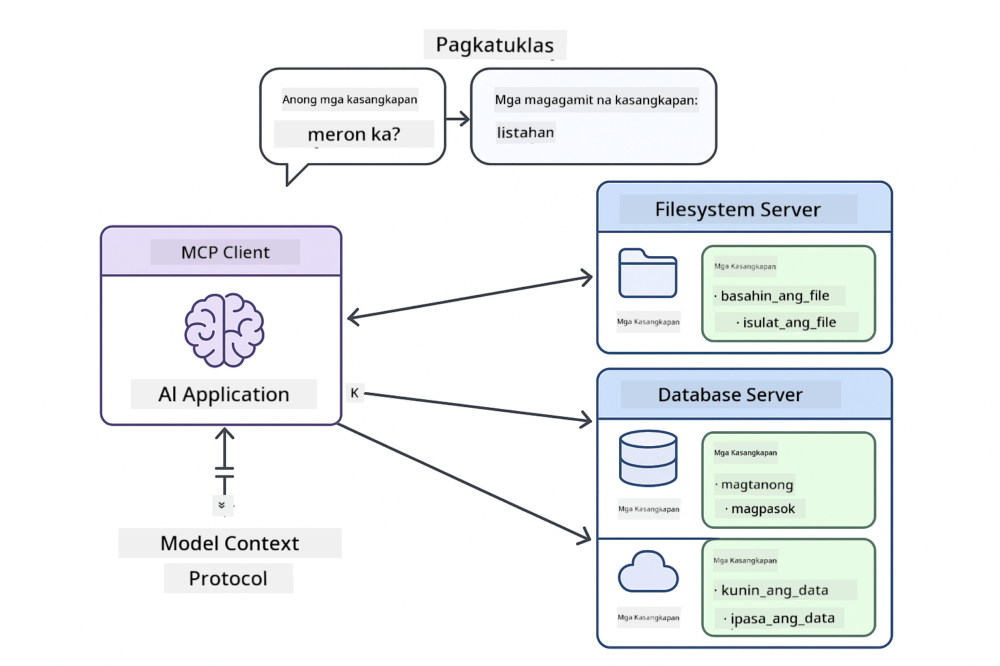
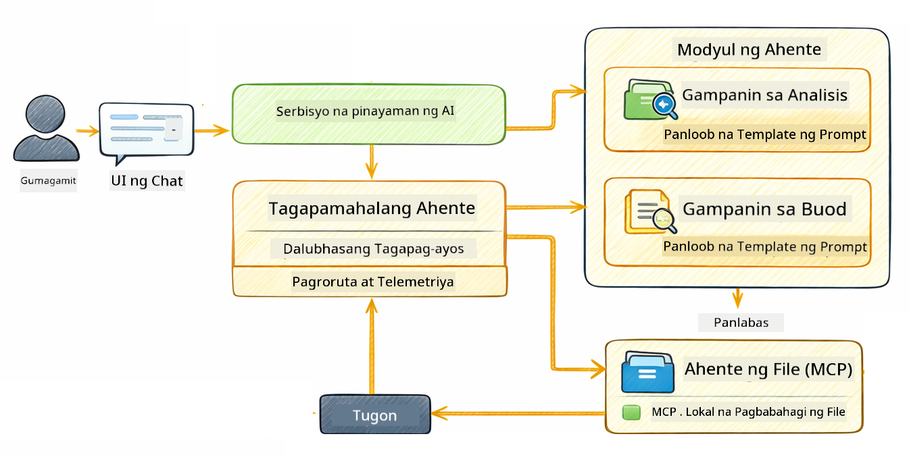

<!--
CO_OP_TRANSLATOR_METADATA:
{
  "original_hash": "f89f4c106d110e4943c055dd1a2f1dff",
  "translation_date": "2025-12-31T03:26:36+00:00",
  "source_file": "05-mcp/README.md",
  "language_code": "tl"
}
-->
# Modyul 05: Model Context Protocol (MCP)

## Talaan ng Nilalaman

- [Ano ang Matututunan Mo](../../../05-mcp)
- [Ano ang MCP?](../../../05-mcp)
- [Paano Gumagana ang MCP](../../../05-mcp)
- [Ang Agentic Module](../../../05-mcp)
- [Pagpapatakbo ng mga Halimbawa](../../../05-mcp)
  - [Mga Kinakailangan](../../../05-mcp)
- [Mabilis na Pagsisimula](../../../05-mcp)
  - [Mga Operasyon sa File (Stdio)](../../../05-mcp)
  - [Supervisor Agent](../../../05-mcp)
    - [Pag-unawa sa Output](../../../05-mcp)
    - [Paliwanag ng Mga Tampok ng Agentic Module](../../../05-mcp)
- [Mga Pangunahing Konsepto](../../../05-mcp)
- [Binabati kita!](../../../05-mcp)
  - [Ano ang Susunod?](../../../05-mcp)

## Ano ang Matututunan Mo

Bumuo ka na ng conversational AI, na-master ang mga prompt, naglagay ng grounding ng mga sagot sa mga dokumento, at gumawa ng mga agent na may mga tool. Ngunit lahat ng mga tool na iyon ay ginawa para sa iyong partikular na aplikasyon. Paano kung mabibigyan mo ang iyong AI ng access sa isang standardisadong ecosystem ng mga tool na maaaring likhain at ibahagi ng kahit sino? Sa modyul na ito, matututunan mo kung paano gawin iyon gamit ang Model Context Protocol (MCP) at ang agentic module ng LangChain4j. Ipapakita muna namin ang isang simpleng MCP file reader at saka ipapakita kung paano ito madaling nagsasama sa mga advanced na agentic workflow gamit ang Supervisor Agent pattern.

## Ano ang MCP?

Ang Model Context Protocol (MCP) ay nagbibigay ng eksaktong iyon - isang standard na paraan para matuklasan at gamitin ng mga AI application ang mga external na tool. Sa halip na magsulat ng custom na integrasyon para sa bawat data source o serbisyo, kumokonekta ka sa mga MCP server na nag-e-expose ng kanilang mga kakayahan sa isang pare-parehong format. Ang iyong AI agent ay maaari nang matuklasan at gamitin ang mga tool na ito nang awtomatiko.


*Bago ang MCP: Kumplikadong point-to-point integrations. Pagkatapos ng MCP: Isang protocol, walang katapusang posibilidad.*

Nilulutas ng MCP ang isang pangunahing problema sa pag-develop ng AI: bawat integrasyon ay custom. Gusto mong i-access ang GitHub? Custom na code. Gusto mong magbasa ng mga file? Custom na code. Gusto mong mag-query ng database? Custom na code. At wala sa mga integrasyong ito ang gumagana sa ibang AI application.

I-standardize nito ang MCP. Nag-e-expose ang isang MCP server ng mga tool na may malinaw na deskripsyon at schema ng mga parameter. Anumang MCP client ay maaaring kumonekta, tuklasin ang mga available na tool, at gamitin ang mga ito. Build once, use everywhere.



*Model Context Protocol architecture - standardisadong pagtuklas at pagpapatupad ng mga tool*

## Paano Gumagana ang MCP

**Server-Client Architecture**

Gumagamit ang MCP ng client-server model. Nagbibigay ang mga server ng mga tool - pagbabasa ng mga file, pag-query ng mga database, pagtawag ng mga API. Kumokonekta ang mga client (ang iyong AI application) sa mga server at ginagamit ang kanilang mga tool.

Upang gamitin ang MCP kasama ang LangChain4j, idagdag ang Maven dependency na ito:

```xml
<dependency>
    <groupId>dev.langchain4j</groupId>
    <artifactId>langchain4j-mcp</artifactId>
    <version>${langchain4j.version}</version>
</dependency>
```

**Tool Discovery**

Kapag kumokonekta ang iyong client sa isang MCP server, tinatanong nito "Anong mga tool ang mayroon kayo?" Sumasagot ang server ng isang listahan ng mga available na tool, bawat isa may mga deskripsyon at schema ng parameter. Maaaring magpasya ang iyong AI agent kung alin sa mga tool ang gagamitin batay sa mga kahilingan ng user.

**Transport Mechanisms**

Sinusuportahan ng MCP ang iba't ibang mekanismo ng transport. Ipinapakita ng modyul na ito ang Stdio transport para sa mga lokal na proseso:


*MCP transport mechanisms: HTTP for remote servers, Stdio for local processes*

**Stdio** - [StdioTransportDemo.java](../../../05-mcp/src/main/java/com/example/langchain4j/mcp/StdioTransportDemo.java)

Para sa mga lokal na proseso. Nagsi-spawn ang iyong application ng server bilang subprocess at nakikipagkomunika sa pamamagitan ng standard input/output. Kapaki-pakinabang para sa access sa filesystem o command-line tools.

```java
McpTransport stdioTransport = new StdioMcpTransport.Builder()
    .command(List.of(
        npmCmd, "exec",
        "@modelcontextprotocol/server-filesystem@2025.12.18",
        resourcesDir
    ))
    .logEvents(false)
    .build();
```

> **🤖 Subukan gamit ang [GitHub Copilot](https://github.com/features/copilot) Chat:** Buksan ang [`StdioTransportDemo.java`](../../../05-mcp/src/main/java/com/example/langchain4j/mcp/StdioTransportDemo.java) at itanong:
> - "Paano gumagana ang Stdio transport at kailan ko ito dapat gamitin kumpara sa HTTP?"
> - "Paano pinamamahalaan ng LangChain4j ang lifecycle ng mga spawned MCP server processes?"
> - "Ano ang mga implikasyon sa seguridad ng pagbibigay ng AI ng access sa file system?"

## Ang Agentic Module

Habang nagbibigay ang MCP ng standardisadong mga tool, nagbibigay naman ang agentic module ng LangChain4j ng isang deklaratibong paraan upang bumuo ng mga agent na nag-o-orchestrate ng mga tool na iyon. Ang `@Agent` annotation at `AgenticServices` ay nagpapahintulot sa iyo na tukuyin ang pag-uugali ng agent sa pamamagitan ng mga interface sa halip na imperative na code.

Sa modyul na ito, susuriin mo ang **Supervisor Agent** pattern — isang advanced na agentic AI approach kung saan ang isang "supervisor" agent ay dinamiko na nagpapasya kung alin sa mga sub-agent ang tatawagin batay sa kahilingan ng user. Pagsasamahin natin ang parehong mga konsepto sa pamamagitan ng pagbibigay sa isa sa aming mga sub-agent ng MCP-powered na kakayahan sa pag-access ng file system.

Upang gamitin ang agentic module, idagdag ang Maven dependency na ito:

```xml
<dependency>
    <groupId>dev.langchain4j</groupId>
    <artifactId>langchain4j-agentic</artifactId>
    <version>${langchain4j.mcp.version}</version>
</dependency>
```

> **⚠️ Eksperimental:** Ang `langchain4j-agentic` module ay **eksperimental** at maaaring magbago. Ang matatag na paraan para bumuo ng AI assistants ay nananatiling `langchain4j-core` na may custom tools (Modyul 04).

## Pagpapatakbo ng mga Halimbawa

### Mga Kinakailangan

- Java 21+, Maven 3.9+
- Node.js 16+ at npm (para sa mga MCP server)
- Nakakonfig na environment variables sa `.env` file (mula sa root directory):
  - **Para sa StdioTransportDemo:** `GITHUB_TOKEN` (GitHub Personal Access Token)
  - **Para sa SupervisorAgentDemo:** `AZURE_OPENAI_ENDPOINT`, `AZURE_OPENAI_API_KEY`, `AZURE_OPENAI_DEPLOYMENT` (pareho sa Mga Modyul 01-04)

> **Tandaan:** Kung hindi mo pa na-set up ang iyong environment variables, tingnan ang [Module 00 - Quick Start](../00-quick-start/README.md) para sa mga instruksyon, o kopyahin ang `.env.example` patungo sa `.env` sa root directory at punan ang iyong mga halaga.

## Mabilis na Pagsisimula

**Paggamit ng VS Code:** I-right-click lamang ang anumang demo file sa Explorer at piliin ang **"Run Java"**, o gamitin ang launch configurations mula sa Run and Debug panel (tiyaking inadd mo muna ang iyong token sa `.env` file).

**Paggamit ng Maven:** Bilang alternatibo, maaari mong patakbuhin mula sa command line gamit ang mga halimbawa sa ibaba.

### Mga Operasyon sa File (Stdio)

Ipinapakita nito ang mga lokal na subprocess-based na tool.

**✅ Walang kinakailangang prerequisites** - ang MCP server ay na-spawn nang awtomatiko.

**Paggamit ng VS Code:** I-right-click ang `StdioTransportDemo.java` at piliin ang **"Run Java"**.

**Paggamit ng Maven:**

**Bash:**
```bash
export GITHUB_TOKEN=your_token_here
cd 05-mcp
mvn compile exec:java -Dexec.mainClass=com.example.langchain4j.mcp.StdioTransportDemo
```

**PowerShell:**
```powershell
$env:GITHUB_TOKEN=your_token_here
cd 05-mcp
mvn --% compile exec:java -Dexec.mainClass=com.example.langchain4j.mcp.StdioTransportDemo
```

Nagsi-spawn ang application ng isang filesystem MCP server nang awtomatiko at nagbabasa ng lokal na file. Pansinin kung paano pinangangasiwaan ang subprocess management para sa iyo.

**Inaasahang output:**
```
Assistant response: The file provides an overview of LangChain4j, an open-source Java library
for integrating Large Language Models (LLMs) into Java applications...
```

### Supervisor Agent




Ang **Supervisor Agent pattern** ay isang **flexible** na anyo ng agentic AI. Hindi tulad ng deterministic workflows (sequential, loop, parallel), gumagamit ang Supervisor ng LLM upang awtonomong magpasya kung aling mga agent ang tatawagin batay sa kahilingan ng user.

**Pagsasama ng Supervisor sa MCP:** Sa halimbawang ito, binigyan namin ang `FileAgent` ng access sa mga MCP file system tool sa pamamagitan ng `toolProvider(mcpToolProvider)`. Kapag ang user ay humiling na "read and analyze a file," sinusuri ng Supervisor ang kahilingan at bumubuo ng execution plan. Iro-route nito ang kahilingan sa `FileAgent`, na gagamit ng MCP's `read_file` tool upang kunin ang nilalaman. Ipasa naman ng Supervisor ang nilalamang iyon sa `AnalysisAgent` para sa interpretasyon, at opsyonal na tatawagin ang `SummaryAgent` upang paikliin ang mga resulta.

Ipinapakita nito kung paano seamless na nagsasama ang mga MCP tool sa mga agentic workflow — hindi kailangang malaman ng Supervisor kung paano binabasa ang mga file, sapat na na alam nito na magagawa iyon ng `FileAgent`. Nag-aangkop ang Supervisor nang dinamiko sa iba't ibang uri ng kahilingan at nagbabalik alinman sa tugon ng huling agent o isang buod ng lahat ng operasyon.

**Paggamit ng Start Scripts (Rinerekomenda):**

Awtomatikong niloload ng mga start script ang environment variables mula sa root `.env` file:

**Bash:**
```bash
cd 05-mcp
chmod +x start.sh
./start.sh
```

**PowerShell:**
```powershell
cd 05-mcp
.\start.ps1
```

**Paggamit ng VS Code:** I-right-click ang `SupervisorAgentDemo.java` at piliin ang **"Run Java"** (tiyaking na-configure ang iyong `.env` file).

**Paano Gumagana ang Supervisor:**

```java
// Tukuyin ang maraming ahente na may partikular na kakayahan
FileAgent fileAgent = AgenticServices.agentBuilder(FileAgent.class)
        .chatModel(model)
        .toolProvider(mcpToolProvider)  // May mga MCP na kasangkapan para sa operasyon ng mga file
        .build();

AnalysisAgent analysisAgent = AgenticServices.agentBuilder(AnalysisAgent.class)
        .chatModel(model)
        .build();

SummaryAgent summaryAgent = AgenticServices.agentBuilder(SummaryAgent.class)
        .chatModel(model)
        .build();

// Lumikha ng isang Supervisor na nag-oorganisa sa mga ahenteng ito
SupervisorAgent supervisor = AgenticServices.supervisorBuilder()
        .chatModel(model)  // Ang modelong "planner"
        .subAgents(fileAgent, analysisAgent, summaryAgent)
        .responseStrategy(SupervisorResponseStrategy.SUMMARY)
        .build();

// Ang Supervisor ay awtonomong nagpapasya kung aling mga ahente ang tatawagin
// Ipasok lamang ang isang kahilingan sa natural na wika - ang LLM ang magpaplano ng pagpapatupad
String response = supervisor.invoke("Read the file at /path/file.txt and analyze it");
```

Tingnan ang [SupervisorAgentDemo.java](../../../05-mcp/src/main/java/com/example/langchain4j/mcp/SupervisorAgentDemo.java) para sa kumpletong implementasyon.

> **🤖 Subukan gamit ang [GitHub Copilot](https://github.com/features/copilot) Chat:** Buksan ang [`SupervisorAgentDemo.java`](../../../05-mcp/src/main/java/com/example/langchain4j/mcp/SupervisorAgentDemo.java) at itanong:
> - "Paano pinipili ng Supervisor kung aling mga agent ang tatawagin?"
> - "Ano ang pagkakaiba ng Supervisor at Sequential workflow patterns?"
> - "Paano ko mai-customize ang planning behavior ng Supervisor?"

#### Pag-unawa sa Output

Kapag pinatakbo mo ang demo, makakakita ka ng istrukturadong walkthrough kung paano ini-orchestrate ng Supervisor ang maraming agent. Narito ang ibig sabihin ng bawat seksyon:

```
======================================================================
  SUPERVISOR AGENT DEMO
======================================================================

This demo shows how a Supervisor Agent orchestrates multiple specialized agents.
The Supervisor uses an LLM to decide which agent to call based on the task.
```

**Ang header** ay ipinakikilala ang demo at ipinaliliwanag ang pangunahing konsepto: gumagamit ang Supervisor ng LLM (hindi hardcoded rules) upang magpasya kung aling mga agent ang tatawagin.

```
--- AVAILABLE AGENTS -------------------------------------------------
  [FILE]     FileAgent     - Reads files using MCP filesystem tools
  [ANALYZE]  AnalysisAgent - Analyzes content for structure, tone, and themes
  [SUMMARY]  SummaryAgent  - Creates concise summaries of content
```

**Available Agents** ay nagpapakita ng tatlong espesyalistang agent na maaaring piliin ng Supervisor. Bawat agent ay may partikular na kakayahan:
- **FileAgent** maaaring magbasa ng mga file gamit ang MCP tools (external capability)
- **AnalysisAgent** nagsusuri ng nilalaman (pure LLM capability)
- **SummaryAgent** gumagawa ng mga buod (pure LLM capability)

```
--- USER REQUEST -----------------------------------------------------
  "Read the file at .../file.txt and analyze what it's about"
```

**User Request** ay nagpapakita ng tinanong. Kailangang i-parse ng Supervisor ito at magpasya kung aling mga agent ang tatawagin.

```
--- SUPERVISOR ORCHESTRATION -----------------------------------------
  The Supervisor will now decide which agents to invoke and in what order...

  +-- STEP 1: Supervisor chose -> FileAgent (reading file via MCP)
  |
  |   Input: .../file.txt
  |
  |   Result: LangChain4j is an open-source Java library designed to simplify...
  +-- [OK] FileAgent (reading file via MCP) completed

  +-- STEP 2: Supervisor chose -> AnalysisAgent (analyzing content)
  |
  |   Input: LangChain4j is an open-source Java library...
  |
  |   Result: Structure: The content is organized into clear paragraphs that int...
  +-- [OK] AnalysisAgent (analyzing content) completed
```

**Supervisor Orchestration** ay kung saan nangyayari ang mahika. Pansinin kung paano:
1. Pinili ng Supervisor ang **FileAgent muna** dahil binanggit ng kahilingan ang "read the file"
2. Gumamit ang FileAgent ng MCP's `read_file` tool upang kunin ang nilalaman ng file
3. Pagkatapos ay pinili ng Supervisor ang **AnalysisAgent** at ipinasa ang nilalaman ng file dito
4. Inanalisa ng AnalysisAgent ang istruktura, tono, at mga tema

Pansinin na ginawa ng Supervisor ang mga desisyong ito **awtonomo** batay sa kahilingan ng user — walang hardcoded workflow!

**Final Response** ay ang synthesized na sagot ng Supervisor, pinagsama mula sa outputs ng lahat ng agent na tinawag nito. I-di-dump ng halimbawa ang agentic scope na nagpapakita ng buod at resulta ng pagsusuri na ini-store ng bawat agent.

```
--- FINAL RESPONSE ---------------------------------------------------
I read the contents of the file and analyzed its structure, tone, and key themes.
The file introduces LangChain4j as an open-source Java library for integrating
large language models...

--- AGENTIC SCOPE (Shared Memory) ------------------------------------
  Agents store their results in a shared scope for other agents to use:
  * summary: LangChain4j is an open-source Java library...
  * analysis: Structure: The content is organized into clear paragraphs that in...
```

### Paliwanag ng Mga Tampok ng Agentic Module

Ipinapakita ng halimbawa ang ilang advanced na tampok ng agentic module. Tingnan natin nang mas malapitan ang Agentic Scope at Agent Listeners.

**Agentic Scope** ay nagpapakita ng shared memory kung saan ini-store ng mga agent ang kanilang mga resulta gamit ang `@Agent(outputKey="...")`. Ito ay nagpapahintulot:
- Ma-access ng mga kasunod na agent ang outputs ng mas maagang agent
- Makapag-synthesize ang Supervisor ng isang final response
- Masuri mo ang ipinroduce ng bawat agent

```java
ResultWithAgenticScope<String> result = supervisor.invokeWithAgenticScope(request);
AgenticScope scope = result.agenticScope();
String story = scope.readState("story");
List<AgentInvocation> history = scope.agentInvocations("analysisAgent");
```

**Agent Listeners** nagbibigay-daan sa pagmo-monitor at debugging ng agent execution. Ang step-by-step na output na nakikita mo sa demo ay nagmumula sa isang AgentListener na naka-hook sa bawat agent invocation:
- **beforeAgentInvocation** - Tinatawag kapag pinili ng Supervisor ang isang agent, na nagpapakita kung aling agent ang napili at bakit
- **afterAgentInvocation** - Tinatawag kapag natapos ang isang agent, ipinapakita ang resulta nito
- **inheritedBySubagents** - Kapag true, minomonitor ng listener ang lahat ng agent sa hierarchy

```java
AgentListener monitor = new AgentListener() {
    private int step = 0;
    
    @Override
    public void beforeAgentInvocation(AgentRequest request) {
        step++;
        System.out.println("  +-- STEP " + step + ": " + request.agentName());
    }
    
    @Override
    public void afterAgentInvocation(AgentResponse response) {
        System.out.println("  +-- [OK] " + response.agentName() + " completed");
    }
    
    @Override
    public boolean inheritedBySubagents() {
        return true; // Ipamahagi sa lahat ng mga sub-ahente
    }
};
```

Bukod sa Supervisor pattern, nagbibigay ang `langchain4j-agentic` module ng ilang makapangyarihang workflow patterns at tampok:

| Pattern | Description | Use Case |
|---------|-------------|----------|
| **Sequential** | Execute agents in order, output flows to next | Pipelines: research → analyze → report |
| **Parallel** | Run agents simultaneously | Independent tasks: weather + news + stocks |
| **Loop** | Iterate until condition met | Quality scoring: refine until score ≥ 0.8 |
| **Conditional** | Route based on conditions | Classify → route to specialist agent |
| **Human-in-the-Loop** | Add human checkpoints | Approval workflows, content review |

## Mga Pangunahing Konsepto

**MCP** ay perpekto kapag gusto mong gamitin ang umiiral na ecosystem ng mga tool, bumuo ng mga tool na maaaring pag-sharian ng maraming aplikasyon, mag-integrate ng third-party services gamit ang standard protocols, o palitan ang implementasyon ng tool nang hindi binabago ang code.

**Ang Agentic Module** ay pinakamahusay kapag gusto mo ng deklaratibong mga definisyon ng agent gamit ang `@Agent` annotations, kailangan mo ng workflow orchestration (sequential, loop, parallel), mas gusto mo ang interface-based na disenyo ng agent kaysa sa imperative code, o pinagsasama mo ang maraming agent na nagbabahagi ng outputs sa pamamagitan ng `outputKey`.

**Ang Supervisor Agent pattern** ay nangunguna kapag hindi predictable ang workflow nang maaga at gusto mong ang LLM ang magpasya, kapag mayroon kang maraming espesyalistang agent na nangangailangan ng dinamiko na orchestration, kapag bumubuo ng conversational systems na nagru-route sa iba't ibang kakayahan, o kapag gusto mong magkaroon ng pinaka-flexible, adaptive na pag-uugali ng agent.

## Binabati kita!

Natapos mo na ang LangChain4j for Beginners course. Natutunan mo:

- Paano bumuo ng conversational AI na may memory (Modyul 01)
- Mga pattern ng prompt engineering para sa iba't ibang gawain (Modyul 02)
- Pag-ground ng mga sagot sa iyong mga dokumento gamit ang RAG (Modyul 03)
- Paglikha ng mga basic na AI agent (assistants) na may custom tools (Modyul 04)
- Pagsasama ng mga standardisadong tool sa LangChain4j MCP at Agentic modules (Module 05)

### Ano ang Susunod?

Matapos makumpleto ang mga module, tuklasin ang [Gabay sa Pagsubok](../docs/TESTING.md) upang makita ang mga konsepto ng pagsubok ng LangChain4j sa aksyon.

**Opisyal na Mga Mapagkukunan:**
- [LangChain4j Documentation](https://docs.langchain4j.dev/) - Komprehensibong mga gabay at sanggunian ng API
- [LangChain4j GitHub](https://github.com/langchain4j/langchain4j) - Pinagmulan ng code at mga halimbawa
- [LangChain4j Tutorials](https://docs.langchain4j.dev/tutorials/) - Hakbang-hakbang na mga tutorial para sa iba't ibang kaso ng paggamit

Salamat sa pagtatapos ng kursong ito!

---

**Nabigasyon:** [← Nakaraan: Module 04 - Tools](../04-tools/README.md) | [Bumalik sa Pangunahing](../README.md)

---

<!-- CO-OP TRANSLATOR DISCLAIMER START -->
Paunawa:
Isinalin ang dokumentong ito gamit ang serbisyong AI na pagsasalin na [Co-op Translator](https://github.com/Azure/co-op-translator). Bagaman sinisikap naming maging tumpak, pakitandaan na ang mga awtomatikong pagsasalin ay maaaring maglaman ng mga pagkakamali o di-katumpakan. Dapat ituring na ang orihinal na dokumento sa katutubong wika nito ang awtoritatibong pinagmulan. Para sa mahahalagang impormasyon, inirerekomenda ang propesyonal na pagsasaling-tao. Hindi kami mananagot sa anumang hindi pagkakaunawaan o maling interpretasyon na magmumula sa paggamit ng pagsasaling ito.
<!-- CO-OP TRANSLATOR DISCLAIMER END -->