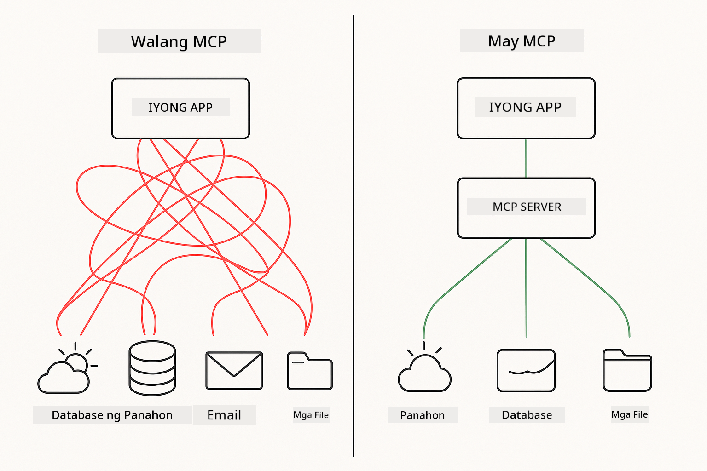

<!--
CO_OP_TRANSLATOR_METADATA:
{
  "original_hash": "c25ec1f10ef156c53e190cdf8b0711ab",
  "translation_date": "2025-12-13T18:01:13+00:00",
  "source_file": "05-mcp/README.md",
  "language_code": "tl"
}
-->
# Module 05: Model Context Protocol (MCP)

## Table of Contents

- [What You'll Learn](../../../05-mcp)
- [Understanding MCP](../../../05-mcp)
- [How MCP Works](../../../05-mcp)
  - [Server-Client Architecture](../../../05-mcp)
  - [Tool Discovery](../../../05-mcp)
  - [Transport Mechanisms](../../../05-mcp)
- [Prerequisites](../../../05-mcp)
- [What This Module Covers](../../../05-mcp)
- [Quick Start](../../../05-mcp)
  - [Example 1: Remote Calculator (Streamable HTTP)](../../../05-mcp)
  - [Example 2: File Operations (Stdio)](../../../05-mcp)
  - [Example 3: Git Analysis (Docker)](../../../05-mcp)
- [Key Concepts](../../../05-mcp)
  - [Transport Selection](../../../05-mcp)
  - [Tool Discovery](../../../05-mcp)
  - [Session Management](../../../05-mcp)
  - [Cross-Platform Considerations](../../../05-mcp)
- [When to Use MCP](../../../05-mcp)
- [MCP Ecosystem](../../../05-mcp)
- [Congratulations!](../../../05-mcp)
  - [What's Next?](../../../05-mcp)
- [Troubleshooting](../../../05-mcp)

## What You'll Learn

Nakapagbuo ka na ng conversational AI, na-master ang mga prompt, na-ground ang mga sagot sa mga dokumento, at nakagawa ng mga ahente gamit ang mga tool. Pero lahat ng mga tool na iyon ay custom-built para sa iyong partikular na aplikasyon. Paano kung mabibigyan mo ang iyong AI ng access sa isang standardized na ecosystem ng mga tool na maaaring likhain at ibahagi ng kahit sino?

Ang Model Context Protocol (MCP) ay nagbibigay ng eksaktong iyon - isang standard na paraan para sa mga AI application na matuklasan at gamitin ang mga external na tool. Sa halip na magsulat ng custom na integrasyon para sa bawat data source o serbisyo, kumokonekta ka sa mga MCP server na nagpapakita ng kanilang mga kakayahan sa isang pare-parehong format. Ang iyong AI agent ay maaaring awtomatikong matuklasan at gamitin ang mga tool na ito.



*Bago ang MCP: Kumplikadong point-to-point na integrasyon. Pagkatapos ng MCP: Isang protocol, walang katapusang posibilidad.*

## Understanding MCP

Nilulutas ng MCP ang isang pangunahing problema sa pag-develop ng AI: bawat integrasyon ay custom. Gusto mo bang ma-access ang GitHub? Custom na code. Gusto mong magbasa ng mga file? Custom na code. Gusto mong mag-query ng database? Custom na code. At wala sa mga integrasyong ito ang gumagana sa ibang AI application.

Pinapantay-pantay ito ng MCP. Isang MCP server ang nagpapakita ng mga tool na may malinaw na mga paglalarawan at schema. Anumang MCP client ay maaaring kumonekta, matuklasan ang mga available na tool, at gamitin ang mga ito. Isang beses lang gawin, gamitin saanman.


*Model Context Protocol architecture - standardized tool discovery and execution*

## How MCP Works

**Server-Client Architecture**

Gumagamit ang MCP ng client-server na modelo. Nagbibigay ang mga server ng mga tool - pagbabasa ng mga file, pag-query ng mga database, pagtawag ng mga API. Kumokonekta ang mga client (iyong AI application) sa mga server at ginagamit ang kanilang mga tool.

**Tool Discovery**

Kapag kumonekta ang iyong client sa isang MCP server, tinatanong nito "Anong mga tool ang meron kayo?" Sumagot ang server ng listahan ng mga available na tool, bawat isa ay may mga paglalarawan at parameter schema. Maaari nang magdesisyon ang iyong AI agent kung aling mga tool ang gagamitin base sa mga kahilingan ng user.

**Transport Mechanisms**

Nagde-define ang MCP ng dalawang mekanismo ng transport: HTTP para sa mga remote server, Stdio para sa mga lokal na proseso (kasama ang mga Docker container):


*MCP transport mechanisms: HTTP para sa mga remote server, Stdio para sa mga lokal na proseso (kasama ang mga Docker container)*

**Streamable HTTP** - [StreamableHttpDemo.java](../../../05-mcp/src/main/java/com/example/langchain4j/mcp/StreamableHttpDemo.java)

Para sa mga remote server. Gumagawa ang iyong aplikasyon ng mga HTTP request sa isang server na tumatakbo sa network. Gumagamit ng Server-Sent Events para sa real-time na komunikasyon.

```java
McpTransport httpTransport = new StreamableHttpMcpTransport.Builder()
    .url("http://localhost:3001/mcp")
    .timeout(Duration.ofSeconds(60))
    .logRequests(true)
    .logResponses(true)
    .build();
```

> **🤖 Try with [GitHub Copilot](https://github.com/features/copilot) Chat:** Buksan ang [`StreamableHttpDemo.java`](../../../05-mcp/src/main/java/com/example/langchain4j/mcp/StreamableHttpDemo.java) at itanong:
> - "Paano naiiba ang MCP mula sa direktang tool integration tulad sa Module 04?"
> - "Ano ang mga benepisyo ng paggamit ng MCP para sa pagbabahagi ng tool sa iba't ibang aplikasyon?"
> - "Paano ko haharapin ang mga pagkabigo sa koneksyon o timeout sa MCP servers?"

**Stdio** - [StdioTransportDemo.java](../../../05-mcp/src/main/java/com/example/langchain4j/mcp/StdioTransportDemo.java)

Para sa mga lokal na proseso. Nag-spawn ang iyong aplikasyon ng server bilang subprocess at nakikipag-ugnayan sa pamamagitan ng standard input/output. Kapaki-pakinabang para sa pag-access ng filesystem o mga command-line tool.

```java
McpTransport stdioTransport = new StdioMcpTransport.Builder()
    .command(List.of(
        npmCmd, "exec",
        "@modelcontextprotocol/server-filesystem@0.6.2",
        resourcesDir
    ))
    .logEvents(false)
    .build();
```

> **🤖 Try with [GitHub Copilot](https://github.com/features/copilot) Chat:** Buksan ang [`StdioTransportDemo.java`](../../../05-mcp/src/main/java/com/example/langchain4j/mcp/StdioTransportDemo.java) at itanong:
> - "Paano gumagana ang Stdio transport at kailan ko ito gagamitin kumpara sa HTTP?"
> - "Paano pinamamahalaan ng LangChain4j ang lifecycle ng mga spawned MCP server process?"
> - "Ano ang mga security implications ng pagbibigay ng AI ng access sa file system?"

**Docker (uses Stdio)** - [GitRepositoryAnalyzer.java](../../../05-mcp/src/main/java/com/example/langchain4j/mcp/GitRepositoryAnalyzer.java)

Para sa mga containerized na serbisyo. Gumagamit ng stdio transport para makipag-ugnayan sa isang Docker container gamit ang `docker run`. Maganda para sa mga komplikadong dependencies o isolated na environment.

```java
McpTransport dockerTransport = new StdioMcpTransport.Builder()
    .command(List.of(
        "docker", "run",
        "-e", "GITHUB_PERSONAL_ACCESS_TOKEN=" + System.getenv("GITHUB_TOKEN"),
        "-v", volumeMapping,
        "-i", "mcp/git"
    ))
    .logEvents(true)
    .build();
```

> **🤖 Try with [GitHub Copilot](https://github.com/features/copilot) Chat:** Buksan ang [`GitRepositoryAnalyzer.java`](../../../05-mcp/src/main/java/com/example/langchain4j/mcp/GitRepositoryAnalyzer.java) at itanong:
> - "Paano iniiwasan ng Docker transport ang MCP servers at ano ang mga benepisyo?"
> - "Paano ko iko-configure ang volume mounts para magbahagi ng data sa pagitan ng host at MCP containers?"
> - "Ano ang mga best practice para sa pamamahala ng Docker-based MCP server lifecycles sa production?"

## Running the Examples

### Prerequisites

- Java 21+, Maven 3.9+
- Node.js 16+ at npm (para sa MCP servers)
- **Docker Desktop** - Dapat ay **NAGPAPATULOY** para sa Example 3 (hindi lang naka-install)
- GitHub Personal Access Token na naka-configure sa `.env` file (mula sa Module 00)

> **Note:** Kung hindi mo pa na-set up ang iyong GitHub token, tingnan ang [Module 00 - Quick Start](../00-quick-start/README.md) para sa mga tagubilin.

> **⚠️ Docker Users:** Bago patakbuhin ang Example 3, siguraduhing tumatakbo ang Docker Desktop gamit ang `docker ps`. Kung may mga error sa koneksyon, simulan ang Docker Desktop at maghintay ng ~30 segundo para sa initialization.

## Quick Start

**Gamit ang VS Code:** I-right-click lang ang anumang demo file sa Explorer at piliin ang **"Run Java"**, o gamitin ang mga launch configuration mula sa Run and Debug panel (siguraduhing nailagay mo muna ang iyong token sa `.env` file).

**Gamit ang Maven:** Bilang alternatibo, maaari kang magpatakbo mula sa command line gamit ang mga halimbawa sa ibaba.

**⚠️ Mahalagang Paalala:** May mga halimbawa na may mga prerequisites (tulad ng pagsisimula ng MCP server o pagbuo ng Docker images). Suriin ang mga kinakailangan ng bawat halimbawa bago patakbuhin.

### Example 1: Remote Calculator (Streamable HTTP)

Ipinapakita nito ang network-based na integrasyon ng tool.

**⚠️ Prerequisite:** Kailangan mong simulan muna ang MCP server (tingnan ang Terminal 1 sa ibaba).

**Terminal 1 - Simulan ang MCP server:**

**Bash:**
```bash
git clone https://github.com/modelcontextprotocol/servers.git
cd servers/src/everything
npm install
node dist/streamableHttp.js
```

**PowerShell:**
```powershell
git clone https://github.com/modelcontextprotocol/servers.git
cd servers/src/everything
npm install
node dist/streamableHttp.js
```

**Terminal 2 - Patakbuhin ang halimbawa:**

**Gamit ang VS Code:** I-right-click ang `StreamableHttpDemo.java` at piliin ang **"Run Java"**.

**Gamit ang Maven:**

**Bash:**
```bash
export GITHUB_TOKEN=your_token_here
cd 05-mcp
mvn compile exec:java -Dexec.mainClass=com.example.langchain4j.mcp.StreamableHttpDemo
```

**PowerShell:**
```powershell
$env:GITHUB_TOKEN=your_token_here
cd 05-mcp
mvn --% compile exec:java -Dexec.mainClass=com.example.langchain4j.mcp.StreamableHttpDemo
```

Panoorin ang agent na matuklasan ang mga available na tool, pagkatapos gamitin ang calculator para magsagawa ng addition.

### Example 2: File Operations (Stdio)

Ipinapakita nito ang mga lokal na subprocess-based na tool.

**✅ Walang kinakailangang prerequisites** - ang MCP server ay awtomatikong na-spawn.

**Gamit ang VS Code:** I-right-click ang `StdioTransportDemo.java` at piliin ang **"Run Java"**.

**Gamit ang Maven:**

**Bash:**
```bash
export GITHUB_TOKEN=your_token_here
cd 05-mcp
mvn compile exec:java -Dexec.mainClass=com.example.langchain4j.mcp.StdioTransportDemo
```

**PowerShell:**
```powershell
$env:GITHUB_TOKEN=your_token_here
cd 05-mcp
mvn --% compile exec:java -Dexec.mainClass=com.example.langchain4j.mcp.StdioTransportDemo
```

Awtomatikong nag-spawn ang aplikasyon ng filesystem MCP server at nagbabasa ng lokal na file. Pansinin kung paano pinamamahalaan ang subprocess para sa iyo.

**Inaasahang output:**
```
Assistant response: The content of the file is "Kaboom!".
```

### Example 3: Git Analysis (Docker)

Ipinapakita nito ang containerized na mga tool server.

**⚠️ Prerequisites:** 
1. **Dapat ay NAGPAPATULOY ang Docker Desktop** (hindi lang naka-install)
2. **Windows users:** Inirerekomenda ang WSL 2 mode (Docker Desktop Settings → General → "Use the WSL 2 based engine"). Ang Hyper-V mode ay nangangailangan ng manual na file sharing configuration.
3. Kailangan mong i-build muna ang Docker image (tingnan ang Terminal 1 sa ibaba)

**Siguraduhing tumatakbo ang Docker:**

**Bash:**
```bash
docker ps  # Dapat ipakita ang listahan ng lalagyan, hindi isang error
```

**PowerShell:**
```powershell
docker ps  # Dapat ipakita ang listahan ng lalagyan, hindi isang error
```

Kung makakita ka ng error tulad ng "Cannot connect to Docker daemon" o "The system cannot find the file specified", simulan ang Docker Desktop at maghintay para sa initialization (~30 segundo).

**Troubleshooting:**
- Kung ini-report ng AI na walang laman ang repositoryo o walang mga file, hindi gumagana ang volume mount (`-v`).
- **Windows Hyper-V users:** Idagdag ang project directory sa Docker Desktop Settings → Resources → File sharing, pagkatapos ay i-restart ang Docker Desktop.
- **Inirerekomendang solusyon:** Lumipat sa WSL 2 mode para sa awtomatikong file sharing (Settings → General → enable "Use the WSL 2 based engine").

**Terminal 1 - I-build ang Docker image:**

**Bash:**
```bash
cd servers/src/git
docker build -t mcp/git .
```

**PowerShell:**
```powershell
cd servers/src/git
docker build -t mcp/git .
```

**Terminal 2 - Patakbuhin ang analyzer:**

**Gamit ang VS Code:** I-right-click ang `GitRepositoryAnalyzer.java` at piliin ang **"Run Java"**.

**Gamit ang Maven:**

**Bash:**
```bash
export GITHUB_TOKEN=your_token_here
cd 05-mcp
mvn compile exec:java -Dexec.mainClass=com.example.langchain4j.mcp.GitRepositoryAnalyzer
```

**PowerShell:**
```powershell
$env:GITHUB_TOKEN=your_token_here
cd 05-mcp
mvn --% compile exec:java -Dexec.mainClass=com.example.langchain4j.mcp.GitRepositoryAnalyzer
```

Pinapalabas ng aplikasyon ang isang Docker container, mino-mount ang iyong repositoryo, at sinusuri ang istruktura at nilalaman ng repositoryo sa pamamagitan ng AI agent.

## Key Concepts

**Transport Selection**

Pumili base sa kung saan matatagpuan ang iyong mga tool:
- Remote services → Streamable HTTP
- Lokal na file system → Stdio
- Komplikadong dependencies → Docker

**Tool Discovery**

Awtomatikong natutuklasan ng MCP clients ang mga available na tool kapag kumokonekta. Nakikita ng iyong AI agent ang mga paglalarawan ng tool at nagdedesisyon kung alin ang gagamitin base sa kahilingan ng user.

**Session Management**

Pinananatili ng Streamable HTTP transport ang mga session, na nagpapahintulot ng stateful na interaksyon sa mga remote server. Karaniwang stateless naman ang Stdio at Docker transports.

**Cross-Platform Considerations**

Awtomatikong hinahandle ng mga halimbawa ang mga pagkakaiba ng platform (Windows vs Unix command differences, path conversions para sa Docker). Mahalaga ito para sa production deployment sa iba't ibang environment.

## When to Use MCP

**Gamitin ang MCP kapag:**
- Gusto mong gamitin ang umiiral na ecosystem ng mga tool
- Gumagawa ng mga tool na gagamitin ng maraming aplikasyon
- Nag-iintegrate ng third-party services gamit ang standard na mga protocol
- Kailangan mong palitan ang mga implementasyon ng tool nang walang pagbabago sa code

**Gamitin ang custom tools (Module 04) kapag:**
- Gumagawa ng application-specific na functionality
- Kritikal ang performance (nagdadagdag ng overhead ang MCP)
- Simple lang ang iyong mga tool at hindi mauulit ang paggamit
- Kailangan mo ng kumpletong kontrol sa execution


## MCP Ecosystem

Ang Model Context Protocol ay isang open standard na may lumalawak na ecosystem:

- Official MCP servers para sa mga karaniwang gawain (filesystem, Git, databases)
- Mga community-contributed na server para sa iba't ibang serbisyo
- Standardized na mga paglalarawan ng tool at schema
- Cross-framework compatibility (gumagana sa anumang MCP client)

Ibig sabihin ng standardization na ito, ang mga tool na ginawa para sa isang AI application ay gumagana rin sa iba, na lumilikha ng isang shared ecosystem ng mga kakayahan.

## Congratulations!

Natapos mo na ang LangChain4j for Beginners course. Natutunan mo:

- Paano gumawa ng conversational AI na may memorya (Module 01)
- Mga prompt engineering pattern para sa iba't ibang gawain (Module 02)
- Pag-ground ng mga sagot sa iyong mga dokumento gamit ang RAG (Module 03)
- Paglikha ng AI agents gamit ang custom na mga tool (Module 04)
- Pag-integrate ng standardized na mga tool gamit ang MCP (Module 05)

Mayroon ka nang pundasyon para gumawa ng production AI applications. Ang mga konseptong natutunan mo ay naaangkop kahit anong framework o modelo - mga pangunahing pattern sa AI engineering.

### What's Next?

Pagkatapos makumpleto ang mga module, tuklasin ang [Testing Guide](../docs/TESTING.md) para makita ang mga konsepto ng LangChain4j testing sa aksyon.

**Official Resources:**
- [LangChain4j Documentation](https://docs.langchain4j.dev/) - Komprehensibong mga gabay at API reference
- [LangChain4j GitHub](https://github.com/langchain4j/langchain4j) - Source code at mga halimbawa
- [LangChain4j Tutorials](https://docs.langchain4j.dev/tutorials/) - Step-by-step na mga tutorial para sa iba't ibang use case

Salamat sa pagtapos ng kursong ito!

---

**Navigation:** [← Previous: Module 04 - Tools](../04-tools/README.md) | [Back to Main](../README.md)

---

## Troubleshooting

### PowerShell Maven Command Syntax
**Isyu**: Nabibigo ang mga utos ng Maven na may error na `Unknown lifecycle phase ".mainClass=..."`

**Sanhi**: Tinuturing ng PowerShell ang `=` bilang operator ng pagtatalaga ng variable, na sumisira sa syntax ng property ng Maven

**Solusyon**: Gamitin ang stop-parsing operator na `--%` bago ang utos ng Maven:

**PowerShell:**
```powershell
mvn --% compile exec:java -Dexec.mainClass=com.example.langchain4j.mcp.StreamableHttpDemo
```

**Bash:**
```bash
mvn compile exec:java -Dexec.mainClass=com.example.langchain4j.mcp.StreamableHttpDemo
```

Sinasabi ng operator na `--%` sa PowerShell na ipasa ang lahat ng natitirang argumento nang literal sa Maven nang walang interpretasyon.

### Mga Isyu sa Koneksyon ng Docker

**Isyu**: Nabibigo ang mga utos ng Docker na may "Cannot connect to Docker daemon" o "The system cannot find the file specified"

**Sanhi**: Hindi tumatakbo o hindi pa ganap na na-initialize ang Docker Desktop

**Solusyon**: 
1. Simulan ang Docker Desktop
2. Maghintay ng humigit-kumulang 30 segundo para sa ganap na pag-initialize
3. Suriin gamit ang `docker ps` (dapat magpakita ng listahan ng mga container, hindi error)
4. Pagkatapos ay patakbuhin ang iyong halimbawa

### Pag-mount ng Windows Docker Volume

**Isyu**: Nag-uulat ang Git repository analyzer ng walang laman na repositoryo o walang mga file

**Sanhi**: Hindi gumagana ang volume mount (`-v`) dahil sa configuration ng file sharing

**Solusyon**:
- **Inirerekomenda:** Lumipat sa WSL 2 mode (Docker Desktop Settings → General → "Use the WSL 2 based engine")
- **Alternatibo (Hyper-V):** Idagdag ang direktoryo ng proyekto sa Docker Desktop Settings → Resources → File sharing, pagkatapos ay i-restart ang Docker Desktop

---

<!-- CO-OP TRANSLATOR DISCLAIMER START -->
**Paalala**:
Ang dokumentong ito ay isinalin gamit ang AI translation service na [Co-op Translator](https://github.com/Azure/co-op-translator). Bagamat nagsusumikap kami para sa katumpakan, pakatandaan na ang mga awtomatikong pagsasalin ay maaaring maglaman ng mga pagkakamali o di-tumpak na impormasyon. Ang orihinal na dokumento sa orihinal nitong wika ang dapat ituring na pangunahing sanggunian. Para sa mahahalagang impormasyon, inirerekomenda ang propesyonal na pagsasalin ng tao. Hindi kami mananagot sa anumang hindi pagkakaunawaan o maling interpretasyon na maaaring magmula sa paggamit ng pagsasaling ito.
<!-- CO-OP TRANSLATOR DISCLAIMER END -->