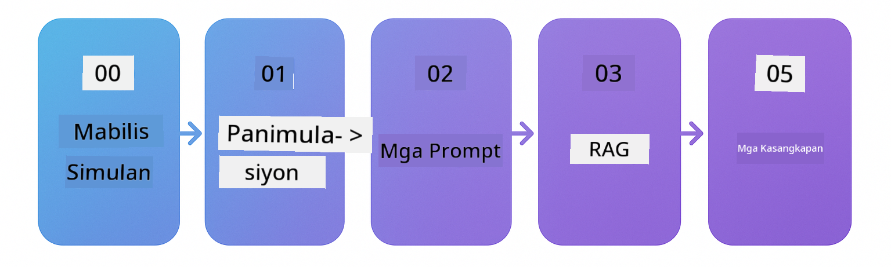

<!--
CO_OP_TRANSLATOR_METADATA:
{
  "original_hash": "e137234b4d3a7fcbbfc93bf17ae8a621",
  "translation_date": "2025-12-19T10:36:16+00:00",
  "source_file": "README.md",
  "language_code": "tl"
}
-->


### 🌐 Suporta sa Maramihang Wika

#### Sinusuportahan sa pamamagitan ng GitHub Action (Awtomatiko at Laging Napapanahon)

<!-- CO-OP TRANSLATOR LANGUAGES TABLE START -->
[Arabic](../ar/README.md) | [Bengali](../bn/README.md) | [Bulgarian](../bg/README.md) | [Burmese (Myanmar)](../my/README.md) | [Chinese (Simplified)](../zh/README.md) | [Chinese (Traditional, Hong Kong)](../hk/README.md) | [Chinese (Traditional, Macau)](../mo/README.md) | [Chinese (Traditional, Taiwan)](../tw/README.md) | [Croatian](../hr/README.md) | [Czech](../cs/README.md) | [Danish](../da/README.md) | [Dutch](../nl/README.md) | [Estonian](../et/README.md) | [Finnish](../fi/README.md) | [French](../fr/README.md) | [German](../de/README.md) | [Greek](../el/README.md) | [Hebrew](../he/README.md) | [Hindi](../hi/README.md) | [Hungarian](../hu/README.md) | [Indonesian](../id/README.md) | [Italian](../it/README.md) | [Japanese](../ja/README.md) | [Kannada](../kn/README.md) | [Korean](../ko/README.md) | [Lithuanian](../lt/README.md) | [Malay](../ms/README.md) | [Malayalam](../ml/README.md) | [Marathi](../mr/README.md) | [Nepali](../ne/README.md) | [Nigerian Pidgin](../pcm/README.md) | [Norwegian](../no/README.md) | [Persian (Farsi)](../fa/README.md) | [Polish](../pl/README.md) | [Portuguese (Brazil)](../br/README.md) | [Portuguese (Portugal)](../pt/README.md) | [Punjabi (Gurmukhi)](../pa/README.md) | [Romanian](../ro/README.md) | [Russian](../ru/README.md) | [Serbian (Cyrillic)](../sr/README.md) | [Slovak](../sk/README.md) | [Slovenian](../sl/README.md) | [Spanish](../es/README.md) | [Swahili](../sw/README.md) | [Swedish](../sv/README.md) | [Tagalog (Filipino)](./README.md) | [Tamil](../ta/README.md) | [Telugu](../te/README.md) | [Thai](../th/README.md) | [Turkish](../tr/README.md) | [Ukrainian](../uk/README.md) | [Urdu](../ur/README.md) | [Vietnamese](../vi/README.md)
<!-- CO-OP TRANSLATOR LANGUAGES TABLE END -->

# LangChain4j para sa mga Nagsisimula

Isang kurso para sa paggawa ng mga AI application gamit ang LangChain4j at Azure OpenAI GPT-5, mula sa basic chat hanggang sa AI agents.

**Bago sa LangChain4j?** Tingnan ang [Glossary](docs/GLOSSARY.md) para sa mga depinisyon ng mga pangunahing termino at konsepto.

## Talaan ng Nilalaman

1. [Mabilis na Pagsisimula](00-quick-start/README.md) - Magsimula gamit ang LangChain4j
2. [Panimula](01-introduction/README.md) - Alamin ang mga pundasyon ng LangChain4j
3. [Prompt Engineering](02-prompt-engineering/README.md) - Masterin ang epektibong disenyo ng prompt
4. [RAG (Retrieval-Augmented Generation)](03-rag/README.md) - Gumawa ng matatalinong knowledge-based na sistema
5. [Mga Kasangkapan](04-tools/README.md) - Isama ang mga panlabas na kasangkapan at API sa AI agents
6. [MCP (Model Context Protocol)](05-mcp/README.md) - Gumamit ng Model Context Protocol
---

## Landas ng Pagkatuto

> **Mabilis na Pagsisimula**

1. I-fork ang repository na ito sa iyong GitHub account
2. I-click ang **Code** → tab na **Codespaces** → **...** → **New with options...**
3. Gamitin ang mga default – pipiliin nito ang Development container na ginawa para sa kursong ito
4. I-click ang **Create codespace**
5. Maghintay ng 5-10 minuto para maging handa ang kapaligiran
6. Direktang pumunta sa [Mabilis na Pagsisimula](./00-quick-start/README.md) para magsimula!

> **Mas gusto mo bang I-clone Locally?**
>
> Kasama sa repository na ito ang 50+ na pagsasalin ng wika na malaki ang dagdag sa laki ng download. Para mag-clone nang walang mga pagsasalin, gamitin ang sparse checkout:
> ```bash
> git clone --filter=blob:none --sparse https://github.com/microsoft/LangChain4j-for-Beginners.git
> cd LangChain4j-for-Beginners
> git sparse-checkout set --no-cone '/*' '!translations' '!translated_images'
> ```
> Bibigyan ka nito ng lahat ng kailangan mo para matapos ang kurso nang mas mabilis ang pag-download.

Magsimula sa [Mabilis na Pagsisimula](00-quick-start/README.md) na module at magpatuloy sa bawat module upang paunlarin ang iyong mga kasanayan nang hakbang-hakbang. Susubukan mo ang mga basic na halimbawa upang maunawaan ang mga pundasyon bago lumipat sa [Panimula](01-introduction/README.md) na module para sa mas malalim na pag-aaral gamit ang GPT-5.



Pagkatapos makumpleto ang mga module, tuklasin ang [Testing Guide](docs/TESTING.md) upang makita ang mga konsepto ng LangChain4j testing sa aksyon.

> **Tandaan:** Ginagamit sa pagsasanay na ito ang parehong GitHub Models at Azure OpenAI. Ang mga module na [Mabilis na Pagsisimula](00-quick-start/README.md) at [MCP](05-mcp/README.md) ay gumagamit ng GitHub Models (hindi kailangan ng Azure subscription), habang ang mga module 1-4 ay gumagamit ng Azure OpenAI GPT-5.


## Pag-aaral gamit ang GitHub Copilot

Para mabilis na makapagsimula sa pag-cocode, buksan ang proyektong ito sa isang GitHub Codespace o sa iyong lokal na IDE gamit ang ibinigay na devcontainer. Ang devcontainer na ginamit sa kursong ito ay pre-configured na may GitHub Copilot para sa AI paired programming.

Bawat halimbawa ng code ay may kasamang mga mungkahing tanong na maaari mong itanong sa GitHub Copilot upang palalimin ang iyong pag-unawa. Hanapin ang mga 💡/🤖 na prompt sa:

- **Java file headers** - Mga tanong na partikular sa bawat halimbawa
- **Module READMEs** - Mga prompt para sa eksplorasyon pagkatapos ng mga halimbawa ng code

**Paano gamitin:** Buksan ang anumang file ng code at itanong ang mga mungkahing tanong sa Copilot. Mayroon itong buong konteksto ng codebase at maaaring magpaliwanag, magpalawak, at magmungkahi ng mga alternatibo.

Gusto mo bang matuto pa? Tingnan ang [Copilot para sa AI Paired Programming](https://aka.ms/GitHubCopilotAI).


## Karagdagang Mga Mapagkukunan

<!-- CO-OP TRANSLATOR OTHER COURSES START -->
### LangChain
[](https://aka.ms/langchain4j-for-beginners)
[](https://aka.ms/langchainjs-for-beginners?WT.mc_id=m365-94501-dwahlin)

---

### Azure / Edge / MCP / Agents
[](https://github.com/microsoft/AZD-for-beginners?WT.mc_id=academic-105485-koreyst)
[](https://github.com/microsoft/edgeai-for-beginners?WT.mc_id=academic-105485-koreyst)
[](https://github.com/microsoft/mcp-for-beginners?WT.mc_id=academic-105485-koreyst)
[](https://github.com/microsoft/ai-agents-for-beginners?WT.mc_id=academic-105485-koreyst)

---
 
### Generative AI Series
[](https://github.com/microsoft/generative-ai-for-beginners?WT.mc_id=academic-105485-koreyst)
[-9333EA?style=for-the-badge&labelColor=E5E7EB&color=9333EA)](https://github.com/microsoft/Generative-AI-for-beginners-dotnet?WT.mc_id=academic-105485-koreyst)
[-C084FC?style=for-the-badge&labelColor=E5E7EB&color=C084FC)](https://github.com/microsoft/generative-ai-for-beginners-java?WT.mc_id=academic-105485-koreyst)
[-E879F9?style=for-the-badge&labelColor=E5E7EB&color=E879F9)](https://github.com/microsoft/generative-ai-with-javascript?WT.mc_id=academic-105485-koreyst)

---
 
### Pangunahing Pagkatuto
[](https://aka.ms/ml-beginners?WT.mc_id=academic-105485-koreyst)
[](https://aka.ms/datascience-beginners?WT.mc_id=academic-105485-koreyst)
[](https://aka.ms/ai-beginners?WT.mc_id=academic-105485-koreyst)
[](https://github.com/microsoft/Security-101?WT.mc_id=academic-96948-sayoung)
[](https://aka.ms/webdev-beginners?WT.mc_id=academic-105485-koreyst)
[](https://aka.ms/iot-beginners?WT.mc_id=academic-105485-koreyst)
[](https://github.com/microsoft/xr-development-for-beginners?WT.mc_id=academic-105485-koreyst)

---
 
### Copilot Series
[](https://aka.ms/GitHubCopilotAI?WT.mc_id=academic-105485-koreyst)
[](https://github.com/microsoft/mastering-github-copilot-for-dotnet-csharp-developers?WT.mc_id=academic-105485-koreyst)
[](https://github.com/microsoft/CopilotAdventures?WT.mc_id=academic-105485-koreyst)
<!-- CO-OP TRANSLATOR OTHER COURSES END -->

## Pagkuha ng Tulong

Kung ikaw ay na-stuck o may mga tanong tungkol sa paggawa ng mga AI app, sumali sa:

[](https://aka.ms/foundry/discord)

Kung mayroon kang feedback sa produkto o mga error habang gumagawa, bisitahin ang:

[](https://aka.ms/foundry/forum)

## Lisensya

MIT License - Tingnan ang [LICENSE](../../LICENSE) file para sa mga detalye.

---

<!-- CO-OP TRANSLATOR DISCLAIMER START -->
**Paalala**:
Ang dokumentong ito ay isinalin gamit ang AI translation service na [Co-op Translator](https://github.com/Azure/co-op-translator). Bagamat nagsusumikap kami para sa katumpakan, pakatandaan na ang mga awtomatikong pagsasalin ay maaaring maglaman ng mga pagkakamali o di-tumpak na impormasyon. Ang orihinal na dokumento sa orihinal nitong wika ang dapat ituring na pangunahing sanggunian. Para sa mahahalagang impormasyon, inirerekomenda ang propesyonal na pagsasalin ng tao. Hindi kami mananagot sa anumang hindi pagkakaunawaan o maling interpretasyon na maaaring magmula sa paggamit ng pagsasaling ito.
<!-- CO-OP TRANSLATOR DISCLAIMER END -->