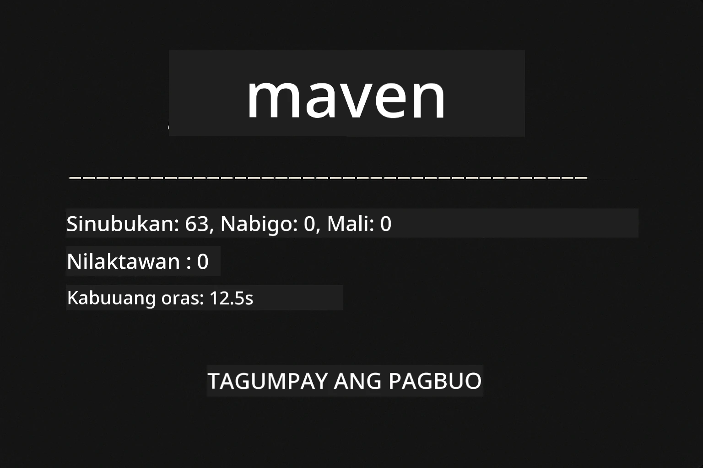
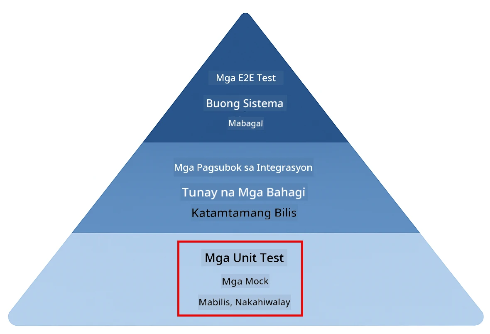
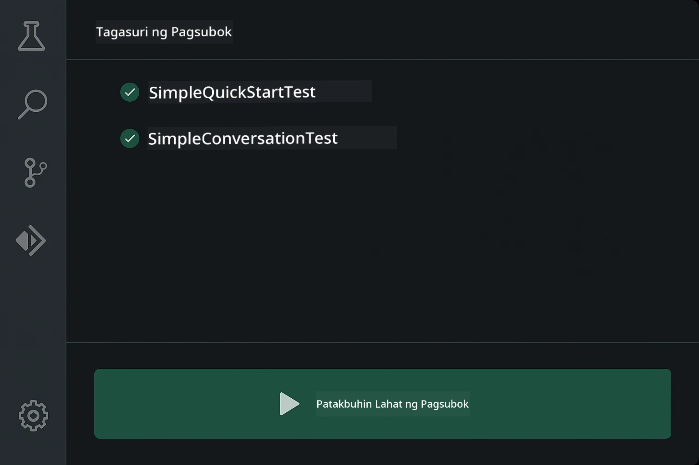
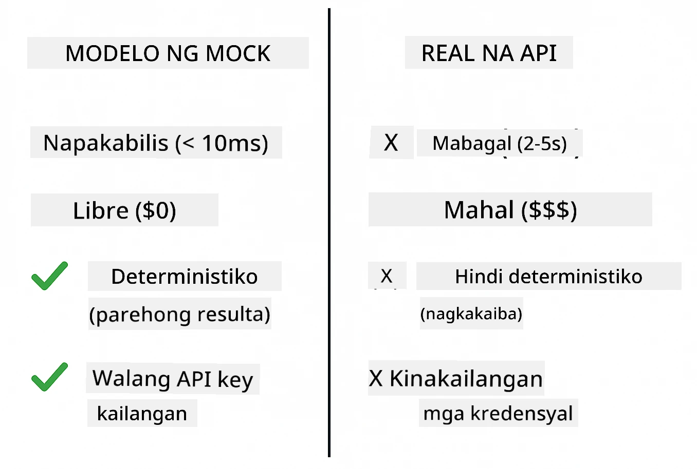
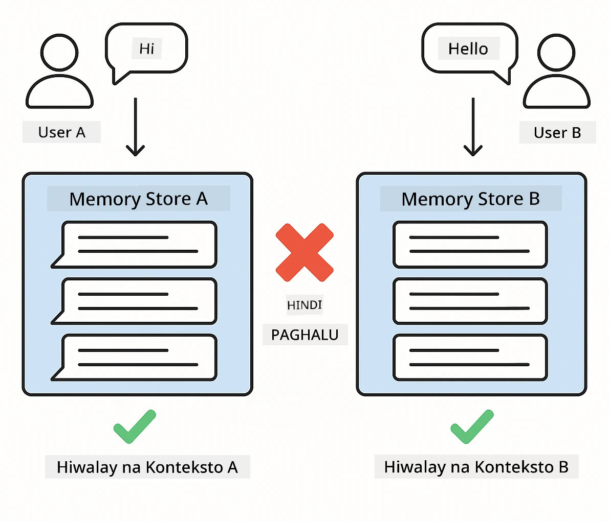
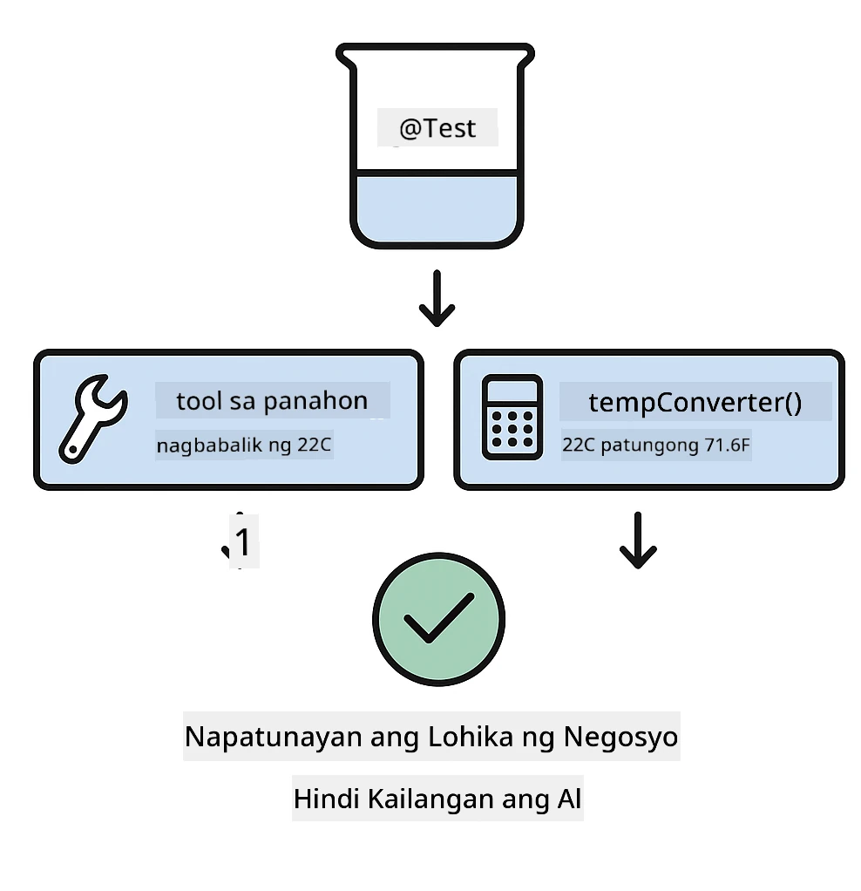

# Pagsubok ng Mga Aplikasyon ng LangChain4j

## Talaan ng Nilalaman

- [Mabilis na Pagsisimula](../../../docs)
- [Saklaw ng mga Pagsubok](../../../docs)
- [Pagpapatakbo ng mga Pagsubok](../../../docs)
- [Pagpapatakbo ng mga Pagsubok sa VS Code](../../../docs)
- [Mga Pattern ng Pagsubok](../../../docs)
- [Pilosopiya ng Pagsusuri](../../../docs)
- [Mga Susunod na Hakbang](../../../docs)

Ang gabay na ito ay naglalakad sa iyo sa mga pagsubok na nagpapakita kung paano subukan ang mga AI na aplikasyon nang hindi nangangailangan ng mga API key o external na serbisyo.

## Mabilis na Pagsisimula

Patakbuhin ang lahat ng pagsubok sa isang utos lamang:

**Bash:**
```bash
mvn test
```

**PowerShell:**
```powershell
mvn --% test
```



*Matagumpay na pagpapatakbo ng mga pagsubok na nagpapakita na lahat ng pagsubok ay pumasa nang walang pagkabigo*

## Saklaw ng mga Pagsubok

Ang kurso na ito ay nakatuon sa **unit tests** na tumatakbo nang lokal. Bawat pagsubok ay nagpapakita ng isang partikular na konsepto ng LangChain4j nang hiwalay.



*Piramide ng pagsusuri na nagpapakita ng balanse sa pagitan ng unit tests (mabilis, hiwalay), integration tests (mga tunay na bahagi), at end-to-end tests. Sinasaklaw ng pagsasanay na ito ang unit testing.*

| Modul | Mga Pagsubok | Pokus | Pangunahing Mga File |
|--------|-------|-------|-----------|
| **00 - Mabilis na Pagsisimula** | 6 | Prompt templates at substitution ng variable | `SimpleQuickStartTest.java` |
| **01 - Panimula** | 8 | Memorya ng pag-uusap at stateful na chat | `SimpleConversationTest.java` |
| **02 - Prompt Engineering** | 12 | Mga pattern ng GPT-5, antas ng eagerness, nakaayos na output | `SimpleGpt5PromptTest.java` |
| **03 - RAG** | 10 | Pag-ingest ng dokumento, embeddings, similarity search | `DocumentServiceTest.java` |
| **04 - Tools** | 12 | Function calling at tool chaining | `SimpleToolsTest.java` |
| **05 - MCP** | 8 | Model Context Protocol gamit ang Stdio transport | `SimpleMcpTest.java` |

## Pagpapatakbo ng mga Pagsubok

**Patakbuhin ang lahat ng pagsubok mula sa root:**

**Bash:**
```bash
mvn test
```

**PowerShell:**
```powershell
mvn --% test
```

**Patakbuhin ang mga pagsubok para sa isang partikular na modul:**

**Bash:**
```bash
cd 01-introduction && mvn test
# O mula sa root
mvn test -pl 01-introduction
```

**PowerShell:**
```powershell
cd 01-introduction; mvn --% test
# O mula sa root
mvn --% test -pl 01-introduction
```

**Patakbuhin ang isang solong test class:**

**Bash:**
```bash
mvn test -Dtest=SimpleConversationTest
```

**PowerShell:**
```powershell
mvn --% test -Dtest=SimpleConversationTest
```

**Patakbuhin ang isang partikular na test method:**

**Bash:**
```bash
mvn test -Dtest=SimpleConversationTest#dapat panatilihin ang kasaysayan ng pag-uusap
```

**PowerShell:**
```powershell
mvn --% test -Dtest=SimpleConversationTest#dapatPanatilihinAngKasaysayanNgPagUusap
```

## Pagpapatakbo ng mga Pagsubok sa VS Code

Kung gumagamit ka ng Visual Studio Code, nagbibigay ang Test Explorer ng graphical na interface para sa pagpapatakbo at pag-debug ng mga pagsubok.



*Ipinapakita ng VS Code Test Explorer ang puno ng mga pagsubok na may lahat ng Java test classes at mga indibidwal na test methods*

**Para patakbuhin ang mga pagsubok sa VS Code:**

1. Buksan ang Test Explorer sa pamamagitan ng pag-click sa beaker icon sa Activity Bar
2. Palawakin ang puno ng mga pagsubok upang makita ang lahat ng mga modul at test classes
3. I-click ang play button sa tabi ng anumang pagsubok upang patakbuhin ito nang paisa-isa
4. I-click ang "Run All Tests" upang isagawa ang buong suite
5. I-right-click ang anumang pagsubok at piliin ang "Debug Test" upang mag-set ng breakpoints at i-step through ang code

Ipinapakita ng Test Explorer ang berdeng checkmarks para sa mga pumapasang pagsubok at nagbibigay ng detalyadong mga mensahe ng pagkabigo kapag may mga pumapalpak na pagsubok.

## Mga Pattern ng Pagsubok

### Pattern 1: Pagsusuri ng Prompt Templates

Ang pinakamadaling pattern ay sinusuri ang prompt templates nang hindi tumatawag sa anumang AI model. Kinukumpirma mo na ang substitution ng variable ay gumagana nang tama at ang mga prompt ay naka-format ayon sa inaasahan.


*Pagsusuri ng prompt templates na nagpapakita ng daloy ng substitution ng variable: template na may placeholders → inilapat na mga halaga → na-verify ang formatted output*

```java
@Test
@DisplayName("Should format prompt template with variables")
void testPromptTemplateFormatting() {
    PromptTemplate template = PromptTemplate.from(
        "Best time to visit {{destination}} for {{activity}}?"
    );
    
    Prompt prompt = template.apply(Map.of(
        "destination", "Paris",
        "activity", "sightseeing"
    ));
    
    assertThat(prompt.text()).isEqualTo("Best time to visit Paris for sightseeing?");
}
```

Ang pagsubok na ito ay nasa `00-quick-start/src/test/java/com/example/langchain4j/quickstart/SimpleQuickStartTest.java`.

**Patakbuhin ito:**

**Bash:**
```bash
cd 00-quick-start && mvn test -Dtest=SimpleQuickStartTest#pagsubok sa pag-format ng template ng prompt
```

**PowerShell:**
```powershell
cd 00-quick-start; mvn --% test -Dtest=SimpleQuickStartTest#pagsubok ng pag-format ng template ng prompt
```

### Pattern 2: Mocking ng Language Models

Kapag sinusuri ang logic ng pag-uusap, gumamit ng Mockito upang lumikha ng mga pekeng modelo na nagbabalik ng mga predetermined na tugon. Ginagawa nitong mabilis, libre, at deterministic ang mga pagsubok.



*Pagkukumpara na nagpapakita kung bakit mas pinipili ang mga mock para sa pagsusuri: mabilis, libre, deterministic, at hindi nangangailangan ng mga API key*

```java
@ExtendWith(MockitoExtension.class)
class SimpleConversationTest {
    
    private ConversationService conversationService;
    
    @Mock
    private OpenAiOfficialChatModel mockChatModel;
    
    @BeforeEach
    void setUp() {
        ChatResponse mockResponse = ChatResponse.builder()
            .aiMessage(AiMessage.from("This is a test response"))
            .build();
        when(mockChatModel.chat(anyList())).thenReturn(mockResponse);
        
        conversationService = new ConversationService(mockChatModel);
    }
    
    @Test
    void shouldMaintainConversationHistory() {
        String conversationId = conversationService.startConversation();
        
        ChatResponse mockResponse1 = ChatResponse.builder()
            .aiMessage(AiMessage.from("Response 1"))
            .build();
        ChatResponse mockResponse2 = ChatResponse.builder()
            .aiMessage(AiMessage.from("Response 2"))
            .build();
        ChatResponse mockResponse3 = ChatResponse.builder()
            .aiMessage(AiMessage.from("Response 3"))
            .build();
        
        when(mockChatModel.chat(anyList()))
            .thenReturn(mockResponse1)
            .thenReturn(mockResponse2)
            .thenReturn(mockResponse3);

        conversationService.chat(conversationId, "First message");
        conversationService.chat(conversationId, "Second message");
        conversationService.chat(conversationId, "Third message");

        List<ChatMessage> history = conversationService.getHistory(conversationId);
        assertThat(history).hasSize(6); // 3 mensahe mula sa user + 3 mensahe mula sa AI
    }
}
```

Lumilitaw ang pattern na ito sa `01-introduction/src/test/java/com/example/langchain4j/service/SimpleConversationTest.java`. Tinitiyak ng mock ang pare-parehong pag-uugali upang ma-verify mong gumagana nang tama ang pamamahala ng memorya.

### Pattern 3: Pagsusuri ng Isolasyon ng Pag-uusap

Dapat panatilihin ng memorya ng pag-uusap ang hiwalay na mga user. Tinutukoy ng pagsubok na ito na hindi naghalo-halo ang mga konteksto ng mga pag-uusap.



*Pagsusuri ng isolasyon ng pag-uusap na nagpapakita ng magkahiwalay na mga tindahan ng memorya para sa iba't ibang user upang maiwasan ang paghahalo ng konteksto*

```java
@Test
void shouldIsolateConversationsByid() {
    String conv1 = conversationService.startConversation();
    String conv2 = conversationService.startConversation();
    
    ChatResponse mockResponse = ChatResponse.builder()
        .aiMessage(AiMessage.from("Response"))
        .build();
    when(mockChatModel.chat(anyList())).thenReturn(mockResponse);

    conversationService.chat(conv1, "Message for conversation 1");
    conversationService.chat(conv2, "Message for conversation 2");

    List<ChatMessage> history1 = conversationService.getHistory(conv1);
    List<ChatMessage> history2 = conversationService.getHistory(conv2);
    
    assertThat(history1).hasSize(2);
    assertThat(history2).hasSize(2);
}
```

Bawat pag-uusap ay nagpapanatili ng sariling independiyenteng kasaysayan. Sa mga production system, kritikal ang isolasyong ito para sa mga multi-user na aplikasyon.

### Pattern 4: Pagsusuri ng Mga Tool nang Hiwalay

Ang mga tool ay mga function na maaaring tawagin ng AI. Subukin ang mga ito nang direkta upang matiyak na gumagana ang mga ito nang tama kahit na hindi pinipili ng AI ang mga ito.



*Pagsusuri ng mga tool nang hiwalay na nagpapakita ng mock tool execution nang walang AI calls upang i-verify ang business logic*

```java
@Test
void shouldConvertCelsiusToFahrenheit() {
    TemperatureTool tempTool = new TemperatureTool();
    String result = tempTool.celsiusToFahrenheit(25.0);
    assertThat(result).containsPattern("77[.,]0°F");
}

@Test
void shouldDemonstrateToolChaining() {
    WeatherTool weatherTool = new WeatherTool();
    TemperatureTool tempTool = new TemperatureTool();

    String weatherResult = weatherTool.getCurrentWeather("Seattle");
    assertThat(weatherResult).containsPattern("\\d+°C");

    String conversionResult = tempTool.celsiusToFahrenheit(22.0);
    assertThat(conversionResult).containsPattern("71[.,]6°F");
}
```

Ang mga pagsubok na ito mula sa `04-tools/src/test/java/com/example/langchain4j/agents/tools/SimpleToolsTest.java` ay nagva-validate ng tool logic nang walang pakikialam ng AI. Ipinapakita ng chaining example kung paano ang output ng isang tool ay nagsisilbing input sa isa pa.

### Pattern 5: In-Memory RAG Testing

Kadalasan nangangailangan ang mga RAG system ng vector databases at embedding services. Pinapayagan ka ng in-memory pattern na suriin ang buong pipeline nang walang external na dependencies.


*In-memory RAG testing workflow na nagpapakita ng pag-parse ng dokumento, pag-iimbak ng embedding, at similarity search nang hindi nangangailangan ng database*

```java
@Test
void testProcessTextDocument() {
    String content = "This is a test document.\nIt has multiple lines.";
    InputStream inputStream = new ByteArrayInputStream(content.getBytes(StandardCharsets.UTF_8));
    
    DocumentService.ProcessedDocument result = 
        documentService.processDocument(inputStream, "test.txt");

    assertNotNull(result);
    assertTrue(result.segments().size() > 0);
    assertEquals("test.txt", result.segments().get(0).metadata().getString("filename"));
}
```

Ang pagsubok na ito mula sa `03-rag/src/test/java/com/example/langchain4j/rag/service/DocumentServiceTest.java` ay lumilikha ng dokumento sa memorya at tinitiyak ang chunking at paghawak ng metadata.

### Pattern 6: MCP Integration Testing

Tinutest ng MCP modul ang integrasyon ng Model Context Protocol gamit ang stdio transport. Tinitiyak ng mga pagsubok na ito na kaya ng iyong aplikasyon na mag-spawn at makipag-komunikasyon sa MCP servers bilang mga subprocess.

Ang mga pagsubok sa `05-mcp/src/test/java/com/example/langchain4j/mcp/SimpleMcpTest.java` ay nagva-validate ng pag-uugali ng MCP client.

**Patakbuhin ang mga ito:**

**Bash:**
```bash
cd 05-mcp && mvn test
```

**PowerShell:**
```powershell
cd 05-mcp; mvn --% test
```

## Pilosopiya ng Pagsusuri

Subukan ang iyong code, hindi ang AI. Dapat i-validate ng iyong mga pagsubok ang code na sinusulat mo sa pamamagitan ng pagsuri kung paano binubuo ang mga prompt, kung paano pinamamahalaan ang memorya, at kung paano nagpapatupad ang mga tool. Nag-iiba-iba ang mga tugon ng AI at hindi dapat maging bahagi ng mga assertion ng pagsubok. Tanungin ang iyong sarili kung tama bang nagsasubstitute ng mga variable ang iyong prompt template, hindi kung nagbibigay ba ang AI ng tamang sagot.

Gumamit ng mocks para sa language models. Sila ang mga external na dependency na mabagal, magastos, at hindi deterministic. Ginagawang mabilis ng mocking ang mga pagsubok na may millisecond sa halip na segundo, libre nang walang gastos sa API, at deterministic na may pare-parehong resulta sa bawat oras.

Panatilihing independyente ang mga pagsubok. Bawat pagsubok ay dapat mag-set up ng sarili nitong data, hindi umasa sa ibang pagsubok, at maglinis pagkatapos nito. Dapat pumasa ang mga pagsubok anuman ang pagkakasunod-sunod ng pagpapatupad.

Subukan ang mga edge case lampas sa happy path. Subukan ang mga walang laman na input, napakalaking input, espesyal na mga character, invalid na mga parameter, at mga boundary condition. Madalas nilang natutuklasan ang mga bug na hindi ipinapakita ng normal na paggamit.

Gumamit ng mga deskriptibong pangalan. Ihambing ang `shouldMaintainConversationHistoryAcrossMultipleMessages()` sa `test1()`. Sinasabi ng una nang eksakto kung ano ang sinusubok, na nagpapadali sa pag-debug ng mga pagkabigong mas madali.

## Mga Susunod na Hakbang

Ngayon na nauunawaan mo ang mga pattern ng pagsusuri, sumisid pa nang mas malalim sa bawat modul:

- **[00 - Mabilis na Pagsisimula](../00-quick-start/README.md)** - Magsimula sa mga pangunahing prompt template
- **[01 - Panimula](../01-introduction/README.md)** - Matutunan ang pamamahala ng memorya ng pag-uusap
- **[02 - Prompt Engineering](../02-prompt-engineering/README.md)** - Masterin ang mga pattern ng prompting para sa GPT-5
- **[03 - RAG](../03-rag/README.md)** - Bumuo ng mga retrieval-augmented generation system
- **[04 - Tools](../04-tools/README.md)** - Ipatupad ang function calling at tool chains
- **[05 - MCP](../05-mcp/README.md)** - I-integrate ang Model Context Protocol

Nagbibigay ang bawat README ng modul ng mga detalyadong paliwanag ng mga konseptong sinusubok dito.

---

**Navigasyon:** [← Bumalik sa Pangunahing](../README.md)

---

<!-- CO-OP TRANSLATOR DISCLAIMER START -->
Paunawa:
Ang dokumentong ito ay isinalin gamit ang AI translation service na [Co-op Translator](https://github.com/Azure/co-op-translator). Bagaman sinisikap naming maging tumpak, pakitandaan na ang mga awtomatikong pagsasalin ay maaaring maglaman ng mga pagkakamali o di-tumpak na impormasyon. Ang orihinal na dokumento sa kanyang orihinal na wika ang dapat ituring na pinagmumulan ng otoridad. Para sa mahahalagang impormasyon, inirerekomenda ang propesyonal na pagsasaling-tao na isinagawa ng isang tao. Hindi kami mananagot sa anumang hindi pagkakaunawaan o maling interpretasyon na nagmula sa paggamit ng pagsasaling ito.
<!-- CO-OP TRANSLATOR DISCLAIMER END -->