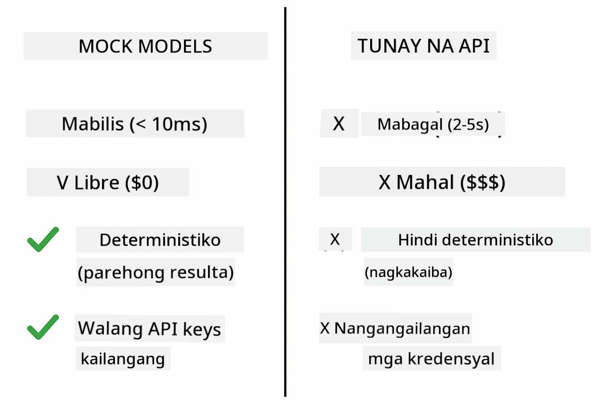
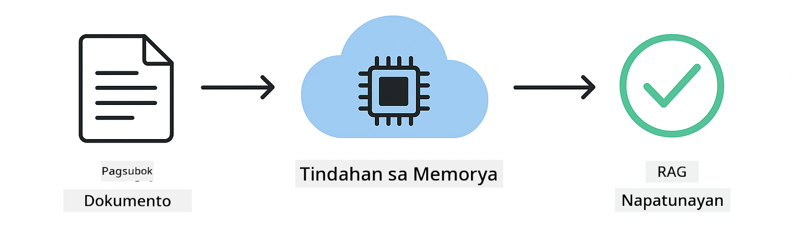

<!--
CO_OP_TRANSLATOR_METADATA:
{
  "original_hash": "b975537560c404d5f254331832811e78",
  "translation_date": "2025-12-13T21:16:34+00:00",
  "source_file": "docs/TESTING.md",
  "language_code": "tl"
}
-->
# Pagsusuri ng Mga Aplikasyon ng LangChain4j

## Talaan ng Nilalaman

- [Mabilis na Pagsisimula](../../../docs)
- [Saklaw ng Mga Pagsusuri](../../../docs)
- [Pagpapatakbo ng Mga Pagsusuri](../../../docs)
- [Pagpapatakbo ng Mga Pagsusuri sa VS Code](../../../docs)
- [Mga Pattern sa Pagsusuri](../../../docs)
- [Pilosopiya sa Pagsusuri](../../../docs)
- [Mga Susunod na Hakbang](../../../docs)

Ang gabay na ito ay naglalakad sa iyo sa mga pagsusuri na nagpapakita kung paano subukan ang mga AI na aplikasyon nang hindi nangangailangan ng mga API key o panlabas na serbisyo.

## Mabilis na Pagsisimula

Patakbuhin ang lahat ng pagsusuri gamit ang isang utos:

**Bash:**
```bash
mvn test
```

**PowerShell:**
```powershell
mvn --% test
```


*Matagumpay na pagpapatakbo ng pagsusuri na nagpapakita ng lahat ng pagsusuri ay pumasa nang walang pagkabigo*

## Saklaw ng Mga Pagsusuri

Ang kursong ito ay nakatuon sa **unit tests** na tumatakbo nang lokal. Bawat pagsusuri ay nagpapakita ng isang partikular na konsepto ng LangChain4j nang hiwalay.


*Pyramid ng pagsusuri na nagpapakita ng balanse sa pagitan ng unit tests (mabilis, hiwalay), integration tests (mga totoong bahagi), at end-to-end tests (buong sistema gamit ang Docker). Saklaw ng pagsasanay na ito ang unit testing.*

| Module | Mga Pagsusuri | Pokus | Pangunahing Mga File |
|--------|--------------|-------|---------------------|
| **00 - Mabilis na Pagsisimula** | 6 | Mga prompt template at pagpapalit ng variable | `SimpleQuickStartTest.java` |
| **01 - Panimula** | 8 | Memorya ng pag-uusap at stateful chat | `SimpleConversationTest.java` |
| **02 - Prompt Engineering** | 12 | Mga pattern ng GPT-5, antas ng kasigasigan, nakaayos na output | `SimpleGpt5PromptTest.java` |
| **03 - RAG** | 10 | Pagpasok ng dokumento, embeddings, paghahanap ng pagkakatulad | `DocumentServiceTest.java` |
| **04 - Mga Tools** | 12 | Pagtawag ng function at pag-chain ng mga tool | `SimpleToolsTest.java` |
| **05 - MCP** | 15 | Model Context Protocol gamit ang Docker | `SimpleMcpTest.java`, `McpDockerTransportTest.java` |

## Pagpapatakbo ng Mga Pagsusuri

**Patakbuhin ang lahat ng pagsusuri mula sa root:**

**Bash:**
```bash
mvn test
```

**PowerShell:**
```powershell
mvn --% test
```

**Patakbuhin ang mga pagsusuri para sa isang partikular na module:**

**Bash:**
```bash
cd 01-introduction && mvn test
# O mula sa ugat
mvn test -pl 01-introduction
```

**PowerShell:**
```powershell
cd 01-introduction; mvn --% test
# O mula sa ugat
mvn --% test -pl 01-introduction
```

**Patakbuhin ang isang test class:**

**Bash:**
```bash
mvn test -Dtest=SimpleConversationTest
```

**PowerShell:**
```powershell
mvn --% test -Dtest=SimpleConversationTest
```

**Patakbuhin ang isang partikular na test method:**

**Bash:**
```bash
mvn test -Dtest=SimpleConversationTest#dapatPanatilihinAngKasaysayanNgUsapan
```

**PowerShell:**
```powershell
mvn --% test -Dtest=SimpleConversationTest#dapatPanatilihinAngKasaysayanNgUsapan
```

## Pagpapatakbo ng Mga Pagsusuri sa VS Code

Kung gumagamit ka ng Visual Studio Code, ang Test Explorer ay nagbibigay ng grapikal na interface para sa pagpapatakbo at pag-debug ng mga pagsusuri.


*VS Code Test Explorer na nagpapakita ng puno ng pagsusuri na may lahat ng Java test classes at mga indibidwal na test methods*

**Para patakbuhin ang mga pagsusuri sa VS Code:**

1. Buksan ang Test Explorer sa pamamagitan ng pag-click sa beaker icon sa Activity Bar
2. Palawakin ang puno ng pagsusuri upang makita ang lahat ng mga module at test classes
3. I-click ang play button sa tabi ng anumang pagsusuri upang patakbuhin ito nang paisa-isa
4. I-click ang "Run All Tests" upang patakbuhin ang buong suite
5. I-right-click ang anumang pagsusuri at piliin ang "Debug Test" upang mag-set ng breakpoints at mag-step sa code

Ipinapakita ng Test Explorer ang mga berdeng checkmark para sa mga pumasa na pagsusuri at nagbibigay ng detalyadong mga mensahe ng pagkabigo kapag may pumalya.

## Mga Pattern sa Pagsusuri


*Anim na pattern sa pagsusuri para sa mga aplikasyon ng LangChain4j: prompt templates, mocking models, conversation isolation, tools testing, in-memory RAG, at Docker integration*

### Pattern 1: Pagsusuri ng Prompt Templates

Ang pinakasimpleng pattern ay sumusuri ng mga prompt template nang hindi tumatawag sa anumang AI model. Tinitiyak mo na tama ang pagpapalit ng variable at ang mga prompt ay naka-format ayon sa inaasahan.


*Pagsusuri ng prompt templates na nagpapakita ng daloy ng pagpapalit ng variable: template na may placeholders → inilapat na mga halaga → na-verify na naka-format na output*

```java
@Test
@DisplayName("Should format prompt template with variables")
void testPromptTemplateFormatting() {
    PromptTemplate template = PromptTemplate.from(
        "Best time to visit {{destination}} for {{activity}}?"
    );
    
    Prompt prompt = template.apply(Map.of(
        "destination", "Paris",
        "activity", "sightseeing"
    ));
    
    assertThat(prompt.text()).isEqualTo("Best time to visit Paris for sightseeing?");
}
```

Ang pagsusuring ito ay matatagpuan sa `00-quick-start/src/test/java/com/example/langchain4j/quickstart/SimpleQuickStartTest.java`.

**Patakbuhin ito:**

**Bash:**
```bash
cd 00-quick-start && mvn test -Dtest=SimpleQuickStartTest#pagsubokSaPagformatNgPromptTemplate
```

**PowerShell:**
```powershell
cd 00-quick-start; mvn --% test -Dtest=SimpleQuickStartTest#pagsubokSaPagformatNgPromptTemplate
```

### Pattern 2: Mocking ng Language Models

Kapag sinusuri ang lohika ng pag-uusap, gamitin ang Mockito upang gumawa ng mga pekeng modelo na nagbabalik ng mga naunang itinakdang sagot. Ginagawa nitong mabilis, libre, at deterministic ang mga pagsusuri.



*Paghahambing na nagpapakita kung bakit mas gusto ang mga mock para sa pagsusuri: mabilis, libre, deterministic, at hindi nangangailangan ng mga API key*

```java
@ExtendWith(MockitoExtension.class)
class SimpleConversationTest {
    
    private ConversationService conversationService;
    
    @Mock
    private OpenAiOfficialChatModel mockChatModel;
    
    @BeforeEach
    void setUp() {
        ChatResponse mockResponse = ChatResponse.builder()
            .aiMessage(AiMessage.from("This is a test response"))
            .build();
        when(mockChatModel.chat(anyList())).thenReturn(mockResponse);
        
        conversationService = new ConversationService(mockChatModel);
    }
    
    @Test
    void shouldMaintainConversationHistory() {
        String conversationId = conversationService.startConversation();
        
        ChatResponse mockResponse1 = ChatResponse.builder()
            .aiMessage(AiMessage.from("Response 1"))
            .build();
        ChatResponse mockResponse2 = ChatResponse.builder()
            .aiMessage(AiMessage.from("Response 2"))
            .build();
        ChatResponse mockResponse3 = ChatResponse.builder()
            .aiMessage(AiMessage.from("Response 3"))
            .build();
        
        when(mockChatModel.chat(anyList()))
            .thenReturn(mockResponse1)
            .thenReturn(mockResponse2)
            .thenReturn(mockResponse3);

        conversationService.chat(conversationId, "First message");
        conversationService.chat(conversationId, "Second message");
        conversationService.chat(conversationId, "Third message");

        List<ChatMessage> history = conversationService.getHistory(conversationId);
        assertThat(history).hasSize(6); // 3 mensahe mula sa user + 3 mensahe mula sa AI
    }
}
```

Ang pattern na ito ay makikita sa `01-introduction/src/test/java/com/example/langchain4j/service/SimpleConversationTest.java`. Tinitiyak ng mock ang pare-parehong pag-uugali upang mapatunayan na tama ang pamamahala ng memorya.

### Pattern 3: Pagsusuri ng Conversation Isolation

Dapat panatilihing hiwalay ng memorya ng pag-uusap ang maraming gumagamit. Tinitiyak ng pagsusuring ito na hindi nagkakahalo ang mga konteksto ng pag-uusap.


*Pagsusuri ng conversation isolation na nagpapakita ng magkahiwalay na memory store para sa iba't ibang mga gumagamit upang maiwasan ang paghahalo ng konteksto*

```java
@Test
void shouldIsolateConversationsByid() {
    String conv1 = conversationService.startConversation();
    String conv2 = conversationService.startConversation();
    
    ChatResponse mockResponse = ChatResponse.builder()
        .aiMessage(AiMessage.from("Response"))
        .build();
    when(mockChatModel.chat(anyList())).thenReturn(mockResponse);

    conversationService.chat(conv1, "Message for conversation 1");
    conversationService.chat(conv2, "Message for conversation 2");

    List<ChatMessage> history1 = conversationService.getHistory(conv1);
    List<ChatMessage> history2 = conversationService.getHistory(conv2);
    
    assertThat(history1).hasSize(2);
    assertThat(history2).hasSize(2);
}
```

Bawat pag-uusap ay may sariling independiyenteng kasaysayan. Sa mga production system, kritikal ang isolation na ito para sa mga multi-user na aplikasyon.

### Pattern 4: Pagsusuri ng Mga Tools nang Hiwalay

Ang mga tool ay mga function na maaaring tawagin ng AI. Subukan ang mga ito nang direkta upang matiyak na gumagana ang mga ito nang tama kahit ano pa man ang desisyon ng AI.


*Pagsusuri ng mga tool nang hiwalay na nagpapakita ng mock tool execution nang walang tawag sa AI upang mapatunayan ang lohika ng negosyo*

```java
@Test
void shouldConvertCelsiusToFahrenheit() {
    TemperatureTool tempTool = new TemperatureTool();
    String result = tempTool.celsiusToFahrenheit(25.0);
    assertThat(result).containsPattern("77[.,]0°F");
}

@Test
void shouldDemonstrateToolChaining() {
    WeatherTool weatherTool = new WeatherTool();
    TemperatureTool tempTool = new TemperatureTool();

    String weatherResult = weatherTool.getCurrentWeather("Seattle");
    assertThat(weatherResult).containsPattern("\\d+°C");

    String conversionResult = tempTool.celsiusToFahrenheit(22.0);
    assertThat(conversionResult).containsPattern("71[.,]6°F");
}
```

Ang mga pagsusuring ito mula sa `04-tools/src/test/java/com/example/langchain4j/agents/tools/SimpleToolsTest.java` ay nagpapatunay ng lohika ng tool nang walang pakikialam ng AI. Ipinapakita ng halimbawa ng chaining kung paano ang output ng isang tool ay pinapasok sa input ng isa pa.

### Pattern 5: In-Memory RAG Testing

Tradisyonal na nangangailangan ang mga RAG system ng vector databases at embedding services. Pinapayagan ka ng in-memory pattern na subukan ang buong pipeline nang walang panlabas na dependencies.



*In-memory RAG testing workflow na nagpapakita ng pag-parse ng dokumento, pag-iimbak ng embedding, at paghahanap ng pagkakatulad nang hindi nangangailangan ng database*

```java
@Test
void testProcessTextDocument() {
    String content = "This is a test document.\nIt has multiple lines.";
    InputStream inputStream = new ByteArrayInputStream(content.getBytes(StandardCharsets.UTF_8));
    
    DocumentService.ProcessedDocument result = 
        documentService.processDocument(inputStream, "test.txt");

    assertNotNull(result);
    assertTrue(result.segments().size() > 0);
    assertEquals("test.txt", result.segments().get(0).metadata().getString("filename"));
}
```

Ang pagsusuring ito mula sa `03-rag/src/test/java/com/example/langchain4j/rag/service/DocumentServiceTest.java` ay lumilikha ng dokumento sa memorya at tinitiyak ang chunking at paghawak ng metadata.

### Pattern 6: Integration Testing gamit ang Docker

Ang ilang mga tampok ay nangangailangan ng totoong imprastraktura. Ginagamit ng MCP module ang Testcontainers upang mag-spin up ng mga Docker container para sa integration tests. Pinatutunayan nito na gumagana ang iyong code sa mga aktwal na serbisyo habang pinapanatili ang isolation ng pagsusuri.


*MCP integration testing gamit ang Testcontainers na nagpapakita ng automated container lifecycle: pagsisimula, pagpapatakbo ng pagsusuri, paghinto, at paglilinis*

Ang mga pagsusuri sa `05-mcp/src/test/java/com/example/langchain4j/mcp/McpDockerTransportTest.java` ay nangangailangan na tumatakbo ang Docker.

**Patakbuhin ang mga ito:**

**Bash:**
```bash
cd 05-mcp && mvn test
```

**PowerShell:**
```powershell
cd 05-mcp; mvn --% test
```

## Pilosopiya sa Pagsusuri

Subukan ang iyong code, hindi ang AI. Dapat patunayan ng iyong mga pagsusuri ang code na iyong isinulat sa pamamagitan ng pagsuri kung paano binubuo ang mga prompt, kung paano pinamamahalaan ang memorya, at kung paano nagpapatakbo ang mga tool. Nag-iiba-iba ang mga sagot ng AI at hindi dapat bahagi ng mga test assertion. Tanungin ang iyong sarili kung tama ba ang pagpapalit ng variable sa iyong prompt template, hindi kung tama ba ang sagot ng AI.

Gumamit ng mga mock para sa mga language model. Sila ay mga panlabas na dependency na mabagal, mahal, at hindi deterministic. Ginagawa ng mocking na mabilis ang mga pagsusuri sa loob ng milliseconds sa halip na segundo, libre nang walang gastos sa API, at deterministic na may parehong resulta sa bawat pagkakataon.

Panatilihing independyente ang mga pagsusuri. Dapat mag-set up ang bawat pagsusuri ng sarili nitong data, hindi umasa sa ibang pagsusuri, at maglinis pagkatapos nito. Dapat pumasa ang mga pagsusuri kahit ano pa man ang pagkakasunod-sunod ng pagpapatakbo.

Subukan ang mga edge case lampas sa masayang landas. Subukan ang mga walang laman na input, napakalaking input, espesyal na mga karakter, invalid na mga parameter, at mga boundary condition. Madalas na natutuklasan nito ang mga bug na hindi lumalabas sa normal na paggamit.

Gumamit ng mga deskriptibong pangalan. Ihambing ang `shouldMaintainConversationHistoryAcrossMultipleMessages()` sa `test1()`. Ang una ay nagsasabi nang eksakto kung ano ang sinusuri, na nagpapadali sa pag-debug ng mga pagkabigo.

## Mga Susunod na Hakbang

Ngayon na nauunawaan mo na ang mga pattern sa pagsusuri, sumisid nang mas malalim sa bawat module:

- **[00 - Mabilis na Pagsisimula](../00-quick-start/README.md)** - Magsimula sa mga batayan ng prompt template
- **[01 - Panimula](../01-introduction/README.md)** - Matutunan ang pamamahala ng memorya ng pag-uusap
- **[02 - Prompt Engineering](../02-prompt-engineering/README.md)** - Masterin ang mga pattern ng GPT-5 prompting
- **[03 - RAG](../03-rag/README.md)** - Bumuo ng retrieval-augmented generation systems
- **[04 - Mga Tools](../04-tools/README.md)** - Ipatupad ang pagtawag ng function at mga tool chain
- **[05 - MCP](../05-mcp/README.md)** - Isama ang Model Context Protocol gamit ang Docker

Nagbibigay ang README ng bawat module ng detalyadong paliwanag ng mga konseptong sinusuri dito.

---

**Navigation:** [← Bumalik sa Pangunahing Pahina](../README.md)

---

<!-- CO-OP TRANSLATOR DISCLAIMER START -->
**Paalala**:
Ang dokumentong ito ay isinalin gamit ang AI translation service na [Co-op Translator](https://github.com/Azure/co-op-translator). Bagamat nagsusumikap kami para sa katumpakan, pakatandaan na ang mga awtomatikong pagsasalin ay maaaring maglaman ng mga pagkakamali o di-tumpak na impormasyon. Ang orihinal na dokumento sa orihinal nitong wika ang dapat ituring na pangunahing sanggunian. Para sa mahahalagang impormasyon, inirerekomenda ang propesyonal na pagsasalin ng tao. Hindi kami mananagot sa anumang hindi pagkakaunawaan o maling interpretasyon na maaaring magmula sa paggamit ng pagsasaling ito.
<!-- CO-OP TRANSLATOR DISCLAIMER END -->