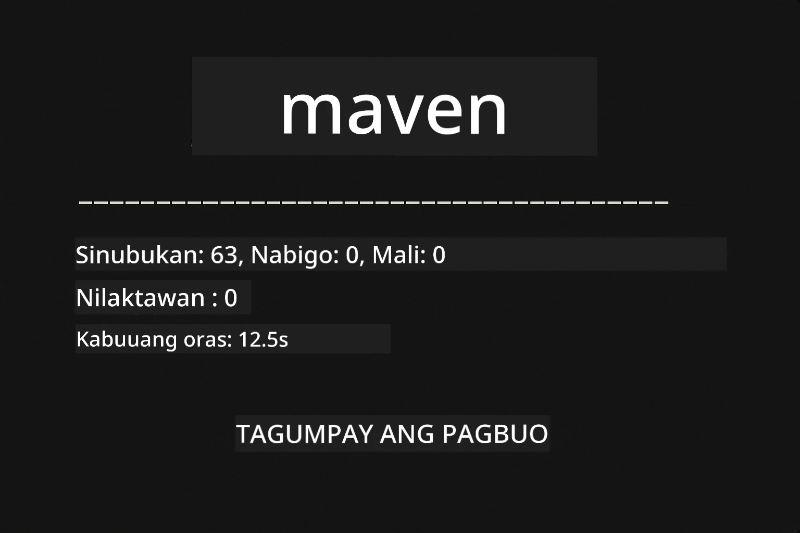
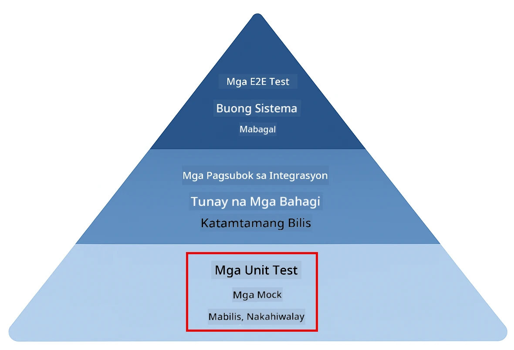
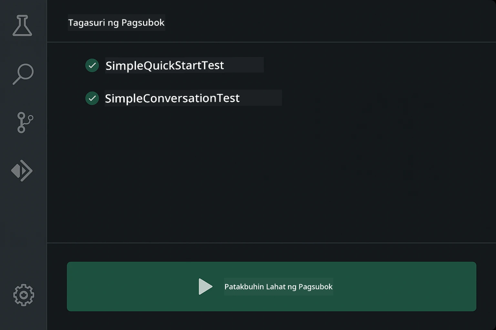
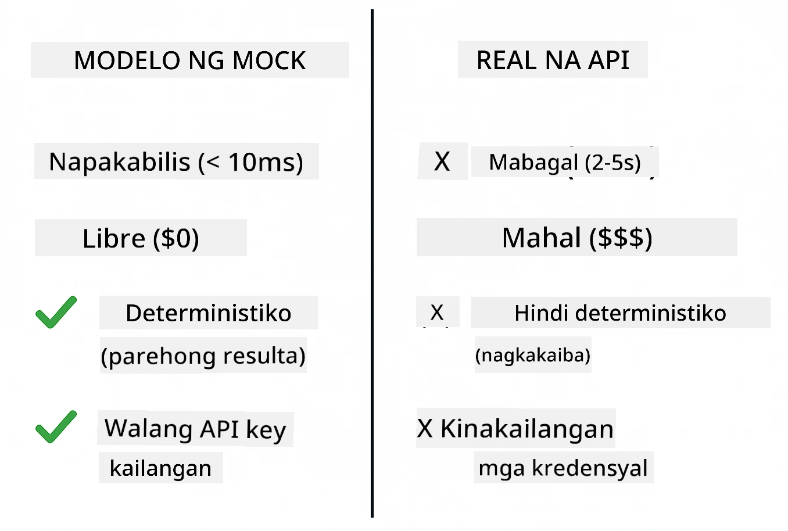
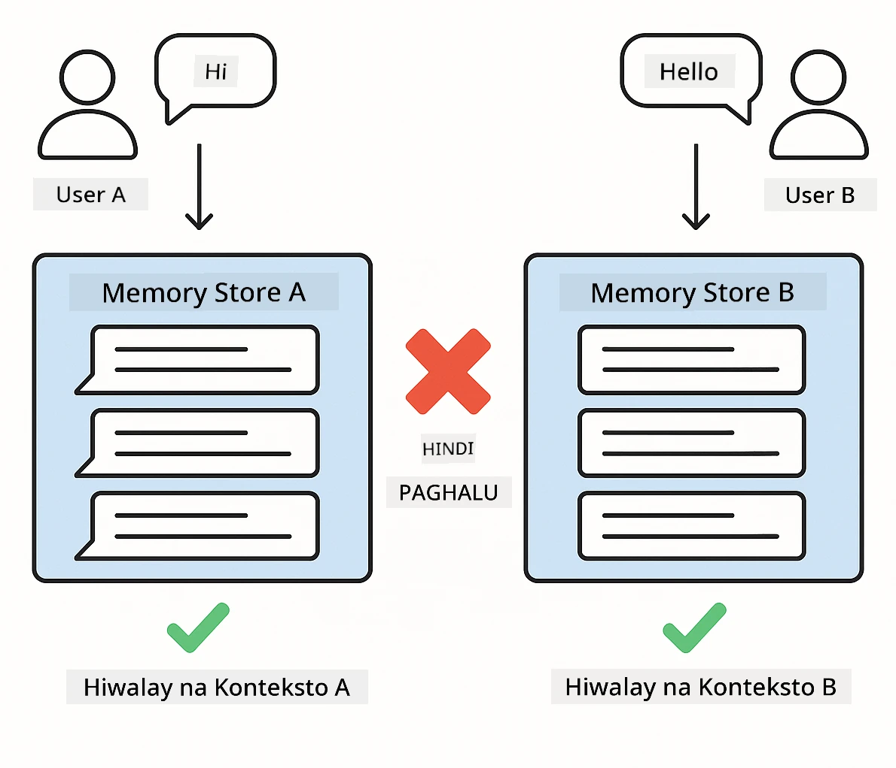
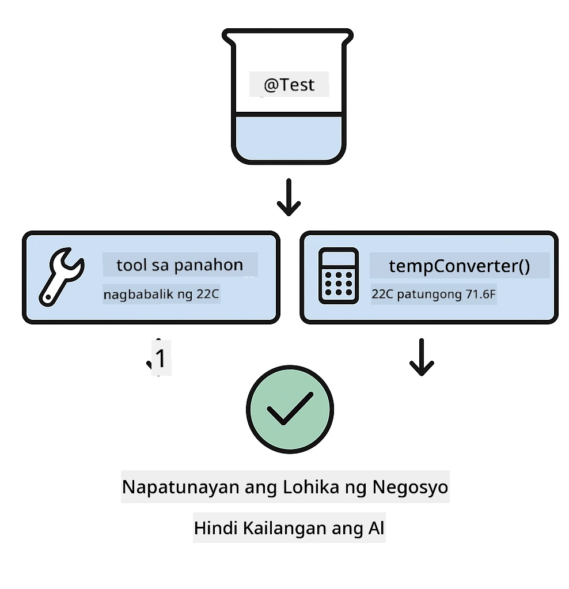
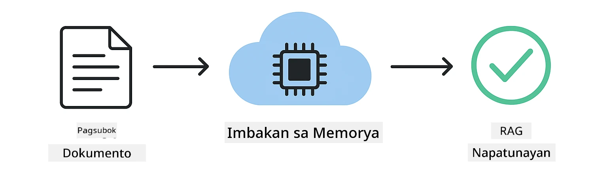

# Pagsusuri ng mga Aplikasyon ng LangChain4j

## Talaan ng Nilalaman

- [Mabilis na Pagsisimula](#mabilis-na-pagsisimula)
- [Saklaw ng mga Pagsusuri](#saklaw-ng-mga-pagsusuri)
- [Pagpapatakbo ng mga Pagsusuri](#pagpapatakbo-ng-mga-pagsusuri)
- [Pagpapatakbo ng Pagsusuri sa VS Code](#pagpapatakbo-ng-pagsusuri-sa-vs-code)
- [Mga Pattern ng Pagsusuri](#mga-pattern-ng-pagsusuri)
- [Pilosopiya ng Pagsusuri](#pilosopiya-ng-pagsusuri)
- [Mga Susunod na Hakbang](#mga-susunod-na-hakbang)

Ang gabay na ito ay naglalakad sa iyo sa mga pagsusuring nagpapakita kung paano magsuri ng mga AI na aplikasyon nang hindi nangangailangan ng mga susi ng API o panlabas na serbisyo.

## Mabilis na Pagsisimula

Patakbuhin lahat ng pagsusuri gamit ang isang utos:

**Bash:**
```bash
mvn test
```

**PowerShell:**
```powershell
mvn --% test
```

Kapag lahat ng pagsusuri ay pumasa, makikita mo ang output na tulad ng screenshot sa ibaba — walang nabigong pagsusuri.



*Matagumpay na pagpapatupad ng pagsusuri na nagpapakita ng lahat ng pagsusuri ay pumapasa na walang kabiguan*

## Saklaw ng mga Pagsusuri

Ang kursong ito ay nakatuon sa **unit tests** na tumatakbo lokal. Bawat pagsusuri ay nagpapakita ng isang partikular na konsepto ng LangChain4j nang hiwalay. Ipinapakita ng testing pyramid sa ibaba kung saan nababagay ang mga unit test — bumubuo sila ng mabilis at maaasahang pundasyon na pinagtatayohan ng iyong istratehiya sa pagsusuri.



*Testing pyramid na nagpapakita ng balanse sa pagitan ng unit tests (mabilis, hiwalay), integration tests (tunay na mga bahagi), at end-to-end tests. Sakop ng pagsasanay na ito ang unit testing.*

| Module | Mga Pagsusuri | Pokus | Pangunahing Mga File |
|--------|--------------|-------|---------------------|
| **01 - Panimula** | 8 | Memorya ng usapan at stateful chat | `SimpleConversationTest.java` |
| **02 - Prompt Engineering** | 12 | Mga pattern ng GPT-5.2, lebel ng kasigasigan, istrakturang output | `SimpleGpt5PromptTest.java` |
| **03 - RAG** | 10 | Pag-angkat ng dokumento, embeddings, paghahanap ng pagkakatulad | `DocumentServiceTest.java` |
| **04 - Mga Kasangkapan** | 12 | Pagtawag sa function at chain ng mga kasangkapan | `SimpleToolsTest.java` |
| **05 - MCP** | 8 | Model Context Protocol gamit ang Stdio transport | `SimpleMcpTest.java` |

## Pagpapatakbo ng mga Pagsusuri

**Patakbuhin lahat ng pagsusuri mula sa root:**

**Bash:**
```bash
mvn test
```

**PowerShell:**
```powershell
mvn --% test
```

**Patakbuhin ang mga pagsusuri para sa isang partikular na module:**

**Bash:**
```bash
cd 01-introduction && mvn test
# O mula sa ugat
mvn test -pl 01-introduction
```

**PowerShell:**
```powershell
cd 01-introduction; mvn --% test
# O mula sa ugat
mvn --% test -pl 01-introduction
```

**Patakbuhin ang isang test class:**

**Bash:**
```bash
mvn test -Dtest=SimpleConversationTest
```

**PowerShell:**
```powershell
mvn --% test -Dtest=SimpleConversationTest
```

**Patakbuhin ang isang partikular na test method:**

**Bash:**
```bash
mvn test -Dtest=SimpleConversationTest#dapatPanatilihinAngKasaysayanNgPag-uusap
```

**PowerShell:**
```powershell
mvn --% test -Dtest=SimpleConversationTest#dapatPanatilihinAngKasaysayanNgUsapan
```

## Pagpapatakbo ng Pagsusuri sa VS Code

Kung gumagamit ka ng Visual Studio Code, ang Test Explorer ay nagbibigay ng grapikal na interface para sa pagpapatakbo at pag-debug ng mga pagsusuri.



*VS Code Test Explorer na nagpapakita ng puno ng mga pagsusuri kasama ang lahat ng Java test classes at indibidwal na mga test method*

**Para patakbuhin ang mga pagsusuri sa VS Code:**

1. Buksan ang Test Explorer sa pamamagitan ng pag-click sa icon ng beaker sa Activity Bar
2. Palawakin ang puno ng pagsusuri para makita lahat ng mga module at test classes
3. I-click ang play button sa tabi ng anumang pagsusuri para patakbuhin ito nang paisa-isa
4. I-click ang "Run All Tests" para patakbuhin ang buong suite
5. I-right click ang anumang pagsusuri at piliin ang "Debug Test" upang mag-set ng mga breakpoint at sundan ang code

Ipinapakita ng Test Explorer ang mga berdeng checkmark para sa mga pumasa na pagsusuri at nagbibigay ng detalyadong mga mensahe kapag may kabiguan ang pagsusuri.

## Mga Pattern ng Pagsusuri

### Pattern 1: Pagsusuri ng mga Prompt Templates

Ang pinakasimpleng pattern ay sinusuri ang mga prompt template nang hindi tumatawag sa anumang AI model. Nini-verify mo na tama ang variable substitution at naka-format nang ayon sa inaasahan ang mga prompt.


*Pagsusuri ng mga prompt template na nagpapakita ng daloy ng variable substitution: template na may placeholders → inilalapat na mga halaga → naverify ang naka-format na output*

```java
@Test
@DisplayName("Should format prompt template with variables")
void testPromptTemplateFormatting() {
    PromptTemplate template = PromptTemplate.from(
        "Best time to visit {{destination}} for {{activity}}?"
    );
    
    Prompt prompt = template.apply(Map.of(
        "destination", "Paris",
        "activity", "sightseeing"
    ));
    
    assertThat(prompt.text()).isEqualTo("Best time to visit Paris for sightseeing?");
}
```

Sinusuri ng pattern na ito na tama ang variable substitution at naka-format nang tama ang mga prompt — hindi kailangan ng API key o tawag sa model.

### Pattern 2: Mocking ng mga Language Model

Kapag sinusuri ang lohika ng usapan, gamitin ang Mockito para gumawa ng mga pekeng modelo na nagbibigay ng nakatakdang sagot. Ginagawa nitong mabilis, libre, at deterministic ang mga pagsusuri.



*Paghahambing na nagpapakita kung bakit mas gusto ang mga mock para sa pagsusuri: mabilis sila, libre, deterministic, at hindi nangangailangan ng API keys*

```java
@ExtendWith(MockitoExtension.class)
class SimpleConversationTest {
    
    private ConversationService conversationService;
    
    @Mock
    private OpenAiOfficialChatModel mockChatModel;
    
    @BeforeEach
    void setUp() {
        ChatResponse mockResponse = ChatResponse.builder()
            .aiMessage(AiMessage.from("This is a test response"))
            .build();
        when(mockChatModel.chat(anyList())).thenReturn(mockResponse);
        
        conversationService = new ConversationService(mockChatModel);
    }
    
    @Test
    void shouldMaintainConversationHistory() {
        String conversationId = conversationService.startConversation();
        
        ChatResponse mockResponse1 = ChatResponse.builder()
            .aiMessage(AiMessage.from("Response 1"))
            .build();
        ChatResponse mockResponse2 = ChatResponse.builder()
            .aiMessage(AiMessage.from("Response 2"))
            .build();
        ChatResponse mockResponse3 = ChatResponse.builder()
            .aiMessage(AiMessage.from("Response 3"))
            .build();
        
        when(mockChatModel.chat(anyList()))
            .thenReturn(mockResponse1)
            .thenReturn(mockResponse2)
            .thenReturn(mockResponse3);

        conversationService.chat(conversationId, "First message");
        conversationService.chat(conversationId, "Second message");
        conversationService.chat(conversationId, "Third message");

        List<ChatMessage> history = conversationService.getHistory(conversationId);
        assertThat(history).hasSize(6); // 3 mensahe mula sa user + 3 mensahe mula sa AI
    }
}
```

Makikita ang pattern na ito sa `01-introduction/src/test/java/com/example/langchain4j/service/SimpleConversationTest.java`. Sini-siguradong consistent ang pag-uugali ng mock upang ma-verify ang tamang pamamahala ng memorya.

### Pattern 3: Pagsusuri ng Paghiwalay ng Usapan

Dapat panatilihing hiwalay ang memorya ng usapan para sa maraming gumagamit. Sinusuri ng test na ito na hindi nagkakahalo ang mga konteksto ng mga usapan.



*Pagsusuri ng paghiwalay ng usapan na nagpapakita ng magkahiwalay na mga memory store para sa iba't ibang gumagamit upang maiwasan ang context mixing*

```java
@Test
void shouldIsolateConversationsByid() {
    String conv1 = conversationService.startConversation();
    String conv2 = conversationService.startConversation();
    
    ChatResponse mockResponse = ChatResponse.builder()
        .aiMessage(AiMessage.from("Response"))
        .build();
    when(mockChatModel.chat(anyList())).thenReturn(mockResponse);

    conversationService.chat(conv1, "Message for conversation 1");
    conversationService.chat(conv2, "Message for conversation 2");

    List<ChatMessage> history1 = conversationService.getHistory(conv1);
    List<ChatMessage> history2 = conversationService.getHistory(conv2);
    
    assertThat(history1).hasSize(2);
    assertThat(history2).hasSize(2);
}
```

Bawat usapan ay nagpapanatili ng sarili nitong independenteng kasaysayan. Sa mga systema sa produksyon, kritikal ang paghiwalay na ito para sa mga aplikasyon na multi-user.

### Pattern 4: Pagsusuri ng mga Kasangkapan nang Hiwa-hiwalay

Ang mga kasangkapan ay mga function na maaaring tawagin ng AI. Suriin sila nang direkta upang masiguro na gumagana sila nang tama anuman ang mga desisyon ng AI.



*Pagsusuri ng mga kasangkapan nang hiwalay na nagpapakita ng execution ng mock tool nang walang tawag sa AI para masiguro ang lohika ng negosyo*

```java
@Test
void shouldConvertCelsiusToFahrenheit() {
    TemperatureTool tempTool = new TemperatureTool();
    String result = tempTool.celsiusToFahrenheit(25.0);
    assertThat(result).containsPattern("77[.,]0°F");
}

@Test
void shouldDemonstrateToolChaining() {
    WeatherTool weatherTool = new WeatherTool();
    TemperatureTool tempTool = new TemperatureTool();

    String weatherResult = weatherTool.getCurrentWeather("Seattle");
    assertThat(weatherResult).containsPattern("\\d+°C");

    String conversionResult = tempTool.celsiusToFahrenheit(22.0);
    assertThat(conversionResult).containsPattern("71[.,]6°F");
}
```

Ang mga pagsusuring ito mula sa `04-tools/src/test/java/com/example/langchain4j/agents/tools/SimpleToolsTest.java` ay nagva-validate ng lohika ng tool nang walang pakikialam ng AI. Ipinapakita ng halimbawa ng chaining kung paano pumapasok ang output ng isang tool bilang input ng isa pa.

### Pattern 5: Pagsusuri ng In-Memory RAG

Tradisyonal na nangangailangan ang mga RAG system ng vector databases at embedding services. Pinapayagan ka ng in-memory na pattern na suriin ang buong pipeline nang walang panlabas na dependencies.



*Workflow ng in-memory RAG testing na nagpapakita ng pag-parse ng dokumento, pag-iimbak ng embedding, at paghahanap ng pagkakatulad nang hindi kailangan ng database*

```java
@Test
void testProcessTextDocument() {
    String content = "This is a test document.\nIt has multiple lines.";
    InputStream inputStream = new ByteArrayInputStream(content.getBytes(StandardCharsets.UTF_8));
    
    DocumentService.ProcessedDocument result = 
        documentService.processDocument(inputStream, "test.txt");

    assertNotNull(result);
    assertTrue(result.segments().size() > 0);
    assertEquals("test.txt", result.segments().get(0).metadata().getString("filename"));
}
```

Ang pagsusuri na ito mula sa `03-rag/src/test/java/com/example/langchain4j/rag/service/DocumentServiceTest.java` ay lumilikha ng dokumento sa memorya at sinisigurong tama ang chunking at metadata handling.

### Pattern 6: MCP Integration Testing

Sini-suri ng MCP module ang integrasyon ng Model Context Protocol gamit ang stdio transport. Sinusuri nito na kaya ng iyong aplikasyon ang pagsugod at pakikipagkomunikasyon sa MCP servers bilang subprocesses.

Ang mga pagsusuri sa `05-mcp/src/test/java/com/example/langchain4j/mcp/SimpleMcpTest.java` ay nagva-validate ng ugali ng MCP client.

**Patakbuhin sila:**

**Bash:**
```bash
cd 05-mcp && mvn test
```

**PowerShell:**
```powershell
cd 05-mcp; mvn --% test
```

## Pilosopiya ng Pagsusuri

Suriin ang iyong code, hindi ang AI. Dapat i-validate ng iyong mga pagsusuri ang code na isinulat mo sa pamamagitan ng pag-check kung paano binubuo ang mga prompt, paano pinamamahalaan ang memorya, at paano ipinapatupad ang mga kasangkapan. Nag-iiba-iba ang mga sagot ng AI at hindi dapat bahagi ng test assertions. Tanungin ang iyong sarili kung tama bang napapalitan ang mga variable sa prompt template, hindi kung tama ang sagot ng AI.

Gumamit ng mocks para sa mga language model. External dependencies ang mga ito na mabagal, mahal, at hindi deterministic. Ginagawa nitong mabilis ang mga pagsusuri na millisecond lamang ang tagal imbes na segundo, libre na walang gastos sa API, at deterministic ang resulta na pare-pareho sa bawat pagkakataon.

Panatilihing independent ang mga pagsusuri. Bawat pagsusuri ay dapat mag-set up ng sarili nitong data, hindi umaasa sa ibang pagsusuri, at naglilinis pagkatapos. Dapat pumasa ang mga pagsusuri anuman ang pagkakasunod ng pagpapatupad.

Suriin ang mga edge case lampas sa masayang landas. Subukan ang mga walang laman na input, napakalaking input, mga espesyal na karakter, invalid na mga parameter, at mga boundary condition. Madalas na inilalantad ng mga ito ang mga bug na hindi nakikita sa normal na paggamit.

Gumamit ng mga deskriptibong pangalan. Ihambing ang `shouldMaintainConversationHistoryAcrossMultipleMessages()` sa `test1()`. Ang una ay nagsasabi nang eksakto kung ano ang sinusuri, na nagpapadali ng pag-debug kapag may kabiguan.

## Mga Susunod na Hakbang

Ngayon na naiintindihan mo na ang mga pattern ng pagsusuri, mag-aral nang mas malalim sa bawat module:

- **[01 - Panimula](../01-introduction/README.md)** - Matutunan ang pamamahala ng memorya ng usapan
- **[02 - Prompt Engineering](../02-prompt-engineering/README.md)** - Maging dalubhasa sa mga pattern ng GPT-5.2 prompting
- **[03 - RAG](../03-rag/README.md)** - Bumuo ng retrieval-augmented generation systems
- **[04 - Mga Kasangkapan](../04-tools/README.md)** - Ipatupad ang function calling at mga chain ng kasangkapan
- **[05 - MCP](../05-mcp/README.md)** - Isama ang Model Context Protocol

Nagbibigay ang README ng bawat module ng detalyadong paliwanag ng mga konseptong sinuri dito.

---

**Navigasyon:** [← Babalik sa Pangunahing Pahina](../README.md)

---

<!-- CO-OP TRANSLATOR DISCLAIMER START -->
**Pagtatanggi**:
Ang dokumentong ito ay isinalin gamit ang serbisyo ng AI translation na [Co-op Translator](https://github.com/Azure/co-op-translator). Bagama't nagsusumikap kami para sa katumpakan, pakatandaan na ang awtomatikong pagsasalin ay maaaring maglaman ng mga pagkakamali o hindi pagkakatugma. Ang orihinal na dokumento sa orihinal nitong wika ang dapat ituring na pangunahing sanggunian. Para sa mahahalagang impormasyon, inirerekomenda ang propesyonal na pagsasalin ng tao. Hindi kami mananagot sa anumang maling pagkakaintindi o maling interpretasyon na nagmula sa paggamit ng pagsasaling ito.
<!-- CO-OP TRANSLATOR DISCLAIMER END -->