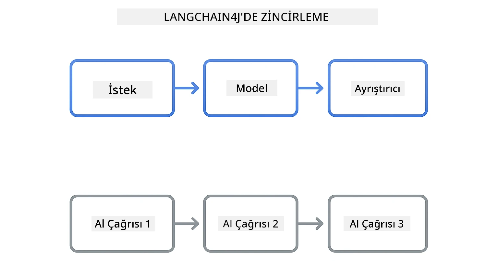
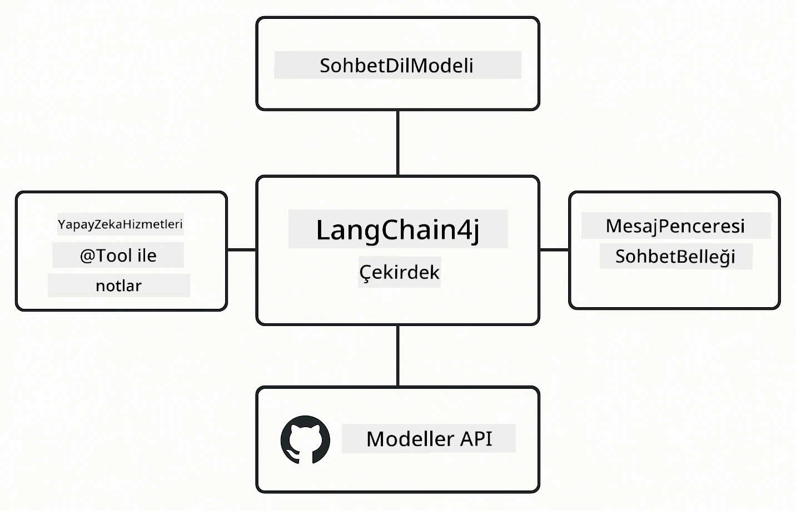

# Modül 00: Hızlı Başlangıç

## İçindekiler

- [Giriş](../../../00-quick-start)
- [LangChain4j Nedir?](../../../00-quick-start)
- [LangChain4j Bağımlılıkları](../../../00-quick-start)
- [Ön Koşullar](../../../00-quick-start)
- [Kurulum](../../../00-quick-start)
  - [1. GitHub Tokenınızı Alın](../../../00-quick-start)
  - [2. Tokenınızı Ayarlayın](../../../00-quick-start)
- [Örnekleri Çalıştırma](../../../00-quick-start)
  - [1. Temel Sohbet](../../../00-quick-start)
  - [2. İleti Şablonları](../../../00-quick-start)
  - [3. Fonksiyon Çağrısı](../../../00-quick-start)
  - [4. Doküman Soru-Cevap (RAG)](../../../00-quick-start)
  - [5. Sorumlu AI](../../../00-quick-start)
- [Her Örnek Neyi Gösteriyor](../../../00-quick-start)
- [Sonraki Adımlar](../../../00-quick-start)
- [Sorun Giderme](../../../00-quick-start)

## Giriş

Bu hızlı başlangıç, sizi LangChain4j ile mümkün olan en hızlı şekilde çalışır duruma getirmek için tasarlanmıştır. LangChain4j ve GitHub Modelleri ile AI uygulamaları oluşturmanın temelini kapsar. Sonraki modüllerde LangChain4j ile Azure OpenAI kullanarak daha gelişmiş uygulamalar inşa edeceksiniz.

## LangChain4j Nedir?

LangChain4j, AI destekli uygulamalar oluşturmayı basitleştiren bir Java kütüphanesidir. HTTP istemcileri ve JSON ayrıştırma ile uğraşmak yerine, temiz Java API'leri ile çalışırsınız.

LangChain'deki "zincir", birbirine bağlı birden çok bileşeni ifade eder - bir istemciyi modele, modele bir ayrıştırıcıya bağlayabilir veya bir çıktının sonraki girdiye beslendiği birden çok AI çağrısını zincirleyebilirsiniz. Bu hızlı başlangıç daha karmaşık zincirleri keşfetmeden önce temel kavramlara odaklanır.



*LangChain4j'da bileşenleri zincirleme - güçlü AI iş akışları oluşturmak için yapı taşları bağlanır*

Üç temel bileşen kullanacağız:

**ChatLanguageModel** - AI model etkileşimleri için arayüz. `model.chat("prompt")` çağırın ve bir yanıt dizesi alın. OpenAI uyumlu uç noktalarla çalışan `OpenAiOfficialChatModel` kullanıyoruz, GitHub Modelleri de bu şekilde.

**AiServices** - Tip güvenliği olan AI servis arayüzleri oluşturur. Metodları tanımlayın, `@Tool` ile not edin ve LangChain4j orkestrasyonu halleder. AI gerektiğinde otomatik olarak Java metodlarınızı çağırır.

**MessageWindowChatMemory** - Konuşma geçmişini tutar. Bunu kullanmazsanız her istek bağımsızdır. Bunu kullandığınızda AI önceki mesajları hatırlar ve çoklu tur arasında bağlam sağlar.



*LangChain4j mimarisi - temel bileşenler birlikte çalışarak AI uygulamalarınızı güçlendirir*

## LangChain4j Bağımlılıkları

Bu hızlı başlangıç [`pom.xml`](../../../00-quick-start/pom.xml) dosyasında iki Maven bağımlılığı kullanır:

```xml
<!-- Core LangChain4j library -->
<dependency>
    <groupId>dev.langchain4j</groupId>
    <artifactId>langchain4j</artifactId> <!-- Inherited from BOM in root pom.xml -->
</dependency>

<!-- OpenAI integration (works with GitHub Models) -->
<dependency>
    <groupId>dev.langchain4j</groupId>
    <artifactId>langchain4j-open-ai-official</artifactId> <!-- Inherited from BOM in root pom.xml -->
</dependency>
```
  
`langchain4j-open-ai-official` modülü, OpenAI uyumlu API'lara bağlanan `OpenAiOfficialChatModel` sınıfını sağlar. GitHub Modelleri aynı API formatını kullandığı için özel bir adaptöre gerek yoktur - sadece temel URL'yi `https://models.github.ai/inference` olarak işaretleyin.

## Ön Koşullar

**Geliştirme Kabını mı Kullanıyorsunuz?** Java ve Maven zaten kuruludur. Sadece bir GitHub Kişisel Erişim Tokenına ihtiyacınız var.

**Yerel Geliştirme:**
- Java 21+, Maven 3.9+
- GitHub Kişisel Erişim Tokenı (aşağıdaki talimatlar)

> **Not:** Bu modül GitHub Modellerinden `gpt-4.1-nano` kullanmaktadır. Kodda model adını değiştirmeyin - GitHub'ın mevcut modelleriyle çalışacak şekilde yapılandırılmıştır.

## Kurulum

### 1. GitHub Tokenınızı Alın

1. [GitHub Ayarları → Kişisel Erişim Tokenları](https://github.com/settings/personal-access-tokens) sayfasına gidin  
2. "Yeni token oluştur" düğmesine tıklayın  
3. Açıklayıcı bir isim verin (örneğin, "LangChain4j Demo")  
4. Oluşum süresi belirleyin (7 gün önerilir)  
5. "Hesap izinleri" altında "Models"i bulun ve "Yalnızca oku" olarak ayarlayın  
6. "Token oluştur" düğmesine tıklayın  
7. Token'ınızı kopyalayın ve kaydedin - tekrar göremeyeceksiniz  

### 2. Tokenınızı Ayarlayın

**Seçenek 1: VS Code Kullanıyorsanız (Önerilen)**

VS Code kullanıyorsanız, tokenınızı proje kökündeki `.env` dosyasına ekleyin.

Eğer `.env` dosyası yoksa, `.env.example` dosyasını `.env` olarak kopyalayın veya kök klasörde yeni bir `.env` dosyası oluşturun.

**Örnek `.env` dosyası:**
```bash
# /workspaces/LangChain4j-for-Beginners/.env içinde
GITHUB_TOKEN=your_token_here
```
  
Ardından Gezginde herhangi bir demo dosyasına (örneğin `BasicChatDemo.java`) sağ tıklayıp **"Run Java"** seçeneğini kullanabilir veya Çalıştır ve Hata Ayıkla panelindeki başlatma yapılandırmalarını kullanabilirsiniz.

**Seçenek 2: Terminal Kullanarak**

Token değerini çevresel değişken olarak ayarlayın:

**Bash:**
```bash
export GITHUB_TOKEN=your_token_here
```
  
**PowerShell:**
```powershell
$env:GITHUB_TOKEN=your_token_here
```
  
## Örnekleri Çalıştırma

**VS Code Kullanıyorsanız:** Gezginde herhangi bir demo dosyaya sağ tıklayın ve **"Run Java"** seçeneğini seçin veya Çalıştır ve Hata Ayıkla panelinden başlatma yapılandırmalarını kullanın (öncelikle tokenınızı `.env` dosyasına eklediğinizden emin olun).

**Maven Kullanarak:** Alternatif olarak komut satırından çalıştırabilirsiniz:

### 1. Temel Sohbet

**Bash:**
```bash
mvn compile exec:java -Dexec.mainClass=com.example.langchain4j.quickstart.BasicChatDemo
```
  
**PowerShell:**
```powershell
mvn --% compile exec:java -Dexec.mainClass=com.example.langchain4j.quickstart.BasicChatDemo
```
  
### 2. İleti Şablonları

**Bash:**
```bash
mvn compile exec:java -Dexec.mainClass=com.example.langchain4j.quickstart.PromptEngineeringDemo
```
  
**PowerShell:**
```powershell
mvn --% compile exec:java -Dexec.mainClass=com.example.langchain4j.quickstart.PromptEngineeringDemo
```
  
Sıfır örnek (zero-shot), az örnek (few-shot), zincirleme düşünce (chain-of-thought) ve rol tabanlı istemleri gösterir.

### 3. Fonksiyon Çağrısı

**Bash:**
```bash
mvn compile exec:java -Dexec.mainClass=com.example.langchain4j.quickstart.ToolIntegrationDemo
```
  
**PowerShell:**
```powershell
mvn --% compile exec:java -Dexec.mainClass=com.example.langchain4j.quickstart.ToolIntegrationDemo
```
  
AI gerektiğinde Java metodlarınızı otomatik olarak çağırır.

### 4. Doküman Soru-Cevap (RAG)

**Bash:**
```bash
mvn compile exec:java -Dexec.mainClass=com.example.langchain4j.quickstart.SimpleReaderDemo
```
  
**PowerShell:**
```powershell
mvn --% compile exec:java -Dexec.mainClass=com.example.langchain4j.quickstart.SimpleReaderDemo
```
  
`document.txt` içeriği ile ilgili sorular sorun.

### 5. Sorumlu AI

**Bash:**
```bash
mvn compile exec:java -Dexec.mainClass=com.example.langchain4j.quickstart.ResponsibleAIDemo
```
  
**PowerShell:**
```powershell
mvn --% compile exec:java -Dexec.mainClass=com.example.langchain4j.quickstart.ResponsibleAIDemo
```
  
AI güvenlik filtrelerinin zararlı içeriği nasıl engellediğini görün.

## Her Örnek Neyi Gösteriyor

**Temel Sohbet** - [BasicChatDemo.java](../../../00-quick-start/src/main/java/com/example/langchain4j/quickstart/BasicChatDemo.java)

Buradan başlayın; LangChain4j'ın en basit haliyle nasıl çalıştığını görün. Bir `OpenAiOfficialChatModel` oluşturur, `.chat()` ile istem gönderir ve yanıt alırsınız. Bu temel modeli, özel uç noktalar ve API anahtarlarıyla nasıl başlatacağınızı gösterir. Bu modeli anladıktan sonra her şey bunun üzerine kurulur.

```java
ChatLanguageModel model = OpenAiOfficialChatModel.builder()
    .baseUrl("https://models.github.ai/inference")
    .apiKey(System.getenv("GITHUB_TOKEN"))
    .modelName("gpt-4.1-nano")
    .build();

String response = model.chat("What is LangChain4j?");
System.out.println(response);
```
  
> **🤖 [GitHub Copilot](https://github.com/features/copilot) Chat ile Deneyin:** [`BasicChatDemo.java`](../../../00-quick-start/src/main/java/com/example/langchain4j/quickstart/BasicChatDemo.java) dosyasını açın ve sorun:  
> - "GitHub Modellerinden Azure OpenAI'ye bu kodda nasıl geçiş yaparım?"  
> - "OpenAiOfficialChatModel.builder() içinde hangi diğer parametreleri yapılandırabilirim?"  
> - "Tam yanıtı beklemek yerine akışlı yanıtlar (streaming) nasıl eklerim?"

**İleti Mühendisliği** - [PromptEngineeringDemo.java](../../../00-quick-start/src/main/java/com/example/langchain4j/quickstart/PromptEngineeringDemo.java)

Artık modele nasıl konuşacağınızı bildiğinize göre, ona ne söylediğinizi keşfedelim. Bu demo aynı model kurulumu ile dört farklı istem deseni gösterir. Doğrudan yönergeler için sıfır örnek, örneklerden öğrenme için az örnek, mantık adımlarını gösteren zincirleme düşünce ve bağlam belirleyen rol tabanlı istemleri deneyin. Aynı modelin, isteğinizi nasıl sunduğunuza göre dramatik şekilde farklı sonuçlar verdiğini göreceksiniz.

```java
PromptTemplate template = PromptTemplate.from(
    "What's the best time to visit {{destination}} for {{activity}}?"
);

Prompt prompt = template.apply(Map.of(
    "destination", "Paris",
    "activity", "sightseeing"
));

String response = model.chat(prompt.text());
```
  
> **🤖 [GitHub Copilot](https://github.com/features/copilot) Chat ile Deneyin:** [`PromptEngineeringDemo.java`](../../../00-quick-start/src/main/java/com/example/langchain4j/quickstart/PromptEngineeringDemo.java) dosyasını açın ve sorun:  
> - "Sıfır örnek ile az örnek istem arasındaki fark nedir ve ne zaman kullanmalıyım?"  
> - "Sıcaklık (temperature) parametresi model yanıtlarını nasıl etkiler?"  
> - "Üretimde istem enjeksiyon saldırılarını önlemek için hangi teknikleri kullanabilirim?"  
> - "Yaygın desenler için yeniden kullanılabilir PromptTemplate nesnelerini nasıl oluştururum?"

**Araç Entegrasyonu** - [ToolIntegrationDemo.java](../../../00-quick-start/src/main/java/com/example/langchain4j/quickstart/ToolIntegrationDemo.java)

Burada LangChain4j güçlü hale gelir. `AiServices` kullanarak Java metodlarınızı çağırabilen bir AI asistanı oluşturacaksınız. Metodları sadece `@Tool("açıklama")` ile not edin ve LangChain4j geri kalanını halleder - AI, kullanıcının isteğine göre hangi aracı ne zaman kullanacağını otomatik belirler. Bu, eylem gerçekleştirebilen, sadece soruları yanıtlamayan AI inşa etmenin anahtarı olan fonksiyon çağrısını gösterir.

```java
@Tool("Performs addition of two numeric values")
public double add(double a, double b) {
    return a + b;
}

MathAssistant assistant = AiServices.create(MathAssistant.class, model);
String response = assistant.chat("What is 25 plus 17?");
```
  
> **🤖 [GitHub Copilot](https://github.com/features/copilot) Chat ile Deneyin:** [`ToolIntegrationDemo.java`](../../../00-quick-start/src/main/java/com/example/langchain4j/quickstart/ToolIntegrationDemo.java) dosyasını açın ve sorun:  
> - "`@Tool` notasyonu nasıl çalışıyor ve LangChain4j arka planda bununla ne yapıyor?"  
> - "AI karmaşık problemleri çözmek için birden çok aracı sırayla çağırabilir mi?"  
> - "Bir araç hata fırlatırsa ne olur - hata yönetimini nasıl yapmalıyım?"  
> - "Bu hesap makinesi örneği yerine gerçek bir API'yi nasıl entegre ederim?"

**Doküman Soru-Cevap (RAG)** - [SimpleReaderDemo.java](../../../00-quick-start/src/main/java/com/example/langchain4j/quickstart/SimpleReaderDemo.java)

Burada RAG’ın (erişim destekli üretim) temellerini göreceksiniz. Modelin eğitim verisine güvenmek yerine, [`document.txt`](../../../00-quick-start/document.txt) içeriğini yükleyip isteme dahil edersiniz. AI sorulara dokümanınıza dayanarak yanıt verir, genel bilgisine göre değil. Kendi verilerinizle çalışabilen sistemler kurmaya ilk adımdır.

```java
Document document = FileSystemDocumentLoader.loadDocument("document.txt");
String content = document.text();

String prompt = "Based on this document: " + content + 
                "\nQuestion: What is the main topic?";
String response = model.chat(prompt);
```
  
> **Not:** Bu basit yaklaşım tüm belgeyi isteğe yükler. Büyük dosyalar (>10KB) için bağlam sınırını aşarsınız. Modül 03, üretim RAG sistemleri için kırpma ve vektör arama konularını kapsar.

> **🤖 [GitHub Copilot](https://github.com/features/copilot) Chat ile Deneyin:** [`SimpleReaderDemo.java`](../../../00-quick-start/src/main/java/com/example/langchain4j/quickstart/SimpleReaderDemo.java) dosyasını açın ve sorun:  
> - "RAG, AI halüsinasyonlarını model eğitimi ile karşılaştırıldığında nasıl önler?"  
> - "Bu basit yöntem ile erişim için vektör gömme arasındaki fark nedir?"  
> - "Bunu birden fazla doküman veya daha büyük bilgi tabanları için nasıl ölçeklendiririm?"  
> - "AI’nın yalnızca verilen bağlamı kullanmasını sağlamak için istemi yapılandırmanın en iyi uygulamaları nelerdir?"

**Sorumlu AI** - [ResponsibleAIDemo.java](../../../00-quick-start/src/main/java/com/example/langchain4j/quickstart/ResponsibleAIDemo.java)

Güvenli AI'yı çok katmanlı savunmayla oluşturun. Bu demo, birlikte çalışan iki koruma katmanını gösterir:

**Bölüm 1: LangChain4j Girdi Koruma Hatları (Input Guardrails)** - Tehlikeli istemlerin LLM’e ulaşmasını engeller. Yasaklı anahtar kelimeleri veya desenleri kontrol eden özel koruma hatları oluşturun. Bunlar kodunuzda çalışır, hızlı ve ücretsizdir.

```java
class DangerousContentGuardrail implements InputGuardrail {
    @Override
    public InputGuardrailResult validate(UserMessage userMessage) {
        String text = userMessage.singleText().toLowerCase();
        if (text.contains("explosives")) {
            return fatal("Blocked: contains prohibited keyword");
        }
        return success();
    }
}
```
  
**Bölüm 2: Sağlayıcı Güvenlik Filtreleri** - GitHub Modelleri, koruma hatlarınızın atlayabileceği şeyleri yakalayan yerleşik filtrelere sahiptir. Ağır ihlaller için sert engeller (HTTP 400 hataları) görürsünüz ve AI’nın kibarca reddettiği yumuşak reddedilmeler olur.

> **🤖 [GitHub Copilot](https://github.com/features/copilot) Chat ile Deneyin:** [`ResponsibleAIDemo.java`](../../../00-quick-start/src/main/java/com/example/langchain4j/quickstart/ResponsibleAIDemo.java) dosyasını açın ve sorun:  
> - "InputGuardrail nedir ve kendi koruma hatlarımı nasıl oluştururum?"  
> - "Sert engelleme ile yumuşak reddetme arasındaki fark nedir?"  
> - "Neden hem koruma hatları hem sağlayıcı filtreleri birlikte kullanmalıyım?"

## Sonraki Adımlar

**Sonraki Modül:** [01-introduction - LangChain4j ile Azure'da gpt-5'e Başlangıç](../01-introduction/README.md)

---

**Geçiş:** [← Ana Sayfaya Dön](../README.md) | [Sonraki: Modül 01 - Giriş →](../01-introduction/README.md)

---

## Sorun Giderme

### İlk Maven Derlemesi

**Sorun:** İlk `mvn clean compile` veya `mvn package` uzun sürüyor (10-15 dakika)

**Neden:** Maven, ilk derlemede tüm proje bağımlılıklarını indirir (Spring Boot, LangChain4j kütüphaneleri, Azure SDK'ları vb.).

**Çözüm:** Bu normaldir. Sonraki derlemeler çok daha hızlı olacaktır çünkü bağımlılıklar yerel olarak önbelleğe alınır. İndirme süresi ağ hızınıza bağlıdır.

### PowerShell Maven Komut Sözdizimi

**Sorun:** Maven komutları `Unknown lifecycle phase ".mainClass=..."` hatasıyla başarısız oluyor

**Neden:** PowerShell, `=` işaretini değişken atama operatörü olarak yorumlar ve Maven özellik sözdizimini bozar
**Çözüm**: Maven komutundan önce durdurma ayrıştırma operatörü `--%` kullanın:

**PowerShell:**
```powershell
mvn --% compile exec:java -Dexec.mainClass=com.example.langchain4j.quickstart.BasicChatDemo
```

**Bash:**
```bash
mvn compile exec:java -Dexec.mainClass=com.example.langchain4j.quickstart.BasicChatDemo
```

`--%` operatörü, PowerShell'e kalan tüm argümanları Maven'a yorumlamadan olduğu gibi geçmesini söyler.

### Windows PowerShell Emoji Görüntüleme

**Sorun**: AI yanıtlarında PowerShell’de emoji yerine garip karakterler (örn. `????` veya `â??`) görünmesi

**Neden**: PowerShell’in varsayılan kodlaması UTF-8 emojilerini desteklemiyor

**Çözüm**: Java uygulamalarını çalıştırmadan önce şu komutu kullanın:
```cmd
chcp 65001
```

Bu, terminalde UTF-8 kodlamasını zorlar. Alternatif olarak, daha iyi Unicode desteği olan Windows Terminal kullanabilirsiniz.

### API Çağrılarında Hata Ayıklama

**Sorun**: Kimlik doğrulama hataları, hız sınırları veya AI modelinden beklenmeyen yanıtlar

**Çözüm**: Örneklerde `.logRequests(true)` ve `.logResponses(true)` ile API çağrıları konsolda gösteriliyor. Bu, kimlik doğrulama hataları, hız sınırları veya beklenmeyen yanıtların hata ayıklamasında yardımcı olur. Üretimde log gürültüsünü azaltmak için bu bayrakları kaldırın.

---

<!-- CO-OP TRANSLATOR DISCLAIMER START -->
**Sorumluluk Reddi**:  
Bu belge, AI çeviri servisi [Co-op Translator](https://github.com/Azure/co-op-translator) kullanılarak çevrilmiştir. Doğruluk için çaba gösterilse de, otomatik çevirilerin hatalar veya yanlışlıklar içerebileceğini lütfen unutmayınız. Orijinal belge, yetkili kaynak olarak kabul edilmelidir. Kritik bilgiler için profesyonel insan çevirisi önerilir. Bu çevirinin kullanımı sonucunda oluşabilecek yanlış anlamalar veya yorum hatalarından sorumlu değiliz.
<!-- CO-OP TRANSLATOR DISCLAIMER END -->