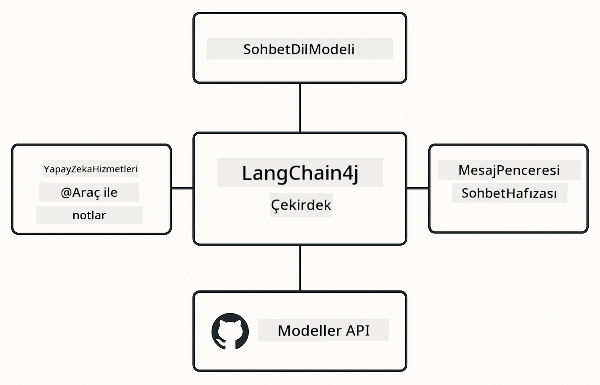

<!--
CO_OP_TRANSLATOR_METADATA:
{
  "original_hash": "377b3e3e6f8d02965bf0fbbc9ccb45c5",
  "translation_date": "2025-12-13T14:54:56+00:00",
  "source_file": "00-quick-start/README.md",
  "language_code": "tr"
}
-->
# Modül 00: Hızlı Başlangıç

## İçindekiler

- [Giriş](../../../00-quick-start)
- [LangChain4j Nedir?](../../../00-quick-start)
- [LangChain4j Bağımlılıkları](../../../00-quick-start)
- [Ön Koşullar](../../../00-quick-start)
- [Kurulum](../../../00-quick-start)
  - [1. GitHub Token'ınızı Alın](../../../00-quick-start)
  - [2. Token'ınızı Ayarlayın](../../../00-quick-start)
- [Örnekleri Çalıştırın](../../../00-quick-start)
  - [1. Temel Sohbet](../../../00-quick-start)
  - [2. İstem Desenleri](../../../00-quick-start)
  - [3. Fonksiyon Çağrısı](../../../00-quick-start)
  - [4. Belge Soru-Cevap (RAG)](../../../00-quick-start)
- [Her Örnek Ne Gösteriyor](../../../00-quick-start)
- [Sonraki Adımlar](../../../00-quick-start)
- [Sorun Giderme](../../../00-quick-start)

## Giriş

Bu hızlı başlangıç, LangChain4j ile mümkün olan en hızlı şekilde çalışmaya başlamanız için tasarlanmıştır. LangChain4j ve GitHub Modelleri ile AI uygulamaları oluşturmanın temelini kapsar. Sonraki modüllerde Azure OpenAI'yi LangChain4j ile kullanarak daha gelişmiş uygulamalar inşa edeceksiniz.

## LangChain4j Nedir?

LangChain4j, AI destekli uygulamalar oluşturmayı basitleştiren bir Java kütüphanesidir. HTTP istemcileri ve JSON ayrıştırma ile uğraşmak yerine, temiz Java API'leri ile çalışırsınız.

LangChain'deki "zincir", birden çok bileşeni birbirine bağlamayı ifade eder - bir istemi modele, modele bir ayrıştırıcıya bağlayabilir veya bir çıktının sonraki girdiye beslendiği birden çok AI çağrısını zincirleyebilirsiniz. Bu hızlı başlangıç, daha karmaşık zincirleri keşfetmeden önce temelleri ele alır.


*LangChain4j'de bileşenlerin zincirlenmesi - yapı taşları güçlü AI iş akışları oluşturmak için bağlanır*

Üç temel bileşen kullanacağız:

**ChatLanguageModel** - AI model etkileşimleri için arayüz. `model.chat("prompt")` çağırın ve bir yanıt dizesi alın. OpenAI uyumlu uç noktalarla çalışan `OpenAiOfficialChatModel` kullanıyoruz, GitHub Modelleri gibi.

**AiServices** - Tür güvenli AI servis arayüzleri oluşturur. Metotları tanımlayın, `@Tool` ile not edin ve LangChain4j orkestrasyonu halleder. AI gerektiğinde Java metotlarınızı otomatik çağırır.

**MessageWindowChatMemory** - Konuşma geçmişini korur. Bunu kullanmazsanız, her istek bağımsızdır. Kullanırsanız, AI önceki mesajları hatırlar ve birden çok tur boyunca bağlamı sürdürür.



*LangChain4j mimarisi - temel bileşenler AI uygulamalarınızı güçlendirmek için birlikte çalışır*

## LangChain4j Bağımlılıkları

Bu hızlı başlangıç, [`pom.xml`](../../../00-quick-start/pom.xml) dosyasında iki Maven bağımlılığı kullanır:

```xml
<!-- Core LangChain4j library -->
<dependency>
    <groupId>dev.langchain4j</groupId>
    <artifactId>langchain4j</artifactId> <!-- Inherited from BOM in root pom.xml -->
</dependency>

<!-- OpenAI integration (works with GitHub Models) -->
<dependency>
    <groupId>dev.langchain4j</groupId>
    <artifactId>langchain4j-open-ai-official</artifactId> <!-- Inherited from BOM in root pom.xml -->
</dependency>
```

`langchain4j-open-ai-official` modülü, OpenAI uyumlu API'lere bağlanan `OpenAiOfficialChatModel` sınıfını sağlar. GitHub Modelleri aynı API formatını kullandığından özel bir adaptöre gerek yoktur - sadece temel URL'yi `https://models.github.ai/inference` olarak ayarlayın.

## Ön Koşullar

**Geliştirici Konteyneri mi Kullanıyorsunuz?** Java ve Maven zaten yüklüdür. Sadece bir GitHub Kişisel Erişim Token'ına ihtiyacınız var.

**Yerel Geliştirme:**
- Java 21+, Maven 3.9+
- GitHub Kişisel Erişim Token'ı (aşağıdaki talimatlar)

> **Not:** Bu modül GitHub Modellerinden `gpt-4.1-nano` kullanır. Kodda model adını değiştirmeyin - GitHub'ın mevcut modelleriyle çalışacak şekilde yapılandırılmıştır.

## Kurulum

### 1. GitHub Token'ınızı Alın

1. [GitHub Ayarları → Kişisel Erişim Tokenları](https://github.com/settings/personal-access-tokens) sayfasına gidin
2. "Yeni token oluştur" butonuna tıklayın
3. Anlamlı bir isim verin (örneğin, "LangChain4j Demo")
4. Süre sonu ayarlayın (7 gün önerilir)
5. "Hesap izinleri" altında "Modeller"i bulun ve "Salt okunur" olarak ayarlayın
6. "Token oluştur" butonuna tıklayın
7. Token'ınızı kopyalayın ve kaydedin - bir daha göremeyeceksiniz

### 2. Token'ınızı Ayarlayın

**Seçenek 1: VS Code Kullanarak (Önerilen)**

VS Code kullanıyorsanız, token'ınızı proje kökündeki `.env` dosyasına ekleyin:

Eğer `.env` dosyası yoksa, `.env.example` dosyasını `.env` olarak kopyalayın veya proje kökünde yeni bir `.env` dosyası oluşturun.

**Örnek `.env` dosyası:**
```bash
# /workspaces/LangChain4j-for-Beginners/.env içinde
GITHUB_TOKEN=your_token_here
```

Sonra Explorer'da herhangi bir demo dosyasına (örneğin, `BasicChatDemo.java`) sağ tıklayıp **"Run Java"** seçeneğini kullanabilir veya Çalıştır ve Hata Ayıkla panelindeki başlatma yapılandırmalarını kullanabilirsiniz.

**Seçenek 2: Terminal Kullanarak**

Token'ı ortam değişkeni olarak ayarlayın:

**Bash:**
```bash
export GITHUB_TOKEN=your_token_here
```

**PowerShell:**
```powershell
$env:GITHUB_TOKEN=your_token_here
```

## Örnekleri Çalıştırın

**VS Code Kullanarak:** Explorer'da herhangi bir demo dosyasına sağ tıklayıp **"Run Java"** seçeneğini seçin veya Çalıştır ve Hata Ayıkla panelindeki başlatma yapılandırmalarını kullanın (önce token'ınızı `.env` dosyasına eklediğinizden emin olun).

**Maven Kullanarak:** Alternatif olarak, komut satırından çalıştırabilirsiniz:

### 1. Temel Sohbet

**Bash:**
```bash
mvn compile exec:java -Dexec.mainClass=com.example.langchain4j.quickstart.BasicChatDemo
```

**PowerShell:**
```powershell
mvn --% compile exec:java -Dexec.mainClass=com.example.langchain4j.quickstart.BasicChatDemo
```

### 2. İstem Desenleri

**Bash:**
```bash
mvn compile exec:java -Dexec.mainClass=com.example.langchain4j.quickstart.PromptEngineeringDemo
```

**PowerShell:**
```powershell
mvn --% compile exec:java -Dexec.mainClass=com.example.langchain4j.quickstart.PromptEngineeringDemo
```

Sıfır atış, az atış, düşünce zinciri ve rol tabanlı istemleri gösterir.

### 3. Fonksiyon Çağrısı

**Bash:**
```bash
mvn compile exec:java -Dexec.mainClass=com.example.langchain4j.quickstart.ToolIntegrationDemo
```

**PowerShell:**
```powershell
mvn --% compile exec:java -Dexec.mainClass=com.example.langchain4j.quickstart.ToolIntegrationDemo
```

AI gerektiğinde Java metotlarınızı otomatik çağırır.

### 4. Belge Soru-Cevap (RAG)

**Bash:**
```bash
mvn compile exec:java -Dexec.mainClass=com.example.langchain4j.quickstart.SimpleReaderDemo
```

**PowerShell:**
```powershell
mvn --% compile exec:java -Dexec.mainClass=com.example.langchain4j.quickstart.SimpleReaderDemo
```

`document.txt` içeriği hakkında sorular sorun.

## Her Örnek Ne Gösteriyor

**Temel Sohbet** - [BasicChatDemo.java](../../../00-quick-start/src/main/java/com/example/langchain4j/quickstart/BasicChatDemo.java)

LangChain4j'nin en basit haliyle nasıl çalıştığını görmek için buradan başlayın. Bir `OpenAiOfficialChatModel` oluşturacak, `.chat()` ile bir istem gönderecek ve yanıt alacaksınız. Bu, özel uç noktalar ve API anahtarları ile modelleri nasıl başlatacağınızı gösterir. Bu kalıbı anladıktan sonra her şey bunun üzerine inşa edilir.

```java
ChatLanguageModel model = OpenAiOfficialChatModel.builder()
    .baseUrl("https://models.github.ai/inference")
    .apiKey(System.getenv("GITHUB_TOKEN"))
    .modelName("gpt-4.1-nano")
    .build();

String response = model.chat("What is LangChain4j?");
System.out.println(response);
```

> **🤖 [GitHub Copilot](https://github.com/features/copilot) Chat ile deneyin:** [`BasicChatDemo.java`](../../../00-quick-start/src/main/java/com/example/langchain4j/quickstart/BasicChatDemo.java) dosyasını açın ve sorun:
> - "Bu kodda GitHub Modellerinden Azure OpenAI'ye nasıl geçiş yaparım?"
> - "OpenAiOfficialChatModel.builder() içinde hangi diğer parametreleri yapılandırabilirim?"
> - "Tam yanıtı beklemek yerine akış yanıtları nasıl eklerim?"

**İstem Mühendisliği** - [PromptEngineeringDemo.java](../../../00-quick-start/src/main/java/com/example/langchain4j/quickstart/PromptEngineeringDemo.java)

Artık bir modelle nasıl konuşacağınızı bildiğinize göre, ona ne söylediğinizi keşfedelim. Bu demo aynı model kurulumunu kullanır ancak dört farklı istem desenini gösterir. Doğrudan talimatlar için sıfır atış istemleri, örneklerden öğrenen az atış istemleri, mantık adımlarını ortaya koyan düşünce zinciri istemleri ve bağlam ayarlayan rol tabanlı istemleri deneyin. Aynı modelin, isteğinizi nasıl çerçevelediğinize bağlı olarak dramatik şekilde farklı sonuçlar verdiğini göreceksiniz.

```java
PromptTemplate template = PromptTemplate.from(
    "What's the best time to visit {{destination}} for {{activity}}?"
);

Prompt prompt = template.apply(Map.of(
    "destination", "Paris",
    "activity", "sightseeing"
));

String response = model.chat(prompt.text());
```

> **🤖 [GitHub Copilot](https://github.com/features/copilot) Chat ile deneyin:** [`PromptEngineeringDemo.java`](../../../00-quick-start/src/main/java/com/example/langchain4j/quickstart/PromptEngineeringDemo.java) dosyasını açın ve sorun:
> - "Sıfır atış ve az atış istem arasındaki fark nedir ve hangisini ne zaman kullanmalıyım?"
> - "Sıcaklık parametresi modelin yanıtlarını nasıl etkiler?"
> - "Üretimde istem enjeksiyon saldırılarını önlemek için bazı teknikler nelerdir?"
> - "Yaygın desenler için yeniden kullanılabilir PromptTemplate nesneleri nasıl oluşturabilirim?"

**Araç Entegrasyonu** - [ToolIntegrationDemo.java](../../../00-quick-start/src/main/java/com/example/langchain4j/quickstart/ToolIntegrationDemo.java)

LangChain4j'nin güçlü olduğu yer burasıdır. `AiServices` kullanarak Java metotlarınızı çağırabilen bir AI asistanı oluşturacaksınız. Metotları sadece `@Tool("açıklama")` ile not edin ve LangChain4j gerisini halleder - AI, kullanıcının ne istediğine bağlı olarak hangi aracı kullanacağına otomatik karar verir. Bu, sadece soruları yanıtlamakla kalmayıp eylem alabilen AI oluşturmanın anahtarı olan fonksiyon çağrısını gösterir.

```java
@Tool("Performs addition of two numeric values")
public double add(double a, double b) {
    return a + b;
}

MathAssistant assistant = AiServices.create(MathAssistant.class, model);
String response = assistant.chat("What is 25 plus 17?");
```

> **🤖 [GitHub Copilot](https://github.com/features/copilot) Chat ile deneyin:** [`ToolIntegrationDemo.java`](../../../00-quick-start/src/main/java/com/example/langchain4j/quickstart/ToolIntegrationDemo.java) dosyasını açın ve sorun:
> - "@Tool notasyonu nasıl çalışır ve LangChain4j arka planda bununla ne yapar?"
> - "AI, karmaşık problemleri çözmek için birden fazla aracı sırayla çağırabilir mi?"
> - "Bir araç istisna fırlatırsa ne olur - hataları nasıl yönetmeliyim?"
> - "Bu hesap makinesi örneği yerine gerçek bir API nasıl entegre ederim?"

**Belge Soru-Cevap (RAG)** - [SimpleReaderDemo.java](../../../00-quick-start/src/main/java/com/example/langchain4j/quickstart/SimpleReaderDemo.java)

Burada RAG (erişim destekli üretim) temelini göreceksiniz. Modelin eğitim verilerine güvenmek yerine, [`document.txt`](../../../00-quick-start/document.txt) içeriğini yükler ve isteme dahil edersiniz. AI, genel bilgisi yerine belgenize dayanarak yanıt verir. Bu, kendi verilerinizle çalışabilen sistemler oluşturmanın ilk adımıdır.

```java
Document document = FileSystemDocumentLoader.loadDocument("document.txt");
String content = document.text();

String prompt = "Based on this document: " + content + 
                "\nQuestion: What is the main topic?";
String response = model.chat(prompt);
```

> **Not:** Bu basit yaklaşım tüm belgeyi isteme yükler. Büyük dosyalar (>10KB) için bağlam sınırlarını aşarsınız. Modül 03, üretim RAG sistemleri için parçalara ayırma ve vektör aramayı kapsar.

> **🤖 [GitHub Copilot](https://github.com/features/copilot) Chat ile deneyin:** [`SimpleReaderDemo.java`](../../../00-quick-start/src/main/java/com/example/langchain4j/quickstart/SimpleReaderDemo.java) dosyasını açın ve sorun:
> - "RAG, AI halüsinasyonlarını modelin eğitim verilerini kullanmaya kıyasla nasıl önler?"
> - "Bu basit yaklaşım ile vektör gömme kullanarak erişim arasındaki fark nedir?"
> - "Bunu birden çok belge veya daha büyük bilgi tabanları için nasıl ölçeklendiririm?"
> - "AI'nin sadece sağlanan bağlamı kullanmasını sağlamak için istemi yapılandırmanın en iyi uygulamaları nelerdir?"

## Hata Ayıklama

Örneklerde `.logRequests(true)` ve `.logResponses(true)` kullanılarak API çağrıları konsolda gösterilir. Bu, kimlik doğrulama hataları, hız sınırları veya beklenmeyen yanıtları gidermeye yardımcı olur. Üretimde bu bayrakları kaldırarak günlük gürültüsünü azaltabilirsiniz.

## Sonraki Adımlar

**Sonraki Modül:** [01-introduction - LangChain4j ve Azure'da gpt-5 ile Başlarken](../01-introduction/README.md)

---

**Gezinme:** [← Ana Sayfaya Dön](../README.md) | [Sonraki: Modül 01 - Giriş →](../01-introduction/README.md)

---

## Sorun Giderme

### İlk Maven Derlemesi

**Sorun:** İlk `mvn clean compile` veya `mvn package` uzun sürüyor (10-15 dakika)

**Neden:** Maven, ilk derlemede tüm proje bağımlılıklarını (Spring Boot, LangChain4j kütüphaneleri, Azure SDK'ları vb.) indirir.

**Çözüm:** Bu normal bir davranıştır. Sonraki derlemeler çok daha hızlı olacaktır çünkü bağımlılıklar yerel olarak önbelleğe alınır. İndirme süresi ağ hızınıza bağlıdır.

### PowerShell Maven Komut Sözdizimi

**Sorun:** Maven komutları `Unknown lifecycle phase ".mainClass=..."` hatası veriyor

**Neden:** PowerShell, `=` işaretini değişken atama operatörü olarak yorumlar ve Maven özellik sözdizimini bozar

**Çözüm:** Maven komutundan önce durdurma ayrıştırma operatörü `--%` kullanın:

**PowerShell:**
```powershell
mvn --% compile exec:java -Dexec.mainClass=com.example.langchain4j.quickstart.BasicChatDemo
```

**Bash:**
```bash
mvn compile exec:java -Dexec.mainClass=com.example.langchain4j.quickstart.BasicChatDemo
```

`--%` operatörü, PowerShell'e kalan tüm argümanları yorumlamadan doğrudan Maven'a iletmesini söyler.

### Windows PowerShell Emoji Görüntüleme

**Sorun:** PowerShell'de AI yanıtları emoji yerine bozuk karakterler (örneğin, `????` veya `â??`) gösteriyor

**Neden:** PowerShell'in varsayılan kodlaması UTF-8 emojilerini desteklemiyor

**Çözüm:** Java uygulamalarını çalıştırmadan önce bu komutu çalıştırın:
```cmd
chcp 65001
```

Bu, terminalde UTF-8 kodlamasını zorlar. Alternatif olarak, daha iyi Unicode desteği olan Windows Terminal'i kullanabilirsiniz.

---

<!-- CO-OP TRANSLATOR DISCLAIMER START -->
**Feragatname**:  
Bu belge, AI çeviri servisi [Co-op Translator](https://github.com/Azure/co-op-translator) kullanılarak çevrilmiştir. Doğruluk için çaba gösterilse de, otomatik çevirilerin hatalar veya yanlışlıklar içerebileceğini lütfen unutmayın. Orijinal belge, kendi dilinde yetkili kaynak olarak kabul edilmelidir. Kritik bilgiler için profesyonel insan çevirisi önerilir. Bu çevirinin kullanımı sonucu oluşabilecek yanlış anlamalar veya yorum hatalarından sorumlu değiliz.
<!-- CO-OP TRANSLATOR DISCLAIMER END -->